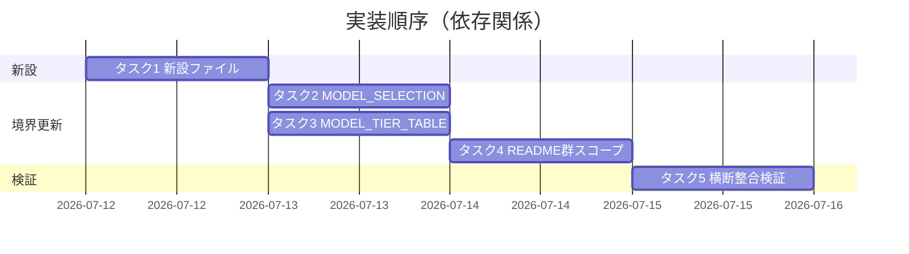

# 実装計画書: Claude 向け推奨デフォルト・モデルティア表を source/platforms/claude/ に置く折衷案（条件付き採用）

**プロジェクト名**: モデルティア推奨デフォルトの platforms 配置検討
**作成日**: 2026 年 07 月 12 日
**最終更新**: 2026 年 07 月 12 日

> **重要**: **このドキュメントは常に更新**する。本計画は [02_設計.md](./02_設計.md) の ADR-A（条件付き採用）を前提に、**implement-feature フェーズで実際に編集/新規作成するファイルと変更内容**を分解する。**本フェーズ（design-feature）では実ファイルの編集・新規作成は行わない**（計画の記載のみ）。
> **前提ゲート**: ADR-A の採否は最終的にメンテナ承認（human_decision・要人間確認）を要する（02 ADR-A）。**不採用（02 ADR-E）に決した場合は本計画のタスク 1〜5 を実行しない**（現状 2 層維持）。以下は**採用が承認された場合**の計画である。
>
> **用語**: [.agent-skill-chain/source/CONCEPTS.md §用語規約](../../../../../.agent-skill-chain/source/CONCEPTS.md#用語規約) を参照。

---

## 1. 実装概要

### 1.1 実装方針

02 の ADR-A〜F に従い、**新設 1 ファイル＋既存 4 ファイルの境界整合更新**を、責務境界（core/platforms/project）を崩さず、重複記載を作らずに行う。推奨デフォルトは抽象ティア水準に限定（ADR-B）、一般推奨のみ（ADR-D）、優先順位は明示 3 層＋表なし時フォールバック（ADR-C）、§汎用/固有境界と platforms/README のスコープを明示更新（ADR-F）。

### 1.2 実装順序

1. **タスク 1**: 新設 `source/platforms/claude/MODEL_TIER_RECOMMENDED.md`（推奨デフォルトの正本）
2. **タスク 2**: 更新 `source/MODEL_SELECTION.md §汎用/固有境界`（ADR-F の但し書き）
3. **タスク 3**: 更新 `project/MODEL_TIER_TABLE.md`（ADR-D の参照化・固有上書きのみ残す）
4. **タスク 4**: 更新 `source/platforms/README.md` スコープ 1 行 ＋ `project/README.md §優先順位` 明確化注記（ADR-F・ADR-C）
5. **タスク 5**: 相互参照・重複・優先順位の整合検証（全ファイル横断）



---

## 2. タスク分解

> **必須**: 各タスクに「テスト観点（2.x.3）」＝**規約整合レビュー観点**（コード非実行のため）と「BDD 仕様（2.x.4）」を記す。BDD は 01 のシナリオ 1〜6 に対応。

### 2.1 タスク 1: 新設 `source/platforms/claude/MODEL_TIER_RECOMMENDED.md`

#### 2.1.1 概要

Claude 採用先一般向けの役割→抽象ティア推奨デフォルト（advisory）の正本ファイルを新規作成する（02 §3.1）。

#### 2.1.2 実装内容

- 新規ファイル作成。02 §3.1 のセクション構成（責務／適用条件／優先順位での位置づけ／役割→推奨ティア表／除外事項／参照）。
- 役割→推奨ティア表（列＝役割｜推奨ティア｜一般適用条件。**モデル ID 列は持たない**＝ADR-B）。想定行（値は本タスクで確定）:
  - 設計・レビュー・監査 → 上位ティア（opus）／品質ゲート直結ゆえ格下げしない
  - 実装 → 中位ティア（sonnet）／複雑作業は上位へエスカレーション
  - ログ記録専任（書記） → 軽量ティア（haiku）
- **除外の明記**（ADR-D 除外基準）: fable 方針・opus 要否先行の順序規定・降格閾値は `project/` に委ねる旨を「除外事項」節に記載。**advisory（助言）ラベルを冒頭責務に明記**（ADR-A・ADR-F、必需物でない）。
- 優先順位ヘッダ: 「project MODEL_TIER_TABLE > 本ファイル > MODEL_SELECTION 抽象原則。いずれの表も無い環境は MODEL_SELECTION §1 のランタイム既定動作へ」（ADR-C の AC-3-1/3-2）。
- frontmatter に新規 document_id（UUID）を付与。

#### 2.1.3 テスト観点（規約整合レビュー）

##### 単体（本タスクの具体ケース・必須）

- 表に**モデル ID（世代付き文字列）が含まれない**こと（ADR-B）。
- **fable 原則禁止・opus 要否先行の順序規定・降格閾値が含まれない**こと（ADR-D 除外基準・AC-4-3）。
- 冒頭に advisory（一般推奨・必需物でない）である旨と、MODEL_SELECTION 抽象原則への従属が明記されていること。

##### 結合/API（該当時）

- 該当なし（外部 API なし）。ファイル間整合はタスク 5 で検証。

##### E2E/受け入れ

- 01 シナリオ 3・4（論点 c・陳腐化）に対応。抽象ティア水準で一般推奨のみが記載されている状態を受け入れとする。

##### バリデーション

- 列構成が「役割｜推奨ティア｜一般適用条件」の 3 列であること。

#### 2.1.4 単体テスト仕様（BDD）

```gherkin
Feature: 推奨デフォルトの抽象度と一般性（論点c・陳腐化）
  Scenario: platforms/claude 推奨デフォルトが抽象ティア水準・一般推奨のみである
    Given source/platforms/claude/MODEL_TIER_RECOMMENDED.md を新設する
    When 役割→推奨ティア表を記述する
    Then 表にはモデルID(世代付き)が含まれない
    And fable原則禁止・opus要否先行の順序規定・降格閾値は含まれない(project/へ委譲)
    And 冒頭に advisory(一般推奨・必需物でない)と MODEL_SELECTION 従属が明記される
```

対応: 01 シナリオ 3（AC-4-1/2/3）・シナリオ 4（AC-6-2）。

#### 2.1.5 依存関係

- なし（最初に作成）。タスク 2・3 が本ファイルを参照する。

#### 2.1.6 見積もり

- **工数**: 中 / **優先度**: 高

### 2.2 タスク 2: 更新 `source/MODEL_SELECTION.md §汎用/固有境界`

#### 2.2.1 概要

「対応表はコアに置かない」の但し書きを追加し、PF 限定名前空間への advisory 推奨デフォルト配置が中立性に反しない旨を明文化する（ADR-F・論点 a）。

#### 2.2.2 実装内容

- §汎用/固有境界の末尾に但し書き 1 段落を追加:
  - 『コア』＝**PF 中立なコア本体（全 PF 共通）**を指す。
  - **PF 限定名前空間 `platforms/<pf>/` への、当該 PF 利用時のみ有効な advisory 推奨デフォルト（抽象ティア水準・本リポ固有運用を含まない）は例外的に許容**する。
  - この例外は advisory に限り、settings.enforce.json 等の機構上の必需物とは根拠が異なる（前例流用しない・AC-2-3）。
- 既存の「対応表はコアに置かない（PF 中立性）」本文は**残したまま**、但し書きで限定する（BR-2・暗黙の骨抜き禁止）。

#### 2.2.3 テスト観点（規約整合レビュー）

##### 単体（必須）

- 追記後、「対応表はコアに置かない」原則と但し書きが**両立**し、暗黙の例外が残らないこと（AC-2-2）。
- 但し書きが **advisory 限定・固有運用除外**を明記していること（AC-2-3）。

##### 結合/API（該当時）

- 該当なし。新設ファイル（タスク 1）との用語一致はタスク 5 で検証。

##### E2E/受け入れ

- 01 シナリオ 1（論点 a・PF 中立性整合）に対応。

##### バリデーション

- 既存本文を削除・改変していない（追記のみ）こと。

#### 2.2.4 単体テスト仕様（BDD）

```gherkin
Feature: PF中立性整合の明文化（論点a）
  Scenario: §汎用/固有境界が限定名前空間への推奨配置を明示例外として許容する
    Given MODEL_SELECTION §汎用/固有境界 が「対応表はコアに置かない(PF中立性)」と規定している
    When 但し書きを追加する
    Then 『コア』はPF中立なコア本体を指すと明確化される
    And platforms/<pf>/ への advisory 推奨デフォルト(抽象ティア・固有運用なし)は例外許容と明記される
    And settings/plugin(機構上の必需物)とは根拠が異なる旨が示され前例を流用しない
    And 既存「対応表はコアに置かない」本文は残り暗黙例外が消える
```

対応: 01 シナリオ 1（AC-2-1/2/3）。

#### 2.2.5 依存関係

- タスク 1（新設ファイルの存在を前提に但し書きが参照する）。

#### 2.2.6 見積もり

- **工数**: 小 / **優先度**: 高

### 2.3 タスク 3: 更新 `project/MODEL_TIER_TABLE.md`（参照化・固有上書きのみ）

#### 2.3.1 概要

一般ティア方向性の正本を platforms/claude へ移し、MODEL_TIER_TABLE は推奨デフォルトを**参照**しつつ本リポ固有の上書き/追加（ADR-1 順序規定・fable 禁止・書記固定・降格手続き）だけを残す（ADR-D・BR-3）。

#### 2.3.2 実装内容

- 対応表の一般行（設計・レビュー・監査=opus、書記=haiku 等）は、推奨デフォルトと一致する旨を**参照で示し再掲を避ける**（例: 「§設計・レビュー・監査=opus は platforms/claude 推奨デフォルトと同じ。本リポでも格下げしない」）。
- 本リポ固有の**上書き/追加**は明示的に残す: opus 要否先行検討（ADR-1 の順序規定）、fable 原則禁止、書記=haiku 固定（`evidence_source: existing_code` の実例参照は維持）、降格の計測閾値・承認フロー・対応表更新手順の委譲。
- 参照リンク（`../source/platforms/claude/MODEL_TIER_RECOMMENDED.md`）を「参照」節に追加。

#### 2.3.3 テスト観点（規約整合レビュー）

##### 単体（必須）

- 一般ティア方向性が platforms/claude と MODEL_TIER_TABLE の**両方に重複記載されていない**こと（正本は platforms/claude・AC-4-2・BR-3）。
- ADR-1 の順序規定・fable 原則禁止が MODEL_TIER_TABLE に**残存**していること（本リポ固有運用の欠落防止・AC-5-2）。

##### 結合/API（該当時）

- 参照リンクが実在ファイル（タスク 1 の新設ファイル）を指すこと（タスク 5 で検証）。

##### E2E/受け入れ

- 01 シナリオ 3（重複回避）・シナリオ 5（ADR-1 と矛盾しない）に対応。

##### バリデーション

- ADR-1 の要旨（opus 要否先行が非裁量手順である旨）が失われていないこと。

#### 2.3.4 単体テスト仕様（BDD）

```gherkin
Feature: 一般推奨と固有運用の重複排除（論点c・AC-4-2）
  Scenario: MODEL_TIER_TABLE が一般行を参照し固有上書きのみ残す
    Given 一般ティア方向性の正本を platforms/claude に置く
    When MODEL_TIER_TABLE を更新する
    Then 一般行(例:設計・レビュー・監査=opus)は再掲されず参照で示される
    And opus要否先行検討(ADR-1)と fable原則禁止は MODEL_TIER_TABLE に残存する
    And platforms/claude への参照リンクが追加される
```

対応: 01 シナリオ 3（AC-4-2）・シナリオ 5（AC-5-2）。

#### 2.3.5 依存関係

- タスク 1（参照先の存在）。

#### 2.3.6 見積もり

- **工数**: 中 / **優先度**: 高

### 2.4 タスク 4: 更新 `source/platforms/README.md` スコープ ＋ `project/README.md §優先順位`

#### 2.4.1 概要

新設ファイルが未記載の暗黙例外にならないよう platforms/README のスコープを 1 行拡張し（ADR-F）、project/README には source 内部サブ層と 3 層順序を README に重複させない明確化注記を加える（ADR-C）。

#### 2.4.2 実装内容

- `source/platforms/README.md` 冒頭スコープ（現行「スキル形式・配備・ツール別設定のみ」）に「**PF 固有のモデルティア推奨デフォルト**」を対象として 1 行追記（暗黙例外排除）。
- `project/README.md §優先順位` に明確化注記を追加:
  - 一般規約「project > source の 2 層」は**維持**。
  - source 内部には PF 限定名前空間（`platforms/<pf>/`）のサブ層があり得る。**project はその全 source（platforms 配下含む）に優先**する。
  - tier ドメインの具体 3 層順序（MODEL_TIER_TABLE > platforms/claude > MODEL_SELECTION）は **tier ドキュメント側を正本**とし README には重複させない（単一責務・spec/06）。

#### 2.4.3 テスト観点（規約整合レビュー）

##### 単体（必須）

- project/README の一般 2 層規約が**改変・削除されていない**こと（注記追加のみ・AC-3-3）。
- tier 固有 3 層順序が README に**重複記載されていない**こと（正本は tier ドキュメント・ADR-C・BR-3）。
- platforms/README スコープにティア推奨が明記され、新設ファイルが未記載でないこと。

##### 結合/API（該当時）

- 該当なし。順序の一意性はタスク 5 で横断検証。

##### E2E/受け入れ

- 01 シナリオ 2（論点 b・優先順位整合）に対応。

##### バリデーション

- 表なし時フォールバック（MODEL_SELECTION §1）への接続言及が tier ドキュメント（タスク 1 ヘッダ）側にあること（AC-3-2）。

#### 2.4.4 単体テスト仕様（BDD）

```gherkin
Feature: 優先順位規約の3層整合（論点b・AC-3）
  Scenario: 一般2層規約を維持しつつ3層順序を重複なく整合させる
    Given project/README.md が「project > source の2層」を規定している
    And 採用時の解決順は project MODEL_TIER_TABLE > platforms/claude > MODEL_SELECTION である
    When README群を更新する
    Then 一般2層規約は改変されず明確化注記のみ追加される
    And source内部にPF限定名前空間サブ層があり project が全sourceに優先する旨が示される
    And tier固有3層順序はtierドキュメントを正本としREADMEに重複しない
    And platforms/README スコープに PF固有ティア推奨が明記される
    And どこにも表が無い環境は MODEL_SELECTION §1 ランタイム既定へ接続される
```

対応: 01 シナリオ 2（AC-3-1/2/3）。

#### 2.4.5 依存関係

- タスク 2（§汎用/固有境界の但し書きと用語を一致させる）。

#### 2.4.6 見積もり

- **工数**: 小 / **優先度**: 中

### 2.5 タスク 5: 横断整合検証（相互参照・重複・優先順位）

#### 2.5.1 概要

新設・更新 5 ファイルの相互参照リンク・用語・優先順位順序・重複排除を横断検証し、ADR-A の 4 条件（i〜iv）が満たされていることを確認する。

#### 2.5.2 実装内容

- 相互参照リンクの実在性・双方向整合（MODEL_TIER_TABLE ↔ platforms/claude、MODEL_SELECTION §汎用/固有境界 ↔ platforms/claude）。
- 一般ティア方向性が **1 箇所（platforms/claude）にのみ**正本として存在（重複ゼロ・BR-3）。
- 優先順位順序が全ファイルで一意（矛盾なし・AC-3-1）。
- ADR-B（モデル ID 不在）・ADR-D（固有運用の分離）・ADR-F（暗黙例外排除）の充足。

#### 2.5.3 テスト観点（規約整合レビュー）

##### 単体（必須）

- `grep` 等で世代付きモデル ID 文字列が platforms/claude 新設ファイルに存在しないこと（ADR-B）。
- 一般行の文言が複数ファイルに重複していないこと（BR-3）。

##### 結合/API（該当時）

- 全参照リンクが解決可能（デッドリンクなし）。

##### E2E/受け入れ

- 01 シナリオ 1〜6 全てのレビュー観点が満たされること。review-docs（実装前ドキュメントレビュー）で最終確認。

##### バリデーション

- 不採用（ADR-E）に決していないこと＝採用承認済みであることの確認（人手・human_decision）。

#### 2.5.4 単体テスト仕様（BDD）

```gherkin
Feature: 横断整合とADR-A 4条件の充足
  Scenario: 5ファイルの参照・重複・優先順位が整合する
    Given 新設1・更新4ファイルが適用されている
    When 横断整合を検証する
    Then 一般ティア方向性の正本は platforms/claude 1箇所のみ存在する
    And 全相互参照リンクが解決可能でデッドリンクがない
    And 優先順位順序が全ファイルで一意である
    And ADR-A の4条件(抽象ティア限定・一般推奨のみ・3層整合・明示例外)が全て満たされる
```

対応: 01 シナリオ 1〜6 の統合検証。

#### 2.5.5 依存関係

- タスク 1〜4（全て完了後）。

#### 2.5.6 見積もり

- **工数**: 小 / **優先度**: 高

---

## テスト観点

本計画は規約ドキュメントの設計変更のため、テスト＝**規約整合レビュー観点**（コード非実行）。各タスク §2.x.3 に具体ケースを記載。クリティカル観点は「重複ゼロ（BR-3）」「暗黙例外ゼロ（AC-2-2）」「モデル ID 焼き込みゼロ（ADR-B）」「固有運用の非混入（AC-4-3）」の 4 点。監査で本セクションの存在と各タスクの観点充足を検査する。

---

## 単体テスト

各タスク §2.x.4 の BDD（Given/When/Then）を単体レビュー仕様とする。コード実行を伴わないため、検証は文書レビュー（review-docs）＋ `grep` 等の機械的チェック（モデル ID 不在・重複行検出・デッドリンク検出）で行う。

---

## BDD

01 のシナリオとの対応表:

| 01 シナリオ | 論点/AC | 対応タスク（BDD） |
| ---- | ---- | ---- |
| シナリオ 1: PF 中立性整合 | 論点 a・AC-2 | タスク 2 |
| シナリオ 2: 優先順位規約整合 | 論点 b・AC-3 | タスク 4 |
| シナリオ 3: 一般推奨と固有運用の分離 | 論点 c・AC-4 | タスク 1・タスク 3 |
| シナリオ 4: 陳腐化耐性 | 制約 1・AC-6-2 | タスク 1（ADR-B） |
| シナリオ 5: ADR-1 との関係 | AC-5 | タスク 3（02 ADR-E） |
| シナリオ 6: 不採用（2 層維持） | AC-1-3 | 02 ADR-E（本計画は非実行＝計画冒頭の前提ゲート） |

---

## 3. 実装スケジュール

### 3.1 マイルストーン

| マイルストーン | 期日 | 成果物 |
| ---- | ---- | ---- |
| M1: 推奨デフォルト新設 | 実装フェーズ Day1 | MODEL_TIER_RECOMMENDED.md |
| M2: 境界更新完了 | 実装フェーズ Day2 | MODEL_SELECTION/MODEL_TIER_TABLE/README 群更新 |
| M3: 横断整合検証・review-docs | 実装フェーズ Day3 | 整合済み 5 ファイル＋レビュー証跡 |

### 3.2 実装フェーズ

#### フェーズ 1: 新設と境界更新

- **タスク**: タスク 1〜4

#### フェーズ 2: 横断整合検証

- **タスク**: タスク 5 ＋ review-docs

---

## 4. テスト計画

### 4.1 テストの優先順位

- クリティカル観点（重複ゼロ・暗黙例外ゼロ・モデル ID 焼き込みゼロ・固有運用非混入）は必ずレビューで確認。
- 影響範囲が広い MODEL_SELECTION §汎用/固有境界（タスク 2）と MODEL_TIER_TABLE（タスク 3）は横断整合（タスク 5）で回帰確認する。

---

## 5. リスク管理

### 5.1 実装リスク

- **リスク**: タスク 3 の参照化で本リポ固有運用（ADR-1 順序規定・fable 禁止）が誤って削除される。
  - **対策**: タスク 3・5 の単体観点で「固有運用の残存」を必須チェック（AC-5-2）。
- **リスク**: README 更新で tier 固有 3 層順序を README に重複記載してしまう（単一責務違反）。
  - **対策**: ADR-C に従い README は明確化注記のみ。正本は tier ドキュメント。タスク 4・5 で重複検査。
- **リスク**: 採否がメンテナ未承認のまま実装着手（ADR-A の要人間確認を無視）。
  - **対策**: 計画冒頭の前提ゲート。不採用（ADR-E）時はタスク 1〜5 を実行しない。

---

## 6. 参考資料

### プロジェクトドキュメント

- [`02_設計.md`](./02_設計.md) - 設計（ADR-A〜F）
- [`01_要件定義.md`](./01_要件定義.md) / [`00_要求定義.md`](./00_要求定義.md)
- [.agent-skill-chain/source/MODEL_SELECTION.md](../../../../../.agent-skill-chain/source/MODEL_SELECTION.md) / [project/MODEL_TIER_TABLE.md](../../../../../.agent-skill-chain/project/MODEL_TIER_TABLE.md) / [project/README.md](../../../../../.agent-skill-chain/project/README.md) / [platforms/README.md](../../../../../.agent-skill-chain/source/platforms/README.md)

---

## 7. 前のステップ

- **前**: [`02_設計.md`](./02_設計.md) - 設計フェーズ

---

## 8. 次のステップ

- 本 issue は 1 まとまりの規約更新であり、サブ issue 分割は不要（90_issues.md は作成しない）。
- implement-feature 着手**前**に review-docs（実装前ドキュメントレビュー）を必須ゲートとして経る。採否のメンテナ承認（ADR-A・要人間確認）が Go であることを前提とする。
