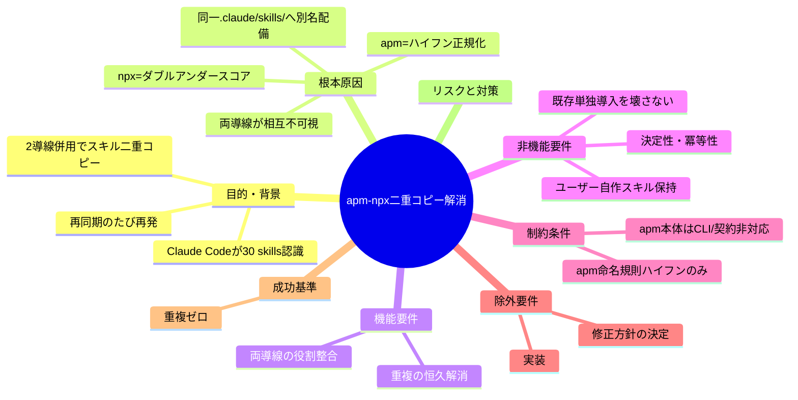

# 要求定義書: apm と npx 導線併用時のスキル二重コピー解消

**プロジェクト名**: apm-npx スキル二重コピー解消
**作成日**: 2026 年 07 月 13 日
**最終更新**: 2026 年 07 月 13 日

> **重要**:
>
> - 要求定義書は、プロジェクトの全体像を把握するためのものです。詳細な技術仕様や実装方法は要件定義書以降で記載します。必要最低限の情報に収めることを心掛けてください。
> - **このドキュメントは常に更新**: 要求の変更や追加があった場合は、即座にこのドキュメントを更新してください。
> - **本 issue は requirement-discovery（要求〜要件）まで**。修正方針の採否（apm 廃止/命名統一/検出スキップ等）は本 issue では決定せず、選択肢として整理するにとどめる（決定は design-feature フェーズまたはユーザー判断）。
>
> **用語**: [.agent-skill-chain/source/CONCEPTS.md §用語規約](../../../../../.agent-skill-chain/source/CONCEPTS.md#用語規約) を参照。

---

## 要求定義の全体像

**注意**: マインドマップは全体像を把握するためのものです。詳細は本文に記載します。

---

## 1. 目的・背景

### 1.1 目的（必須）

apm と npx を併用してもスキルが二重コピーされない状態を実現する。

### 1.2 背景

- **現状の課題**:
  - ユーザーが別プロジェクトで本パッケージを導入し、`apm install` と `npx github:techbeansjp-free/AGENTS.md init` を**両方**実行したところ、Claude Code が **約 30 skills** を認識した（想定の約 2 倍）。同一スキルが 2 重にコピーされている（evidence_source: observed_runtime＝ユーザーのフィールド報告）。
  - 2 導線は互いの配備物を認識しないため、`npx upgrade` や `apm install`（update）を実行するたびに各導線が自分の配備物だけを再同期し、**もう一方の別名コピーは削除されずに残る**。結果として重複が恒久的に再発する（evidence_source: existing_code）。
  - 「apm を廃止して npx に一本化する」という別セッションの提案があるが、その前提（apm はスキルしか配れない・npx が実質必須）自体の正誤を含め、修正方針は未決定である。

- **必要性**:
  - README は apm を「一次配布導線・推奨」、npx を「補助導線」と位置づけている（README.md:49,53,71）が、README に沿って両方を導入すると重複が発生する。推奨導線どおりの操作が不具合を生むため、導線設計の整合が必要。
  - スキル重複は Claude Code のスキル一覧を汚染し、同名機能の別名スキルが並ぶことでオーケストレーション（skill chain 実行）の信頼性・可読性を損なう。

### 1.3 根本原因（本 issue の中核・evidence_source 付き）

「なぜ・どの条件で重複が発生するか」を実読・一次情報調査により特定した。

**核心**: npx 導線と apm 導線（Claude ターゲット）は、**同一の `.claude/skills/` ディレクトリ**へ、**異なる命名規則**で同じスキルを配備する。Claude Code は `.claude/skills/` を走査し両者を別スキルとして数えるため、二重コピーとして顕在化する。

| 経路 | 配備先ディレクトリ | ディレクトリ名の形 | 根拠 |
|------|-------------------|---------------------|------|
| **npx**（init/upgrade → `setup.sh` → `sync_skills`） | `.claude/skills/`（および `.cursor/skills/`） | `{domain}__{capability}`（**ダブルアンダースコア**。例: `architecture__define-boundaries`） | existing_code: `setup.sh:193`・`lib/deploy-skills.sh` の `deploy_skills_impl`（`dest="$out_skills/${domain}__${cap}"`） |
| **apm**（`apm install`。Claude がターゲットに含まれるとき＝`--target claude`／`--target all`／`.claude/` 検出の auto-detect） | `.claude/skills/` | `{domain}-{capability}`（**ハイフン**。例: `architecture-define-boundaries`） | external_spec: apm 公式ドキュメント「Six harnesses converge on the cross-tool `.agents/skills/` directory. **Claude and Kiro keep their harness-native paths (`.claude/skills/`, `.kiro/skills/`)** because those clients' default scan is the per-tool directory.」＋ observed_runtime: apm-package.md（apm v0.24.1 実機で `__`→`-` 正規化を確認） |

- **命名が衝突ではなく共存になる理由**: apm の skill ディレクトリ名規則は「小文字英数字とハイフンのみ・連続ハイフン禁止」（external_spec: apm 公式 producer skills ドキュメント）。本パッケージ正本の `{domain}__{capability}` は apm 展開時に `__`→`-` に正規化され `architecture-define-boundaries` になる。これは npx が置く `architecture__define-boundaries` と**文字列として別名**なので、同じ `.claude/skills/` 内で上書きされず**共存**し、Claude Code からは 2 つの別スキルに見える。
- **恒久再発の理由**: npx 側の再同期 `sync_skills_selective`（`lib/deploy-skills.sh`）は、`list_owned_skill_names` が返す**ダブルアンダースコア名の所有集合のみ**を削除→再配備する。apm が置いたハイフン名は所有集合外＝「ユーザー自作スキル」と見なされ**保持**される（existing_code）。逆に apm 側の再同期・uninstall もダブルアンダースコア名を知らない。**両導線は互いの配備物に対して盲目**であり、どちらを何度実行しても相手のコピーは残る。
- **スキル数の裏付け**: 本パッケージの所有スキルは 15 件（`agent` ＋ 14 個の `{domain}__{capability}`。`list_owned_skill_names` 実行で確認・existing_code）。npx 15 件（ダブルアンダースコア）＋ apm 15 件（ハイフン）＋ apm の `agent-skill-chain-full` バンドル 1 件で**約 30〜31 件**となり、フィールド報告「30 skills」と整合する。

### 1.4 発生条件の切り分け

| ケース | 重複するか | 理由 |
|--------|-----------|------|
| npx 単独 | しない | `.claude/skills/` にダブルアンダースコア名のみ |
| apm 単独（Claude ターゲット） | しない | `.claude/skills/` にハイフン名のみ |
| **apm ＋ npx 併用** | **する** | 同一 `.claude/skills/` に両命名が別名で共存 |

- **重要な付随事実**: apm 単独では重複しないが、apm は**スキルプリミティブしか配れない**（v1 スコープ）。`AGENTS.md`/`CLAUDE.md` 本体・enforcement フック・管理 CLI（uninstall/doctor/enforce/upgrade 等の `bin`）は apm では配備されず、**npx 導線でしか提供されない**（existing_code: `package.json` の `files`／`bin`、`apm-package.md` の v1 スコープ、README §導入）。したがって enforcement 等のフル機能を求める利用者は npx が実質必須であり、「apm 推奨＋npx 補助」という README の位置づけと、「両方入れると壊れる」という実態との間に矛盾がある。この矛盾の扱いも本 issue のスコープに含める（要件は 01 に整理）。

### 1.5 期待される効果（必須: 1 件以上）

- **効果 1**: 推奨手順どおりに導入しても Claude Code のスキル一覧が二重化しない（○/×判定: 導入後 `.claude/skills/` 配下に同一スキルの別名コピーが 0 件）。
- **効果 2**: 再同期（`npx upgrade`／`apm install` 再実行）を繰り返しても重複が再発しない（○/×判定: 冪等）。
- **効果 3**: 導線設計（どの機能をどの導線で配るか・README の推奨表記）が実態と整合する。

---

## 2. 機能要件

### 2.1 既存機能の維持（該当する場合）

- npx 単独導入・apm 単独導入それぞれの既存の正常動作を壊さないこと。
- ユーザー自作スキル（所有集合外のディレクトリ）の保持契約を壊さないこと（`sync_skills_selective`／uninstall の保持契約）。

### 2.2 新規機能要件

- apm と npx を併用した場合にスキルが二重コピーされないための仕組み（具体方式は未決定。§5 の選択肢を design-feature で検討）。
- 併せて、導線の役割分担（apm＝スキル、npx＝契約本体＋enforcement＋管理 CLI）と README の推奨表記の整合。

---

## 3. 非機能要件

### 3.1 パフォーマンス

- 導入・再同期の所要時間に実質的な悪化を与えないこと。

### 3.2 セキュリティ

- 特段の新規要件なし（既存の fail-closed／保持・上書き契約を踏襲）。

### 3.3 互換性

- 既存の単独導入経路（apm 単独・npx 単独）の後方互換を維持する。
- 既に両導線併用で重複が発生している既存プロジェクトに対する是正手段（重複の掃除）を考慮すること。

### 3.4 保守性

- 命名規約の単一正本（`lib/deploy-skills.sh`）・保持集合の単一定義という既存の設計原則を崩さないこと。
- ドキュメント（README・apm-package.md・adapters.md）と実装の整合を保つこと。

---

## 4. 制約条件

### 4.1 技術的制約

- apm のスキルディレクトリ名は「小文字英数字とハイフンのみ・連続ハイフン禁止」（external_spec: apm 公式）。よって apm 側で `{domain}__{capability}`（ダブルアンダースコア）名をそのまま維持することはできない。
- Claude はスキルを `.claude/skills/` から走査する（apm でも Claude ターゲットは `.claude/skills/` へ配備される）。`.agents/skills/` は Claude Code の既定走査対象ではない（external_spec: apm 公式）。
- apm v1 スコープはスキルのみ（`AGENTS.md`/`CLAUDE.md`・enforcement・CLI は apm 非対応）。これは apm 側の仕様制約であり本 issue では変えられない（existing_code, external_spec）。

### 4.2 既存システムとの互換性

- `.adapters/`（Claude/Cursor 生成物）・apm 生成物（`apm.yml`・`.apm/`）・npx 導線（`setup.sh`）は現状「独立チャネルとして共存」設計（apm-package.md §なぜ／adapters.md）。この前提は**併用ケースの重複を明示検討していなかった**ため、設計判断の見直し対象になりうる。

### 4.3 移行期間・スケジュール

- 本 issue は requirement-discovery（00・01）まで。設計・実装は後続フェーズ。

---

## 5. 検討する修正方針の選択肢（決定しない・design-feature へ申し送り）

> **本 issue では採否を決定しない**。以下は公平に列挙した候補であり、トレードオフを添える。フィールド報告にあった「apm 廃止・npx 一本化」は選択肢 A として、他の選択肢と同格に扱う。

- **選択肢 A: apm 導線を廃止し npx に一本化**
  - 長所: 配備経路が 1 本になり重複が原理的に発生しない。npx は既に契約本体・enforcement・CLI・スキルを全て配れる唯一の完全導線。
  - 短所: apm エコシステム（複数ハーネス横断配布・`apm.lock.yaml` による再現性）を捨てる。README・RELEASE・CI（`apm-release` ジョブ）・`release/apm` ブランチ・`platforms/apm/` の撤去が必要。apm 単独で足りていた利用者への影響。「一次配布導線・推奨」という現行方針の全面転換。
  - 前提の要検証: 「npx が実質必須」は本調査で確認済み（existing_code）。ただし apm の横断配布価値を捨ててよいかは製品判断（human_decision 必要）。

- **選択肢 B: 命名規則を統一（npx 側もハイフン `{domain}-{capability}` に合わせる）**
  - 長所: 両導線が同一ディレクトリ名を使えば、同じ `.claude/skills/` 内で**上書き（＝1 つ）**になり別名共存しなくなる。両導線を残せる。
  - 短所: `{domain}__{capability}` の「ドメイン境界を視認できる二重アンダースコア」設計（DESIGN_SYNC_SKILLS_NAMING.md）を変更する必要。ハイフンだと `architecture-define-boundaries` のようにドメインと capability の境界が曖昧化。既存 npx 導入済みプロジェクトに旧ダブルアンダースコア名が残る移行問題。スラッシュコマンド名（`/requirements__write-bdd` 等）の変更影響。上書き成立には SKILL.md の実体・frontmatter が一致する必要があり、両導線の生成物差異（apm はバンドル `agent-skill-chain-full` も置く）を精査する必要。
  - 要検証（要人間確認）: 「同名ディレクトリなら本当に 1 つに統合されるか（片方が他方を上書きするか、あるいは apm/npx の再同期が互いを消し合うか）」は未実機検証（inference_only）。

- **選択肢 C: npx 側が apm 管理エントリを検出してスキップ／協調**
  - 長所: 両導線を残しつつ、npx が `.claude/skills/` に既存する apm 由来（ハイフン名・`apm.lock.yaml` 記載）を検出したらスキル同期を抑止する等で重複回避。
  - 短所: 検出ロジックが複雑（どれが apm 由来かの判定＝`apm.lock.yaml` 解析やハイフン名ヒューリスティック）。apm 側の実装に依存し脆い。apm 側は npx を知らないので片務的協調にとどまる。誤判定でユーザー自作スキルを消すリスク。

- **選択肢 D: 導線の役割を分離（apm はスキルを配らない／npx はスキルを配らない）**
  - 例 D1: apm パッケージからスキルプリミティブを外し、apm は `agent-skill-chain-full` バンドル（参照コンテキスト）のみ配布。個別スキルは npx のみが `.claude/skills/` に配備。
  - 例 D2: 逆に npx はスキル同期を行わず、スキルは apm に委ねる（ただし apm 非対応環境では npx がスキルを配れないと機能欠落）。
  - 長所: 同一ディレクトリに同一スキルを置く主体が 1 つになり重複が消える。両導線を残せる。
  - 短所: どちらに寄せるかで機能欠落／責務移動が生じる。D1 は apm 単独利用者が個別スキルを失う（apm 推奨方針と矛盾）。D2 は apm 未導入の npx 単独利用者がスキルを失う。

> いずれの選択肢でも、**既に重複した既存プロジェクトの掃除**（片方の別名コピー除去）を伴う可能性がある。これも設計時に併せて検討する。

---

## 6. 除外要件

- 修正方針の**決定**（本 issue は選択肢の整理まで。決定は design-feature／human_decision）。
- 実装（02_設計・03_実装計画・コード変更）。
- apm 本体（microsoft/apm）の仕様変更を前提とする解決策（外部依存であり本パッケージで制御不能）。

---

## 7. 成功基準（必須: 1 件以上）

本 issue（requirement-discovery）としての成功基準:

- 根本原因が evidence_source 付きで特定され、00 に記載されている（○: §1.3 に記載済み）。
- 発生条件（併用時のみ／単独では発生しない）が切り分けられている（○: §1.4）。
- 修正方針が複数の選択肢として、トレードオフ付きで公平に列挙され、いずれも「未決定」と明記されている（○: §5）。
- 01_要件定義に BDD で「重複しないこと」の受け入れ基準（Given/When/Then）が記述されている。

（最終製品としての成功基準は、採用方針決定後の後続 issue で確定する。参考: 「推奨手順どおりの導入後、`.claude/skills/` に同一スキルの別名コピーが 0 件」）

---

## 8. リスクと対策

### 8.1 技術的リスク

- **リスク**: apm CLI がローカル未導入のため、`apm install` ＋ `npx init` を同一 tmp プロジェクトで併用した end-to-end 重複の実機再現ができていない。
  - **対策**: 根本原因は (a) apm 公式ドキュメント（external_spec: Claude→`.claude/skills/`）、(b) `setup.sh`/`deploy-skills.sh` の実読（existing_code: npx→`.claude/skills/` ダブルアンダースコア）、(c) apm-package.md の apm v0.24.1 実機確認（observed_runtime: `__`→`-`）、(d) ユーザーのフィールド報告（observed_runtime: 30 skills）の 4 系統で相互裏付けされている。end-to-end 併用の実機再現のみ**要人間確認**として明記する（§9）。

- **リスク**: 選択肢 B（命名統一）が「同名なら 1 つに統合される」という前提は未検証（inference_only）。
  - **対策**: design-feature で apm CLI を用いた tmp 隔離実機検証を必須とする。

### 8.2 スケジュールリスク

- **リスク**: 方針決定に製品判断（apm を残すか）が絡み、requirement-discovery だけでは前に進めない。
  - **対策**: 01 で選択肢ごとの判断材料（トレードオフ・要検証項目）を明示し、ユーザー／design-feature が判断できる状態にする。

---

## 9. 未検証・要人間確認の点

- **end-to-end 実機再現（要人間確認）**: apm CLI 未導入のため、`apm install`（Claude ターゲット）＋ `npx init` を同一プロジェクトで実行した際の `.claude/skills/` の実配置（別名 30 件共存）は本 issue では実機再現していない。根本原因の各構成事実は evidence_source 付きで裏付け済みだが、統合再現は evidence_source: inference_only（ただし observed_runtime のフィールド報告で強く裏付け）。
- **選択肢 B の統合挙動（要人間確認・inference_only）**: 命名統一時に同名ディレクトリが上書き統合されるか、または両導線の再同期が互いを消し合うかは未検証。
- **方針採否（human_decision 必須）**: apm 廃止／命名統一／検出スキップ／役割分離のいずれを採るかは製品判断であり本 issue では決定しない。

---

## 10. 参考資料

### プロジェクトドキュメント

- [`01_要件定義.md`](./01_要件定義.md) - 本 issue の要件定義
- [`docs/maintainer/apm-package.md`](../../../apm-package.md) - apm 生成物・`__`→`-` 正規化の実機確認記載
- [`docs/maintainer/adapters.md`](../../../adapters.md) - Claude/Cursor アダプタ生成方式

### コード・正本（existing_code）

- [`.agent-skill-chain/source/scripts/setup.sh`](../../../../../.agent-skill-chain/source/scripts/setup.sh)（`sync_skills`・:193）
- [`.agent-skill-chain/source/scripts/lib/deploy-skills.sh`](../../../../../.agent-skill-chain/source/scripts/lib/deploy-skills.sh)（`deploy_skills_impl`・`list_owned_skill_names`・`sync_skills_selective`）
- [`.agent-skill-chain/source/scripts/build-adapters.sh`](../../../../../.agent-skill-chain/source/scripts/build-adapters.sh)（`adapter_apm`）
- [`.agent-skill-chain/source/platforms/apm/apm.yml`](../../../../../.agent-skill-chain/source/platforms/apm/apm.yml)（`targets` 未指定＝auto-detect）
- [`src/agents-md.ts`](../../../../../src/agents-md.ts)（npx CLI。`ownedSkillNames`・uninstall の所有集合）

### 外部仕様（external_spec）

- apm 公式ドキュメント（[install リファレンス](https://microsoft.github.io/apm/reference/cli/install/)・[skills producer](https://microsoft.github.io/apm/producer/author-primitives/skills/)）: 「Claude and Kiro keep their harness-native paths (`.claude/skills/`, `.kiro/skills/`)」／スキル名は「小文字英数字とハイフンのみ・連続ハイフン禁止」／`--target` 値（claude, all, agent-skills 等）。

### フィールド報告（observed_runtime）

- ユーザー導入時報告: apm install ＋ npx init 併用で Claude Code が約 30 skills を認識（想定の約 2 倍）。

---

## 11. 次のステップ

この要求定義書の承認後、以下を進めます：

- **本 issue 内**: [`01_要件定義.md`](./01_要件定義.md) - 要件定義（BDD）
- **後続**: design-feature（`02_設計.md`）で修正方針を決定（選択肢 A〜D のトレードオフ評価・apm CLI 実機検証）。
