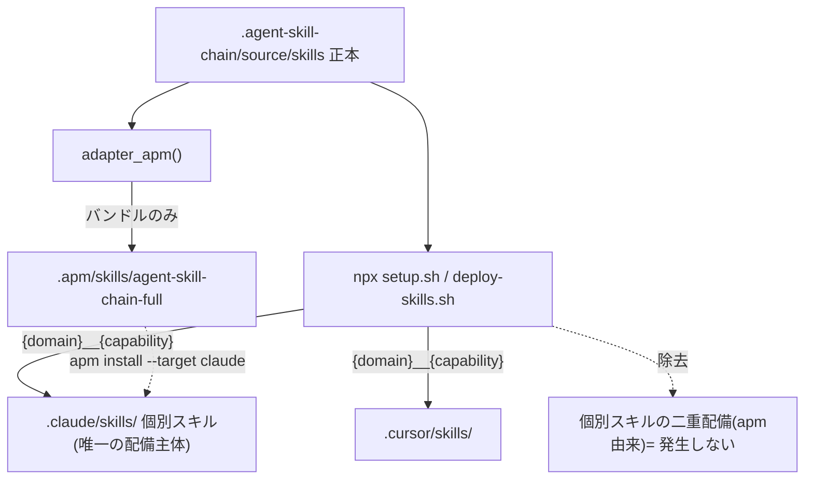
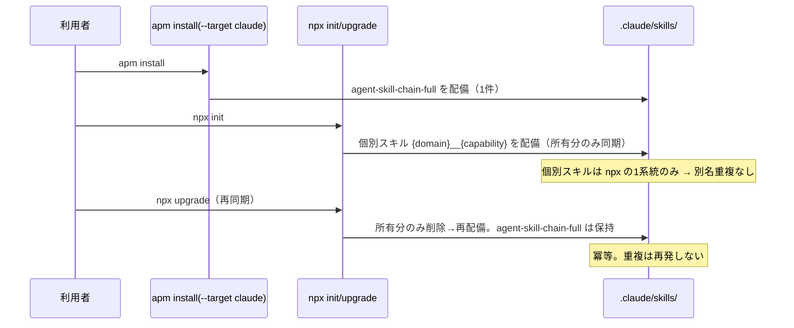

# 設計書: apm と npx 導線併用時のスキル二重コピー解消

**プロジェクト名**: apm-npx スキル二重コピー解消
**作成日**: 2026 年 07 月 13 日
**最終更新**: 2026 年 07 月 13 日

> **重要**: **このドキュメントは常に更新**。設計の変更があれば即座に更新する。
>
> **用語**: [.agent-skill-chain/source/CONCEPTS.md §用語規約](../../../../../.agent-skill-chain/source/CONCEPTS.md#用語規約) を参照。

---

## 1. 設計概要

### 1.1 設計方針

00/01 で特定した根本原因（apm 導線と npx 導線が**同一の `.claude/skills/`** へ**異なる命名規則**で同一スキルを配備し二重コピーになる）を、**「同一物理ディレクトリに個別スキルを配備する主体を 1 つに限定する」構造的分離**で根絶する。修正方針は 00 §5 の選択肢 **D（導線の役割分離）** を採用し、その具体機構として **apm パッケージから個別スキルプリミティブを外し、apm は `agent-skill-chain-full` バンドル 1 件のみを配布する。個別スキルは npx 導線が唯一の配備主体となる**（D1）。npx 側の命名・スラッシュコマンド名・所有集合は一切変更しない。

### 1.2 設計原則（本プロジェクトで適用するもの）

- **単一責務**: 個別スキルの `.claude/skills/`／`.cursor/skills/` への配備責務を **npx 導線に一元化**する。apm は「正本一式の参照コンテキスト（バンドル）配布」に責務を絞る。
- **明確な境界**: 「どの導線がどの成果物を配るか」を境界として固定する（§2.1.2）。同一ディレクトリを 2 主体が別命名で書く状態を排除する。
- **決定性・冪等性**: 衝突回避を実行時検出やヒューリスティックに依存させず、**ビルド成果物の構成そのもの**（apm が個別スキルを持たない）で保証する。再同期を何度繰り返しても重複が発生しない。
- **AIフレンドリー設計**: 変更箇所を `adapter_apm()`・関連ドキュメント・回帰テストに限定し、npx 実装（`setup.sh`／`deploy-skills.sh`／`agents-md.ts`）には触れない小さな変更に保つ。

---

## 2. アーキテクチャ設計

### 2.1 責務・境界・参照関係

#### 2.1.1 責務一覧

| コンポーネント | 責務（1 文） |
|----------------|--------------|
| `adapter_apm()`（build-adapters.sh） | apm 配布物（`apm.yml`・`.apm/`）を生成する。**本 issue 後は個別スキルを配備せず、`agent-skill-chain-full` バンドル 1 件のみを配備する** |
| npx 導線（setup.sh・deploy-skills.sh・agents-md.ts） | `.claude/skills/`・`.cursor/skills/` へ個別スキル（`{domain}__{capability}`・ドメイン直下 `agent`）を選択的同期・保持・除去する（**本 issue で変更しない**） |
| `agent-skill-chain-full`（apm バンドル） | 正本一式（`.agent-skill-chain/source/` 全体）を参照コンテキストとして 1 スキルに同梱する（既存継続） |
| ドキュメント（README・apm-package.md・apm.yml description） | 導線ごとの配布責務と併用時の扱い・既存重複の掃除手順を、実態と整合させて明記する |
| `test/test-build-adapters-apm.sh` | apm 生成物が「個別スキルを含まず・バンドルのみ」を満たすことを回帰検証する |

#### 2.1.2 境界（導線ごとの配布責務・本 issue の中核）

| 成果物 | apm 導線 | npx 導線 | marketplace（副） |
|--------|----------|----------|-------------------|
| 個別スキル（`{domain}__{capability}` 等） | **配らない**（本 issue で除去） | 配る（唯一の主体） | 配る（`.adapters/claude` 経由・独立チャネル） |
| `agent-skill-chain-full` バンドル | 配る | 配らない | 配らない |
| AGENTS.md/CLAUDE.md 本体・enforcement・管理 CLI | 配らない（apm v1 非対応・C2） | 配る | 一部 |

- **入力**: 正本 `.agent-skill-chain/source/skills/`・`.agent-skill-chain/source/`（バンドル同梱元）・手書き `platforms/apm/apm.yml`。
- **出力**: `.apm/skills/agent-skill-chain-full/{SKILL.md,reference/}` のみ（個別 `{domain}__{capability}` ディレクトリは生成しない）。`apm.yml`。
- **他責務との境界**: npx 導線・marketplace（`.adapters/claude`・`.adapters/cursor`）は本 issue の変更対象外（独立チャネルとして不変）。apm CLI 本体（microsoft/apm）の挙動は外部依存であり変更前提としない（BR3）。既存重複の掃除は「手順の提供」に留め、npx への自動検出ロジック追加（選択肢 C）は採らない。

#### 2.1.3 参照関係

- `build-adapters.sh`（ディスパッチャ）→ `adapter_apm()` → `deploy_skills_impl`（**本 issue で呼び出しを削除**）／`bundle_agents_src`（継続）。
- `deploy_skills_impl`・`list_owned_skill_names` は npx 導線（setup.sh・agents-md.ts）から引き続き参照される（命名の単一正本 BR1 は不変）。
- 循環参照なし。npx 導線と apm 導線は互いを参照しない（従来どおり独立）。

### 2.2 システムアーキテクチャ

- **採用パターン**: 生成物構成による構造的分離（build-time separation of concerns）。実行時の協調・検出を持ち込まない。
- **根拠**: [spec/06_設計判断の優先順位.md](../../../../../.agent-skill-chain/source/spec/06_設計判断の優先順位.md)・[spec/01_設計原則.md](../../../../../.agent-skill-chain/source/spec/01_設計原則.md) の「単純さ・決定性を優先し、外部依存の挙動に賭けない」に従う。衝突を実行時に検出して回避する案（C）より、**そもそも衝突する物を作らない**方が単純かつ堅牢。

#### 2.2.1 CQRS

該当なし（状態変更／取得の分離を要する機能ではない）。

#### 2.2.2 アーキテクチャ図



### 2.3 コンポーネント構成

- **apm 生成境界**: `adapter_apm()` のみが `.apm/` を生成する（既存の単一責務を維持）。ステップ 2（`deploy_skills_impl` による個別スキル配備）を削除し、ステップ 3（バンドル）を残す。バンドル `SKILL.md` の本文から「個別スキルも apm で配備される」旨の記述を削り、「個別スキルは npx が配備する／本スキルは参照コンテキスト」に更新する。
- **npx 配備境界**: 変更しない。npx は自身の所有集合（ダブルアンダースコア名）のみ削除→再配備し、apm が置く `agent-skill-chain-full`（所有集合外）は「保持」する（既存の保持契約 BR2 のまま重複を生まない）。

### 2.4 データフロー

イベント駆動は該当なし。配備フローの要点のみ:



### 2.5 横断設計判断（ADR）

#### ADR-1: 修正方針として「導線の役割分離（D1）」を採用する

- **コンテキスト**: apm（Claude ターゲット）と npx が同一 `.claude/skills/` へ別命名（ハイフン名／ダブルアンダースコア名）で同一スキルを配備し、Claude Code が約 30 skills を二重認識する（00 §1.3・01 §1.1）。修正方針を確定する必要がある。
- **検討した選択肢**（00 §5 の A〜D）:
  - **A: apm 廃止・npx 一本化** — 重複は原理的に消えるが、apm エコシステム（横断配布・`apm.lock.yaml` 再現性）・README・RELEASE・CI（`apm-release`）・`release/apm` ブランチ・`platforms/apm/` の全面撤去を伴う製品判断（human_decision）。撤去範囲が大きく可逆性が低い。
  - **B: 命名統一（npx もハイフン `{domain}-{capability}`）** — 同名で上書き統合される「前提」が **apm CLI 実機でしか検証できない**が、apm CLI がローカル未導入で検証不能（inference_only）。加えて `{domain}__{capability}` 設計（DESIGN_SYNC_SKILLS_NAMING.md）変更・スラッシュコマンド名（`/requirements__write-bdd` 等）の破壊的変更・既存 npx 導入済みプロジェクトの移行・両導線の再同期が互いを消し合う懸念が残る。
  - **C: npx 側で apm 由来を検出しスキップ／協調** — 検出ロジック（`apm.lock.yaml` 解析・ハイフン名ヒューリスティック）が複雑で apm 内部に依存し脆く、誤判定でユーザー自作スキルを消すリスク（BR2 抵触リスク）。片務的協調に留まる。
  - **D: 導線の役割分離** — 同一ディレクトリに個別スキルを置く主体を 1 つにする。**D1**（apm はバンドルのみ・個別は npx）と **D2**（npx がスキルを配らず apm に委譲）の 2 変種。D2 は apm 未導入の npx 単独利用者がスキルを失い、npx が完全導線であるという前提（C2）に反する。
- **決定**: **D の D1**（apm パッケージから個別スキルプリミティブを外し、apm は `agent-skill-chain-full` バンドルのみ配布。個別スキルは npx が唯一の配備主体）。**A/B/C は不採用**。
- **根拠**:
  - **evidence_source: existing_code** — 重複の発生機構・保持契約（`deploy-skills.sh` の `list_owned_skill_names`／`sync_skills_selective`、`adapter_apm()` の `deploy_skills_impl` 呼び出し）を実読で確認。npx は所有集合（ダブルアンダースコア名）のみ操作し、`agent-skill-chain-full`（バンドル）は所有集合外＝保持されるため、apm が置くバンドルと npx が置く個別スキルは名前空間が重ならず二重化しない。
  - **evidence_source: observed_runtime**（apm CLI v0.25.0・tmp 隔離環境で実機確認・2026-07-13）— `bash build-adapters.sh apm` の生成物 `.apm/skills/` 直下は `agent-skill-chain-full` の 1 件のみ（個別スキル 0 件）を直接観測。さらに実機 `apm install <local-path> --target claude`（および `--target agent-skills`）を tmp 隔離環境で実行し、`.claude/skills/`（`.agents/skills/`）に統合されるスキルが `agent-skill-chain-full` の **1 件のみ**であることを確認した（`apm install` ログ: `1 skill(s) integrated`）。加えて、事前に npx 所有想定のダミー個別スキル（`.claude/skills/architecture__define-boundaries/`）を配置した状態で同じ `apm install` を実行しても、当該ディレクトリは無改変で残存し、`agent-skill-chain-full` が追加されるのみで衝突・上書きは発生しなかった（併用 end-to-end 実機検証・§9.2/§9.3 の根拠を格上げ）。B の「同名上書き統合」は本検証の対象外（npx 側の命名を変更しない D1 では不要）。
  - 衝突が構造的に不可能（apm の唯一のスキル名 `agent-skill-chain-full` は npx が生成しない）である点に加え、上記の実機併用検証により**観測事実として**裏付けられた点が、他案より**証跡品質が高い**決め手。
  - **evidence_source: external_spec** — apm 公式（Claude→`.claude/skills/`・ディレクトリ名はハイフンのみ・`__`→`-` 正規化）。apm は個別スキルを持たなければ `.claude/skills/` に個別スキル名を一切生成し得ない。
  - **BR3 準拠**: apm 本体の挙動変更を前提としない（自パッケージが何を配るかのみ制御）。**BR1/BR2 準拠**: npx 側の命名正本・保持契約に手を入れない。
- **帰結**:
  - **確定**: `adapter_apm()` は個別スキルを配備しない。`.apm/skills/` は `agent-skill-chain-full` のみ。npx が個別スキルの唯一の配備主体。README・apm-package.md・apm.yml description・回帰テストを整合させる。
  - **影響（要人間確認・human_decision → ユーザー Go 取得済み）**: apm 単独利用者（とくに npx がスキルを配らない Gemini/Copilot/Codex 等、`.agents/skills/` 走査系ハーネス）は**個別の呼び出し可能スキルを失い**、`agent-skill-chain-full` バンドル（参照コンテキスト）のみを得る。これは「apm 一次配布・推奨」という現行 README 方針の**実質的な転換**（npx を完全導線・apm を補助的バンドル配布に位置づけ直す）を含むため、**製品判断としてユーザー確認を要する**。**ユーザーから README.md の推奨導線を npx へ変更する旨の明示指示（2026-07-13）を受け、本 gate は充足済み**。§9.2・03 §8.1 に明記。
  - **不採用の記録**: A（廃止）・B（命名統一）・C（検出スキップ）は本 issue では採らない。B の未検証前提・A の広い撤去範囲・C の脆さが理由。

#### ADR-2: 既存重複の是正は「掃除手順の提供」で満たし、自動検出は追加しない

- **コンテキスト**: 01 ストーリー 5（既存重複プロジェクトの是正）。修正版に更新後も、旧 apm が置いたハイフン名個別スキルが `.claude/skills/` に残りうる。
- **検討した選択肢**: (a) npx に「ハイフン名を検出して削除する」コマンドを追加（＝選択肢 C 相当）／(b) ドキュメントで手動掃除手順（`apm uninstall` またはハイフン名ディレクトリの手動削除）を提供。
- **決定**: **(b) 手順の提供**。01 §2.1 ストーリー 5 の受け入れ基準は「手順**または**コマンド」であり手順で充足する（YAGNI）。
- **根拠**: evidence_source: existing_code（誤判定でユーザー自作スキルを消すリスク）＋ BR2（保持契約）。自動検出は誤削除リスクと apm 依存の脆さを持ち込むため、影響の大きい自動化は本 issue では採らない。
- **帰結**: README／apm-package.md に「既存重複の掃除手順」を追記する。npx の実装（自動検出）は変更しない。

#### ADR-3: 回帰防止は audit.sh ではなくテストで担保する（新規監査番号を採番しない）

- **コンテキスト**: 「apm が再び個別スキルを配る」退行を防ぐガードが必要。並行 issue（②#33・③#34）と監査番号が衝突しないよう配慮が求められている。
- **検討した選択肢**: (a) `audit.sh` に新規チェック番号を追加／(b) 既存 `test/test-build-adapters-apm.sh` の回帰テストで担保。
- **決定**: **(b) テストで担保。`audit.sh` に新規番号を追加しない**。
- **根拠**: evidence_source: existing_code — `.apm/` は `.gitignore` 対象で main にコミットされず、リポジトリ上を走査する `audit.sh` の検査対象に恒常的には存在しない。退行検知は `build-adapters.sh apm` を tmp 実行して生成物を検証する既存テスト（`test-build-adapters-apm.sh`）が適所。
- **帰結**: `audit.sh` は無改変（現在の最大番号は #32。#33・#34 は並行 issue が使用予定で本 issue は**いずれの番号も採番しない**＝非交差を「番号を割り当てないこと」で保証）。退行ガードは `test-build-adapters-apm.sh` の判定を「個別スキル 0 件・バンドルのみ」へ更新することで実現する。

---

## 3. 機能設計

### 3.1 機能 1: apm 個別スキル配備の停止（`adapter_apm()`）

#### 3.1.1 概要

`adapter_apm()` から個別スキル配備（`deploy_skills_impl "$AGENTS/skills" "$apm_root/skills"`）を削除し、`agent-skill-chain-full` バンドルのみを生成する。

#### 3.1.2 処理フロー

```mermaid
flowchart TD
    Start([adapter_apm]) --> Clean[apm.yml/.apm を削除]
    Clean --> Yml[apm.yml を正本からコピー]
    Yml --> Bundle[agent-skill-chain-full を生成 bundle_agents_src]
    Bundle --> Log[配備件数を報告(バンドルのみ)]
    Log --> End([完了])
```

#### 3.1.3 入力・出力

- **入力**: `platforms/apm/apm.yml`・`.agent-skill-chain/source/`。
- **出力**: `.apm/skills/agent-skill-chain-full/{SKILL.md,reference/}`・`apm.yml`。個別 `{domain}__{capability}` は**出力しない**。

#### 3.1.4 エラーハンドリング

既存踏襲（`apm.yml` 正本が無ければ exit 1）。件数ログは「skills を N 件」表記を削り、バンドルのファイル数のみ報告する。

### 3.2 機能 2: ドキュメント整合（README・apm-package.md・apm.yml description）

#### 3.2.1 概要

導線ごとの配布責務（§2.1.2）と併用時の扱い、既存重複の掃除手順（ADR-2）を実態と整合させる。

#### 3.2.2 入力・出力

- 対象: `README.md` §導入 §0、`docs/maintainer/apm-package.md`（なぜ／v1 スコープ／生成物の構成／tmp 検証手順）、`platforms/apm/apm.yml` の `description`、`docs/maintainer/adapters.md`（apm 節は apm-package.md へ委譲のため参照整合のみ確認）。
- 変更内容: apm は個別スキルを配らずバンドルのみ配布する旨、個別スキルは npx が配備する旨、併用しても二重化しない旨、既存重複の掃除手順。

### 3.3 機能 3: 回帰テスト更新（`test-build-adapters-apm.sh`）

#### 3.3.1 概要

「個別スキル件数一致（N==M）」の検証を「個別スキル 0 件・`agent-skill-chain-full` のみ存在」の検証へ置き換える。決定性・除外規則・`.adapters` 非改変・gitignore の各検証は維持する。

---

## 4. データ設計

該当なし（DB スキーマ変更なし）。

---

## 5. API 設計

該当なし（HTTP API 等の変更なし）。導線契約の変更（apm 生成物の構成）は §2.1.2・§3 に記載。

---

## 6. テスト戦略

テスト観点の定義は [RULES §テスト戦略必須要件](../../../../../.agent-skill-chain/source/RULES.md#テスト戦略必須要件)、BDD 形式は [TEST_BDD_FORMAT.md](../../../../../.agent-skill-chain/source/TEST_BDD_FORMAT.md) を参照。本節は対象ごとの割当のみ記載する。

### 6.1 対象ごとのテスト割り当て

| 対象 | 単体 | 結合/API | E2E | クリティカル観点 | バリデーション観点 | 未達理由/補足 |
|------|------|----------|-----|------------------|--------------------|---------------|
| `adapter_apm()` 個別スキル停止 | ○ | ○ | ○ | `.apm/skills/` に `{domain}__{capability}` が 0 件・`agent-skill-chain-full` のみ存在 | バンドル `SKILL.md` の frontmatter `name` 正当 | E2E（apm install 併用）は apm CLI v0.25.0・tmp 隔離環境で実機確認済み（observed_runtime。2026-07-13） |
| apm 生成の決定性 | ○ | × | × | 再生成で `.apm/` が bit 一致 | — | 既存継続 |
| `.adapters/` 非改変・gitignore | × | ○ | × | apm 実行で `.adapters/` 不変・`.apm`/`apm.yml` 非追跡 | — | 既存継続 |
| npx 単独配備（後方互換） | × | ○ | ○ | npx init/uninstall が従来どおり（重複なし） | — | 既存 `e2e-install-uninstall.sh` で担保（変更なし＝非回帰確認） |
| ドキュメント整合 | × | × | × | 導線責務・掃除手順の記載 | — | レビューで確認（審査観点） |

### 6.2 監査・レビューでの確認（証跡）

- `bash test/run-all.sh` を非回帰の基準とする（FAIL=0）。
- 併用 end-to-end（apm install ＋ npx）の実機再現は apm CLI v0.25.0・tmp 隔離環境で実施済み（evidence_source: observed_runtime・2026-07-13）。§9.2/§9.3 に明記。

---

## 7. UI 設計

該当なし。

---

## 8. セキュリティ設計

新規要件なし。既存の fail-closed（`.package-manifest` 検証）・保持契約（BR2）を踏襲する。npx 側の除去ロジックに手を入れないため、ユーザー自作スキル・独自フックの保持契約は不変。

---

## 9. 非機能要件への対応

### 9.1 パフォーマンス

apm 生成物が縮小（個別スキルを配らない）するため、apm ビルド・install の所要は悪化しない（むしろ軽量化）。npx 側は不変。

### 9.2 互換性・要人間確認

- **後方互換（正確な範囲）**: npx 単独は完全に不変（実装無改変）。**apm 単独は「個別スキルを失い `agent-skill-chain-full` バンドルのみになる」＝機能後退を含む**。これは 01 ストーリー 3 の受け入れ基準 1（apm 単独導入でスキルが正しく配備される）の**保護意図に対する意図的な再スコープ**であり、「配備が壊れない」とは主張しない（誤読防止）。01 は要求フェーズで凍結済みのため本設計では改変せず、02/03 側で齟齬を明示し human_decision ゲートに載せる。
- **ストーリー 3 の扱い（明示）**: D1 適用後の apm 単独＝バンドルのみ、を**許容するか**は製品判断。**main 反映前**にユーザー Go を必須ゲートとする（ブランチでの T1〜T4 着手は可。03 §8.1）。npx 単独の後方互換は満たす。
- **要人間確認（human_decision）→ ユーザー Go 取得済み**: apm 単独利用者（とくに npx がスキルを配らない `.agents/skills/` 走査系ハーネス＝Gemini/Copilot/Codex 等）が個別スキルを失う影響、および「apm 一次配布・推奨」方針の転換（npx を完全導線へ）は製品判断であり、実装反映前にユーザー確認を要する（ADR-1 帰結）。**本 gate は、ユーザーから「README.md の推奨導線を npx へ変更する」旨の明示指示（2026-07-13）を受けたことで充足済み**。03 §8.1 参照。
- **検証済み（observed_runtime）**: apm CLI v0.25.0 導入後、tmp 隔離環境で `apm install`＋（npx 所有想定のダミー個別スキルを事前配置した状態での）併用 end-to-end 実機再現を実施した（2026-07-13）。結果: (1) `.apm/skills/`／`apm install` 後の `.claude/skills/`・`.agents/skills/` はいずれも `agent-skill-chain-full` の 1 件のみ、(2) 事前配置したダミー個別スキル（`.claude/skills/architecture__define-boundaries/`）は `apm install` 実行後も無改変で残存し衝突なし。根本原因と D1 の衝突不可能性は existing_code／external_spec に加え、本実機観測で三重に裏付けられた。

### 9.3 D1 成立の前提（バンドルの非再帰走査・実機確認済み）

- `agent-skill-chain-full` バンドルは `reference/.agent-skill-chain/source/skills/{domain}/{capability}/SKILL.md` として**入れ子の SKILL.md を内包する**（`bundle_agents_src` 由来）。D1 が「バンドル＝スキル 1 件」で成立するのは、**Claude Code が `.claude/skills/<name>/SKILL.md` を直下 1 階層でスキル認識し、`reference/` 配下の入れ子 SKILL.md を別スキルとして数えない**前提に依存する。
- **根拠（evidence_source: observed_runtime・apm CLI v0.25.0・tmp 隔離環境・2026-07-13）**: `apm install <local-path> --target claude` 実行後の消費者側 `.claude/skills/agent-skill-chain-full/` 配下には入れ子の SKILL.md が 16 件存在する（`find .claude/skills/agent-skill-chain-full -name SKILL.md | wc -l` = 16）にもかかわらず、**apm 自身が `.claude/skills/` 直下に生成したトップレベルのスキルディレクトリは `agent-skill-chain-full` の 1 件のみ**であり、入れ子の 16 件は apm によって別スキルとして展開・カウントされていない（apm install ログも `1 skill(s) integrated` と報告）。これは apm CLI 自体が非再帰走査であることの直接証跡である。Claude Code 側の走査（`.claude/skills/<name>/SKILL.md` を直下 1 階層で認識するか）についても、フィールド報告の総数が約 30（apm がバンドルも配っていた旧状態で ~45 でない）ことが引き続き非再帰走査を示唆する（observed_runtime・旧データ）ほか、Agent Skills 仕様の走査はトップレベル方式（external_spec）。**apm 側の非再帰性は本実機検証で observed_runtime に格上げ。Claude Code 側の最終的な認識件数確認（verify-and-close／PR 時の実機確認）は、本 issue のスコープ外である Claude Code 本体の挙動確認として引き続き申し送る**（inference_only として残る範囲を明確化）。
- **リスクと対策**: この前提が崩れる（Claude Code 側が再帰走査する）と D1 適用後も総数が戻り修正が無効化する。対策として verify-and-close／PR 時に実機（Claude Code）で `.claude/skills/` の認識件数を確認することを申し送る。

---

## 10. 参考資料

### プロジェクトドキュメント

- [`00_要求定義.md`](./00_要求定義.md) - 要求定義（根本原因・選択肢の詳細）
- [`01_要件定義.md`](./01_要件定義.md) - 要件定義（BDD）
- [`docs/maintainer/apm-package.md`](../../../apm-package.md)
- [`docs/maintainer/adapters.md`](../../../adapters.md)

### コード・正本（existing_code）

- [`.agent-skill-chain/source/scripts/build-adapters.sh`](../../../../../.agent-skill-chain/source/scripts/build-adapters.sh)（`adapter_apm()`）
- [`.agent-skill-chain/source/scripts/lib/deploy-skills.sh`](../../../../../.agent-skill-chain/source/scripts/lib/deploy-skills.sh)
- [`.agent-skill-chain/source/platforms/apm/apm.yml`](../../../../../.agent-skill-chain/source/platforms/apm/apm.yml)
- [`test/test-build-adapters-apm.sh`](../../../../../test/test-build-adapters-apm.sh)

---

## 11. 前のステップ

- **前**: [`01_要件定義.md`](./01_要件定義.md) - 要件定義フェーズ

---

## 12. 次のステップ

- **次**: [`03_実装計画.md`](./03_実装計画.md) - 実装計画フェーズ
