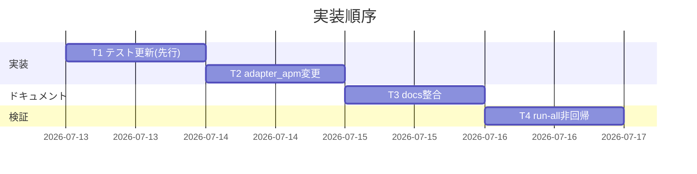

# 実装計画書: apm と npx 導線併用時のスキル二重コピー解消

**プロジェクト名**: apm-npx スキル二重コピー解消
**作成日**: 2026 年 07 月 13 日
**最終更新**: 2026 年 07 月 13 日

> **重要**: **このドキュメントは常に更新**。実装・進捗・バグの変更があれば即座に更新する。
>
> **用語**: [.agent-skill-chain/source/CONCEPTS.md §用語規約](../../../../../.agent-skill-chain/source/CONCEPTS.md#用語規約) を参照。

---

## 1. 実装概要

### 1.1 実装方針

02 §2.5 ADR-1（D1）に従い、`adapter_apm()` から個別スキル配備を削除し apm を「バンドルのみ配布」に変更する。npx 実装（setup.sh・deploy-skills.sh・agents-md.ts）は変更しない。テストファーストで `test-build-adapters-apm.sh` の判定を先に「個別スキル 0 件・バンドルのみ」へ更新し、実装を追随させる。ドキュメント（README・apm-package.md・apm.yml description）を実態と整合させる。`audit.sh` は無改変（ADR-3）。

### 1.2 実装順序



- **T1**: `test-build-adapters-apm.sh` の判定更新（テストファースト）
- **T2**: `adapter_apm()` から個別スキル配備を削除・バンドル SKILL.md 本文とログ更新
- **T3**: README・apm-package.md・apm.yml description・adapters.md 参照整合
- **T4**: `bash test/run-all.sh` 非回帰確認

---

## 2. タスク分解

### 2.1 タスク 1: 回帰テストの判定更新（テストファースト）

#### 2.1.1 概要

`test/test-build-adapters-apm.sh` を「apm 生成物は個別スキルを含まず `agent-skill-chain-full` のみ」を検証する内容に更新する。

#### 2.1.2 実装内容

- 「正本スキル件数と apm 配備件数が一致（N==M）」のシナリオを、「`.apm/skills/` 直下に `{domain}__{capability}` 形式ディレクトリが **0 件**」「`agent-skill-chain-full` が **存在**」に置き換える。
- `agent-skill-chain-full/SKILL.md` 存在・frontmatter `name` 検証は維持。
- 決定性（bit 一致）・除外規則（保守/導入スクリプト非同梱）・`.adapters/` 非改変・`.gitignore` 非追跡・複合実行の各シナリオは維持。
- テストファイル冒頭コメント（ユースケース）を D1 の趣旨に合わせて更新し、**ヘッダの参照 issue パスを旧 issue（`…/20260711_024021_npm公開中止_APM転換/…`）から本 issue（`docs/maintainer/workflow/20260713_033406_apm-npx-skill重複解消/`）へ差し替える**（トレーサビリティ更新）。

#### 2.1.3 テスト観点

**参照**: 定義は [02_設計 §6](./02_設計.md#6-テスト戦略) および [RULES §テスト戦略必須要件](../../../../../.agent-skill-chain/source/RULES.md#テスト戦略必須要件)。

##### 単体（本タスクの具体ケース・必須 1 件以上）

- 正常系: `build-adapters.sh apm` 実行後、`find .apm/skills -mindepth 1 -maxdepth 1 -type d ! -name agent-skill-chain-full` の件数が 0 である。
- 正常系: `.apm/skills/agent-skill-chain-full/SKILL.md` が存在し `name: agent-skill-chain-full` を持つ。
- 境界: `.apm/skills/` 直下のディレクトリ総数が 1（バンドルのみ）である。

##### 結合/API（該当時）

- `build-adapters.sh apm` が exit 0。複合実行 `claude cursor apm` が exit 0。

##### E2E/受け入れ

- apm install ＋ npx init の併用 end-to-end は apm CLI v0.25.0・tmp 隔離環境で実機確認済み（observed_runtime・2026-07-13）。`.apm/skills/` 構成検証に加え、実機 `apm install` の出力（`.claude/skills/` に `agent-skill-chain-full` のみ統合・事前配置した npx 想定ダミー個別スキルは無改変で残存）で担保。

##### バリデーション

- 該当なし。

#### 2.1.4 単体テスト仕様（BDD）

```gherkin
Feature: apm 生成物は個別スキルを含まずバンドルのみ
  Scenario: adapter_apm 実行後の .apm/skills 構成
    Given tmp 隔離クローンで build-adapters.sh がある
    When bash build-adapters.sh apm を実行する
    Then .apm/skills/ 直下に {domain}__{capability} 形式ディレクトリが 0 件である
    And .apm/skills/agent-skill-chain-full/SKILL.md が存在する
```

```bash
# Given: tmp 隔離クローンで build-adapters.sh apm を実行済み
# When: 個別スキルディレクトリを数える
count=$(find "$TMP/.apm/skills" -mindepth 1 -maxdepth 1 -type d ! -name agent-skill-chain-full | wc -l | tr -d ' ')
# Then: 0 件であり、バンドルのみが存在する
[[ "$count" -eq 0 ]] && [[ -f "$TMP/.apm/skills/agent-skill-chain-full/SKILL.md" ]]
```

#### 2.1.5 依存関係

- なし（先行タスク）。

#### 2.1.6 見積もり

- **工数**: 0.5h / **優先度**: 高

### 2.2 タスク 2: `adapter_apm()` の個別スキル配備削除

#### 2.2.1 概要

`.agent-skill-chain/source/scripts/build-adapters.sh` の `adapter_apm()` からステップ 2（`deploy_skills_impl` による個別スキル配備）を削除し、バンドルのみ生成する。

#### 2.2.2 実装内容

- ステップ 2 の `mkdir -p "$apm_root/skills"` ＋ `n_skill=$(deploy_skills_impl ...)` を削除（バンドル生成側で `mkdir -p "$bundle"` は既に行う。必要なら `$apm_root/skills` の作成をバンドル生成前に保持）。
- 件数報告ログ `skills を $n_skill 件, agent-skill-chain-full を $n_bundle_files ファイル` を、`agent-skill-chain-full を $n_bundle_files ファイル配備しました` へ修正（`n_skill` 参照を除去）。
- バンドル `SKILL.md` 本文の「個々の能力（skill）は `{domain}__{capability}` 形式の別スキルとして個別配備されています」を、「個々の能力（skill）は **npx 導線** が `.claude/skills/`・`.cursor/skills/` へ `{domain}__{capability}` 形式で配備します。apm 経由では本バンドル（参照コンテキスト）のみを配布します」へ更新。frontmatter `name: agent-skill-chain-full` は不変。
- 関数冒頭コメント（出力: `.apm/skills/{domain}__{capability}/` の記述）をバンドルのみに更新。
- `deploy_skills_impl`／`list_owned_skill_names`（`lib/deploy-skills.sh`）は npx が使うため**削除しない**。

#### 2.2.3 テスト観点

**参照**: [02_設計 §6](./02_設計.md#6-テスト戦略)。

##### 単体（本タスクの具体ケース・必須 1 件以上）

- 正常系: 実装後 T1 のテストが PASS（個別スキル 0 件・バンドルのみ）。
- 正常系: 再生成で `.apm/` が bit 一致（決定性の非回帰）。
- 異常系: `apm.yml` 正本欠如時は exit 1（既存挙動維持）。

##### 結合/API（該当時）

- `build-adapters.sh apm` 単独・`claude cursor apm` 複合が exit 0。`.adapters/` は apm 実行前後で不変。

##### E2E/受け入れ

- apm install 併用の実機 E2E は apm CLI v0.25.0・tmp 隔離環境で実施済み（observed_runtime・2026-07-13）。生成物構成検証に加え実機確認で担保。

##### バリデーション

- バンドル `SKILL.md` frontmatter `name: agent-skill-chain-full` が保たれる。

#### 2.2.4 単体テスト仕様（BDD）

```gherkin
Feature: adapter_apm はバンドルのみを生成する
  Scenario: 個別スキル配備の停止
    Given 正本 skills が複数存在する
    When adapter_apm を実行する
    Then deploy_skills_impl による個別スキル配備は行われない
    And agent-skill-chain-full バンドルのみが .apm/skills に生成される
```

```bash
# Given: 正本 .agent-skill-chain/source/skills に複数 SKILL.md がある
# When: build-adapters.sh apm を実行
bash "$BUILD_SH" apm
# Then: 個別スキルは 0 件、バンドルのみ
find "$TMP/.apm/skills" -mindepth 1 -maxdepth 1 -type d ! -name agent-skill-chain-full | wc -l   # => 0
```

#### 2.2.5 依存関係

- T1（テスト先行）。

#### 2.2.6 見積もり

- **工数**: 0.5h / **優先度**: 高

### 2.3 タスク 3: ドキュメント整合

#### 2.3.1 概要

導線ごとの配布責務（02 §2.1.2）・併用時の扱い・既存重複の掃除手順（ADR-2）を実態と整合させる。

#### 2.3.2 実装内容

- **README.md §導入 §0（apm）**: 「`.agents/skills/{domain}-{capability}/` に個々の能力が展開される」旨の記述を「apm 経由では `agent-skill-chain-full`（正本一式の参照コンテキスト）を配布する。個々のスキルは npx 導線が `.claude/skills/`・`.cursor/skills/` に配備する」へ更新。apm と npx の役割（apm=バンドル参照配布／npx=個別スキル＋契約本体＋enforcement＋管理 CLI＝完全導線）と、併用しても二重化しない旨を明記。「一次配布導線・推奨」の表記を実態（npx が完全導線）に合わせて調整する（要人間確認事項として T3 内でユーザー判断を仰ぐ表現に留意）。
- **docs/maintainer/apm-package.md**: 「v1 スコープ（skills のみ）」「生成物の構成」の個別スキル行（`.apm/skills/{domain}__{capability}/`）を削除し、`agent-skill-chain-full` のみを配布する構成へ更新。「なぜ apm 経由の配布か」を「横断参照コンテキスト（バンドル）配布」に整理。tmp 検証手順の「individual skill OK」アサーションを削除／バンドル検証へ変更。**既存重複の掃除手順**（`apm uninstall` または `.claude/skills/{domain}-{capability}` ハイフン名の手動削除。npx 由来のダブルアンダースコア名・ユーザー自作スキルは残す）を追記。
- **platforms/apm/apm.yml の description**: 「skillsプリミティブとして個々のスキル、および参照コンテキストとして正本一式（agent-skill-chain-full）を配布する」を「参照コンテキストとして正本一式（agent-skill-chain-full）を配布する（個々のスキルは npx 導線が配備）」へ更新。version 行は sync-version.sh 管理のため触れない。
- **docs/maintainer/adapters.md**: apm 節は apm-package.md へ委譲済み。参照整合のみ確認し、齟齬があれば最小修正。`.adapters/claude/skills/{domain}__{capability}` は marketplace 用で不変。

#### 2.3.3 テスト観点

##### 単体（本タスクの具体ケース・必須 1 件以上）

- 正常系: README・apm-package.md に「apm はバンドルのみ／個別は npx」「併用で二重化しない」「既存重複の掃除手順」が記載されている（レビューで確認）。
- 正常系: apm.yml が有効な YAML のまま（`build-adapters.sh apm` が exit 0＝コピーが機能）。

##### 結合/API（該当時）

- 該当なし（ドキュメント）。

##### E2E/受け入れ

- 該当なし。記載の正しさはレビュー観点で担保。

##### バリデーション

- apm.yml が YAML として妥当（sync-version.sh --check が通る＝T4 で確認）。

#### 2.3.4 単体テスト仕様（BDD）

```gherkin
Feature: ドキュメントが導線責務と整合する
  Scenario: apm 節の記述
    Given 修正方針 D1 が適用されている
    When README と apm-package.md を確認する
    Then apm はバンドルのみ配布・個別スキルは npx が配備すると明記されている
    And 既存重複の掃除手順が記載されている
```

```bash
# Given/When: apm-package.md を検査
# Then: 個別スキル配布の記述が残っていない（バンドルのみ）ことを目視/grep で確認
grep -c 'agent-skill-chain-full' docs/maintainer/apm-package.md   # >= 1
```

#### 2.3.5 依存関係

- T2（実装確定後に記述を合わせる）。

#### 2.3.6 見積もり

- **工数**: 1h / **優先度**: 中

### 2.4 タスク 4: 非回帰確認

#### 2.4.1 概要

`bash test/run-all.sh` を実行し FAIL=0 を確認する。

#### 2.4.2 実装内容

- `bash test/run-all.sh` 実行。とくに `test-build-adapters-apm.sh`・`test-sync-version-apm.sh`・`e2e-install-uninstall.sh` の PASS/SKIP を確認。
- 併用 E2E は apm CLI v0.25.0・tmp 隔離環境で実施済み（observed_runtime・2026-07-13）。結果を報告に明記。

#### 2.4.3 テスト観点

##### 単体（本タスクの具体ケース・必須 1 件以上）

- 正常系: run-all の全テストが PASS または SKIP（FAIL=0・exit 0）。

##### 結合/API（該当時）

- `test-sync-version-apm.sh` が apm.yml 変更後も version 同期を PASS。

##### E2E/受け入れ

- `e2e-install-uninstall.sh`（npx 単独後方互換）が PASS/SKIP（npx 実装無改変の非回帰確認）。

##### バリデーション

- 該当なし。

#### 2.4.4 単体テスト仕様（BDD）

```gherkin
Feature: 非回帰
  Scenario: 全テスト
    Given 実装・テスト・ドキュメント変更が適用されている
    When bash test/run-all.sh を実行する
    Then FAIL=0（exit 0）である
```

```bash
# Given: 変更適用済み / When: 全テスト実行 / Then: exit 0
bash test/run-all.sh; echo "exit=$?"
```

#### 2.4.5 依存関係

- T1・T2・T3。

#### 2.4.6 見積もり

- **工数**: 0.5h / **優先度**: 高

---

## テスト観点

- apm 生成物が「個別スキル 0 件・`agent-skill-chain-full` のみ」であること（T1・T2、`test-build-adapters-apm.sh`）。
- apm 生成の決定性（再生成 bit 一致）・除外規則・`.adapters/` 非改変・gitignore 非追跡の非回帰。
- npx 単独導入の後方互換（`e2e-install-uninstall.sh`）。npx 実装は無改変。
- apm.yml の version 同期非回帰（`test-sync-version-apm.sh`）。
- ドキュメント整合（README・apm-package.md・apm.yml description）はレビュー観点で確認。
- **実施済み**: apm install ＋ npx init の併用 end-to-end は apm CLI v0.25.0・tmp 隔離環境で実機確認済み（observed_runtime・2026-07-13）。

---

## 単体テスト

- `test/test-build-adapters-apm.sh`（更新）: 個別スキル 0 件・バンドルのみ・決定性・除外・非改変・gitignore を検証。
- 既存の `test/*` は無改変で非回帰確認に用いる。

---

## BDD

- 各タスク §2.x.4 の Gherkin を参照。中核は「apm 生成物は個別スキルを含まずバンドルのみ」（T1/T2）と「run-all FAIL=0」（T4）。

---

## 3. 実装スケジュール

### 3.1 マイルストーン

| マイルストーン | 期日 | 成果物 |
|----------------|------|--------|
| テスト更新 | 2026-07-13 | test-build-adapters-apm.sh（更新） |
| 実装完了 | 2026-07-13 | build-adapters.sh（adapter_apm 更新） |
| ドキュメント整合 | 2026-07-13 | README・apm-package.md・apm.yml |
| 非回帰確認 | 2026-07-13 | run-all FAIL=0 |

### 3.2 実装フェーズ

#### フェーズ 1: 実装＋テスト

- **タスク**: T1 → T2 → T3 → T4

---

## 4. テスト計画

各タスク §2.x.3 の具体ケースに従う。回帰対象（apm ビルド・version 同期・npx install/uninstall）は必ず run-all に含める。

### 4.1 テストの優先順位

- クリティカル: apm 生成物構成（T1/T2）。
- 影響範囲: apm.yml version 同期・npx 後方互換は回帰テストに必ず含める。

---

## 5. リスク管理

### 5.1 実装リスク

- **リスク**: apm 単独利用者（`.agents/skills/` 走査系ハーネス含む）が個別スキルを失う／「apm 一次配布・推奨」方針の転換（ADR-1 帰結・要人間確認）。
  - **対策**: 実装は行い、README の推奨表記変更・製品方針転換部分はユーザー確認を得た（2026-07-13、ユーザーから README.md の推奨導線を npx へ変更する旨の明示指示。§8.1 参照）。バンドル（参照コンテキスト）は引き続き提供。
- **リスク（解消済み）**: 併用 end-to-end が apm CLI 未導入で実機検証不能だった（inference_only）。
  - **対策**: apm CLI（v0.25.0）を導入し、tmp 隔離環境で実機検証を実施した（2026-07-13）。`.apm/skills/` 構成検証に加え、実機 `apm install`（`--target claude`／`--target agent-skills`）で `agent-skill-chain-full` 1 件のみが統合されること、npx 想定の既存個別スキルと衝突しないことを observed_runtime として確認済み。本リスクは解消。
- **リスク**: 既存重複の掃除を手順提供に留めるため、利用者の手動作業が残る。
  - **対策**: 掃除手順を README／apm-package.md に明記（ADR-2）。自動検出は誤削除リスクのため不採用。
- **リスク**: D1 は「Claude Code がバンドルの `reference/` 配下の入れ子 SKILL.md を別スキルとして数えない（非再帰走査）」前提に依存する（02 §9.3）。前提が崩れると総数が戻り修正が無効化する。
  - **対策**: apm CLI 自体が非再帰走査であることは実機確認済み（`.claude/skills/agent-skill-chain-full/` 配下に 16 件の入れ子 SKILL.md が存在するが apm はそれらを別スキルとして展開しない。observed_runtime・2026-07-13）。Claude Code 本体側の走査確認（フィールド報告の総数 ~30・Agent Skills 仕様のトップレベル方式）は本 issue のスコープ外のため、verify-and-close／PR 時に Claude Code 実機で `.claude/skills/` 認識件数の確認を引き続き申し送る（inference_only として残る範囲を明確化）。

---

## 6. 参考資料

### プロジェクトドキュメント

- [`02_設計.md`](./02_設計.md) - 設計
- [`00_要求定義.md`](./00_要求定義.md) / [`01_要件定義.md`](./01_要件定義.md)

### コード・正本

- [`.agent-skill-chain/source/scripts/build-adapters.sh`](../../../../../.agent-skill-chain/source/scripts/build-adapters.sh)
- [`test/test-build-adapters-apm.sh`](../../../../../test/test-build-adapters-apm.sh)
- [`docs/maintainer/apm-package.md`](../../../apm-package.md) / [`README.md`](../../../../../README.md)

---

## 7. 前のステップ

- **前**: [`02_設計.md`](./02_設計.md) - 設計フェーズ

---

## 8. 次のステップ

- 本プロジェクトは 1 issue として実装フェーズ（execution）へ直接進む（サブ issue 分割なし＝90_issues.md 不要）。
- 実装着手前に **review-docs（実装前ドキュメントレビュー）** を必須ゲートとして経る。

### 8.1 実装反映前の human_decision ゲート（必須・充足済み）

D1 は apm 単独利用者の個別スキル喪失・「apm 一次配布・推奨」方針の転換を伴う（02 ADR-1 帰結・§9.2、01 ストーリー 3 の保護意図に対する意図的な再スコープ）。**コード実装・ドキュメント確定を main へ反映する前に、この製品判断についてユーザーの Go を得ること**を必須ゲートとする（README の推奨表記変更を含む）。本 issue のタスク（T1〜T4）はブランチ上で実施してよいが、方針転換の最終採否はユーザー確認を要する（human_decision）。

**充足記録（2026-07-13）**: ユーザーから「README.md の推奨導線を npx へ変更する（`apm install` 推奨から `npx github:techbeansjp-free/AGENTS.md init` 推奨へ）」旨の明示指示を受けた。これは本ゲートが求める製品判断の Go に該当するため、本ゲートは**充足済み**。README.md §導入・`### 0. apm 経由` 見出し・`docs/maintainer/apm-package.md` を実態（npx=完全導線・apm=横断バンドル配布の補助導線）に整合させる変更は、この Go に基づき main 反映してよい。
