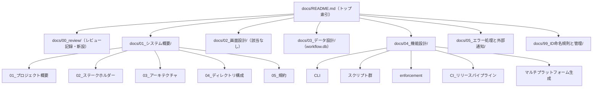
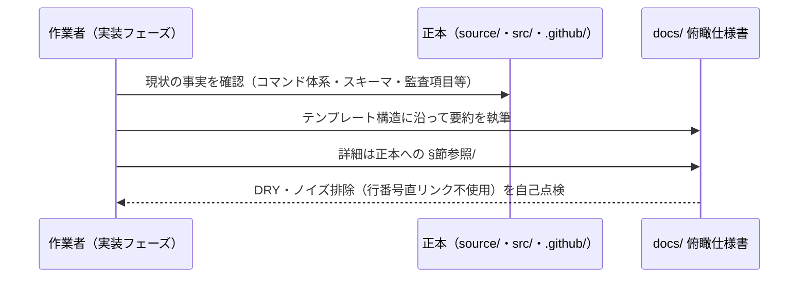
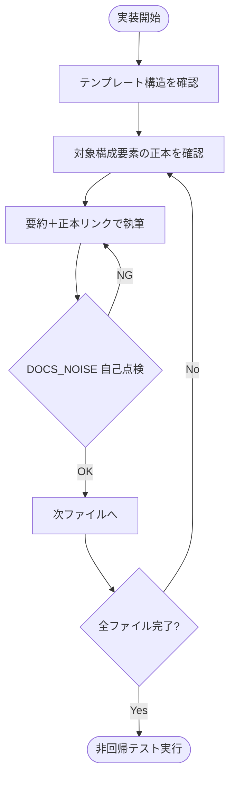

# 設計書: 本リポジトリのシステム仕様書整備（自己ドッグフーディングの一貫性回復）

**プロジェクト名**: 本リポジトリのシステム仕様書整備
**作成日**: 2026 年 07 月 13 日
**最終更新**: 2026 年 07 月 13 日

> **重要**: **このドキュメントは常に更新**: 設計の変更や追加があった場合は、即座にこのドキュメントを更新してください。ドキュメントは「生きているドキュメント」として扱い、実装内容と常に同期させます。
>
> 本設計は、実際に `docs/` 配下へ作成するシステム仕様書の**ファイル構成・各ファイルの責務・正本参照方針**を確定するものである。要件は [01_要件定義.md](./01_要件定義.md)、要求は [00_要求定義.md](./00_要求定義.md) を参照。
>
> **用語**: [.agent-skill-chain/source/CONCEPTS.md §用語規約](../../../../../.agent-skill-chain/source/CONCEPTS.md#用語規約) を参照。

---

## 1. 設計概要

### 1.1 設計方針

本リポジトリ自身のソフトウェア構成（CLI・スクリプト群・enforcement・workflow.db・CI/マルチプラットフォーム生成）を、[.agent-skill-chain/runtime/templates/docs/](../../../../../.agent-skill-chain/runtime/templates/docs/) のテンプレート構造に沿って `docs/` へ**俯瞰仕様書**として文書化する。既存正本（各 README・DESIGN・schema）は複製せず、**要約＋正本への `§節参照`／`#見出しアンカー`** で接続する（DRY・[01 ストーリー 2](./01_要件定義.md#ストーリー-2-dry-を守った文書化方針の確定)）。

### 1.2 設計原則（本プロジェクトで適用するもの）

- **単一責務**: 各 `docs/` ファイルは 1 構成要素（または 1 テンプレートセクション）の俯瞰説明のみを担う。
- **明確な境界**: 「俯瞰仕様書（`docs/`）」と「正本（`.agent-skill-chain/source/` 等）」の境界を明確化し、詳細仕様は正本へ委譲する。
- **AIフレンドリー設計**: 小さなファイル・明確な責務・意図が分かる命名・深すぎないディレクトリ構造（[01_設計原則 §AIフレンドリー設計](../../../../../.agent-skill-chain/source/spec/01_設計原則.md#aiフレンドリー設計)）。テンプレートの見出し・セクション構成を踏襲する。

---

## 2. アーキテクチャ設計

### 2.1 責務・境界・参照関係

#### 2.1.1 責務一覧（作成する `docs/` ファイル）

各ファイルは対応する構成要素・テンプレートセクションの**俯瞰**を担い、詳細は正本へリンクする。パスはリポジトリルートからの相対。

| # | 作成ファイル | 責務（1 文） | 主な正本参照先 |
|---|--------------|--------------|----------------|
| 1 | `docs/README.md` | システム仕様書トップ索引（構成一覧・更新履歴・読み方） | DOCS_RULES.md |
| 2 | `docs/00_review/README.md` | 継続追随ゲートのレビュー記録索引（新設） | DOCS_RULES.md §継続追随ゲート |
| 3 | `docs/01_システム概要/README.md` | システム概要の索引（サブドキュメント一覧） | — |
| 4 | `docs/01_システム概要/01_プロジェクト概要/README.md` | プロジェクトの目的・スコープ・成果物（配布者兼自己拡張消費者の二役） | README.md |
| 5 | `docs/01_システム概要/02_ステークホルダー/README.md` | 役割一覧（保守者・消費者プロジェクト・監査者・CI）と役割別の読み方 | — |
| 6 | `docs/01_システム概要/03_アーキテクチャ/README.md` | 5 構成要素の全体構成図・技術スタック | 各構成要素の正本 |
| 7 | `docs/01_システム概要/04_ディレクトリ構成/README.md` | 本リポジトリの実ディレクトリ構成と各ディレクトリの役割 | 自己拡張ワークフロー.md §名前空間の役割分担 |
| 8 | `docs/01_システム概要/05_規約/README.md` | コーディング規約・実行契約規約の索引（正本へのリンク集） | AGENTS.md・RULES.md 等 |
| 9 | `docs/02_画面設計/README.md` | 画面 UI 非該当（CLI/非 GUI）の明示と根拠 | — |
| 10 | `docs/03_データ設計/README.md` | 証跡 DB（`workflow.db` の `workflow_log`）のデータモデル俯瞰 | ledger/schema.md・schema.sql |
| 11 | `docs/04_機能設計/README.md` | 機能設計の索引（5 構成要素の機能単位一覧） | — |
| 12 | `docs/04_機能設計/CLI/README.md` | `agents-md` コマンド体系の俯瞰 | src/agents-md.ts・README.md |
| 13 | `docs/04_機能設計/スクリプト群/README.md` | `.agent-skill-chain/source/scripts/` の役割一覧 | 各スクリプト・SETUP.md |
| 14 | `docs/04_機能設計/enforcement/README.md` | 4 層強制・audit.sh 監査の俯瞰 | enforcement/README.md・DESIGN.md |
| 15 | `docs/04_機能設計/CI_リリースパイプライン/README.md` | `release.yml`・`self-enforce.yml` の俯瞰 | 各 workflow ファイル |
| 16 | `docs/04_機能設計/マルチプラットフォーム生成/README.md` | `build-adapters.sh`・`platforms/` の俯瞰 | build-adapters.sh・platforms/README.md |
| 17 | `docs/05_エラー処理と外部通知/README.md` | CLI/スクリプト/CI のエラー処理・失敗時挙動の方針 | enforcement/README.md §失敗条件 |
| 18 | `docs/99_ID命名規則と管理/README.md` | 本仕様書群で使用する ID の台帳（全数採番） | — |

#### 2.1.2 境界

- **入力**: 既存正本（`src/agents-md.ts`・`.agent-skill-chain/source/` 配下の README/DESIGN/schema・`.github/workflows/`・`package.json` 等）の**現状の事実**。
- **出力**: `docs/` 配下の俯瞰システム仕様書 18 ファイル（新設）。既存 `docs/AI_CI_CD_VISION.md`・`docs/maintainer/` は改変しない。
- **他責務との境界**: フレームワーク定義そのもの（`.agent-skill-chain/source/`）の再文書化は**範囲外**（[00 §5](./00_要求定義.md#5-除外要件)）。過去 close 済み issue の遡及同期は行わない（[00 §4.3](./00_要求定義.md#43-移行期間スケジュール)）。未実装機構（enforcement 系統 A/C/E 等）は実装しない。

#### 2.1.3 参照関係

- **方向**: `docs/`（俯瞰）→ `正本`（詳細）の**一方向**参照とする。正本から `docs/` への逆参照は作らない（配布物 `.agent-skill-chain/source/` を `docs/` に依存させない）。
- **相対リンク深度**: `docs/` の各ファイルからリポジトリルート配下の正本を指す相対リンクは、当該ファイルの階層に応じて算出する（例: `docs/03_データ設計/README.md`＝2 階層下→ `../../.agent-skill-chain/source/...`、`docs/04_機能設計/CLI/README.md`＝3 階層下→ `../../../.agent-skill-chain/source/...`）。行番号直リンク（`.md:NNN`）は使用しない（[DOCS_RULES.md §行番号直リンク禁止](../../../../../.agent-skill-chain/source/DOCS_RULES.md)）。
- 循環参照は持たない（`docs/` 内の相互リンクは索引→詳細の階層方向のみ）。

### 2.2 システムアーキテクチャ

- **採用パターン**: テンプレート踏襲型の階層ドキュメントツリー（索引 README ＋セクション別サブドキュメント）。
- **根拠**: [01 制約](./01_要件定義.md#5-制約事項) がテンプレート構造（[.agent-skill-chain/runtime/templates/docs/](../../../../../.agent-skill-chain/runtime/templates/docs/)）準拠を求めるため。既存の消費者向けテンプレートと同型にすることで、監査（audit.sh #31/#32）・継続追随ゲートの記録先（`docs/00_review/`）が自然に整合する。

#### 2.2.1 ドキュメントツリー

### 2.3 コンポーネント構成

- **索引層**: `docs/README.md`・各セクション `README.md`。下位ドキュメントへの導線のみを持ち、詳細説明は持たない。
- **俯瞰層**: 各構成要素の説明ファイル。**要約 3〜10 行程度＋正本リンク**で構成し、詳細仕様は正本へ委譲する（単一責務・DRY）。
- **記録層**: `docs/00_review/`。継続追随ゲートのレビュー記録を蓄積する（本 issue では索引 README を新設し、実レビュー記録は採用以後の運用で追記）。

### 2.4 データフロー

本 issue の成果物は静的ドキュメントであり実行時データフローを持たない。作成フローは次のとおり（実装→仕様の as-built 方向で正本を要約する）。

### 2.5 横断設計判断（ADR）

#### ADR-1: 02_画面設計 を「該当なし」とし削除しない

- **コンテキスト**: 本リポジトリは CLI/ツール群であり GUI 画面を持たない。テンプレートは `02_画面設計` を含む。
- **検討した選択肢**: (a) `02_画面設計` ディレクトリを作らない / (b) 作成し「該当なし」と根拠を明記する。
- **決定**: (b)。テンプレート構造を踏襲しつつ、非該当の根拠を残す。
- **根拠**: テンプレート準拠を制約とする（[01 §5](./01_要件定義.md#5-制約事項)）。空セクションの放置は陳腐化リスクだが、「該当なし＋根拠」は事実であり [DOCS_NOISE_RULES.md](../../../../../.agent-skill-chain/source/DOCS_NOISE_RULES.md) の禁止パターンに当たらない（evidence_source: 本リポジトリに GUI コンポーネントが存在しないこと＝`src/` に UI コードが無い実確認）。
- **帰結**: `docs/02_画面設計/README.md` は非該当宣言のみを持ち、以後の画面追加時にのみ拡張される。

#### ADR-2: workflow.db を「新規データ設計」ではなく既存正本の俯瞰として扱う

- **コンテキスト**: `03_データ設計` の対象は `workflow.db`。スキーマ正本は [ledger/schema.md](../../../../../.agent-skill-chain/source/ledger/schema.md)・schema.sql に既に存在する。
- **検討した選択肢**: (a) スキーマ全文を `docs/03_データ設計/` に転記 / (b) テーブル一覧・ER 相当の俯瞰のみ書き、詳細は正本参照。
- **決定**: (b)。
- **根拠**: DRY（[DOCS_NOISE_RULES.md §(iii) 正本重複](../../../../../.agent-skill-chain/source/DOCS_NOISE_RULES.md)）。CREATE TABLE の実体は schema.sql が単一正本であり複製は二重管理を生む（evidence_source: schema.md が「SQL の単一正本は schema.sql」と明記）。
- **帰結**: `docs/03_データ設計/README.md` は `workflow_log`（単一テーブル＋索引 7 件）の存在・主要カラムの意味・正本リンクに留める。

---

## 3. 機能設計

### 3.1 機能 1: docs/ 俯瞰仕様書ツリーの新設

#### 3.1.1 概要

[§2.1.1](#211-責務一覧作成する-docs-ファイル) の 18 ファイルを、テンプレート構造に沿って新規作成する。

#### 3.1.2 処理フロー

#### 3.1.3 入力・出力

- **入力**: テンプレート（`.agent-skill-chain/runtime/templates/docs/`）・各構成要素の正本。
- **出力**: `docs/` 配下 18 ファイル（各 frontmatter に一意な `document_id`）。

#### 3.1.4 エラーハンドリング

- 行番号直リンク・正本重複を検出したら執筆をやり直す（review-docs ゲートおよび自己点検で担保）。
- `docs/` が npm 配布物（`package.json` の `files` allowlist）に含まれないことを維持する（allowlist に `docs/` を追加しない）。

### 3.2 機能 2: 継続追随ゲート記録先（docs/00_review/）の新設

#### 3.2.1 概要

`docs/00_review/README.md`（レビュー記録索引）を新設し、`docs/` 採用以後の実装変更 issue の close 時に [DOCS_RULES.md §継続追随ゲート](../../../../../.agent-skill-chain/source/DOCS_RULES.md) が発動する土台を作る。過去 close 分は遡及対象外（非遡及）。

#### 3.2.2 入力・出力

- **入力**: なし（索引の枠組みのみ）。
- **出力**: `docs/00_review/README.md`。実レビュー記録（`YYYYMMDD_HHMMSS_review.md`）は採用以後の運用で追記する（本 issue では作成しない）。

---

## 4. データ設計

本 issue は新規のデータモデルを定義しない。文書化対象の `workflow.db`（`workflow_log` 単一テーブル＋索引 7 件）のデータモデルは [ledger/schema.md](../../../../../.agent-skill-chain/source/ledger/schema.md)・schema.sql を正本とし、`docs/03_データ設計/README.md` では複製せず俯瞰と参照に留める（[ADR-2](#adr-2-workflowdb-を新規データ設計ではなく既存正本の俯瞰として扱う)）。

`docs/` ディレクトリツリーの構造は [§2.2.1](#221-ドキュメントツリー) を参照。

---

## 5. API 設計

該当なし。本 issue は新規 API を定義しない。文書化対象の CLI コマンド体系（`agents-md init/upgrade/uninstall/enforce/doctor/audit/export/version/help`）は既存仕様であり、`docs/04_機能設計/CLI/README.md` で俯瞰＋正本（`src/agents-md.ts`・README.md）参照として扱う（変更しない）。

---

## 6. テスト戦略

テスト戦略の観点定義は [RULES.md のテスト戦略必須要件](../../../../../.agent-skill-chain/source/RULES.md#テスト戦略必須要件) を参照。本 issue は**ドキュメント整備**であり実行時ロジックを持たないため、単体・結合・E2E の自動テストは新規追加しない。代わりに次の 3 種の検証で品質を担保する。

### 6.1 対象ごとのテスト割り当て

| 対象 | 単体 | 結合/API | E2E | クリティカル観点 | バリデーション観点 | 未達理由/補足 |
|------|------|----------|-----|------------------|--------------------|---------------|
| docs/ 俯瞰仕様書 18 ファイル | × | × | × | 正本リンクが解決すること・要約が実装と矛盾しないこと | 行番号直リンク不使用・正本重複なし（DOCS_NOISE 4 種）・document_id 一意 | 実行時ロジック無しのため自動テスト非該当。検証は §6.2 の 3 手段で担保 |
| 既存コード資産 | ○（既存） | ○（既存） | ○（既存） | 非回帰（docs 追加が既存挙動を壊さない） | — | `bash test/run-all.sh` を再実行し全 PASS を確認 |

### 6.2 監査・レビューでの確認（証跡）

- **(a) 非回帰テスト**: `bash test/run-all.sh` を実行し、`docs/` 追加により既存テストが FAIL しないことを確認する。
- **(b) ノイズ排除の機械検証**: `docs/` 配下に行番号直リンク（`.md:NNN`）が無いことを grep 相当で確認する（[DOCS_NOISE_RULES.md §機械検証](../../../../../.agent-skill-chain/source/DOCS_NOISE_RULES.md)）。
- **(c) 意味的検証**: 実装前ドキュメントレビュー（review-docs）で 00〜03 の整合性を指摘 0 件まで反復確認する。実装後の `docs/` 俯瞰記述が正本と矛盾しない（as-built 同期）ことは、実装フェーズの自己点検で担保する（実装後の正式レビューは本 issue の範囲外＝[00 §5](./00_要求定義.md#5-除外要件)）。
- 本設計 §6.1 の割当表と [03_実装計画.md](./03_実装計画.md) のタスク別テスト観点が対応していることを監査で確認する。

---

## 7. UI 設計

該当なし（CLI/非 GUI）。詳細は `docs/02_画面設計/README.md` の非該当宣言（[ADR-1](#adr-1-02_画面設計-を該当なしとし削除しない)）を参照。

---

## 8. セキュリティ設計

- システム仕様書に秘密情報の値を記載しない。CI シークレット（`RELEASE_MAIN_PAT` 等）は名称・役割の記載に留める（[01 §3.2](./01_要件定義.md#32-セキュリティ要件)）。
- `docs/` 俯瞰仕様書は npm 配布物（`package.json` の `files` allowlist）に含めない（保守者向け・非配布）。

---

## 9. 非機能要件への対応

### 9.1 パフォーマンス

該当なし（静的ドキュメント）。

### 9.2 保守性

- DRY（要約＋参照）により二重管理・陳腐化（[DOCS_NOISE_RULES.md](../../../../../.agent-skill-chain/source/DOCS_NOISE_RULES.md) 禁止 4 種）を回避する。
- 索引/俯瞰/記録の 3 層分離により、構成要素追加時の影響範囲を局所化する。

---

## 10. 参考資料

### プロジェクトドキュメント

- [`00_要求定義.md`](./00_要求定義.md) - 要求定義
- [`01_要件定義.md`](./01_要件定義.md) - 要件定義
- [`03_実装計画.md`](./03_実装計画.md) - 実装計画
- [.agent-skill-chain/source/DOCS_RULES.md](../../../../../.agent-skill-chain/source/DOCS_RULES.md) - 継続追随ゲート正本
- [.agent-skill-chain/source/DOCS_NOISE_RULES.md](../../../../../.agent-skill-chain/source/DOCS_NOISE_RULES.md) - ノイズ排除規約
- [.agent-skill-chain/runtime/templates/docs/](../../../../../.agent-skill-chain/runtime/templates/docs/) - システム仕様書テンプレート構成

### その他の参考資料

- [.agent-skill-chain/project/自己拡張ワークフロー.md](../../../../../.agent-skill-chain/project/自己拡張ワークフロー.md) - 名前空間の役割分担（配布物・非配布・生成物）

---

## 11. 前のステップ

この設計書は、以下のドキュメントを基に作成されています：

- **前**: [`01_要件定義.md`](./01_要件定義.md) - 要件定義フェーズ

---

## 12. 次のステップ

この設計書の承認後、以下のドキュメントを作成します：

- **次**: [`03_実装計画.md`](./03_実装計画.md) - 実装計画フェーズ
