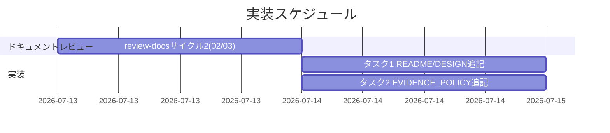
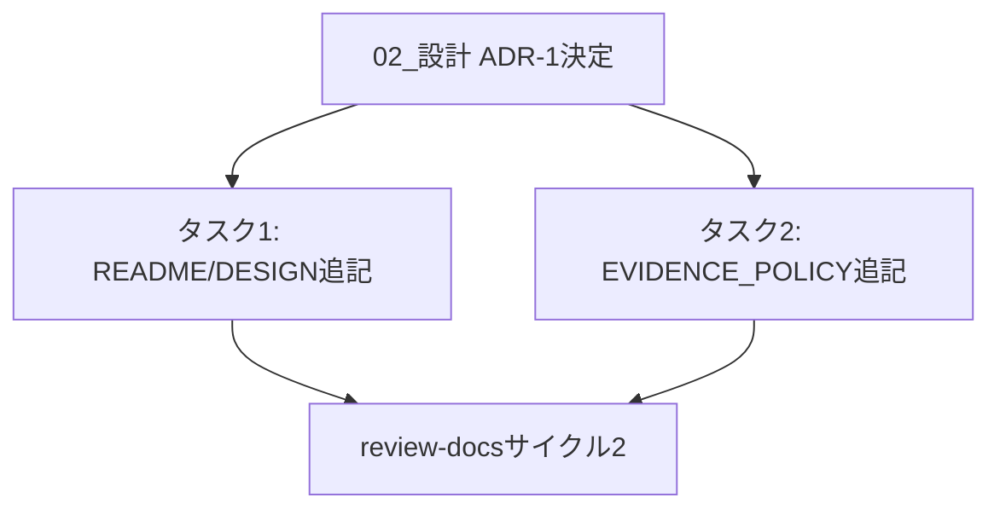

# 実装計画書: PreToolUse R1/R2 非対称性の文書化と汎用調査規律の明文化

**プロジェクト名**: PreToolUse R1 挙動のドキュメント明確化＋汎用調査規律の明文化
**作成日**: 2026 年 07 月 13 日
**最終更新**: 2026 年 07 月 13 日

> **重要**: **このドキュメントは常に更新**: 実装計画の変更、進捗状況の更新、バグの記録などがあった場合は、即座にこのドキュメントを更新してください。
>
> **用語**: [.agent-skill-chain/source/CONCEPTS.md §用語規約](../../../../../.agent-skill-chain/source/CONCEPTS.md#用語規約) を参照。

---

## 1. 実装概要

### 1.1 実装方針（必須）

コード変更は行わず、02_設計.md の ADR-1 決定に基づき、`enforcement/README.md`・`DESIGN.md`（タスク 1）と `EVIDENCE_POLICY.md`（タスク 2）への要点のみの追記を行う。両タスクは相互依存せず並行実施可能。実装後、review-docs サイクル 2（02/03 対象）と、追記反映後の grep 確認を経て完了とする。

### 1.2 実装順序（必須: 1 件以上）

1. タスク 1: `enforcement/README.md`・`DESIGN.md` に R1/R2 非対称性・Bash 正規ルートを明記
2. タスク 2: `EVIDENCE_POLICY.md` に調査規律（関連ルール横断確認）を明記
3. review-docs サイクル 2（02/03 対象・design-feature 完了後の必須ゲート）
4. implement-feature（タスク 1・タスク 2 の実施）



---

## 2. タスク分解

**必須**: 各タスクには「テスト観点」（2.x.3）と「単体テスト仕様（BDD）」（2.x.4）を必ず記載する。

### 2.1 タスク 1: enforcement/README.md・DESIGN.md に R1/R2 非対称性を明記

#### 2.1.1 概要（必須）

R1（path 軸・全 ROLE 一律禁止）と R2（role 軸・subagent 除外）の非対称性が意図的である旨、および subagent の runtime/ 書き込み正規ルートが Bash 経由（heredoc/cp/new-workflow-memo.sh）である旨を、既存節への補足として追記する。

#### 2.1.2 実装内容（必須: 1 件以上）

- `enforcement/README.md` の「失敗条件→実装の所在→強制レベル 対応表」における「orchestrator の Write/Edit/Shell 拒否」行（既存の subagent 除外の記述箇所）の直後、または「強制の 4 層と現状」節に、**R1（path 軸・全 ROLE）と R2（role 軸・subagent 除外）は目的の異なる独立ガードであり、非対称は意図的である**旨を 1〜2 文で追記する。
- `enforcement/DESIGN.md` の §worker と main の識別（既存 L47-51 付近）に、**R1 は runtime/ という特定パスに対して全 ROLE 一律で block する path-axis のガードであり、R2（role-axis）の subagent 除外とは別軸で機能する**旨を補足する。
- 両ファイルに、**subagent が runtime/ 配下へ書く正規ルートは Bash（heredoc/cp/new-workflow-memo.sh 等）である**旨を明記する。
- 既存の記述（強制の 4 層表・失敗条件対応表・ADR-2 の記述）と重複しないよう、追記は要点のみに留める。

#### 2.1.3 テスト観点（必須）

**参照**: 観点の定義は [02_設計 §6](./02_設計.md) を参照。以下は本タスクの具体ケース。

##### 単体（本タスクの具体ケース・必須 1 件以上）

- 正常系: `grep -n "非対称" .agent-skill-chain/source/enforcement/README.md .agent-skill-chain/source/enforcement/DESIGN.md` を実行した際、両ファイルに該当する記述が 1 件以上ヒットする。
- 正常系: `grep -n "Bash" .agent-skill-chain/source/enforcement/README.md .agent-skill-chain/source/enforcement/DESIGN.md` で、subagent の runtime/ 正規ルートに関する記述がヒットする。
- 異常系・境界値: 該当なし（ドキュメント追記のため）。

##### 結合/API（該当なし）

- 該当なし（API を伴わない）。

##### E2E/受け入れ（本タスクの具体ケース）

- review-docs サイクル 2 で、追記内容が「意図的な非対称性の説明」「Bash 正規ルートの説明」を満たしていることが確認され、指摘 0 件で完了する。

##### バリデーション（該当する場合の具体ケース）

- 追記文言が、README.md・DESIGN.md の既存の重複回避方針（「正本はここ 1 か所」等の既存記述）と矛盾しないこと（レビューで目視確認）。

#### 2.1.4 単体テスト仕様（BDD）（必須）

```gherkin
Feature: PreToolUse R1/R2 非対称性のドキュメント明記
  Scenario: README.md・DESIGN.md に非対称性の説明が追加されている
    Given enforcement/README.md・DESIGN.md に R1/R2 非対称性の意図の説明が無い状態
    When タスク 1 の実装により両ファイルへ追記が行われる
    Then 両ファイルに「R1（path 軸）と R2（role 軸）は意図的に非対称」という趣旨の記述が存在する
    And 両ファイルに「subagent の runtime/ 書き込み正規ルートは Bash」という趣旨の記述が存在する
```

**確認スクリプト例（grep ベース・Given/When/Then インラインコメント付き）**:

```bash
# Given: README.md/DESIGN.mdに追記が反映された状態
README=".agent-skill-chain/source/enforcement/README.md"
DESIGN=".agent-skill-chain/source/enforcement/DESIGN.md"

# When: 非対称性・Bash正規ルートの記述有無を grep で確認する
asym_readme=$(grep -c "非対称" "$README")
asym_design=$(grep -c "非対称" "$DESIGN")
bash_readme=$(grep -c "Bash" "$README")
bash_design=$(grep -c "Bash" "$DESIGN")

# Then: いずれも1件以上ヒットすること
[[ "$asym_readme" -ge 1 && "$asym_design" -ge 1 && "$bash_readme" -ge 1 && "$bash_design" -ge 1 ]] && echo "PASS" || echo "FAIL"
```

#### 2.1.5 依存関係

- 02_設計.md §2.5 ADR-1 の決定に依存（配置先・追記内容の要点確定）。



#### 2.1.6 見積もり

- **工数**: 0.5h
- **優先度**: 高

### 2.2 タスク 2: EVIDENCE_POLICY.md に調査規律（関連ルール横断確認）を明記

#### 2.2.1 概要（必須）

「バグ/矛盾」と結論づける前に、同一ファイル・同一機構内の関連ルール（分岐条件・例外コメント等）を横断確認する調査規律を、`EVIDENCE_POLICY.md` §節1「上流フェーズの義務」に追記する（02_設計.md ADR-1 の決定に基づく）。

#### 2.2.2 実装内容（必須: 1 件以上）

- `EVIDENCE_POLICY.md` §節1 の末尾（既存箇条書きへの追加）に、以下 3 点を趣旨とする記述を追記する:
  1. 「バグ/矛盾」と結論づける前に、同一ファイル・同一機構内の関連ルール（分岐条件・例外コメント等）を横断的に確認すること。
  2. 意図的な非対称性を示す記述（例:「全 ROLE」「対象外」等の明示コメント）の有無を確認してから断定すること。
  3. 部分的な読みでの結論を禁止すること。
- 節2〜節5 の既存節番号はずらさない（節1 の内側への追加に留める）。
- 既存の evidence_source 分類定義（CONCEPTS.md 参照）・節3（重要判断の定義）とは重複させず、「関連ルール横断確認」という**新規の具体的手続き**としてのみ追記する。
- `REVIEW_RULE.md` は変更しない（ADR-1 の決定どおり）。

#### 2.2.3 テスト観点（必須）

##### 単体（本タスクの具体ケース・必須 1 件以上）

- 正常系: `grep -n "横断" .agent-skill-chain/source/EVIDENCE_POLICY.md` を実行した際、関連ルール横断確認規律の記述が 1 件以上ヒットする。
- 正常系: 追記箇所が §節1 の内側（節2 の見出し `## 節2` より前）に存在すること（`grep -n` の行番号比較で確認）。
- 異常系・境界値: 該当なし。

##### 結合/API（該当なし）

- 該当なし。

##### E2E/受け入れ（本タスクの具体ケース）

- review-docs サイクル 2 で、追記内容が「横断確認の義務化」「明示コメント確認の要求」「部分読み結論の禁止」の 3 点を満たすことが確認され、指摘 0 件で完了する。

##### バリデーション（該当する場合の具体ケース）

- `REVIEW_RULE.md` に同一文言が重複して追加されていないこと（ADR-1 決定の遵守確認・grep で両ファイルの diff を確認）。

#### 2.2.4 単体テスト仕様（BDD）（必須）

```gherkin
Feature: 「バグ/矛盾」断定前の調査規律明文化
  Scenario: EVIDENCE_POLICY.md に横断確認規律が追加されている
    Given EVIDENCE_POLICY.md §節1 に関連ルール横断確認の規律が無い状態
    When タスク 2 の実装により §節1 へ追記が行われる
    Then §節1 の内側に「関連ルールを横断的に確認」という趣旨の記述が存在する
    And 節2〜節5 の既存見出し番号は変更されていない
    And REVIEW_RULE.md には同一文言が追加されていない
```

**確認スクリプト例（grep ベース・Given/When/Then インラインコメント付き）**:

```bash
# Given: EVIDENCE_POLICY.mdに追記が反映された状態
EP=".agent-skill-chain/source/EVIDENCE_POLICY.md"
RR=".agent-skill-chain/source/REVIEW_RULE.md"

# When: 節1配下に横断確認規律の記述があるか、節2の開始行より前かを確認する
line_section1=$(grep -n "^## 節1" "$EP" | head -1 | cut -d: -f1)
line_section2=$(grep -n "^## 節2" "$EP" | head -1 | cut -d: -f1)
line_crosscheck=$(grep -n "横断" "$EP" | head -1 | cut -d: -f1)
rr_dup=$(grep -c "横断" "$RR")

# Then: 横断確認の記述が節1と節2の間に存在し、REVIEW_RULE.mdには追加されていないこと
[[ -n "$line_crosscheck" && "$line_crosscheck" -gt "$line_section1" && "$line_crosscheck" -lt "$line_section2" && "$rr_dup" -eq 0 ]] && echo "PASS" || echo "FAIL"
```

#### 2.2.5 依存関係

- 02_設計.md §2.5 ADR-1 の決定に依存。

#### 2.2.6 見積もり

- **工数**: 0.5h
- **優先度**: 高

---

## テスト観点

本実装計画全体のテスト観点は「ドキュメント追記の grep 存在確認（単体相当）」＋「review-docs サイクル 2 での指摘 0 件化（E2E 相当）」の 2 層。各タスクの §2.x.3 に具体ケースを記載済み。

---

## 単体テスト

grep ベースの存在確認スクリプト（§2.1.4・§2.2.4）を implement-feature 実施直後に実行し、結果を記録する。

---

## BDD

§2.1.4・§2.2.4 の Gherkin シナリオを参照。

---

## 3. 実装スケジュール

### 3.1 マイルストーン

| マイルストーン | 期日 | 成果物 |
| ------------------ | ------ | -------- |
| review-docs サイクル 2 完了 | 実装着手前 | 02/03 の指摘 0 件・memo・書記ログ |
| タスク 1・2 実装完了 | review-docs 完了後 | README.md・DESIGN.md・EVIDENCE_POLICY.md の追記反映 |

### 3.2 実装フェーズ

#### フェーズ 1: review-docs サイクル 2（02/03 対象）

- **期間**: 実装着手前（design-feature 完了直後・必須ゲート）
- **タスク**: 02_設計.md・03_実装計画.md のレビューと修正の反復（指摘 0 件まで）

#### フェーズ 2: 実装（implement-feature）

- **期間**: review-docs サイクル 2 完了後
- **タスク**: タスク 1（README/DESIGN 追記）、タスク 2（EVIDENCE_POLICY 追記）

---

## 4. テスト計画

### 4.1 テストの優先順位

- 両タスクとも「意図の正確な伝達」がクリティカルなため、grep 存在確認とレビューの両方を必須とする。
- 影響範囲は enforcement/ 配下のドキュメント 3 ファイルに限定されるため、回帰テスト（他ファイルへの影響確認）は grep による重複記述の有無確認に留める。

---

## 5. リスク管理

### 5.1 実装リスク

- **リスク**: 追記が冗長になり、既存節の要点が埋もれる（過剰記述化）。
  - **対策**: 追記は各ファイル 1〜2 文の要点のみとし、review-docs サイクル 2 で過剰記述を指摘・是正する。
- **リスク**: EVIDENCE_POLICY.md への追記が、既存の節2（ADR 記録形式）・節3（重要判断の定義）と意味的に重複する。
  - **対策**: 追記は「関連ルール横断確認」という具体的手続きに限定し、既存の定義（重要判断・evidence_source 分類）を再定義しない（実装時に既存節を再読してから追記する）。

---

## 6. 参考資料

### プロジェクトドキュメント

- [`02_設計.md`](./02_設計.md) - 設計（ADR-1 の詳細）

### その他の参考資料

- `.agent-skill-chain/source/enforcement/README.md`・`DESIGN.md`
- `.agent-skill-chain/source/EVIDENCE_POLICY.md`

---

## 7. 前のステップ

この実装計画書は、以下のドキュメントを基に作成されています：

- **前**: [`02_設計.md`](./02_設計.md) - 設計フェーズ

---

## 8. 次のステップ

この実装計画書の承認後、以下のステップに進みます：

- **プロジェクトが 1 つの issue（本 issue）である場合**: review-docs サイクル 2（02/03 対象）→ 実装フェーズ（implement-feature）に直接進む。

**用語**: [.agent-skill-chain/source/CONCEPTS.md §用語規約](../../../../../.agent-skill-chain/source/CONCEPTS.md#用語規約) を参照。
