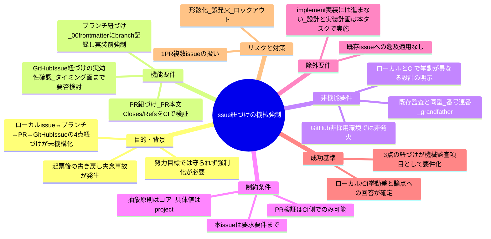
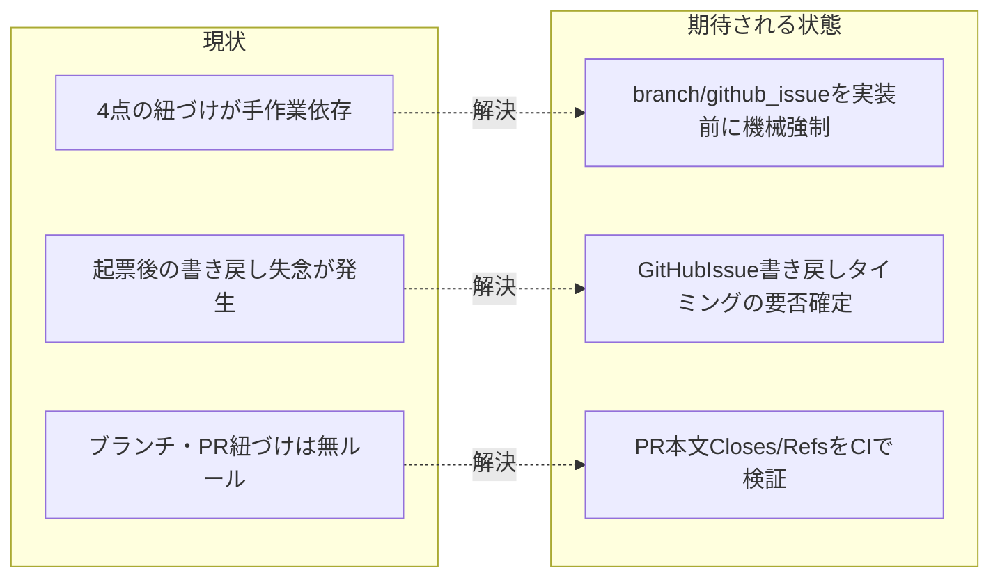

# 要求定義書: issue 紐づけ（ブランチ・GitHub Issue・PR）の機械強制

**プロジェクト名**: issue 紐づけ（ブランチ・GitHub Issue・PR）の機械強制
**作成日**: 2026 年 07 月 13 日
**最終更新**: 2026 年 07 月 13 日

> **重要**:
>
> - 要求定義書は、プロジェクトの全体像を把握するためのものです。詳細な技術仕様や実装方法は要件定義書以降で記載します。必要最低限の情報に収めることを心掛けてください。
> - **このドキュメントは常に更新**: 要求の変更や追加があった場合は、即座にこのドキュメントを更新してください。ドキュメントは「生きているドキュメント」として扱い、実装内容と常に同期させます。
> - **必須項目**: 以下の「必須」と明記した項目は空欄・抽象語のみで提出しないこと。判定可能な形で記入すること。
>
> **用語**: [.agent-skill-chain/source/CONCEPTS.md §用語規約](../../../../../.agent-skill-chain/source/CONCEPTS.md#用語規約) を参照。

---

## 要求定義の全体像

**注意**:

- マインドマップは全体像を把握するためのものです。主要なセクション名程度に留め、詳細は記載しないでください。

---

## 1. 目的・背景

### 1.1 目的（必須）

ローカル issue・ブランチ・PR・GitHub Issue の 4 点紐づけを機械監査で強制する。

### 1.2 背景

- **現状の課題**:
  - 本フレームワークのワークフローは、ローカル issue（`docs/maintainer/workflow/{issue}/00_要求定義.md` の frontmatter）と、GitHub Issue・feature ブランチ・PR という 4 つの実体を扱うが、これらの**相互紐づけを機構的に強制する仕組みが存在しない**。紐づけは進行役の手作業と注意力に依存し、場当たり的に運用されている。
  - 別 issue「GitHubIssue 起票ゲート追加」（別ブランチ `docs/github-issue-gate`）で、ローカル issue と GitHub Issue の紐づけ（00_要求定義.md の frontmatter `github_issue` キー）を導入し、implement-feature 着手前に `github_issue` が空でないことを機械監査（本 issue では便宜上「github_issue ゲート監査」と呼ぶ。番号は当該 issue の設計で確定・予約される）で強制する設計を進めている。しかし、この過程で**進行役が実際に `gh issue create` で GitHub Issue を複数作成した際、ローカルへの書き戻し（`github_issue` への記録）を失念する事故**が発生した。
  - この事故を起点に、ユーザーから紐づけ強制の要求が連鎖して挙がった: (1) 起票時のローカルへの書き戻しがルール化されていない、(2) PR 化するときも issue への紐づけが必要でありルール化すべき、(3) 紐づけルールは努力目標ではなく強制化（機械監査）が必要、(4) ブランチが切られているならその紐づけもルール化して強制すべき（evidence_source: ユーザー指摘の連鎖。本 issue タスク記述。`user_directive`）。

- **必要性**:
  - 上記 4 点を整理すると、**「ローカル issue ⇔ ブランチ ⇔ PR ⇔ GitHub Issue」という 4 点の紐づけ全体が、機械強制の仕組みを持たないまま運用されている構造的欠落**がある。GitHub Issue 紐づけ（github_issue ゲート監査）は 4 点のうち 1 辺のみを扱う。残る「ブランチ紐づけ」「PR 紐づけ」を同型の機械監査として補完し、かつ GitHub Issue 紐づけの実効性（起票直後の書き戻しタイミングまで強制するか）を再確認する必要がある。
  - 「努力目標では守られない」ことは上記の書き戻し失念事故で実証済みであり、機械監査（audit.sh の連番チェック・CI FAIL）による強制が要求されている。

### 1.3 期待される効果（必須: 1 件以上）

- **効果 1**: implement-feature 着手前に「対応する feature ブランチ名がローカル（00_要求定義.md frontmatter `branch`）に記録されている」ことが必須になる（○/×判定: `branch` が空のまま implement-feature ログが記録された issue を機械監査が FAIL 検知できることを、要件・失敗条件として確認できる）。
- **効果 2**: GitHub Issue 紐づけについて、既存の「github_issue が空でないことの implement 前チェック」で十分か、起票直後の書き戻しタイミングまで強制すべきかの方針が両論併記で整理され、design-feature への申し送りとして確定する（○/×判定: 両案の判定手段・トレードオフが 01 に記載されていることを確認できる）。
- **効果 3**: 実装 PR の本文に対応 GitHub Issue への `Closes #<番号>` または `Refs #<番号>` が含まれることを CI（GitHub Actions）で検証できる（○/×判定: PR 本文に紐づけキーワードが無い PR を CI が FAIL 検知する失敗条件が要件化され、ローカル issue の `github_issue` が `declined:` の場合は検証対象外とすることが明記されていることを確認できる）。

**現状と期待される状態の比較**:

---

## 2. 機能要件

### 2.1 既存機能の維持（該当する場合）

- 既存フェーズ順（00 → 01 → 02 → 03 → review-docs → 実装 → verify-and-close）、既存の各機械監査（audit.sh #1〜#32・github_issue ゲート監査）の挙動は変更しない。本 issue は既存監査群に**同型の新規監査項目を追加**するものであり、既存を置換・弱化しない。
- ローカルファイル（00〜04）・`workflow.db` 証跡・書記（write-workflow-log）委譲の仕組みは維持する。
- GitHub Issue 紐づけ（github_issue ゲート監査）の設計・実装は別 issue の責務であり、本 issue はその**実効性の再確認**（効果 2）に留め、当該監査の再定義・置換は行わない。

### 2.2 新規機能要件

本 issue のスコープは以下の 3 点である。

1. **ブランチ紐づけ**: 00_要求定義.md frontmatter に `branch` キー（例: `branch: "docs/readme-audience-split"`）を追加し、implement-feature 着手時にこれが記録されている（空でない）ことを機械監査で強制する。github_issue ゲート監査と同型（implement 前チェック・issue_path スコープ・grandfather）の新規監査項目とする。テンプレート（`.agent-skill-chain/runtime/templates/00_要求定義.md`）への `branch` キー追加を伴う。
2. **GitHub Issue 紐づけの実効性確認**: github_issue ゲート監査（github_issue が空でないことの implement 前チェック）で十分か、あるいは「起票した直後に書き戻す」というタイミング面の強制まで必要かを両論併記で整理し、design-feature への申し送りとする。本 issue（要求・要件フェーズ）では両案を残す（一方に確定しない）。
3. **PR 紐づけ**: PR 本文に対応 GitHub Issue への `Closes #<番号>` または `Refs #<番号>` が含まれることを CI で検証する新規監査チェックを追加する。既存の「#6 内部参照禁止」チェックと同型の `PR_BODY` 受け渡しパターン（`.agent-skill-chain/runtime/templates/github/workflows/audit.yml` 等で `github.event.pull_request.body` を `PR_BODY` に渡す）を用いる。ローカル issue の `github_issue` が `declined:` の場合はこの検証の対象外とする。

---

## 3. 非機能要件

### 3.1 パフォーマンス

- 各監査は 1 issue あたり数回の frontmatter 読み取り・文字列照合であり、ワークフロー実行時間・CI 実行時間への有意な影響はない。

### 3.2 セキュリティ

- PR 本文の検証は GitHub Actions が提供する `github.event.pull_request.body` を用い、認証トークン等の秘匿値を成果物・ログに残さない。既存 #6 の `PR_BODY` 受け渡しと同一の安全性を踏襲する。

### 3.3 互換性

- **GitHub Issues／PR を採用していない・使えない環境では該当監査を発動させない**（フォールバック）。PR 紐づけ検証は `PR_BODY` が渡らない実行（ローカル・push イベント）では SKIP する。ブランチ紐づけ監査は `git` リポジトリ・frontmatter に依存し、非対象環境では既存監査と同型の SKIP ガードに従う。
- 既存の enforcement 失敗条件（#6・#29・#32・github_issue ゲート監査等）と**非交差**になるよう、本 issue で追加する各監査は独立した番号で定義する（番号割当は 02/03 で確定）。過去に enforce on が Agent ツール名未対応で orchestrator を完全ロックアウトした事例と同種の硬直リスクを避け、非対象環境での誤発火を起こさない。

### 3.4 保守性

- 抽象原則（紐づけの存在・記録タイミング・機械強制の存在・適用条件・grandfather の存在）は**コア**（`.agent-skill-chain/source/`）に、具体値（`branch` キーの記録手順・PR 本文の具体キーワード運用・CI での `PR_BODY` 配線の具体・発効日の具体値）は既存の汎用/固有境界パターンに従い `.agent-skill-chain/project/自己拡張ワークフロー.md` または各テンプレートに置く。コアに具体コマンド・具体値を持ち込まない。

---

## 4. 制約条件

### 4.1 技術的制約

- **PR 紐づけの検証はローカル audit.sh（コミット前）では原理的に不可能**である。PR 本文は GitHub 上にしか存在せず、ローカル実行時には取得できない。したがって PR 紐づけ検証は CI（GitHub Actions）側で `PR_BODY` が渡されたときにのみ実行可能であり、**ローカル実行時（`PR_BODY` 未設定）と CI 実行時で挙動が異なる設計**になる（ローカル・push では SKIP、PR イベントでのみ FAIL 判定）。この挙動差は仕様として要件に含める。
- ブランチ紐づけ・GitHub Issue 紐づけの監査は、frontmatter（ローカルファイル）を情報源とするためローカル audit.sh でも CI でも実行可能である。
- 既存の各監査（github_issue ゲート監査を含む）と**同型・同強度**（絶対強制・全 issue 一律・規模比例の免除なし。ただし発効日 grandfather は適用）とする。
- コア／`.agent-skill-chain/project/` の**配置境界**を越えない。

### 4.2 既存システムとの互換性

- 既存の enforcement（audit.sh・subagent-guard 等）・`workflow.db` スキーマ・PR_BODY 受け渡しテンプレート（audit.yml / subagent-guard.yml）と整合させる。
- 本リポジトリの CI（`.github/workflows/self-enforce.yml`）は現在 audit.sh を `continue-on-error`（非ブロッキング）で呼び出し、かつ `PR_BODY` を渡していない。PR 紐づけ検証を本リポの PR で実効化するには self-enforce.yml への `PR_BODY` 配線が必要になる点を、design-feature への申し送りとして明記する（本 issue では要件として指摘するに留め、CI 定義の実編集はしない）。

### 4.3 移行期間・スケジュール

- 発効日（grandfather 境界）の扱いは既存 #32 の `REVIEWDOCS_GATE_EFFECTIVE_FROM` と同型に、発効日より前の既存 issue には遡及適用しない方針とする。具体的な発効日・env 変数名は 02/03 で確定する。

---

## 5. 除外要件

- **既存 issue（①〜⑨、`docs/maintainer/workflow/` 配下）への遡及適用は行わない**（grandfather）。新規発効日以降の issue にのみ適用する。
- **implement-feature（実装）には進まない**。本 issue では 02_設計.md・03_実装計画.md まで作成する。実装着手前に review-docs（実装前ドキュメントレビュー）と GitHub Issue 起票判断ゲートを経ることとし、implement-feature 以降は当該ゲート通過後に実施する。
- **GitHub Issue 紐づけ（github_issue ゲート監査）の再設計・置換は対象外**。本 issue は当該監査の実効性の再確認（効果 2 の両論併記）に留める。
- **具体値のコア記載は対象外**: PR 本文の具体キーワード運用・`branch` の具体記録手順・発効日の具体値・CI 配線の具体は、`.agent-skill-chain/project/` または各テンプレートに置き、コアには抽象原則のみを書く（配置境界の申し送りとして 02 設計へ引き継ぐ）。
- 別ブランチ（`docs/github-issue-gate` 等）の実物ファイルの編集は対象外（読み取りのみ）。

---

## 6. 成功基準（必須: 1 件以上）

- ブランチ紐づけ（`branch` frontmatter・implement 前必須・機械監査）が、○/×判定可能な受け入れ基準として 01 に定義されている。
- GitHub Issue 紐づけの実効性について、「github_issue ゲート監査で十分」案と「起票直後の書き戻しタイミングまで強制」案の両案が、判定手段・トレードオフとともに 01 に両論併記され、design-feature への申し送りが明記されている。
- PR 紐づけ（PR 本文 `Closes #<番号>`／`Refs #<番号>` を CI で検証・`declined:` は対象外）が、○/×判定可能な受け入れ基準として 01 に定義され、**ローカル実行時と CI 実行時で挙動が異なる**（ローカル・push は SKIP、PR イベントで FAIL 判定）ことが要件として明記されている。
- 検討すべき論点（監査番号体系の統合 or 独立・PR 検証の CI 限定性・1PR=1issue か複数 issue まとめか・grandfather）への回答／方針が 01 に記載されている。
- 適用範囲・非対象環境での非発火（フォールバック）・grandfather（既存 issue 非遡及）が要件として明記されている。
- 抽象原則＝コア／具体値＝`.agent-skill-chain/project/`・テンプレートの配置境界が、02 設計への申し送りとして 00 に明記されている。

---

## 7. リスクと対策

### 7.1 技術的リスク

- **リスク**: 監査が形骸化し、「ブランチ・PR を紐づけたことにして実装／PR 化へ進む」運用が常態化する。
  - **対策**: frontmatter への記録・PR 本文への紐づけキーワードを必須とし、未記録・未記載を機械監査で FAIL 検知する。機械検知が困難な範囲は AI 自律判断＋人手監査に委ねる旨を明記する（既存 #22–#24 と同じ扱い）。
- **リスク**: 非対象環境（GitHub 非採用・PR_BODY 未取得・push イベント）で誤発火し、実行不能・ロックアウトになる（過去に enforce on が Agent ツール名未対応で orchestrator を完全ロックアウトした事例と同種の硬直リスク）。
  - **対策**: PR 紐づけ検証は `PR_BODY` 非設定時は必ず SKIP する（既存 #6 と同型）。ブランチ／GitHub Issue 紐づけ監査も既存監査と同型の SKIP ガード（非 git・DB 不採用・grandfather）を備える。
- **リスク**: 1PR に複数のローカル issue が含まれる場合、PR 本文の `Closes/Refs` 照合の粒度（1 件以上でよいか、issue ごとに必要か）を誤り、正当な PR を FAIL させる（過剰強制）または取りこぼす（過小強制）。
  - **対策**: 1PR=1issue を原則とし、複数 issue をまとめた PR もありうる前提で、照合粒度を「少なくとも 1 件の有効な `Closes/Refs` を要求」とする案を軸に 02 で一意に確定する。曖昧な自動推測に依存しない。
- **リスク**: `branch` キー追加によるテンプレート／既存 issue frontmatter の非互換（既存 00 に `branch` が無い）。
  - **対策**: grandfather（発効日前の既存 issue は対象外）と、`branch` キー未存在＝未記録として扱う後方互換パースにより、既存 issue を誤 FAIL させない。

### 7.2 スケジュールリスク

- **リスク**: 特になし（変更範囲はコアの紐づけ規約追加・テンプレートへの `branch` キー追加・audit.sh への監査項目追加・`.agent-skill-chain/project/` の具体値追加・CI 配線の申し送りに限定される見込み）。
  - **対策**: 該当なし。

---

## 8. 参考資料

### プロジェクトドキュメント

- [`.agent-skill-chain/source/enforcement/ci/audit.sh`](../../../../../.agent-skill-chain/source/enforcement/ci/audit.sh) — 既存監査群（#1〜#32）。特に #6 内部参照禁止（`PR_BODY` を受け取り PR 本文を検証する既存唯一の前例・312〜319 行）と #29/#32（implement 前チェック・grandfather の同型パターン）。
- [`.agent-skill-chain/runtime/templates/github/workflows/audit.yml`](../../../../../.agent-skill-chain/runtime/templates/github/workflows/audit.yml) — CI 側で `PR_BODY: github.event.pull_request.body` を渡す配線（37 行）。PR 紐づけ検証の受け渡しテンプレート。
- [`.agent-skill-chain/runtime/templates/github/workflows/subagent-guard.yml`](../../../../../.agent-skill-chain/runtime/templates/github/workflows/subagent-guard.yml) — 同じく `PR_BODY` 受け渡しの前例。
- [`.github/workflows/self-enforce.yml`](../../../../../.github/workflows/self-enforce.yml) — 本リポ CI。audit.sh を非ブロッキング（continue-on-error）で呼び、`PR_BODY` 未配線。PR 紐づけ実効化には配線追加が必要（申し送り）。
- [`.agent-skill-chain/runtime/templates/00_要求定義.md`](../../../../../.agent-skill-chain/runtime/templates/00_要求定義.md) — `branch` キー追加対象の frontmatter テンプレート。
- [`.agent-skill-chain/source/CLOSEOUT.md`](../../../../../.agent-skill-chain/source/CLOSEOUT.md) — §commit ステップ（1 サブ issue=1 論理コミット・feature ブランチ・push はユーザー明示時のみ）。1PR=1issue 原則の根拠。
- [`.agent-skill-chain/source/enforcement/README.md`](../../../../../.agent-skill-chain/source/enforcement/README.md) — §失敗条件と差し戻し。新規監査の番号割当・強制レベル記載の正本。
- 別 issue「GitHubIssue 起票ゲート追加」（別ブランチ `docs/github-issue-gate`）の 00/01 — `github_issue` frontmatter キーと github_issue ゲート監査の設計。本 issue のブランチ紐づけはこれと同型。

### その他の参考資料

- GitHub の PR 本文キーワード（`Closes #N` / `Refs #N` 等）によるマージ時 Issue 自動クローズ・参照仕様（GitHub 公式）。

---

## 9. 次のステップ

この要求定義書に続く工程：

- [`01_要件定義.md`](./01_要件定義.md)・[`02_設計.md`](./02_設計.md)・[`03_実装計画.md`](./03_実装計画.md)（作成済み）
- **次**: review-docs（実装前ドキュメントレビュー）→ GitHub Issue 起票判断ゲート → implement-feature（実装）
