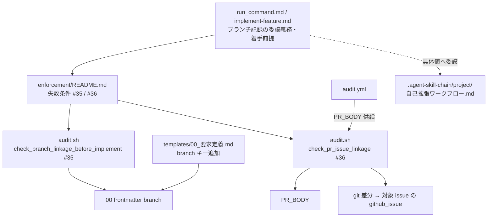
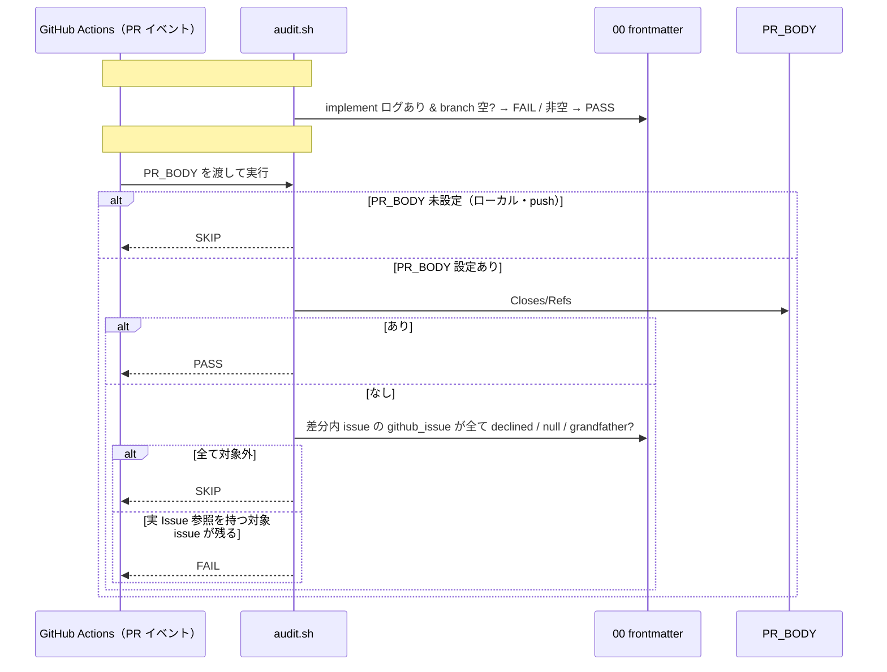
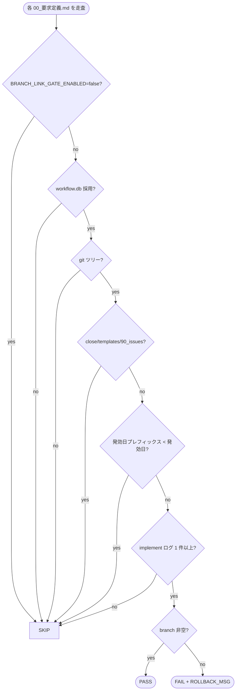
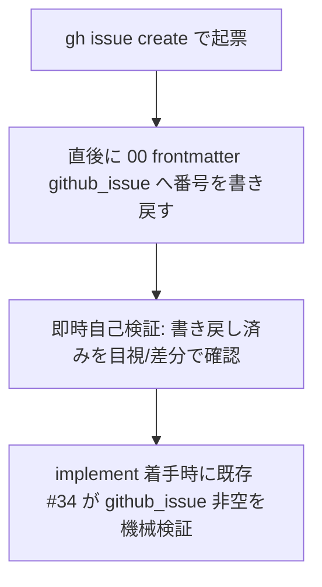
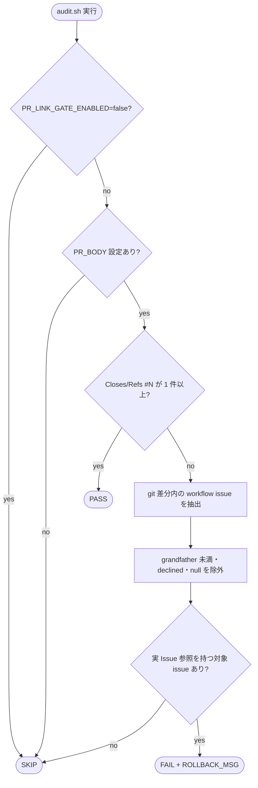

# 設計書: issue 紐づけ（ブランチ・GitHub Issue・PR）の機械強制

**プロジェクト名**: issue 紐づけ（ブランチ・GitHub Issue・PR）の機械強制
**作成日**: 2026 年 07 月 13 日
**最終更新**: 2026 年 07 月 13 日

> **重要**: **このドキュメントは常に更新**: 設計の変更や追加があった場合は、即座にこのドキュメントを更新してください。ドキュメントは「生きているドキュメント」として扱い、実装内容と常に同期させます。
>
> **用語**: [.agent-skill-chain/source/CONCEPTS.md §用語規約](../../../../../.agent-skill-chain/source/CONCEPTS.md#用語規約) を参照。

---

## 1. 設計概要

**必須**: 設計方針・原則は [.agent-skill-chain/source/spec/01\_設計原則.md](../../../../../.agent-skill-chain/source/spec/01_設計原則.md) を先に参照した上で、本プロジェクトに適用するものを選び記載する。

### 1.1 設計方針

既存の機械監査群（`audit.sh` #6・#32・#34）と**同一構造・同一強度**の監査項目を、辺ごとに**独立番号**で追加する（新規の強制機構を発明せず、既存パターンの写像で実現する）。3 辺のうち「ブランチ紐づけ」は既存の implement 前ゲート（#32/#34）の写像で `audit.sh` に **#35** として、「PR 紐づけ」は既存の PR_BODY 検証（#6）の写像で `audit.sh` に **#36** として追加する。「GitHub Issue 紐づけの実効性」は 01 の両論併記を design で決着させ、**新規監査番号を割り当てず**、既存 #34（別 issue の責務）を再定義しないまま補完規約で扱う。抽象原則（紐づけの存在・記録タイミング・機械強制の存在・適用条件・grandfather）は**コア**（`.agent-skill-chain/source/`）に、具体値（`branch` の記録手順・PR 本文の具体キーワード運用・発効日の具体値・CI 配線の具体）は `.agent-skill-chain/project/自己拡張ワークフロー.md` および各テンプレートに置く。

### 1.2 設計原則（本プロジェクトで適用するもの）

- **UNIX 哲学**: 各監査は「1 辺の紐づけの有無を検証する」という 1 つのことだけを行う。既存フェーズ順・既存監査には手を加えない（小さく作る・組み合わせ可能）。[01\_設計原則 §UNIX哲学](../../../../../.agent-skill-chain/source/spec/01_設計原則.md)。
- **単一責務**: 抽象原則（コア）・具体手順（project）・機械検知（`audit.sh`）・テンプレート（frontmatter・CI 配線）を責務ごとに別ファイルへ分離する。1 監査 1 番号・1 チェック関数。
- **明確な境界**: 抽象原則（コア）と具体値（project/テンプレート）の境界を既存の汎用/固有境界パターンと同型に引く（[MODEL_SELECTION.md §汎用/固有境界](../../../../../.agent-skill-chain/source/MODEL_SELECTION.md)）。
- **AI フレンドリー設計**: 既存 #32/#34（implement 前ゲート）・#6（PR_BODY 検証）の記述・実装位置を写像し、意図が既存構造から読み取れる形にする（[01\_設計原則 §AIフレンドリー設計](../../../../../.agent-skill-chain/source/spec/01_設計原則.md#aiフレンドリー設計)）。

---

## 2. アーキテクチャ設計

### 2.1 責務・境界・参照関係

[01\_設計原則 §明確な境界・§単一責務](../../../../../.agent-skill-chain/source/spec/01_設計原則.md) に従い、本 issue で**変更・新設される規約/コードの単位**をコンポーネントとして責務・境界・参照関係を明示する。

#### 2.1.1 責務一覧

| コンポーネント | 責務（1 文） |
| -------------- | ------------ |
| `enforcement/ci/audit.sh` `check_branch_linkage_before_implement`（コア・新設 #35） | workflow.db 採用時・issue_path 前方一致で、implement-feature ログが 1 件以上あるのに 00_要求定義.md frontmatter の `branch` が空（null/空文字/`~`/キー無し）なら FAIL する近似検知を持つ。 |
| `enforcement/ci/audit.sh` `check_pr_issue_linkage`（コア・新設 #36） | CI で `PR_BODY` が渡されたとき、PR 本文に有効な `Closes/Refs #<番号>` が 1 件以上含まれること（declined・grandfather の対象は除外）を検証し、無ければ FAIL する近似検知を持つ。`PR_BODY` 未設定時は SKIP する。 |
| `enforcement/README.md §失敗条件`（コア・変更） | 新規失敗条件 #35（ブランチ未紐づけ）・#36（PR 未紐づけ）を、既存 #32/#34/#6 と非交差の独立番号で定義し、対応表・差し戻し先を追記する。 |
| `implement-feature.md §実行時の注意` / `run_command.md §Constraints`（コア・変更） | implement 着手の前提に「対応 feature ブランチ名の 00 frontmatter への記録」を委譲義務・着手前提として 1 項追加する（既存の #32/#34 の記述位置を写像）。 |
| `runtime/templates/00_要求定義.md`（テンプレート・変更） | frontmatter に `branch` キーを追加する（新規 issue の記録面の単一情報源）。 |
| `runtime/templates/github/workflows/audit.yml`（テンプレート・現状維持で充足） | PR イベントで `PR_BODY: github.event.pull_request.body` を渡す既存配線（37 行）が #36 の入力を供給する。**本 issue での変更は不要**（既存前例をそのまま利用）。 |
| `.agent-skill-chain/project/自己拡張ワークフロー.md`（固有・変更） | 具体値（`branch` の記録手順・PR 本文の具体キーワード運用・起票直後の書き戻し規約・発効日の具体値・本リポ CI 配線の具体）を持つ。 |
| `00_要求定義.md frontmatter の `branch` / `github_issue`（データ・記録面） | `branch`＝対応 feature ブランチ名（#35 の検知対象）。`github_issue`＝実 Issue 参照 or `declined:` 理由（#36 の declined 判定キー・別 issue #34 の検知対象）。 |

#### 2.1.2 境界

- **入力**: (a) #35＝対象 issue の 00 frontmatter `branch` の有無/値、当該 issue に implement-feature ログがあるか、issue ディレクトリ名の発効日プレフィックス、実行環境が git ツリーか。(b) #36＝`PR_BODY` の有無/内容、PR の差分に含まれる workflow issue ディレクトリとその `github_issue`。
- **出力**: 各監査の PASS / FAIL / SKIP（`EXIT_CODE` と差し戻しメッセージ `ROLLBACK_MSG`）。
- **他責務との境界**:
  - **既存 #32（review-docs ゲート）・#34（github_issue ゲート）・#6（PR 内部参照禁止）は変更しない**。本 issue はそれらと非交差の独立番号で 2 監査（#35・#36）を追加するのみ。
  - **GitHub Issue 紐づけの機械監査（#34）は別 issue の責務であり、再定義・置換しない**（00 §5・§2.1 除外要件）。本 issue は #34 の実効性を design で再確認し補完規約を置くに留める（§2.5 ADR-3）。
  - **具体的な `gh` コマンド・PR 本文の運用文言・`branch` 記録手順・発効日の具体運用・本リポ CI 配線の実編集は本設計（コア）で確定しない**。project 側・テンプレート・申し送りへ委譲する（YAGNI・配置境界。§2.5 ADR-6・ADR-7）。
  - **本リポ CI（self-enforce.yml）の `PR_BODY` 配線・ブロッキング化は本 issue の実装対象外**（00 §4.2）。申し送りとする（§2.5 ADR-7）。

#### 2.1.3 参照関係

- `run_command.md` → `implement-feature.md`（着手前提として整合）
- `implement-feature.md` → `enforcement/README.md`（#35 未紐づけ検知を参照）
- `enforcement/README.md` → `enforcement/ci/audit.sh`（#35・#36 の実装所在）
- `audit.sh (#35)` → `00_要求定義.md frontmatter branch`（近似検知の対象を読む）
- `audit.sh (#36)` → `PR_BODY` ＋ git 差分 → 対象 issue の `00 frontmatter github_issue`（declined 判定）
- `audit.yml` → `audit.sh`（`PR_BODY` を供給）
- コア各ファイル → `.agent-skill-chain/project/自己拡張ワークフロー.md`（具体値へ委譲）
- 循環参照は持たない（コア → project の一方向。project からコアへの実装依存は張らない）。

### 2.2 システムアーキテクチャ

**必須**: 設計判断は [.agent-skill-chain/source/spec/](../../../../../.agent-skill-chain/source/spec/)（[00_spec概要.md](../../../../../.agent-skill-chain/source/spec/00_spec概要.md)、[01\_設計原則.md](../../../../../.agent-skill-chain/source/spec/01_設計原則.md)、[06\_設計判断の優先順位.md](../../../../../.agent-skill-chain/source/spec/06_設計判断の優先順位.md)）を先に参照している。

- **採用パターン**: 既存監査の**写像パターン**。implement 前の状態ゲート（#32/#34 の写像＝#35）と、CI 限定の PR_BODY 検証（#6 の写像＝#36）を、規約駆動＋CI 近似検知の二層構成で追加する。
- **根拠**: [06\_設計判断の優先順位.md](../../../../../.agent-skill-chain/source/spec/06_設計判断の優先順位.md) の「仕様との整合性」「構造の一貫性」を優先。新規機構を発明せず既存監査の構造・強度・SKIP 設計・grandfather に揃える（evidence_source: `repo_file` — audit.sh の #6（312–319 行）・#32（891 行〜）・docs/github-issue-gate ブランチの #34 を実読）。

#### 2.2.1 CQRS（Command/Query 分離）

- **Command（状態変更）**: 本 issue の監査自体は状態を変更しない（読み取り専用の検証）。記録面の状態変更（`branch`/`github_issue` の frontmatter 記録、PR 本文への `Closes/Refs` 記載）は進行役の作業であり、監査はその結果を Query するのみ。
- **Query（状態取得）**: `branch` の有無、implement-feature ログの有無、`PR_BODY` の内容、git 差分に含まれる issue の `github_issue`。いずれも副作用を持たない（[06\_設計判断の優先順位.md](../../../../../.agent-skill-chain/source/spec/06_設計判断の優先順位.md) 「query に副作用を書いてはならない」）。

#### 2.2.2 アーキテクチャ図（本プロジェクトの構成で記載）

### 2.3 コンポーネント構成

明確な境界（コア＝抽象原則層／project＝具体値層／enforcement＝近似検知層／テンプレート＝記録面・CI 配線／成果物 frontmatter＝記録面）で構成し、各コンポーネントは単一責務を満たす（§2.1.1）。本 issue はコード実装よりも **`audit.sh` への監査 2 項追加とその規約ドキュメント**が主成果物であり、UI・DB スキーマの新設は伴わない。

### 2.4 データフロー

各監査は同期処理であり、独立したイベントバスは導入しない（[06\_設計判断の優先順位.md](../../../../../.agent-skill-chain/source/spec/06_設計判断の優先順位.md) 「単純な同期処理で十分な場合は無理に導入しない」）。概念上の「起きた事実」としては `BranchLinked`（ブランチを 00 に記録）/ `PRLinked`（PR 本文に Closes/Refs 記載）/ `GitHubIssueRecorded`（github_issue 記録＝#34 の領域）を区別できるが、監査はいずれもその結果を検証するだけである。

### 2.5 横断設計判断（ADR）

本プロジェクトの重要判断を [EVIDENCE_POLICY.md](../../../../../.agent-skill-chain/source/EVIDENCE_POLICY.md) の ADR 形式で記録する。evidence_source の分類定義は [CONCEPTS.md §外部根拠の必須化](../../../../../.agent-skill-chain/source/CONCEPTS.md#外部根拠の必須化external-anchor) を参照する。

#### ADR-1: 監査番号は独立番号 #35（ブランチ）・#36（PR）とする

- **コンテキスト**: 01 論点 1（監査番号体系: 統合 or 独立）への決着が必要。3 辺は実行コンテキストが異なる（ブランチ＝frontmatter 情報源・ローカル/CI 双方／PR＝`PR_BODY` 限定・CI のみ）。
- **検討した選択肢**: (A) 1 チェックに統合、(B) 辺ごとに独立番号。
- **決定**: **(B) 独立番号**。ブランチ＝#35、PR＝#36。GitHub Issue 実効性は新規番号を割り当てない（ADR-3）。
- **根拠**: 既存監査は「1 チェック=1 番号」で運用され（#6・#32・#34）、SKIP ガード・grandfather・強制コンテキストが辺ごとに異なるため統合は可読性・非交差性を損なう。既存採番の最大値は #34（`docs/github-issue-gate` ブランチ）・#33（`docs/close-move-enforcement` ブランチ）であり、いずれも未マージだが採番を予約済み。衝突回避のため次番から #35・#36 を採る（evidence_source: `repo_file` — 両並行ブランチの audit.sh を `git show` で実読し #33/#34 を確認）。
- **帰結**: `audit.sh` に `check_branch_linkage_before_implement`（#35）・`check_pr_issue_linkage`（#36）を追加し、`enforcement/README.md` の対応表・失敗条件一覧に #35・#36 を追記する。既存 #6/#32/#33/#34 とは非交差。

#### ADR-2: #35 は #32/#34 の implement 前ゲート写像とする（frontmatter 情報源・ローカル/CI 共通）

- **コンテキスト**: 01 ストーリー 1。implement 着手前に `branch` が記録されていることを機械強制したい。
- **検討した選択肢**: (A) git の実ブランチ名と frontmatter の一致まで検証、(B) frontmatter に `branch` が非空で記録されていることのみ検証。
- **決定**: **(B) frontmatter `branch` の非空記録のみを検証**。値と実ブランチの一致照合は行わない。
- **根拠**: 01 受け入れ基準は「`branch` が空なら FAIL・非空なら PASS」であり実ブランチ照合は要求されていない（YAGNI）。実ブランチ名は worktree・detached HEAD・CI checkout で揺れ、照合は誤 FAIL を招く。既存 #34（github_issue の非空検証）と同型の「記録の有無」検査に揃える（evidence_source: `repo_file` — 01 §2.1 ストーリー1 受け入れ基準・audit.sh #34 実装）。
- **帰結**: `#35` は #32/#34 と同じ骨格（workflow.db 採用時のみ／`WORKFLOW_SCAN_DIRS` 走査／`00_要求定義.md` を目印に走査／implement-feature ログ前方一致＋basename 末尾一致／grandfather／close・templates・90_issues 除外）で実装する。値判定は「空/`null`/`~`/キー無し ＝ FAIL、非空 ＝ PASS」（#34 のような declined 分岐は持たない＝ブランチに declined 概念は無い）。frontmatter パースは既存 `get_document_id_from_file` と同型の awk ブロック抽出＋`grep -m1 -E '^branch:'`＋クォート除去を用いる。

#### ADR-3: GitHub Issue 紐づけの実効性は「案 A（現状維持）＋案 B の即時自己検証規約」で決着し、新規監査は作らない

- **コンテキスト**: 01 ストーリー 2・論点（両論併記）。既存 #34（implement 前に `github_issue` 非空を強制）で「書き戻し失念事故」を防げるか、起票直後の書き戻しタイミングまで強制するかの決着が必要。design-feature への申し送り事項であり、本 command で決着する。
- **検討した選択肢**: (A) #34 で十分（書き戻しは implement 着手前の遅延許容点まで猶予し #34 が捕捉）、(B) `gh issue create` 実行直後の書き戻しまで機械強制する新規監査を追加。
- **決定**: **機械強制は案 A を採用**（#34 を唯一の機械ゲートとし、新規監査番号は割り当てない）。**加えて案 B の趣旨を「即時自己検証規約」として非機械的に補完**する（起票 → 即書き戻しの手順を `.agent-skill-chain/project/自己拡張ワークフロー.md` に規約化。CLOSEOUT の委譲ツール発行 malformed 自己検証と同型の即時自己検証＋人手監査）。
- **根拠**: 「起票直後」という時点は git 差分・DB・frontmatter のいずれにも痕跡を残さず**機械検知が原理的に困難**（01 ストーリー2 案 B が自認）。過剰な新規監査は形骸化・誤発火リスクを増やすだけで実効を伴わない。#34 は別 issue の責務であり本 issue で再定義・置換しない（00 §5）。よって機械強制は #34 に一本化し、タイミング面は規約＋人手監査に委ねる（#22–#24・#30 と同じ CI 非強制の扱い）（evidence_source: `repo_file` — 01 §2.1 ストーリー2・enforcement/README §失敗条件 #22–#24/#30・CLOSEOUT 自己検証）。
- **帰結**: 本 issue で GitHub Issue 紐づけの新規 `audit.sh` チェックは追加しない。`.agent-skill-chain/project/自己拡張ワークフロー.md` に「起票直後に 00 frontmatter `github_issue` へ書き戻す」自己検証手順を規約として追記する（具体は project）。#34 の設計・実装は別 issue のまま不変。

#### ADR-4: #36 は #6 の PR_BODY 検証写像とし、CI 限定・ローカル/push は SKIP

- **コンテキスト**: 01 ストーリー 3・論点 2（PR 検証の CI 限定性）。PR 本文は GitHub 上にしか存在せずローカル audit.sh では取得不可。
- **検討した選択肢**: (A) ローカルでも何らかの近似検証、(B) `PR_BODY` が渡る CI（PR イベント）でのみ検証しローカル/push は SKIP。
- **決定**: **(B) CI 限定**。既存 #6 と同型に `[[ -n "${PR_BODY:-}" ]]` ガードで、`PR_BODY` 未設定なら検証をスキップする。
- **根拠**: PR 本文はローカルに存在せず原理的に検証不能（01 §4.1・§5）。既存 #6 が唯一の PR_BODY 受け渡し前例であり、新たな受け渡し機構を発明しない（evidence_source: `repo_file` — audit.sh #6（312–319 行）・templates/github/workflows/audit.yml:37）。
- **帰結**: **ローカル実行時と CI 実行時で挙動が異なる**（ローカル・push は SKIP、PR イベントで FAIL 判定）ことを仕様として明記する。テンプレート `audit.yml` の既存 `PR_BODY` 配線がそのまま入力を供給するため、消費者環境では追加配線なしで有効になる。

#### ADR-5: PR 本文の照合粒度は「有効な Closes/Refs が 1 件以上」・キーワードパターンを確定

- **コンテキスト**: 01 論点 3（1PR=1issue か複数 issue まとめか）・データ形式要件（キーワードの厳密パターンは 02 で確定）。
- **検討した選択肢**: (A) issue ごとに 1:1 で `Closes/Refs` を要求、(B) PR 本文に少なくとも 1 件の有効な `Closes/Refs` を要求。
- **決定**: **(B) 少なくとも 1 件**。1PR=1issue を原則としつつ、複数 issue まとめ PR も許容する。キーワードの厳密パターンは以下に確定する。
  - クローズ系: `close` / `closes` / `closed` / `fix` / `fixes` / `fixed` / `resolve` / `resolves` / `resolved`
  - 参照系: `ref` / `refs` / `references`
  - いずれも大小文字を問わず（case-insensitive）、直後に空白 1 個以上を挟んで `#<数字>` または `<owner>/<repo>#<数字>` が続くものを有効とする。正規表現の骨子: `(?i)(clos(e|es|ed)|fix(es|ed)?|resolv(e|es|ed)|refs?|references?)[[:space:]]+([[:alnum:]._-]+/[[:alnum:]._-]+)?#[0-9]+`（`fix` の任意語尾は空選択肢 `(|es|ed)` を避け `fix(es|ed)?` とする。ugrep 等が空選択肢を拒否するための可搬性対応。GNU grep でも同義）。
- **根拠**: issue ごとの厳密 1:1 照合は PR とローカル issue の対応を機械的に一意特定する情報源が乏しく過剰強制になりやすい（01 論点 3・リスク §7.1）。GitHub 公式のクローズ/参照キーワードに準拠する（evidence_source: `repo_file` 01 §2.3 論点3 ／ `web_general` GitHub 公式のクローズキーワード仕様）。
- **帰結**: `check_pr_issue_linkage` は上記パターンに `grep -qiE` で 1 件以上マッチすれば PASS。具体の運用文言（PR テンプレへの記載例）は `.agent-skill-chain/project/自己拡張ワークフロー.md` に置く（コアにはパターンのみ）。

#### ADR-6: #36 の declined 除外・grandfather の判定キーは「git 差分内の対象 issue」を情報源とする

- **コンテキスト**: 01 ストーリー 3（`github_issue` が `declined:` の issue は対象外）・論点 4（PR は issue ディレクトリに直接紐づかないため grandfather 判定キーを 02 で確定）。
- **検討した選択肢**: (A) PR 作成日で grandfather を判定、(B) PR 差分に含まれる workflow issue ディレクトリの発効日プレフィックス・`github_issue` で判定。
- **決定**: **(B)**。#36 は PR 差分（`AUDIT_GIT_RANGE`／第 2 引数、未指定時 `HEAD~1..HEAD`。既存 #18/#19 と同じ差分解決）に含まれる `WORKFLOW_SCAN_DIRS` 配下の issue ディレクトリを対象として抽出し、各 issue の 00 frontmatter `github_issue` を読む。判定順序:
  1. PR 本文に有効な `Closes/Refs`（ADR-5）が 1 件以上 → **PASS**。
  2. そうでない場合、差分内の対象 issue を抽出し、(i) 発効日プレフィックスが `PR_LINK_GATE_EFFECTIVE_FROM`（既定 `20260713_000000`）未満の issue、(ii) `github_issue` が `declined:` で始まる issue、(iii) `github_issue` が空/`null`/`~`/キー無しの issue（実 Issue 番号が存在せず PR で参照不能。これは #34 の責務であり #36 とは非交差にする）を除外する。
  3. 除外後に **残る対象 issue（＝実 Issue 参照 `#<番号>`/URL を持つ非 declined・非 grandfather の issue）が 1 件以上あれば FAIL**、残らなければ（全て除外／差分に workflow issue が無い）**SKIP**（安全側 fail-open）。
- **根拠**: declined は `github_issue` frontmatter が単一情報源（01 §4.2・#34 の declined 記録形式）であり、PR と issue の対応は git 差分が最も確実。PR 作成日だけでは declined を判定できない。null/空の除外は #34（implement 前に `github_issue` 非空を強制）との**非交差**を保つため（null は #34 が捕捉すべき事象であり、実 Issue 番号が無い以上 PR で参照させることは原理的に不能）。非遡及は「CI が新規 PR イベントでのみ発火する」構造で一次的に保証され、加えて差分内 issue の発効日プレフィックスで二重に担保する（evidence_source: `repo_file` — 01 §2.3 論点4・§4.2・audit.sh #18/#19 の GIT_RANGE 解決・#34 の declined/非空判定）。
- **帰結**: 差分に workflow issue が現れない一般的な PR（コードのみ変更等）では #36 は SKIP し誤 FAIL を出さない。declined のみ・grandfather のみの PR も SKIP。実ブランチ名との照合は行わない。

#### ADR-7: 非対象環境フォールバックと発効日 grandfather（誤発火・ロックアウト回避）

- **コンテキスト**: 01 §3.4（可用性・ロックアウト回避）・00 §7.1（過去に enforce on が Agent ツール名未対応で orchestrator を完全ロックアウトした事例）。
- **検討した選択肢**: (A) フォールバックなしで一律発火、(B) 既存 #32/#34 と同型の多段 SKIP ガードを備える。
- **決定**: **(B)**。以下を SKIP ガードとする。
  - **#35**: (a) 無効化トグル `BRANCH_LINK_GATE_ENABLED`（既定 true・false/0/no/off で最優先 SKIP）、(b) workflow.db／workflow_log 不在、(c) 非 git ツリー（`git rev-parse --is-inside-work-tree` 偽。**github.com remote は要求しない**＝ブランチは GitHub 非採用でも成立する。#34 との差分）、(d) grandfather `BRANCH_LINK_GATE_EFFECTIVE_FROM`（既定 `20260713_000000`・env 上書き可）未満、(e) `close/`・`templates/`・`90_issues/` 配下除外。
  - **#36**: (a) 無効化トグル `PR_LINK_GATE_ENABLED`（既定 true）、(b) `PR_BODY` 未設定（ローカル/push・ADR-4）、(c) 差分内に対象 issue 無し／全て除外（ADR-6）、(d) grandfather `PR_LINK_GATE_EFFECTIVE_FROM`（既定 `20260713_000000`）。GitHub 非採用環境では PR イベント自体が発生しないため PR_BODY が渡らず自然に SKIP。
- **根拠**: 既存 #32/#34 の fail-open 設計（DB 不採用・非 git・grandfather・トグル）と一貫させ、誤発火・ロックアウトを避ける（01 §3.4・00 §7.1。evidence_source: `repo_file` — audit.sh #32/#34 の SKIP ガード群）。発効日を `20260713_000000` とするのは、本 issue（ディレクトリ `20260713_050350_...`）を適用第一号としつつ、既存 issue ①〜⑨（`20260712` 以前）と並行 in-progress issue（`20260712_...`）を遡及対象外にするため。
- **帰結**: 既存 issue・並行 issue・非 git・DB 不採用・GitHub 非採用のいずれでも誤 FAIL を出さない。発効日の具体値運用（env 上書きの是非等）は `.agent-skill-chain/project/自己拡張ワークフロー.md` に記す。

#### ADR-8: 本リポ CI（self-enforce.yml）の PR_BODY 配線・ブロッキング化は本 issue の実装対象外（申し送り）

- **コンテキスト**: 00 §4.2・01 論点 2。本リポの `self-enforce.yml` は audit.sh を `continue-on-error`（非ブロッキング）で呼び、`PR_BODY` を渡していない。このままでは #36 は本リポの PR で発火しない。
- **検討した選択肢**: (A) 本 issue で self-enforce.yml を編集して #36 を実効化、(B) 本 issue では audit.sh への #36 追加とテンプレート整備までとし、self-enforce.yml の実編集は申し送りにする。
- **決定**: **(B)**。00 §4.2 が「本 issue では要件として指摘するに留め、CI 定義の実編集はしない」と明記しているため、self-enforce.yml の `PR_BODY` 配線・ブロッキング化は本 issue のスコープ外とし、申し送りとして 02/03 に明記する。
- **根拠**: 00 §4.2・除外要件の遵守（YAGNI・スコープ固定）。#36 は `PR_BODY` 未設定時 SKIP（ADR-4）なので、配線されるまで本リポで inert であり安全（evidence_source: `repo_file` — 00 §4.2・self-enforce.yml:180–191）。
- **帰結**: 消費者向けテンプレート `audit.yml` は既存配線で #36 が有効になる。本リポ内での #36 実効化（self-enforce.yml 配線＋ブロッキング化）は将来の別 issue／ユーザー判断に委ねる申し送りとして記録する。

---

## 3. 機能設計

### 3.1 機能 1: ブランチ紐づけ監査（#35 `check_branch_linkage_before_implement`）

#### 3.1.1 概要

implement-feature ログを持つ issue で 00 frontmatter の `branch` が記録されていることを CI/ローカル双方で強制する。既存 #34 の implement 前ゲートを写像し、検知対象を `github_issue` から `branch` に、判定を「declined 分岐あり」から「非空のみ PASS」に置き換えた近似検知。

#### 3.1.2 処理フロー

#### 3.1.3 入力・出力

- **入力**: 対象 issue の 00 frontmatter `branch`、当該 issue の implement-feature ログ有無（前方一致＋basename 末尾一致）、issue ディレクトリ名の発効日プレフィックス、`BRANCH_LINK_GATE_ENABLED` / `BRANCH_LINK_GATE_EFFECTIVE_FROM`。
- **出力**: PASS（何もしない）／FAIL（`EXIT_CODE=1`＋差し戻しメッセージ）／SKIP。

#### 3.1.4 エラーハンドリング

- frontmatter パース失敗・`branch` キー無しは「未記録＝空」として扱う（後方互換）。ただし grandfather・DB 不採用・非 git・除外パス配下は FAIL より先に SKIP する（誤 FAIL を出さない安全側）。差し戻し先は 00_要求定義.md の `branch` 記録（enforcement/README §差し戻し先に追記）。

### 3.2 機能 2: GitHub Issue 紐づけの実効性（補完規約・機械監査なし）

#### 3.2.1 概要

ADR-3 のとおり機械強制は既存 #34 に一本化し、起票直後の書き戻しは `.agent-skill-chain/project/自己拡張ワークフロー.md` の即時自己検証規約（人手監査＋自己検証）で補完する。新規 `audit.sh` チェックは追加しない。

#### 3.2.2 処理フロー

#### 3.2.3 入力・出力

- **入力**: 進行役の起票操作、00 frontmatter `github_issue`。
- **出力**: 規約遵守（機械強制は #34 が担う。タイミングは規約＋人手監査）。

#### 3.2.4 エラーハンドリング

- 書き戻し失念は #34（implement 前に `github_issue` 非空）が最終的に捕捉する。起票直後の失念そのものは機械検知不能のため CI 非強制項目（#22–#24・#30 と同扱い）。

### 3.3 機能 3: PR 紐づけ監査（#36 `check_pr_issue_linkage`）

#### 3.3.1 概要

CI で `PR_BODY` が渡されたとき、PR 本文に有効な `Closes/Refs #<番号>`（ADR-5）が 1 件以上含まれることを検証する。declined・null（#34 の責務）・grandfather の対象 issue は除外し、`PR_BODY` 未設定時は SKIP する。既存 #6 の PR_BODY 検証写像。

#### 3.3.2 処理フロー

#### 3.3.3 入力・出力

- **入力**: `PR_BODY`、git 差分範囲（`AUDIT_GIT_RANGE`／第 2 引数／既定 `HEAD~1..HEAD`）、差分内 issue の 00 frontmatter `github_issue`、`PR_LINK_GATE_ENABLED` / `PR_LINK_GATE_EFFECTIVE_FROM`。
- **出力**: PASS／FAIL（`EXIT_CODE=1`＋差し戻しメッセージ）／SKIP。

#### 3.3.4 エラーハンドリング

- git 差分が取得できない・差分に workflow issue が無い・全て除外対象のときは SKIP（安全側 fail-open）。差し戻し先は PR 本文への `Closes/Refs` 追記（enforcement/README §差し戻し先に追記）。秘匿値（トークン等）は成果物・ログに残さない（既存 #6 と同一）。

---

## 4. データ設計

新規テーブルは追加しない。記録面は既存の frontmatter キーと `workflow.db` のみ。

| 記録項目 | 場所 | 形式 | 監査 |
| -------- | ---- | ---- | ---- |
| `branch` | 00_要求定義.md frontmatter | 文字列（feature ブランチ名）。空/`null`/`~`/キー無し＝未紐づけ | #35 |
| `github_issue` | 00_要求定義.md frontmatter | `"#<番号>"`／URL／`"declined: <理由>"`／`null`（既存 #34 の形式に従う） | #36 の declined 判定キー（#34 が本体） |
| PR 本文キーワード | GitHub PR 本文（`PR_BODY`） | `Closes #<番号>`／`Refs #<番号>`（ADR-5 のパターン） | #36 |
| implement-feature ログ | workflow.db `workflow_log` | 既存スキーマ（変更なし） | #35 の前提条件 |

---

## 5. API 設計

本 issue の「API」は `audit.sh` の新設チェック関数・環境変数・frontmatter キーの契約である。

### 5.1 API（インターフェース）一覧

| インターフェース | 種別 | 説明 |
| ---------------- | ---- | ---- |
| `check_branch_linkage_before_implement` | audit.sh 関数（#35） | ブランチ未紐づけを検知。入力=frontmatter/DB/env、出力=`EXIT_CODE`。 |
| `check_pr_issue_linkage` | audit.sh 関数（#36） | PR 未紐づけを検知。入力=`PR_BODY`/git 差分/frontmatter/env、出力=`EXIT_CODE`。 |
| `BRANCH_LINK_GATE_ENABLED` | 環境変数 | #35 無効化トグル（既定 true）。 |
| `BRANCH_LINK_GATE_EFFECTIVE_FROM` | 環境変数 | #35 grandfather 発効日（既定 `20260713_000000`）。 |
| `PR_LINK_GATE_ENABLED` | 環境変数 | #36 無効化トグル（既定 true）。 |
| `PR_LINK_GATE_EFFECTIVE_FROM` | 環境変数 | #36 grandfather 発効日（既定 `20260713_000000`）。 |
| `PR_BODY` | 環境変数（既存） | #36 の入力。既存 #6・audit.yml の前例を利用（新設しない）。 |
| frontmatter `branch` | データ契約 | #35 の検知対象（新規テンプレートキー）。 |

### 5.2 API 詳細（契約）

- **`check_branch_linkage_before_implement`**: 引数なし（グローバル `WORKFLOW_SCAN_DIRS`・`WF_DB`・`PROJECT_ROOT` を参照）。契約違反（DB 不採用・非 git・grandfather・除外パス・implement ログ 0 件）は FAIL ではなく `return 0`（SKIP）。`branch` 非空でない かつ implement ログありのときのみ `EXIT_CODE=1`。既存 `check_*` と同じ呼び出し規約で末尾の呼び出し列に追加する。
- **`check_pr_issue_linkage`**: 引数なし。`[[ -z "${PR_BODY:-}" ]]` で早期 `return 0`（SKIP）。ADR-5 のパターンに `grep -qiE` で 1 件以上一致すれば PASS。不一致時は ADR-6 の差分抽出→除外→残存判定で FAIL/SKIP を決める。
- **エラー・境界**: 両関数とも「判定材料が不足する場合は SKIP（fail-open）」を貫き、誤 FAIL を出さない（既存 #32/#34 と同型）。

---

## 6. テスト戦略

テスト戦略の観点定義は [RULES.md のテスト戦略必須要件](../../../../../.agent-skill-chain/source/RULES.md#テスト戦略必須要件) を、BDD 形式の定義は [TEST_BDD_FORMAT.md](../../../../../.agent-skill-chain/source/TEST_BDD_FORMAT.md) を参照。本節では対象ごとのテスト割当のみ記載する。

### 6.1 対象ごとのテスト割り当て

| 対象 | 単体 | 結合/API | E2E | クリティカル観点 | バリデーション観点 | 未達理由/補足 |
| ---- | ---- | -------- | --- | ---------------- | ------------------ | ------------- |
| #35 ブランチ紐づけ監査 | ○ | ○（audit.sh 実行） | × | branch 空で implement ログありなら FAIL／非空で PASS／grandfather・DB 不採用・非 git・close/templates/90_issues で SKIP | branch=空文字/null/~/キー無しを全て「未記録」と判定 | E2E は audit.sh を実データで実行する結合で代替 |
| #36 PR 紐づけ監査 | ○ | ○（audit.sh に PR_BODY を渡して実行） | × | Closes/Refs ありで PASS／なし＋実 Issue 参照を持つ対象 issue 残存で FAIL／PR_BODY 未設定・declined・null・grandfather で SKIP | ADR-5 キーワードパターンの大小文字・同義語・owner/repo#N 許容 | 同上 |
| GitHub Issue 実効性（規約） | × | × | × | 機械監査を追加しない（ADR-3）。#34 の既存テストは不変 | 該当なし | 規約＋人手監査のため自動テスト対象外 |
| テンプレート 00 の branch キー | ○ | × | × | 新規 issue 生成時に branch キーが存在する | 該当なし | 目視/差分確認 |

### 6.2 監査・レビューでの確認（証跡）

証跡の確認観点は RULES §テスト戦略必須要件および [workflow/PHASES.md](../../../../../.agent-skill-chain/source/workflow/PHASES.md) の監査観点を参照。本設計 §6.1 の割当と 03_実装計画のタスク別テスト観点・BDD が揃っていることを確認する。既存 #6/#32/#33/#34 が回帰しないこと（非交差）を audit.sh の全チェック実行で確認する。

---

## 7. UI 設計

該当なし（CLI/CI の監査機構であり UI を持たない）。

---

## 8. セキュリティ設計

### 8.1 認証・認可

該当なし（監査は読み取り専用。DB 書き込みは既存の書記経路のみ）。

### 8.2 データ保護

- PR 本文検証は GitHub 提供の `github.event.pull_request.body`（`PR_BODY`）のみを用い、認証トークン等の秘匿値を成果物・ログに残さない（既存 #6 と同一）。

---

## 9. 非機能要件への対応

### 9.1 パフォーマンス

- 各監査は frontmatter 読み取り・文字列照合・軽量 SQL・git 差分参照に限られ、audit.sh 全体・CI 実行時間への有意な増加を生じさせない（01 §3.1）。

### 9.2 可用性

- ADR-7 の多段 SKIP ガード（トグル・DB 不採用・非 git・grandfather・除外パス・PR_BODY 未設定）により、非対象環境・既存 issue・並行 issue で誤 FAIL・ロックアウトを起こさない（01 §3.4・00 §7.1）。

---

## 10. 参考資料

### プロジェクトドキュメント

- [`00_要求定義.md`](./00_要求定義.md) - 要求定義
- [`01_要件定義.md`](./01_要件定義.md) - 要件定義
- [`.agent-skill-chain/source/enforcement/ci/audit.sh`](../../../../../.agent-skill-chain/source/enforcement/ci/audit.sh) - 既存監査群（#6・#32、写像元）
- [`.agent-skill-chain/source/enforcement/README.md`](../../../../../.agent-skill-chain/source/enforcement/README.md) - 失敗条件・番号割当・強制レベルの正本
- [`.agent-skill-chain/runtime/templates/github/workflows/audit.yml`](../../../../../.agent-skill-chain/runtime/templates/github/workflows/audit.yml) - PR_BODY 受け渡し配線
- [`.agent-skill-chain/runtime/templates/00_要求定義.md`](../../../../../.agent-skill-chain/runtime/templates/00_要求定義.md) - branch キー追加対象
- [`.github/workflows/self-enforce.yml`](../../../../../.github/workflows/self-enforce.yml) - 本リポ CI（PR_BODY 未配線・非ブロッキング。ADR-8 申し送り対象）
- [`.agent-skill-chain/project/自己拡張ワークフロー.md`](../../../../../.agent-skill-chain/project/自己拡張ワークフロー.md) - 具体値の配置先

### その他の参考資料

- GitHub 公式のクローズ/参照キーワード仕様（`Closes #N` / `Refs #N` 等）。

---

## 11. 前のステップ

この設計書は、以下のドキュメントを基に作成されています：

- **前**: [`01_要件定義.md`](./01_要件定義.md) - 要件定義フェーズ

---

## 12. 次のステップ

この設計書の承認後、以下のドキュメントを作成します：

- **次**: [`03_実装計画.md`](./03_実装計画.md) - 実装計画フェーズ
