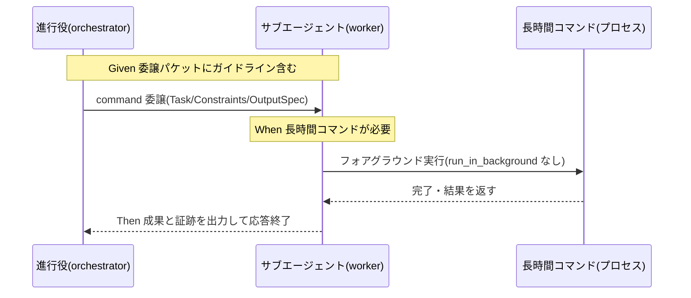

# 要件定義書: サブエージェント委譲時の長時間コマンド・バックグラウンド化による停滞再発防止ガイドライン

**プロジェクト名**: サブエージェント委譲時の長時間コマンド・バックグラウンド化による停滞再発防止ガイドライン
**作成日**: 2026 年 07 月 14 日
**最終更新**: 2026 年 07 月 14 日

> **重要**: **このドキュメントは常に更新**: 要件の変更や追加があった場合は、即座にこのドキュメントを更新してください。ドキュメントは「生きているドキュメント」として扱い、実装内容と常に同期させます。
>
> **用語**: [.agent-skill-chain/source/CONCEPTS.md §用語規約](../../../../../.agent-skill-chain/source/CONCEPTS.md#用語規約) を参照。
>
> **参照元**: 本要件定義は [`00_要求定義.md`](./00_要求定義.md) を基に作成する。目的・背景・スコープの正本は 00 とし、本 01 では重複記述を避け、ユーザーストーリー・受け入れ基準・BDD シナリオへの具体化を担う。

---

## 1. 概要

### 1.1 システム概要

本件は `.agent-skill-chain` ワークフロー規約への**ドキュメント追記のみ**を対象とする。進行役（orchestrator）が Agent ツールで委譲したサブエージェント（ワーカー）が、委譲タスク内で長時間コマンド（テスト全件実行等）を Bash ツールの `run_in_background: true` で起動したまま自身の応答を終了すると、その完了通知は**コマンドを起動したサブエージェント自身の会話コンテキスト宛だが、応答を終了したサブエージェントは再開されず受け取れない**ため、処理は停滞する（オーケストレーター側にも自動通知されず手動での確認・再開が必要になる）。この停滞は同一サブエージェントで 2 回観測されている（evidence_source: orchestrator_report。00 §1.2 に記載の実害事例）。本件は、この再発を防ぐためのガイドラインを [run_command.md](../../../../../.agent-skill-chain/source/skills/agent/run_command.md) に明文化する。

対象は**委譲する側（orchestrator）の委譲作法・ガイドライン**であり、Claude Code ハーネス自体の挙動（`run_in_background` の通知配送先）は変更対象外である（00 §4.1）。

### 1.2 用語集

| 用語 | 説明 |
| -------- | ------ |
| 進行役 / orchestrator | メインループ。phase 判定・command 選択・委譲・結果確認のみを行い、実作業は行わない。 |
| サブエージェント / ワーカー | orchestrator が Agent ツールで委譲した先。委譲された command の skill chain を実行する。 |
| `run_in_background` | Bash ツールのオプション。`true` で起動したコマンドは応答終了後も OS プロセスとして継続実行され、完了通知（task-notification）は**そのツールを呼んだ会話コンテキスト**に届く。 |
| 停滞 | サブエージェントが「完了通知を待つ」と言い残して応答を終了したが、通知が自身に届かず処理が止まったまま進まない状態。 |
| フォアグラウンド実行 | `run_in_background` を指定せず（`false`）、コマンドの完了を同一ツール呼び出し内で待って結果を得る実行形態。 |

---

## 2. 機能要件

### 2.1 ユーザーストーリー

#### ストーリー 1: 委譲パケットへのガイドライン明文化（進行役視点）

- **As a** 進行役（orchestrator）
- **I want to** 委譲パケット（run_command.md の Constraints、または毎回転記される凝縮版）に「長時間コマンドはフォアグラウンド実行し完了を待て・`run_in_background` で起動して応答を終了するな」という趣旨のガイドラインが含まれる状態にしたい
- **So that** 委譲先サブエージェントが `run_in_background` を選択して停滞するのを未然に防ぎ、手動での `ps` 確認・SendMessage 再開という復旧対応を不要にしたい

**受け入れ基準**:

- [run_command.md](../../../../../.agent-skill-chain/source/skills/agent/run_command.md) に、長時間コマンド実行時の `run_in_background` の扱いに関する明示的な禁止事項・推奨手順が**1 箇所に**記載されている（○/×判定: 該当記載の有無で判定可能）。
- 記載は既存の Constraints 項目（review-docs ゲート・GitHub Issue 起票ゲート・書記依頼の強制等）と非重複・非矛盾な独立項目として追加されている（00 §4.2）。

#### ストーリー 2: 停滞せずタスクを完遂する（サブエージェント視点）

- **As a** 委譲されたサブエージェント（ワーカー）
- **I want to** 委譲タスク内で長時間コマンドを実行する際に「`run_in_background` を使わずフォアグラウンドで実行し完了を待つ」という明確な指示を受け取りたい
- **So that** 「完了通知を待つ」と言い残して応答を終了し、通知が自身に届かず停滞する事態を避けたい

**受け入れ基準**:

- ガイドラインが、停滞の**メカニズム**（入れ子のサブエージェント自身が起動したバックグラウンドタスクの完了通知は、起動したサブエージェント自身の会話コンテキスト宛だが、応答を終了すると再開されず受け取れない）を理由として明示している（○/×判定: 理由記述の有無で判定可能。00 §2.2）。
- ガイドラインが、判断の分かれ目を「実行時間の長短（秒数）」ではなく「`run_in_background` を使うかどうか」に置いている（後述 §2.3 ビジネスルール BR-1）。

#### ストーリー 3: ガイドラインの保守性（保守者視点）

- **As a** `.agent-skill-chain` 規約の保守者
- **I want to** ガイドラインの正本を 1 箇所に集約し、他所へは参照でつなぎたい
- **So that** 重複記載による不整合（片方だけ更新される等）を防ぎ、「1 ファイル 1 責務」原則（spec/01_設計原則.md）を保ちたい

**受け入れ基準**:

- ガイドラインの正本は 1 ファイル（run_command.md 想定）に置かれ、他ファイルからは重複記述せず参照でつながれている（00 §3.4）。

### 2.2 BDD ユースケース

#### ユースケース 1: サブエージェントが委譲タスク内で長時間コマンドを実行する

委譲されたサブエージェントが、テスト全件実行などの完了までに時間のかかるコマンドを実行する必要がある場面。ガイドライン適用後に期待される挙動と、明示的に禁止される挙動を規定する。

**シナリオ 1: フォアグラウンド実行で完了を待つ（期待される挙動）**

```gherkin
Feature: 委譲タスク内の長時間コマンド実行
  Scenario: サブエージェントがフォアグラウンドで実行し完了を待つ
    Given 進行役の委譲パケットに「長時間コマンドはフォアグラウンド実行し完了を待つ」ガイドラインが含まれている
    And サブエージェントが委譲タスク内でテスト全件実行など時間のかかるコマンドを実行する必要がある
    When サブエージェントがそのコマンドを実行する
    Then サブエージェントは Bash ツールを run_in_background: true にせずフォアグラウンドで実行し、完了まで待って結果を得る
    And サブエージェントは処理完了後に成果と証跡を出力して応答を終える
```

**シナリオ 2: バックグラウンド起動後に応答終了しない（禁止パターンの明示）**

```gherkin
Feature: 委譲タスク内の長時間コマンド実行
  Scenario: run_in_background で起動して応答を終了する行為が禁止される
    Given 進行役の委譲パケットに当該ガイドラインが含まれている
    When サブエージェントが長時間コマンドを Bash ツールの run_in_background: true で起動しようとする
    Then ガイドラインにより「run_in_background で起動して自身の応答を終了する」ことは禁止事項として認識される
    And その理由（入れ子サブエージェント自身の起動したバックグラウンドタスクの完了通知は、起動したサブエージェント自身の会話コンテキスト宛だが、応答を終了すると再開されず受け取れない）が委譲パケットから読み取れる
```

**処理フロー**（期待される挙動）:



#### ユースケース 2: ガイドラインの記載と既存規約との整合

追記されたガイドラインが、既存の run_command.md の構造・既存 Constraints 項目と矛盾せず、重複もない状態であること。

**シナリオ 1: 既存 Constraints と非重複・非矛盾**

```gherkin
Feature: ガイドライン記載の整合性
  Scenario: 既存規約と衝突しない独立項目として追加される
    Given run_command.md に既存の Constraints 項目群（review-docs ゲート・GitHub Issue 起票ゲート・ブランチ紐づけゲート・書記依頼の強制等）が存在する
    When 長時間コマンド・run_in_background に関するガイドラインを追加する
    Then そのガイドラインは既存項目のいずれとも重複・矛盾しない独立した項目として記載される
    And ガイドラインの正本は 1 箇所に置かれ、他ファイルからは参照でつながれる
```

**シナリオ 2: 適用対象外環境でのフォールバック**

```gherkin
Feature: ガイドライン記載の整合性
  Scenario: Claude Code 以外のランタイムでの扱い
    Given 入れ子委譲・バックグラウンド通知配送という前提が成立しないランタイムがありうる
    When そのランタイムで当該ガイドラインを参照する
    Then ガイドラインは「入れ子委譲＋バックグラウンドタスク完了通知が起動元にしか届かない」という前提の下でのみ適用される旨が読み取れ、前提が成立しない環境では無害化される（既存のフォールバックの考え方に倣う）
```

### 2.3 ビジネスルール

- **BR-1（「長時間」の判断基準＝閾値を設けない）**: ガイドラインは、フォアグラウンド実行を要する条件を**秒数などの数値閾値では定義しない**。判断の分かれ目は「実行時間の長短」ではなく「サブエージェントが `run_in_background: true` を使う可能性があるか」に置く。すなわち「サブエージェントは委譲タスク内で `run_in_background: true` を使わず、原則フォアグラウンドで実行して完了を待つ」を基本方針とする。理由: 本停滞の失敗モードは実行時間の長さではなく**通知配送の仕組み**（入れ子サブエージェント自身が起動したバックグラウンドタスクの完了通知が自身に届かない）に起因するため、短時間のバックグラウンド起動でも同じ停滞を招きうる。したがって数値閾値は誤った線引きを生む（evidence_source: orchestrator_report〔停滞メカニズムの観測〕。閾値を設けない方針の採用そのものは inference_only を含むため、最終文言・例外の有無は 02 設計で確定する＝要人間確認）。
  - **補足（フォアグラウンド待機の適用範囲）**: 上記「フォアグラウンドで完了を待つ」は、**完了が見込める非対話型コマンド**（テスト全件実行・ビルド等）にのみ適用する。`watch` 系・サーバー起動・対話型など**無期限に走り続ける／対話を要するコマンドは対象外**とし、これらはフォアグラウンドで待つと逆に停滞するため、バックグラウンド実行等の代替手段か、明示的なタイムアウト・キャンセル手順で扱う。これは時間閾値ではなく「コマンドの性質（完了するか・対話を要するか）」による線引きであり、BR-1 の「数値閾値を設けない」方針と両立する。
- **BR-2（正本は 1 箇所）**: ガイドラインの正本は 1 ファイルに置く。重複記述を禁止し、他所へは参照でつなぐ（spec/01_設計原則.md「1 ファイル 1 責務」、00 §3.4）。
- **BR-3（既存を弱化しない）**: 本追記は既存 Constraints 項目を置換・弱化せず、独立項目として**追加**する（00 §2.1、§4.2）。

---

## 3. 非機能要件

### 3.1 パフォーマンス要件

- 成果物自体はドキュメント記述の追加が中心だが、**ガイドラインに従い長時間コマンドをフォアグラウンドで待つ運用は、Agent 呼び出し時間の延長・ハーネス側タイムアウト到達リスク・待機中のリソース占有という実際の影響を持つ**（「性能に影響なし」とは扱わない）。対策として、フォアグラウンド待機の対象を完了が見込める非対話型コマンドに限定し、許容待機時間の上限（タイムアウト）を設けて到達時はキャンセル・代替（バックグラウンド化）へ切り替える方針とする。具体的な許容待機時間・閾値は 02 設計以降で確定する（00 §3.1・§2.2）。

### 3.2 セキュリティ要件

- 該当なし。外部サービスへの書き込み・認証情報の扱いを伴わない（00 §3.2）。

### 3.3 ユーザビリティ要件

- ガイドラインは、委譲を受けたサブエージェントが**想起しやすい**位置・粒度で記載する。既存の「委譲時の行動規範凝縮版転記」（run_command.md の Constraints、AGENT_CONDUCT.md 第 3 部）のように、委譲パケットの Constraints に毎回現れる仕組みへの反映は、実効性を高める補強候補とする（適用可否は §5 の記載箇所検討に従い 02 設計で確定する）。

### 3.4 可用性要件

- Claude Code 以外のランタイム（入れ子委譲・バックグラウンド通知配送の前提が成立しない環境）では、本ガイドラインが不要・無関係になりうる。その場合の扱いは既存の「前提が成立しない環境ではフォールバックし規約をロックアウトさせない」パターンに倣う（00 §3.3、§7.1。具体化は 02 設計）。

---

## 4. 外部インターフェース要件

### 4.1 API 要件

- 該当なし（プログラム API の追加・変更を伴わない）。

### 4.2 データ形式要件

- 追記は Markdown ドキュメント（run_command.md、必要なら AGENT_CONDUCT.md 第 3 部の凝縮版）への追記であり、既存の Constraints 記法（箇条書き・**強調**・相互参照リンク）に揃える。

---

## 5. 制約事項

- **ハーネス変更は対象外**: `run_in_background` の通知配送先がサブエージェント自身に届かない挙動は Claude Code ハーネス仕様であり変更手段が無い。解決策は「委譲する側の作法・ガイドライン」に限定する（00 §4.1）。
- **実装は本フェーズ対象外**: 本 01 は要件定義であり、実際の run_command.md 等への追記（実装）は design-feature／implement-feature 以降で行う。
- **記載箇所の候補（要件レベルで 2 案に絞る。最終決定は 02 設計）**（evidence_source: existing_code〔run_command.md §委譲の形／Constraints・AGENT_CONDUCT.md 第 3 部の現行構造を確認〕）:
  - **案 A（推奨・正本）**: [run_command.md](../../../../../.agent-skill-chain/source/skills/agent/run_command.md) の §委譲の形 → Constraints に、長時間コマンド・`run_in_background` に関する独立した Constraints 項目を新規追加する。委譲実行の正本が run_command.md であるため、正本の置き場所として最も整合する。
  - **案 B（補強・任意）**: [AGENT_CONDUCT.md 第 3 部 サブエージェント向け凝縮版](../../../../../.agent-skill-chain/source/AGENT_CONDUCT.md)（委譲時に Constraints 末尾へ毎回転記される凝縮版）へ、案 A の要点を凝縮した 1 行を追加し、毎回の委譲パケットで想起されやすくする。ただし BR-2（正本 1 箇所）に従い、凝縮版は正本の重複ではなく要点参照として書く。
  - 案 A のみとするか案 A＋案 B とするか、および文言・例外規定は 02 設計で確定する。

---

## 6. 参考資料

### プロジェクトドキュメント

- [`00_要求定義.md`](./00_要求定義.md) - 要求定義（目的・背景・スコープ・実害事例の正本）
- [`.agent-skill-chain/source/skills/agent/run_command.md`](../../../../../.agent-skill-chain/source/skills/agent/run_command.md) - 委譲の形・Constraints の正本。本件の追記対象候補（案 A）
- [`.agent-skill-chain/source/AGENT_CONDUCT.md`](../../../../../.agent-skill-chain/source/AGENT_CONDUCT.md) - 第 3 部 サブエージェント向け凝縮版。凝縮版転記の対象候補（案 B）
- [`.agent-skill-chain/source/spec/01_設計原則.md`](../../../../../.agent-skill-chain/source/spec/01_設計原則.md) - 1 ファイル 1 責務・単一責務（BR-2 の根拠）
- [`.agent-skill-chain/source/spec/06_設計判断の優先順位.md`](../../../../../.agent-skill-chain/source/spec/06_設計判断の優先順位.md) - 可読性・単一責務・docs 整合を優先する判断基準
- [`.agent-skill-chain/source/EVIDENCE_POLICY.md`](../../../../../.agent-skill-chain/source/EVIDENCE_POLICY.md) - 重要判断への evidence_source 付記・ADR 記録の根拠
- [`.agent-skill-chain/source/commands/requirement-discovery.md`](../../../../../.agent-skill-chain/source/commands/requirement-discovery.md) - 本 01 作成の command 定義

### その他の参考資料

- 本セッションで進行役が実際に観測した停滞事例（同一サブエージェントで 2 回、`run_in_background` 起動後に応答終了し、手動で `ps` 確認・SendMessage 再開対応を行った実体験）。evidence_source: orchestrator_report。

---

## 7. 前のステップ

この要件定義書は、以下のドキュメントを基に作成されています：

- **前**: [`00_要求定義.md`](./00_要求定義.md) - 要求定義フェーズ

---

## 8. 次のステップ

この要件定義書の承認後、以下のドキュメントを作成します：

- **次**: [`02_設計.md`](./02_設計.md) - 設計フェーズ（記載箇所〔案 A のみ／案 A＋案 B〕・具体文言・例外規定・適用対象外環境のフォールバック方法を確定する）
