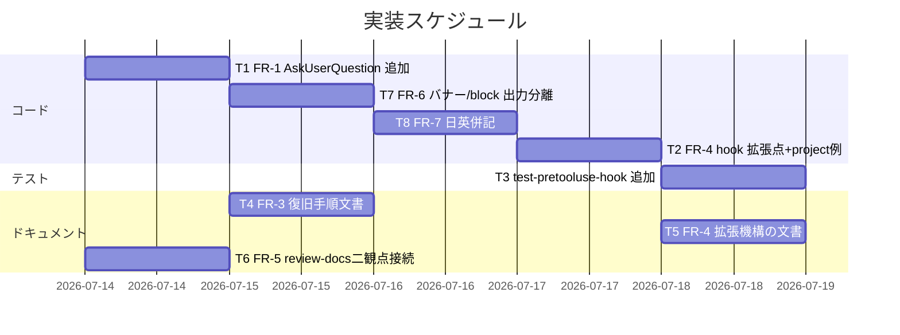

# 実装計画書: orchestrator AskUserQuestion 許可

**プロジェクト名**: orchestrator AskUserQuestion 許可
**作成日**: 2026 年 07 月 14 日
**最終更新**: 2026 年 07 月 14 日

> **重要**: **このドキュメントは常に更新**: 実装計画の変更、進捗状況の更新、バグの記録などがあった場合は、即座にこのドキュメントを更新してください。
>
> **用語**: [.agent-skill-chain/source/CONCEPTS.md §用語規約](../../../../../.agent-skill-chain/source/CONCEPTS.md#用語規約) を参照。

---

## 1. 実装概要

### 1.1 実装方針
02_設計に従い、`PreToolUse.sh` の R2 allowlist を最小差分で拡張する（`AskUserQuestion` を allow case に 1 件追加＋ `*)` default に project 拡張の opt-in 判定を追加）。fail-closed default は変更しない。FR-2 は 02 の ADR-2 で見送り確定済みのため**実装なし**。FR-3・FR-4 のドキュメントは指定ファイルの指定セクションへ追記する。FR-5 は `commands/review-docs.md` へ `REVIEW_DUAL_LENS.md` 参照＋両リスト DoD を追記する（ドキュメント成果物・正本の二重定義なし）。FR-6（バナー/block の出力分離）・FR-7（日英併記）は `PreToolUse.sh`（＋ FR-7 は `PostToolUse.sh` も）の stderr 出力 prefix・文言のみを変更し、**挙動（exit code・判定・強制ロジック）は不変**とする。英語部分文字列を先頭に残す日英併記により既存 `test/test-pretooluse-hook.sh` の `assert_grep` を保全する（ADR-7・ADR-8）。audit.sh 等 CI メッセージの日本語化は ADR-8 の線引きにより後続 issue へ送る。

### 1.2 実装順序
FR-1（即時修正）→ FR-6/FR-7（同一 `PreToolUse.sh` の出力体裁変更・FR-1 と同ファイルのため近接実施）→ FR-4 実装（hook 拡張点＋ project ファイル examples）→ テスト追加 → FR-3/FR-4 ドキュメント → FR-5 ドキュメント（review-docs 二観点接続）→ FR-2 は実装なし（ADR 済）。FR-6/FR-7 は `PreToolUse.sh` を編集するため T1（FR-1）と近接して行い、同ファイルの編集競合を避ける。FR-7 の `PostToolUse.sh` 併記は独立。FR-5 はコード変更に依存しないため並行実施可能。



---

## 2. タスク分解

**対応関係（01 の BDD ↔ 本タスク）**: UC1/S1・S2・S3・ストーリー1/2 → T1・T3。UC5/S1・S2・ストーリー5/6 → T2・T3。UC2/S1（サブエージェント非影響）→ T3。UC3（FR-2 feasibility）→ 実装なし・02 ADR-2。UC4（FR-3）→ T4。UC5/S3（更新経路）→ T5・ADR-4。UC6/S1・S2・S3・ストーリー8（FR-5 review-docs 二観点）→ T6・ADR-6。UC7/S1・S2・ストーリー9（FR-6 バナー/block 分離）→ T7・ADR-7。UC8/S1・S2・ストーリー10（FR-7 日英併記）→ T8・ADR-8。ストーリー7（denylist 非採用）→ 全タスク横断の除外確認。

### 2.1 タスク T1: FR-1 AskUserQuestion を R2 allowlist に追加

#### 2.1.1 概要
`PreToolUse.sh` の R2 allow case 列挙に `AskUserQuestion` を追加し、追加理由コメントを残す。

#### 2.1.2 実装内容
- `.agent-skill-chain/source/enforcement/claude/PreToolUse.sh:189` の allow case（`Read|Grep|Glob|LS|list_dir|Task|Agent|mcp_task|ReadLints|fetch_mcp_resource|list_mcp_resources)`）に `AskUserQuestion` を追加。
- 直近に「読み取り専用・非破壊のユーザー対話ツール。実作業禁止原則（CORE.md §やってはいけないこと）に非該当。ハーネス組み込みツール追加時は同種の allowlist 追従漏れが起こりうる」旨のコメントを、`Agent` 追加時（`:181-183`）の注記パターンに倣い記載。

#### 2.1.3 テスト観点
参照: [02_設計 §6](./02_設計.md)・RULES テスト戦略。本タスクの具体ケース:

##### 単体（必須 1 件以上）
- 正常系: `AGENT_ROLE=orchestrator` × `{"tool_name":"AskUserQuestion",...}` → exit 0。
- 回帰(異常系): 同ロール × `Bash`/`Edit`/`Write` → exit 2（メッセージ不変）。
- 回帰(境界): 同ロール × allowlist 未収載の未知ツール → exit 2（default 拒否）。

##### 結合/API・E2E/受け入れ・バリデーション
- 該当なし（hook 単体挙動）。受け入れは既存テストの PASS で担保。

#### 2.1.4 単体テスト仕様（BDD）

```gherkin
Feature: orchestrator の AskUserQuestion 許可
  Scenario: orchestrator ロールが AskUserQuestion を呼び出す
    Given PreToolUse.sh の R2 allow case に AskUserQuestion が追加されている
    And 呼び出し元が orchestrator（ROLE=orchestrator, IS_SUBAGENT!=1）
    When AskUserQuestion を呼び出す
    Then PreToolUse フックは exit 0 を返す
  Scenario: 変更系ツールは引き続き拒否される
    Given 同上
    When Edit または Write または Bash を呼び出す
    Then PreToolUse フックは exit 2 を返す
```

```bash
# Given: AGENT_ROLE=orchestrator、AskUserQuestion の stdin JSON
# When: run_pre "$PATH" orchestrator '{"tool_name":"AskUserQuestion","tool_input":{"questions":[]}}'
# Then: RC == 0（allowlist 内）
assert_eq 0 "$RC" "orchestrator AskUserQuestion は exit 0"
```

#### 2.1.5 依存関係
なし（先行実装可）。

#### 2.1.6 見積もり
- 工数: 0.5h / 優先度: 高

### 2.2 タスク T2: FR-4 hook 側 project allowlist 拡張点＋ project 例ファイル

#### 2.2.1 概要
`PreToolUse.sh` に `is_in_project_allowlist()` を追加し R2 の `*)` default で呼ぶ。project 層に例＋説明ファイルを用意する。

#### 2.2.2 実装内容
- `.agent-skill-chain/source/enforcement/claude/PreToolUse.sh`: 02 §3.2.2 の `is_in_project_allowlist()` を追加（`source` せず read-as-data・`#` コメント除去・**先頭末尾 trim のみ＝内部空白は collapse しない**・`^[A-Za-z][A-Za-z0-9_-]*$` 厳密検証（`-` は末尾 literal でハイフン付き MCP 名を許容）・許可は `== "$want"` 厳密一致・ファイル不在/非正規ファイル `-f` 偽/読取不可で偽＝fail-closed）。R2 の `*)` default を「拡張に含まれれば allow、なければ従来の block」に変更。project パスは `"$(dirname "$AGENTS_ROOT")/project/orchestrator-allowlist.txt"`（字句 dirname・symlink 解決なし。非標準配置は fail-closed に落ちるだけ）。
- 例ファイル: `.agent-skill-chain/source/enforcement/claude/orchestrator-allowlist.example.txt`（配布物側に置く雛形。中身は使い方コメントのみ・実許可は空）。**注意**: 実効ファイルは消費先の `.agent-skill-chain/project/orchestrator-allowlist.txt`（ユーザー資産）であり、本リポの `.agent-skill-chain/project/` には**置かない**（自己適用時に自分の allowlist を勝手に広げないため。空のまま）。
- 変更系・既知拒否ツールは case のより手前で block されるため拡張で覆せないことを、`*)` 直上コメントに明記。

#### 2.2.3 テスト観点

##### 単体（必須 1 件以上）
- 正常系: project ファイルに未知ツール `Foo` を列挙 → orchestrator×`Foo` → exit 0。
- 異常系(fail-closed): ファイル不在 → orchestrator×`Foo` → exit 2。空ファイル/全行コメント → exit 2。
- セキュリティ境界（名前）: ファイルに `Bash` や `Edit` を書いても → 各々 exit 2（明示拒否名は case 手前で block・拡張で覆せない）。
- 注入無効化（メタ文字）: `Foo; rm -rf /` は `;`/`/`/空白により厳密文字種不一致で無視 → 許可されない。かつ read-as-data のため `; rm -rf /` は決して実行されない。
- 難読化無効化（内部空白）: `Foo bar` は **trim のみ（collapse しない）**設計により regex 不一致で無視され、tool `Foo` も `bar` も許可しない（`Foobar` に化けない）。同様に `mcp __ shell`（内部空白での難読化）も無視 → 危険名は clean 素名でしか書けず PR 可視性を保つことを固定。
- 能力ベース残余リスクの明示（ADR-3/ADR-4 残余2）: `mcp__foo__write` のような `*)` に落ちる未知 MCP ツール名を列挙すると exit 0（許可）になり得ることを 1 ケースで確認し、「未知＝安全ではない・人間レビュー前提」を証跡化（機構は名前一致のみ保証し能力は保証しない）。
- 両系統: jq 有 (`$JQ_PATH`) / jq 無 (`$NOJQ_PATH`) で同一合否（拡張判定は jq 非依存だが tool_name 抽出経路の両系統確認）。

##### 結合/API・E2E・バリデーション
- 結合/E2E: 該当なし。バリデーション: 上記「注入無効化」で担保。

#### 2.2.4 単体テスト仕様（BDD）

```gherkin
Feature: project 固有 allowlist 拡張機構
  Scenario: 未設定時はコア default が維持される
    Given .agent-skill-chain/project/orchestrator-allowlist.txt が存在しない
    When orchestrator が未知ツール Foo を呼び出す
    Then PreToolUse フックは exit 2（fail-closed）を返す
  Scenario: opt-in 追加したツールが許可される
    Given 上記ファイルに Foo が 1 行で列挙されている
    When orchestrator が Foo を呼び出す
    Then PreToolUse フックは exit 0 を返す
  Scenario: 拡張は変更系ツールを覆せない
    Given 上記ファイルに Bash が列挙されている
    When orchestrator が Bash を呼び出す
    Then PreToolUse フックは exit 2 を返す（case 手前で block）
```

```bash
# Given: 隔離環境の .agent-skill-chain/project/orchestrator-allowlist.txt に "Foo" を書く
#   printf 'Foo\n# comment\n' > "$TMP/.agent-skill-chain/project/orchestrator-allowlist.txt"
# When: run_pre "$PATH" orchestrator '{"tool_name":"Foo","tool_input":{}}'
# Then: RC == 0（project opt-in で許可）
assert_eq 0 "$RC" "project 拡張の Foo は exit 0"
# When: 同ファイルに Bash を書いても Bash 呼び出しは
# Then: RC == 2（case のより手前で block・拡張で覆せない）
assert_eq 2 "$RC" "拡張に Bash があっても exit 2"
```

#### 2.2.5 依存関係
T1 の後（同一ファイル編集の競合回避）。

#### 2.2.6 見積もり
- 工数: 2h / 優先度: 中

### 2.3 タスク T3: 既存テスト `test/test-pretooluse-hook.sh` へのケース追加

#### 2.3.1 概要
T1・T2 の観点を既存テストへ追加する（tmp 隔離・jq 有無両系統の既存方針踏襲）。

#### 2.3.2 実装内容
- UC1 群に `uc1_orchestrator_askuserquestion_allowed`（exit 0）を追加。
- 新 UC（例 UC10「project allowlist 拡張」）を追加し、`run_uc10 "jq" "$JQ_PATH"` / `run_uc10 "nojq" "$NOJQ_PATH"` の両系統で: (a) 未設定→exit2、(b) `Foo` 列挙→exit0、(c) `Bash` 列挙でも exit2、(d) 注入行 `Foo; rm -rf /`→当該行無視（かつ副作用なし）、(e) `#` コメント・空行の無視、(f) **内部空白の難読化**（`Foo bar` 列挙時に tool `Foo` 呼び出し→exit2＝`Foobar` に化けず許可されない）、(g) **CRLF 耐性**（`Foo\r\n` 列挙→末尾 trim で `Foo` として exit0）、(h) **能力ベース残余の証跡**（`mcp__foo__write` 列挙→exit0 になることを確認し「未知＝安全ではない」をコメントで明示）。
- 隔離環境に `mkdir -p "$TMP/.agent-skill-chain/project"` して例ファイルを書く（本リポの `.agent-skill-chain/project/` は触らない＝破壊禁止方針）。
- サブエージェント非影響（UC8 相当）: `agent_id` ありは R2 対象外で拡張・AskUserQuestion 判定に入らないことを 1 ケース確認。

#### 2.3.3 テスト観点

##### 単体（必須 1 件以上）
- 追加ケースが全て PASS。既存 UC1〜UC9 が非劣化で PASS。
- jq 有/無で同一合否。

##### 結合/API・E2E・バリデーション
- E2E/受け入れ: `bash test/test-pretooluse-hook.sh` が exit 0（全 PASS）。`npm test`（run-all）でも回帰なし。

#### 2.3.4 単体テスト仕様（BDD）

```gherkin
Feature: PreToolUse テストの網羅
  Scenario: 追加ケースを含め全テストが PASS する
    Given test-pretooluse-hook.sh に FR-1/FR-4 のケースを追加した
    When bash test/test-pretooluse-hook.sh を実行する
    Then 終了コード 0（全 PASS）で、jq 有/無の両系統が一致する
```

```bash
# Given: 追加済みテストスクリプト
# When: bash test/test-pretooluse-hook.sh
# Then: exit 0（PASS=N FAIL=0）
```

#### 2.3.5 依存関係
T1・T2 の後。

#### 2.3.6 見積もり
- 工数: 2h / 優先度: 高

### 2.4 タスク T4: FR-3 ロックアウト復旧手順の文書化

#### 2.4.1 概要
SETUP.md を正本に復旧手順を新設し、CORE.md・README.md・project/README.md から参照する。

#### 2.4.2 実装内容
- `.agent-skill-chain/source/SETUP.md` §enforcement の opt-in（既定 off）に小節「ロックアウトからの復旧」を新設: (1) 手順＝`!` シェルモードで `npx github:techbeansjp-free/AGENTS.md enforce off`（消費先）または `agents-md enforce off` を実行 → Claude セッション再起動、(2) 機構＝`!` プレフィックスはモデルのツール呼び出しループを介さず直接実行されるため PreToolUse フックの対象外（evidence: code.claude.com/docs/en/interactive-mode）。
- `.agent-skill-chain/source/boot/CORE.md` §禁止事項付近に 1〜2 行「orchestrator が enforcement でロックアウトされた場合の復旧は SETUP.md §ロックアウトからの復旧 を参照」。
- `README.md` §配備後の管理（CLI）の enforcement 小節に 1 行の参照を追加。
- `.agent-skill-chain/project/README.md` に 1 行の参照（project 層利用者の発見性）。

#### 2.4.3 テスト観点

##### 単体（必須 1 件以上）
- ドキュメント確認: SETUP.md に手順と機構説明の両方が記載され、`enforce off`・`!`・再起動の 3 要素が揃う。CORE/README/project から SETUP への参照が張られている。
- 整合: 記述が実装（`!` 実行がフック対象外・再起動要）と矛盾しない。

##### 結合/API・E2E・バリデーション
- 該当なし（ドキュメント成果物）。レビューで確認。

#### 2.4.4 単体テスト仕様（BDD）

```gherkin
Feature: ロックアウト復旧手順の文書化
  Scenario: 正式ドキュメントで復旧手順を参照できる
    Given orchestrator が PreToolUse フックにロックアウトされている
    When 利用者が SETUP.md §ロックアウトからの復旧 を参照する
    Then "!" 経由で enforce off を実行して再起動する手順と、なぜフック対象外かの機構説明が読める
```

#### 2.4.5 依存関係
なし（T1 と並行可）。

#### 2.4.6 見積もり
- 工数: 1h / 優先度: 中

### 2.5 タスク T5: FR-4 拡張機構の文書化（存在・使い方・更新経路）

#### 2.5.1 概要
project 拡張機構の使い方と更新経路ガバナンス（ADR-4）を文書化する。

#### 2.5.2 実装内容
- `.agent-skill-chain/source/SETUP.md`: 新節「orchestrator allowlist の project 拡張（opt-in）」を追加。ファイルパス・形式（1 行 1 ツール名・`#` コメント・内部空白/メタ文字行は無視・fail-closed）・「明示拒否**名**は覆せない（ただし能力は保証しない）」制約・**警告「書込/実行等価ツール（`mcp__*` 系 MCP 書込ツール等）を opt-in すると orchestrator が Edit/Write を介さず書込権限を得るため、追加は clean な素名で書き PR レビューで必ず妥当性を確認すること」**・更新経路（worker 委譲＋ PR レビュー＋人間 main マージ、orchestrator は自分では直接書けない＝ただし委譲は orchestrator 起点で人間ゲートは PR マージのみ）・残余リスク（同一セッション内 worker 編集は即時反映・能力ベース自己増幅）を記載。
- `.agent-skill-chain/project/README.md`: 「orchestrator allowlist 拡張」の項を追加し、`orchestrator-allowlist.txt` の置き方と SETUP.md への参照。
- `README.md` §設定できること（設定一覧）の表に 1 行「orchestrator allowlist の project 拡張 | `orchestrator-allowlist.txt`（opt-in） | SETUP.md」を追加。
- `.agent-skill-chain/source/enforcement/README.md`（allowlist 判定の正本参照先）に拡張点の説明を 1 段落追記。

#### 2.5.3 テスト観点

##### 単体（必須 1 件以上）
- ドキュメント確認: 存在・使い方・更新経路（人間関与点）・fail-closed・「変更系は覆せない」が SETUP.md に揃う。README・project/README・enforcement/README から到達できる。
- 整合: 記述が実装（read-as-data・厳密文字種・パス導出）と一致。denylist 全面転換の記載が無いこと。

##### 結合/API・E2E・バリデーション
- 該当なし（ドキュメント成果物）。レビューで確認。

#### 2.5.4 単体テスト仕様（BDD）

```gherkin
Feature: project 固有 allowlist 拡張機構の文書化
  Scenario: 拡張機構の使い方と更新経路が参照できる
    Given SETUP.md に project 拡張の節が追加されている
    When 消費先保守者が SETUP.md を参照する
    Then ファイル形式・opt-in・fail-closed・「変更系は覆せない」・更新経路（委譲＋PRレビュー＋人間マージ）が読める
  Scenario: orchestrator 単独では拡張を完結できないことが読める
    Given 更新経路ガバナンスが ADR-4 として 02 に記録されている
    When 記述を参照する
    Then orchestrator は自分の allowlist ファイルを自分では書けず（Edit/Write は R2 で拒否）、人間関与（PR）が必須である旨が読める
```

#### 2.5.5 依存関係
T2 の後（実装したパス・形式に文書を合わせる）。

#### 2.5.6 見積もり
- 工数: 1.5h / 優先度: 中

### 2.6 タスク T6: FR-5 review-docs への二観点レビュー接続

#### 2.6.1 概要
`commands/review-docs.md` を `REVIEW_DUAL_LENS.md` に接続し、二観点の両リスト記載を DoD 化する（review-code/review-architecture と同型・正本の二重定義なし）。

#### 2.6.2 実装内容
- `.agent-skill-chain/source/commands/review-docs.md`:
  - **Process（§レビュー＋修正ループ）**: 手順 1 のレビュー観点に「`RULES.md`・`PHASES.md` の監査観点」に加え「[REVIEW_DUAL_LENS.md](../../../../../.agent-skill-chain/source/REVIEW_DUAL_LENS.md) の二観点（敵対的観点＝反証・破壊を試み不確実なら要修正に倒す／肯定的観点＝must-preserve=不変条件の同定）」を明記。各ラウンドで must-preserve リストを次ラウンドへ継承する（`REVIEW_DUAL_LENS.md` §6）旨を追記。
  - **Outputs**: 「敵対的観点リスト」「must-preserve リスト」の両方を成果物（memo または 00-03 自体）へ出力する項目を追加。git 追跡される 00-03 への記載を推奨経路とする旨（ADR-6）を付記。
  - **Done (DoD)**: 既存「既知の指摘が 0 件」に加え「敵対的観点リストと must-preserve リストの両方が成果物に記載されている（いずれか欠落は未完了。REVIEW_DUAL_LENS.md §3）」を DoD 項目として追加。
  - **Forbidden**: 「二観点のいずれかのリストを欠いたまま review-docs を完了とみなすこと」を禁止項目に追加（任意・DoD と整合する範囲で）。
  - **必須 chain の非選択制化**: Outputs・DoD の追記に際し、二観点リストの記載先を memo/00-03 のいずれでもよいと書く一方で、**①サイクルごとの `runtime/{issue}/memo/` 日時プレフィックス付き memo 作成 → ②指摘ゼロまでの反復 → ③完了後の `write-workflow-log` 委譲**の順序固定・省略不可の chain（既存 review-docs.md の DoD・Forbidden）は選択制と誤読されない文言にすること。
- `.agent-skill-chain/source/REVIEW_DUAL_LENS.md`: 「本ルールの適用先には review-docs（実装前 00-03 レビュー）も含む」旨の軽微な参照追記のみ（正本の定義本体・§1〜§6 は変更しない）。§5 参照リストへ `commands/review-docs.md` を 1 行加える程度にとどめる。
- **機械強制**: ADR-6 の決定に従い、本タスクでは新規 audit.sh チェックの実装は**必須としない**。将来 00-03 へ両リストを残す運用が定着した場合に #27 と同型の git 差分内容チェックへ拡張できる余地を残す旨をコメント／文書に残すにとどめる。

#### 2.6.3 テスト観点

##### 単体（必須 1 件以上）
- ドキュメント確認: `review-docs.md` の Process・Outputs・Done に `REVIEW_DUAL_LENS.md` 参照と「敵対的観点リスト」「must-preserve リスト」両方の記載義務がある。DoD に「いずれか欠落は未完了」が含まれる。
- 整合: `review-code`/`review-architecture` の SKILL.md と同型の接続であり、二観点ルール本体を `review-docs.md` 内で再定義していない（正本 `REVIEW_DUAL_LENS.md` へ委譲）。`REVIEW_DUAL_LENS.md` の §1〜§6 定義本体が変更されていない（参照追記のみ）。

##### 結合/API・E2E・バリデーション
- 該当なし（ドキュメント成果物）。レビューで確認。

#### 2.6.4 単体テスト仕様（BDD）

```gherkin
Feature: review-docs への二観点レビュー強制化
  Scenario: review-docs が二観点の両リストを DoD として要求する
    Given review-docs.md に REVIEW_DUAL_LENS.md 参照が追加されている
    When 消費先保守者が review-docs.md の Done を参照する
    Then 「敵対的観点リスト」「must-preserve リスト」の両方の記載が必須であり、いずれか欠落は未完了である旨が読める
  Scenario: 正本を二重定義していない
    Given REVIEW_DUAL_LENS.md が二観点必須化の正本である
    When review-docs.md を参照する
    Then review-docs.md は正本を参照するのみで二観点ルール本体を再定義していない
```

#### 2.6.5 依存関係
なし（コード変更に非依存。T1〜T5 と並行可）。

#### 2.6.6 見積もり
- 工数: 1h / 優先度: 中

### 2.7 タスク T7: FR-6 常時バナーとブロック理由の出力分離

#### 2.7.1 概要
`PreToolUse.sh` の常時バナー（`:156-160`）と `block()`（`:24-28`）の出力 prefix・文言を、非違反の案内（info）と実違反（block）で区別する。挙動は不変（ADR-7）。

#### 2.7.2 実装内容
- **`block()`（`:24-28`）**: `echo "[enforcement] ERROR: $1" >&2` を `echo "[enforcement:block] 違反(BLOCK): $1" >&2` へ変更（英語理由 `$1` は先頭保持）。
- **常時バナー（`:156-160`）**: 各 `echo "[PreToolUse] ..." >&2` の prefix を `[PreToolUse:info]` に変更し、バナー先頭に「常時表示の案内であり違反ではありません（This is always-shown guidance, not a block.）」の 1 行を追加（または各行にその趣旨を含める）。`.agents not found`（`:151`）も `[PreToolUse:info]` に体裁を揃える。
- **実装前確認（必須）**: `test/test-pretooluse-hook.sh` および `test/` 全体が `[PreToolUse]`／`[enforcement]` prefix・バナー文言を `assert_grep` していないことを再確認する（確認済み: 現状 assert は理由本文の英語部分文字列のみ＝`:154,200,226,290,300,321,331,394,511,561`）。

#### 2.7.3 テスト観点

##### 単体（必須 1 件以上）
- 正常系: orchestrator×許可ツール（Read）→ exit 0 かつ stderr に `[PreToolUse:info]` バナーが出る（違反 prefix `[enforcement:block]` 行は出ない）。
- 違反系: orchestrator×Edit → exit 2 かつ stderr に `[enforcement:block]` の違反行が出る（バナーの info prefix と区別できる）。
- 回帰（挙動不変）: 既存の全 exit code アサーション（UC1〜UC9）が非劣化で PASS。既存の理由本文英語部分文字列アサーションが PASS。

##### 結合/API・E2E・バリデーション
- E2E: `bash test/test-pretooluse-hook.sh` が exit 0（全 PASS）。

#### 2.7.4 単体テスト仕様（BDD）

```gherkin
Feature: 常時バナーとブロック理由の出力分離
  Scenario: 許可時は info バナーのみ・違反 prefix は出ない
    Given PreToolUse.sh のバナー prefix が [PreToolUse:info] に変更されている
    When orchestrator が Read を呼び出す
    Then exit 0 で stderr に [PreToolUse:info] が出て [enforcement:block] は出ない
  Scenario: 違反時は block prefix で区別できる
    Given block() prefix が [enforcement:block] に変更されている
    When orchestrator が Edit を呼び出す
    Then exit 2 で stderr に [enforcement:block] の違反行が出る
    And 英語部分文字列 orchestrator must never modify files が保持される
```

#### 2.7.5 依存関係
T1 の後（同一 `PreToolUse.sh` 編集の競合回避）。T8 と同一ファイルのため近接して実施し、可能なら 1 パスでまとめる。

#### 2.7.6 見積もり
- 工数: 1h / 優先度: 中

### 2.8 タスク T8: FR-7 enforcement メッセージの日英併記（PreToolUse.sh・PostToolUse.sh）

#### 2.8.1 概要
`PreToolUse.sh`（常時バナー・block 各理由）と `PostToolUse.sh`（`:18` バナー）のユーザー向けメッセージを、英語を先頭に残したまま日本語を併記する（ADR-8）。audit.sh 等 CI メッセージは後続 issue（本タスク範囲外）。

#### 2.8.2 実装内容
- **`PreToolUse.sh` の全 block 理由（`$1`）**: `block "<英語>"` を `block "<英語> / <日本語>"` へ（区切りは ` / ` で英語トークンの連続性を保つ）。対象例:
  - `orchestrator cannot run Bash / orchestrator は Bash を実行できません`（`:193,261`）
  - `orchestrator must never modify files or run write/edit/shell (absolute). Delegate to sub only. No exceptions. / orchestrator はファイル変更・write/edit/shell を実行できません（絶対）。サブへ委譲してください`（`:196`）
  - `sqlite3 direct execution forbidden (use write-workflow-log.sh) / sqlite3 の直接実行は禁止です（write-workflow-log.sh を使用）`（`:221,271`）
  - `compound shell command forbidden / 複合シェルコマンドは禁止です`（`:227`）
  - `direct edit of .agent-skill-chain/runtime/ is forbidden / .agent-skill-chain/runtime/ の直接編集は禁止です`（`:175`）
  - `only scribe may run Bash for workflow logging / Bash 実行は workflow 記録の scribe のみ可能です`（`:264`）
  - `only the canonical write-workflow-log.sh ... may be run directly / 正規の write-workflow-log.sh のみ直接実行できます`（`:252`）
  - `orchestrator may only use allowed tools (Read, Grep, Glob, LS, Task, etc.): $TOOL / orchestrator は許可ツールのみ使用できます: $TOOL`（`:200`）
- **常時バナー（`:157-159`）**: 各行に日本語を併記（T7 の prefix 変更と同一編集で実施）。
- **`PostToolUse.sh`（`:18`）**: `workflow.db is canonical; memo is transitional/exception only. ... / workflow.db が正本、memo は過渡的・例外のみ。memo は YYYYMMDD_HHMMSS_（JST）prefix 必須。workflow ログを省略しないこと` へ。英語 `workflow.db is canonical` は保持。
- **英語部分文字列の保全（必須）**: `test/test-pretooluse-hook.sh` が `assert_grep` する英語部分文字列（`orchestrator must never modify files`・`sqlite3 direct execution forbidden`・`orchestrator cannot run Bash`・`only scribe may run Bash`・`compound shell command forbidden`・`direct edit of .agent-skill-chain/runtime/ is forbidden`・`workflow.db is canonical`）を分断せず先頭に残す。
- **範囲外**: `ci/audit.sh`・`ci/check-comment-refs.sh` は本タスクで変更しない（後続 issue。04_review・PR 説明に明記）。**この範囲外は文書表明に留めず、§5.2 のスコープ逸脱防止機構（編集ファイル allowlist ＋ `git diff --stat` 検証 ＋ 敵対的レビュー項目）で担保する。とくに FR-7 の逸脱は `assert_grep` を壊さずテストをすり抜けるため、テスト非破壊だけに依存しない**。

#### 2.8.3 テスト観点

##### 単体（必須 1 件以上）
- 正常系: 各 block 発火時に日本語が含まれ、かつ既存の英語部分文字列アサーションが全 PASS（分断されていない）。
- PostToolUse: `workflow.db is canonical` アサーション（`:394`）が PASS のまま、日本語が併記される。
- 回帰: 既存 UC1〜UC9・jq 有無両系統が非劣化で PASS。

##### 結合/API・E2E・バリデーション
- E2E: `bash test/test-pretooluse-hook.sh` が exit 0（全 PASS）。`npm test`（run-all）で回帰なし。

#### 2.8.4 単体テスト仕様（BDD）

```gherkin
Feature: enforcement メッセージの日英併記
  Scenario: block 理由が日英併記になり既存英語アサーションが壊れない
    Given block 理由が「英語 / 日本語」形式に変更されている
    When orchestrator が Bash を呼び出しブロックされる
    Then stderr に日本語（orchestrator は Bash を実行できません）が含まれる
    And 英語部分文字列 orchestrator cannot run Bash が保持され assert_grep が PASS する
  Scenario: PostToolUse バナーの英語部分文字列が保持される
    Given PostToolUse.sh のバナーが日英併記に変更されている
    When PostToolUse フックが発火する
    Then 日本語が併記され、英語 workflow.db is canonical が保持される
```

#### 2.8.5 依存関係
T7 と同一 `PreToolUse.sh` を編集するため、T7 と一体（同一パス）で実施することを推奨。`PostToolUse.sh` 併記は独立。

#### 2.8.6 見積もり
- 工数: 1.5h / 優先度: 中

---

## テスト観点
allowlist 判定の正常系（AskUserQuestion 許可・project opt-in 許可）と、fail-closed の非劣化（変更系拒否・未知ツール拒否・ファイル不在拒否・注入行無視）を、jq 有/無の両系統で `test/test-pretooluse-hook.sh` に固定する。FR-6/FR-7 は「バナー/block の prefix・文言分離」「日英併記」を確認しつつ、既存の exit code アサーションと英語部分文字列アサーション（`assert_grep`）が全 PASS のまま（＝挙動不変・テスト非破壊）であることを固定する。ドキュメント成果物（FR-2 ADR・FR-3 復旧手順・FR-4 更新経路・FR-7 の範囲線引き ADR-8）はレビューで整合確認する。denylist 全面転換が成果物のどこにも「採用」と記載されないことを横断確認する。

## 単体テスト
`test/test-pretooluse-hook.sh`（tmp 隔離・破壊禁止）に UC1 追加ケースと新 UC（project 拡張）を追加。既存 UC1〜UC9 の非劣化を保つ。個別実行 `bash test/test-pretooluse-hook.sh`・一括 `npm test`（run-all）で確認。

## BDD
Given/When/Then は各タスク §2.x.4 に記載。形式は TEST_BDD_FORMAT に従い、既存テストの `# シナリオ:`／`# Given:`／`# When:`／`# Then:` コメント方針を踏襲する。

---

## 3. 実装スケジュール

### 3.1 マイルストーン

| マイルストーン | 期日 | 成果物 |
| --- | --- | --- |
| M1 FR-1 反映＋テスト | T1・T3 | AskUserQuestion 許可＋回帰 PASS |
| M1.5 FR-6/FR-7 出力改善 | T7・T8 | バナー/block 分離＋日英併記＋既存アサーション非破壊 |
| M2 FR-4 実装＋テスト | T2・T3 | project 拡張点＋両系統 PASS |
| M3 ドキュメント | T4・T5・T6 | 復旧手順・拡張機構の文書・review-docs 二観点接続 |

### 3.2 実装フェーズ
- フェーズ1（コード）: T1 → T7・T8（同一 `PreToolUse.sh`・一体実施推奨）→ T2。フェーズ2（テスト）: T3（T7・T8 のテスト観点も併せて反映）。フェーズ3（ドキュメント）: T4・T5・T6（T6 はコード非依存で全フェーズと並行可）。

---

## 4. テスト計画

### 4.1 テストの優先順位
- クリティカル: fail-closed の非劣化（変更系拒否・未知ツール拒否・拡張がそれを覆せない）を厚くテスト。
- 回帰: 既存 UC1〜UC9 を必ず含め、jq 有/無の両系統で一致を確認。

---

## 5. リスク管理

### 5.1 実装リスク
- **リスク**: project パス導出 `dirname "$AGENTS_ROOT"/project` が消費先の非標準 `AGENTS_ROOT` で誤る。
  - **対策**: ファイル不在は fail-closed（従来挙動）。例ファイルとテストで標準配置を固定。
- **リスク**: 拡張が変更系ツールを覆す実装ミス。
  - **対策**: `*)` default 内のみで拡張判定し、`Bash`/`Edit|...` は case 手前で block。T2/T3 のセキュリティ境界テストで固定。
- **リスク**: 同一セッション内 worker 編集の即時反映（ADR-4 残余リスク）。委譲は orchestrator 起点（人間起点ではない）で、人間ゲートは PR マージ（事後）のみ。
  - **対策**: 機構ではなくプロセス（PR レビュー・人間マージ）で担保。「機構は直接 Edit/Write 不能のみ保証・リアルタイム阻止ではない」旨を 04_review・PR 説明で明示。
- **リスク**: 能力ベースの自己増幅（ADR-3 帰結・ADR-4 残余2）。拡張に MCP 書込/実行ツール（`mcp__*`＝`*)` に落ちる）を opt-in すると、orchestrator が Edit/Write を介さず書込プリミティブを得て allowlist 自身を含む任意ファイルを書き換え可能になり、ADR-4 第一防壁が無効化する。
  - **対策**: 「拡張に書込/実行等価ツールを含めない」ことを opt-in の暗黙前提として文書化（T5）。含める場合の安全性は人間 PR レビューに全面依存する旨を SETUP.md・04_review・PR 説明で明示。「未知ツール＝安全」ではないことを注記。
- **リスク（FR-5）**: review-docs の一次成果物である memo は過渡的で git 追跡されない構成があり、二観点の両リストを memo にのみ残すと audit.sh による機械的な内容強制が確実には効かない（ADR-6）。
  - **対策**: 機械強制ではなく command DoD（プロセス）を主強制とし、両リストを git 追跡される 00-03 に残す運用を推奨経路として T6 で文書化。到達性の限界（memo のみ構成では機械内容強制が不確実）を 04_review・PR 説明で正直化する。新規 audit チェックは本 issue では必須としない（無理に大きくしない）。
- **リスク（FR-5・二重定義）**: review-docs.md に二観点ルール本体を書き込むと `REVIEW_DUAL_LENS.md`「正本は本ファイル 1 か所」に反し二重定義・不整合を招く。
  - **対策**: T6 は参照＋ DoD 追加のみとし、ルール本体は正本へ委譲（review-code/review-architecture と同型）。レビューで正本非改変・二重定義なしを確認。
- **リスク（FR-6/FR-7・テスト破壊）**: `PreToolUse.sh`・`PostToolUse.sh` のメッセージ文字列変更で、`test/test-pretooluse-hook.sh` が `assert_grep` 依存する英語部分文字列（`:154,200,226,290,300,321,331,394,511,561`）が分断され既存テストが FAIL しうる。
  - **対策**: 日英併記で英語部分文字列を先頭に不分断で残す（区切り ` / `）。FR-6 の prefix 変更はテストが prefix を assert していないことを実装前に再確認（確認済み）。T7・T8 の回帰観点で既存 UC1〜UC9・jq 有無両系統の非劣化 PASS を固定。
- **リスク（FR-6/FR-7・挙動変更の混入）**: 出力体裁変更のつもりで exit code・判定ロジック・ストリームに手が入る。
  - **対策**: 変更は `echo`/`block()` の文字列引数と prefix のみに限定。既存 exit code アサーションの全 PASS を挙動不変の証跡とする。
- **リスク（FR-7・範囲肥大／スコープ逸脱）**: audit.sh（≈141 echo・FAIL 26 箇所）まで本 issue で日本語化すると過大化し、test-audit.sh 影響調査も要する。ADR-8 は audit.sh・check-comment-refs.sh を後続 issue に線引きしたが、これは**文書上の意図表明**にすぎず、実装フェーズで「ついでに audit.sh も日本語化してしまう」スコープ逸脱を機構的には防げない。**とくに FR-7 の逸脱（audit.sh の日英併記）は既存テストの `assert_grep`（英語部分文字列保全）を壊さないため、「テスト全 PASS＝挙動不変・テスト非破壊」という担保だけでは逸脱を検知できない**（テスト緑は範囲逸脱に対して盲目）。
  - **対策**: ADR-8 の線引きを文書表明に留めず、§5.2 の「スコープ逸脱防止機構（編集ファイル allowlist ＋ diff 検証 ＋ 敵対的レビュー項目）」を実装着手の前提とする。audit.sh 等 CI メッセージは後続 issue へ送る旨は従来どおり 04_review・PR 説明・後続起票メモに明記。

### 5.2 スコープ逸脱防止機構（編集ファイル allowlist ＋ diff 検証 ＋ 敵対的レビュー項目）

本 issue は「線引き（ADR-8）」に依存するが、テスト非破壊の担保だけでは範囲逸脱を検知できない（上記リスク）。したがって以下の三層を**実装着手の前提**として固定する。

- **(1) 実装委譲時の Constraints に編集許可ファイルの明示 allowlist を含める**: implement-feature へ委譲する際、Constraints に「編集・新規作成してよいファイルは下記 allowlist のみ。allowlist 外のファイルには一切触れない」と明記する。
  - **編集許可 allowlist（本 issue で編集/新規作成してよいファイル）**:
    - `.agent-skill-chain/source/enforcement/claude/PreToolUse.sh`（T1・T2・T7・T8）
    - `.agent-skill-chain/source/enforcement/claude/PostToolUse.sh`（T8）
    - `.agent-skill-chain/source/enforcement/claude/orchestrator-allowlist.example.txt`（T2・新規雛形）
    - `test/test-pretooluse-hook.sh`（T3）
    - `.agent-skill-chain/source/SETUP.md`（T4・T5）
    - `.agent-skill-chain/source/boot/CORE.md`（T4）
    - `README.md`（T4・T5）
    - `.agent-skill-chain/project/README.md`（T4・T5）
    - `.agent-skill-chain/source/enforcement/README.md`（T5）
    - `.agent-skill-chain/source/commands/review-docs.md`（T6）
    - `.agent-skill-chain/source/REVIEW_DUAL_LENS.md`（T6・軽微な参照追記のみ）
    - 本 issue 自身の 00-04 ドキュメント（issue 成果物）
  - **明示的に編集禁止（範囲外・触れてはならない）**: `.agent-skill-chain/source/enforcement/ci/audit.sh`・`.agent-skill-chain/source/enforcement/ci/check-comment-refs.sh`、および上記 allowlist に無い全ファイル。
- **(2) 実装完了後の diff 検証（verify-and-close 着手前ゲート）**: implement-feature 完了後、`git diff --stat` の**実結果**を、書記の `CHANGED_FILES_JSON` および上記 allowlist と突き合わせる。allowlist 外のファイル（**とくに `audit.sh`・`check-comment-refs.sh`**）が **1 件でも**含まれていた場合は、verify-and-close へ着手する**前に**ユーザーへ確認する（意図した逸脱か・巻き戻すかを判断）。この突き合わせは「テスト緑」とは独立した完了ゲートとする。
- **(3) 敵対的レビューの明示チェック項目**: 04_review（verify-and-close）およびレビュー時の敵対的観点リストに「**git diff は宣言ファイル範囲内か（allowlist 外＝とくに `audit.sh`／`check-comment-refs.sh` の混入が無いか）**」を必須チェック項目として含める。判断が不確実な場合は `REVIEW_DUAL_LENS.md` §2.1 に従い「問題なし」ではなく要確認に倒す。

---

## 6. 参考資料

### プロジェクトドキュメント
- [`02_設計.md`](./02_設計.md) - 設計
- [`01_要件定義.md`](./01_要件定義.md) - 要件定義

### その他の参考資料
- `.agent-skill-chain/source/enforcement/claude/PreToolUse.sh`（R2・`:179-203`／常時バナー `:156-160`／`block()` `:24-28`）— T1・T2・T7・T8 の編集対象。
- `.agent-skill-chain/source/enforcement/claude/PostToolUse.sh`（`:18` バナー）— T8（FR-7 日英併記）の対象。
- `test/test-pretooluse-hook.sh`（UC1〜UC9・jq 有無両系統・tmp 隔離・`assert_grep` 英語部分文字列依存 `:154,200,226,290,300,321,331,394,511,561`）— T7・T8 の非破壊確認根拠。
- `.agent-skill-chain/source/SETUP.md` / `boot/CORE.md` / `README.md` / `.agent-skill-chain/project/README.md` / `.agent-skill-chain/source/enforcement/README.md` — ドキュメント追記先。
- `.agent-skill-chain/source/commands/review-docs.md`（Process `:26`・DoD `:49`）— T6（FR-5）の改修対象。
- `.agent-skill-chain/source/REVIEW_DUAL_LENS.md`（§3 証跡要求・§6 ラウンド継承）— T6 が接続する二観点必須化の正本。
- `.agent-skill-chain/source/skills/review/review-code/SKILL.md`・`review-architecture/SKILL.md` — T6 が踏襲する REVIEW_DUAL_LENS 接続パターン。

---

## 7. 前のステップ
- **前**: [`02_設計.md`](./02_設計.md) - 設計フェーズ

## 8. 次のステップ
- 本 command 完了後・implement-feature 着手前に **review-docs（実装前ドキュメントレビュー）が必須**。
- 本 issue には派生サブ issue（`90_issues/20260714_062013_close移動をユーザー明示指示制に変更/`）が 1 件あり、索引は [`90_issues.md`](./90_issues.md) に記録済み。当該サブ issue は本 issue の 7 つの FR とは独立の派生要求であり、本 03 の T1〜T8 のスコープには含めない（別 issue として起票・管理する）。
- **後続 issue（FR-7 の残余範囲）**: ADR-8 の線引きにより、`ci/audit.sh`（`FAIL:`・WARN/PASS 等 ≈141 箇所）・`ci/check-comment-refs.sh` 等 CI スクリプトの英語メッセージ日本語化は本 issue 範囲外。実装完了時に別 issue として起票する（起票可否・タイミングは進行役が判断。本 03 では範囲外である旨の記録にとどめる）。
