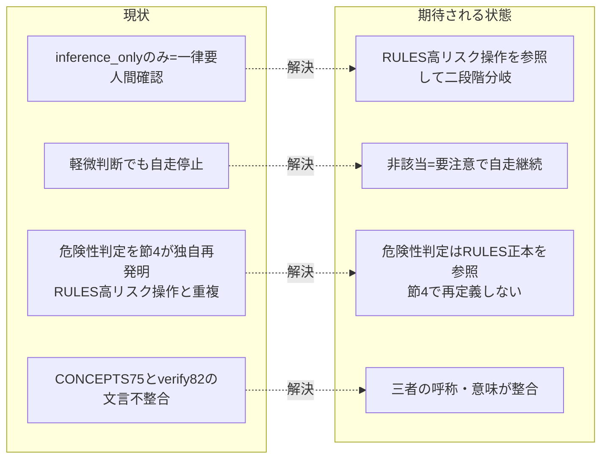

# 要求定義書: EVIDENCE_POLICY 節4 の二段階化（要注意／要人間確認の分岐）

**プロジェクト名**: EVIDENCE_POLICY 節4 の二段階化（要注意／要人間確認の分岐）
**作成日**: 2026 年 07 月 14 日
**最終更新**: 2026 年 07 月 14 日

> **重要**:
>
> - 要求定義書は、プロジェクトの全体像を把握するためのものです。詳細な技術仕様や実装方法は要件定義書以降で記載します。必要最低限の情報に収めることを心掛けてください。
> - **このドキュメントは常に更新**: 要求の変更や追加があった場合は、即座にこのドキュメントを更新してください。ドキュメントは「生きているドキュメント」として扱い、実装内容と常に同期させます。
>
> **用語**: [.agent-skill-chain/source/CONCEPTS.md §用語規約](../../../../../.agent-skill-chain/source/CONCEPTS.md#用語規約) を参照。

---

## 要求定義の全体像

```mermaid
mindmap
  root((節4二段階化))
    目的・背景
      自走ブロック問題
      CONCEPTS二段階の未実装
      正本間の文言不整合
      危険性判定の重複定義(独自再発明)
    機能要件
      RULES高リスク操作を参照して分岐
      要注意=非ブロッキング自走継続
      要人間確認=ブロック維持
      本改訂自体をADR記録
    非機能要件
      正本一元性の維持(判定基準を再定義しない)
      規模比例の維持
    制約条件
      既存版EVIDENCE_POLICYに従い執筆
      RULES§高リスク操作を正本として参照
      CONCEPTS75行目は変更前提にしない
    除外要件
      audit.sh機械チェック新設
      自己拡張§5(API障害運用)は対象外
    成功基準
    リスクと対策
      高リスク判定の解釈揺れ
      過剰な自走許容
```

**注意**:

- マインドマップは全体像の把握用であり、詳細は各セクションに記載する。

---

## 1. 目的・背景

### 1.1 目的（必須）

inference_only のみの重要判断を、**既存の RULES.md §高リスク操作の定義を参照して**二段階化し、高リスクに該当しない軽微判断は自走継続を許す。新しい危険性の判定基準を独自に作らない。

### 1.2 背景

- **現状の課題**:
  - `.agent-skill-chain/source/EVIDENCE_POLICY.md` 節4 は、根拠が `inference_only` のみの重要判断について成果物中で **「要人間確認」** の明示を一律義務づけている。この「要人間確認」は事実上ブロッキングであり、design-feature / requirement-discovery を実行するサブエージェントが人間の応答を待つまで先へ進めず、**自走を継続できない**（evidence: existing_code = 節4 本文 L32 の実読、及び本 issue 自体が上流フェーズ command である事実）。
  - 上位概念の正本である `CONCEPTS.md` §外部根拠の必須化（L58〜75、特に **L75**「**inference_only のみの重要判断は承認不可または要注意**とする」）は、もともと **承認不可（ブロック）／要注意（非ブロッキング）** の二段階の選択肢を残している。しかし EVIDENCE_POLICY 節4 はこのうち**重い方（承認不可＝要人間確認でブロック）のみ**を採用し、**軽い方（要注意＝非ブロッキングで自走継続）の分岐が実装されていない**（evidence: existing_code = 両ファイルを実読し差分を確認）。
  - **危険性判定の重複定義（本 issue の核心的な設計上の誤りの是正）**: 「どの判断が重く／軽いか」の危険性判定基準は、既に `.agent-skill-chain/source/RULES.md` L31 §高リスク操作に正本として定義済みである。すなわち「高リスク操作 = 外部サービス・インフラへの書き込み、リポジトリやファイル群の大量削除・履歴改変など、**不可逆または広範囲な影響を持つ操作**。これに該当する場合のみユーザーの明示確認を必須とし、それ以外の日常的な作業依頼はメインエージェントが自立的に進める」（evidence: existing_code = RULES.md:31 の実読確認）。にもかかわらず EVIDENCE_POLICY 節4 は、この既存の RULES.md §高リスク操作を参照せず、独自に「inference_only → 一律要人間確認」という**より粗く・より重いブロッキングルールを再発明**してしまっている。これは本プロジェクトの「正本を 1 箇所に集約し重複定義しない」設計原則（DRY・正本一元化）に反し、かつ自走を不必要に止めている原因でもある。
  - さらに、`verify-and-close.md` L82 は同一原則を「承認不可または**要人間確認**」と表現しており、CONCEPTS.md L75 の「承認不可または**要注意**」と**文言が不整合**である（軽い側の語が「要注意」→「要人間確認」に潰れている）。正本間で二段階の軽い側の呼称が揃っていない（evidence: existing_code = verify-and-close.md L82 の実読）。

- **必要性**:
  - CONCEPTS.md が既に許容している二段階を EVIDENCE_POLICY 節4 に実装する。ただし危険性の判定基準は**独自に作らず、既存の RULES.md §高リスク操作を参照**する形にする。これにより、高リスクに該当しない（可逆・影響範囲が小さい）判断ではサブエージェントが自走を継続でき、「軽微な設計内選択のたびに人間応答待ちで停止する」過剰ブロックを解消する。
  - 同時に、RULES.md §高リスク操作に該当する判断（不可逆・広範囲な影響：外部サービスへの破壊的操作・大量削除・履歴改変・後続フェーズを大きく左右する土台決定等）では従来どおり「要人間確認」でブロックし、安全性を落とさない。

### 1.3 期待される効果（必須: 1 件以上）

- **効果 1（自走性の回復）**: RULES.md §高リスク操作に**該当しない** inference_only 重要判断について、成果物に「要注意」フラグを明示するだけでサブエージェントが自走継続できる。○/× 判定: 改訂後の節4に「（高リスク操作に該当しない場合）要注意（非ブロッキング）で自走継続してよい」分岐が明文化されているか。
- **効果 2（安全性の維持）**: RULES.md §高リスク操作に**該当する**判断は「要人間確認」でブロックが維持される。○/× 判定: 改訂後の節4に「要人間確認（ブロッキング）」分岐と、その適用条件が RULES.md §高リスク操作の参照として明記されているか。
- **効果 3（正本一元化・DRY 回復）**: 節4 が危険性の判定基準を独自定義せず、RULES.md §高リスク操作を参照する形になる。○/× 判定: 改訂後の節4に「危険性の判定は RULES.md §高リスク操作を正本とし、本節では再定義しない」旨が明記されているか。
- **効果 4（正本整合）**: CONCEPTS.md L75・verify-and-close.md L82・EVIDENCE_POLICY 節4 の三者で「二段階（承認不可＝要人間確認／要注意）」の呼称・意味が整合する。○/× 判定: 参照元洗い出し結果に基づき不整合の有無と是正方針が 01 に記録されているか。

**現状と期待される状態の比較**:



---

## 2. 機能要件

### 2.1 既存機能の維持（該当する場合）

- 節1（上流フェーズの義務）・節2（ADR 形式）・節3（重要判断定義・軽量パス）・節5（greenfield ADR 対象化）は維持する。二段階化は節4 の内部分岐追加であり、他節の責務境界を変更しない。
- 節3 の軽量パス（重要判断を含まない軽量 issue では evidence_source の網羅付記を強制しない）は維持する。二段階化は「重要判断であって根拠が inference_only のみ」の場合の分岐であり、軽量パスとは別軸。
- 節1 が既に参照している「高リスク操作の事前確認は既存ルール（CORE / RULES / enforcement）に従い緩和しない」という接続を維持・活用する。二段階化はこの既存参照と整合する形で節4 に分岐を追加する。
- `verify-and-close.md`（event＝事後検証）側の責務は維持する。本 issue は process（執筆時）側である節4 の分岐を追加するのが主眼。ただし L82 の文言不整合の是正は参照元整合の一部として扱う（§2.2 参照）。

### 2.2 新規機能要件

- **二段階分岐基準の導入（既存正本を参照）**: EVIDENCE_POLICY 節4 に、inference_only のみの重要判断を **RULES.md §高リスク操作（L31）の定義に照らして**二段階に分岐する基準を追加する。**危険性の判定基準を節4 で新規に自己定義しない。RULES.md §高リスク操作（「不可逆または広範囲な影響を持つ操作」）を正本として参照する。**
  - **軽（要注意・非ブロッキング）**: RULES.md §高リスク操作に**該当しない**判断（可逆かつ影響範囲が小さい）→ 成果物に「要注意」フラグ（evidence_source=inference_only である旨と、後続で再検討し得る旨）を明示するだけで、サブエージェントは自走を継続してよい。
  - **重（要人間確認・ブロッキング）**: RULES.md §高リスク操作に**該当する**判断（外部サービス・インフラへの書き込み、大量削除・履歴改変など不可逆または広範囲な影響）→ 従来どおり「要人間確認」として明示し、人間の確認を得るまでブロックする。
  - **迷う場合の既定**: 該当／非該当の判定に迷う場合は**重い側（要人間確認）に倒す**。
- **本改訂自体の ADR 記録（方針）**: 本改訂は「ポリシーの土台決定」であり、EVIDENCE_POLICY 自身の節3 が定める**重要判断に該当する**。したがって EVIDENCE_POLICY 節2 の ADR 形式（コンテキスト・検討した選択肢・決定・根拠（evidence_source 付き）・帰結）に従い、**この二段階化判断自体を ADR として記録する**。実際の ADR 執筆は design-feature（02_設計）で行うが、その方針を本 00／01 に明記する。ADR の「決定」には「危険性判定は RULES.md §高リスク操作を参照し独自定義しない」ことを含める。
- **参照元整合の確認と是正方針**: EVIDENCE_POLICY.md を参照する他ファイルへの影響を洗い出し（既に grep 実施済み。§7・01 に記録）、二段階化に伴い文言同期が必要な箇所（特に `verify-and-close.md` L82・`boot/LOAD_POLICY.md` L31 の括弧書き）の是正方針を確定する。CONCEPTS.md L75 は「承認不可または要注意」のまま**変更不要**である想定を検証する。

---

## 3. 非機能要件

### 3.1 パフォーマンス

- 該当なし（ドキュメント／ポリシー改訂であり実行時性能に影響しない）。

### 3.2 セキュリティ

- 「重（要人間確認）」側の適用条件は RULES.md §高リスク操作の定義をそのまま参照するため、外部サービスへの破壊的操作・大量削除等の高リスク操作は必ず含まれる。二段階化により高リスク判断の人間確認がバイパスされてはならない（節1 の高リスク操作事前確認ルールを緩和しない）。

### 3.3 互換性

- 既存の evidence_source 6 分類（CONCEPTS.md が正本）を再定義しない。節4 は分岐追加のみで、evidence_source の定義・ADR 形式（節2）を変更しない。

### 3.4 保守性

- **正本一元性（単一責任・DRY）を回復・維持する。** 危険性の判定基準の正本は **RULES.md §高リスク操作**、二段階の原則の正本は **CONCEPTS.md L75**、それらを上流 process へ接続する具体は **EVIDENCE_POLICY 節4** という役割分担を崩さない（節4 で危険性判定基準も二段階原則も再定義しない）。本 issue の主目的は、節4 が独自に危険性判定を再発明していた状態を、既存正本の参照へ是正することにある。

---

## 4. 制約条件

### 4.1 技術的制約

- 本改訂自体が EVIDENCE_POLICY.md の改訂であるため、皮肉ではあるが**既存版の EVIDENCE_POLICY.md・run_command.md の Constraints に従って**本 issue の成果物（00/01）を執筆する（重要判断への evidence_source 付記等）。
- 危険性の判定基準は RULES.md §高リスク操作（L31）を正本として参照し、節4 内で新しい判定基準を独自に作らない（DRY）。
- 本 issue のドキュメント（00〜04・memo）は `docs/maintainer/workflow/20260714_065605_evidence_policy_二段階化/` 配下に置く（`.agent-skill-chain/project/自己拡張ワークフロー.md` の上書き定義に従う）。

### 4.2 既存システムとの互換性

- CONCEPTS.md L75 の文言（「承認不可または要注意」）は変更しない前提で設計する。変更が必要と判明した場合は design-feature で ADR として別途判断する。
- RULES.md §高リスク操作（L31）の定義は変更しない前提で、参照するのみとする。
- verify-and-close（event 側）の検証ロジックの責務範囲は維持する。文言同期以外の挙動変更は本 issue で行わない。

### 4.3 移行期間・スケジュール

- 段階移行は不要（ポリシー文書の改訂であり、改訂反映時点から新分岐が適用される）。grandfather 等の発効日ゲートは本 issue では導入しない。

---

## 5. 除外要件

- **audit.sh（enforcement/ci）による evidence_source／ADR の機械チェック新設は本 issue のスコープ外**とする。二段階分岐（要注意／要人間確認）を CI で機械検証する仕組みの新設は、別途検討中の未決事項であり、今回は含めない。二段階化はあくまで **執筆プロセス（process）上の規約（人手監査＋自己検証）** として実装する。
- CONCEPTS.md L75 の書き換え（二段階の原則そのものの改訂）・RULES.md §高リスク操作の書き換えは原則スコープ外（いずれも参照するのみ。変更不要である想定を検証するに留める）。
- verify-and-close の**検証ロジック・挙動**の変更はスコープ外（L82 の文言整合の是正は参照元整合の範囲として扱うが、事後検証の仕組み自体は変えない）。
- **`.agent-skill-chain/project/自己拡張ワークフロー.md:104`（§5 API 一時障害・認証失効時の運用）は本 issue の見直し対象から除外する。** 理由: 同節は (1) 本リポ固有の project ローカル運用であり source の EVIDENCE_POLICY 正本ではない、(2) 既にドラフト扱いで「実運用前に必ずユーザーの明示確認を得ること」と明記された例外的節である、(3) そこでの「要人間確認」は inference_only のみの**重要判断の顕在化**ではなく、**API 障害・認証失効という運用イベント**を起点とするエスカレーションであり、節4 の二段階化とは別軸である。したがって節4 二段階化の波及対象にはあたらない。ドラフト値（リトライ回数等）の確定は当該節自身の TODO であり本 issue では扱わない。

---

## 6. 成功基準（必須: 1 件以上）

- **SC1**: 改訂後の EVIDENCE_POLICY 節4 が、inference_only のみの重要判断を **RULES.md §高リスク操作の該当／非該当**で二段階に分ける基準を明文化しており、かつ「危険性の判定基準は RULES.md §高リスク操作を正本として参照し、本節では再定義しない」旨が明記されている（○/×）。
- **SC2**: 「要注意（非ブロッキング）」の分岐（高リスク操作に非該当）で、成果物にフラグを明示すればサブエージェントが自走継続してよいことが明記されている（○/×）。
- **SC3**: 「要人間確認（ブロッキング）」の分岐（高リスク操作に該当）と、迷う場合は重い側に倒す既定が明記されている（○/×）。
- **SC4**: 本二段階化判断自体が、EVIDENCE_POLICY 節2 の ADR 形式で 02_設計 に記録される方針が 00／01 に明記されている（「決定」に RULES.md 参照方式を含む）（○/×）。
- **SC5**: EVIDENCE_POLICY.md 参照元の影響が洗い出され、文言同期が必要な箇所（verify-and-close L82・LOAD_POLICY L31 等）と CONCEPTS.md L75／RULES.md §高リスク操作 変更要否が 01 に整理されている（○/×）。
- **SC6**: audit.sh 機械チェック新設・自己拡張ワークフロー §5 が除外要件として 00 に明記されている（○/×＝本 §5 に記載済み）。

---

## 7. リスクと対策

### 7.1 技術的リスク

- **リスク**: RULES.md §高リスク操作の該当／非該当の解釈が揺れると、本来ブロックすべき重い判断が「要注意」で自走通過してしまう。
  - **対策**: 節4 では判定基準を独自に再定義せず RULES.md §高リスク操作を参照する（解釈の一元化）。判定に迷う場合は**重い側（要人間確認）に倒す**デフォルトを ADR に明記する。
- **リスク**: 正本間の文言不整合（CONCEPTS L75／verify-and-close L82／節4）を放置すると、二段階の軽い側の呼称が揺れて誤運用を招く。
  - **対策**: 参照元を grep で洗い出し済み。design-feature で同期是正の対象箇所と是正方針を確定し、実装で反映する。

### 7.2 スケジュールリスク

- **リスク**: 参照元同期の範囲が広がり、責務外のファイルまで改訂が波及する。
  - **対策**: 是正対象を「二段階の呼称・ブロッキング性に直接言及する箇所」に限定し、ADR 形式・evidence_source 定義・RULES.md §高リスク操作の本文など無関係な参照は触らない（単一責任・KISS）。

---

## 8. 参考資料

### プロジェクトドキュメント

- [`01_要件定義.md`](./01_要件定義.md) - 要件定義
- [.agent-skill-chain/source/EVIDENCE_POLICY.md](../../../../../.agent-skill-chain/source/EVIDENCE_POLICY.md) - 改訂対象（特に節2 ADR 形式・節3 重要判断定義・節4 inference_only 顕在化）
- [.agent-skill-chain/source/RULES.md](../../../../../.agent-skill-chain/source/RULES.md) - **危険性判定の正本（L31 §高リスク操作＝不可逆または広範囲な影響を持つ操作）。節4 はここを参照する**
- [.agent-skill-chain/source/CONCEPTS.md §外部根拠の必須化](../../../../../.agent-skill-chain/source/CONCEPTS.md#外部根拠の必須化external-anchor) - 二段階原則の正本（L58〜75、特に L75）

### その他の参考資料

- 参照元洗い出し（grep 実測）: `commands/design-feature.md` L72・`commands/requirement-discovery.md` L75・`commands/verify-and-close.md` L82・`boot/LOAD_POLICY.md` L31・`DOCS_RULES.md` L50・`runtime/templates/02_設計.md`・`runtime/templates/docs/01_システム概要/05_規約/README.md`・`docs/01_システム概要/05_規約/README.md`。

---

## 9. 次のステップ

この要求定義書の承認後、以下のドキュメントを作成します：

- **次**: [`01_要件定義.md`](./01_要件定義.md) - 要件定義フェーズ
