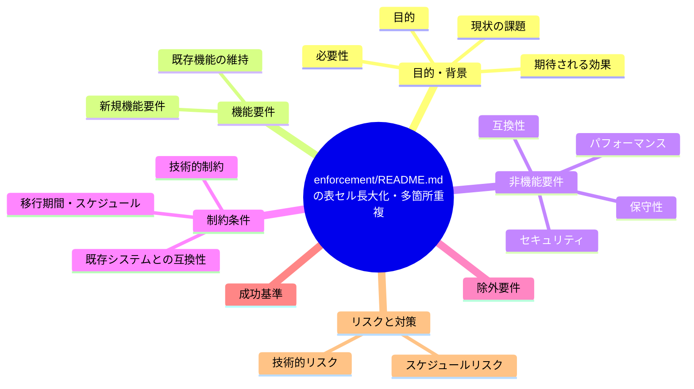
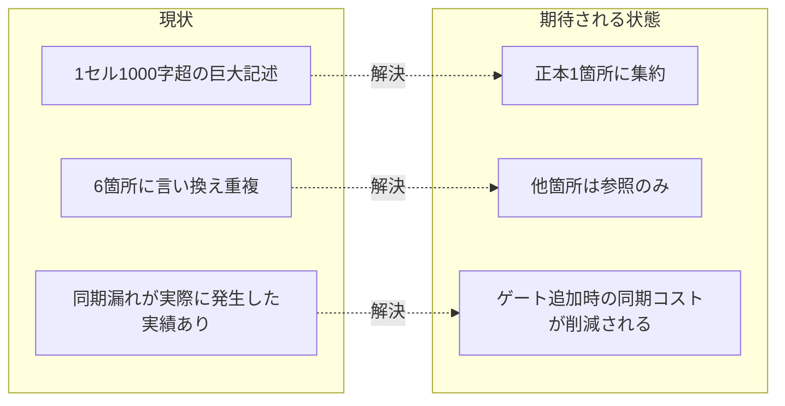

# 要求定義書: enforcement/README.md の表セル長大化・多箇所重複

**プロジェクト名**: enforcement/README.md の表セル長大化・多箇所重複
**作成日**: 2026 年 07 月 14 日
**最終更新**: 2026 年 07 月 14 日

> **重要**:
>
> - 要求定義書は、プロジェクトの全体像を把握するためのものです。詳細な技術仕様や実装方法は要件定義書以降で記載します。必要最低限の情報に収めることを心掛けてください。
> - **このドキュメントは常に更新**: 要求の変更や追加があった場合は、即座にこのドキュメントを更新してください。ドキュメントは「生きているドキュメント」として扱い、実装内容と常に同期させます。
> - **必須項目**: 以下の「必須」と明記した項目は空欄・抽象語のみ（例: 「{説明}」のまま）で提出しないこと。判定可能な形（目的は1文・成功基準は○/×で判定できる記載等）で記入すること。
>
> **用語**: [.agent-skill-chain/source/CONCEPTS.md §用語規約](../../../../../../../.agent-skill-chain/source/CONCEPTS.md#用語規約) を参照。

---

## 要求定義の全体像

**注意**:

- 上記の「プロジェクト名」は例です。実際のプロジェクト名に置き換えてください。
- マインドマップは全体像を把握するためのものです。主要なセクション名程度に留め、詳細は記載しないでください。

---

## 1. 目的・背景

### 1.1 目的（必須）

enforcement ゲート記述の重複箇所を集約し、正本を一元化する。

### 1.2 背景

2026-07-14 fable による本システムの自己調査で検出。

- **現状の課題**:
  - `enforcement/README.md` の失敗条件対応表の1セルが1,000字超に達している。
  - 同内容が audit.sh ヘッダコメント・README 必須チェック節・失敗条件一覧・差し戻し表・run_command Constraints・project 具体手順の最低6箇所に少しずつ言い換えて重複しており、「重複禁止・正本1か所」という自らの原則に反する。
  - 1ゲート追加のたびに6箇所の同期が必要で、実際に #37 で同期漏れが発生した実績がある。

- **必要性**:
  - 重複箇所を集約し、1ゲートあたりの変更コストを削減する必要がある。

### 1.3 期待される効果（必須: 1 件以上）

- **効果 1**: ゲート追加・変更時に同期すべき箇所数が現状の6箇所から削減される。
- **効果 2**: 各箇所は正本への参照のみとなり、内容の言い換え重複が解消される。

**現状と期待される状態の比較**（必要に応じて）:

---

## 2. 機能要件

### 2.1 既存機能の維持（該当する場合）

各ゲートの失敗条件・検査内容自体は維持する。

### 2.2 新規機能要件

{対応方針は 01 要件定義以降で検討。本書では課題の提起に留める}

---

## 3. 非機能要件

### 3.1 パフォーマンス

- {該当なし}

### 3.2 セキュリティ

- {該当なし}

### 3.3 互換性

- audit.sh の実装・CI 挙動を変えないこと（ドキュメント構造のみの変更を想定）。

### 3.4 保守性

- 「重複禁止・正本1か所」の原則を実際の記述構造にも適用すること。

---

## 4. 制約条件

### 4.1 技術的制約

- {01 要件定義以降で検討}

### 4.2 既存システムとの互換性

- 既存の参照リンク（他ドキュメントから enforcement/README.md への参照）を破壊しないこと。

### 4.3 移行期間・スケジュール

- {未定}

---

## 5. 除外要件

対応方針の具体設計・実装（本 issue は課題の起票のみ）。

---

## 6. 成功基準（必須: 1 件以上）

- 1ゲートの失敗条件記述が変更された際に同期が必要な箇所数が、現状の6箇所から削減されていること。

---

## 7. リスクと対策

### 7.1 技術的リスク

- **リスク**: 集約により各箇所の文脈依存の説明（audit.sh 実装者向け／README 読者向け等）が失われる可能性がある。
  - **対策**: 参照元の読者層ごとに必要な要約は残しつつ、詳細本文のみ正本への参照にする等、01 以降で検討する。

### 7.2 スケジュールリスク

- **リスク**: {特になし}
  - **対策**: {特になし}

---

## 8. 参考資料

### プロジェクトドキュメント

- 既存プロジェクトの場合は、[`00_システム理解.md`](./00_システム理解.md) - システム理解を参照

### その他の参考資料

- `.agent-skill-chain/source/enforcement/README.md:147, 248, 302`
- `.agent-skill-chain/source/enforcement/ci/audit.sh:1-101`
- `.agent-skill-chain/source/skills/agent/run_command.md:48`

---

## 9. 次のステップ

この要求定義書の承認後、以下のドキュメントを作成します：

- **次**: [`01_要件定義.md`](./01_要件定義.md) - 要件定義フェーズ
