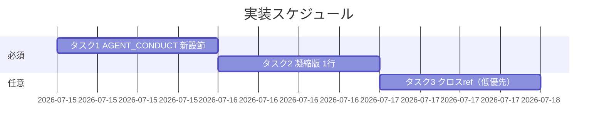

# 実装計画書: ゲート無効化 env・grandfather env による自己バイパス防止の運用ルール明文化

**プロジェクト名**: ゲート無効化env自己バイパス問題
**作成日**: 2026 年 07 月 15 日
**最終更新**: 2026 年 07 月 15 日

> **重要**: 本計画はドキュメント追記のみ。コード（audit.sh 等）は変更しない。配置先は [`02_設計.md`](./02_設計.md) ADR-1（`.agent-skill-chain/source/AGENT_CONDUCT.md` 単一正本）に確定済み。
>
> **用語**: [.agent-skill-chain/source/CONCEPTS.md §用語規約](../../../../../../../.agent-skill-chain/source/CONCEPTS.md#用語規約) を参照。

---

## 1. 実装概要

### 1.1 実装方針

02_設計 ADR-1〜3 に従い、`.agent-skill-chain/source/AGENT_CONDUCT.md` に自己バイパス禁止節を 1 か所新設し、第 3 部 凝縮版へ要約 1 行を追記する。`自己拡張ワークフロー.md` §8 等の既存記述は改変しない（任意クロスリファレンスは低優先の別タスク）。

### 1.2 実装順序

1. **タスク 1（必須）**: AGENT_CONDUCT.md へ自己バイパス禁止節を新設。
2. **タスク 2（必須）**: AGENT_CONDUCT.md 第 3 部 凝縮版へ 1 行追記。
3. **タスク 3（任意・低優先）**: 自己拡張ワークフロー.md §8 へ additive なクロスリファレンス 1 行。



---

## 2. タスク分解

### 2.1 タスク 1: AGENT_CONDUCT.md へ自己バイパス禁止節を新設（必須）

#### 2.1.1 概要

`.agent-skill-chain/source/AGENT_CONDUCT.md` に、ゲート無効化 env・grandfather env の自律設定・変更を禁止し人間の明示指示のみ許容する advisory 節を新設する。

#### 2.1.2 実装内容

- **追記位置**: 「## 機構的強制の非対象（§3 進捗の実証を含む）」節の直後。現行ファイルの **line 74 の `---`（機構的強制節の閉じ区切り）と line 76 `## 第 3 部: サブエージェント向け凝縮版` の間**に、新セクション本文＋末尾区切り `---` を挿入する（§0 読み替え規則→8 原則本文→機構的強制の非対象→**新設節**→第 3 部 の並びになる）。
- **追記する見出しレベル**: `##`（他の主要節と同レベル）。
- **追記文言案（そのまま挿入可）**:

```markdown
## enforcement ゲートの自己無効化禁止（自己バイパス防止・advisory）

enforcement ゲート（`enforcement/ci/audit.sh` 等）は、AI エージェント自身の作業を監督するために存在する。その監督を、監督される当のエージェントが自ら無効化することは、§6 境界（システム状態を変える操作の前に、証拠がその操作を支持しているか確認する）の特化として禁止する。

- **対象 env**: enforcement ゲートの無効化 env（`*_GATE_ENABLED` 系。例: `GITHUB_ISSUE_GATE_ENABLED`・`BRANCH_LINK_GATE_ENABLED`・`PR_LINK_GATE_ENABLED`・`MODEL_TIER_GATE_ENABLED`）、および発効日（grandfather）上書き env（`*_GATE_EFFECTIVE_FROM` 系）。基準日を未来方向へ上書きして対象範囲をゲート適用外（grandfather 扱い）にする行為も無効化に含む。
- **禁止**: AI エージェント（サブエージェントを含む）は、これらの env を**自律的に設定・変更してはならない**。自らの作業に対するゲートを SKIP させる目的での設定は、たとえ「作業を先へ進めるため」であっても自己バイパスであり禁止する。
- **例外（人間の明示指示がある場合のみ）**: 人間（ユーザー）が自然文・設定変更依頼等でこれらの env の設定・変更を**明示的に指示した場合に限り**、委譲された AI エージェントは設定・変更してよい。文脈からの推測を指示とみなさない。
- **正当なトグル運用との区別**: プロジェクト単位での恒常的なトグル設定（例: GitHub 非採用環境での無効化）自体は禁止対象ではない。禁止するのは「AI エージェントが自律的にその設定を行うこと」であり、人間が判断した既存の正当な設定（各採用先の `.agent-skill-chain/project/` 等に記録される運用）を否定しない。
- **強制レベル**: 本規範は advisory である（env はシェルで自由に設定でき技術的強制は困難）。§機構的強制の非対象 と同様、機構（hooks/CI）による直接強制はせず、人手監査・レビュー（トグル差分・env 設定の確認等）で補完する。
```

#### 2.1.3 テスト観点

**参照**: 観点定義は [02\_設計 §6](./02_設計.md) 参照。以下は本タスクの具体ケース（grep ベースのドキュメント受け入れ検査）。

##### 単体（本タスクの具体ケース・必須）

- **正常系（UC1 S1 ○）**: 追記後、`AGENT_CONDUCT.md` を「ゲート」「自律的に設定・変更してはならない」「人間の明示指示」で検索すると、禁止＋例外条件の文言がヒットする。
- **正常系（UC3 S1 ○）**: 追記文言に `*_GATE_ENABLED` と `*_GATE_EFFECTIVE_FROM` の両パターンが含まれ、どの env が対象か一意に判定できる。
- **異常系（UC1 S2 ×）**: 追記が漏れ、トグルの存在記述はあるが設定権限（自律禁止＋人間明示のみ）の記述が無い場合は未達（×）と判定。
- **境界（UC2 S2 回避）**: 文言が「いかなる場合もゲート無効化 env を設定してはならない」等の**一律禁止**になっていないこと（人間明示指示の例外・正当運用の区別が読み取れること）。
- **副作用（UC2 S1 ○・機能1 の副作用検証。02\_設計 §6.1 参照）**: 必須タスク（タスク 1・2）は `AGENT_CONDUCT.md` のみを編集するため、`git diff` に `自己拡張ワークフロー.md` §8 等の既存記述の変更・削除行が現れないことを確認する。これにより任意タスク 3 の実施有無に依らず UC2 S1（既存の正当なトグル運用記述の維持）を担保する。

##### 結合/API（該当時）

- 該当なし（コード契約なし。ドキュメント文言契約は §2.1.4 の BDD で検証）。

##### E2E/受け入れ

- 実装後 verify-and-close の 04_review で、01 の UC1/UC2/UC3 と本節の対応を証跡化する（docs-only のため自動 E2E は無し・理由記載）。

##### バリデーション

- 対象 env の言及に**トークン・秘匿値の実値を含めない**（env 名のみ）。

#### 2.1.4 単体テスト仕様（BDD）

01 の BDD ユースケースに 1:1 対応（コード無しのため「テストコード例」はドキュメント受け入れ検査スクリプトの擬似コードで示す）。

```gherkin
Feature: ゲート無効化 env 自律設定禁止ルールの明記（01 UC1）
  Scenario: 正本ドキュメントに運用ルールが明記されている（○）
    Given .agent-skill-chain/source/AGENT_CONDUCT.md に新設節を追記した
    When 「自律的に設定・変更してはならない」「人間の明示指示」を検索する
    Then 禁止と例外条件の両方の文言が見つかる

Feature: 対象 env 範囲の明確性（01 UC3）
  Scenario: 対象 env パターンが一意に特定できる（○）
    Given 追記文言に "*_GATE_ENABLED" と "*_GATE_EFFECTIVE_FROM" が含まれる
    When 読み手が文言を読む
    Then どの env 変数が禁止対象かを一意に判定できる
```

```bash
# Given: 新設節を追記した AGENT_CONDUCT.md
# When: 受け入れ検査 grep を実行する
grep -q '自律的に設定・変更してはならない' .agent-skill-chain/source/AGENT_CONDUCT.md \
  && grep -q '人間.*明示.*指示' .agent-skill-chain/source/AGENT_CONDUCT.md \
  && grep -q '\*_GATE_ENABLED' .agent-skill-chain/source/AGENT_CONDUCT.md \
  && grep -q '\*_GATE_EFFECTIVE_FROM' .agent-skill-chain/source/AGENT_CONDUCT.md
# Then: 終了コード 0（全パターン一致＝UC1 S1・UC3 S1 の ○）
```

#### 2.1.5 依存関係

- なし（先頭タスク）。

#### 2.1.6 見積もり

- **工数**: 約 0.5h（文言挿入＋位置確認）。
- **優先度**: 高。

### 2.2 タスク 2: 第 3 部 凝縮版へ 1 行追記（必須）

#### 2.2.1 概要

委譲時に Constraints へ転記される第 3 部 凝縮版へ、自己バイパス禁止の要約 1 行を追加し、audit 実行主体になり得るサブエージェントへ確実に伝える。

#### 2.2.2 実装内容

- **追記位置**: 第 3 部 凝縮版の ```` ```markdown ```` コードブロック内。現行 **line 89 の「境界」バレットと line 90 の「背景タスク抑止」バレットの間**に、以下 1 行を挿入する（「境界」の直後＝システム状態変更の文脈に隣接）。
- **追記文言案（そのまま挿入可）**:

```markdown
- **ゲート自己無効化禁止**: enforcement ゲートの無効化 env（`*_GATE_ENABLED`）・発効日上書き env（`*_GATE_EFFECTIVE_FROM`）を自律的に設定・変更しない。自らのゲートを SKIP させる自己バイパスは禁止。人間の明示指示がある場合のみ設定可
```

#### 2.2.3 テスト観点

##### 単体（本タスクの具体ケース・必須）

- **正常系**: 凝縮版コードブロック内に「ゲート自己無効化禁止」を含む 1 行が存在する。
- **異常系（回帰）**: 既存 8 バレット（規約優先〜背景タスク抑止）が削除・改変されていない（バレット数が 1 増えるのみ）。

##### 結合/API

- 該当なし。

##### E2E/受け入れ

- 該当なし（docs-only）。

##### バリデーション

- 該当なし。

#### 2.2.4 単体テスト仕様（BDD）

```gherkin
Feature: 凝縮版への自己バイパス禁止の反映
  Scenario: 委譲時転記文に禁止ルールが含まれる
    Given AGENT_CONDUCT.md 第3部 凝縮版に1行追記した
    When 凝縮版コードブロックを読む
    Then 「ゲート自己無効化禁止」の1行が既存バレットを壊さずに存在する
```

```bash
# Given: 凝縮版に1行追記した AGENT_CONDUCT.md
# When: 検査する
grep -q 'ゲート自己無効化禁止' .agent-skill-chain/source/AGENT_CONDUCT.md
# Then: 終了コード 0（凝縮版に反映済み）
```

#### 2.2.5 依存関係

- タスク 1（新設節の要約であるため、本文確定後に整合させる）。

#### 2.2.6 見積もり

- **工数**: 約 0.2h。
- **優先度**: 高。

### 2.3 タスク 3: 自己拡張ワークフロー.md §8 へクロスリファレンス（任意・低優先）

#### 2.3.1 概要

02_設計 ADR-2 に基づく発見性補助。`自己拡張ワークフロー.md` §8 の末尾に additive な参照 1 行を追加する。**実施は任意**であり、未実施でも受け入れ基準は満たす。

#### 2.3.2 実装内容

- **追記位置**: `.agent-skill-chain/project/自己拡張ワークフロー.md` §8「プロジェクト全体でのゲート無効化トグル」の最終バレット（現行 **line 134**「本リポジトリでの扱い」）**の直後**に 1 行追加。既存バレットの本文は改変しない（additive のみ）。
- **追記文言案**:

```markdown
- **AI エージェントによる自律設定の禁止（参照）**: 本トグル（`GITHUB_ISSUE_GATE_ENABLED`）を含む enforcement ゲートの無効化 env（`*_GATE_ENABLED` 系）および grandfather env（`*_GATE_EFFECTIVE_FROM` 系）を AI エージェントが自律的に設定・変更してはならない（人間の明示指示がある場合のみ可）。正本は [../source/AGENT_CONDUCT.md](../source/AGENT_CONDUCT.md) §enforcement ゲートの自己無効化禁止。
```

#### 2.3.3 テスト観点

##### 単体（本タスクの具体ケース）

- **正常系（UC2 S1 ○）**: §8 の既存バレット（既定 true・本リポでは設定しない等）が**改変・削除されていない**（追加行のみ差分に出る）。
- **異常系（UC2 S2 ×）**: 追記が既存の「本リポでは設定せず既定 true のまま」記述を否定・改変していないこと。

##### 結合/API・E2E・バリデーション

- 該当なし。

#### 2.3.4 単体テスト仕様（BDD）

```gherkin
Feature: 既存の正当なトグル運用記述との整合（01 UC2）
  Scenario: §8 の既存記述が維持されている（○）
    Given 自己拡張ワークフロー.md §8「本リポジトリでは GITHUB_ISSUE_GATE_ENABLED を設定せず既定 true のまま」がある
    When クロスリファレンス1行を additive に追記する
    Then 既存記述は削除・改変されず、追加行は正本(AGENT_CONDUCT)への参照として併存する
```

```bash
# Given: 追記前後の §8
# When: 既存記述の非改変を確認する
git diff .agent-skill-chain/project/自己拡張ワークフロー.md | grep '^-' | grep -v '^---'
# Then: 削除行（^-）が出力されない＝既存記述の削除・改変なし（UC2 S1 の ○）
```

#### 2.3.5 依存関係

- タスク 1（参照先アンカー `§enforcement ゲートの自己無効化禁止` が存在してから追記）。

#### 2.3.6 見積もり

- **工数**: 約 0.2h。
- **優先度**: 低（任意）。

---

## テスト観点

- 全タスク共通で **grep ベースのドキュメント受け入れ検査**＋**git diff による既存記述非改変検査**を用いる（コード実行テストは docs-only のため該当なし）。
- 01 の 3 ユースケース（UC1 明記有無・UC2 既存整合・UC3 env 範囲明確性）に各タスクの検査を 1:1 対応させる（§2.1.4・§2.2.4・§2.3.4）。

## 単体テスト

- 実コードの単体テストは無い。代替として §2.x.4 の grep/diff 受け入れ検査を単体相当の検証とする。

## BDD

- §2.1.4（UC1・UC3）／§2.2.4（凝縮版反映）／§2.3.4（UC2 既存整合）に Given/When/Then で記載済み。Given/When/Then の形式は [TEST_BDD_FORMAT.md](../../../../../../../.agent-skill-chain/source/TEST_BDD_FORMAT.md) に従う。

---

## 3. 実装スケジュール

### 3.1 マイルストーン

| マイルストーン | 期日 | 成果物 |
| --- | --- | --- |
| 必須追記完了 | 実装日 | AGENT_CONDUCT.md 新設節＋凝縮版 1 行 |
| 受け入れ検査 | 実装日 | grep/diff 検査パス・04_review 証跡 |

### 3.2 実装フェーズ

#### フェーズ 1: 必須追記

- **タスク**: タスク 1・タスク 2。

#### フェーズ 2: 任意補助（実施判断は review-docs / 実装時）

- **タスク**: タスク 3。

---

## 4. テスト計画

- テスト観点・BDD の定義は 02\_設計 §6 および RULES のテスト戦略・TEST_BDD_FORMAT を参照。本計画では各タスク §2.x.3／§2.x.4 に具体ケースを記載済み。

### 4.1 テストの優先順位

- クリティカル: UC1（明記有無）・UC2（既存非改変）。回帰: 凝縮版既存 8 バレットの非破壊。

---

## 5. リスク管理

### 5.1 実装リスク

- **リスク**: advisory のみで実効性が限定的（00 §7.1）。
  - **対策**: 新設節に「人手監査・レビューで補完」を明記（02 ADR-3 帰結）。機構強制の追加は将来別 issue に委ねる申し送りとする。
- **リスク**: 対象ゲートが将来増減し文言が陳腐化。
  - **対策**: パターン表記（`*_GATE_ENABLED`／`*_GATE_EFFECTIVE_FROM`）で包含（02 ADR-3）。
- **リスク**: 配置先が source（配布物）のため全消費者に影響。
  - **対策**: advisory かつ「正当なトグル運用は否定しない」と明記し、既存の正当運用を阻害しない（02 ADR-1 帰結・UC2 S2 回避）。

---

## 6. 参考資料

### プロジェクトドキュメント

- [`02_設計.md`](./02_設計.md) - 設計
- [`01_要件定義.md`](./01_要件定義.md) - 要件定義

### その他の参考資料

- `.agent-skill-chain/source/AGENT_CONDUCT.md`（追記対象・現行 line 74/76・line 89/90）
- `.agent-skill-chain/project/自己拡張ワークフロー.md` §8（現行 line 126–134・任意クロスref 対象）
- `.agent-skill-chain/source/enforcement/ci/audit.sh` L1005–1404（対象 env・変更しない）

---

## 7. 前のステップ

- **前**: [`02_設計.md`](./02_設計.md) - 設計フェーズ

---

## 8. 次のステップ

- 本 issue は単一 issue（サブ分割なし）。**次**: 実装着手前に review-docs（実装前ドキュメントレビュー・full/standard 必須）を経てから implement-feature へ進む。
