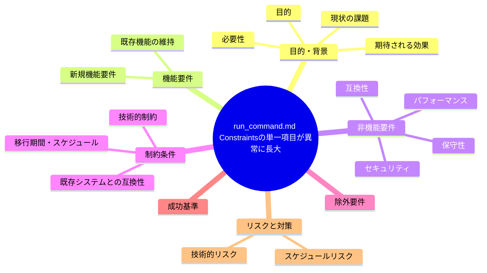
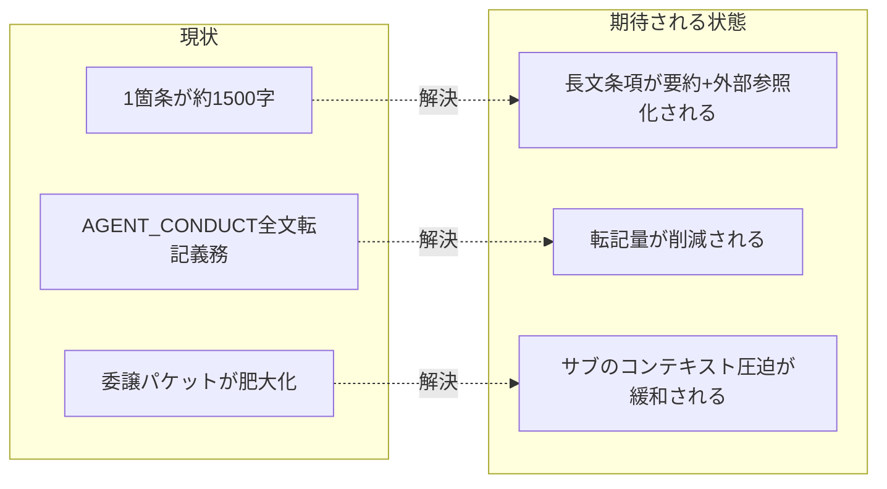

# 要求定義書: run_command.md Constraints の単一項目が異常に長大

**プロジェクト名**: run_command.md Constraints の単一項目が異常に長大
**作成日**: 2026 年 07 月 14 日
**最終更新**: 2026 年 07 月 14 日

> **重要**:
>
> - 要求定義書は、プロジェクトの全体像を把握するためのものです。詳細な技術仕様や実装方法は要件定義書以降で記載します。必要最低限の情報に収めることを心掛けてください。
> - **このドキュメントは常に更新**: 要求の変更や追加があった場合は、即座にこのドキュメントを更新してください。ドキュメントは「生きているドキュメント」として扱い、実装内容と常に同期させます。
> - **必須項目**: 以下の「必須」と明記した項目は空欄・抽象語のみ（例: 「{説明}」のまま）で提出しないこと。判定可能な形（目的は1文・成功基準は○/×で判定できる記載等）で記入すること。
>
> **用語**: [.agent-skill-chain/source/CONCEPTS.md §用語規約](../../../../../../../.agent-skill-chain/source/CONCEPTS.md#用語規約) を参照。

---

## 要求定義の全体像

**注意**:

- 上記の「プロジェクト名」は例です。実際のプロジェクト名に置き換えてください。
- マインドマップは全体像を把握するためのものです。主要なセクション名程度に留め、詳細は記載しないでください。

---

## 1. 目的・背景

### 1.1 目的（必須）

委譲パケットの Constraints 項目の肥大化を整理する。

### 1.2 背景

2026-07-14 fable による本システムの自己調査で検出。

- **現状の課題**:
  - 委譲パケットに毎回転記・遵守させる Constraints の1箇条（バックグラウンド実行禁止）が理由・例外・フォールバック・観測事例まで含む約1,500字の長文になっている。
  - 他にも AGENT_CONDUCT 凝縮版の全文転記義務があり、委譲パケット自体が肥大化してサブエージェントのコンテキストを圧迫している。

- **必要性**:
  - 委譲パケットのサイズを適正化し、サブエージェントのコンテキスト消費を抑える必要がある。

### 1.3 期待される効果（必須: 1 件以上）

- **効果 1**: 委譲パケットの Constraints セクションの文字数が現状より削減される、または詳細部分が外部参照化される。
- **効果 2**: 長文条項の理由・例外・観測事例が本文から分離され、必要時のみ参照する形になる。

**現状と期待される状態の比較**（必要に応じて）:

---

## 2. 機能要件

### 2.1 既存機能の維持（該当する場合）

バックグラウンド実行禁止ルールの実効性自体は維持する。

### 2.2 新規機能要件

{対応方針は 01 要件定義以降で検討。本書では課題の提起に留める}

---

## 3. 非機能要件

### 3.1 パフォーマンス

- 委譲パケットのトークン消費量削減を検討対象に含める。

### 3.2 セキュリティ

- {該当なし}

### 3.3 互換性

- 既存のバックグラウンド実行禁止ルールの適用範囲を変えないこと。

### 3.4 保守性

- {01 要件定義以降で検討}

---

## 4. 制約条件

### 4.1 技術的制約

- {01 要件定義以降で検討}

### 4.2 既存システムとの互換性

- 既存の委譲フローとの互換性を保つこと。

### 4.3 移行期間・スケジュール

- {未定}

---

## 5. 除外要件

対応方針の具体設計・実装（本 issue は課題の起票のみ）。

---

## 6. 成功基準（必須: 1 件以上）

- run_command.md の該当 Constraints 項目の文字数が現状（約1,500字）より削減されていること、または削減しない場合はその理由が明文化されていること。

---

## 7. リスクと対策

### 7.1 技術的リスク

- **リスク**: 要約しすぎると、過去に観測された事故（バックグラウンド実行による停滞）の再発防止効果が弱まる可能性がある。
  - **対策**: 要点は本文に残し、詳細な観測事例・理由説明は別ファイルへの参照に切り出す等、01 以降で検討する。

### 7.2 スケジュールリスク

- **リスク**: {特になし}
  - **対策**: {特になし}

---

## 8. 参考資料

### プロジェクトドキュメント

- 既存プロジェクトの場合は、[`00_システム理解.md`](./00_システム理解.md) - システム理解を参照

### その他の参考資料

- `.agent-skill-chain/source/skills/agent/run_command.md:69, 70`

---

## 9. 次のステップ

この要求定義書の承認後、以下のドキュメントを作成します：

- **次**: [`01_要件定義.md`](./01_要件定義.md) - 要件定義フェーズ
