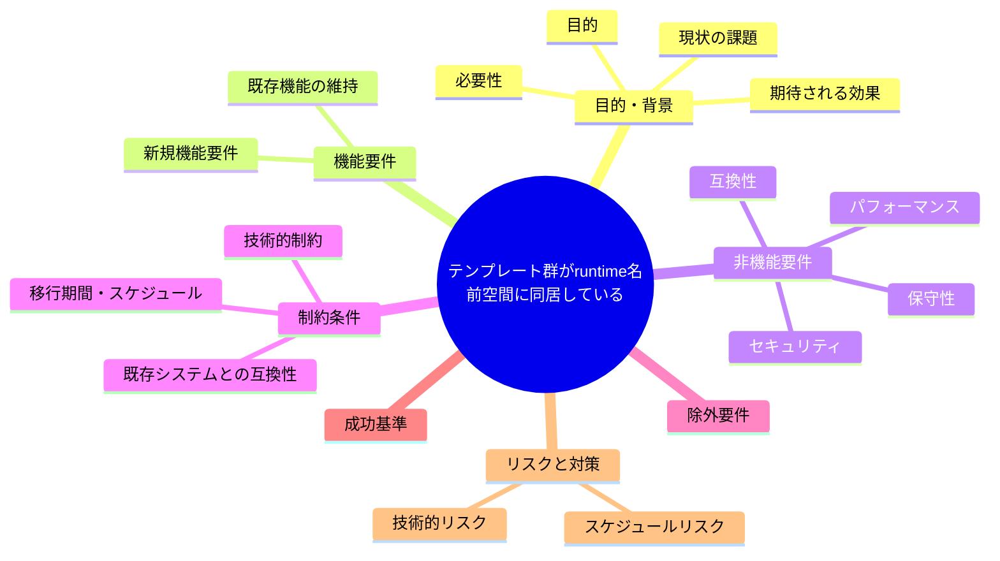
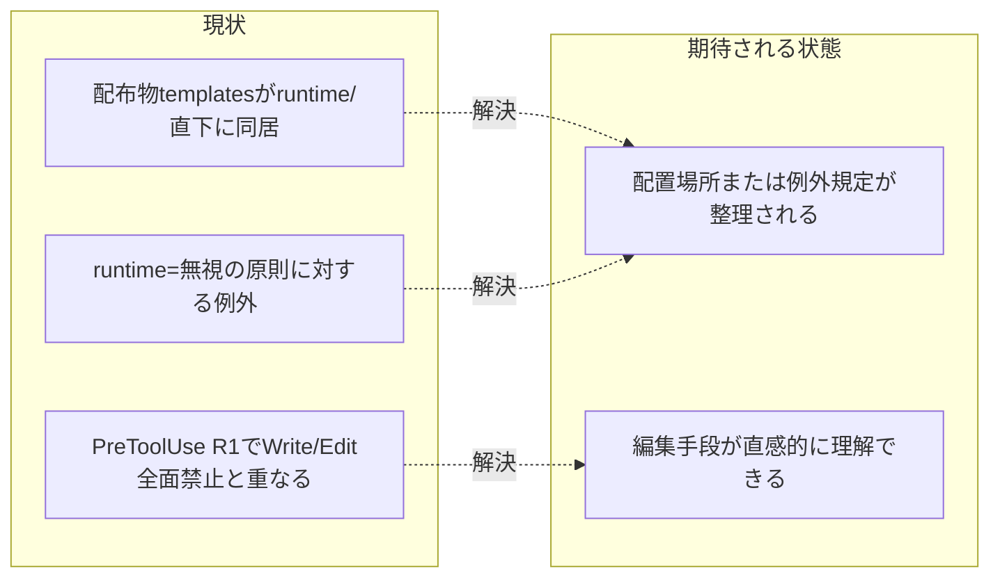

# 要求定義書: テンプレート群が runtime/ 名前空間に同居している

**プロジェクト名**: テンプレート群が runtime/ 名前空間に同居している
**作成日**: 2026 年 07 月 14 日
**最終更新**: 2026 年 07 月 14 日

> **重要**:
>
> - 要求定義書は、プロジェクトの全体像を把握するためのものです。詳細な技術仕様や実装方法は要件定義書以降で記載します。必要最低限の情報に収めることを心掛けてください。
> - **このドキュメントは常に更新**: 要求の変更や追加があった場合は、即座にこのドキュメントを更新してください。ドキュメントは「生きているドキュメント」として扱い、実装内容と常に同期させます。
> - **必須項目**: 以下の「必須」と明記した項目は空欄・抽象語のみ（例: 「{説明}」のまま）で提出しないこと。判定可能な形（目的は1文・成功基準は○/×で判定できる記載等）で記入すること。
>
> **用語**: [.agent-skill-chain/source/CONCEPTS.md §用語規約](../../../../../../../.agent-skill-chain/source/CONCEPTS.md#用語規約) を参照。

---

## 要求定義の全体像

**注意**:

- 上記の「プロジェクト名」は例です。実際のプロジェクト名に置き換えてください。
- マインドマップは全体像を把握するためのものです。主要なセクション名程度に留め、詳細は記載しないでください。

---

## 1. 目的・背景

### 1.1 目的（必須）

配布物であるテンプレートの配置場所と runtime/ 名前空間規約の整合を見直す。

### 1.2 背景

2026-07-14 fable による本システムの自己調査で検出。

- **現状の課題**:
  - 配布物であるテンプレートが `.agent-skill-chain/runtime/templates/` に置かれており、同じ runtime/ 直下に非追跡の workflow.db・issue フォルダが生成される。
  - 「runtime＝消費者ランタイム生成物・無視」という名前空間表と、templates だけ追跡という例外が同居している。
  - `PreToolUse` R1（`runtime/` 配下 Write/Edit 全ロール禁止）とも重なり、「テンプレートを編集したいときはどうするのか」が直感に反する状態になっている。

- **必要性**:
  - 配布物（追跡対象）と消費者生成物（非追跡）の名前空間を分離し、編集手段の直感性を回復する必要がある。

### 1.3 期待される効果（必須: 1 件以上）

- **効果 1**: テンプレート編集時の手段（許可されたツール・手順）が名前空間から自明になる、または既存の Bash heredoc 限定運用の理由が明文化される。

**現状と期待される状態の比較**（必要に応じて）:

---

## 2. 機能要件

### 2.1 既存機能の維持（該当する場合）

テンプレート自体（00〜04 の雛形）の内容・機能は維持する。

### 2.2 新規機能要件

{対応方針は 01 要件定義以降で検討。本書では課題の提起に留める}

---

## 3. 非機能要件

### 3.1 パフォーマンス

- {該当なし}

### 3.2 セキュリティ

- {該当なし}

### 3.3 互換性

- 既存の消費者ランタイムからのテンプレート参照パスを破壊しないこと。

### 3.4 保守性

- {01 要件定義以降で検討}

---

## 4. 制約条件

### 4.1 技術的制約

- {01 要件定義以降で検討}

### 4.2 既存システムとの互換性

- 配布パッケージ（npm 等）の構成・参照パスとの互換性を保つこと。

### 4.3 移行期間・スケジュール

- {未定}

---

## 5. 除外要件

対応方針の具体設計・実装（本 issue は課題の起票のみ）。

---

## 6. 成功基準（必須: 1 件以上）

- テンプレートの配置場所・編集手段について、名前空間表の例外説明に依存しない一貫した規約が定義されていること。

---

## 7. リスクと対策

### 7.1 技術的リスク

- **リスク**: テンプレートの配置場所を変更すると、既存の消費者ランタイム・パッケージ配布物の参照パスが壊れる可能性がある。
  - **対策**: 配置変更ではなく規約側の整理（例外の明文化）で対応する選択肢も含めて 01 以降で検討する。

### 7.2 スケジュールリスク

- **リスク**: {特になし}
  - **対策**: {特になし}

---

## 8. 参考資料

### プロジェクトドキュメント

- 既存プロジェクトの場合は、[`00_システム理解.md`](./00_システム理解.md) - システム理解を参照

### その他の参考資料

- `.agent-skill-chain/runtime/templates/`（追跡済み）
- `.agent-skill-chain/project/自己拡張ワークフロー.md:263`
- `PreToolUse.sh:217-227`
- `.agent-skill-chain/source/skills/agent/run_command.md:64`

---

## 9. 次のステップ

この要求定義書の承認後、以下のドキュメントを作成します：

- **次**: [`01_要件定義.md`](./01_要件定義.md) - 要件定義フェーズ
