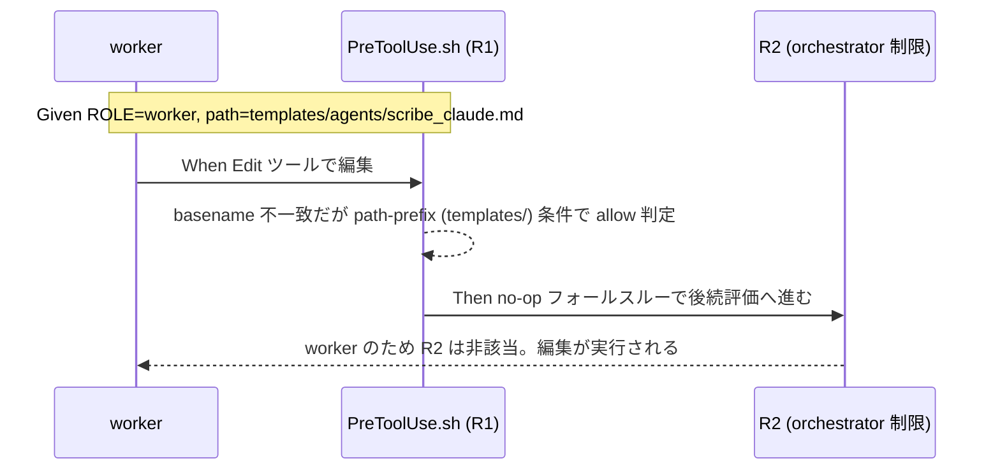

# 要件定義書: テンプレート群が runtime/ 名前空間に同居している

**プロジェクト名**: テンプレート群が runtime/ 名前空間に同居している
**作成日**: 2026 年 07 月 15 日
**最終更新**: 2026 年 07 月 15 日

> **重要**: **このドキュメントは常に更新**: 要件の変更や追加があった場合は、即座にこのドキュメントを更新してください。ドキュメントは「生きているドキュメント」として扱い、実装内容と常に同期させます。
>
> **用語**: [.agent-skill-chain/source/CONCEPTS.md §用語規約](../../../../../../../.agent-skill-chain/source/CONCEPTS.md#用語規約) を参照。

---

## 1. 概要

### 1.1 システム概要

`.agent-skill-chain/runtime/` は「消費者ランタイムの生成物（issue フォルダ・workflow.db・memo 等）＝非追跡・無視」という名前空間規約を持つディレクトリである。その直下に、配布物（追跡対象）である `.agent-skill-chain/runtime/templates/` が例外として同居している。

`PreToolUse.sh` の R1（`.agent-skill-chain/runtime/` 配下への Edit/Write 禁止）は、直近の是正（PR #92, commit 1e819dd, 別 issue `20260715_095026`）により `ALLOWED_DOC_BASENAMES` という **basename allowlist 方式**へ変更済みである。allowlist は issue ドキュメント名（`00_要求定義.md`〜`99_PR_review.md` の 10 種）のみを対象とし、`/memo/` 配下でなければ no-op フォールスルーで allow する。

`.agent-skill-chain/runtime/templates/` 配下には、この allowlist と偶然 basename が一致する最上位 10 ファイル（`00_要求定義.md` 等の issue ドキュメント雛形）に加えて、basename が一致しない約 40 ファイル（`agents/scribe_claude.md`、`docs/**/README.md`、`github/scripts/subagent-guard.sh`、`指摘対応/00_README.md` 等）が存在する（実測: `find .agent-skill-chain/runtime/templates -type f` で確認、evidence_source=observed_runtime）。basename が一致しない側のファイルは、現行 R1 の下では Edit/Write ツールでの直接編集が引き続き block され、Bash（heredoc/cp 等）経由の編集を強いられる。

本 issue の要件は、この「配布物であるにもかかわらず、ファイルによって編集手段が異なる（一部は Edit/Write 可、大半は Bash 限定）」という非一貫性を解消する制約・受け入れ基準を、後続の設計フェーズが採用しうる 2 つの解決方向性（(a) allowlist 拡張 / (b) 名前空間外への再配置）の両方について定義することである。**どちらを採用するかの判断は本ドキュメントのスコープ外とし、次フェーズ（design-feature）の ADR に委ねる。**

### 1.2 用語集

| 用語 | 説明 |
| --- | --- |
| R1 | `PreToolUse.sh` 内の、`.agent-skill-chain/runtime/` 配下への Edit/Write を全 ROLE 一律で禁止するガード（現行は basename allowlist による carve-out 付き）。 |
| carve-out | R1 の禁止から特定条件（basename 一致等）を満たすファイルのみを除外し、allow する仕組み。 |
| no-op フォールスルー | carve-out 判定を `allow()`（`exit 0` 早期終了）ではなく、判定をスキップしてスクリプトの後続処理（R2 等）へそのまま進める実装方式。orchestrator 制限（R2）を迂回させないための必須の実装制約（DESIGN.md 記載）。 |
| ALLOWED_DOC_BASENAMES | 現行 R1 carve-out が参照する、issue ドキュメント名の固定リスト（`00_要求定義.md`〜`99_PR_review.md` 等 10 種）。 |
| 名前空間規約 | `.agent-skill-chain/runtime/` ＝消費者ランタイム生成物・非追跡（無視）という、リポジトリ構成上の取り決め。 |
| 配布物 | npm 等のパッケージとして配布され、消費者プロジェクトにコピーされる追跡対象ファイル（`.agent-skill-chain/source/` および `.agent-skill-chain/runtime/templates/`）。 |

---

## 2. 機能要件

### 2.1 ユーザーストーリー

#### ストーリー 1: テンプレート編集手段の一貫性

- **As a** テンプレート（配布物）を保守するサブエージェント（worker）
- **I want to** `.agent-skill-chain/runtime/templates/` 配下の任意のファイルを、basename によらず一貫した手段（Edit/Write ツール、または明文化された代替手段）で編集したい
- **So that** ファイルごとに「Edit/Write で編集できるか Bash 限定か」を都度判定する必要がなくなり、配布物の保守が直感的に行える

**受け入れ基準**:

- `.agent-skill-chain/runtime/templates/` 配下の全ファイル（最上位の issue ドキュメント雛形 10 種、および `agents/`・`docs/`・`github/`・`指摘対応/` 配下のネストしたファイル群）について、編集手段が単一の規約から説明できること。
- R1 が本来保護すべき対象（`memo/` 配下の timestamp 整合性、`workflow.db*` の書込整合性）は、解決方向性の採否に関わらず引き続き Edit/Write から保護され続けること（保護範囲を広げない）。
- 解決方向性として、少なくとも (a) allowlist 拡張方式、(b) templates/ の名前空間外への再配置方式、の 2 案を検討し、それぞれの制約・トレードオフが本ドキュメント §5 に整理されていること。

#### ストーリー 2: 名前空間規約の一貫性

- **As a** 本フレームワークの新規貢献者・保守者
- **I want to** `.agent-skill-chain/runtime/` の名前空間規約（＝消費者生成物・非追跡）と `templates/` の位置づけが矛盾しない状態で理解したい
- **So that** 「なぜ templates だけ追跡されるのか」という例外説明を都度参照しなくても、ディレクトリ構成から自明に理解できる

**受け入れ基準**:

- `.agent-skill-chain/runtime/` 直下の構成（`templates/`・`.gitignore`・消費者生成物）について、例外の理由（allowlist 拡張で説明する場合）または例外自体の解消（再配置で説明する場合）のいずれかが、設計ドキュメントまたはコードコメントに明記されること。

### 2.2 BDD ユースケース

#### ユースケース 1: テンプレートファイルの直接編集

**シナリオ 1: basename が allowlist に無いテンプレートファイルの編集**

```gherkin
Feature: テンプレート配下ファイルの編集手段一貫性
  Scenario: worker が templates/agents/scribe_claude.md を Edit ツールで編集する
    Given PreToolUse hook が有効で ROLE=worker（または IS_SUBAGENT=1）である
    And 対象パスが .agent-skill-chain/runtime/templates/agents/scribe_claude.md である（basename は現行 ALLOWED_DOC_BASENAMES に非該当）
    When Edit ツールで当該ファイルを編集する
    Then 採用された解決方向性に従い、Edit/Write が意図通りに扱われる（(a) 採用時: path-prefix 条件を満たす carve-out により no-op フォールスルーで allow。(b) 採用時: templates/ が runtime/ 外にあるため R1 の runtime/ 判定自体に該当せず通常の Edit/Write 経路になる）
    And いずれの場合も、R1 の後続評価（R2 の orchestrator 制限等）は迂回されない
```

**処理フロー**（(a) 案採用時の例）:



**シナリオ 2: R1 本来の保護対象への影響が無いことの確認**

```gherkin
Feature: テンプレート配下ファイルの編集手段一貫性
  Scenario: memo/ ・ workflow.db* への直接編集は引き続き block される
    Given PreToolUse hook が有効である
    And 対象パスが .agent-skill-chain/runtime/{issue}/memo/20260101_000000_x.md、または .agent-skill-chain/runtime/{issue}/workflow.db である
    When Edit または Write ツールで当該ファイルを編集する
    Then R1 により block される（本 issue の対応の前後で変化しない）
```

#### ユースケース 2: 名前空間規約の一貫性確認

**シナリオ 1: 新規貢献者がディレクトリ構成から編集手段を理解できる**

```gherkin
Feature: 名前空間規約の一貫性
  Scenario: 新規貢献者が .agent-skill-chain/runtime/ 配下の構成を確認する
    Given .agent-skill-chain/runtime/.gitignore、.agent-skill-chain/runtime/templates/ が存在する
    When 名前空間規約（"runtime/=消費者ランタイム生成物・無視"）と templates/ の追跡状態を照合する
    Then 例外の理由（(a) 案時）または例外の非存在（(b) 案時）のいずれかが明文化されており、矛盾として認識されない
```

### 2.3 ビジネスルール

- R1 の保護対象（`memo/` 配下の timestamp 整合性、`workflow.db*` の書込整合性）は現状維持とし、保護範囲を広げない（DESIGN.md 記載の既存 ADR を変更しない）。
- 新規 carve-out（(a) 案採用時）は、既存の `.gitignore` 例外・`ALLOWED_DOC_BASENAMES` carve-out と同じ **no-op フォールスルー**方式を踏襲し、R2（orchestrator 制限）の評価を迂回させない。
- basename のみの一致条件は、`templates/` 配下に `README.md`・`00_README.md` のような汎用的な basename が含まれるため、単独では `.agent-skill-chain/runtime/` 配下の他ディレクトリ（issue フォルダ等）にある同名ファイルにも意図せず allow 範囲が広がるリスクがある。(a) 案を採る場合は、basename 一致に加えて **path-prefix（`.agent-skill-chain/runtime/templates/` 配下であること）** を必須条件とする。
- (a) 案採用時、既存の symlink/hardlink 実体すり替え耐性（CodeRabbit PR#92 指摘対応で ALLOWED_DOC_BASENAMES carve-out に実装済み）を新規 carve-out にも適用するか否かは、設計フェーズで判断する（本要件では「検討すること」を制約として課すに留める）。
- (b) 案採用時、配布パッケージ内で `.agent-skill-chain/runtime/templates` を参照している既存箇所（実測: `.agent-skill-chain/source/` 配下 19 ファイル・83 箇所、grep `runtime/templates` による, evidence_source=observed_runtime）を漏れなく更新する。

---

## 3. 非機能要件

### 3.1 パフォーマンス要件

- 該当なし（hook のシェル判定コスト増分は無視できる規模。既存 R1 実装と同水準の O(allowlist件数) のループ判定を許容する）。

### 3.2 セキュリティ要件

- (a) 案採用時、新規 carve-out にも既存の symlink/hardlink 実体すり替え耐性の要否を検討し、防御が必要と判断される場合は同水準の対策を適用すること（§2.3 参照）。
- いずれの案でも、R1 が全 ROLE 一律で `memo/` 配下・`workflow.db*` を保護する既存方針（IS_SUBAGENT の値に関わらず block）を弱めないこと。

### 3.3 ユーザビリティ要件

- `.agent-skill-chain/runtime/templates/` 配下ファイルの編集を試みたエージェントが、block された場合に「なぜ block されたか」「どうすれば編集できるか」を既存の block メッセージまたはコメントから理解できること（既存 R1 の block メッセージ形式を踏襲）。

### 3.4 可用性要件

- 該当なし。

---

## 4. 外部インターフェース要件

### 4.1 API 要件

- `PreToolUse.sh` の R1 が参照する環境変数インターフェース（`TOOL`・`PATH_TARGET`・`ROLE`・`IS_SUBAGENT`）を変更しないこと。
- (b) 案採用時、消費者ランタイム側が参照するテンプレートパス（`.agent-skill-chain/runtime/templates/` 相当）の新しい参照先を、命令書・スクリプトから解決可能な形で提供すること。

### 4.2 データ形式要件

- 該当なし。

---

## 5. 制約事項

**(a) allowlist 拡張方式の制約**:

- basename のみのマッチでは汎用 basename（`README.md` 等）が repo 全体で誤って allow 範囲を広げるリスクがあるため、path-prefix 条件（`.agent-skill-chain/runtime/templates/` 配下限定）を必須とする（§2.3）。
- 既存の `ALLOWED_DOC_BASENAMES` carve-out（basename 一致・no-op フォールスルー）とロジックが類似するため、コードの重複をどう共通化するか（関数化等）は設計フェーズ（02_設計）の判断に委ねる。
- symlink/hardlink 実体すり替え耐性の要否の判断を設計フェーズに委ねる（§2.3・§3.2）。

**(b) templates/ 再配置方式の制約**:

- 元の要求定義（00_要求定義.md §7.1）に記載の通り、配置変更は「配布パッケージ（npm 等）の構成・参照パスとの互換性」を壊しうる**破壊的変更**であり、コストが高い（既存参照 19 ファイル・83 箇所の更新が必要、§2.3）。
- 消費者ランタイム側で既に `.agent-skill-chain/runtime/templates/` を前提にした運用（例: `.gitignore` パターン、既存プロジェクトへの配備済みファイル）が存在する場合、移行期間・後方互換のための仕組み（例: 旧パスへのシンボリックリンクや移行案内）が必要になる可能性がある。この要否・方式は設計フェーズで判断する。
- バージョニング・CHANGELOG での破壊的変更の告知が必要になる可能性がある（判断は設計フェーズに委ねる）。

**両案共通の制約**:

- R1 の「全 ROLE 一律・保護対象は `memo/` 配下と `workflow.db*` のみ」という既存の設計方針（DESIGN.md 記載の ADR-1/ADR-3 相当・enforcement/DESIGN.md 55 行目付近）を変更しないこと。
- 既存の消費者ランタイムからのテンプレート参照パスを破壊しないこと（00_要求定義.md §3.3 を踏襲）。
- (a)/(b) いずれを採用するかの判断自体は本要件定義のスコープ外とし、次フェーズ（design-feature）の ADR（.agent-skill-chain/project/自己拡張ワークフロー.md §EVIDENCE_POLICY.md 節2 の ADR 記録形式に従う）に委ねる。

---

## 6. 参考資料

### プロジェクトドキュメント

- [`00_要求定義.md`](./00_要求定義.md) - 要求定義

### その他の参考資料

- `.agent-skill-chain/source/enforcement/claude/PreToolUse.sh`（R1 実装、312〜367 行目付近）
- `.agent-skill-chain/source/enforcement/DESIGN.md`（R1 の carve-out 設計判断・ADR 相当記述、51〜58 行目付近）
- `.agent-skill-chain/source/spec/02_ディレクトリ構造方針.md`（ディレクトリ構造方針）
- `.agent-skill-chain/runtime/.gitignore`（`workflow.db*` を無視する既存の名前空間規約）
- `.agent-skill-chain/runtime/templates/`（配布物であるテンプレート一式。最上位 10 ファイルと `agents/`・`docs/`・`github/`・`指摘対応/` のネストしたファイル群で編集手段が現状異なる）
- 完了済み関連 issue: `docs/maintainer/workflow/20260715_095026_R1runtime直接編集禁止のBash強制がAutoModeBypass分類器と衝突`（PR #92, commit 1e819dd。R1 を basename allowlist 方式へ是正した先行対応。templates/ 配下は対象外だった）

---

## 7. 前のステップ

この要件定義書は、以下のドキュメントを基に作成されています：

- **前**: [`00_要求定義.md`](./00_要求定義.md) - 要求定義フェーズ

---

## 8. 次のステップ

この要件定義書の承認後、以下のドキュメントを作成します：

- **次**: [`02_設計.md`](./02_設計.md) - 設計フェーズ（(a)/(b) の採否を含む ADR を記載）
