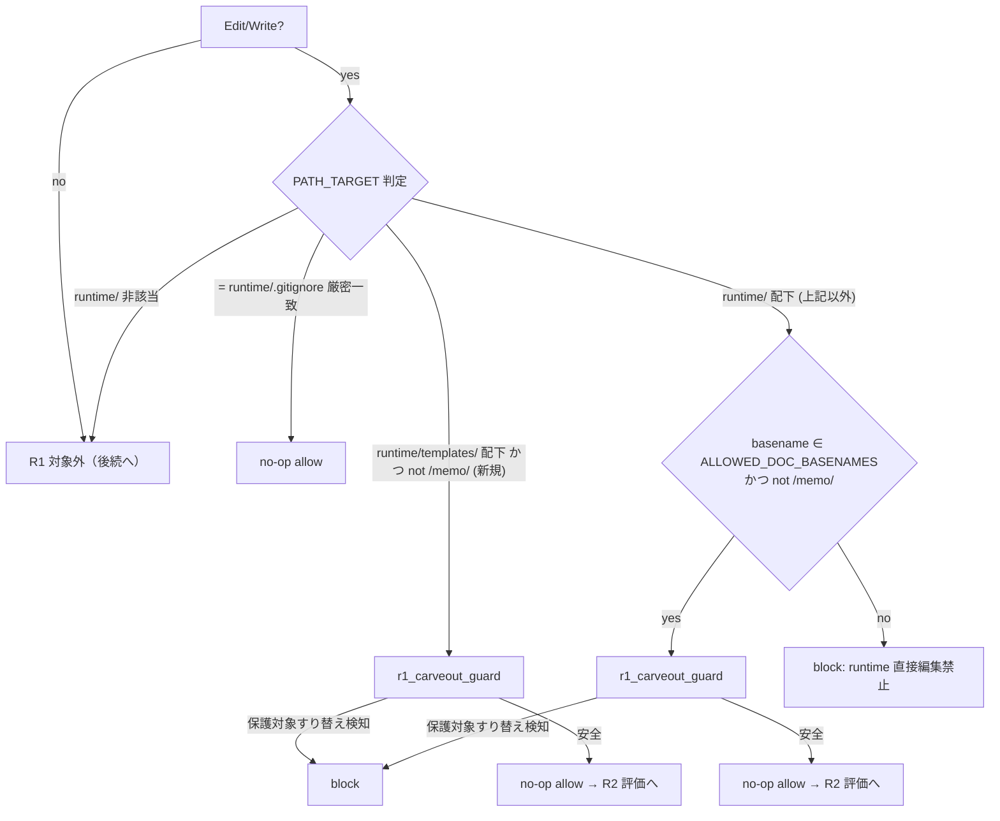
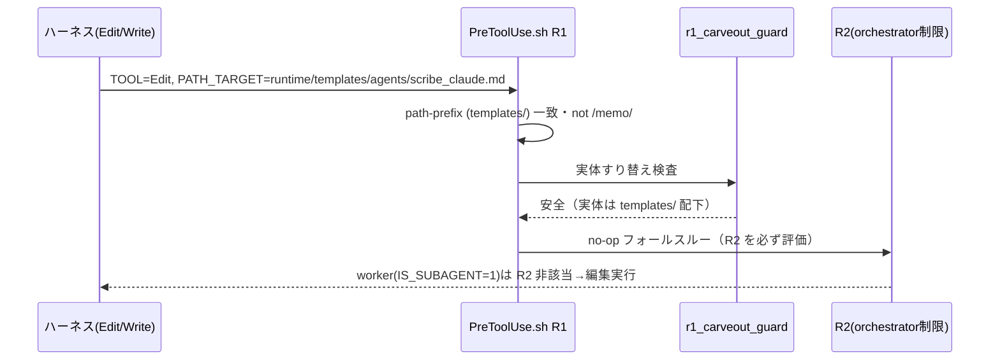
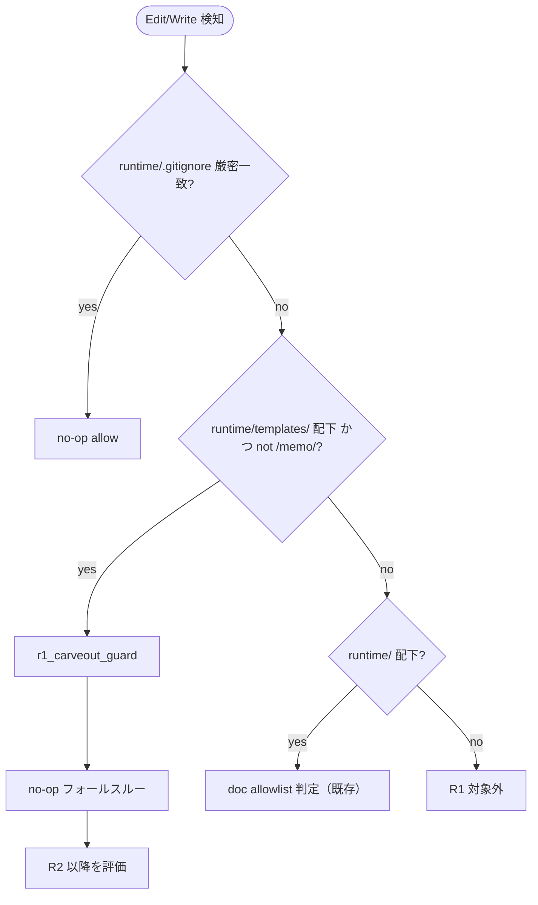

# 設計書: テンプレート群が runtime/ 名前空間に同居している

**プロジェクト名**: テンプレート群が runtime/ 名前空間に同居している
**作成日**: 2026 年 07 月 15 日
**最終更新**: 2026 年 07 月 15 日

> **重要**: **このドキュメントは常に更新**: 設計の変更や追加があった場合は、即座にこのドキュメントを更新してください。ドキュメントは「生きているドキュメント」として扱い、実装内容と常に同期させます。
>
> **用語**: [.agent-skill-chain/source/CONCEPTS.md §用語規約](../../../../../../../.agent-skill-chain/source/CONCEPTS.md#用語規約) を参照。

---

## 1. 設計概要

### 1.1 設計方針

`.agent-skill-chain/source/enforcement/claude/PreToolUse.sh` の R1（`.agent-skill-chain/runtime/` 配下への Edit/Write 禁止ガード）に、`.agent-skill-chain/runtime/templates/`（配布物）配下を対象とする **path-prefix ベースの carve-out** を新設し、templates 配下 52 ファイル全体を basename によらず一貫して Edit/Write 可能にする。既存の設計方針（R1 は全 ROLE 一律・保護対象は `memo/` と `workflow.db*` のみ）と実装方式（no-op フォールスルー・symlink/hardlink 実体すり替え耐性）は変更せず、それらを再利用する追加の洗練として実装する。

### 1.2 設計原則（本プロジェクトで適用するもの）

- **単一責務**: R1 の carve-out 群（`.gitignore` 例外・doc allowlist 例外・templates 例外）はいずれも「特定条件で R1 の block を no-op で免除する」責務に閉じる。symlink/hardlink 実体検査という共通の副責務は 1 つのヘルパ関数へ抽出し、各 carve-out 分岐は「一致条件の判定」のみを担う。
- **AIフレンドリー設計**: 「テンプレートは basename によらず Edit/Write できる」という単一規約に収れんさせ、ファイルごとに編集手段を判定する必要をなくす（[01_設計原則 §AIフレンドリー設計](../../../../../../../.agent-skill-chain/source/spec/01_設計原則.md#aiフレンドリー設計) の「意図が分かる命名・明確な責務」）。
- **CQRS（Query 側）**: R1 の判定はファイルシステムを変更しない Query（allow/block の判定）であり、副作用を持たない。この性質を carve-out 追加でも維持する（判定内で Write/Edit を行わない）。

---

## 2. アーキテクチャ設計

### 2.1 責務・境界・参照関係

#### 2.1.1 責務一覧

| コンポーネント | 責務（1 文） |
| --- | --- |
| R1（Edit/Write path guard） | `.agent-skill-chain/runtime/` 配下への直接 Edit/Write を全 ROLE 一律で block する（保護対象を絞った carve-out 群を伴う）。 |
| `.gitignore` 厳密一致 carve-out（既存） | 対象が厳密に `runtime/.gitignore` の場合のみ no-op で allow する。 |
| doc allowlist carve-out（既存） | basename が `ALLOWED_DOC_BASENAMES` に一致し `/memo/` を含まない場合に no-op で allow する。 |
| **templates carve-out（新規）** | 対象が `.agent-skill-chain/runtime/templates/` 配下（path-prefix）で `/memo/` を含まない場合に no-op で allow する。 |
| **`r1_carveout_guard`（新規・共通ヘルパ）** | carve-out 一致後に、対象の実体パスを解決し保護対象（`/memo/`・`workflow.db*`）へのすり替え（symlink/hardlink）を検知して block する。安全なら return（呼び出し側で no-op フォールスルー）。 |

#### 2.1.2 境界

- **入力**: R1 が確定済みの環境変数 `TOOL`（Edit/Write）・`PATH_TARGET`（対象パス。相対・絶対の両表記あり）。`parse_input` が確定する。
- **出力**: block（`exit 2`）または no-op フォールスルー（後続 R2 以降の評価へ進む）。carve-out は `allow()`（`exit 0` 早期終了）を使わない。
- **他責務との境界**: 変更範囲は `PreToolUse.sh` の **R1 ブロックと新規ヘルパ関数の定義のみ**。`parse_input`・ROLE/nonce 判定・R2〜R6・`is_in_project_allowlist`・`json_get` 等は一切変更しない。`ALLOWED_DOC_BASENAMES` の文字列リストも変更しない。templates/ の**配置は変更しない**（(b) 再配置案は本設計で不採用・ADR-1）。付随してドキュメント（`enforcement/DESIGN.md`・R1 のコードコメント）へ templates carve-out の理由を明文化する。

#### 2.1.3 参照関係

- R1 templates 分岐 → `r1_carveout_guard` → `r1_norm_path`（symlink 実体解決）／`r1_has_extra_hardlink`（nlink 検査）／`block`。
- R1 doc allowlist 分岐 → `r1_carveout_guard`（同一ヘルパ・リファクタで共通化）。
- 循環参照なし。ヘルパは既存の下位関数（`r1_norm_path`・`r1_has_extra_hardlink`・`block`）にのみ依存する。

### 2.2 システムアーキテクチャ

- **採用パターン**: 既存の「carve-out 群 + no-op フォールスルー + 共通実体検査」パイプライン（ガード・チェーン）への分岐追加。新規アーキテクチャは導入しない。
- **根拠**: [06_設計判断の優先順位.md](../../../../../../../.agent-skill-chain/source/spec/06_設計判断の優先順位.md) の「短期的な実装容易性より長期的な可読性」「再利用性より責務の明確さ」に従い、既存機構（審査済み・テスト済み）を最小差分で拡張する。enforcement 中核ファイルの破壊的改変を避け、局所的な追加に留める。

#### 2.2.1 CQRS（Command/Query 分離）

- **Command**: なし（R1 判定はファイルを変更しない）。
- **Query**: R1 carve-out 判定（allow/block を返すのみ・副作用なし）。`r1_carveout_guard` も読み取り（`realpath`・`stat`）のみで対象を変更しない。

#### 2.2.2 アーキテクチャ図

### 2.3 コンポーネント構成

`PreToolUse.sh` 内に閉じる。境界は上記 §2.1.2 のとおり R1 ブロック＋新規ヘルパのみ。`r1_carveout_guard` は既存の `r1_norm_path`・`r1_has_extra_hardlink` と同じヘルパ層に定義し、R1 ブロック本体はその呼び出しに徹する（判定と実体検査の責務分離）。

### 2.4 データフロー

R1 は「起きた事実」を発行するイベント駆動ではなく、ツール実行前の同期的な allow/block 判定である。イベント発行は行わない。

### 2.5 横断設計判断（ADR）

#### ADR-1: 解決方向性は (a) allowlist（carve-out）拡張を採用し、(b) 名前空間外再配置は不採用とする

- **コンテキスト**: `.agent-skill-chain/runtime/templates/` 配下 52 ファイル（実測 `find`）のうち、basename が `ALLOWED_DOC_BASENAMES` に一致する最上位 10 ファイルのみ現行 R1 で Edit/Write 可、残り 42 ファイル（`AGENTS_MERMAID_RULES.md`・`agents/scribe_claude.md`・`docs/**/README.md`・`github/scripts/subagent-guard.sh`・`指摘対応/00_README.md` 等）は block され Bash 経由編集を強いられる。この編集手段の非一貫性を解消する（01_要件定義 ストーリー1/2）。
- **検討した選択肢**:
  - **(a) allowlist（carve-out）拡張**: R1 に templates/ path-prefix carve-out を追加。変更は `PreToolUse.sh` に局所化。
  - **(b) templates/ を runtime/ 名前空間の外へ再配置**: 名前空間の概念的矛盾自体を解消するが破壊的変更。
- **決定**: **(a) を採用**する。
- **根拠**（evidence_source=observed_runtime）:
  - (b) の変更波及を実測した。`.agent-skill-chain/source/` 配下だけで **19 ファイル・83 箇所**が `runtime/templates` を参照（`grep -rl` / `grep -ro`）。さらにリポジトリ全体では **101 ファイル**（実測 `grep -rl runtime/templates`・実測時点値／並行 issue の追加で増える volatile な指標）が参照する。大半は `docs/maintainer/workflow/` 配下の履歴 issue ドキュメントの散文言及で再配置時の更新は不要だが、**実際に更新を要する非散文の資産**（`.agent-skill-chain/project/` 3 件、`.agent-skill-chain/source/` 配下の `RULES.md`・`SETUP.md`・`LOAD_POLICY.md` 等の規約・スクリプト群、`README.md`・`CONTRIBUTING.md`、`package.json`、`src/agents-md.ts`、`test/` 3 件、`.gitignore`、テンプレート自身）だけでも数十ファイルに及ぶ。setup.sh・`lib/package-manifest.sh`・`verify-npm-pack.sh`・`audit.sh` 等の**配布・検証・CI 経路**にまで及び、後方互換（旧パスの symlink/移行案内）・CHANGELOG での破壊的変更告知・npm `files` allowlist・`.gitignore` パターンの同時是正が必要になる（01_要件定義 §5(b)・§2.3）。コスト・回帰リスクが (a) に比して桁違いに大きい。
  - (a) は `PreToolUse.sh` 1 ファイルへの分岐追加のみで、既存の no-op フォールスルー方式・symlink/hardlink 耐性の実装資産をそのまま再利用できる（後述 ADR-2〜4）。R1 の既存設計方針（全 ROLE 一律・保護対象 `memo`/`workflow.db*` のみ）を一切変更しない。
  - 要件充足性: 01_要件定義 ストーリー2 の受け入れ基準は「例外の理由（allowlist 拡張で説明する場合）**または**例外自体の解消（再配置で説明する場合）」のいずれかを許容している。(a) は前者（例外理由の明文化）で受け入れ基準を満たす。ストーリー1 の「編集手段が単一の規約から説明できる」も (a) で完全充足する。
- **帰結**: `PreToolUse.sh` R1 に templates carve-out を追加。`enforcement/DESIGN.md` の R1 節と R1 コードコメントに「templates/ が runtime/ 配下に残る理由＝配布物であり追跡対象、ただし memo/workflow.db* とは異なり保護不要のため carve-out で編集手段を統一する」旨を明文化する。templates/ の物理配置は変更しない。42 ファイルが新たに Edit/Write 可能になる。

#### ADR-2: carve-out 条件は basename 追加ではなく path-prefix（`runtime/templates/` 配下限定）とする

- **コンテキスト**: templates/ には `README.md`（20 件超・`docs/**` 配下）・`00_README.md`（`指摘対応/` 配下）等の**汎用 basename** が含まれる（実測）。これらを `ALLOWED_DOC_BASENAMES` に追加する basename 方式だと、`.agent-skill-chain/runtime/` 配下の**他ディレクトリ**（消費者の issue フォルダ等）にある同名ファイルにも allow 範囲が意図せず広がる。
- **検討した選択肢**: (i) `ALLOWED_DOC_BASENAMES` に templates 内 basename を追加、(ii) path-prefix 条件（対象パスが `.agent-skill-chain/runtime/templates/` を含む）で判定。
- **決定**: **(ii) path-prefix** を採用。`ALLOWED_DOC_BASENAMES` リストは変更しない。
- **根拠**（evidence_source=existing_code / observed_runtime）: templates/ 配下に `README.md` が多数・`00_README.md` が存在することを `find` で実測。01_要件定義 §2.3 のビジネスルール（「basename のみの一致条件は allow 範囲を過剰に広げるため path-prefix を必須とする」）に一致。path-prefix は「templates/ という配布物ディレクトリ配下」という配置事実で判定するため、他 issue フォルダへ波及しない。
- **帰結**: templates 分岐の一致条件は「`PATH_TARGET` が `.agent-skill-chain/runtime/templates/` を含む（相対・絶対の両表記）AND `PATH_TARGET` が `*/memo/*` を含まない」。前方一致の緩さ（`runtime/templates-evil/` 等）を避けるため、`templates/`（末尾スラッシュ付き）でマッチさせ、`templates` に続く別名ディレクトリを誤許可しない。

#### ADR-3: symlink/hardlink 実体すり替え耐性を templates carve-out にも適用し、実体検査ロジックを共通ヘルパへ抽出する

- **コンテキスト**: 既存 doc carve-out は、doc 名の symlink が実体として `memo/` 配下や `workflow.db*` を指す事故（善意の Edit/Write による保護対象破壊）を防ぐため、basename 一致後に `r1_norm_path` で実体解決し `r1_has_extra_hardlink` で nlink を検査している。templates carve-out にこの耐性を付けるか、また既存 doc 分岐とのロジック重複をどう扱うかを決める必要がある。
- **検討した選択肢**: (i) templates carve-out には耐性を付けない、(ii) 耐性を付け、かつ実体検査を共通ヘルパ関数へ抽出して両分岐で共有、(iii) 耐性を付けるが各分岐にインライン重複させる。
- **決定**: **(ii)** を採用。新規ヘルパ `r1_carveout_guard(path)` を導入し、doc 分岐のインライン 4 分岐（unresolved symlink／保護パス解決／hardlink／安全）を同ヘルパ呼び出しへ置換（振る舞い不変のリファクタ）し、templates 分岐も同ヘルパを呼ぶ。
- **根拠**（evidence_source=existing_code）: R1 の保護目的（memo タイムスタンプ整合性・workflow.db 書込整合性）は `enforcement/DESIGN.md` 57 行の既存判断どおり「事前に仕込まれた symlink 経由の書換からも守られるべき」。templates 配下に置かれた doc 名 symlink が `../{issue}/memo/x.md` や `../workflow.db` を指すケースも同じ事故防止対象であり、耐性を付けない (i) は保護に穴を残す。既存関数 `r1_norm_path`・`r1_has_extra_hardlink` はそのまま再利用可能で、共通化は spec [01_設計原則 §単一責務](../../../../../../../.agent-skill-chain/source/spec/01_設計原則.md)・[06 §可読性](../../../../../../../.agent-skill-chain/source/spec/06_設計判断の優先順位.md)（「query に副作用を書かない」「再利用より責務の明確さ」）に沿う。インライン重複 (iii) は同一検査が 2 箇所に散り保守負債になる。
- **帰結**: 実体検査は 1 箇所（`r1_carveout_guard`）に集約。doc 分岐は振る舞いを変えずに関数呼び出しへ簡素化（既存 UC14 テストが回帰ガードになる）。templates 分岐も同じ耐性を得る。将来 carve-out を追加する際も同ヘルパを再利用できる。

#### ADR-4: templates carve-out にも `/memo/` 除外を課す（保護範囲を広げないための防御的整合）

- **コンテキスト**: path-prefix だけだと、消費者が万一 issue を `templates` という名で作成した場合や将来 templates/ に `memo/` パスが生じた場合に、`runtime/templates/.../memo/...` が carve-out で allow され保護に理論的な穴が生じうる。
- **検討した選択肢**: (i) path-prefix のみ、(ii) path-prefix かつ `not */memo/*`。
- **決定**: **(ii)**。templates 分岐の条件に `PATH_TARGET != */memo/*` を課し、`/memo/` を含む場合はこの分岐に入れず後続の汎用 runtime 分岐（basename allowlist）へ流して block させる。
- **根拠**（evidence_source=existing_code + inference_only）: doc 分岐の既存 `&& [[ "$PATH_TARGET" != *"/memo/"* ]]` と対称の防御であり、01_要件定義 §2.3/§3.2 の「保護範囲を広げない」を厳密に満たす。エッジ自体は理論的（現行 templates/ に `memo/` パスは実在しない＝`find` で確認）だが、防御を厚くする方向であり RULES §高リスク操作に非該当のため**要注意（非ブロッキング）**扱いで自走継続してよい（EVIDENCE_POLICY.md 節4）。
- **帰結**: templates+memo の理論的エッジも block され、R1 の保護対象は本 issue 対応の前後で不変となる。

---

## 3. 機能設計

### 3.1 機能 1: templates carve-out（R1 分岐追加）

#### 3.1.1 概要

`runtime/templates/` 配下（`/memo/` を除く）への Edit/Write を、`r1_carveout_guard` による実体検査を通過した場合に no-op フォールスルーで allow する。

#### 3.1.2 処理フロー

#### 3.1.3 入力・出力

- **入力**: `TOOL`（Edit/Write）・`PATH_TARGET`。
- **出力**: block（`exit 2`）または no-op フォールスルー。

#### 3.1.4 エラーハンドリング

`r1_norm_path`／`stat` 不在などで実体解決不能な symlink は安全側で block（既存挙動を踏襲）。実ファイル非存在（Write 新規作成）は `realpath -m` の欠損許容で扱い、symlink でなければ allow。

### 3.2 機能 2: `r1_carveout_guard` 共通ヘルパ + doc 分岐リファクタ

#### 3.2.1 概要

carve-out 一致後の symlink/hardlink 実体検査を 1 関数に集約し、doc 分岐・templates 分岐の双方から呼ぶ。doc 分岐は振る舞いを変えずに置換する。

#### 3.2.2 入力・出力

- **入力**: `path`（carve-out 一致済みの対象パス）。
- **出力**: 保護対象すり替え検知時は `block`（`exit 2`）。安全時は return 0（呼び出し側で no-op フォールスルー）。

---

## 6. テスト戦略

テスト観点の定義は [RULES.md §テスト戦略必須要件](../../../../../../../.agent-skill-chain/source/RULES.md#テスト戦略必須要件)、BDD 形式は [TEST_BDD_FORMAT.md](../../../../../../../.agent-skill-chain/source/TEST_BDD_FORMAT.md) を参照。本 issue は enforcement 中核（`PreToolUse.sh`）のシェルガードであり、単体（`test/test-pretooluse-hook.sh`）を主担保とし、実バイナリ（realpath/stat/ln）を用いた実体すり替え検査は隔離ディレクトリの実測で担う。

### 6.1 対象ごとのテスト割り当て

| 対象 | 単体 | 結合/API | E2E | クリティカル観点 | バリデーション観点 | 未達理由/補足 |
| --- | --- | --- | --- | --- | --- | --- |
| templates carve-out（R1 分岐） | ○ | × | △ | 42 非 doc ファイルが allow・R2 独立性維持・保護対象 block 維持 | path-prefix 誤マッチ防止（`templates-evil/`）・`/memo/` 除外・絶対/相対両表記 | E2E は既存 `e2e-claude-hook.sh` の hook 経路で間接担保。結合は該当なし（単一シェル） |
| `r1_carveout_guard`（共通ヘルパ） | ○ | × | × | symlink→memo/workflow.db* を block・unresolved symlink を block・nlink>1 を block | doc 分岐リファクタ後も既存 UC14 が全 pass（振る舞い不変） | — |

### 6.2 監査・レビューでの確認（証跡）

本設計 §6.1 の割当と 03_実装計画 のタスク別テスト観点・BDD が対応していること、01_要件定義 の BDD（UC1 シナリオ1/2・UC2）と 03 のテストケースが対応していることをレビューで確認する。

---

## 10. 参考資料

### プロジェクトドキュメント

- [`01_要件定義.md`](./01_要件定義.md) - 要件定義
- [`00_要求定義.md`](./00_要求定義.md) - 要求定義

### その他の参考資料

- `.agent-skill-chain/source/enforcement/claude/PreToolUse.sh`（R1 実装 312〜367 行・`r1_norm_path` 182〜192 行・`r1_has_extra_hardlink` 208〜215 行）
- `.agent-skill-chain/source/enforcement/DESIGN.md`（R1 carve-out の既存 ADR・51〜58 行）
- `test/test-pretooluse-hook.sh`（UC13＝doc carve-out・UC14＝symlink/hardlink 耐性。本 issue で UC15 を新設）
- 実測: `find .agent-skill-chain/runtime/templates -type f`＝52 ファイル、`grep -rl runtime/templates .agent-skill-chain/source/`＝19 ファイル・83 箇所（load-bearing な実測）、リポジトリ全体（`grep -rl runtime/templates`）＝101 ファイル（大半は `docs/**` の履歴 issue ドキュメントの散文言及。再配置で実更新を要する非散文資産は数十件。volatile・実測時点値）

---

## 11. 前のステップ

- **前**: [`01_要件定義.md`](./01_要件定義.md) - 要件定義フェーズ

---

## 12. 次のステップ

- **次**: [`03_実装計画.md`](./03_実装計画.md) - 実装計画フェーズ
