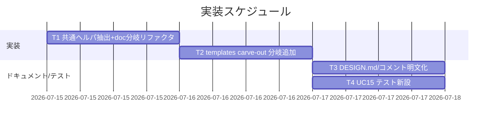

# 実装計画書: テンプレート群が runtime/ 名前空間に同居している

**プロジェクト名**: テンプレート群が runtime/ 名前空間に同居している
**作成日**: 2026 年 07 月 15 日
**最終更新**: 2026 年 07 月 15 日

> **重要**: **このドキュメントは常に更新**: 実装計画の変更・進捗・バグの記録があった場合は即座に更新してください。
> **必須項目**: 「必須」欄は空欄・抽象語のみで提出しないこと。テスト観点・BDD は具体ケースを 1 件以上記載すること。
>
> **用語**: [.agent-skill-chain/source/CONCEPTS.md §用語規約](../../../../../../../.agent-skill-chain/source/CONCEPTS.md#用語規約) を参照。

---

## 1. 実装概要

### 1.1 実装方針

02_設計 ADR-1〜4 に従い、`.agent-skill-chain/source/enforcement/claude/PreToolUse.sh` の R1 ブロックへ (1) 共通ヘルパ `r1_carveout_guard` の抽出（doc 分岐リファクタ・振る舞い不変）、(2) templates path-prefix carve-out 分岐の追加（`/memo/` 除外・symlink/hardlink 耐性込み）を局所的に行い、(3) `enforcement/DESIGN.md` とコードコメントへ理由を明文化し、(4) `test/test-pretooluse-hook.sh` に UC15 を新設する。R1 の既存方針（全 ROLE 一律・保護対象 `memo`/`workflow.db*` のみ）と no-op フォールスルー方式は変更しない。

### 1.2 実装順序



1. **T1**: `r1_carveout_guard` 抽出 + doc 分岐リファクタ（振る舞い不変・回帰は既存 UC13/UC14 で担保）。
2. **T2**: templates carve-out 分岐追加。
3. **T3**: `DESIGN.md`・R1 コメントの明文化。
4. **T4**: UC15 テスト新設。

---

## 2. タスク分解

**必須**: 各タスクに「テスト観点」（2.x.3）と「単体テスト仕様（BDD）」（2.x.4）を記載する。観点定義は [02_設計 §6](./02_設計.md)・[RULES §テスト戦略](../../../../../../../.agent-skill-chain/source/RULES.md#テスト戦略必須要件)・[TEST_BDD_FORMAT.md](../../../../../../../.agent-skill-chain/source/TEST_BDD_FORMAT.md) を参照。

### 2.1 タスク 1: `r1_carveout_guard` 共通ヘルパ抽出 + doc 分岐リファクタ

#### 2.1.1 概要

carve-out 一致後の symlink/hardlink 実体検査（既存 doc 分岐のインライン 4 分岐）を関数 `r1_carveout_guard(path)` に抽出し、doc 分岐を同関数呼び出しへ置換する（02_設計 ADR-3）。

#### 2.1.2 実装内容

- `r1_norm_path`・`r1_has_extra_hardlink` と同じヘルパ層に `r1_carveout_guard()` を新設。中身は現行 doc 分岐（`PreToolUse.sh` 348〜362 行）の 4 分岐（unresolved symlink→block／実体が `/memo/`・`workflow.db*`→block／`nlink>1`→block／else 安全 return）をそのまま移送する。`block` は関数内から呼んでよい（`exit 2` で終了）。安全時は `return 0`。
- doc 分岐（347〜362 行）の `if R1_DOC_ALLOWED && not /memo/` の内側を `r1_carveout_guard "$PATH_TARGET"` の 1 行呼び出し + 後続 no-op（`:`）へ置換。`else` の `block "direct edit of .agent-skill-chain/runtime/ is forbidden ..."` は不変。
- 振る舞いを変えない純リファクタ（`implementation/refactor-safely` 相当）。

#### 2.1.3 テスト観点

**参照**: 観点定義は [02_設計 §6](./02_設計.md)。以下は本タスクの具体ケース。

##### 単体（必須 1 件以上）

- 既存 UC13（doc carve-out allow / .bak block / R2 独立性 / unknown role / memo2 誤 block 防止）が全 pass（振る舞い不変）。
- 既存 UC14（symlink→workflow.db block・symlink→memo block・hardlink block）が jq/nojq 両経路で全 pass。

##### 結合/API

- 該当なし（単一シェルスクリプト）。

##### E2E/受け入れ

- `test/e2e-claude-hook.sh` の hook 経路が pass（回帰）。

##### バリデーション

- 該当なし。

#### 2.1.4 単体テスト仕様（BDD）

```gherkin
Feature: r1_carveout_guard 抽出後の振る舞い不変
  Scenario: doc 名の symlink が workflow.db を指す
    Given AGENT_ROLE=worker で 00_要求定義.md が ../workflow.db を指す symlink
    When Write ツールで当該パスを編集する
    Then exit 2 で block され "protected path" 理由が出る（UC14 と同一）
```

```bash
# Given: 隔離 runtime に 00_要求定義.md → ../workflow.db の symlink を作成（既存 UC14 と同じ）
ln -sf ../workflow.db "$rt/x/00_要求定義.md"
# When: worker として Write を run_pre で実行
run_pre "$JQ_PATH" worker '{"tool_name":"Write","tool_input":{"file_path":"'"$rt"'/x/00_要求定義.md"}}'
# Then: リファクタ後も exit 2（振る舞い不変）
assert_eq 2 "$RC" "T1: doc 分岐リファクタ後も symlink→workflow.db は block"
```

#### 2.1.5 依存関係

- なし（T2 の前提）。

#### 2.1.6 見積もり

- **工数**: 0.5 日 / **優先度**: 高

### 2.2 タスク 2: templates carve-out 分岐の追加

#### 2.2.1 概要

R1 の `if [[ Edit|Write ]]` チェーンに、`runtime/.gitignore` 厳密一致例外と汎用 `runtime/` 分岐の**間**へ templates carve-out 分岐を挿入する（02_設計 ADR-1/2/4）。

#### 2.2.2 実装内容

- 挿入位置: 現行 336 行（`.gitignore` 厳密一致の `if`）の直後・現行 338 行（`elif runtime/ 配下`）の**前**に `elif` を追加（elif 順で templates を汎用 runtime より先に評価）。
- 条件（ADR-2/4）: `elif { [[ "$PATH_TARGET" =~ \.agent-skill-chain/runtime/templates/ ]] || [[ "$PATH_TARGET" =~ /\.agent-skill-chain/runtime/templates/ ]]; } && [[ "$PATH_TARGET" != *"/memo/"* ]]; then`（相対・絶対両表記に対応。末尾スラッシュ `templates/` で `templates-evil/` を誤マッチさせない）。
- 本体: `r1_carveout_guard "$PATH_TARGET"` を呼び、続けて `:`（no-op フォールスルー）。`allow()` は使わない（R2 独立性の必須制約・DESIGN.md 56 行）。
- `/memo/` を含む templates パスはこの分岐に入らず後続の汎用 `runtime/` 分岐で basename allowlist 判定→非該当なら block（ADR-4）。
- `ALLOWED_DOC_BASENAMES` リストは変更しない。

#### 2.2.3 テスト観点

##### 単体（必須 1 件以上）

- **正常系**: `runtime/templates/agents/scribe_claude.md`・`runtime/templates/github/scripts/subagent-guard.sh`・`runtime/templates/docs/README.md`・`runtime/templates/指摘対応/00_README.md`・`runtime/templates/AGENTS_MERMAID_RULES.md`（いずれも現行 block 対象）を worker で Edit/Write → **exit 0**（allow・42 ファイル代表）。
- **回帰（allow 維持）**: `runtime/templates/02_設計.md`（doc 名かつ templates 配下）→ exit 0。
- **R2 独立性**: `ROLE=orchestrator`・agent_id 無しで `runtime/templates/agents/scribe_claude.md` を Edit → **exit 2**（no-op フォールスルーで R2 が独立発火）。
- **保護維持**: `runtime/x/memo/foo.md`・`runtime/workflow.db` → exit 2（本 issue 前後で不変）。
- **境界値（誤マッチ防止）**: `runtime/templates-evil/x.md`・`runtime/mytemplates/x.md` は templates 分岐に入らず、汎用 runtime 分岐で basename 非該当 → exit 2。
- **境界値（memo 除外）**: `runtime/templates/x/memo/foo.md` → templates 分岐に入らず block（exit 2）。
- **絶対パス**: `/repo/.agent-skill-chain/runtime/templates/github/README.md` → exit 0。

##### 結合/API

- 該当なし。

##### E2E/受け入れ

- `e2e-claude-hook.sh` 経路で templates 非 doc ファイルの編集が block されないこと（間接担保）。未整備なら理由記載: 既存 E2E は hook 起動のみ検証するため UC15 単体で主担保する。

##### バリデーション

- 相対/絶対両表記・`/memo/` 部分文字列誤検知（`memo2/` を誤 block しない）を UC15 で検証。

#### 2.2.4 単体テスト仕様（BDD）

```gherkin
Feature: templates carve-out の編集手段一貫性
  Scenario: basename 非該当の templates ファイルを worker が Edit
    Given AGENT_ROLE=worker で PATH=.agent-skill-chain/runtime/templates/agents/scribe_claude.md
    When Edit ツールで編集する
    Then path-prefix carve-out により exit 0（allow）

  Scenario: orchestrator(main) の templates 編集は R2 で block（no-op フォールスルー独立性）
    Given AGENT_ROLE=orchestrator, agent_id 無し, PATH=.../runtime/templates/agents/scribe_claude.md
    When Edit ツールで編集する
    Then exit 2（R2 が carve-out 後も独立に発火）

  Scenario: templates 配下の memo は引き続き block
    Given PATH=.../runtime/templates/x/memo/foo.md
    When Edit ツールで編集する
    Then exit 2（保護範囲を広げない）
```

```bash
# Given: worker・basename 非該当の templates ファイル
json='{"tool_name":"Edit","tool_input":{"file_path":".agent-skill-chain/runtime/templates/agents/scribe_claude.md"}}'
# When: run_pre で実行
run_pre "$JQ_PATH" worker "$json"
# Then: exit 0（templates carve-out で allow）
assert_eq 0 "$RC" "UC15: templates 非 doc ファイルの Edit は exit 0"

# Given: orchestrator(main・agent_id 無し)が同ファイルを編集
json_o='{"tool_name":"Edit","tool_input":{"file_path":".agent-skill-chain/runtime/templates/agents/scribe_claude.md"}}'
# When: ROLE=orchestrator で実行
run_pre "$JQ_PATH" orchestrator "$json_o"
# Then: exit 2（R2 独立性）
assert_eq 2 "$RC" "UC15: orchestrator の templates Edit は exit 2（R2独立）"

# Given: templates-evil（誤マッチ狙い）
json_e='{"tool_name":"Write","tool_input":{"file_path":".agent-skill-chain/runtime/templates-evil/x.md"}}'
# When: worker で実行
run_pre "$JQ_PATH" worker "$json_e"
# Then: exit 2（末尾スラッシュ判定で templates carve-out に入らない）
assert_eq 2 "$RC" "UC15: templates-evil は carve-out 非対象で block"
```

#### 2.2.5 依存関係

- T1 完了後（`r1_carveout_guard` を利用するため）。

#### 2.2.6 見積もり

- **工数**: 0.5 日 / **優先度**: 高

### 2.3 タスク 3: DESIGN.md・コードコメントの明文化

#### 2.3.1 概要

02_設計 ADR-1 の帰結に従い、templates carve-out の理由（配布物ゆえ追跡対象・memo/workflow.db* とは異なり保護不要のため編集手段を統一）を `enforcement/DESIGN.md` の R1 節と R1 コードコメントに明文化する（01_要件定義 ストーリー2 受け入れ基準）。

#### 2.3.2 実装内容

- `DESIGN.md`「R1 の保護範囲は memo・workflow.db* のみに絞られている」節に、templates carve-out（path-prefix・no-op フォールスルー・共通ヘルパ・R1 既存方針不変）を追記。R1 が全 ROLE 一律・保護対象 memo/workflow.db* のみである既存記述は変更しない。
- `PreToolUse.sh` R1 コメント（312〜333 行付近）に templates carve-out の意図（basename ではなく path-prefix・`/memo/` 除外・`r1_carveout_guard` 共通化）を追記。

#### 2.3.3 テスト観点

##### 単体

- 該当なし（ドキュメント変更）。`grep` で DESIGN.md に "templates" carve-out の記述が存在することを目視/CI 確認。

##### 結合/API・E2E・バリデーション

- 該当なし。

#### 2.3.4 単体テスト仕様（BDD）

```gherkin
Feature: 名前空間規約の一貫性明文化
  Scenario: 新規貢献者が templates 追跡の例外理由を DESIGN.md から理解できる
    Given DESIGN.md の R1 節を読む
    When templates が runtime/ 配下に残る理由を探す
    Then carve-out による例外理由が明記されている
```

（ドキュメント変更のため自動テストコードは設けず、レビューで確認。）

#### 2.3.5 依存関係

- T2 と同時（同一 PR）。

#### 2.3.6 見積もり

- **工数**: 0.25 日 / **優先度**: 中

### 2.4 タスク 4: UC15 テスト新設

#### 2.4.1 概要

`test/test-pretooluse-hook.sh` に UC15（templates carve-out）を新設し、jq/nojq 両経路・隔離ディレクトリでの symlink/hardlink 実測（UC14 同型）を追加する。

#### 2.4.2 実装内容

- UC13/UC14 の記述様式に倣い `run_uc15 "jq" ...` / `run_uc15 "nojq" ...` を追加。§2.2.3 の全単体ケース（42 代表 allow・R2 独立性・保護維持・誤マッチ防止・memo 除外・絶対パス）を網羅。
- symlink 耐性: 隔離 `$TMP` 配下に `runtime/templates/x/scribe_claude.md → ../../workflow.db` 等の symlink を作り exit 2 + "protected path" を検証（UC14 と同じ隔離手順・本リポ非破壊）。

#### 2.4.3 テスト観点

##### 単体（必須 1 件以上）

- §2.2.3・§2.2.4 の全ケース。加えて symlink→保護対象すり替えが templates 分岐でも block されること。

##### 結合/API・E2E

- 該当なし（単体で担保）。

##### バリデーション

- jq 有無の両経路（`run_uc15 jq` / `run_uc15 nojq`）で同一結果になること。

#### 2.4.4 単体テスト仕様（BDD）

```gherkin
Feature: templates carve-out の symlink 耐性
  Scenario: templates 配下の doc 名 symlink が workflow.db を指す
    Given runtime/templates/x/00_要求定義.md が ../../workflow.db を指す symlink
    When worker が Write する
    Then exit 2 で block（protected path 理由）
```

```bash
# Given: 隔離 runtime/templates 配下に workflow.db を指す symlink（$TMP・本リポ非破壊）
ln -sf ../../workflow.db "$rt/templates/x/00_要求定義.md"
# When: worker で Write を実行
run_pre "$JQ_PATH" worker '{"tool_name":"Write","tool_input":{"file_path":"'"$rt"'/templates/x/00_要求定義.md"}}'
# Then: templates carve-out でも実体検査で block
assert_eq 2 "$RC" "UC15: templates 配下 symlink→workflow.db は exit 2"
assert_grep "protected path" "$ERR" "UC15: 保護パス理由で block"
```

#### 2.4.5 依存関係

- T2 実装と同一 PR（テストが実装を検証する）。

#### 2.4.6 見積もり

- **工数**: 0.5 日 / **優先度**: 高

---

## テスト観点

本実装計画のテスト観点は「(1) 42 非 doc テンプレートが allow に転じる」「(2) R2 独立性（orchestrator は carve-out 後も block）」「(3) R1 保護対象（memo・workflow.db*）は不変で block」「(4) path-prefix 誤マッチ防止・`/memo/` 除外・絶対/相対両表記」「(5) doc 分岐リファクタの振る舞い不変（UC13/UC14 全 pass）」の 5 点。具体ケースは各タスク §2.x.3 に記載。

---

## 単体テスト

`test/test-pretooluse-hook.sh` を主担保とし、UC15 を新設。既存 UC13（doc carve-out）・UC14（symlink/hardlink 耐性）を回帰ガードとして維持する。jq/nojq 両経路で実行する。

---

## BDD

各タスク §2.x.4 の Gherkin を参照。Given/When/Then 形式は [TEST_BDD_FORMAT.md](../../../../../../../.agent-skill-chain/source/TEST_BDD_FORMAT.md) に従う。01_要件定義 の UC1 シナリオ1/2・UC2 と対応する。

---

## 5. リスク管理

### 5.1 実装リスク

- **リスク**: enforcement 中核（`PreToolUse.sh`）の R1 分岐追加により、既存 carve-out（doc allowlist）や R2 独立性が退行する。
  - **対策**: T1 を振る舞い不変の純リファクタに限定し、既存 UC13/UC14 を回帰ガードとする。T2 で R2 独立性テスト（orchestrator の templates Edit→block）を必須ケースに含める。no-op フォールスルー方式を厳守し `allow()` を使わない。
- **リスク**: path-prefix の前方一致緩さで `templates-evil/` 等を誤許可する。
  - **対策**: 末尾スラッシュ `templates/` でマッチし、UC15 に誤マッチ防止の境界値ケースを含める。
- **リスク**: `/memo/` 除外漏れで保護範囲が広がる。
  - **対策**: templates 分岐条件に `not */memo/*` を課し、UC15 に templates+memo→block ケースを含める。

---

## 6. 参考資料

### プロジェクトドキュメント

- [`02_設計.md`](./02_設計.md) - 設計
- [`01_要件定義.md`](./01_要件定義.md) - 要件定義

### その他の参考資料

- `.agent-skill-chain/source/enforcement/claude/PreToolUse.sh`（R1: 312〜367 行）
- `test/test-pretooluse-hook.sh`（UC13/UC14 の様式を踏襲）

---

## 7. 前のステップ

- **前**: [`02_設計.md`](./02_設計.md) - 設計フェーズ

---

## 8. 次のステップ

- 本 issue は単一 issue（サブ分割なし）。承認後は review-docs（実装前ドキュメントレビュー）を必須ゲートとして経てから implement-feature へ進む。
