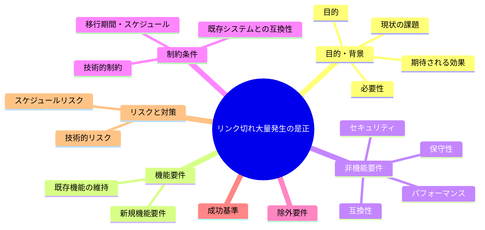
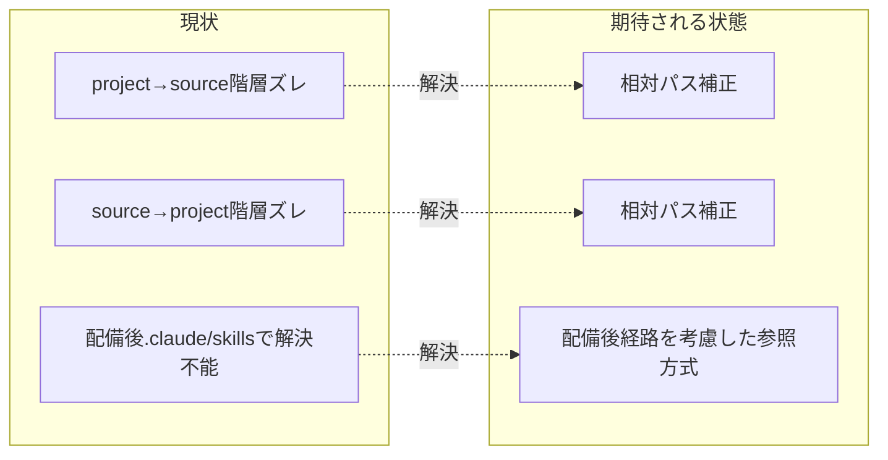

# 要求定義書: リンク切れ大量発生の是正

**プロジェクト名**: リンク切れ大量発生の是正
**作成日**: 2026 年 07 月 14 日
**最終更新**: 2026 年 07 月 14 日

> **重要**:
>
> - 要求定義書は、プロジェクトの全体像を把握するためのものです。詳細な技術仕様や実装方法は要件定義書以降で記載します。必要最低限の情報に収めることを心掛けてください。
> - **このドキュメントは常に更新**: 要求の変更や追加があった場合は、即座にこのドキュメントを更新してください。ドキュメントは「生きているドキュメント」として扱い、実装内容と常に同期させます。
> - **必須項目**: 以下の「必須」と明記した項目は空欄・抽象語のみ（例: 「{説明}」のまま）で提出しないこと。判定可能な形（目的は1文・成功基準は○/×で判定できる記載等）で記入すること。
>
> **用語**: [.agent-skill-chain/source/CONCEPTS.md §用語規約](../../../../../../../.agent-skill-chain/source/CONCEPTS.md#用語規約) を参照。

---

## 要求定義の全体像

**注意**:

- 上記の「プロジェクト名」は例です。実際のプロジェクト名に置き換えてください。
- マインドマップは全体像を把握するためのものです。主要なセクション名程度に留め、詳細は記載しないでください。

---

## 1. 目的・背景

### 1.1 目的（必須）

正本ドキュメント間の相対リンク切れを解消し、参照網の整合を保つ。

### 1.2 背景

2026-07-14 fable による本システムの自己調査で検出。

- **現状の課題**:
  - 相対リンク検査の結果、テンプレートのプレースホルダを除いてもアクティブな正本・project 配下だけで約 97 箇所、close/ を含めると約 1,150 箇所のリンク切れが存在する。
  - 特に多いパターンは (i) project/ から source への参照の階層ズレ、(ii) source/ から project/ への参照の階層ズレ、(iii) source/workflow/ から CLAUDE.md への参照の階層不足、(iv) 配備後 `.claude/skills/` で階層深度が変わり解決不能になるもの。
  - 該当箇所の例: `.agent-skill-chain/source/boot/CORE.md:140`、`RULES.md:46`、`workflow/PHASES.md:33,79,84`、`GETTING_STARTED.md:3`、`CONTEXT_EFFICIENCY.md:7,64`、`spec/ai/03_AIレビュー基準.md:9`、`project/自己拡張ワークフロー.md:179,191,202,220,230,254,268`、`project/COVERAGE_EXCEPTIONS.md:3,5,30-32`、`project/README.md:7`、`skills/requirements/write-bdd/SKILL.md:8`、配備物 `.claude/skills/review__review-code/SKILL.md:29` 等。
  - 参照網自体の整合が CI で検査されていない。

- **必要性**:
  - リンク切れは利用者・エージェントがドキュメントを辿れない実害を生む。
  - 配備後の階層深度変化まで含めた検査が無いと、同種の不具合が再発し続ける。

### 1.3 期待される効果（必須: 1 件以上）

- **効果 1**: 正本・project 配下の相対リンクが実際に解決可能な状態になる（リンク切れ件数が計測可能になり、既知の指摘箇所が解消される）。
- **効果 2**: 参照網の整合を継続的に検査する仕組み（CI 検査）の要否・方針が明確になる。

**現状と期待される状態の比較**（必要に応じて）:

---

## 2. 機能要件

### 2.1 既存機能の維持（該当する場合）

既存の正本ドキュメント構成・参照先ファイル自体は変更しない（リンクの記法・パスのみを是正する想定）。

### 2.2 新規機能要件

- 指摘箇所（根拠に列挙した各ファイル・行）のリンク切れを実際に解決可能な相対パスへ是正する。
- 参照網の整合を継続的に検査する仕組み（CI 検査等）の要否を検討する。

---

## 3. 非機能要件

### 3.1 パフォーマンス

- 特になし。

### 3.2 セキュリティ

- 特になし。

### 3.3 互換性

- 配備後（`.claude/skills/` 等）の階層深度でもリンクが解決可能であること。

### 3.4 保守性

- リンク切れの再発を防ぐ検査手段（CI 等）の導入可否を含めて検討する。

---

## 4. 制約条件

### 4.1 技術的制約

- 修正対象は正本（`.agent-skill-chain/source/`）・project（`.agent-skill-chain/project/`）配下が中心。close/ 配下は B-2（close 移動によるリンク切れ）で別途扱う。

### 4.2 既存システムとの互換性

- リンク記法の変更が配備スクリプト（setup 等）の動作に影響しないこと。

### 4.3 移行期間・スケジュール

- 特になし（設計フェーズで規模に応じて判断）。

---

## 5. 除外要件

- close/ 配下のリンク切れ是正は本 issue の対象外とする（B-2 で扱う）。

---

## 6. 成功基準（必須: 1 件以上）

- 根拠に列挙した指摘箇所（`.agent-skill-chain/source/boot/CORE.md:140` 等）のリンクが実際に解決可能なパスに修正されている。
- リンク切れ検査を CI で行うかどうかの方針が決定され記録されている。

---

## 7. リスクと対策

### 7.1 技術的リスク

- **リスク**: 修正対象が広範（約 97〜1,150 箇所）であり、一括修正時に誤修正・過修正が発生しうる。
  - **対策**: 修正前後で自動検査（grep 等）による差分確認を行う。

### 7.2 スケジュールリスク

- **リスク**: 件数が多く対応工数が肥大化する可能性がある。
  - **対策**: 影響度・深刻度（高/中/低）に応じて段階的に対応する。

---

## 8. 参考資料

### プロジェクトドキュメント

- 既存プロジェクトの場合は、[`00_システム理解.md`](./00_システム理解.md) - システム理解を参照

### その他の参考資料

- `.agent-skill-chain/source/boot/CORE.md:140`
- `.agent-skill-chain/source/RULES.md:46`
- `.agent-skill-chain/source/workflow/PHASES.md:33,79,84`
- `.agent-skill-chain/source/GETTING_STARTED.md:3`
- `.agent-skill-chain/source/CONTEXT_EFFICIENCY.md:7,64`
- `.agent-skill-chain/source/spec/ai/03_AIレビュー基準.md:9`
- `.agent-skill-chain/project/自己拡張ワークフロー.md:179,191,202,220,230,254,268`
- `.agent-skill-chain/project/COVERAGE_EXCEPTIONS.md:3,5,30-32`
- `.agent-skill-chain/project/README.md:7`
- `.agent-skill-chain/source/skills/requirements/write-bdd/SKILL.md:8`
- 配備物 `.claude/skills/review__review-code/SKILL.md:29`

---

## 9. 次のステップ

この要求定義書の承認後、以下のドキュメントを作成します：

- **次**: [`01_要件定義.md`](./01_要件定義.md) - 要件定義フェーズ
