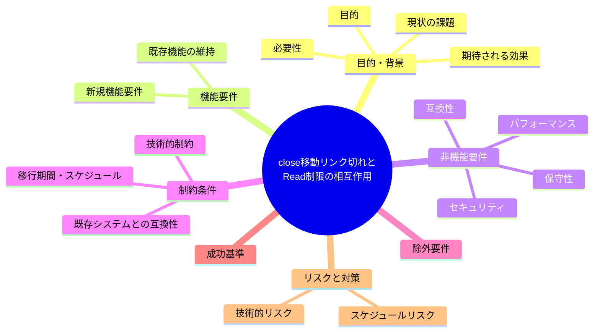
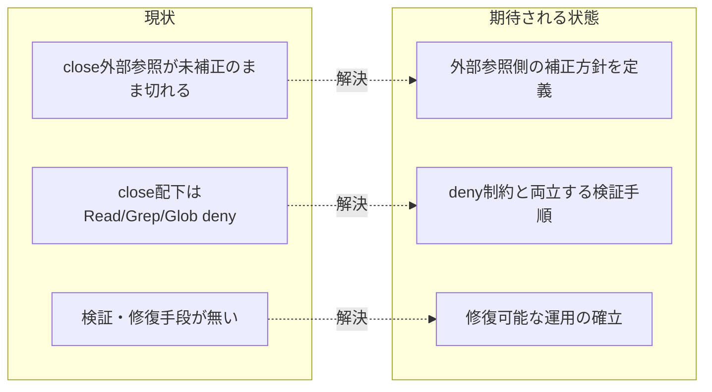

# 要求定義書: close 移動リンク切れと Read 制限の相互作用

**プロジェクト名**: close 移動リンク切れと Read 制限の相互作用
**作成日**: 2026 年 07 月 14 日
**最終更新**: 2026 年 07 月 14 日

> **重要**:
>
> - 要求定義書は、プロジェクトの全体像を把握するためのものです。詳細な技術仕様や実装方法は要件定義書以降で記載します。必要最低限の情報に収めることを心掛けてください。
> - **このドキュメントは常に更新**: 要求の変更や追加があった場合は、即座にこのドキュメントを更新してください。ドキュメントは「生きているドキュメント」として扱い、実装内容と常に同期させます。
> - **必須項目**: 以下の「必須」と明記した項目は空欄・抽象語のみ（例: 「{説明}」のまま）で提出しないこと。判定可能な形（目的は1文・成功基準は○/×で判定できる記載等）で記入すること。
>
> **用語**: [.agent-skill-chain/source/CONCEPTS.md §用語規約](../../../../../../../.agent-skill-chain/source/CONCEPTS.md#用語規約) を参照。

---

## 要求定義の全体像

**注意**:

- 上記の「プロジェクト名」は例です。実際のプロジェクト名に置き換えてください。
- マインドマップは全体像を把握するためのものです。主要なセクション名程度に留め、詳細は記載しないでください。

---

## 1. 目的・背景

### 1.1 目的（必須）

close/ 配下参照の切れたリンクを検証・修復できない構造的な行き詰まりを解消する。

### 1.2 背景

2026-07-14 fable による本システムの自己調査で検出。

- **現状の課題**:
  - `docs/maintainer/workflow` 配下のリンク切れ約 1,060 件の大半が close/ 配下・close/ への参照である。
  - close 移動時の「深度+1 補正手順」は定義済みだが、close/ の**外**から close 済み issue を指す参照は補正対象外であり、切れたまま残る（例: `.agent-skill-chain/project/MODEL_TIER_TABLE.md:34` が close/ へ移動済みの issue を指しており不達）。
  - さらに `.claude/settings.json` が close/ 配下の Read/Grep/Glob を deny しているため、エージェントはリンク切れの検証も修復もできない状態にある。

- **必要性**:
  - close/ を参照する外部リンクが恒久的に切れたままだと、過去の意思決定・経緯を辿れなくなる。
  - 「読めないから直せない」という構造的矛盾を解消しないと、同種の指摘が繰り返し発生する。

### 1.3 期待される効果（必須: 1 件以上）

- **効果 1**: close/ の外から close 済み issue を指す参照が解決可能になる、またはその方針（例: 移動時に外部参照側も補正する運用の追加）が明確になる。
- **効果 2**: close/ 配下のリンク切れを Read/Grep/Glob deny 制約と両立させて検証・修復する手順が定義される。

**現状と期待される状態の比較**（必要に応じて）:

---

## 2. 機能要件

### 2.1 既存機能の維持（該当する場合）

close/ 配下への Read/Grep/Glob deny 設定自体は本リポのローカル環境固有の意図された制約であり、維持を前提に検討する。

### 2.2 新規機能要件

- close/ を参照する外部（close/ の外側）リンクの補正方針を定義する（移動時に外部参照側も更新するか、参照禁止とするか等）。
- deny 制約下でも close/ 配下のリンク切れを検証できる代替手段（例: 移動前チェック強化、`git show` によるコミット時点参照等）を検討する。

---

## 3. 非機能要件

### 3.1 パフォーマンス

- 特になし。

### 3.2 セキュリティ

- close/ 配下 deny の制約緩和は本 issue のスコープ外とする（既存のローカル制約を尊重する）。

### 3.3 互換性

- 既存の close 移動手順（`.agent-skill-chain/project/自己拡張ワークフロー.md` §close 移動時の相対リンク補正）と矛盾しない方針とする。

### 3.4 保守性

- 今後の close 移動でも同種のリンク切れが再発しない運用にする。

---

## 4. 制約条件

### 4.1 技術的制約

- `.claude/settings.json` の close/ 配下 deny（Read/Grep/Glob）は本リポのローカル環境固有設定であり、他消費者への一般化はしない前提を踏まえる。

### 4.2 既存システムとの互換性

- 既存の「移動前に完結させる」補正手順（`.agent-skill-chain/project/自己拡張ワークフロー.md` §close 移動時の相対リンク補正）と整合させる。

### 4.3 移行期間・スケジュール

- 特になし（設計フェーズで規模に応じて判断）。

---

## 5. 除外要件

- close/ 配下 deny 設定自体の撤廃・変更は対象外とする。

---

## 6. 成功基準（必須: 1 件以上）

- close/ を参照する外部リンクの扱い方針（補正する／しない、するなら手順）が明文化されている。
- `.agent-skill-chain/project/MODEL_TIER_TABLE.md:34` 等、既知の不達箇所について対応方針が決定されている。

---

## 7. リスクと対策

### 7.1 技術的リスク

- **リスク**: deny 制約により機械検証が困難で、人手確認に依存せざるを得ない可能性がある。
  - **対策**: 移動前（deny 対象外の状態）での検証を徹底する運用ルールを明確化する。

### 7.2 スケジュールリスク

- **リスク**: 対象件数（約 1,060 件）が多く、全件個別対応は工数が大きい。
  - **対策**: 恒久ルール（今後の移動時の補正方針）の確立を優先し、既存分は段階対応とする。

---

## 8. 参考資料

### プロジェクトドキュメント

- 既存プロジェクトの場合は、[`00_システム理解.md`](./00_システム理解.md) - システム理解を参照

### その他の参考資料

- `.agent-skill-chain/project/MODEL_TIER_TABLE.md:34`
- `.claude/settings.json`（close/ 配下 deny 3 行）
- `.agent-skill-chain/project/自己拡張ワークフロー.md` §close 移動時の相対リンク補正

---

## 9. 次のステップ

この要求定義書の承認後、以下のドキュメントを作成します：

- **次**: [`01_要件定義.md`](./01_要件定義.md) - 要件定義フェーズ
