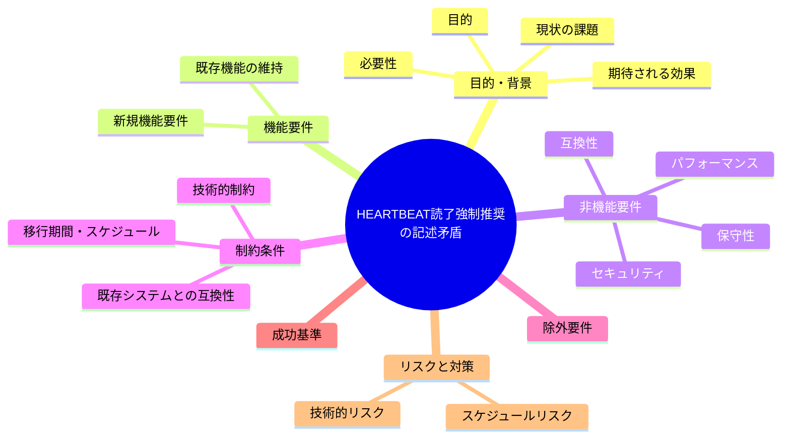
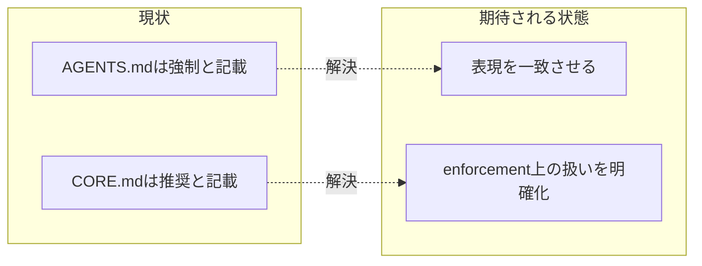

# 要求定義書: HEARTBEAT 読了「強制」（AGENTS.md）vs「推奨」（CORE.md）の記述矛盾

**プロジェクト名**: HEARTBEAT 読了強制推奨の記述矛盾
**作成日**: 2026 年 07 月 14 日
**最終更新**: 2026 年 07 月 14 日

> **重要**:
>
> - 要求定義書は、プロジェクトの全体像を把握するためのものです。詳細な技術仕様や実装方法は要件定義書以降で記載します。必要最低限の情報に収めることを心掛けてください。
> - **このドキュメントは常に更新**: 要求の変更や追加があった場合は、即座にこのドキュメントを更新してください。ドキュメントは「生きているドキュメント」として扱い、実装内容と常に同期させます。
> - **必須項目**: 以下の「必須」と明記した項目は空欄・抽象語のみ（例: 「{説明}」のまま）で提出しないこと。判定可能な形（目的は1文・成功基準は○/×で判定できる記載等）で記入すること。
>
> **用語**: [.agent-skill-chain/source/CONCEPTS.md §用語規約](../../../../../../../.agent-skill-chain/source/CONCEPTS.md#用語規約) を参照。

---

## 要求定義の全体像

**注意**:

- 上記の「プロジェクト名」は例です。実際のプロジェクト名に置き換えてください。
- マインドマップは全体像を把握するためのものです。主要なセクション名程度に留め、詳細は記載しないでください。

---

## 1. 目的・背景

### 1.1 目的（必須）

HEARTBEAT 読了の強制/推奨に関する入口（AGENTS.md）と正本（CORE.md）の記述矛盾を解消する。

### 1.2 背景

2026-07-14 fable による本システムの自己調査で検出。

- **現状の課題**:
  - `AGENTS.md:10` は「HEARTBEAT 読了の強制: CORE §Heartbeat」と参照するが、参照先の `.agent-skill-chain/source/boot/CORE.md:111`（CORE §Heartbeat）は「HEARTBEAT を読了することを推奨し」と規定している。
  - 「強制」か「推奨」かは enforcement 上の意味（違反時に FAIL させるか否か）が異なり、入口と正本の記載が直接食い違っている。

- **必要性**:
  - 入口ドキュメント（AGENTS.md）を読んだ利用者・エージェントが「強制」と誤認したまま行動する、または逆に正本を見て「推奨」と誤認するリスクがある。

### 1.3 期待される効果（必須: 1 件以上）

- **効果 1**: AGENTS.md と CORE.md の HEARTBEAT 読了に関する強度表現（強制/推奨）が一致する。
- **効果 2**: HEARTBEAT 読了が enforcement 上どちらの扱い（FAIL 対象か否か）であるかが一意に判断できる。

**現状と期待される状態の比較**（必要に応じて）:

---

## 2. 機能要件

### 2.1 既存機能の維持（該当する場合）

HEARTBEAT の内容・読了タイミング自体は変更せず、強制/推奨の表現統一のみを対象とする。

### 2.2 新規機能要件

- CORE.md §Heartbeat の実際の enforcement 挙動（機械強制の有無）を確認し、AGENTS.md:10 の表現をそれに合わせて修正する、または CORE.md 側の表現を「強制」に変更する。

---

## 3. 非機能要件

### 3.1 パフォーマンス

- 特になし。

### 3.2 セキュリティ

- 特になし。

### 3.3 互換性

- 既存の enforcement（audit.sh 等）の実際の判定ロジックと表現を一致させること。

### 3.4 保守性

- 今後、入口ドキュメントと正本の強度表現がずれないよう、正本を単一の情報源とする原則を徹底する。

---

## 4. 制約条件

### 4.1 技術的制約

- 特になし。

### 4.2 既存システムとの互換性

- 特になし。

### 4.3 移行期間・スケジュール

- 特になし。

---

## 5. 除外要件

- HEARTBEAT の内容そのものの変更は対象外とする。

---

## 6. 成功基準（必須: 1 件以上）

- `AGENTS.md:10` と `.agent-skill-chain/source/boot/CORE.md:111` の HEARTBEAT 読了に関する強度表現が一致している。

---

## 7. リスクと対策

### 7.1 技術的リスク

- **リスク**: 表現を「強制」に統一した場合、実際には機械強制されていないのに強制と誤認させる可能性がある。
  - **対策**: 実際の enforcement 実装（機械検知の有無）を確認したうえで表現を決定する。

### 7.2 スケジュールリスク

- **リスク**: 特になし。
  - **対策**: 特になし。

---

## 8. 参考資料

### プロジェクトドキュメント

- 既存プロジェクトの場合は、[`00_システム理解.md`](./00_システム理解.md) - システム理解を参照

### その他の参考資料

- `AGENTS.md:10`
- `.agent-skill-chain/source/boot/CORE.md:111`

---

## 9. 次のステップ

この要求定義書の承認後、以下のドキュメントを作成します：

- **次**: [`01_要件定義.md`](./01_要件定義.md) - 要件定義フェーズ
