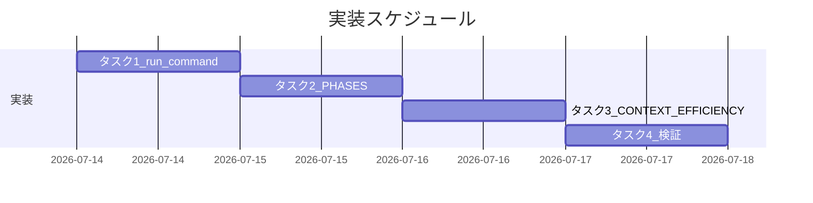

# 実装計画書: source 正本のリポ固有ファイル依存境界侵食

**プロジェクト名**: source 正本のリポ固有ファイル依存境界侵食
**作成日**: 2026 年 07 月 14 日
**最終更新**: 2026 年 07 月 14 日

> **用語**: [.agent-skill-chain/source/CONCEPTS.md §用語規約](../../../../../../../.agent-skill-chain/source/CONCEPTS.md#用語規約) を参照。

---

## 1. 実装概要

### 1.1 実装方針

02_設計 の ADR-1・ADR-2 に従い、対象 3 ファイルの該当箇所へ条件分岐のみのフォールバック文言を追記する。既存の抽象要件本文（記録すべき値・declined 記録形式・無効化トグル等）は一切変更しない。コード変更・テストコード追加は発生しない（ドキュメント編集のみ）。

### 1.2 実装順序

1. タスク 1: run_command.md（48–50 行目付近）に 3 ゲート共通フォールバック項目を追加
2. タスク 2: PHASES.md（33 行目付近）に作成場所フォールバックを追記
3. タスク 3: CONTEXT_EFFICIENCY.md（7, 64 行目付近）に 2 箇所のフォールバックを追記
4. タスク 4: 00_要求定義.md frontmatter の branch 記録・宙づり参照解消の検証



---

## 2. タスク分解

### 2.1 タスク 1: run_command.md への 3 ゲート共通フォールバック追加

#### 2.1.1 概要

GitHub Issue 起票ゲート・ブランチ紐づけゲート・PR 紐づけゲート（48–50 行目付近）の直後に、project 側具体化ファイル不在時のフォールバック項目を 1 つ追加する。

#### 2.1.2 実装内容

- `.agent-skill-chain/source/skills/agent/run_command.md` の 50 行目直後（「書記依頼の強制」項目の手前）に、新規箇条書き項目を 1 つ追加する。
- 追加項目には「project 側に該当ファイルが無い場合は当該参照を適用しない」「各ゲート本文の抽象要件のみに従う」「project 側の具体化が無いことはゲート自体の免除理由にならない」の 3 点を含める。
- 既存の 48–50 行目本文（各ゲートの抽象要件記述）は変更しない。

#### 2.1.3 テスト観点

##### 単体（本タスクの具体ケース）

- 追加後も 48–50 行目の既存本文（記録先 frontmatter・記録する値・declined 記録形式・無効化トグル）が一字一句変更されていないこと（diff で確認）。
- 追加した項目が「project 側に該当ファイルが無い場合は適用しない」という条件分岐を明示していること。

##### 結合/API

- 該当なし。

##### E2E/受け入れ

- 01_要件定義 ストーリー 1 の受け入れ基準（3 ゲートの具体手順参照が project 未整備でも破綻しない）を満たすこと。

##### バリデーション

- 追加した項目が既存の Markdown 箇条書き記法（`- **見出し**: 本文`）と整合していること。

#### 2.1.4 単体テスト仕様（BDD）

```gherkin
Feature: run_command.md の 3 ゲート共通フォールバック
  Scenario: project 側ファイル不在時の条件分岐が明記されている
    Given run_command.md 48-50行目の3ゲート項目（変更前）
    When 直後に project 側ファイル不在時のフォールバック項目を1つ追加する
    Then 既存3項目の本文は変更されず、フォールバック項目が新規に1つ追加されている
```

**確認方法（ドキュメント編集のため実行コマンドで代替）**:

```bash
# Given/When: 変更後のファイルで該当箇所を確認
# Then: フォールバック項目が存在し、既存3項目のキーワード（github_issue, branch, Closes #）が維持されていることを確認
grep -n "project 未整備時フォールバック" .agent-skill-chain/source/skills/agent/run_command.md
grep -n "github_issue" .agent-skill-chain/source/skills/agent/run_command.md
```

#### 2.1.5 依存関係

なし（最初のタスク）。

#### 2.1.6 見積もり

- **工数**: 小
- **優先度**: 高

### 2.2 タスク 2: PHASES.md への作成場所フォールバック追加

#### 2.2.1 概要

「作成場所の上書き」項目（33 行目付近）の文末に、project 上書き・CLAUDE.md 該当節がいずれも無い場合のフォールバック文をインラインで追記する。

#### 2.2.2 実装内容

- `.agent-skill-chain/source/workflow/PHASES.md` の該当項目文末に、「`.agent-skill-chain/project/` の上書きも CLAUDE.md 該当節も存在しない環境では、この参照は適用せず、command 実行主体が定める一般的な既定の作成場所にそのまま従ってよい」旨を追記する。
- 既存の「本体定義は再記述しない」という参照方針は維持する（具体的な作成場所パスをコア側に書き写さない）。

#### 2.2.3 テスト観点

##### 単体（本タスクの具体ケース）

- 追記後も既存の CLAUDE.md 参照リンクが変更されていないこと。
- 追記文言が「一般的な既定の作成場所に従ってよい」という条件分岐を含むこと。

##### 結合/API

- 該当なし。

##### E2E/受け入れ

- 01_要件定義 ストーリー 2 の受け入れ基準を満たすこと。

##### バリデーション

- 該当なし。

#### 2.2.4 単体テスト仕様（BDD）

```gherkin
Feature: PHASES.md の作成場所フォールバック
  Scenario: CLAUDE.md 該当節が無い環境でも作成場所が決まる
    Given PHASES.md の作成場所の上書き項目（変更前）
    When フォールバック文を文末に追記する
    Then 追記後の文言に一般的な既定の作成場所へ従ってよい旨が含まれる
```

```bash
# Given/When: 変更後の該当行を確認
# Then: フォールバック文言の存在を確認
grep -n "一般的な既定の作成場所" .agent-skill-chain/source/workflow/PHASES.md
```

#### 2.2.5 依存関係

- タスク 1 と独立（別ファイルのため順序制約なし）。

#### 2.2.6 見積もり

- **工数**: 小
- **優先度**: 高

### 2.3 タスク 3: CONTEXT_EFFICIENCY.md への 2 箇所フォールバック追加

#### 2.3.1 概要

7 行目（責務段落）と 64 行目（軽量運用の参照文）それぞれに、project/CLAUDE.md 側の該当が無い場合のフォールバックをインラインで追記する。

#### 2.3.2 実装内容

- 7 行目: 「具体数値・タグ運用は混入させず `.agent-skill-chain/project/` に委ねる」の直後に、「該当の具体化が project 側に存在しない環境では、この委譲は発生させず本ファイルの抽象原則のみを適用する」旨を追記する。同じく CLAUDE.md 参照の直後に「該当節が CLAUDE.md に存在しない環境ではこの参照は適用しない」旨を追記する。
- 64 行目: CLAUDE.md 参照の直後に、「CLAUDE.md に該当節が存在しない消費者環境では、この参照は適用せず、本節（§適用のスケーリング）の軽量運用の記載にそのまま従う」旨を追記する。

#### 2.3.3 テスト観点

##### 単体（本タスクの具体ケース）

- 追記後も既存の見出し構成・段落順序が変更されていないこと。
- 7 行目・64 行目双方にフォールバック文言が追加されていること。

##### 結合/API

- 64 行目のフォールバック先「本節（§適用のスケーリング）」が本ファイル内に実在する見出しであること。

##### E2E/受け入れ

- 01_要件定義 ストーリー 3 の受け入れ基準を満たすこと。

##### バリデーション

- 該当なし。

#### 2.3.4 単体テスト仕様（BDD）

```gherkin
Feature: CONTEXT_EFFICIENCY.md の 2 箇所フォールバック
  Scenario: project/CLAUDE.md 不在でも本ファイルの原則だけで完結する
    Given CONTEXT_EFFICIENCY.md の7,64行目（変更前）
    When 該当が無い場合のフォールバックを追記する
    Then 7行目・64行目の双方に条件分岐が明記され、64行目のフォールバック先見出しが実在する
```

```bash
# Given/When: 変更後の該当箇所を確認
# Then: フォールバック文言と参照先見出しの実在を確認
grep -n "本ファイルの抽象原則のみを適用する" .agent-skill-chain/source/CONTEXT_EFFICIENCY.md
grep -n "^## 適用のスケーリング" .agent-skill-chain/source/CONTEXT_EFFICIENCY.md
```

#### 2.3.5 依存関係

- タスク 1, タスク 2 と独立（別ファイルのため順序制約なし）。

#### 2.3.6 見積もり

- **工数**: 小
- **優先度**: 中

### 2.4 タスク 4: branch 記録・宙づり参照解消の検証

#### 2.4.1 概要

00_要求定義.md frontmatter の branch を実ブランチ名に更新し、00 §6 成功基準（3 箇所の記述が project 未整備の消費者環境でも破綻しない）を満たしているか実測で確認する。

#### 2.4.2 実装内容

- 00_要求定義.md frontmatter の `branch` を実際のブランチ名（harness 既定の `worktree-agent-<id>`）に更新する。
- 変更前後の 3 ファイルの diff を確認し、既存本文の非破壊とフォールバック追記の網羅を確認する。
- 04_review.md に結果を記載する。

#### 2.4.3 テスト観点

##### 単体（本タスクの具体ケース）

- frontmatter の `branch` が空/null ではなく実ブランチ名になっていること。

##### 結合/API

- 該当なし。

##### E2E/受け入れ

- 00 要求定義 §6 の成功基準（3 箇所すべてがフォールバック記載を持つ、または対応方針が明確に決定されている）が満たされていること。

##### バリデーション

- 該当なし。

#### 2.4.4 単体テスト仕様（BDD）

```gherkin
Feature: 検証
  Scenario: 成功基準を満たしていることを確認する
    Given run_command.md, PHASES.md, CONTEXT_EFFICIENCY.md の変更後ファイルと00_要求定義.mdのbranch記録
    When 3ファイルのフォールバック記載とbranch記録の非空を確認する
    Then すべて満たされている
```

#### 2.4.5 依存関係

- タスク 1, 2, 3 完了後。

#### 2.4.6 見積もり

- **工数**: 小
- **優先度**: 高

---

## テスト観点

本実装計画はドキュメント編集のみのため、コードの単体/結合/E2E テストは対象外。テスト観点は「既存本文の非破壊」「フォールバック文言の網羅」「宙づり参照の解消（grep で実測確認できること）」の 3 点に集約する（各タスク §2.x.3 に具体ケースを記載）。

---

## 単体テスト

コードの単体テストは対象外。§2.x.4 の BDD 仕様（grep での実測確認）を検証手段として用いる。

---

## BDD

各タスク §2.x.4 を参照。

---

## 3. 実装スケジュール

### 3.1 マイルストーン

| マイルストーン | 期日 | 成果物 |
| --- | --- | --- |
| 実装完了 | 2026-07-14 | run_command.md・PHASES.md・CONTEXT_EFFICIENCY.md 更新 |
| レビュー完了 | 2026-07-14 | 04_review.md |

### 3.2 実装フェーズ

#### フェーズ 1: 実装

- **期間**: 2026-07-14
- **タスク**: タスク 1〜4

---

## 4. テスト計画

### 4.1 テストの優先順位

- 既存の抽象要件本文（3 ゲートの記録要件・declined 記録形式等）が変更されていないことを最優先で確認する（00 §7.1 リスク対策）。
- フォールバック文言の網羅・宙づり参照の解消を次点で確認する。

---

## 5. リスク管理

### 5.1 実装リスク

- **リスク**: フォールバック記載を追加すると source/ の抽象性（コアは具体を持たない原則）と矛盾する可能性がある（00 §7.1）。
  - **対策**: 具体値を書かず「project に無い場合はこの規約を適用しない」旨の条件分岐のみを記載する（02_設計 ADR-2）。

---

## 6. 参考資料

### プロジェクトドキュメント

- [`02_設計.md`](./02_設計.md) - 設計

### その他の参考資料

- `.agent-skill-chain/source/skills/agent/run_command.md`
- `.agent-skill-chain/source/workflow/PHASES.md`
- `.agent-skill-chain/source/CONTEXT_EFFICIENCY.md`

---

## 7. 前のステップ

この実装計画書は、以下のドキュメントを基に作成されています：

- **前**: [`02_設計.md`](./02_設計.md) - 設計フェーズ

---

## 8. 次のステップ

この実装計画書の承認後、以下のステップに進みます：

- 実装フェーズに直接進む（本 issue は 1 issue で完結し、サブ issue への分割は行わない）。
