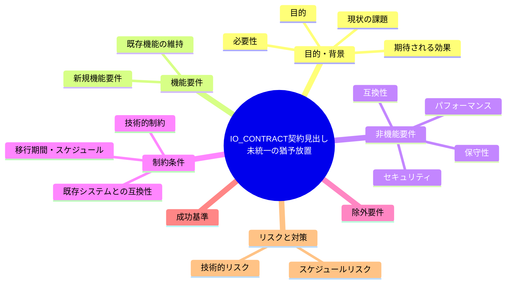
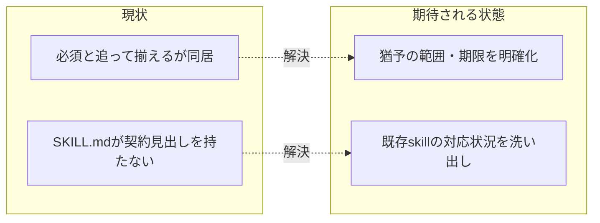

# 要求定義書: IO_CONTRACT の「追って揃える」が未完了のまま（契約見出しの不統一）

**プロジェクト名**: IO_CONTRACT 契約見出し未統一の猶予放置
**作成日**: 2026 年 07 月 14 日
**最終更新**: 2026 年 07 月 14 日

> **重要**:
>
> - 要求定義書は、プロジェクトの全体像を把握するためのものです。詳細な技術仕様や実装方法は要件定義書以降で記載します。必要最低限の情報に収めることを心掛けてください。
> - **このドキュメントは常に更新**: 要求の変更や追加があった場合は、即座にこのドキュメントを更新してください。ドキュメントは「生きているドキュメント」として扱い、実装内容と常に同期させます。
> - **必須項目**: 以下の「必須」と明記した項目は空欄・抽象語のみ（例: 「{説明}」のまま）で提出しないこと。判定可能な形（目的は1文・成功基準は○/×で判定できる記載等）で記入すること。
>
> **用語**: [.agent-skill-chain/source/CONCEPTS.md §用語規約](../../../../../../../.agent-skill-chain/source/CONCEPTS.md#用語規約) を参照。

---

## 要求定義の全体像

**注意**:

- 上記の「プロジェクト名」は例です。実際のプロジェクト名に置き換えてください。
- マインドマップは全体像を把握するためのものです。主要なセクション名程度に留め、詳細は記載しないでください。

---

## 1. 目的・背景

### 1.1 目的（必須）

IO_CONTRACT の「必須」見出しと「既存は追って揃える」猶予の同居による監査基準の曖昧さを解消する。

### 1.2 背景

2026-07-14 fable による本システムの自己調査で検出。

- **現状の課題**:
  - `.agent-skill-chain/source/IO_CONTRACT.md:29-46` は skill に Purpose/Inputs/Process/Outputs/Done/Forbidden の見出しを「必須」としつつ、運用節で「既存は追って本契約の見出しに揃える」と猶予している。
  - 実際 `.agent-skill-chain/source/skills/agent/SKILL.md` は契約見出しを持たない。
  - 「必須」と「追って」が同居しており、どの時点で違反とみなすかの監査基準が曖昧になっている。

- **必要性**:
  - 「必須」と明記しつつ現状未達のファイルが放置されていると、他の skill にも同様の未対応が広がりやすく、監査（レビュー）で一貫した判断ができない。

### 1.3 期待される効果（必須: 1 件以上）

- **効果 1**: IO_CONTRACT.md の「必須」と「追って揃える」の関係が明確化される（猶予期限を設ける、対象範囲を明示する等）。
- **効果 2**: `skills/agent/SKILL.md` を含む既存 skill の契約見出し対応状況が洗い出され、対応方針が決まる。

**現状と期待される状態の比較**（必要に応じて）:

---

## 2. 機能要件

### 2.1 既存機能の維持（該当する場合）

Purpose/Inputs/Process/Outputs/Done/Forbidden の契約見出し構成自体は維持する。

### 2.2 新規機能要件

- IO_CONTRACT.md の「必須」記載と「追って揃える」猶予記載の関係を整理し、猶予の対象・期限・監査基準を明確化する。
- `skills/agent/SKILL.md` を含む既存 skill 群の契約見出し対応状況を棚卸しする。

---

## 3. 非機能要件

### 3.1 パフォーマンス

- 特になし。

### 3.2 セキュリティ

- 特になし。

### 3.3 互換性

- 既存 skill の実際の記述内容を破壊せず、見出し構成の追加・整理を中心に検討する。

### 3.4 保守性

- 今後新規追加される skill が最初から契約見出しに準拠するよう、テンプレート・レビュー観点を明確にする。

---

## 4. 制約条件

### 4.1 技術的制約

- 既存 skill 全件の見出し対応には一定の作業量が見込まれるため、優先度づけが必要。

### 4.2 既存システムとの互換性

- 特になし。

### 4.3 移行期間・スケジュール

- 猶予期限を設ける場合、既存 skill の棚卸し結果を踏まえて現実的な期限を検討する。

---

## 5. 除外要件

- 全 skill の契約見出し即時完全準拠は本 issue のスコープ外とする（基準の明確化と棚卸しが主眼）。

---

## 6. 成功基準（必須: 1 件以上）

- IO_CONTRACT.md の「必須」と「追って揃える」の関係（対象範囲・期限・監査基準）が明文化されている。
- `skills/agent/SKILL.md` を含む既存 skill の契約見出し対応状況一覧が作成されている。

---

## 7. リスクと対策

### 7.1 技術的リスク

- **リスク**: 猶予期限を厳格に設定すると、既存 skill の大量改修が必要になり作業が肥大化するおそれ。
  - **対策**: 段階的な対応（優先度の高い skill から順次対応）を許容する設計にする。

### 7.2 スケジュールリスク

- **リスク**: 特になし。
  - **対策**: 特になし。

---

## 8. 参考資料

### プロジェクトドキュメント

- 既存プロジェクトの場合は、[`00_システム理解.md`](./00_システム理解.md) - システム理解を参照

### その他の参考資料

- `.agent-skill-chain/source/IO_CONTRACT.md:29-46`
- `.agent-skill-chain/source/skills/agent/SKILL.md`

---

## 9. 次のステップ

この要求定義書の承認後、以下のドキュメントを作成します：

- **次**: [`01_要件定義.md`](./01_要件定義.md) - 要件定義フェーズ
