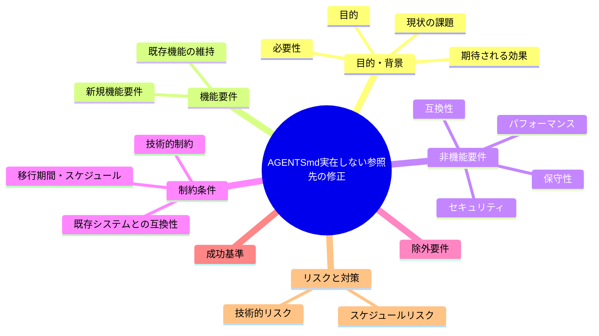
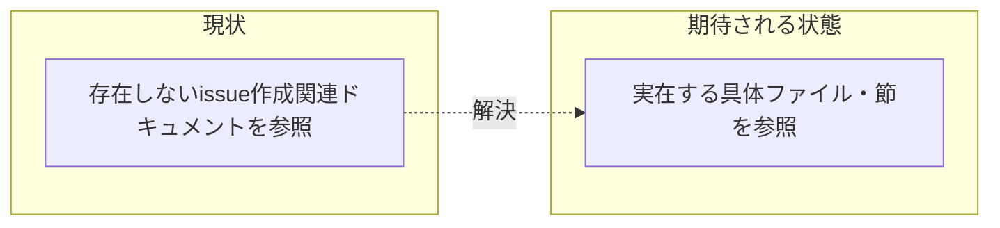

# 要求定義書: AGENTS.md:62 の参照先が実在しない

**プロジェクト名**: AGENTS.md 実在しない参照先の修正
**作成日**: 2026 年 07 月 14 日
**最終更新**: 2026 年 07 月 14 日

> **重要**:
>
> - 要求定義書は、プロジェクトの全体像を把握するためのものです。詳細な技術仕様や実装方法は要件定義書以降で記載します。必要最低限の情報に収めることを心掛けてください。
> - **このドキュメントは常に更新**: 要求の変更や追加があった場合は、即座にこのドキュメントを更新してください。ドキュメントは「生きているドキュメント」として扱い、実装内容と常に同期させます。
> - **必須項目**: 以下の「必須」と明記した項目は空欄・抽象語のみ（例: 「{説明}」のまま）で提出しないこと。判定可能な形（目的は1文・成功基準は○/×で判定できる記載等）で記入すること。
>
> **用語**: [.agent-skill-chain/source/CONCEPTS.md §用語規約](../../../../../../../.agent-skill-chain/source/CONCEPTS.md#用語規約) を参照。

---

## 要求定義の全体像

**注意**:

- 上記の「プロジェクト名」は例です。実際のプロジェクト名に置き換えてください。
- マインドマップは全体像を把握するためのものです。主要なセクション名程度に留め、詳細は記載しないでください。

---

## 1. 目的・背景

### 1.1 目的（必須）

AGENTS.md:62 が指す「issue 作成関連ドキュメント」という実在しない参照先を是正する。

### 1.2 背景

2026-07-14 fable による本システムの自己調査で検出。

- **現状の課題**:
  - `AGENTS.md:62` は「詳細は `.agent-skill-chain/source/workflow` 配下の issue 作成関連ドキュメントを参照」とあるが、`.agent-skill-chain/source/workflow/` には PHASES・PHASE_COMMAND_MAP・SKILL_MANDATORY・TEMPLATES の 4 ファイルのみが存在し、「issue 作成関連ドキュメント」という独立ファイルは無い。

- **必要性**:
  - 参照先が実在しないと、利用者・エージェントが「issue 作成関連ドキュメント」を探して見つけられず、意図した情報（おそらく PHASES.md や TEMPLATES.md 等の該当節）に辿り着けない。

### 1.3 期待される効果（必須: 1 件以上）

- **効果 1**: `AGENTS.md:62` の参照先が、`.agent-skill-chain/source/workflow/` 配下の実在するファイル・節（PHASES.md の該当節、TEMPLATES.md 等）を具体的に指す記載に修正される。

**現状と期待される状態の比較**（必要に応じて）:

---

## 2. 機能要件

### 2.1 既存機能の維持（該当する場合）

AGENTS.md:62 が伝えようとしている情報（issue 作成に関する詳細の参照先を示す）自体の意図は維持する。

### 2.2 新規機能要件

- `.agent-skill-chain/source/workflow/` 配下の PHASES.md・PHASE_COMMAND_MAP.md・SKILL_MANDATORY.md・TEMPLATES.md のうち、issue 作成に関連する具体的な節を特定する。
- `AGENTS.md:62` の参照記載を、特定した具体ファイル・節への参照に修正する。

---

## 3. 非機能要件

### 3.1 パフォーマンス

- 特になし。

### 3.2 セキュリティ

- 特になし。

### 3.3 互換性

- 特になし。

### 3.4 保守性

- 今後 workflow/ 配下のファイル構成が変わった際に、AGENTS.md の参照が追従する運用を意識する。

---

## 4. 制約条件

### 4.1 技術的制約

- 特になし。

### 4.2 既存システムとの互換性

- 特になし。

### 4.3 移行期間・スケジュール

- 特になし。

---

## 5. 除外要件

- `.agent-skill-chain/source/workflow/` 配下のファイル構成自体の変更（新規ファイル作成等）は対象外とする（既存ファイルへの参照修正が主眼）。

---

## 6. 成功基準（必須: 1 件以上）

- `AGENTS.md:62` の参照先が `.agent-skill-chain/source/workflow/` 配下の実在するファイル・節を指す記載に修正されている。

---

## 7. リスクと対策

### 7.1 技術的リスク

- **リスク**: 修正時にどの節が「issue 作成関連」の意図に最も近いかの判断を誤る可能性がある。
  - **対策**: PHASES.md・TEMPLATES.md 等の内容を確認し、issue 作成フローに直接関係する節を特定してから参照先を決定する。

### 7.2 スケジュールリスク

- **リスク**: 特になし。
  - **対策**: 特になし。

---

## 8. 参考資料

### プロジェクトドキュメント

- 既存プロジェクトの場合は、[`00_システム理解.md`](./00_システム理解.md) - システム理解を参照

### その他の参考資料

- `AGENTS.md:62`
- `.agent-skill-chain/source/workflow/`（PHASES.md・PHASE_COMMAND_MAP.md・SKILL_MANDATORY.md・TEMPLATES.md）

---

## 9. 次のステップ

この要求定義書の承認後、以下のドキュメントを作成します：

- **次**: [`01_要件定義.md`](./01_要件定義.md) - 要件定義フェーズ
