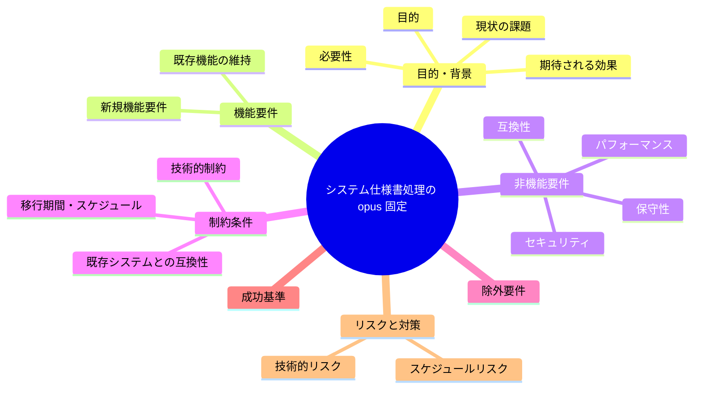
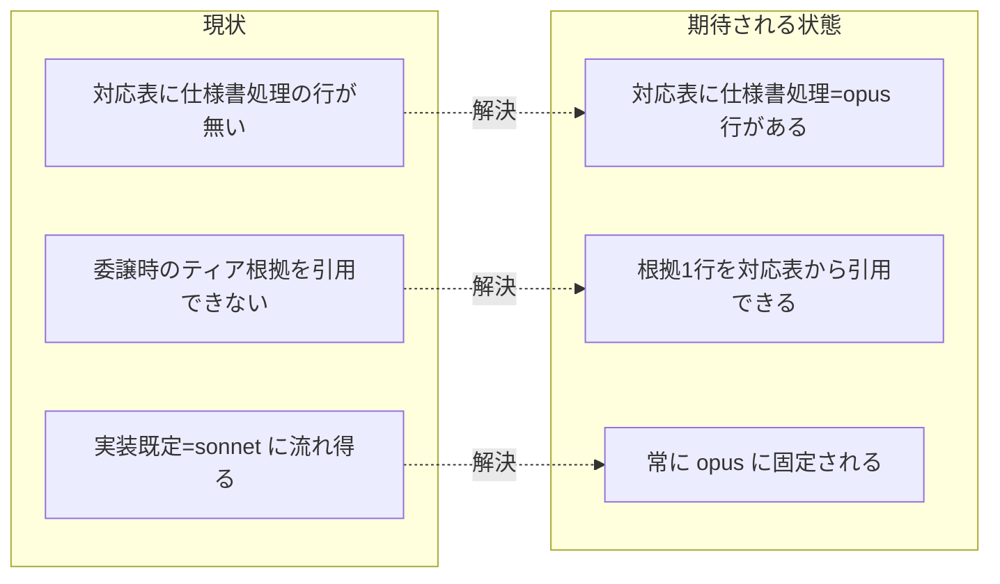

# 要求定義書: システム仕様書処理の opus ティア固定

**プロジェクト名**: システム仕様書処理の opus ティア固定
**作成日**: 2026 年 07 月 14 日
**最終更新**: 2026 年 07 月 14 日

> **重要**:
>
> - 要求定義書は、プロジェクトの全体像を把握するためのものです。詳細な技術仕様や実装方法は要件定義書以降で記載します。必要最低限の情報に収めることを心掛けてください。
> - **このドキュメントは常に更新**: 要求の変更や追加があった場合は、即座にこのドキュメントを更新してください。ドキュメントは「生きているドキュメント」として扱い、実装内容と常に同期させます。
> - **必須項目**: 以下の「必須」と明記した項目は空欄・抽象語のみで提出しないこと。判定可能な形（目的は 1 文・成功基準は○/×で判定できる記載等）で記入すること。
>
> **用語**: [.agent-skill-chain/source/CONCEPTS.md §用語規約](../../../../../.agent-skill-chain/source/CONCEPTS.md#用語規約) を参照。

---

## 要求定義の全体像

**注意**:

- マインドマップは全体像を把握するためのものです。主要なセクション名程度に留め、詳細は記載しません。

---

## 1. 目的・背景

### 1.1 目的（必須）

システム仕様書（docs/ 配下）への処理は常に opus ティアを使う選定ルールを追加する。

### 1.2 背景

- **現状の課題**:
  - `.agent-skill-chain/project/MODEL_TIER_TABLE.md` の「役割 → ティア対応表」に「システム仕様書（docs/ 配下）の処理」に対応する行が存在しない。
  - このため docs/ 配下の仕様書の更新・レビュー等をサブへ委譲する際、実装役割の既定（原則 sonnet）に流れてティアが格下げされ得る。
  - システム仕様書は複数フェーズ・複数コンポーネントに横断的に影響し、記述の誤りが後続の設計・実装全体へ波及するため、実装役割と同じ扱いは実態に合わない。

- **必要性**:
  - 「役割 → ティア対応表」は非裁量の選定手順（[.agent-skill-chain/source/MODEL_SELECTION.md](../../../../../.agent-skill-chain/source/MODEL_SELECTION.md) §裁量の禁止と形骸化防止）であり、対応表に行が無い役割は根拠 1 行の引用ができず、選定が曖昧化する。仕様書処理の重要性に見合うティアを非裁量で固定するため、対応表への明示行の追加が必要。

### 1.3 期待される効果（必須: 1 件以上）

- **効果 1**: システム仕様書（docs/ 配下）処理の委譲時に、委譲パケットのティア根拠 1 行が対応表の該当行として一意に引用でき、ティアが常に opus に固定される（対応表を参照すれば○/×で判定可能になる）。
- **効果 2**: 仕様書処理が実装役割の既定（sonnet）へ格下げされる余地がなくなり、横断的で重要な仕様書の品質劣化リスクが低下する。

**現状と期待される状態の比較**:

---

## 2. 機能要件

### 2.1 既存機能の維持（該当する場合）

- 既存の対応表 4 行（設計・レビュー・監査＝opus／実装＝原則 sonnet／書記＝haiku／fable＝原則禁止）はそのまま維持する。
- 抽象原則を `.agent-skill-chain/source/MODEL_SELECTION.md`、具体対応表を `.agent-skill-chain/project/MODEL_TIER_TABLE.md` に置く 2 層構造を維持する。

### 2.2 新規機能要件

- `.agent-skill-chain/project/MODEL_TIER_TABLE.md` の「役割 → ティア対応表」に、「システム仕様書（docs/ 配下）の処理」→ opus（常に opus）の新規行を追加する。行には委譲パケットに 1 行引用できる粒度の選定手順・根拠を記す。
  - **本行の追加（対応表本体の編集）は本 issue の後続フェーズ（設計・実装）で行う。本フェーズ（00/01）では要求・要件の確定のみを行う。**

---

## 3. 非機能要件

### 3.1 パフォーマンス

- 本 issue は運用ルール（対応表への 1 行追加）であり、実行時パフォーマンス要件は無い。

### 3.2 セキュリティ

- セキュリティ上の新規要件は無い。

### 3.3 互換性

- 追加行は既存 4 行と非交差であり、既存の役割→ティア判定を変更しない（後方互換）。
- 対象外環境（ティア選択の概念が無いランタイム）では [MODEL_SELECTION.md §1 適用条件](../../../../../.agent-skill-chain/source/MODEL_SELECTION.md) に従い本ルールも発火しない。

### 3.4 保守性

- 追加行は「役割 → ティア → 選定手順・根拠」の既存列構成に従い、そのまま委譲パケットの根拠 1 行として引用できる粒度で記述する（既存表と一貫性を保つ）。

---

## 4. 制約条件

### 4.1 技術的制約

- 具体対応表はコアに置かない（PF 中立性）。追加は `.agent-skill-chain/project/MODEL_TIER_TABLE.md` に限り、`.agent-skill-chain/source/MODEL_SELECTION.md`（抽象原則）には具体行を書かない（[MODEL_SELECTION.md §汎用/固有境界](../../../../../.agent-skill-chain/source/MODEL_SELECTION.md)）。

### 4.2 既存システムとの互換性

- 「システム仕様書」の定義は [.agent-skill-chain/source/RULES.md](../../../../../.agent-skill-chain/source/RULES.md) §システム仕様書 および LOAD_POLICY の「システム仕様書（docs/）の更新・レビュー」トリガーと整合させる（docs/ 配下の仕様書を対象とする）。新たな仕様書定義を独自に導入しない。

### 4.3 移行期間・スケジュール

- 段階移行は不要。追加行は即時有効（対応表参照時点から適用）。

---

## 5. 除外要件

- **MODEL_TIER_TABLE.md 本体への行追加の実施**（設計・実装フェーズ相当）は本フェーズ（00/01 作成）のスコープ外。
- 既存 4 行の文言変更・ティア変更は対象外。
- `.agent-skill-chain/source/MODEL_SELECTION.md`（抽象原則側）の改訂は対象外（具体行はコアに置かないため）。
- enforcement（機械監査）による「仕様書処理は opus」の自動強制の新設は対象外（対応表＋人手監査で運用する）。

---

## 6. 成功基準（必須: 1 件以上）

- **基準 1**: 00_要求定義.md に、目的（1 文）・背景・期待される効果・成功基準が記載されている（本ドキュメントで充足）。
- **基準 2**: 01_要件定義.md に、ユーザーストーリー・受け入れ基準・BDD シナリオ（Given/When/Then）が記載され、参照元が明記されている。
- **基準 3**: 「システム仕様書（docs/ 配下）の処理」→ opus（常に opus）という追加対象行の内容と、opus を選ぶ根拠（重要かつ横断的）が要求・要件として明文化され、後続の設計・実装フェーズが対応表へ 1 行追加できる状態になっている。

---

## 7. リスクと対策

### 7.1 技術的リスク

- **リスク**: 「システム仕様書」の対象範囲が曖昧だと、対応表の行が適用されるケース／されないケースの判定がぶれる。
  - **対策**: 対象を RULES.md §システム仕様書 / LOAD_POLICY の docs/ トリガー定義に一致させ、独自定義を作らない（§4.2）。
- **リスク**: 過剰適用（docs/ 配下でも仕様書でない軽微ファイルまで opus を強制する）。
  - **対策**: 対象を「システム仕様書」に限定し、既存定義に委ねる。判定境界の詳細は後続フェーズで整理する。

### 7.2 スケジュールリスク

- **リスク**: 本フェーズと後続（対応表本体編集）の境界が曖昧になり、本フェーズで表本体を編集してしまう。
  - **対策**: 除外要件（§5）で本体編集をスコープ外と明記。本フェーズは 00/01 の確定に限定する。

---

## 8. 参考資料

### プロジェクトドキュメント

- [`01_要件定義.md`](./01_要件定義.md) - 本 issue の要件定義
- [.agent-skill-chain/project/MODEL_TIER_TABLE.md](../../../../../.agent-skill-chain/project/MODEL_TIER_TABLE.md) - 変更対象の役割→ティア具体対応表（本フェーズでは参照のみ）
- [.agent-skill-chain/source/MODEL_SELECTION.md](../../../../../.agent-skill-chain/source/MODEL_SELECTION.md) - モデルティア選定の抽象原則

### その他の参考資料

- [.agent-skill-chain/source/CONCEPTS.md §外部根拠の必須化](../../../../../.agent-skill-chain/source/CONCEPTS.md) - evidence_source 分類

> **重要判断の根拠（evidence_source）**
>
> - **判断**: システム仕様書（docs/ 配下）の処理を常に opus ティアに固定する。
> - **evidence_source**: `human_decision`（プロジェクトオーナーによる方針決定＝「システム仕様書は特に重要かつ横断的なため opus が適切」という明示判断）。inference_only ではない。

---

## 9. 次のステップ

この要求定義書の承認後、以下のドキュメントを作成します：

- **次**: [`01_要件定義.md`](./01_要件定義.md) - 要件定義フェーズ
