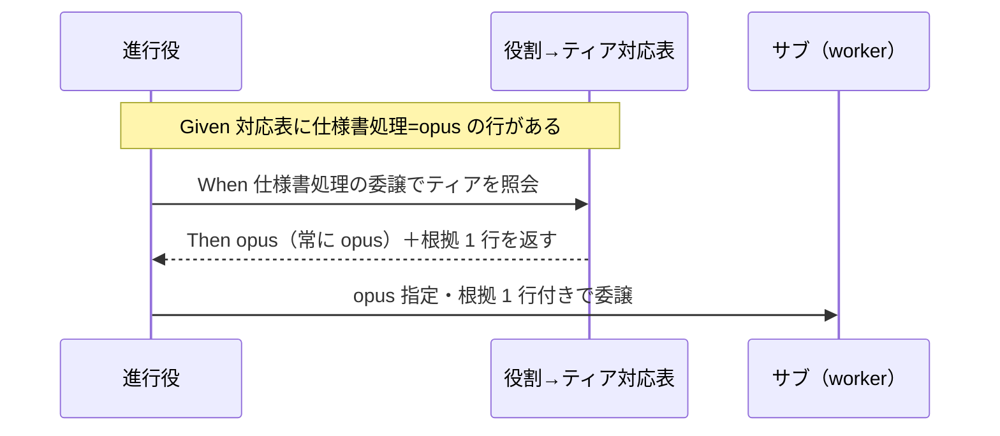

# 要件定義書: システム仕様書処理の opus ティア固定

**プロジェクト名**: システム仕様書処理の opus ティア固定
**作成日**: 2026 年 07 月 14 日
**最終更新**: 2026 年 07 月 14 日

> **重要**: **このドキュメントは常に更新**: 要件の変更や追加があった場合は、即座にこのドキュメントを更新してください。ドキュメントは「生きているドキュメント」として扱い、実装内容と常に同期させます。
>
> **用語**: [.agent-skill-chain/source/CONCEPTS.md §用語規約](../../../../../.agent-skill-chain/source/CONCEPTS.md#用語規約) を参照。

---

## 1. 概要

### 1.1 システム概要

サブ委譲時のモデルティア選定は、抽象原則を [.agent-skill-chain/source/MODEL_SELECTION.md](../../../../../.agent-skill-chain/source/MODEL_SELECTION.md) に、本リポ固有の「役割 → ティア対応表」を [.agent-skill-chain/project/MODEL_TIER_TABLE.md](../../../../../.agent-skill-chain/project/MODEL_TIER_TABLE.md) に置く 2 層構造で運用している。委譲パケットのティア根拠 1 行は、この対応表の該当行を引用する。本要件は、この対応表に「システム仕様書（docs/ 配下）の処理」→ opus（常に opus）の行を追加することを定義する。現状、仕様書処理に対応する行が無く、委譲時に実装役割の既定（原則 sonnet）へ格下げされ得る。

### 1.2 用語集

| 用語 | 説明 |
| ---- | ---- |
| システム仕様書 | docs/ 配下の仕様書等。定義は [.agent-skill-chain/source/RULES.md](../../../../../.agent-skill-chain/source/RULES.md) §システム仕様書 および LOAD_POLICY の docs/ 更新・レビュートリガーに従う |
| ティア | サブ委譲時に選択するモデル階層（opus / sonnet / haiku 等） |
| 役割 → ティア対応表 | MODEL_TIER_TABLE.md の非裁量の選定表。委譲パケットの根拠 1 行はこの表の行を引用する |
| 根拠 1 行 | 委譲パケットに明示するティア選定の根拠。対応表の該当行をそのまま引用する（[MODEL_SELECTION.md §2](../../../../../.agent-skill-chain/source/MODEL_SELECTION.md)） |
| evidence_source | 重要判断の根拠種別（human_decision / existing_code / inference_only 等）。[CONCEPTS.md §外部根拠の必須化](../../../../../.agent-skill-chain/source/CONCEPTS.md) 参照 |

---

## 2. 機能要件

### 2.1 ユーザーストーリー

#### ストーリー 1: 仕様書処理のティアを非裁量で固定する

- **As a** 進行役（orchestrator）
- **I want to** システム仕様書（docs/ 配下）の処理をサブへ委譲するとき、対応表から「常に opus」の根拠 1 行を一意に引用したい
- **So that** 重要かつ横断的な仕様書処理が実装既定（sonnet）へ格下げされず、非裁量で opus に固定される

**受け入れ基準**:

- 対応表に「システム仕様書（docs/ 配下）の処理」→ opus（常に opus）の行が定義対象として明文化されている。
- 当該行は委譲パケットの根拠 1 行としてそのまま引用できる粒度である（役割・ティア・選定手順/根拠を含む）。
- opus 選定の根拠が「システム仕様書は特に重要かつ横断的なため」であることが記載されている。

#### ストーリー 2: 既存対応表との一貫性・後方互換を保つ

- **As a** 本リポジトリの保守者
- **I want to** 追加行を既存 4 行と同じ列構成・非交差で追加したい
- **So that** 既存の役割→ティア判定を壊さず、2 層構造（source＝抽象／project＝具体）を維持できる

**受け入れ基準**:

- 追加は `.agent-skill-chain/project/MODEL_TIER_TABLE.md` に限定し、`.agent-skill-chain/source/MODEL_SELECTION.md` には具体行を書かない。
- 既存 4 行（設計・レビュー・監査／実装／書記／fable）の文言・ティアは変更しない。
- 追加行の対象範囲（システム仕様書）は既存定義（RULES.md / LOAD_POLICY）に一致させ、独自定義を作らない。

#### ストーリー 3: 本フェーズのスコープを要求・要件の確定に限定する

- **As a** 進行役
- **I want to** 本フェーズ（00/01 作成）では対応表本体を編集せず、要求・要件のみを確定したい
- **So that** 設計・実装フェーズが後続で対応表へ 1 行追加できる状態を、スコープを越えずに用意できる

**受け入れ基準**:

- 00/01 に、対応表本体の編集は本フェーズのスコープ外である旨が明記されている。
- 追加対象行の内容（役割・ティア・根拠）が後続フェーズで実装可能な粒度で確定している。

### 2.2 BDD ユースケース

#### ユースケース 1: 仕様書処理の委譲時のティア選定

進行役が docs/ 配下のシステム仕様書の更新・レビュー等をサブへ委譲する際、対応表を参照してティアを決定する。

**シナリオ 1: 対応表に仕様書処理行があるときは opus に固定される**

```gherkin
Feature: システム仕様書処理のティア選定
  Scenario: 仕様書処理の委譲時に opus を固定する
    Given 役割→ティア対応表に「システム仕様書（docs/ 配下）の処理」→ opus（常に opus）の行がある
    When 進行役が docs/ 配下のシステム仕様書の処理をサブへ委譲する
    Then 委譲パケットのティアは opus に設定される
    And ティア根拠 1 行として当該行が引用される
```

**処理フロー**:



**シナリオ 2: 仕様書処理行が無いと実装既定へ格下げされ得る（現状の課題）**

```gherkin
Feature: システム仕様書処理のティア選定
  Scenario: 対応表に仕様書処理行が無い場合の格下げリスク
    Given 役割→ティア対応表に仕様書処理に対応する行が無い
    When 進行役が docs/ 配下のシステム仕様書の処理をサブへ委譲する
    Then 実装役割の既定（原則 sonnet）へ流れてティアが格下げされ得る
    And この状態を本 issue で解消する
```

#### ユースケース 2: 追加行のスコープ境界

**シナリオ 1: 本フェーズでは対応表本体を編集しない**

```gherkin
Feature: 追加行のスコープ境界
  Scenario: 00/01 作成フェーズでは対応表を編集しない
    Given 本 issue のフェーズが要求・要件（00/01 作成）である
    When 要求・要件を確定する
    Then MODEL_TIER_TABLE.md 本体への行追加は実施しない
    And 追加対象行の内容が後続の設計・実装フェーズへ引き継がれる
```

### 2.3 ビジネスルール

- モデルティア選定は非裁量とする。追加行も「迷ったら上位」ではなく対応表の該当行を根拠に選ぶ（[MODEL_SELECTION.md §裁量の禁止と形骸化防止](../../../../../.agent-skill-chain/source/MODEL_SELECTION.md)）。
- 具体対応表はコア（source）に置かず project に置く（PF 中立性）。
- 対象外環境（ティア選択の概念が無いランタイム）では本ルールは発火しない（[MODEL_SELECTION.md §1 適用条件](../../../../../.agent-skill-chain/source/MODEL_SELECTION.md)）。
- opus 固定の判断根拠は `human_decision`（プロジェクトオーナーの明示判断）であり、inference_only ではない。

---

## 3. 非機能要件

### 3.1 パフォーマンス要件

- 運用ルール（対応表への 1 行追加）であり、実行時パフォーマンス要件は無い。

### 3.2 セキュリティ要件

- 新規のセキュリティ要件は無い。

### 3.3 ユーザビリティ要件

- 追加行は委譲パケットの根拠 1 行としてコピペ可能な粒度で記述し、進行役が判断に迷わないようにする。

### 3.4 可用性要件

- 追加行は対応表参照時点から即時有効とし、段階移行を要さない。

---

## 4. 外部インターフェース要件

### 4.1 API 要件

- 該当なし（コード API を伴わない運用ルールの追加）。

### 4.2 データ形式要件

- 追加行は MODEL_TIER_TABLE.md の既存 Markdown 表形式（`| 役割 | ティア | 選定手順・根拠 |`）に従う。

---

## 5. 制約事項

- 追加は `.agent-skill-chain/project/MODEL_TIER_TABLE.md` に限定し、`.agent-skill-chain/source/MODEL_SELECTION.md` には具体行を書かない（2 層構造・PF 中立性）。
- 「システム仕様書」の定義は既存（RULES.md / LOAD_POLICY）に一致させ、独自定義を作らない。
- 本フェーズ（00/01 作成）では対応表本体を編集しない（設計・実装フェーズで実施）。
- 既存 4 行の文言・ティアは変更しない（後方互換）。

---

## 6. 参考資料

### プロジェクトドキュメント

- [`00_要求定義.md`](./00_要求定義.md) - 要求定義
- [.agent-skill-chain/project/MODEL_TIER_TABLE.md](../../../../../.agent-skill-chain/project/MODEL_TIER_TABLE.md) - 変更対象の役割→ティア具体対応表
- [.agent-skill-chain/source/MODEL_SELECTION.md](../../../../../.agent-skill-chain/source/MODEL_SELECTION.md) - モデルティア選定の抽象原則

### その他の参考資料

- [.agent-skill-chain/source/CONCEPTS.md §外部根拠の必須化](../../../../../.agent-skill-chain/source/CONCEPTS.md) - evidence_source 分類
- [.agent-skill-chain/source/RULES.md](../../../../../.agent-skill-chain/source/RULES.md) §システム仕様書 - 対象範囲の定義

---

## 7. 前のステップ

この要件定義書は、以下のドキュメントを基に作成されています：

- **前**: [`00_要求定義.md`](./00_要求定義.md) - 要求定義フェーズ

---

## 8. 次のステップ

この要件定義書の承認後、以下のドキュメントを作成します：

- **次**: [`02_設計.md`](./02_設計.md) - 設計フェーズ
