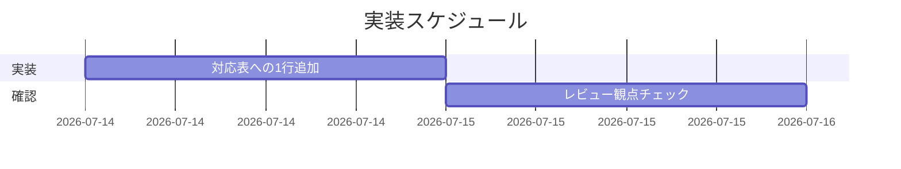

# 実装計画書: システム仕様書処理の opus ティア固定

**プロジェクト名**: システム仕様書処理の opus ティア固定
**作成日**: 2026 年 07 月 14 日
**最終更新**: 2026 年 07 月 14 日

> **重要**: **このドキュメントは常に更新**: 実装計画の変更、進捗状況の更新、バグの記録などがあった場合は、即座にこのドキュメントを更新してください。ドキュメントは「生きているドキュメント」として扱い、実装内容と常に同期させます。
> **必須項目**: 「必須」と明記した欄は空欄・抽象語のみで提出しないこと。テスト観点・BDD 仕様は具体ケースを 1 件以上記載すること。
>
> **用語**: [.agent-skill-chain/source/CONCEPTS.md §用語規約](../../../../../.agent-skill-chain/source/CONCEPTS.md#用語規約) を参照。

---

## 1. 実装概要

### 1.1 実装方針（必須）

`.agent-skill-chain/project/MODEL_TIER_TABLE.md` の「役割 → ティア対応表」に、02_設計 §2.2.1 で確定した 1 行（システム仕様書（docs/ 配下）の処理 → opus（常に opus））を、既存 1 行目（設計・レビュー・監査）の直後・実装行の前へ挿入する。既存 4 行・本文は変更しない。02_設計の方針（2 層境界維持・非裁量固定・独自定義を作らない）と整合させる。

### 1.2 実装順序（必須: 1 件以上）

1. タスク 1: 対応表への 1 行追加（本 issue の唯一の実装タスク）。
2. タスク 2: レビュー観点チェックリストによる自己確認（02_設計 §6.2 と一致）。



---

## 2. タスク分解

### 2.1 タスク 1: MODEL_TIER_TABLE.md の役割→ティア対応表へ 1 行追加

#### 2.1.1 概要（必須）

対応表 1 行目（設計・レビュー・監査）の直後へ、システム仕様書処理＝opus（常に）の行を挿入する。

#### 2.1.2 実装内容（必須: 1 件以上）

- `.agent-skill-chain/project/MODEL_TIER_TABLE.md` §役割 → ティア対応表に、[02_設計 §2.2.1](./02_設計.md) で確定した 1 行を 1 行目（設計・レビュー・監査）の直後・実装行の前に挿入する。挿入する行の正本（役割 / ティア / 選定手順・根拠の完全な文字列）は 02_設計 §2.2.1 の確定行（レンダリング済みの表）を**単一の出典**とし、本計画では再転記しない（転記ドリフト防止・単一責務）。実装時は 02_設計 §2.2.1 の表セルをそのままコピーして挿入する。
- 既存 4 行・本文（opus 要否先行検討／品質最優先／裁量禁止との整合／参照）は変更しない。
- `.agent-skill-chain/source/MODEL_SELECTION.md`（抽象原則）には具体行を追加しない。

#### 2.1.3 テスト観点（必須）

**参照**: 観点の定義は [02_設計 §6](./02_設計.md) を参照。本 issue はドキュメント変更のため、テストは以下のレビュー観点チェックリストで代替する（02_設計 §6.2 と一致・01 の BDD と対応）。

##### 単体（本タスクの具体ケース・必須 1 件以上）

- 追加行の役割列が `システム仕様書（docs/ 配下）の処理`、ティア列が `opus` である（01 UC1-S1「opus に固定される」）。
- 根拠列に「常に opus」「横断的で重要」「一律 opus（非裁量）」「evidence_source: human_decision」が含まれる（01 ストーリー 1 受け入れ基準）。
- 表が 3 列書式（`| 役割 | ティア | 選定手順・根拠 |`）を維持し、行数が 4 → 5 に増える。

##### 結合/API（本タスクの具体ケース・該当時は必須 1 件以上）

- 該当なし（コード API を伴わない）。ただし委譲パケット観点として、進行役が根拠列をそのまま 1 行引用できる粒度であること（01 ストーリー 1「引用できる粒度」）を確認する。

##### E2E/受け入れ（本タスクの具体ケース・未達時は理由記載）

- docs/ 配下の仕様書処理の委譲時、対応表を参照して opus が一意に選ばれる（01 UC1-S1）。自動テスト対象ではないため、レビューで対応表参照経路を確認して代替する。

##### バリデーション（該当する場合の具体ケース）

- 既存 4 行の文言・ティアが無変更（01 ストーリー 2 / UC1-S2 の格下げリスク解消）。
- 「システム仕様書」の定義を独自に追加せず RULES.md / LOAD_POLICY を参照している（独自定義の不在）。
- `source/MODEL_SELECTION.md` に具体行を書いていない（2 層境界・PF 中立性）。

#### 2.1.4 単体テスト仕様（BDD）（必須）

**BDD 形式のテストケース（高レベル仕様）**:

```gherkin
Feature: 役割→ティア対応表への仕様書処理行の追加
  Scenario: 仕様書処理行が opus で追加され委譲時に引用できる
    Given MODEL_TIER_TABLE.md の役割→ティア対応表に既存 4 行がある
    When 「システム仕様書（docs/ 配下）の処理 → opus（常に opus）」の行を 1 行目直後に追加する
    Then 表は 5 行になり、追加行の役割＝システム仕様書処理・ティア＝opus である
    And 追加行の根拠列は委譲パケットに 1 行引用できる粒度である
    And 既存 4 行の文言・ティアは変更されていない
```

**テストコード例（本 issue はドキュメント変更のためレビュー手順で代替）**

```text
# Given: MODEL_TIER_TABLE.md の対応表に既存 4 行がある（git diff で基点を確認）
# When: 1 行目直後に確定行を挿入する
# Then: 表が 5 行・追加行が役割=システム仕様書処理/ティア=opus・既存 4 行が無変更であることを
#       目視 + `git diff` の追加行が 1 行のみ（既存行の変更が無い）で検証する
```

#### 2.1.5 依存関係

- 02_設計 §2.2.1（確定した追加行）に依存する。
- 他タスクへの依存は無い（単一ファイル・1 行の変更）。

#### 2.1.6 見積もり

- **工数**: 約 0.5 時間（追加 + 自己レビュー）。
- **優先度**: 高。

### 2.2 タスク 2: レビュー観点チェックリストによる自己確認

#### 2.2.1 概要（必須）

02_設計 §6.2 のレビュー観点チェックリスト（7 項目）を用いて、追加結果を実装完了前に自己確認する。

#### 2.2.2 実装内容（必須: 1 件以上）

- 02_設計 §6.2 の 7 項目（挿入位置／役割・ティア・根拠内容／既存 4 行無変更／コアに具体行なし／独自定義なし／3 列 5 行書式／裁量禁止整合）を 1 つずつ確認する。
- `git diff` で追加が 1 行のみ・既存行が無変更であることを確認する。

#### 2.2.3 テスト観点（必須）

##### 単体（本タスクの具体ケース・必須 1 件以上）

- チェックリスト 7 項目すべてが充足（○）であること。1 項目でも × なら実装を修正する。

##### 結合/API（該当時は必須 1 件以上）

- 該当なし。

##### E2E/受け入れ（未達時は理由記載）

- 該当なし（レビュー確認タスクのため）。

##### バリデーション（該当する場合の具体ケース）

- `git diff` の追加行数が対応表本体で 1 行、既存行の変更が 0 行であること。

#### 2.2.4 単体テスト仕様（BDD）（必須）

```gherkin
Feature: 追加結果のレビュー観点確認
  Scenario: チェックリスト全項目が充足する
    Given 対応表に仕様書処理行を追加した diff がある
    When 02_設計 §6.2 の 7 項目を確認する
    Then 全項目が充足し、既存 4 行は無変更である
```

```text
# Given: 対応表への追加 diff がある
# When: 02_設計 §6.2 の 7 項目を順に確認する
# Then: 全項目 ○、git diff の既存行変更が 0 であることを確認する
```

#### 2.2.5 依存関係

- タスク 1 の完了に依存する。

#### 2.2.6 見積もり

- **工数**: 約 0.2 時間。
- **優先度**: 高。

---

## テスト観点

本実装計画全体のテスト観点は、02_設計 §6.2 のレビュー観点チェックリスト（7 項目）に集約する。実行時テストは無く、ドキュメント差分のレビューで代替する。各タスクの §2.x.3 に具体ケースを記載済み。01 の BDD（UC1-S1「opus 固定」・UC1-S2「格下げリスク解消」・UC2-S1「本体編集はスコープ管理」）と対応させている。

---

## 単体テスト

コード単体テストは無い（ドキュメント変更）。タスクごとの §2.x.4 の BDD 仕様（対応表への行追加・レビュー確認）をレビュー手順として実施する。

---

## BDD

- タスク 1: 「仕様書処理行が opus で追加され委譲時に引用できる」（§2.1.4）。01 UC1-S1 に対応。
- タスク 2: 「追加結果のレビュー観点確認」（§2.2.4）。01 ストーリー 2・UC2-S1 に対応。

---

## 4. テスト計画

本実装計画では実行時テストを持たず、02_設計 §6.2 のチェックリストと `git diff` レビューで受け入れ基準を確認する。

### 4.1 テストの優先順位

- クリティカル観点: 追加行のティア＝opus・非裁量固定・委譲引用可能（最優先で確認）。
- 回帰観点: 既存 4 行・本文の無変更（後方互換）を必ず確認する。

---

## 5. リスク管理

### 5.1 実装リスク

- **リスク**: 既存 4 行や本文を誤って変更する。
  - **対策**: `git diff` で追加 1 行のみ・既存無変更を確認する（02_設計 §6.2 項目 3・6）。
- **リスク**: `source/MODEL_SELECTION.md` に具体行を書いてしまい 2 層境界を壊す。
  - **対策**: 変更対象を `project/MODEL_TIER_TABLE.md` に限定する（02_設計 §2.1.2）。
- **リスク**: 「システム仕様書」の定義を独自に書き足す。
  - **対策**: RULES.md / LOAD_POLICY を参照する記述に留める（独自定義禁止）。

---

## 6. 参考資料

### プロジェクトドキュメント

- [`02_設計.md`](./02_設計.md) - 設計
- [`01_要件定義.md`](./01_要件定義.md) - 要件定義
- [.agent-skill-chain/project/MODEL_TIER_TABLE.md](../../../../../.agent-skill-chain/project/MODEL_TIER_TABLE.md) - 変更対象

### その他の参考資料

- [.agent-skill-chain/source/MODEL_SELECTION.md](../../../../../.agent-skill-chain/source/MODEL_SELECTION.md) - 抽象原則
- [.agent-skill-chain/source/RULES.md](../../../../../.agent-skill-chain/source/RULES.md) §システム仕様書 - 対象範囲の定義

---

## 7. 前のステップ

この実装計画書は、以下のドキュメントを基に作成されています：

- **前**: [`02_設計.md`](./02_設計.md) - 設計フェーズ

---

## 8. 次のステップ

この実装計画書の承認後、以下のいずれかのステップに進みます：

- **プロジェクトが 1 つの issue（タスク）である場合**: 実装着手前の review-docs（実装前ドキュメントレビュー）を経てから実装フェーズ（execution）に進む。

**用語**: [.agent-skill-chain/source/CONCEPTS.md §用語規約](../../../../../.agent-skill-chain/source/CONCEPTS.md#用語規約) を参照。
