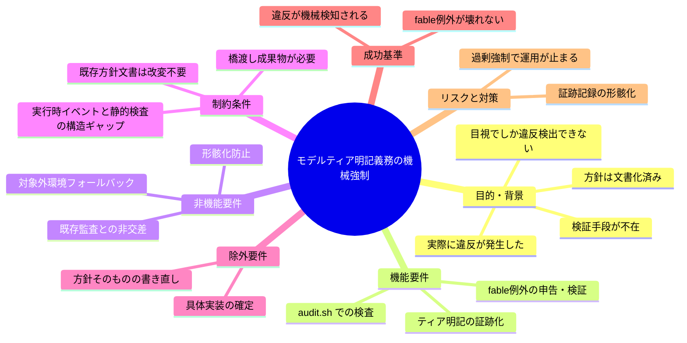
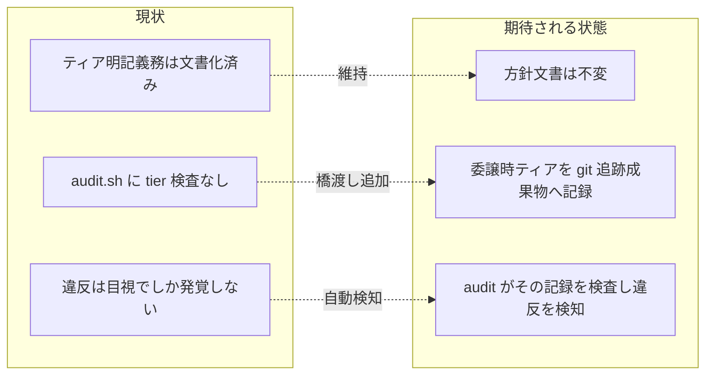

# 要求定義書: モデルティア明記義務の機械強制欠如の是正

**プロジェクト名**: モデルティア明記義務の機械強制欠如の是正
**作成日**: 2026 年 07 月 14 日
**最終更新**: 2026 年 07 月 14 日

> **重要**:
>
> - 要求定義書は、プロジェクトの全体像を把握するためのものです。詳細な技術仕様や実装方法は要件定義書以降で記載します。必要最低限の情報に収めることを心掛けてください。
> - **このドキュメントは常に更新**: 要求の変更や追加があった場合は、即座にこのドキュメントを更新してください。
> - **必須項目**: 「必須」と明記した項目は空欄・抽象語のみで提出しないこと。
>
> **用語**: [.agent-skill-chain/source/CONCEPTS.md §用語規約](../../../../../.agent-skill-chain/source/CONCEPTS.md#用語規約) を参照。

---

## 要求定義の全体像

**注意**: マインドマップは全体像の把握用であり、詳細は各セクションに記載する。

---

## 1. 目的・背景

### 1.1 目的（必須）

ティア明記義務の遵守を機械的に検証・監査する手段を新設する。

### 1.2 背景

- **現状の課題**:
  - `MODEL_SELECTION.md §2` は「サブ委譲時に選定ティアと根拠 1 行を委譲パケットに明示する義務」を定め、`.agent-skill-chain/project/MODEL_TIER_TABLE.md` は役割→ティアの具体対応表（設計・レビュー・監査＝opus／実装＝原則 sonnet・複雑箇所は opus 格上げ／書記＝haiku／fable＝原則禁止だがユーザーが個別 issue を最重要と明示指定した場合のみ例外）を**既に正式ドキュメントとして文書化している**。方針自体はゼロから策定する必要がない。
  - しかし `.agent-skill-chain/source/enforcement/ci/audit.sh` を `fable`・`tier`・`ティア`・`model_tier`・`model_selection`・`opus`・`sonnet`・`haiku` で全文 grep しても**一件もヒットしない**（evidence_source: existing_code、本 issue 作成時に再確認済み）。すなわち、ティア明記義務にせよ対応表の実遵守にせよ、**機械的に監査・検知する仕組みが一切存在しない**。
  - 実際に、別 issue（npx upgrade スキル誤削除, Issue #56）の対応で進行役が「design-feature（opus）→ review-docs（opus）→ implement-feature（sonnet/opus）→ verify-and-close（opus）」と phase 毎にティアを指定して段階委譲すべきところを、**1 回のサブ呼び出しに全フェーズを一括で丸投げし、ティアも明記しない**違反を犯した。この違反は audit.sh のどのチェックにも掛からず、**ユーザーの目視指摘でのみ発覚**した。
  - ユーザーは「各 phase にはスキル・モデル・監査があるため、正しく強制されているべき。これはかなり重要で品質に直結する」と述べ、機械強制の欠如自体を課題として認識している。

- **必要性**:
  - モデルティア選定は品質ゲート（設計・レビュー・監査を opus に固定する等）に直結する。目視監査のみでは違反が常態化し、方針が形骸化するリスクがある。
  - 「文書に書いてあるのに検証手段が無い」という**実効性のギャップ**を、`MODEL_SELECTION.md` の裁量禁止・形骸化防止の趣旨と整合する形で閉じる必要がある。

### 1.3 期待される効果（必須: 1 件以上）

- **効果 1**: ティア未明記・対応表逸脱の委譲が、目視ではなく機械的に検知される（○/×: audit.sh 等の監査経路に tier 関連チェックが 1 件以上存在し、違反ケースで FAIL する）。
- **効果 2**: fable などユーザー指定を尊重する既存の例外規定を壊さない（○/×: fable をユーザーが最重要指定した委譲が、例外申告の記録により FAIL しない）。
- **効果 3**: 既存の方針文書（MODEL_SELECTION.md・MODEL_TIER_TABLE.md）の内容を書き直さずに実効性が付与される（○/×: 両ファイルの方針記述は不変のまま検証層のみが追加される）。

**現状と期待される状態の比較**:

---

## 2. 機能要件

### 2.1 既存機能の維持（該当する場合）

- `MODEL_SELECTION.md`（抽象原則）・`MODEL_TIER_TABLE.md`（対応表・fable 例外行）の記述内容は維持する（本 issue では書き直さない）。
- 既存の audit.sh 各チェック（#3・#8〜#36 等）の挙動は変更せず、tier 検証を**非交差の新規チェック**として追加する方針を前提とする。

### 2.2 新規機能要件

- **委譲時ティア・根拠の証跡化**: 委譲時に選定したティアと根拠 1 行を、git 追跡される成果物（候補: `03_実装計画.md`、memo、あるいは `workflow.db` のログスキーマへのフィールド追加等）に記録する橋渡しの仕組み。
- **監査による検査**: 上記の記録を audit.sh（または相当の監査経路）が検査し、ティア未明記・対応表逸脱・fable の無申告使用を検知する。
- **fable 例外の申告・検証**: fable を用いる場合、「ユーザーが当該 issue を最重要と明示指定した」という例外の申告を検証可能な形で記録し、その記録があるときのみ fable を許容する。

> 上記の具体設計（どの成果物に・どの形式で記録し・audit がどう照合するか、対応表逸脱まで検知するか明記の有無のみ検知するか等）は design-feature 以降の検討事項とし、本要求定義では確定しない。

---

## 3. 非機能要件

### 3.1 パフォーマンス

- audit.sh の 1 回の実行時間を実運用上問題となる水準まで悪化させないこと（既存チェックと同等オーダー）。

### 3.2 セキュリティ

- 特段の新規要件なし。トークン等の秘匿情報を証跡へ残さない既存方針を踏襲する。

### 3.3 互換性

- **対象外環境フォールバック**: `MODEL_SELECTION.md §1` に従い、ティア選択の概念が無い／解決できないランタイム（非 Claude 環境等）では本強制を発火させない（デフォルト動作に委ねる）。GitHub 非採用・DB 非採用時の既存 SKIP 設計と同型のフォールバックを持つこと。
- **既存監査との非交差**: 既存の失敗条件（#3・#29・#32〜#36 等）と検知対象・判定内容が重複しないこと。

### 3.4 保守性

- 対応表（`MODEL_TIER_TABLE.md`）を単一情報源とし、audit 側にティア名・対応をハードコード二重管理しない設計を志向する（詳細は設計で判断）。

---

## 4. 制約条件

### 4.1 技術的制約

- **実行時イベントと静的検査の構造ギャップ（本 issue の核心的難所）**: モデルティア選択は Agent ツール呼び出し時の `model` パラメータという**セッション内の実行時イベント**である。一方 audit.sh は git 追跡ファイルの**静的内容**を検査する仕組みである。両者の間には構造的ギャップがあり、これが「今まで機械強制が無かった」根本理由と考えられる。埋めるには、委譲時に選定ティア・根拠を**どこかの git 追跡成果物**（例: `03_実装計画.md`、memo、`workflow.db` のログスキーマへのフィールド追加）へ記録し、それを audit.sh が検査する、という**橋渡しの仕組み**が必要になる。
- 既存方針文書（MODEL_SELECTION.md・MODEL_TIER_TABLE.md）自体は妥当であり、内容の書き直しは不要。課題は「書かれているのに検証手段が無い」実効性のギャップである。

### 4.2 既存システムとの互換性

- `MODEL_SELECTION.md` の「裁量の禁止と形骸化防止」（裁量上振れ／下振れの禁止、例外経路の日常運用化防止）と整合すること。新設する強制自体が形骸化しない設計とする。
- fable 例外は `MODEL_TIER_TABLE.md` の既存行（ユーザーが個別 issue を最重要と明示指定した場合のみ許容・日常運用化しない）を前提とし、機械強制がこの既存例外規定を**壊さない**こと。かつ例外の申告も検証可能にすること（ユーザー追加要望）。

### 4.3 移行期間・スケジュール

- 既存の enforcement 発効日（grandfather）方式（例: `*_GATE_EFFECTIVE_FROM`）に倣い、遡及適用による既存 issue の一斉 FAIL を避けられる設計とする（詳細は設計判断）。

---

## 5. 除外要件

- **方針そのものの書き直し**: MODEL_SELECTION.md・MODEL_TIER_TABLE.md の方針内容（対応表・fable 例外規定を含む）の変更・再策定は対象外。本 issue は検証層の新設のみを扱う。
- **具体的な機械化手段の確定**: どの成果物へどの形式で記録し audit がどう照合するかの確定は design-feature 以降で行い、本要求定義では確定しない。
- **非 Claude ランタイムでのティア強制**: 対象外環境ではデフォルトに委ね、本 issue の強制対象としない。

---

## 6. 成功基準（必須: 1 件以上）

- ティア明記義務の遵守を検証する監査チェックが 1 件以上新設され、「ティア未明記の委譲」を模したケースで FAIL、正しく明記されたケースで PASS することが確認できる。
- fable をユーザーが最重要指定して使う委譲が、例外申告の記録により FAIL しないことが確認できる（例外規定が壊れていない）。
- MODEL_SELECTION.md・MODEL_TIER_TABLE.md の方針記述が変更されていない（diff で確認できる）。
- 対象外環境（ティア選択概念なし・DB/GitHub 非採用相当）で新チェックが SKIP し、ロックアウトしないことが確認できる。

---

## 7. リスクと対策

### 7.1 技術的リスク

- **リスク**: 実行時イベント（`model` パラメータ）と静的ファイル検査の間の橋渡し成果物が形骸化し、「記録欄を埋めるだけ」の空虚な運用になる。
  - **対策**: `MODEL_SELECTION.md §裁量の禁止と形骸化防止`・`COVERAGE_AND_EXCEPTIONS.md §1.1` の形骸化防止原則を設計に反映する。根拠 1 行に対応表該当行の引用を求める等、内容検査の粒度は設計で判断する。
- **リスク**: audit 側に対応表を二重管理し、`MODEL_TIER_TABLE.md` と乖離する。
  - **対策**: 対応表を単一情報源とする参照方式を検討（設計判断）。

### 7.2 スケジュールリスク

- **リスク**: 過剰強制により既存 PR/委譲フローが不必要に止まる（#36 の CI 限定・grandfather と同様の配慮が要る）。
  - **対策**: 発効日 grandfather・対象外環境 SKIP・非ブロッキング暫定運用等、既存 enforcement の段階導入パターンを踏襲する（設計判断）。

---

## 8. 参考資料

### プロジェクトドキュメント

- [.agent-skill-chain/source/MODEL_SELECTION.md](../../../../../.agent-skill-chain/source/MODEL_SELECTION.md) - ティア選定の抽象原則（§2 ティア明記義務・§裁量の禁止と形骸化防止）
- [.agent-skill-chain/project/MODEL_TIER_TABLE.md](../../../../../.agent-skill-chain/project/MODEL_TIER_TABLE.md) - 役割→ティア対応表（fable 例外行を含む）
- [.agent-skill-chain/source/enforcement/ci/audit.sh](../../../../../.agent-skill-chain/source/enforcement/ci/audit.sh) - CI 監査（現状 tier 関連チェック不在）
- [.agent-skill-chain/source/enforcement/README.md](../../../../../.agent-skill-chain/source/enforcement/README.md) - 失敗条件と差し戻し（#3〜#36）

### その他の参考資料

- 直接の契機: Issue #56（npx upgrade スキル誤削除）対応時の全フェーズ一括委譲・ティア未明記の目視発覚事例

---

## 9. 次のステップ

この要求定義書の承認後、以下のドキュメントを作成します：

- **次**: [`01_要件定義.md`](./01_要件定義.md) - 要件定義フェーズ
