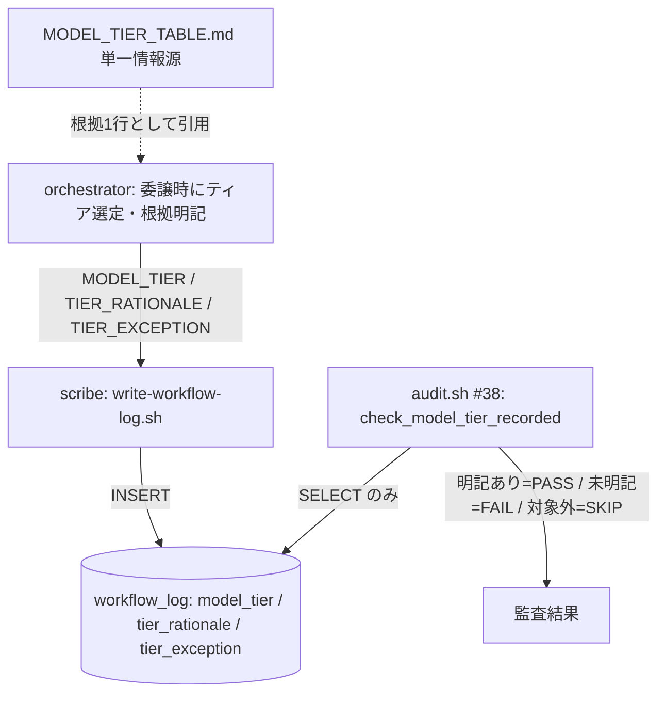
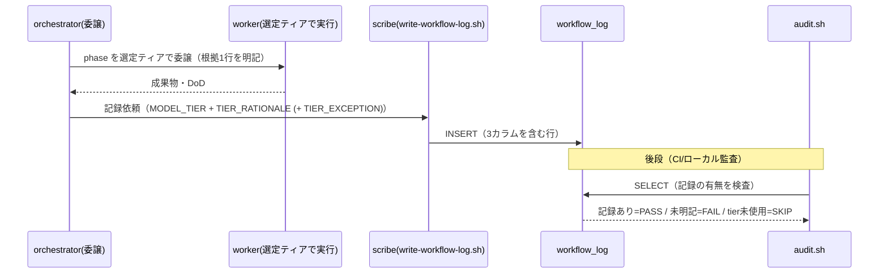
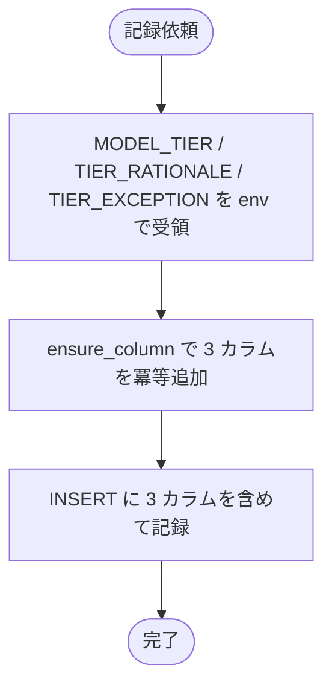
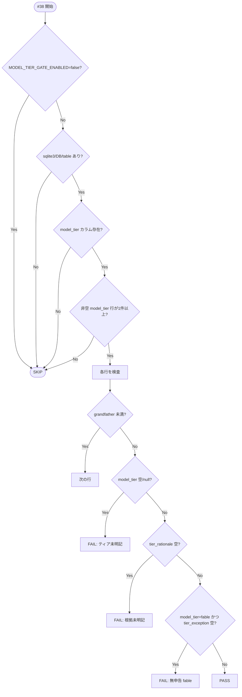

# 設計書: モデルティア明記義務の機械強制欠如の是正

**プロジェクト名**: モデルティア明記義務の機械強制欠如の是正
**作成日**: 2026 年 07 月 14 日
**最終更新**: 2026 年 07 月 14 日

> **重要**: **このドキュメントは常に更新**: 設計の変更や追加があった場合は、即座にこのドキュメントを更新してください。ドキュメントは「生きているドキュメント」として扱い、実装内容と常に同期させます。
>
> **用語**: [.agent-skill-chain/source/CONCEPTS.md §用語規約](../../../../../.agent-skill-chain/source/CONCEPTS.md#用語規約) を参照。

---

## 1. 設計概要

**必須**: 設計方針・原則は [.agent-skill-chain/source/spec/01_設計原則.md](../../../../../.agent-skill-chain/source/spec/01_設計原則.md) を参照した上で、本プロジェクトに適用するものを選び記載する。

### 1.1 設計方針

モデルティア選定は「Agent 呼び出し時の `model` パラメータ」という**セッション内の実行時イベント**であり、git 追跡ファイルの静的内容を検査する `audit.sh` からは直接観測できない。この構造ギャップを、**委譲完了時に書記（scribe）が選定ティア・根拠（＋fable 例外申告）を `workflow.db` の `workflow_log` へ永続化し、`audit.sh` の新規チェック #38 がその記録の有無を検査する**という「橋渡し（記録）＋検証層（監査）」で閉じる。既存の GitHub Issue 起票ゲート（#34）・ブランチ紐づけゲート（#35）と同型の骨格を再利用し、非交差の独立チェックとして追加する。方針文書（`MODEL_SELECTION.md`・`MODEL_TIER_TABLE.md`）は一切書き換えない。

### 1.2 設計原則（本プロジェクトで適用するもの）

- **UNIX哲学**: 新チェックは「委譲行あたりティア記録の有無を検査する」1 つのことだけを行う小さな関数（`check_model_tier_recorded`）として追加し、既存チェックと組み合わせ可能に保つ。
- **単一責務**: 記録面（`workflow_log` のカラム）・記録主体（`write-workflow-log.sh`）・検査主体（`audit.sh #38`）・対応表（`MODEL_TIER_TABLE.md`）の 4 責務を分離する。audit は「明記の有無」のみを判定し、ティアの正しさ判定（役割→ティア）は対応表＋人手/AI レビューに委ねる。
- **明確な境界**: 書き込み経路（orchestrator → scribe → `workflow_log`）と読み取り経路（`audit.sh` → `workflow_log`）を明確に分離する。
- **CQRS**: 記録（scribe の `INSERT`）は Command、監査（`audit.sh` の `SELECT`）は Query。監査は `workflow.db`・ファイルシステムへ一切書き込まない（副作用なし）。
- **AIフレンドリー設計**: 既存 #34/#35 と同一命名・同一ガード順・同一パース手順に揃え、意図が読み取れる関数名（`check_model_tier_recorded`）・env 名（`MODEL_TIER_GATE_*`）を用いる。

---

## 2. アーキテクチャ設計

### 2.1 責務・境界・参照関係

#### 2.1.1 責務一覧

| コンポーネント | 責務（1 文） |
| -------------- | ------------ |
| `ledger/schema.sql` | `workflow_log` に `model_tier` / `tier_rationale` / `tier_exception` の 3 カラムを持たせるスキーマ正本を定義する。 |
| `scripts/write-workflow-log.sh` | 委譲パケットから渡された選定ティア・根拠・fable 例外を、冪等マイグレーション（`ensure_column`）で用意した 3 カラムへ `INSERT` する。 |
| `enforcement/ci/audit.sh` の `check_model_tier_recorded`（#38） | `workflow_log` の各行についてティア記録の有無を検査し、未明記・無申告 fable を FAIL、対象外環境を SKIP する（Query のみ）。 |
| `.agent-skill-chain/project/MODEL_TIER_TABLE.md` | 役割→ティアの対応（正しさの判断基準）を保持する**単一情報源**。audit 側へは転記しない。 |
| `skills/agent/run_command.md`・`skills/logging/write-workflow-log/SKILL.md` | 委譲パケットで明記したティア・根拠を scribe へ配線する義務（規約面）を記す。 |
| `enforcement/README.md` | 失敗条件 #38 を 3 表＋散文の体裁に沿って追記する。 |

#### 2.1.2 境界

- **入力**: 委譲パケットに明記された選定ティア（`opus`/`sonnet`/`haiku`/`fable` 等）と根拠 1 行（`MODEL_TIER_TABLE.md` の該当行の引用）。fable の場合は例外申告（ユーザーが当該 issue を最重要と明示指定した旨）。
- **出力**: `workflow_log` の 3 カラムへの永続記録と、`audit.sh #38` の PASS / FAIL / SKIP 判定。
- **他責務との境界（範囲外）**: (a) ティアの**正しさ**（設計に opus が使われたか等）の照合は行わない＝**明記の有無のみ**を検査する。(b) `MODEL_SELECTION.md`・`MODEL_TIER_TABLE.md` の方針内容の改変は行わない。(c) ユーザーが実際に「最重要」と指定したかの事実照合（内容妥当性）は機械検知の対象外とし、人手/AI レビューに委ねる（#34 の declined 理由内容と同型）。

#### 2.1.3 参照関係

- orchestrator（委譲時にティア選定）→ scribe（`write-workflow-log.sh` 実行）→ `workflow_log`（記録）。
- `audit.sh #38` → `workflow_log`（読み取りのみ）。→ 循環参照なし。
- `write-workflow-log.sh` と `audit.sh #38` は互いを呼ばず、`workflow_log` のカラム名（`model_tier`/`tier_rationale`/`tier_exception`）のみを契約点として共有する。`MODEL_TIER_TABLE.md` はどちらからも**内容を転記されない**（人間・AI が根拠 1 行として引用する参照先）。

### 2.2 システムアーキテクチャ

- **採用パターン**: CQRS＋イベント記録（Command で状態を記録し、Query で監査する）。
- **根拠**: 実行時イベント（`model` 選定）を「起きた事実」として `workflow_log` に記録し（イベント駆動・[01_設計原則 §イベント駆動](../../../../../.agent-skill-chain/source/spec/01_設計原則.md#イベント駆動)）、監査は副作用のない Query として分離する（[06_設計判断の優先順位](../../../../../.agent-skill-chain/source/spec/06_設計判断の優先順位.md) の可読性・単一責務・仕様整合を優先）。既存 #34/#35 が同パターンで実装済みのため一貫性が高い（evidence_source: existing_code）。

#### 2.2.1 CQRS（Command/Query 分離）

- **Command**: scribe が `write-workflow-log.sh` 経由で `workflow_log` に選定ティア・根拠・fable 例外を `INSERT` する（状態変更）。
- **Query**: `audit.sh #38` が `workflow_log` を `SELECT` して記録の有無を判定する（状態取得のみ・DB/FS へ書き込まない）。

#### 2.2.2 アーキテクチャ図（本プロジェクトの構成で記載）

### 2.3 コンポーネント構成

- **記録層（Command 側）**: `ledger/schema.sql`（スキーマ正本）＋ `scripts/write-workflow-log.sh`（`ensure_column` による冪等マイグレーションと `INSERT`）。
- **検証層（Query 側）**: `enforcement/ci/audit.sh` の `check_model_tier_recorded`（#38）。既存 `audit_has_column`・`ts_to_epoch`・`WORKFLOW_SCAN_DIRS`・`ROLLBACK_MSG`・`EXIT_CODE` を再利用する。
- **規約・文書層**: `run_command.md`／`write-workflow-log/SKILL.md`（配線義務）、`enforcement/README.md`（失敗条件体裁）、`MODEL_TIER_TABLE.md`（単一情報源・**内容は不変**）。
- 各コンポーネントは単一責務を満たし、契約点は `workflow_log` の 3 カラム名のみ（[01_設計原則 §明確な境界・§単一責務](../../../../../.agent-skill-chain/source/spec/01_設計原則.md)）。

### 2.4 データフロー

イベントは「起きた事実」＝**委譲が或るティアで実行された**という事実を表す（例: `PhaseDelegatedAtTier`）。委譲完了時に scribe がその事実を `workflow_log` に記録し、後段で audit がその記録の有無を検査する。

### 2.5 横断設計判断（ADR）

#### ADR-1: 橋渡し成果物を `workflow.db`（`workflow_log` の新カラム）とする

- **コンテキスト**: 実行時イベント（`model` パラメータ）を静的検査可能にするための記録先が必要。00 §2.2 は候補として `03_実装計画.md`・memo・`workflow.db` スキーマ拡張を挙げる。ティア選定は phase ごと（設計=opus／実装=sonnet／レビュー・監査=opus／書記=haiku）に異なる**委譲単位（per-command）の事実**である。
- **検討した選択肢**: (A) `workflow_log` に per-row のカラム追加、(B) `03_実装計画.md` frontmatter の単一フィールド、(C) memo（過渡的スクラッチ）。
- **決定**: (A) `workflow_log` の新カラム。
- **根拠**: `workflow_log` は既に「1 委譲コマンド＝1 行」で `actor_role`/`delegated_by_role`/`command` を記録しており、ティアは同じ委譲イベントの自然な属性である（evidence_source: existing_code＝`ledger/schema.sql:7-56`）。(B) は per-issue 単数フィールドのため design=opus と implement=sonnet を同時に保持できず、per-phase を表現するには入れ子構造の発明が必要になり可読性・単一責務を損なう。(C) memo は非追跡・過渡的スクラッチで**正本ではない**（`.agent-skill-chain/project/自己拡張ワークフロー.md` §memo）ため監査の記録面に不適。既存 #29/#32/#33 が `workflow_log` を記録面として監査する前例があり一貫する。
- **帰結**: 記録面は `workflow.db`（本則証跡）。git 追跡は機械強制の前提ではない（audit は DB を直接読む＝#29/#32-#35 と同一）。00 の「git 追跡成果物へ記録」という表現は候補列挙の緩い言い回しであり、本 issue は**監査可能な永続記録**という趣旨を `workflow_log` で満たす（方針文書の書き換えは伴わない）。

#### ADR-2: 記録主体は scribe。入力契約を 3 つの env で拡張し、`ensure_column` で冪等マイグレーションする

- **コンテキスト**: ティアを選定するのは委譲時の orchestrator だが、`workflow_log` へ書けるのは scribe（`write-workflow-log.sh`）に限られる（PreToolUse R5・schema の `CHECK(actor_role='scribe')`）。
- **検討した選択肢**: (A) 既存 env 入力方式に倣い `MODEL_TIER`/`TIER_RATIONALE`/`TIER_EXCEPTION` を追加、(B) 位置引数を追加、(C) 別テーブルに分離。
- **決定**: (A)。`REVIEW_PATH`/`CHANGED_FILES_JSON` と同じ env 経由入力（`write-workflow-log.sh` の既存パターン）で受け取り、`ensure_column`（既存の冪等 `ALTER TABLE ... ADD COLUMN ... TEXT NULL`）で 3 カラムを保証してから `INSERT` に含める。
- **根拠**: env 入力・`ensure_column` は既存実装で確立済み（evidence_source: existing_code＝`write-workflow-log.sh` の `ENTRY_ID`/`REVIEW_PATH` 群と `ensure_column`。schema 正本にも同カラムを追記し新規 DB は初めから保持）。位置引数(B)は後方互換を崩す。別テーブル(C)は per-row 1:1 のため過剰分割で単一責務・可読性に劣る。
- **帰結**: 既存 DB は次回記録時に 3 カラムが冪等追加され、既存行は `NULL`（＝grandfather 対象）。委譲パケットで既に必須の「ティア明記」（`run_command.md:68`）を scribe へ渡すだけで、新たな明記負担を増やさない。

#### ADR-3: audit #38 は「明記の有無」のみを検査する（対応表と照合しない）

- **コンテキスト**: 非機能 3.4 は「対応表を単一情報源とし audit 側に二重管理しない」ことを要求。
- **検討した選択肢**: (A) 記録の有無（＋fable は例外申告の有無）のみ検査、(B) 役割→ティアの正しさまで audit で照合。
- **決定**: (A)。
- **根拠**: (B) は `MODEL_TIER_TABLE.md` の対応（役割→ティア）を audit に転記する必要があり二重管理・乖離リスクを生む（非機能 3.4 違反）。#35（ブランチ）が「記録の有無のみ・実ブランチ名と照合しない」設計を採る前例と同型（evidence_source: existing_code＝`audit.sh check_branch_linkage_before_implement`）。
- **帰結**: 「opus 相当役割に haiku を記録した」等の**内容逸脱**は #38 では検知しない（既知の限界）。それは対応表＋人手/AI レビュー（設計・監査＝opus）の責務に留め、機械層は形骸化しない最小核（明記の欠落・無申告 fable）に集中する。

#### ADR-4: fable 例外は `tier_exception` カラムで申告し、理由必須（#34 declined 同型）

- **コンテキスト**: fable は原則禁止だが、ユーザーが個別 issue を最重要と明示指定した場合のみ都度例外で許容する（`MODEL_TIER_TABLE.md`）。例外申告自体も検証可能に記録する（ユーザー追加要望）。
- **検討した選択肢**: (A) `tier_exception` に非空の例外理由を記録し、`model_tier=fable` のとき非空を必須化、(B) fable を一律 FAIL（例外を潰す）、(C) fable を無検査。
- **決定**: (A)。`model_tier` が `fable`（大小文字不問）の行は `tier_exception` が非空でなければ FAIL。非空なら PASS。
- **根拠**: #34 の「`declined: <非空の理由>` なら PASS・理由なし declined は FAIL」で空虚なバイパスを防ぐ設計と同型（evidence_source: existing_code＝`audit.sh check_github_issue_before_implement` の declined 判定）。(B) は既存の fable 例外規定を壊す（成功基準・4.2 違反）。(C) は無申告 fable 濫用を許し形骸化する。
- **帰結**: 無申告 fable は検知され、申告ありの fable は許容される。理由の内容妥当性（本当に最重要指定だったか）は機械検知外＝人手監査に委ねる（ADR-3・2.1.2(c) と整合）。

#### ADR-5: 対象外環境フォールバックは多層ガードで、非 Claude/tier 未使用ではロックアウトしない

- **コンテキスト**: `MODEL_SELECTION.md §1` に従い、ティア選択の概念が無い/解決できないランタイムでは強制を発火させない。かつ「tier 未記録の非 Claude 環境」を「tier 対応だが記録し忘れた環境」と誤って一律 FAIL してはならない。
- **検討した選択肢**: (A) 段階ガード（トグル→DB 無→カラム無→tier 全 NULL の fail-open）、(B) 明示 env のみで opt-out、(C) 消費者に必ず opt-out 設定を要求。
- **決定**: (A)。以下の順で SKIP を評価し、いずれにも該当しない場合のみ per-row 検査する。
  1. `MODEL_TIER_GATE_ENABLED`（既定 `true`）が `false`/`0`/`no`/`off` → SKIP（最優先ガード）。
  2. `sqlite3` 不在／`workflow.db` 不在／`workflow_log` テーブル不在 → SKIP。
  3. `model_tier` カラムが存在しない（`audit_has_column`）→ SKIP（スキーマ未マイグレーション＝未採用）。
  4. スコープ内に `model_tier` が非空の行が 1 件も存在しない → SKIP（tier 未使用＝対象外/非 Claude 運用と判定）。
- **根拠**: 段階 4 の「非空記録が皆無なら SKIP」は #36 の「差分内に残存対象が無ければ SKIP」と同型の安全側 fail-open（evidence_source: existing_code＝`audit.sh check_pr_issue_linkage`）。tier 対応ランタイムは多数行が記録済みとなり、記録漏れの行だけが浮かぶ（自己較正）。(B)(C) は `MODEL_SELECTION.md §1` の「対象外環境はデフォルトに従う＝設定不要」に反する。
- **帰結**: 非 Claude/tier 未採用ではチェック全体が SKIP しロックアウトしない。tier 対応環境で一部行のみ未記録なら、その行が FAIL する。SKIP はログに明示する（ストーリー 4 受け入れ基準）。ブートストラップ時（初回委譲で先行記録が無い）は段階 4 で SKIP に倒れる＝安全側の弱点として許容（grandfather と併せ既存 issue 一斉 FAIL を回避）。

#### ADR-6: grandfather（`MODEL_TIER_GATE_EFFECTIVE_FROM`）で遡及一斉 FAIL を避ける

- **コンテキスト**: カラム新設により既存行は全て `NULL`。発効日以前の issue を遡及 FAIL させない。
- **検討した選択肢**: (A) 既存 `*_GATE_EFFECTIVE_FROM` と同型の env で発効日を設ける、(B) grandfather なし。
- **決定**: (A) `MODEL_TIER_GATE_EFFECTIVE_FROM`（既定 `20260714_000000`）。行の `issue_path` basename の `YYYYMMDD_HHMMSS_` プレフィックスが cutoff 未満なら対象外。プレフィックス非該当は判定不能として素通り（誤 FAIL を出さない安全側）。
- **根拠**: #32/#33/#34/#35 の grandfather と完全同型（evidence_source: existing_code）。ADR-5 段階 4 の fail-open と二重の安全網になる。
- **帰結**: 本 issue（`20260714_204451_...`）が適用第一号。既存 issue の一斉 FAIL は起きない。
- **自己言及的境界ケース（04_review で追記・受容判断）**: 上記「既存 issue の一斉 FAIL は起きない」は**他の**既存 issue を指す記述であり、**本 issue 自身の先行フェーズのログ**は射程外だった。本 issue の scribe 配線（T3）完了前に記録された `design-feature` ×2・`review-docs` ×2 の 4 行は `model_tier=NULL` かつ `issue_path` プレフィックス `20260714_204451` が cutoff `20260714_000000` 以降のため grandfather されない。さらに本 issue の `implement-feature`（`model_tier=sonnet`）が ADR-5 段階 4 の「非空 model_tier 行が 1 件以上」を満たすため #38 が SKIP から実働へ転じ、当該 4 行が「ティア未明記」で FAIL する（実プロジェクト `workflow.db` に対する実測で確認済み）。これは #38 が genuinely 未記録の行を正しく検出した結果であり誤検知ではない。**判断: 受容する（対処実装は行わない）。** 根拠: (a) 本リポの #38 は DB 系チェックであり workflow.db 非追跡＋`self-enforce.yml` の `continue-on-error` により CI では inert（§9.3）で実害がない。(b) `workflow_log` は append-only のハッシュチェーン証跡（`prev_hash`/`entry_hash`・書記単独 INSERT）であり、既存 4 行を遡及 backfill するとチェーン不変性を壊すため remediation の方が高リスク（スコープ外の除外要件「方針の書き直し・過剰な追加実装」に抵触）。(c) 5 行が同一 `issue_path` プレフィックスを共有するため、grandfather cutoff では先行 4 行のみを分離できない（cutoff を上げると implement 行も除外され #38 が本 issue に一切適用されなくなり自己検証性を失う）。本ケースは ADR-5 帰結が既に明記する「ブートストラップ時は段階 4 で SKIP に倒れる＝安全側の弱点として許容」の**裏面**（初回の非空記録が本 issue 自身の implement 行である瞬間）に相当する既知の事象である。evidence_source: existing_code（`schema.sql` のハッシュチェーン列・`write-workflow-log.sh` の scribe 単独 INSERT）＋ observed_runtime（実 `workflow.db` に対する #38 行走査の再現）＋ 02 §9.3（CI inert の申し送り）。

#### ADR-7: 既存監査（#3・#8・#12/#13・#29・#32-#37）との非交差

- **コンテキスト**: 非機能 3.3「既存の失敗条件と検知対象・判定内容が重複しないこと」。
- **検討した選択肢**: (A) 新カラム（`model_tier`/`tier_rationale`/`tier_exception`）のみを判定対象とする独立チェック、(B) 既存チェックへ条件を相乗り。
- **決定**: (A) `check_model_tier_recorded` を独立関数として追加し、末尾の呼び出し列（`audit.sh:1375-1385`）へ 1 行追加する。
- **根拠**: #8 は `command`/`summary`/`ts_utc` の妥当性、#12/#13 は `actor_role`/`delegated_by_role`、#34/#35 は 00 frontmatter の `github_issue`/`branch`、#32 は `review-docs` ログの有無を検査する。#38 が検査するのは新設の 3 カラムのみで、対象カラム・判定内容が既存のどれとも重ならない（evidence_source: existing_code＝各 check の SELECT 対象カラム）。
- **帰結**: 既存チェックの挙動・SKIP 条件は不変。#38 は追加のみで置換・弱化しない。

#### ADR-8: 検査の走査単位は「issue ファイル」ではなく「`workflow_log` の行」

- **コンテキスト**: #34/#35 は 00 ファイルを走査する（per-issue 単数値）。ティアは per-command の事実。
- **検討した選択肢**: (A) `workflow_log` の行を走査、(B) issue ごとに代表 1 ティアを 00 に記録。
- **決定**: (A)。gated 対象は全 worker command 行（`command` は schema の `CHECK` により worker command に限定済み）。grandfather は各行の `issue_path` basename プレフィックスで判定。
- **根拠**: (B) は per-phase の多ティアを 1 issue に潰せない（ADR-1 と同根）。行単位検査により「設計=opus・実装=sonnet」を各行独立に担保できる。
- **帰結**: #38 は本フレームワーク初の「ログ行単位」ゲート。`issue_path` が空/非プレフィックスの行は素通り（安全側）。

---

## 3. 機能設計

### 3.1 機能 1: 委譲ティアの記録（Command 側）

#### 3.1.1 概要

scribe が委譲完了時に、選定ティア・根拠・fable 例外を `workflow_log` の 3 カラムへ記録する。

#### 3.1.2 処理フロー

#### 3.1.3 入力・出力

- **入力**: env `MODEL_TIER`（例: `opus`）、`TIER_RATIONALE`（対応表該当行の引用 1 行）、`TIER_EXCEPTION`（fable 時のみ・ユーザー最重要指定の記録）。いずれもスクリプト層では任意（未指定は `NULLIF` で `NULL`）とし、非 tier ランタイムの既存呼び出しを壊さない。
- **出力**: `workflow_log` の当該行に `model_tier`/`tier_rationale`/`tier_exception` が格納される。

#### 3.1.4 エラーハンドリング

- 3 カラムは全て `TEXT NULL`・追加検証はスクリプト層で行わない（値の妥当性判定は監査 #38 に集約＝単一責務）。トークン等の秘匿情報は根拠・例外に含めない（既存方針踏襲・§8.2）。

### 3.2 機能 2: 委譲ティア記録の監査（Query 側・#38）

#### 3.2.1 概要

`audit.sh` の `check_model_tier_recorded` が `workflow_log` の各行を検査し、未明記・無申告 fable を FAIL、対象外環境を SKIP する。

#### 3.2.2 処理フロー

#### 3.2.3 入力・出力

- **入力**: `workflow_log`（`entry_id`/`issue_path`/`command`/`model_tier`/`tier_rationale`/`tier_exception`）、env（`MODEL_TIER_GATE_ENABLED`・`MODEL_TIER_GATE_EFFECTIVE_FROM`）。
- **出力**: FAIL 時は `EXIT_CODE=1` と違反行を特定する FAIL メッセージ（`entry_id`/`issue_path`/`command` を含む）＋ `ROLLBACK_MSG`。SKIP 時は `SKIP:` を stderr へ明示。

#### 3.2.4 エラーハンドリング

- `sqlite3`/DB/table/カラム不在・tier 全 NULL・`ts` 解析不能は全て fail-open（SKIP／素通り）。監査は Query のみで DB/FS へ書き込まない。

---

## 4. データ設計

### 4.1 データモデル

`workflow_log` に 3 カラムを追加する（既存 18 カラムは不変）。

#### テーブル一覧

| テーブル名 | 説明 | 主キー |
| ---------- | ---- | ------ |
| workflow_log | 委譲コマンドの実行証跡。本 issue で 3 カラム追加。 | entry_id |

#### テーブル詳細

##### workflow_log（追加分のみ）

| カラム名 | 型 | NULL | デフォルト | 説明 | 備考 |
| -------- | -- | ---- | ---------- | ---- | ---- |
| model_tier | TEXT | YES | NULL | 当該委譲コマンドを実行したモデルティア（`opus`/`sonnet`/`haiku`/`fable` 等） | #38 検査対象 |
| tier_rationale | TEXT | YES | NULL | ティア選定の根拠 1 行（`MODEL_TIER_TABLE.md` 該当行の引用） | #38 検査対象 |
| tier_exception | TEXT | YES | NULL | fable 使用時の例外申告（ユーザー最重要指定の記録） | fable 時のみ必須 |

- スキーマ正本（`ledger/schema.sql`）へ 3 カラムを追記し、新規 DB は初めから保持する。既存 DB は `write-workflow-log.sh` の `ensure_column` で次回記録時に冪等追加される（ADR-2）。
- `model_tier` に部分索引を任意で付与してよいが必須ではない（ADR-5 段階 4 の非空存在確認は少数行の EXISTS で足りる）。

### 4.2 データ構造

3 カラムは全て自由記述の `TEXT NULL`。値の意味付け（fable→例外必須等）は監査 #38 が判定し、スキーマ側で `CHECK` 制約は課さない（非 tier ランタイムの `NULL` 記録を許容するため・ADR-5）。

---

## 5. インターフェース設計（契約）

> 本 issue に HTTP API は無い。ここでは各コンポーネント間の**契約（インターフェース）**を定義する。

### 5.1 契約一覧

| 契約点 | 提供側 | 利用側 | 説明 |
| ------ | ------ | ------ | ---- |
| `workflow_log` 3 カラム | `ledger/schema.sql` | 記録・監査 | カラム名・型の唯一の合意点 |
| env 入力 `MODEL_TIER` 群 | `write-workflow-log.sh` | orchestrator/scribe | 記録値の受け渡し |
| `check_model_tier_recorded`（#38） | `audit.sh` | CI/ローカル監査 | 記録有無の検査 |
| 委譲パケット→scribe 配線 | `run_command.md`/`SKILL.md` | orchestrator | 明記済みティアを記録へ流す義務 |
| 失敗条件 #38 の文書化 | `enforcement/README.md` | 人間/監査 | 差し戻し先の明示 |

### 5.2 契約詳細

#### 契約 1: `write-workflow-log.sh` の env 入力拡張

- **入力**: `MODEL_TIER`・`TIER_RATIONALE`・`TIER_EXCEPTION`（既存 `REVIEW_PATH` 等と同じ env 入力方式）。
- **処理**: `ensure_column` で 3 カラムを保証し、新スキーマ `INSERT` 文に `NULLIF('$E_MT','')` 等で追加。
- **後方互換**: 未指定時は `NULL`。既存の位置引数・必須検証（`DOCUMENT_ID` 等）は不変。

#### 契約 2: `audit.sh` `check_model_tier_recorded`（#38）

- **署名**: 引数なしのシェル関数。末尾の呼び出し列（`audit.sh:1375-1385` 相当）へ `check_model_tier_recorded` を 1 行追加。
- **入力**: `workflow_log`、`MODEL_TIER_GATE_ENABLED`（既定 true）、`MODEL_TIER_GATE_EFFECTIVE_FROM`（既定 `20260714_000000`）。
- **出力**: 違反行ごとに FAIL（`EXIT_CODE=1`）／対象外は SKIP。判定は §3.2.2 のとおり。ティアの正しさは判定しない（ADR-3）。

#### 契約 3: 委譲パケット→scribe の配線（規約）

- `run_command.md §Constraints`（既に「委譲時のティア明記」を規定＝`:68`）と `write-workflow-log/SKILL.md` に、**明記したティア・根拠（＋fable 例外）を scribe への記録依頼で `MODEL_TIER`/`TIER_RATIONALE`/`TIER_EXCEPTION` として渡す**旨を追記する。方針文書（`MODEL_SELECTION.md`/`MODEL_TIER_TABLE.md`）は変更しない。

---

## 6. テスト戦略

テスト戦略の観点定義は [RULES.md のテスト戦略必須要件](../../../../../.agent-skill-chain/source/RULES.md#テスト戦略必須要件) を、BDD 形式の定義は [TEST_BDD_FORMAT.md](../../../../../.agent-skill-chain/source/TEST_BDD_FORMAT.md) を参照する。本節では対象ごとのテスト割当のみ記載する。

### 6.1 対象ごとのテスト割り当て

| 対象 | 単体 | 結合/API | E2E | クリティカル観点 | バリデーション観点 | 未達理由/補足 |
| ---- | ---- | -------- | --- | ---------------- | ------------------ | ------------- |
| `write-workflow-log.sh`（3 カラム記録） | ○ | ○ | × | 3 カラムが INSERT され取得できる／既存 DB へ ensure_column で冪等追加 | env 未指定時 NULL・既存呼び出し不破壊 | E2E は監査側 #38 の結合で担保 |
| `audit.sh #38`（ティア未明記→FAIL） | ○ | ○ | × | 未明記行で FAIL・明記行で PASS | 空/null/`~`/欠落の判定 | 隔離 DB（mktemp）で検証 |
| `audit.sh #38`（fable 申告検証） | ○ | ○ | × | 申告あり fable=PASS・無申告 fable=FAIL | `tier_exception` 空/非空 | #34 declined 同型 |
| `audit.sh #38`（対象外環境 SKIP） | ○ | ○ | × | toggle off／DB 無／カラム無／tier 全 NULL で SKIP・ロックアウトしない | grandfather 未満で素通り | 段階ガードごとに 1 ケース |
| 非交差・方針不変 | × | ○ | × | 既存 #3/#8/#32-#37 の挙動不変 | `MODEL_SELECTION.md`/`MODEL_TIER_TABLE.md` の diff 空 | 回帰＋diff 確認 |

### 6.2 監査・レビューでの確認（証跡）

証跡の確認観点は RULES §テスト戦略必須要件・`workflow/PHASES.md` の監査観点を参照。本設計 §6.1 の割当と 03_実装計画のタスク別テスト観点・BDD（01 の BDD シナリオ UC1〜UC3 に対応）が揃っていることを確認する。

---

## 7. UI 設計

該当なし（CLI/CI 監査・記録層のみで UI を持たない）。

---

## 8. セキュリティ設計

### 8.1 認証・認可

`workflow_log` への書き込みは scribe（PreToolUse R5 で `write-workflow-log.sh` 単独のみ許可）に限定される既存制約を踏襲する。#38 は読み取りのみで権限を要さない。

### 8.2 データ保護

トークン等の秘匿情報を `model_tier`/`tier_rationale`/`tier_exception`・memo・ログへ残さない（既存方針踏襲・非機能 3.2）。根拠 1 行は対応表該当行の引用に限り、機微情報を含めない。

---

## 9. 非機能要件への対応

### 9.1 パフォーマンス

#38 は少数の `SELECT`（非空存在確認 1 回＋行走査）で構成し、既存 #34/#35 と同等オーダー。既存チェックの実行時間を実運用上問題となる水準まで悪化させない（非機能 3.1）。

### 9.2 可用性

多層フォールバック（ADR-5）＋grandfather（ADR-6）により、対象外環境・DB 非採用・非 Claude ランタイムで SKIP し、ロックアウト・黙認通過のいずれもしない（非機能・ストーリー 4）。

### 9.3 本リポ CI での実効性限界（申し送り・#35/#36 と同型）

#38 は `workflow_log` を読む **DB 系チェック**であり、`enforcement/README.md`（`:224`）が明記するとおり、**workflow.db が Git 非追跡のためクリーンな CI checkout では DB 系チェック（`#3`・`#8`–`#25`・`#29`・`#31`–`#35`、本 issue で `#38` が加わる）は常に SKIP される**。加えて本リポジトリの CI（`.github/workflows/self-enforce.yml`）は audit step を `continue-on-error`（非ブロッキング）で呼ぶ（`.agent-skill-chain/project/自己拡張ワークフロー.md §3.5`）。したがって **#38 は本リポ CI では現状 inert（SKIP＝実効的な検知が働かない）**である。#38 が実効化されるのは、workflow.db を持ち込む消費者ランタイム側の CI／ローカル pre-push フック（`enforcement/ci/pre-push.example`）である。本リポで #38 を CI ブロッキング化する（workflow.db の CI 追跡・`continue-on-error` 除去）ことは #35/#36 の申し送り（自己拡張ワークフロー.md §3・§3.5）と同じく**本 issue のスコープ外**であり、将来の別 issue／ユーザー判断に委ねる。この限界は `enforcement/README.md` の「CI audit は最後の砦」原則との文言差を意図的な暫定状態として整理した既存の申し送りと同一射程である。

---

## 10. 参考資料

### プロジェクトドキュメント

- [`01_要件定義.md`](./01_要件定義.md) - 要件定義
- [.agent-skill-chain/source/MODEL_SELECTION.md](../../../../../.agent-skill-chain/source/MODEL_SELECTION.md)
- [.agent-skill-chain/project/MODEL_TIER_TABLE.md](../../../../../.agent-skill-chain/project/MODEL_TIER_TABLE.md)
- [.agent-skill-chain/source/enforcement/ci/audit.sh](../../../../../.agent-skill-chain/source/enforcement/ci/audit.sh)
- [.agent-skill-chain/source/ledger/schema.sql](../../../../../.agent-skill-chain/source/ledger/schema.sql)
- [.agent-skill-chain/source/scripts/write-workflow-log.sh](../../../../../.agent-skill-chain/source/scripts/write-workflow-log.sh)
- [.agent-skill-chain/source/enforcement/README.md](../../../../../.agent-skill-chain/source/enforcement/README.md)

### その他の参考資料

- 既存の同型ゲート: #34（`check_github_issue_before_implement`）・#35（`check_branch_linkage_before_implement`）・#36（`check_pr_issue_linkage`）

---

## 11. 前のステップ

- **前**: [`01_要件定義.md`](./01_要件定義.md) - 要件定義フェーズ

---

## 12. 次のステップ

- **次**: [`03_実装計画.md`](./03_実装計画.md) - 実装計画フェーズ
