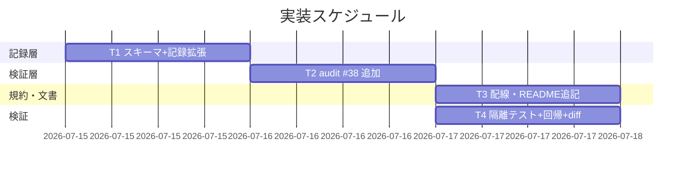
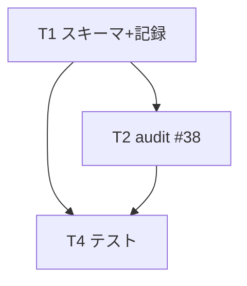

# 実装計画書: モデルティア明記義務の機械強制欠如の是正

**プロジェクト名**: モデルティア明記義務の機械強制欠如の是正
**作成日**: 2026 年 07 月 14 日
**最終更新**: 2026 年 07 月 14 日

> **重要**: **このドキュメントは常に更新**: 実装計画の変更、進捗状況の更新、バグの記録などがあった場合は、即座にこのドキュメントを更新してください。
> **必須項目**: 「必須」と明記した欄は空欄・抽象語のみで提出しないこと。テスト観点・BDD 仕様は具体ケースを 1 件以上記載すること。
>
> **用語**: [.agent-skill-chain/source/CONCEPTS.md §用語規約](../../../../../.agent-skill-chain/source/CONCEPTS.md#用語規約) を参照。

---

## 1. 実装概要

### 1.1 実装方針（必須）

02_設計に従い「記録層（scribe が `workflow_log` へ 3 カラム記録）＋検証層（`audit.sh #38` が記録有無を検査）」を、既存 #34/#35 と同型・非交差で追加する。方針文書（`MODEL_SELECTION.md`/`MODEL_TIER_TABLE.md`）は変更せず、検証層のみを新設する。

### 1.2 実装順序（必須: 1 件以上）



タスク優先順: T1（記録層）→ T2（検証層）→ T4（テスト）を主線とし、T3（文書配線）は T2 と並行可。

---

## 2. タスク分解

**必須**: 各タスクには「テスト観点」（2.x.3）と「単体テスト仕様（BDD）」（2.x.4）を必ず記載する。

### 2.1 タスク 1: スキーマ拡張と scribe 記録（Command 側）

#### 2.1.1 概要（必須）

`workflow_log` に `model_tier`/`tier_rationale`/`tier_exception` の 3 カラムを追加し、scribe が env 入力から記録できるようにする。

#### 2.1.2 実装内容（必須: 1 件以上）

- `ledger/schema.sql` の `CREATE TABLE workflow_log` へ 3 カラム（`TEXT NULL`）を追記する（新規 DB は初めから保持）。
- `scripts/write-workflow-log.sh` に env `MODEL_TIER`/`TIER_RATIONALE`/`TIER_EXCEPTION` を受領する処理を追加し、`ensure_column` で 3 カラムを冪等追加、新スキーマ `INSERT` 文へ `NULLIF('$E_MT','')` 等で組み込む（未指定は `NULL`）。
- 既存の位置引数・必須検証（`DOCUMENT_ID` 等）・旧スキーマ経路は不変とする（後方互換）。

#### 2.1.3 テスト観点（必須）

**参照**: 観点の定義は [02_設計 §6](./02_設計.md) および [RULES のテスト戦略・TEST_BDD_FORMAT](../../../../../.agent-skill-chain/source/RULES.md#テスト戦略必須要件) を参照。

##### 単体（本タスクの具体ケース・必須 1 件以上）

- 正常系: `MODEL_TIER=opus TIER_RATIONALE="設計・レビュー・監査|opus|..."` を渡して記録すると、当該行の `model_tier`/`tier_rationale` が取得できる。
- 冪等: 3 カラムを持たない既存 DB に対し記録すると `ensure_column` で追加され、以後の記録が成功する（2 回目実行でエラーにならない）。
- 境界: env 未指定で記録すると 3 カラムは `NULL` になり、既存呼び出しが破壊されない。

##### 結合/API（本タスクの具体ケース・該当時は必須 1 件以上）

- `write-workflow-log.sh` 実行 → `sqlite3` で当該 `entry_id` の 3 カラムを SELECT し期待値と一致することを確認。

##### E2E/受け入れ（本タスクの具体ケース・未達時は理由記載）

- 記録層単独の E2E は監査側 T2 の結合ケースで担保する（記録→#38 検査の一連）。

##### バリデーション（該当する場合の具体ケース）

- 3 カラムは `TEXT NULL`・スクリプト層で内容検証しない（妥当性判定は #38 に集約）＝該当なし（記録層では非実施）。

#### 2.1.4 単体テスト仕様（BDD）（必須）

```gherkin
Feature: scribe による委譲ティアの記録
  Scenario: 選定ティアと根拠が workflow_log に記録される
    Given 3 カラムを持たない既存 workflow.db がある
    When MODEL_TIER=opus と TIER_RATIONALE を env で渡して write-workflow-log.sh を実行する
    Then ensure_column で 3 カラムが追加され、当該行の model_tier=opus・tier_rationale が非空で取得できる
```

```bash
# Given: 3 カラム未追加の隔離 DB（mktemp -d 配下）を用意する
# When: MODEL_TIER/TIER_RATIONALE を渡して write-workflow-log.sh を実行する
# Then: sqlite3 で SELECT した model_tier が "opus"、tier_rationale が非空である
```

#### 2.1.5 依存関係

- なし（最初に着手する記録層）。

#### 2.1.6 見積もり

- **工数**: 2〜3 時間
- **優先度**: 高

### 2.2 タスク 2: audit.sh #38（`check_model_tier_recorded`）の追加（Query 側）

#### 2.2.1 概要（必須）

`workflow_log` の各行のティア記録有無を検査する新チェック #38 を追加する。

#### 2.2.2 実装内容（必須: 1 件以上）

- `check_model_tier_recorded` を追加し、末尾呼び出し列（`audit.sh:1375-1385` 相当）へ 1 行追加する。
- 多層ガード（ADR-5）を実装: (0) `MODEL_TIER_GATE_ENABLED` off、(1) sqlite3/DB/table 不在、(2) `model_tier` カラム不在（`audit_has_column`）、(3) 非空 `model_tier` 行が皆無 → いずれも SKIP。
- 行走査: `entry_id`/`issue_path`/`command`/`model_tier`/`tier_rationale`/`tier_exception` を SELECT し、grandfather（`MODEL_TIER_GATE_EFFECTIVE_FROM`・既定 `20260714_000000`）を `issue_path` basename で判定。`model_tier` 空/null/`~`→FAIL（ティア未明記）、`tier_rationale` 空→FAIL（根拠未明記）、`model_tier=fable`（大小文字不問）かつ `tier_exception` 空→FAIL（無申告 fable）。
- FAIL メッセージへ `entry_id`/`issue_path`/`command` を含め、`ROLLBACK_MSG` を出力。SKIP は `SKIP:` を stderr へ明示。
- README.md の 3 表＋散文（`:150` 相当）へ #38 を追記（体裁は #35/#36 に合わせる）。
  - **番号整合の注意（既存ギャップ）**: audit.sh の末尾呼び出し列（`:1375-1385`）は既に `check_docs_transient_issue_ref`（#37）まで実装済みのため、**新チェックの番号は #38 で正しい**（次の空き番号）。ただし `enforcement/README.md` の失敗条件 3 表・散文（`:150`）および audit.sh ヘッダーコメント（`:34-38`）は **#36 までしか反映されておらず #37 が未記載**である（本 issue と無関係の既存ギャップ）。このため #38 を README へ追記すると表の番号が #36→#38 と飛ぶ。**#37 の遡及追記は本 issue のスコープ外**とし（別 issue／ユーザー判断）、#38 追記時にこの飛びを認識した上で #36 の次に #38 を追記する（#37 の欠落を本 issue で埋めることは要求しない）。

#### 2.2.3 テスト観点（必須）

##### 単体（本タスクの具体ケース・必須 1 件以上）

- ティア未明記行（`model_tier` NULL・prefix ≥ cutoff・非空行が他に存在）→ FAIL する。
- ティア明記行（`model_tier=opus`・`tier_rationale` 非空）→ 当該行は FAIL しない。
- fable 申告あり（`model_tier=fable`・`tier_exception` 非空）→ FAIL しない。
- fable 無申告（`model_tier=fable`・`tier_exception` 空）→ FAIL する。
- 根拠欠落（`model_tier=opus`・`tier_rationale` 空）→ FAIL する。

##### 結合/API（本タスクの具体ケース・該当時は必須 1 件以上）

- T1 で記録した行を含む隔離 DB に対し `audit.sh` を実行し、期待どおり PASS/FAIL する（記録→監査の一連）。

##### E2E/受け入れ（本タスクの具体ケース・未達時は理由記載）

- 隔離環境（`mktemp -d`＋`git archive`）で `audit.sh . <range>` を実行し、#38 が意図どおり作動し他チェックを壊さないことを確認。

##### バリデーション（該当する場合の具体ケース）

- `model_tier` の値 `opus`/`sonnet`/`haiku`/`fable`／空／`null`／`~`／大文字 `FABLE` の各入力で判定が仕様どおり分岐する。

#### 2.2.4 単体テスト仕様（BDD）（必須）

```gherkin
Feature: モデルティア明記義務の機械検証（#38）
  Scenario: ティア・根拠が記録されていない委譲が FAIL する   # 01 UC1-S1
    Given tier 対応環境（他に非空 model_tier 行が存在）で cutoff 以降の行の model_tier が空である
    When audit.sh の check_model_tier_recorded を実行する
    Then その行はティア未明記として FAIL する

  Scenario: 選定ティアと根拠が記録された委譲は通過する       # 01 UC1-S2
    Given 行に model_tier=opus と非空の tier_rationale が記録されている
    When audit を実行する
    Then その行は FAIL しない

  Scenario: ユーザー最重要指定に基づく fable は許容される     # 01 UC2-S1
    Given 行に model_tier=fable と非空の tier_exception が記録されている
    When audit を実行する
    Then fable 使用は例外申告の記録により FAIL しない

  Scenario: 例外申告のない fable が検知される                 # 01 UC2-S2
    Given 行に model_tier=fable があるが tier_exception が空である
    When audit を実行する
    Then 無申告 fable として FAIL する

  Scenario: ティア未使用環境では SKIP しロックアウトしない    # 01 UC3-S1
    Given 非空 model_tier 行が 1 件も存在しない（または model_tier カラム不在／toggle off）
    When audit を実行する
    Then #38 は SKIP し、EXIT_CODE を 1 にしない
```

```bash
# Given: 隔離 DB に「非空 model_tier の行」＋「model_tier 空・prefix≥cutoff の対象行」を用意する
# When: audit.sh の check_model_tier_recorded を実行する
# Then: 対象行が FAIL 出力され EXIT_CODE=1。全 NULL の別 DB では SKIP し EXIT_CODE=0 を保つ
```

#### 2.2.5 依存関係

- T1（記録カラムの存在）に依存。



#### 2.2.6 見積もり

- **工数**: 3〜4 時間
- **優先度**: 高

### 2.3 タスク 3: 委譲パケット→scribe の配線と文書追記（規約層）

#### 2.3.1 概要（必須）

明記済みティア・根拠を scribe の記録依頼へ流す義務を規約に明文化する（方針文書は不変）。

#### 2.3.2 実装内容（必須: 1 件以上）

- `skills/agent/run_command.md §Constraints`（既存「委譲時のティア明記」`:68`）に、明記したティア・根拠（＋fable 例外）を scribe へ `MODEL_TIER`/`TIER_RATIONALE`/`TIER_EXCEPTION` として渡す旨を追記する。
- `skills/logging/write-workflow-log/SKILL.md` に 3 env の受け渡し契約を追記する。
- `MODEL_SELECTION.md`・`MODEL_TIER_TABLE.md` は**変更しない**（diff 空を保つ）。

#### 2.3.3 テスト観点（必須）

##### 単体（本タスクの具体ケース・必須 1 件以上）

- `MODEL_SELECTION.md`・`MODEL_TIER_TABLE.md` の `git diff` が空である（方針不変・成功基準）。

##### 結合/API（本タスクの具体ケース・該当時は必須 1 件以上）

- 該当なし（文書のみ）。

##### E2E/受け入れ（本タスクの具体ケース・未達時は理由記載）

- 該当なし（文書のみ・レビューで確認）。

##### バリデーション（該当する場合の具体ケース）

- 追記が既存リンク・体裁を壊さない（markdown リンク切れなし）。

#### 2.3.4 単体テスト仕様（BDD）（必須）

```gherkin
Feature: 方針文書の不変性
  Scenario: 検証層追加後も方針文書が変更されない            # 01 ストーリー3
    Given 本 issue の実装差分を適用した
    When MODEL_SELECTION.md と MODEL_TIER_TABLE.md の diff を確認する
    Then 両ファイルに変更がない
```

```bash
# Given: 実装ブランチをチェックアウトした状態
# When: git diff main -- MODEL_SELECTION.md MODEL_TIER_TABLE.md を実行する
# Then: 出力が空である
```

#### 2.3.5 依存関係

- T2（env 名の確定）に論理依存。実装は並行可。

#### 2.3.6 見積もり

- **工数**: 1〜2 時間
- **優先度**: 中

### 2.4 タスク 4: 隔離テストと回帰・非交差確認

#### 2.4.1 概要（必須）

`mktemp -d` 隔離環境で #38 の全シナリオ・grandfather・非交差を検証する専用テストを追加する。

#### 2.4.2 実装内容（必須: 1 件以上）

- `test/test-model-tier-gate.sh`（既存 `test-*.sh` 命名に整合）を追加し、隔離 DB を組み立てて #38 の PASS/FAIL/SKIP・grandfather を検証する。
- 既存 `audit.sh` 回帰（#3/#8/#12-#37 が不変）と、`MODEL_SELECTION.md`/`MODEL_TIER_TABLE.md` diff 空を確認する。
- テストは本リポの `.agent-skill-chain/source`/`workflow.db` を破壊しない（`.agent-skill-chain/project/自己拡張ワークフロー.md §テストの tmp 隔離`）。
- **本リポ CI 限界の認識（02 §9.3）**: #38 は DB 系チェックのため、本リポ CI（`self-enforce.yml`・`continue-on-error`＋workflow.db 非追跡）では現状 inert（常時 SKIP）である。実効性の検証は `mktemp -d` 隔離 DB でのローカル実行で担保し、本リポ CI が赤/緑で #38 を強制することは前提にしない（実効化は消費者ランタイム側・#35/#36 と同じ申し送り。本 issue のスコープ外）。

#### 2.4.3 テスト観点（必須）

##### 単体（本タスクの具体ケース・必須 1 件以上）

- grandfather: `issue_path` prefix が cutoff 未満の未明記行は FAIL しない。

##### 結合/API（本タスクの具体ケース・該当時は必須 1 件以上）

- 記録（T1）→ 監査（T2）を隔離 DB で通し、UC1〜UC3 の期待判定を再現する。

##### E2E/受け入れ（本タスクの具体ケース・未達時は理由記載）

- `git archive HEAD | tar -x` でクリーン展開した一時リポで `audit.sh` を実行し、#38 が既存チェックを壊さないことを確認。

##### バリデーション（該当する場合の具体ケース）

- toggle off／カラム無／DB 無／全 NULL の 4 経路で SKIP しロックアウトしない。

#### 2.4.4 単体テスト仕様（BDD）（必須）

```gherkin
Feature: 非交差と遡及回避
  Scenario: 発効日以前の未明記行は遡及 FAIL しない          # ADR-6
    Given issue_path prefix が MODEL_TIER_GATE_EFFECTIVE_FROM 未満の未明記行がある
    When audit を実行する
    Then その行は FAIL しない

  Scenario: 既存チェックの挙動が不変である                  # 非機能3.3
    Given #38 を追加した audit.sh
    When 既存の合格 DB/ツリーに対し audit を実行する
    Then 既存チェックの PASS/FAIL 結果が追加前と一致する
```

```bash
# Given: cutoff 未満 prefix の未明記行のみを持つ隔離 DB
# When: audit.sh を実行する
# Then: #38 は当該行を FAIL にせず、EXIT_CODE=0 を保つ
```

#### 2.4.5 依存関係

- T1・T2 に依存。

#### 2.4.6 見積もり

- **工数**: 2〜3 時間
- **優先度**: 高

---

## テスト観点

- 記録層: 3 カラムの INSERT・`ensure_column` 冪等・env 未指定時 NULL・後方互換。
- 検証層 #38: ティア未明記 FAIL／明記 PASS／根拠欠落 FAIL／fable 申告 PASS／無申告 fable FAIL／対象外 SKIP／grandfather 素通り。
- 非交差・方針不変: 既存 #3/#8/#12-#37 の回帰、`MODEL_SELECTION.md`/`MODEL_TIER_TABLE.md` diff 空。
- 各観点は 01 の BDD（UC1-S1/S2・UC2-S1/S2・UC3-S1）およびストーリー 3/4 と対応する（下表）。

| 01 の BDD / ストーリー | 対応タスク | 03 のテストケース |
| ---------------------- | ---------- | ----------------- |
| UC1-S1 ティア未明記 FAIL | T2 | §2.2.4 Scenario 1 |
| UC1-S2 ティア明記 PASS | T2 | §2.2.4 Scenario 2 |
| UC2-S1 fable 申告あり PASS | T2 | §2.2.4 Scenario 3 |
| UC2-S2 fable 無申告 FAIL | T2 | §2.2.4 Scenario 4 |
| UC3-S1 対象外 SKIP | T2 | §2.2.4 Scenario 5 |
| ストーリー3 方針不変 | T3 | §2.3.4 |
| grandfather・非交差 | T4 | §2.4.4 |
| ティア記録（前提） | T1 | §2.1.4 |

---

## 単体テスト

各タスクの §2.x.4 に BDD 仕様を記載済み。単体は隔離 DB（`mktemp -d`）で `write-workflow-log.sh` 記録と `audit.sh #38` 判定を個別に検証する。Given/When/Then はインラインコメントで明記する（[TEST_BDD_FORMAT.md](../../../../../.agent-skill-chain/source/TEST_BDD_FORMAT.md) §1）。

---

## BDD

BDD シナリオ一覧は §2.1.4・§2.2.4・§2.3.4・§2.4.4 を参照。Given/When/Then 形式は TEST_BDD_FORMAT に従う。01 の UC1〜UC3・ストーリー 3/4 と本計画のシナリオが 1:1 対応することを上表で確認する。

---

## 3. 実装スケジュール

### 3.1 マイルストーン

| マイルストーン | 期日 | 成果物 |
| -------------- | ---- | ------ |
| 記録層完成 | T1 完了時 | schema.sql・write-workflow-log.sh の 3 カラム対応 |
| 検証層完成 | T2 完了時 | audit.sh #38・README #38 追記 |
| 検証完了 | T4 完了時 | test-model-tier-gate.sh・回帰/diff 確認 |

### 3.2 実装フェーズ

#### フェーズ 1: 記録＋検証

- **期間**: T1→T2→T4
- **タスク**: T1・T2・T4（T3 は並行）

---

## 4. テスト計画

テスト観点・レベル・BDD 形式の定義は 02_設計 §6 および RULES のテスト戦略・TEST_BDD_FORMAT を参照。本計画では各タスク §2.x.3 に具体ケース、§2.x.4 に BDD を記載した。

### 4.1 テストの優先順位

- クリティカル（#38 の未明記 FAIL・無申告 fable FAIL・対象外 SKIP）を厚くテストする。
- 影響範囲が広い箇所（既存 audit チェックの非交差・後方互換）は回帰に必ず含める。

---

## 5. リスク管理

### 5.1 実装リスク

- **リスク**: 3 カラム記録が形骸化し「欄を埋めるだけ」の空虚運用になる。
  - **対策**: 根拠 1 行に対応表該当行の引用を求める（規約 T3）。内容妥当性は人手/AI レビュー（設計・監査＝opus）で担保し、機械層は明記の欠落・無申告 fable の最小核に集中する（02 ADR-3）。
- **リスク**: ブートストラップ時（初回委譲で非空 model_tier 行が皆無）に対象行が SKIP へ倒れ検知漏れする。
  - **対策**: fail-open は安全側の既定であり、grandfather と併せ既存 issue 一斉 FAIL を回避する意図的挙動（02 ADR-5/ADR-6）。tier 運用が定常化すれば以後の未明記行は検知される。
- **リスク**: audit 側に対応表を二重管理し `MODEL_TIER_TABLE.md` と乖離する。
  - **対策**: #38 は明記の有無のみ検査し対応表を転記しない（02 ADR-3/非機能 3.4）。

---

## 6. 参考資料

### プロジェクトドキュメント

- [`02_設計.md`](./02_設計.md) - 設計
- [.agent-skill-chain/source/ledger/schema.sql](../../../../../.agent-skill-chain/source/ledger/schema.sql)
- [.agent-skill-chain/source/scripts/write-workflow-log.sh](../../../../../.agent-skill-chain/source/scripts/write-workflow-log.sh)
- [.agent-skill-chain/source/enforcement/ci/audit.sh](../../../../../.agent-skill-chain/source/enforcement/ci/audit.sh)
- [.agent-skill-chain/source/enforcement/README.md](../../../../../.agent-skill-chain/source/enforcement/README.md)

### その他の参考資料

- 既存同型ゲート #34/#35/#36（`audit.sh`）の実装

---

## 7. 前のステップ

- **前**: [`02_設計.md`](./02_設計.md) - 設計フェーズ

---

## 8. 次のステップ

- **プロジェクトが 1 つの issue（またはタスク）である場合**: 実装フェーズ（execution）に直接進む前に、実装着手前ゲートとして [review-docs](../../../../../.agent-skill-chain/source/commands/review-docs.md)（実装前ドキュメントレビュー）を必ず経る。

**用語**: [.agent-skill-chain/source/CONCEPTS.md §用語規約](../../../../../.agent-skill-chain/source/CONCEPTS.md#用語規約) を参照。
