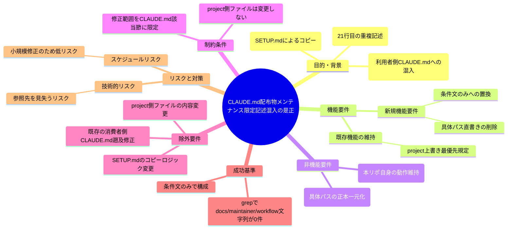
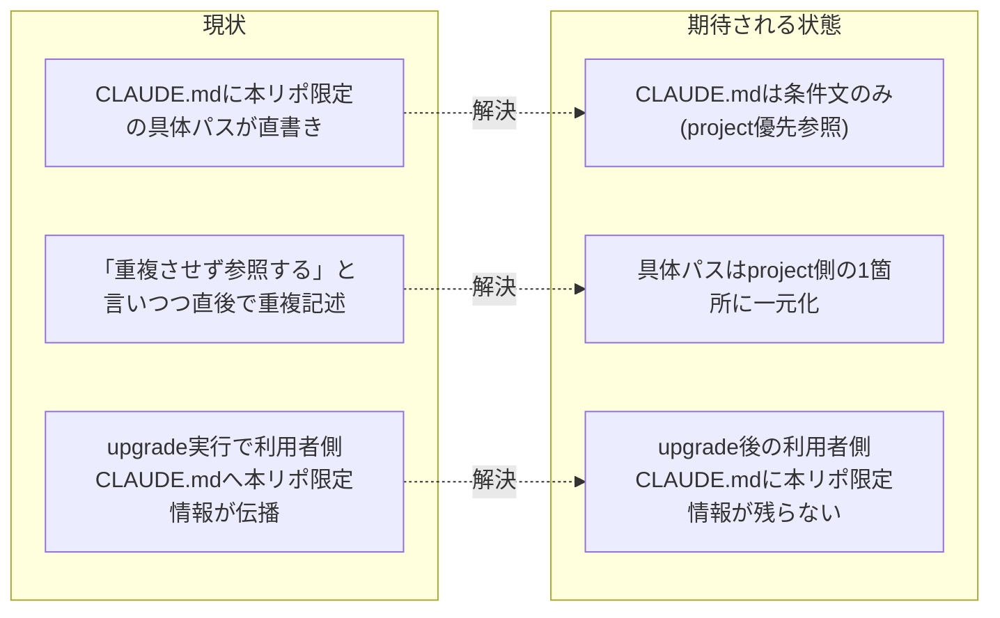

# 要求定義書: CLAUDE.md配布物メンテナンス限定記述混入の是正

**プロジェクト名**: CLAUDE.md配布物メンテナンス限定記述混入の是正
**作成日**: 2026 年 07 月 14 日
**最終更新**: 2026 年 07 月 14 日

> **重要**:
>
> - 要求定義書は、プロジェクトの全体像を把握するためのものです。詳細な技術仕様や実装方法は要件定義書以降で記載します。必要最低限の情報に収めることを心掛けてください。
> - **このドキュメントは常に更新**: 要求の変更や追加があった場合は、即座にこのドキュメントを更新してください。ドキュメントは「生きているドキュメント」として扱い、実装内容と常に同期させます。
> - **必須項目**: 以下の「必須」と明記した項目は空欄・抽象語のみ（例: 「{説明}」のまま）で提出しないこと。判定可能な形（目的は1文・成功基準は○/×で判定できる記載等）で記入すること。
>
> **用語**: [.agent-skill-chain/source/CONCEPTS.md §用語規約](../../../../../.agent-skill-chain/source/CONCEPTS.md#用語規約) を参照。

---

## 要求定義の全体像

**注意**:

- 上記の「プロジェクト名」は例です。実際のプロジェクト名に置き換えてください。
- マインドマップは全体像を把握するためのものです。主要なセクション名程度に留め、詳細は記載しないでください。

---

## 1. 目的・背景

### 1.1 目的（必須）

CLAUDE.mdから本リポ限定の具体パス直書きを除去する

### 1.2 背景

- **現状の課題**:
  - リポジトリルート直下の `CLAUDE.md` は、`.agent-skill-chain/source/SETUP.md`（31・227・252 行目）により「パッケージ正本」として、`init`/`upgrade` 実行時にそのまま消費者（利用者）プロジェクトのルートへコピーされる**配布物**である。
  - 現在の `CLAUDE.md`「## issue 作成タスク受領時の標準フロー」節（20〜21 行目付近）には、本フレームワークの開発リポジトリ（本リポ）自身にのみ当てはまる自己拡張用の具体的な上書きパス（単一 issue＝`docs/maintainer/workflow/<timestamp>_<title>/`、サブ issue＝`docs/maintainer/workflow/{parent}/90_issues/{ディレクトリ名}/`）が、条件文ではなく断定的な文章としてそのまま埋め込まれている。
  - 具体的には 21 行目が「**作成先（2パターン）**: 下記は汎用パッケージ標準（消費者ランタイムの既定）である。**本リポジトリでは... `.agent-skill-chain/project/自己拡張ワークフロー.md` の上書き（単一 issue＝`docs/maintainer/workflow/<timestamp>_<title>/`、サブ issue＝`docs/maintainer/workflow/{parent}/90_issues/{ディレクトリ名}/`）が最優先**であり、そちらに作成する（定義は重複させず `.agent-skill-chain/project/` を参照）。」と記載しており、「定義は重複させず参照する」と言いながら、直後で具体パスそのものを書き出しており文章として自己矛盾している。
  - この `CLAUDE.md` がそのまま consumer（利用者）プロジェクトへコピーされることを踏まえると、この矛盾は単なる文章上の瑕疵にとどまらない。ユーザーが実際に `upgrade` を実行したところ、この本リポ限定のメンテナンス情報（`docs/maintainer/workflow/...` という具体パス）がそのまま利用者側の `CLAUDE.md` に反映されてしまう不具合が実際に発生した（ユーザーからの報告あり）。
  - 利用者側のプロジェクトには `docs/maintainer/workflow/` ディレクトリも、対応する `.agent-skill-chain/project/自己拡張ワークフロー.md` の上書き定義も存在しないため、コピーされた文章だけが「本リポジトリの正は `docs/maintainer/workflow/...`」と実体を伴わずに言い張る、意味不明かつ誤解を招く記述として利用者側に残留する。

- **必要性**:
  - `.agent-skill-chain/project/自己拡張ワークフロー.md` 冒頭が定める「名前空間分離」の設計方針（パッケージ正本と自己拡張消費者を分離し、二重管理・配布物汚染を防ぐ）を、`CLAUDE.md` 本体の記述にも一貫して適用する必要がある。
  - 汎用（消費者向け）デフォルトとして正しいのは `.agent-skill-chain/runtime/<timestamp>_<title>/` である。本リポ固有の `docs/maintainer/workflow/...` という具体パスは、本リポ専用のローカルファイルである `.agent-skill-chain/project/自己拡張ワークフロー.md`（配布物ではない）にのみ記載されるべきであり、パッケージ正本である `CLAUDE.md` 本体には条件文（「project 側に上書き定義があればそれに従う」）のみを残し、具体パスを直書きすべきではない。

### 1.3 期待される効果（必須: 1 件以上）

- **効果 1**: 消費者プロジェクトへ `upgrade` を実行した後の `CLAUDE.md` に、本リポ限定の具体パス文字列（`docs/maintainer/workflow` 等）が一切含まれなくなる（`grep` で件数 0 を確認できる形で判定可能）。
- **効果 2**: `CLAUDE.md`「## issue 作成タスク受領時の標準フロー」節が、「`.agent-skill-chain/project/` に上書き定義があればそれを最優先で参照する。無ければ汎用標準（`.agent-skill-chain/runtime/<timestamp>_<title>/` 等）に従う」という条件文のみで完結し、本リポ固有の具体的パス名を挙げなくなる。
- **効果 3**: 本リポジトリ自身が必要とする具体パス定義（`docs/maintainer/workflow/...`）は `.agent-skill-chain/project/自己拡張ワークフロー.md` 側に一元化されたまま維持され、`CLAUDE.md` との重複記述・矛盾記述が解消される。

**現状と期待される状態の比較**（必要に応じて）:

---

## 2. 機能要件

### 2.1 既存機能の維持（該当する場合）

- CLAUDE.md「作成場所の上書き最優先」規定（`.agent-skill-chain/project/` が存在すればそれを最優先で参照する旨、18 行目）は維持する。
- `.agent-skill-chain/project/自己拡張ワークフロー.md` 側の具体パス定義（`docs/maintainer/workflow/...` を使う旨）自体は変更しない（このファイルは配布物ではなく本リポジトリのローカルファイルであり、本 issue のスコープ外）。

### 2.2 新規機能要件

- CLAUDE.md「## issue 作成タスク受領時の標準フロー」節の「作成先（2パターン）」記述（21 行目）から、本リポ限定の具体パス直書き部分（「本リポジトリでは... `docs/maintainer/workflow/...`」という具体パス名を含む文言）を削除する。
- 削除後は、「`.agent-skill-chain/project/` に上書き定義があれば最優先でそれに従い、そちらに作成する。無ければ下記の汎用標準（消費者ランタイムの既定＝`.agent-skill-chain/runtime/<timestamp>_<title>/` 等）に従う」という**条件文のみ**に置き換える。具体パス名（本リポで言えば `docs/maintainer/workflow/...`）を CLAUDE.md 本体に一切書き出さない形にする。

---

## 3. 非機能要件

### 3.1 パフォーマンス

- 該当なし（ドキュメント記述の修正のみ）。

### 3.2 セキュリティ

- 該当なし。

### 3.3 互換性

- 本リポジトリ自身の issue 作成フロー（`.agent-skill-chain/project/自己拡張ワークフロー.md` 経由で `docs/maintainer/workflow/` に作成する運用）は、CLAUDE.md 側の記述簡略化後も従来どおり機能すること（CLAUDE.md の条件文が `.agent-skill-chain/project/` を最優先参照する経路を維持していれば、実際の動作は変わらない）。

### 3.4 保守性

- 具体パスの正本を `.agent-skill-chain/project/` 側の 1 箇所に一元化し、CLAUDE.md との二重管理・矛盾記述の再発を防ぐ。

---

## 4. 制約条件

### 4.1 技術的制約

- 修正対象は CLAUDE.md「## issue 作成タスク受領時の標準フロー」節（現行 18〜21 行目付近の「作成場所の上書き最優先」「作成先（2パターン）」記述）に限定する。他の節・他ファイルへの波及変更は本 issue のスコープ外とする。
- CLAUDE.md は `SETUP.md` により `init`/`upgrade` 時にそのまま消費者へコピーされる配布物であるため、本リポジトリ固有の情報（具体パス名・本リポ限定の運用詳細等）を一切含めてはならない。

### 4.2 既存システムとの互換性

- `.agent-skill-chain/project/自己拡張ワークフロー.md` 自体の内容（`docs/maintainer/workflow/...` を使う旨の記載）は変更しない。

### 4.3 移行期間・スケジュール

- 特になし（ドキュメント修正のため即時反映可能）。

---

## 5. 除外要件

- `.agent-skill-chain/project/自己拡張ワークフロー.md` 自体の内容変更。
- `SETUP.md` のコピー配布ロジック自体の変更。
- 既にコピーされてしまった利用者（消費者）側プロジェクトの `CLAUDE.md` の遡及修正（本 issue のスコープ外。利用者側は次回 `upgrade` 実行時に修正済みの `CLAUDE.md` を受け取ることで解消される）。

---

## 6. 成功基準（必須: 1 件以上）

- CLAUDE.md 本文に文字列 `docs/maintainer/workflow` が一切出現しない（`grep -c "docs/maintainer/workflow" CLAUDE.md` の結果が 0 であること）。
- CLAUDE.md「## issue 作成タスク受領時の標準フロー」節が、「`.agent-skill-chain/project/` の上書き定義の有無」で分岐する条件文のみで構成され、本リポ限定の具体パスを含まない。
- 既存の「作成場所の上書き最優先」規定（`.agent-skill-chain/project/` を最優先で参照する旨）は引き続き CLAUDE.md に記載されている。
- 汎用（消費者向け）デフォルトのパス（`.agent-skill-chain/runtime/<timestamp>_<title>/` 等）の記述は維持される。
- 修正後も本リポジトリ自身の issue 作成時の実際の動作（`docs/maintainer/workflow/` への作成）が `.agent-skill-chain/project/自己拡張ワークフロー.md` 側の定義により変更なく機能し続けること（本リポでの動作確認により判定）。

---

## 7. リスクと対策

### 7.1 技術的リスク

- **リスク**: 具体パスを削除しすぎて、本リポ自身が CLAUDE.md の条件文だけからは自身の上書きファイルの存在に気づけなくなる。
  - **対策**: 「`.agent-skill-chain/project/` に上書き定義があれば最優先で参照する」という既存の一文（18 行目）の条件文本体は維持する。参照先ファイル名（`自己拡張ワークフロー.md` 等）の例示は残さない（このファイル名自体が「本リポでは」という形の本リポ固有の運用詳細であり、1.2 節の必要性・2.2 新規機能要件が定める「パッケージ正本には本リポ固有の具体的な運用詳細を一切含めない」という原則に反するため。`.agent-skill-chain/project/README.md` §配置例のとおり、ファイル名はプロジェクトごとに異なってよく、標準化されていない）。上書き定義の有無は CLAUDE.md の条件文で判断し、定義の実体（ファイル名・パスの中身）は各プロジェクトが実際に `.agent-skill-chain/project/` を開いて確認する（02_設計.md ADR-1 の決定・帰結と整合）。

### 7.2 スケジュールリスク

- **リスク**: 実質的なリスクなし（CLAUDE.md 1 ファイルの 1 節に限定した小規模なドキュメント修正のため）。
  - **対策**: 修正範囲を該当節に限定し、早期に完了させる。

---

## 8. 参考資料

### プロジェクトドキュメント

- 既存プロジェクトの場合は、[`00_システム理解.md`](./00_システム理解.md) - システム理解を参照（本 issue では未作成。小規模なドキュメント修正のため省略）。

### その他の参考資料

- `CLAUDE.md`（本文。特に「## issue 作成タスク受領時の標準フロー」節、現行 18〜21 行目付近）
- `.agent-skill-chain/source/SETUP.md`（31・227・252 行目 — CLAUDE.md がパッケージ正本としてルートへコピーされる配布ロジックの定義）
- `.agent-skill-chain/project/自己拡張ワークフロー.md` §issue の作成場所（標準フローの上書き）
- ユーザー報告: `upgrade` 実行後、利用者側 `CLAUDE.md` に本リポ限定の具体パス記述（`docs/maintainer/workflow/...`）がそのまま反映される不具合が実際に発生した。

---

## 9. 次のステップ

この要求定義書の承認後、以下のドキュメントを作成します：

- **次**: [`01_要件定義.md`](./01_要件定義.md) - 要件定義フェーズ
