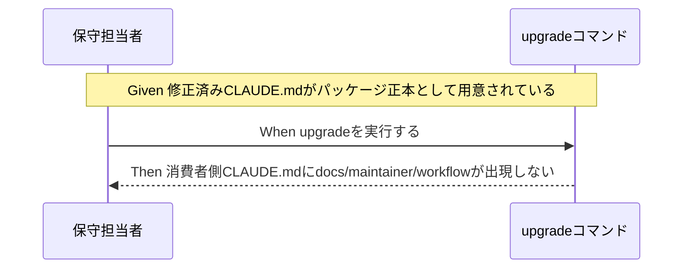

# 要件定義書: CLAUDE.md配布物メンテナンス限定記述混入の是正

**プロジェクト名**: CLAUDE.md配布物メンテナンス限定記述混入の是正
**作成日**: 2026 年 07 月 14 日
**最終更新**: 2026 年 07 月 14 日

> **重要**: **このドキュメントは常に更新**: 要件の変更や追加があった場合は、即座にこのドキュメントを更新してください。ドキュメントは「生きているドキュメント」として扱い、実装内容と常に同期させます。
>
> **用語**: [.agent-skill-chain/source/CONCEPTS.md §用語規約](../../../../../.agent-skill-chain/source/CONCEPTS.md#用語規約) を参照。

---

## 1. 概要

### 1.1 システム概要

本フレームワークはリポジトリルート直下の `CLAUDE.md` を「パッケージ正本」として保持し、`.agent-skill-chain/source/SETUP.md` が定義する `init`/`upgrade` 実行時に、そのファイルをそのまま消費者（利用者）プロジェクトのルートへコピーする配布メカニズムを持つ。本 issue は、この `CLAUDE.md` 本文の「## issue 作成タスク受領時の標準フロー」節に、本リポジトリ（開発元・自己拡張元）だけに当てはまる具体パス（`docs/maintainer/workflow/...`）が断定的な文章として直書きされている問題を是正し、CLAUDE.md を「`.agent-skill-chain/project/` に上書き定義があればそれに従う」という条件文のみで完結させる。

### 1.2 用語集

| 用語 | 説明 |
| --- | --- |
| パッケージ正本（配布物） | `.agent-skill-chain/source/`・`AGENTS.md`・`CLAUDE.md` 等、`init`/`upgrade` により消費者プロジェクトへコピーされるファイル群。本リポ固有情報を含んではならない。 |
| `.agent-skill-chain/project/` | プロジェクト（消費者・または本リポ自身）ごとのローカルな上書き定義を置くディレクトリ。配布物には含まれない。 |
| 自己拡張ワークフロー.md | 本リポジトリ専用の `.agent-skill-chain/project/` 配下のファイル。本リポでの issue 作成場所（`docs/maintainer/workflow/...`）など、本リポ限定の具体パスを定義する。 |
| 消費者（利用者）プロジェクト | 本フレームワークを `npx`/`init`/`upgrade` 等で導入する側のプロジェクト。`docs/maintainer/workflow/` も本リポ用の自己拡張ワークフロー.md も持たない。 |

---

## 2. 機能要件

### 2.1 ユーザーストーリー

#### ストーリー 1: 消費者プロジェクトの保守担当者として、配布された CLAUDE.md に自分のプロジェクトには存在しないパスの記述が混入しないでほしい

- **As a** 消費者プロジェクトの保守担当者
- **I want to** `upgrade` 実行後の `CLAUDE.md` に、開発元リポジトリ限定の具体パス（`docs/maintainer/workflow/...` 等）が含まれないようにしたい
- **So that** 自分のプロジェクトに存在しないディレクトリを指す誤った記述に惑わされず、CLAUDE.md の指示を額面通り運用できる

**受け入れ基準**:

- `upgrade` 実行後の消費者プロジェクトの `CLAUDE.md` に文字列 `docs/maintainer/workflow` が出現しない。
- `CLAUDE.md`「## issue 作成タスク受領時の標準フロー」節を読んだだけで、「`.agent-skill-chain/project/` に上書き定義があればそれに従い、無ければ `.agent-skill-chain/runtime/<timestamp>_<title>/` 等の汎用標準に従う」という判断ができる（本リポ限定のパス名を読まされない）。

#### ストーリー 2: 本フレームワークの開発者として、パッケージ正本と本リポ固有の運用定義を分離したい

- **As a** 本フレームワークの開発者（保守者）
- **I want to** `CLAUDE.md`（配布物）本体には条件文のみを残し、本リポ限定の具体パスは `.agent-skill-chain/project/自己拡張ワークフロー.md`（非配布のローカルファイル）にのみ書きたい
- **So that** 配布物と本リポ固有情報の二重管理・矛盾記述（「重複させず参照する」と言いながら直後に重複記述する等）を防ぎ、以後同種の事故が再発しない

**受け入れ基準**:

- `CLAUDE.md`「作成場所の上書き最優先」規定（`.agent-skill-chain/project/` を最優先参照する旨）は修正後も引き続き存在する。
- `CLAUDE.md` の該当節から本リポ限定の具体パス文字列（`docs/maintainer/workflow` 等）が削除されている。
- `.agent-skill-chain/project/自己拡張ワークフロー.md` 側の具体パス定義は変更されず、本リポジトリ自身の issue 作成時の実際の動作（`docs/maintainer/workflow/` への作成）は従来どおり機能する。

### 2.2 BDD ユースケース

#### ユースケース 1: 消費者プロジェクトへの upgrade 実行

`upgrade` を実行した消費者プロジェクトの `CLAUDE.md` に、開発元リポジトリ限定の具体パスが伝播しないことを確認するユースケース。

**シナリオ 1: upgrade 後の CLAUDE.md に本リポ限定パスが含まれない**

```gherkin
Feature: CLAUDE.md 配布物からの本リポ限定記述の除去
  Scenario: 消費者プロジェクトへ upgrade を実行する
    Given 修正済みの CLAUDE.md がパッケージ正本として用意されている
    When 消費者プロジェクトに対して upgrade を実行する
    Then 消費者プロジェクトの CLAUDE.md に文字列 "docs/maintainer/workflow" が出現しない
```

**処理フロー**（必要に応じて）:



**シナリオ 2: CLAUDE.md 単体を読んだときの判断可能性**

```gherkin
Feature: CLAUDE.md 配布物からの本リポ限定記述の除去
  Scenario: エージェントが CLAUDE.md「issue 作成タスク受領時の標準フロー」節を読む
    Given CLAUDE.md の「issue 作成タスク受領時の標準フロー」節が修正済みである
    When エージェントが issue 作成場所の判定のためにこの節を読む
    Then ".agent-skill-chain/project/ に上書き定義があればそれに従う。無ければ .agent-skill-chain/runtime/<timestamp>_<title>/ 等の汎用標準に従う" という条件文のみで判断できる
    And 本リポ限定の具体パス名（docs/maintainer/workflow 等）を CLAUDE.md 側からは読まされない
```

#### ユースケース 2: 本リポジトリ自身での issue 作成（回帰確認）

CLAUDE.md 側の記述簡略化後も、本リポジトリ自身の issue 作成フローが従来どおり動作することを確認するユースケース。

**シナリオ 1: 本リポでの issue 作成が従来どおり docs/maintainer/workflow/ に行われる**

```gherkin
Feature: 本リポジトリ自身の issue 作成フローの継続動作
  Scenario: 本リポジトリでサブエージェントが issue を新規作成する
    Given CLAUDE.md の該当節が条件文のみに修正されている
    And .agent-skill-chain/project/自己拡張ワークフロー.md は変更されていない
    When サブエージェントが本リポジトリで新規 issue の 00_要求定義.md を作成する
    Then 作成先は docs/maintainer/workflow/<timestamp>_<title>/ である
```

### 2.3 ビジネスルール

- CLAUDE.md（配布物）には、本リポジトリ固有の具体パス・具体的な運用詳細を一切含めない。
- 本リポジトリ固有の具体パス・運用詳細は `.agent-skill-chain/project/`（非配布のローカルファイル）にのみ記載する。
- CLAUDE.md の条件文は「`.agent-skill-chain/project/` を最優先参照する」という既存規定を変更せず維持する。

---

## 3. 非機能要件

### 3.1 パフォーマンス要件

- 該当なし（ドキュメント記述の修正のみ）。

### 3.2 セキュリティ要件

- 該当なし。

### 3.3 ユーザビリティ要件

- CLAUDE.md「## issue 作成タスク受領時の標準フロー」節は、消費者・本リポいずれの読者にとっても、自分の環境に存在するファイル・パスのみを参照する記述になっていること（存在しないパスへの言及がないこと）。

### 3.4 可用性要件

- 該当なし。

---

## 4. 外部インターフェース要件

### 4.1 API 要件

- 該当なし。

### 4.2 データ形式要件

- 該当なし（Markdown ドキュメントの記述修正のみ）。

---

## 5. 制約事項

- 修正対象は `CLAUDE.md`「## issue 作成タスク受領時の標準フロー」節（現行 18〜21 行目付近）に限定する。
- `.agent-skill-chain/project/自己拡張ワークフロー.md` 自体の内容は変更しない。
- 既にコピー済みの利用者側 `CLAUDE.md` の遡及修正は本 issue のスコープ外。

---

## 6. 参考資料

### プロジェクトドキュメント

- [`00_要求定義.md`](./00_要求定義.md) - 要求定義

### その他の参考資料

- `.agent-skill-chain/source/SETUP.md`（31・227・252 行目）
- `.agent-skill-chain/project/自己拡張ワークフロー.md` §issue の作成場所（標準フローの上書き）

---

## 7. 前のステップ

この要件定義書は、以下のドキュメントを基に作成されています：

- **前**: [`00_要求定義.md`](./00_要求定義.md) - 要求定義フェーズ

---

## 8. 次のステップ

この要件定義書の承認後、以下のドキュメントを作成します：

- **次**: [`02_設計.md`](./02_設計.md) - 設計フェーズ
