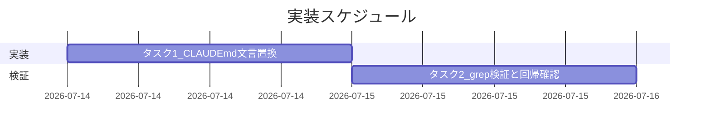
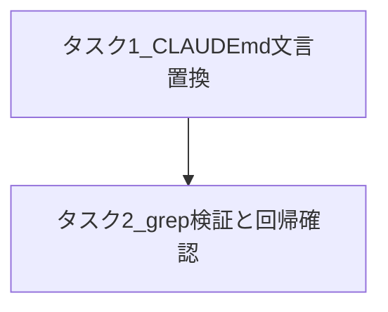

# 実装計画書: CLAUDE.md配布物メンテナンス限定記述混入の是正

**プロジェクト名**: CLAUDE.md配布物メンテナンス限定記述混入の是正
**作成日**: 2026 年 07 月 14 日
**最終更新**: 2026 年 07 月 14 日

> **重要**: **このドキュメントは常に更新**: 実装計画の変更、進捗状況の更新、バグの記録などがあった場合は、即座にこのドキュメントを更新してください。ドキュメントは「生きているドキュメント」として扱い、実装内容と常に同期させます。
> **必須項目**: 「必須」と明記した欄は空欄・抽象語のみで提出しないこと。テスト観点・BDD 仕様は具体ケースを 1 件以上記載すること。
>
> **用語**: [.agent-skill-chain/source/CONCEPTS.md §用語規約](../../../../../.agent-skill-chain/source/CONCEPTS.md#用語規約) を参照。

---

## 1. 実装概要

### 1.1 実装方針（必須）

`CLAUDE.md`「## issue 作成タスク受領時の標準フロー」節の「作成場所の上書き最優先」「作成先（2パターン）」ブロック（現行 20〜21 行目）を、02_設計.md §3.1.3 の Before/After 文言に従いテキスト置換する。対象は同ファイル同節の 2 ブロックに限定し、`.agent-skill-chain/project/自己拡張ワークフロー.md` を含む他ファイルは変更しない（02_設計 §2.1.2・00 §4.1 の境界と整合）。

### 1.2 実装順序（必須: 1 件以上）

1. タスク 1: CLAUDE.md 該当 2 ブロックの文言置換
2. タスク 2: grep ベースの静的検証・本リポ回帰確認



---

## 2. タスク分解

**用語**: [.agent-skill-chain/source/CONCEPTS.md §用語規約](../../../../../.agent-skill-chain/source/CONCEPTS.md#用語規約) を参照。

**必須**: 各タスクには **「テスト観点」（2.x.3）** と **「単体テスト仕様（BDD）」（2.x.4）** を必ず記載すること。テスト観点の定義は **02_設計 §6** および **RULES のテスト戦略・[TEST_BDD_FORMAT.md](../../../../../.agent-skill-chain/source/TEST_BDD_FORMAT.md)** を参照し、本ドキュメントでは**タスクごとの具体ケース**のみ記載する。

### 2.1 タスク 1: CLAUDE.md「作成場所の上書き最優先」「作成先（2パターン）」ブロックの文言置換

#### 2.1.1 概要（必須）

`CLAUDE.md` 現行 20〜21 行目の 2 ブロックから、本リポ限定の具体パス直書き（`docs/maintainer/workflow/...`）と自己矛盾する記述（「重複させず参照する」と言いつつ直後に重複記述）を削除し、条件文＋汎用デフォルトのみの文言に置き換える。

#### 2.1.2 実装内容（必須: 1 件以上）

- `CLAUDE.md` の「作成場所の上書き最優先」ブロック（現行 20 行目）を、02_設計.md §3.1.3 After 文言 1 行目に置換する（括弧書き例示 `（本リポでは .agent-skill-chain/project/自己拡張ワークフロー.md）` と断定文「本リポジトリの単一 issue / サブ issue の正は `docs/maintainer/workflow/...`（`.agent-skill-chain/runtime/` ではない）」を削除し、条件文本体は維持）。
- `CLAUDE.md` の「作成先（2パターン）」ブロック（現行 21 行目）を、02_設計.md §3.1.3 After 文言 2 行目に置換する（見出しを「作成先（汎用標準・消費者ランタイムの既定）」に変更し、「本リポジトリでは...が最優先であり、そちらに作成する（定義は重複させず参照）」の一文と「汎用標準では」という前置きを削除。汎用デフォルトの記述本体（`.agent-skill-chain/runtime/<timestamp>_<title>/` 等・具体例・`<timestamp>`/`<title>` の説明）はそのまま維持）。
- 同節の他 2 ブロック（「作成・更新するファイル」「Orchestrator への返却フォーマット」）およびコンテキスト効率注記は変更しない（02_設計 §2.3 のコンポーネント構成に従い変更範囲を限定）。
- `.agent-skill-chain/project/自己拡張ワークフロー.md` は変更しない（02_設計 ADR-3）。

#### 2.1.3 テスト観点（必須）

**参照**: 観点の定義は [02_設計 §6](./02_設計.md) および [RULES のテスト戦略・TEST_BDD_FORMAT](../../../../../.agent-skill-chain/source/RULES.md#テスト戦略必須要件) を参照。以下には**本タスクの具体ケース**のみ記載する。

##### 単体（本タスクの具体ケース・必須 1 件以上）

- 置換後の `CLAUDE.md` の該当行に文字列 `docs/maintainer/workflow` が含まれないこと（`grep -c "docs/maintainer/workflow" CLAUDE.md` の結果が `0`）。
- 置換後も「作成場所の上書き最優先」という見出し文言自体は `CLAUDE.md` に残っていること（`grep -n "作成場所の上書き最優先" CLAUDE.md` が該当行を返す）。
- 置換後も汎用デフォルトの記述 `.agent-skill-chain/runtime/<timestamp>_<title>/` が `CLAUDE.md` に残っていること（`grep -n "\.agent-skill-chain/runtime/<timestamp>_<title>/" CLAUDE.md` が該当行を返す）。

##### 結合/API（本タスクの具体ケース・該当時は必須 1 件以上）

- 該当なし（本タスクは Markdown ドキュメント 1 節の文言置換であり、API・結合ポイントを持たない）。

##### E2E/受け入れ（本タスクの具体ケース・未達時は理由記載）

- 未達（理由）: 実際に `init`/`upgrade` を消費者プロジェクトへ実行して伝播を確認する E2E は、01 ユースケース 1 シナリオ 1 の理想形だが、本 issue の実装計画では実行環境（別リポジトリの用意）を要するため対象外とする。代替として、タスク 2（§2.2）で `CLAUDE.md` 本文への grep 静的検証を実施し、コピー元の文言に問題が無いことを担保する（コピー自体は `SETUP.md` の既存ロジックであり本 issue の変更対象外＝00 §5 除外要件）。

##### バリデーション（該当する場合の具体ケース）

- 置換後の Markdown 構文が崩れていないこと（箇条書きの `- **見出し**:` 形式が維持されていること。目視確認）。

#### 2.1.4 単体テスト仕様（BDD）（必須）

**BDD 形式のテストケース（高レベル仕様）**:

```gherkin
Feature: CLAUDE.md 配布物からの本リポ限定記述の除去
  Scenario: エージェントが CLAUDE.md「issue 作成タスク受領時の標準フロー」節を読む
    Given CLAUDE.md の「issue 作成タスク受領時の標準フロー」節が修正済みである
    When エージェントが issue 作成場所の判定のためにこの節を読む
    Then ".agent-skill-chain/project/ に上書き定義があればそれに従う。無ければ .agent-skill-chain/runtime/<timestamp>_<title>/ 等の汎用標準に従う" という条件文のみで判断できる
    And 本リポ限定の具体パス名（docs/maintainer/workflow 等）を CLAUDE.md 側からは読まされない
```

（01_要件定義.md §2.2 ユースケース 1 シナリオ 2 と対応。以下は同シナリオを検証する手段の記述であり、コードを持たないドキュメント修正のため擬似コードで示す。）

**検証コード例（インラインコメントで Given/When/Then を明記）**

```bash
# Given: CLAUDE.md の該当節が修正済みである
FILE="CLAUDE.md"

# When: 文字列 docs/maintainer/workflow の出現数を数える
COUNT=$(grep -c "docs/maintainer/workflow" "$FILE" || true)

# Then: 出現数が 0 であること（本リポ限定の具体パスが CLAUDE.md 側から読まされない）
test "$COUNT" -eq 0
```

#### 2.1.5 依存関係

- 依存タスクなし（前提は 02_設計.md の Before/After 文言案の確定のみであり、既に完了済み）。



#### 2.1.6 見積もり

- **工数**: 0.5 時間未満（1 ファイル 2 ブロックのテキスト置換のみ）。
- **優先度**: 高（利用者側 `CLAUDE.md` への誤情報混入という実発生済み事故の是正のため）。

### 2.2 タスク 2: grep ベースの静的検証・本リポ回帰確認

#### 2.2.1 概要（必須）

タスク 1 の置換結果が 00_要求定義.md §6 成功基準・01_要件定義.md の受け入れ基準を満たすことを、grep による静的検証と `.agent-skill-chain/project/自己拡張ワークフロー.md` の無改変確認によって確かめる。

#### 2.2.2 実装内容（必須: 1 件以上）

- `grep -c "docs/maintainer/workflow" CLAUDE.md` を実行し、結果が `0` であることを確認する。
- `grep -n "\.agent-skill-chain/runtime/<timestamp>_<title>/" CLAUDE.md` を実行し、該当行が存在することを確認する。
- `grep -n "作成場所の上書き最優先" CLAUDE.md` を実行し、該当行が存在することを確認する。
- `git diff --name-only` を実行し、`.agent-skill-chain/project/自己拡張ワークフロー.md` が変更ファイル一覧に含まれないこと（＝無改変）を確認する。
- `git diff -- CLAUDE.md` を実行し、変更が「作成場所の上書き最優先」「作成先（2パターン）」ブロックの 2 箇所に限定されていること（他ブロック・他ファイルへの意図しない波及が無いこと）を確認する。

#### 2.2.3 テスト観点（必須）

**参照**: 観点の定義は [02_設計 §6](./02_設計.md) および [RULES のテスト戦略・TEST_BDD_FORMAT](../../../../../.agent-skill-chain/source/RULES.md#テスト戦略必須要件) を参照。以下には**本タスクの具体ケース**のみ記載する。

##### 単体（本タスクの具体ケース・必須 1 件以上）

- `CLAUDE.md` 本文に文字列 `docs/maintainer/workflow` が 0 件であること（00 §6 成功基準 1 件目）。
- `CLAUDE.md`「## issue 作成タスク受領時の標準フロー」節が、`.agent-skill-chain/project/` の上書き定義の有無で分岐する条件文のみで構成され、本リポ限定の具体パスを含まないこと（00 §6 成功基準 2 件目・目視確認）。

##### 結合/API（本タスクの具体ケース・該当時は必須 1 件以上）

- 該当なし。

##### E2E/受け入れ（本タスクの具体ケース・未達時は理由記載）

- 本リポジトリ自身での issue 作成時の実際の動作（`docs/maintainer/workflow/` への作成）が、`.agent-skill-chain/project/自己拡張ワークフロー.md` 側の定義により変更なく機能し続けること（00 §6 成功基準 5 件目・01 §2.2 ユースケース 2 シナリオ 1 に対応）。**未達時の理由**: 本 issue のドキュメント修正自体は次回以降の新規 issue 作成タスクで実際にサブエージェントが `00_要求定義.md` を新規作成した際に事実確認される（回帰の実証はこの issue の完了時点ではなく、次回以降の issue 作成タスク実行時に事後確認される運用とする）。本タスクの完了時点では、`.agent-skill-chain/project/自己拡張ワークフロー.md` が無改変であること（静的確認）をもって「機能し続ける」ことの構造的根拠とする。

##### バリデーション（該当する場合の具体ケース）

- 既存の「作成場所の上書き最優先」規定（`.agent-skill-chain/project/` を最優先で参照する旨）が引き続き `CLAUDE.md` に記載されていること（00 §6 成功基準 3 件目）。
- 汎用（消費者向け）デフォルトのパス（`.agent-skill-chain/runtime/<timestamp>_<title>/` 等）の記述が維持されていること（00 §6 成功基準 4 件目）。

#### 2.2.4 単体テスト仕様（BDD）（必須）

**BDD 形式のテストケース（高レベル仕様）**:

```gherkin
Feature: CLAUDE.md 配布物からの本リポ限定記述の除去
  Scenario: 消費者プロジェクトへ upgrade を実行する
    Given 修正済みの CLAUDE.md がパッケージ正本として用意されている
    When 消費者プロジェクトに対して upgrade を実行する
    Then 消費者プロジェクトの CLAUDE.md に文字列 "docs/maintainer/workflow" が出現しない
```

```gherkin
Feature: 本リポジトリ自身の issue 作成フローの継続動作
  Scenario: 本リポジトリでサブエージェントが issue を新規作成する
    Given CLAUDE.md の該当節が条件文のみに修正されている
    And .agent-skill-chain/project/自己拡張ワークフロー.md は変更されていない
    When サブエージェントが本リポジトリで新規 issue の 00_要求定義.md を作成する
    Then 作成先は docs/maintainer/workflow/<timestamp>_<title>/ である
```

（01_要件定義.md §2.2 ユースケース 1 シナリオ 1・ユースケース 2 シナリオ 1 と対応。upgrade の実行自体は E2E 対象外＝§2.1.3 のとおりのため、以下は代替の静的検証コード例。）

**検証コード例（インラインコメントで Given/When/Then を明記）**

```bash
# Given: タスク1で CLAUDE.md の置換が完了している
FILE="CLAUDE.md"
PROJECT_FILE=".agent-skill-chain/project/自己拡張ワークフロー.md"

# When: 静的検証コマンド群を実行する
COUNT=$(grep -c "docs/maintainer/workflow" "$FILE" || true)
GENERIC_DEFAULT=$(grep -c "\.agent-skill-chain/runtime/<timestamp>_<title>/" "$FILE" || true)
OVERRIDE_HEADING=$(grep -c "作成場所の上書き最優先" "$FILE" || true)
PROJECT_FILE_CHANGED=$(git diff --name-only -- "$PROJECT_FILE" | wc -l)

# Then: 本リポ限定パスは0件、汎用デフォルトと見出しは1件以上、project側は無改変(0)
test "$COUNT" -eq 0
test "$GENERIC_DEFAULT" -ge 1
test "$OVERRIDE_HEADING" -ge 1
test "$PROJECT_FILE_CHANGED" -eq 0
```

#### 2.2.5 依存関係

- タスク 1（§2.1）の完了を前提とする。

#### 2.2.6 見積もり

- **工数**: 0.5 時間未満（grep コマンド数本の実行と目視確認）。
- **優先度**: 高（タスク 1 の完了条件・review-docs ゲート通過の前提）。

---

## テスト観点

本実装計画全体のテスト観点は、02_設計.md §6.1（対象ごとのテスト割り当て）で定義したとおり、`CLAUDE.md`「issue 作成タスク受領時の標準フロー」節を単体（grep による静的確認）で検証する。結合/API・E2E は本変更の性質上該当せず（§2.1.3・§2.2.3 に理由を記載）、各タスクの §2.x.3 に具体ケースを記載した。

---

## 単体テスト

自動テストフレームワーク上の単体テストは存在しない（Markdown ドキュメント 1 節の文言修正のため）。代替として、§2.1.4・§2.2.4 に記載した grep ベースの検証コード例（bash）を単体レベルの検証手段として採用する。実行は review-docs（実装前ドキュメントレビュー）および verify-and-close の各フェーズで反復する。

---

## BDD

BDD シナリオは 01_要件定義.md §2.2 の 2 ユースケース・3 シナリオをそのまま踏襲する（§2.1.4・§2.2.4 に転記済み）。Given/When/Then 形式は [TEST_BDD_FORMAT.md](../../../../../.agent-skill-chain/source/TEST_BDD_FORMAT.md) に従う。

| 01 の BDD シナリオ | 対応する 03 のテスト観点 |
| --- | --- |
| ユースケース 1 シナリオ 1（upgrade 後の CLAUDE.md に本リポ限定パスが含まれない） | §2.2.3 単体 1 件目（`docs/maintainer/workflow` 0 件）、§2.2.4 BDD 1 件目 |
| ユースケース 1 シナリオ 2（CLAUDE.md 単体を読んだときの判断可能性） | §2.1.3 単体 1〜3 件目、§2.1.4 BDD |
| ユースケース 2 シナリオ 1（本リポでの issue 作成が従来どおり機能する・回帰確認） | §2.2.3 E2E/受け入れ、§2.2.4 BDD 2 件目 |

---

## 3. 実装スケジュール

### 3.1 マイルストーン

| マイルストーン | 期日 | 成果物 |
| --- | --- | --- |
| タスク 1 完了（CLAUDE.md 文言置換） | 着手当日 | 置換済み `CLAUDE.md` |
| タスク 2 完了（grep 検証・回帰確認） | 着手当日 | 検証結果（review-docs・verify-and-close の証跡） |

### 3.2 実装フェーズ

#### フェーズ 1: 実装・検証

- **期間**: 着手当日中（1 時間未満）
- **タスク**: タスク 1（§2.1）、タスク 2（§2.2）

---

## 4. テスト計画

テスト観点・レベル・BDD 形式の定義は **02_設計 §6** および **RULES のテスト戦略・TEST_BDD_FORMAT** を参照。本実装計画では各タスクの **§2.x.3（テスト観点）** にタスクごとの具体ケースを記載し、§2.x.4 に BDD 仕様を記載した。

### 4.1 テストの優先順位

- クリティカルな観点（`docs/maintainer/workflow` 文字列の完全除去）を最優先で確認する（実際に発生済みの事故の再発防止に直結するため）。
- 影響範囲が広い箇所（`CLAUDE.md` は全消費者プロジェクトへ配布されるファイル）であるため、タスク 2 の全 grep 検証をレビュー（review-docs）・verify-and-close の両フェーズで反復実行し、回帰テストに含める。

---

## 5. リスク管理

### 5.1 実装リスク

- **リスク**: 具体パスを削除しすぎて、本リポジトリ自身が CLAUDE.md の条件文だけからは自身の上書きファイルの存在に気づけなくなる（00 §7.1・02_設計 §3.1.4 と同一リスク）。
  - **対策**: タスク 1 では「作成場所の上書き最優先」の条件文本体（`.agent-skill-chain/project/` を最優先参照する旨）を削除せず維持する。タスク 2 で `grep -n "作成場所の上書き最優先" CLAUDE.md` により維持を検証する。
- **リスク**: 見出し変更（「作成先（2パターン）」→「作成先（汎用標準・消費者ランタイムの既定）」）が、他ファイルからのアンカーリンク参照を壊す可能性（02_設計 §3.1.4 と同一リスク）。
  - **対策**: タスク 2 で `grep -rn "作成先（2パターン）" .`（または同等のリポジトリ全体検索）を実行し、CLAUDE.md 以外からの見出し参照が無いことを確認する。参照が見つかった場合は当該参照側も追随修正するか、見出し変更を見送る。

---

## 6. 参考資料

### プロジェクトドキュメント

- [`02_設計.md`](./02_設計.md) - 設計

### その他の参考資料

- [`00_要求定義.md`](./00_要求定義.md) - 要求定義（§6 成功基準）
- [`01_要件定義.md`](./01_要件定義.md) - 要件定義（§2.2 BDD ユースケース）

---

## 7. 前のステップ

この実装計画書は、以下のドキュメントを基に作成されています：

- **前**: [`02_設計.md`](./02_設計.md) - 設計フェーズ

---

## 8. 次のステップ

この実装計画書の承認後、以下のいずれかのステップに進みます：

- **プロジェクトを複数の issue（またはタスク）に分割する場合**: 該当なし（本 issue は単一 issue であり、90_issues.md への分割は行わない）。
- **プロジェクトが 1 つの issue（またはタスク）である場合**: review-docs（実装前ドキュメントレビュー必須ゲート）を経てから実装フェーズ（implement-feature）に進む。

**用語**: [.agent-skill-chain/source/CONCEPTS.md §用語規約](../../../../../.agent-skill-chain/source/CONCEPTS.md#用語規約) を参照。
