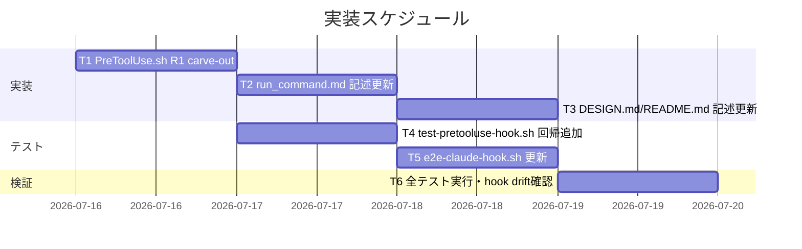
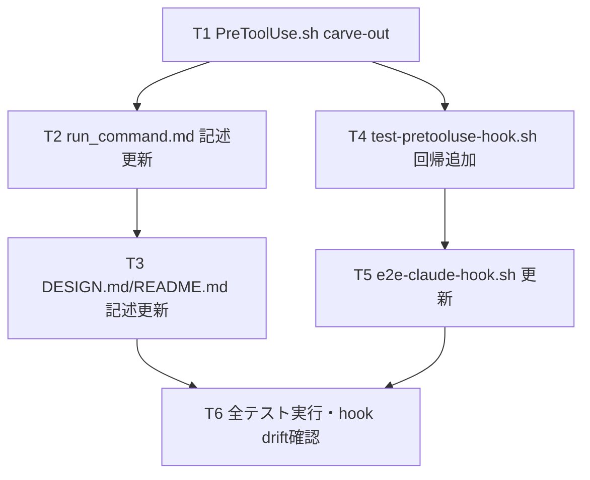

# 実装計画書: R1 の runtime/ 直接編集禁止（Bash heredoc 強制）と Auto Mode Bypass 分類器の構造的衝突の解消

**プロジェクト名**: R1 の runtime/ 直接編集禁止（Bash heredoc 強制）と Auto Mode Bypass 分類器の構造的衝突の解消
**作成日**: 2026 年 07 月 15 日
**最終更新**: 2026 年 07 月 15 日

> **重要**: **このドキュメントは常に更新**: 実装計画の変更、進捗状況の更新、バグの記録などがあった場合は、即座にこのドキュメントを更新してください。
> **必須項目**: 「必須」と明記した欄は空欄・抽象語のみで提出しないこと。テスト観点・BDD 仕様は具体ケースを 1 件以上記載すること。
>
> **用語**: [.agent-skill-chain/source/CONCEPTS.md §用語規約](../../../../../.agent-skill-chain/source/CONCEPTS.md#用語規約) を参照。

---

## 1. 実装概要

### 1.1 実装方針（必須）

`PreToolUse.sh` の R1 ブロックに basename allowlist 判定を追加して保護範囲を絞り（02_設計 ADR-1/ADR-2）、連動する記述（run_command.md・DESIGN.md・README.md）と回帰テスト（test-pretooluse-hook.sh・e2e-claude-hook.sh）を同一 PR 内で更新する。既存の R2〜R6 判定・判定順序は変更しない（ADR-3）。

### 1.2 実装順序（必須: 1 件以上）



優先順位: T1（実装本体）→ T4（単体回帰、T1 と並行可）→ T2・T3（記述整合）→ T5（E2E 更新）→ T6（総合検証）。

---

## 2. タスク分解

**用語**: [.agent-skill-chain/source/CONCEPTS.md §用語規約](../../../../../.agent-skill-chain/source/CONCEPTS.md#用語規約) を参照。

### 2.1 タスク 1: PreToolUse.sh R1 carve-out 実装

#### 2.1.1 概要（必須）

R1 ブロックに basename allowlist 判定を追加し、issue ドキュメント（10 basename）への Edit/Write を allow、memo・workflow.db\* への Edit/Write は引き続き block する。

#### 2.1.2 実装内容（必須: 1 件以上）

- `.agent-skill-chain/source/enforcement/claude/PreToolUse.sh` の R1 ブロック（既存 264〜275 行相当）内に、`.gitignore` 厳密一致判定の**次**の分岐として、basename 抽出（`${PATH_TARGET##*/}` 相当）→ 固定集合 `{00_要求定義.md, 00_システム理解.md, 01_要件定義.md, 02_設計.md, 03_実装計画.md, 04_review.md, 05_最終確認チェックリスト.md, 90_issues.md, 99_PR.md, 99_PR_review.md}`（02_設計 ADR-2 で確定・10 basename）との厳密一致 → パスに `/memo/` を含まないこと、の 3 条件を AND で満たす場合のみ allow するコードを追加する。
- **実装制約（review-docs ラウンド1で追加・必須遵守）**: carve-out の allow 判定は、既存の `.gitignore` 厳密一致例外（270〜271 行）と同じ **`:`（no-op）によるフォールスルー方式**で実装すること。**`allow()`（`exit 0` の早期終了）を呼んではならない。** 理由: `allow()` で早期終了すると、`ROLE=orchestrator かつ IS_SUBAGENT!="1"`（main 自身）が doc basename を直接 Edit しようとした際に、後続の R2 ブロック（277〜320 行）に到達する前にスクリプトが終了してしまい、**orchestrator の直接編集が R2 を経由せず素通りする重大な退行**を招く。フォールスルーであれば、carve-out 一致後も R2 の評価が必ず行われ、orchestrator は引き続き block される（02_設計 ADR-1 実装制約を参照）。
- 追加箇所には ADR-1・ADR-2 を指すコメント（例: `# ADR-1/ADR-2（本 issue・02_設計）: 保護対象外の issue ドキュメントは basename 厳密一致で allow（no-op フォールスルー・R2 到達を妨げない）`）を付け、既存 R1 コメント（264〜268 行）の「他の runtime/ 配下ファイルへの禁止は一切広げない」という記述を、新しい carve-out の存在を踏まえて更新する。
- 既存の `.gitignore` 例外判定（270〜271 行）・block 分岐（272〜274 行）のコード位置・順序は変更せず、carve-out はこれらの**間**（`.gitignore` 一致 No → runtime/ 配下 Yes → basename 判定）に挿入する。

#### 2.1.3 テスト観点（必須）

**参照**: 観点の定義は [02_設計 §6](./02_設計.md) および [RULES のテスト戦略・TEST_BDD_FORMAT](../../../../../.agent-skill-chain/source/RULES.md#テスト戦略必須要件) を参照。以下は本タスクの具体ケースのみ。

##### 単体（本タスクの具体ケース・必須 1 件以上）

- 正常系: `.agent-skill-chain/runtime/{issue}/00_要求定義.md` への Edit は allow（exit 0）される。
- 正常系: `.agent-skill-chain/runtime/{issue}/90_issues/{sub}/02_設計.md`（サブ issue 配下）への Write も同様に allow される（深さに依存しない）。
- 異常系（回帰）: `.agent-skill-chain/runtime/{issue}/memo/20260715_100000_foo.md` への Edit は引き続き block（exit 2）される。
- 異常系（回帰）: `.agent-skill-chain/runtime/workflow.db` への Write は引き続き block（exit 2）される。
- 境界値: `.agent-skill-chain/runtime/{issue}/00_要求定義.md.bak`（allowlist basename と前方一致するが完全一致しない）は block される（過剰許可防止）。
- 境界値: `.agent-skill-chain/runtime/.gitignore` への既存例外は引き続き allow される（既存 UC9 の回帰無し）。
- **重要（review-docs ラウンド1・敵対的観点1で追加）**: `AGENT_ROLE=orchestrator`（`agent_id` 無し・main 自身）が `.agent-skill-chain/runtime/{issue}/00_要求定義.md` を Edit しようとした場合、carve-out 一致後も **R2 により引き続き block（exit 2）される**こと（carve-out がフォールスルーで実装され、R2 の評価を妨げていないことの確認）。
- **残存リスクの固定化（review-docs ラウンド1・敵対的観点3で追加）**: `AGENT_ROLE=unknown` が `.agent-skill-chain/runtime/{issue}/00_要求定義.md` を Edit しようとした場合、carve-out 導入後は **新たに allow（exit 0）される**こと（02_設計 ADR-1 の残存リスクとして受容した挙動を明示的に固定化する）。一方、同じ `AGENT_ROLE=unknown` で `memo/*.md`・`workflow.db` への Edit/Write は引き続き block されること（既存 `uc5_unknown_role_workflow_blocked` は対象外パス `note.md` のため無変更で回帰確認）。
- 境界値（`/memo/` 判定の頑健性・review-docs ラウンド1・敵対的観点5で追加）: `.agent-skill-chain/runtime/{issue}/memo2/00_要求定義.md`（`memo` に後続文字がある lookalike ディレクトリ）への Edit は、`/memo/` 非包含条件を満たす（`memo2/` は `/memo/` と一致しない）ため **allow（exit 0）される**こと（誤って block しないことの確認）。

##### 結合/API（本タスクの具体ケース・該当時は必須 1 件以上）

- 該当なし（PreToolUse.sh は単体のシェルスクリプト判定であり、外部 API 契約を持たない）。

##### E2E/受け入れ（本タスクの具体ケース・未達時は理由記載）

- タスク 5（e2e-claude-hook.sh 更新）で担保する。本タスク単体では未達（理由: E2E は配線経由の確認であり、hook 本体の変更と同一タスクでは検証しない設計のため）。

##### バリデーション（該当する場合の具体ケース）

- basename 抽出ロジックが、絶対パス表記（例: `/repo/.agent-skill-chain/runtime/x/00_要求定義.md`）でも相対パス表記でも同一の basename を得られること（既存 UC9 シナリオ5 の絶対パス対応パターンを踏襲）。

#### 2.1.4 単体テスト仕様（BDD）（必須）

**BDD 形式のテストケース（高レベル仕様）**:

```gherkin
Feature: PreToolUse.sh R1 carve-out
  Scenario: 00_要求定義.md への Edit は allow される
    Given AGENT_ROLE が worker で、対象パスが .agent-skill-chain/runtime/{issue}/00_要求定義.md である
    When Edit ツールで当該パスを編集しようとする
    Then 終了コードは 0（allow）である

  Scenario: memo への Edit は引き続き block される
    Given AGENT_ROLE が worker で、対象パスが .agent-skill-chain/runtime/{issue}/memo/20260715_100000_foo.md である
    When Edit ツールで当該パスを編集しようとする
    Then 終了コードは 2（block）である

  Scenario（review-docs ラウンド1追加）: orchestrator（main・非subagent）は carve-out 後も R2 により block される
    Given AGENT_ROLE が orchestrator で agent_id が無く（main 自身）、対象パスが .agent-skill-chain/runtime/{issue}/00_要求定義.md である
    When Edit ツールで当該パスを編集しようとする
    Then 終了コードは 2（block、R2 が carve-out を経由せず独立に発火する）である

  Scenario（review-docs ラウンド1追加）: ROLE=unknown は doc basename について新たに allow される（残存リスクの固定化）
    Given AGENT_ROLE が unknown で、対象パスが .agent-skill-chain/runtime/{issue}/00_要求定義.md である
    When Edit ツールで当該パスを編集しようとする
    Then 終了コードは 0（allow、02_設計 ADR-1 で受容した残存リスクの挙動）である
```

**テストコード例（必須: インラインコメントで Given/When/Then を明記）**

```bash
# ユースケース: R1 が保護範囲を絞ったうえで issue ドキュメントの Edit/Write を allow し、
#   memo・workflow.db への保護は従来どおり block し続けること。

# シナリオ: 00_要求定義.md への Edit は allow される（本 issue の主目的）
test_r1_carveout_00_allowed() {
  local json='{"tool_name":"Edit","tool_input":{"file_path":".agent-skill-chain/runtime/x/00_要求定義.md"}}'
  # Given: AGENT_ROLE=worker、対象パスが 00_要求定義.md（allowlist 対象）
  # When: stdin JSON を PreToolUse.sh へ注入して実行
  local RC
  RC=$(run_hook worker "$json")
  # Then: 終了コードは 0（allow）
  assert_eq 0 "$RC" "T1[carveout]: 00_要求定義.md の Edit は exit 0"
}

# シナリオ（回帰）: memo への Edit は引き続き block される
test_r1_memo_still_blocked() {
  local json='{"tool_name":"Edit","tool_input":{"file_path":".agent-skill-chain/runtime/x/memo/20260715_100000_foo.md"}}'
  # Given: AGENT_ROLE=worker、対象パスが memo 配下（保護対象・allowlist 対象外）
  # When: stdin JSON を PreToolUse.sh へ注入して実行
  local RC
  RC=$(run_hook worker "$json")
  # Then: 終了コードは 2（block・回帰なし）
  assert_eq 2 "$RC" "T1[regression]: memo の Edit は exit 2（保護維持）"
}

# シナリオ（review-docs ラウンド1追加）: orchestrator（main・非subagent）は carve-out 後も R2 により block される
test_r1_carveout_does_not_bypass_r2_orchestrator() {
  local json='{"tool_name":"Edit","tool_input":{"file_path":".agent-skill-chain/runtime/x/00_要求定義.md"}}'
  # Given: AGENT_ROLE=orchestrator、agent_id 無し（main 自身）、対象パスが 00_要求定義.md（carve-out 対象）
  # When: stdin JSON を PreToolUse.sh へ注入して実行
  local RC
  RC=$(run_hook orchestrator "$json")
  # Then: 終了コードは 2（block・carve-out がフォールスルーのため R2 が独立に発火する）
  assert_eq 2 "$RC" "T1[R2独立性]: orchestrator の 00_要求定義.md Edit は carve-out 後も exit 2"
}

# シナリオ（review-docs ラウンド1追加）: ROLE=unknown は doc basename について新たに allow される
test_r1_carveout_allows_unknown_role_for_docs() {
  local json='{"tool_name":"Edit","tool_input":{"file_path":".agent-skill-chain/runtime/x/00_要求定義.md"}}'
  # Given: AGENT_ROLE=unknown、対象パスが 00_要求定義.md（carve-out 対象）
  # When: stdin JSON を PreToolUse.sh へ注入して実行
  local RC
  RC=$(run_hook unknown "$json")
  # Then: 終了コードは 0（allow・02_設計 ADR-1 の残存リスクとして受容した挙動を固定化）
  assert_eq 0 "$RC" "T1[残存リスク固定化]: unknown role の 00_要求定義.md Edit は exit 0"
}

# シナリオ（review-docs ラウンド1追加）: memo lookalike ディレクトリ（memo2/）は誤って block されない
test_r1_carveout_memo_lookalike_not_blocked() {
  local json='{"tool_name":"Edit","tool_input":{"file_path":".agent-skill-chain/runtime/x/memo2/00_要求定義.md"}}'
  # Given: AGENT_ROLE=worker、対象パスが memo2/（保護対象 memo/ の lookalike・実際は非保護）
  # When: stdin JSON を PreToolUse.sh へ注入して実行
  local RC
  RC=$(run_hook worker "$json")
  # Then: 終了コードは 0（allow・"/memo/" 部分文字列判定が "memo2/" を誤検知しないことの確認）
  assert_eq 0 "$RC" "T1[lookalike]: memo2/00_要求定義.md の Edit は exit 0（誤block防止）"
}
```

#### 2.1.5 依存関係

- 依存タスクなし（本タスクが起点）。



#### 2.1.6 見積もり

- **工数**: 0.5〜1 人日。
- **優先度**: 高。

### 2.2 タスク 2: run_command.md §Constraints の記述更新

#### 2.1.1 概要（必須）

「`.agent-skill-chain/runtime/` 配下は Bash heredoc 必須・Edit/Write 不可」という一律の記述（65 行目）を、「memo・workflow.db は Bash 経由必須、00〜04・90_issues.md は Edit/Write 可」に区別する記述へ更新する。

#### 2.1.2 実装内容（必須: 1 件以上）

- `.agent-skill-chain/source/skills/agent/run_command.md` §Constraints の該当項目を、T1 で実装した R1 の新しい適用範囲と整合する文言に書き換える。「Edit/Write ツールはこの配下では使用できない」という一律の断定を、対象を明示した区別（memo・workflow.db は Bash 必須／issue ドキュメント（00〜04 等・allowlist の正本は 02_設計 ADR-2）は Edit/Write 可）へ変更する。run_command.md 自体はプロセス文書であり厳密な10 basename列挙は不要（正本は allowlist 実装コードと 02_設計 ADR-2 の1か所に集約し、重複記載を避ける）。
- 変更後の文言が、消費者環境の正規委譲手順で「Edit/Write 制限を Bash で回避する」という構造を含まないことを確認する（00_要求定義.md 成功基準 1 の直接対応）。

#### 2.1.3 テスト観点（必須）

##### 単体（本タスクの具体ケース・必須 1 件以上）

- 該当なし（ドキュメント記述の変更であり、自動テスト対象外）。人手レビュー（review-docs ゲート）で、記述が T1 の実装と矛盾しないことを確認する。

##### 結合/API（本タスクの具体ケース・該当時は必須 1 件以上）

- 該当なし。

##### E2E/受け入れ（本タスクの具体ケース・未達時は理由記載）

- 未達（理由: ドキュメント記述自体は実行可能な振る舞いを持たないため E2E 対象外。整合性は review-docs の人手レビューで確認する）。

##### バリデーション（該当する場合の具体ケース）

- 該当なし。

#### 2.1.4 単体テスト仕様（BDD）（必須）

```gherkin
Feature: run_command.md の記述整合
  Scenario: 00〜04 の委譲手順が Bash 迂回を必要としない記述になっている
    Given run_command.md §Constraints が更新されている
    When review-docs で当該記述と PreToolUse.sh R1 の実装を突き合わせる
    Then 00〜04・90_issues.md については Edit/Write 可と明記されており、Bash 強制の記述が残っていない
```

（本タスクは実行可能コードを持たないため、テストコード例は省略し review-docs のチェックリスト運用に委ねる。）

#### 2.1.5 依存関係

- T1（PreToolUse.sh の実装が確定してから、それと矛盾しない記述にする）。

#### 2.1.6 見積もり

- **工数**: 0.25 人日。
- **優先度**: 高。

### 2.3 タスク 3: DESIGN.md・README.md・EVIDENCE_POLICY.md の記述整合

#### 2.1.1 概要（必須）

R1 の新しい保護範囲（memo・workflow.db\*のみ）を enforcement 文書に反映し、issue #18 の結論（非対称は意図的設計）を否定せず「追加の洗練」として記述する。

#### 2.1.2 実装内容（必須: 1 件以上）

- `.agent-skill-chain/source/enforcement/DESIGN.md` §「R1（path 軸）との非対称は意図的」（52〜53 行）に、R1 の保護対象が `.agent-skill-chain/runtime/` 配下**全体**ではなく **memo・workflow.db\*** に絞られたこと、および issue ドキュメント（10 basename：`00_要求定義.md`・`00_システム理解.md`・`01_要件定義.md`・`02_設計.md`・`03_実装計画.md`・`04_review.md`・`05_最終確認チェックリスト.md`・`90_issues.md`・`99_PR.md`・`99_PR_review.md`）は allowlist で明示的に除外されることを追記する。「#18 の結論（非対称そのものはバグではない）」は維持しつつ、保護「範囲」が本 issue で絞られた旨を明記する（経緯の詳細説明ではなく結論のみを追記し、ノイズ化させない）。
- **実装制約・残存リスクの記述追加（review-docs ラウンド1で追加）**: DESIGN.md の当該節に、(a) carve-out はフォールスルー方式で実装され R2 の orchestrator block を妨げないこと、(b) ROLE=unknown の doc basename への Edit/Write は新たに allow される残存リスクを受容していること、の 2 点を簡潔に追記する（02_設計 ADR-1 の記述と整合させる）。
- `.agent-skill-chain/source/enforcement/README.md` §「矯正するもの（物理強制の例）」に、R1 の carve-out（issue ドキュメント 10 basename への Edit/Write は allow、memo・workflow.db\*は block）を反映する。
- **EVIDENCE_POLICY.md は変更不要**と判断する（本タスクの対象は R1 の実装・記述整合であり、EVIDENCE_POLICY.md 自体の調査規律（§「バグ/矛盾と結論づける前の関連ルール横断確認」）は本 issue の一次情報検証で実際に機能した。同ポリシーの記述自体を変える理由がないため、対象外とする。この判断根拠を本欄に明記し、変更漏れではなく意図的な対象外判定であることを示す）。

#### 2.1.3 テスト観点（必須）

##### 単体（本タスクの具体ケース・必須 1 件以上）

- 該当なし（ドキュメント整合は自動テスト対象外）。review-docs で、DESIGN.md・README.md の記述が T1 の実装（allowlist の具体的な basename 集合）と一致することを確認する。

##### 結合/API（本タスクの具体ケース・該当時は必須 1 件以上）

- 該当なし。

##### E2E/受け入れ（本タスクの具体ケース・未達時は理由記載）

- 未達（理由: ドキュメント記述であり実行可能な振る舞いを持たないため）。

##### バリデーション（該当する場合の具体ケース）

- 該当なし。

#### 2.1.4 単体テスト仕様（BDD）（必須）

```gherkin
Feature: enforcement 文書の記述整合
  Scenario: 前回 issue #18 の結論を反転させずに保護範囲の絞り込みを追記する
    Given DESIGN.md に issue #18 の結論（R1 全ROLE一律は意図的設計）が既に記載されている
    When 本タスクで保護範囲の絞り込み（memo・workflow.db* のみ）を追記する
    Then #18 の結論（非対称は意図的設計）を否定する記述を含まない
    And 保護目的の記述（memo タイムスタンプ整合性・workflow.db 書込整合性）は維持される
```

#### 2.1.5 依存関係

- T1（実装の具体的な allowlist 集合が確定してから記述する）、T2（run_command.md の記述と整合させる）。

#### 2.1.6 見積もり

- **工数**: 0.25 人日。
- **優先度**: 中。

### 2.4 タスク 4: test-pretooluse-hook.sh への回帰テスト追加

#### 2.1.1 概要（必須）

既存 UC9（`.gitignore` 厳密一致例外）と同型の新規ユースケース（UC13）として、R1 carve-out の allow/block 双方の回帰ケースを追加する。**実装時の番号修正**: 当初計画では「UC10」を想定していたが、実装時に確認したところ `test/test-pretooluse-hook.sh` には既存の別テスト（project 固有 allowlist 拡張・582行）が既に UC10 を使用していたため、番号衝突を避け UC13（既存 UC12 の後段）として追加した。

#### 2.1.2 実装内容（必須: 1 件以上）

- `test/test-pretooluse-hook.sh` に、UC9（508〜556 行）の後段に新規セクション（例: `# UC13: R1 carve-out（issue ドキュメントの allow・memo/workflow.db* の block 維持）`）を追加する。
- 最低限のシナリオ: (1) `00_要求定義.md` への Edit が exit 0、(2) サブ issue 配下（`90_issues/{sub}/02_設計.md`）への Write が exit 0、(3) `memo/*.md` への Edit が exit 2（回帰）、(4) `workflow.db` への Write が exit 2（回帰）、(5) `00_要求定義.md.bak`（前方一致だが非完全一致）が exit 2（過剰許可防止・境界値）、(6) `AGENT_ROLE=orchestrator`（agent_id 無し）+ `00_要求定義.md` が exit 2（R2 独立性・review-docs ラウンド1追加）、(7) `AGENT_ROLE=unknown` + `00_要求定義.md` が exit 0（残存リスクの固定化・review-docs ラウンド1追加）、(8) `memo2/00_要求定義.md`（lookalike）が exit 0（誤block防止・review-docs ラウンド1追加）。
- **UC3（239〜248行、`uc3_workflow_edit_exit2`）を確定的に修正する（review-docs ラウンド1・敵対的観点6で発見。当初計画からの見落としを是正）**: UC3 は現在 `.agent-skill-chain/runtime/x/00_要求定義.md` への Edit（ROLE=worker）を exit 2 と期待する、R1 ブロックの**フラッグシップテスト**（`assert_grep "direct edit of .agent-skill-chain/runtime/ is forbidden"` を含む）である。carve-out 導入後は `00_要求定義.md` が allow 対象になるため、**このテストは対象パスを保護対象ファイル（例: `.agent-skill-chain/runtime/x/note.md` または `.agent-skill-chain/runtime/x/memo/foo.md`）に差し替え、`assert_grep` の期待メッセージも維持する**。あわせて、同じ UC3 セクション内に**新規シナリオ**（例: `uc3_workflow_doc_edit_now_allowed`）を追加し、`00_要求定義.md` への Edit が exit 0 になる新仕様を明示的にテストする（UC3 のセクション名「exit 2 ブロック化」が今後は「保護対象への block と issue ドキュメントへの allow の両方を示すセクション」であることをコメントで明記する）。
- **UC8 ケース3（463〜469行）を確定的に修正する（review-docs ラウンド1・敵対的観点2で条件付きから確定へ変更）**: 当初計画では「対象であれば差し替える」という条件付き記載だったが、review-docs で対象パス（`.agent-skill-chain/runtime/x/00_要求定義.md`）が carve-out 対象であることを確定した。ケース3 のコメント・アサーションを、対象パスを保護対象ファイル（例: `.agent-skill-chain/runtime/x/memo/foo.md`）に差し替え、期待コメントを「R1（memo・workflow.db\* への直接編集）は subagent でも不変」に更新する。

#### 2.1.3 テスト観点（必須）

##### 単体（本タスクの具体ケース・必須 1 件以上）

- タスク 1 の §2.1.3 に列挙した全ケース（正常系 2 件・異常系（回帰）2 件・境界値 2 件）を、jq 有/無双方の系統（既存テストファイルの `NOJQ_PATH` 機構）で実行する。

##### 結合/API（本タスクの具体ケース・該当時は必須 1 件以上）

- 該当なし。

##### E2E/受け入れ（本タスクの具体ケース・未達時は理由記載）

- タスク 5 で担保（本タスクは隔離環境（`mktemp -d` + `git archive`）での単体テストに限定）。

##### バリデーション（該当する場合の具体ケース）

- 既存 UC9 のシナリオ 1〜5（`.gitignore` 例外・過剰マッチ防止・絶対パス対応）が回帰しないことを同一テスト実行で確認する。

#### 2.1.4 単体テスト仕様（BDD）（必須）

```gherkin
Feature: test-pretooluse-hook.sh UC13（R1 carve-out 回帰スイート）
  Scenario: サブ issue 配下の 02_設計.md への Write も allow される
    Given AGENT_ROLE が worker で、対象パスが .agent-skill-chain/runtime/x/90_issues/y/02_設計.md である
    When Write ツールで当該パスを編集しようとする
    Then 終了コードは 0（allow、深さに依存しない）

  Scenario: 前方一致のみのファイル名は block される（過剰許可防止）
    Given AGENT_ROLE が worker で、対象パスが .agent-skill-chain/runtime/x/00_要求定義.md.bak である
    When Edit ツールで当該パスを編集しようとする
    Then 終了コードは 2（block、basename 完全一致でないため allow されない）

Feature: test-pretooluse-hook.sh UC3（既存フラッグシップテストの修正・review-docs ラウンド1）
  Scenario: 保護対象（memo）への Edit は引き続き exit 2（UC3 修正後）
    Given AGENT_ROLE が worker で、対象パスが .agent-skill-chain/runtime/x/memo/foo.md である
    When Edit ツールで当該パスを編集しようとする
    Then 終了コードは 2（block、既存 UC3 の趣旨を保護対象ファイルで維持）

  Scenario: issue ドキュメントへの Edit は新たに exit 0（UC3 新規シナリオ）
    Given AGENT_ROLE が worker で、対象パスが .agent-skill-chain/runtime/x/00_要求定義.md である
    When Edit ツールで当該パスを編集しようとする
    Then 終了コードは 0（allow、carve-out 導入後の新仕様）

Feature: test-pretooluse-hook.sh UC8ケース3（確定修正・review-docs ラウンド1）
  Scenario: agent_id 付き subagent でも memo への直接編集は R1 で block（不変）
    Given AGENT_ROLE が orchestrator を継承した subagent（agent_id あり）で、対象パスが .agent-skill-chain/runtime/x/memo/foo.md である
    When Edit ツールで当該パスを編集しようとする
    Then 終了コードは 2（block、R1 の memo 保護は subagent でも不変）
```

```bash
# ユースケース: UC13 — R1 carve-out の allow/block 双方が jq 有無を問わず正しく動作すること。

# シナリオ: サブ issue 配下の 02_設計.md への Write は allow される（深さに依存しない）
test_uc10_subissue_doc_allowed() {
  local json='{"tool_name":"Write","tool_input":{"file_path":".agent-skill-chain/runtime/x/90_issues/y/02_設計.md"}}'
  # Given: AGENT_ROLE=worker、対象パスがサブ issue 配下の 02_設計.md
  # When: HOOK に stdin JSON を注入して実行
  local RC
  RC=$(run_hook worker "$json")
  # Then: 終了コードは 0（allow）
  assert_eq 0 "$RC" "UC13: サブ issue配下の02_設計.mdは exit 0"
}

# シナリオ（境界値）: 前方一致のみの偽装ファイル名は block される
test_uc10_lookalike_blocked() {
  local json='{"tool_name":"Edit","tool_input":{"file_path":".agent-skill-chain/runtime/x/00_要求定義.md.bak"}}'
  # Given: AGENT_ROLE=worker、対象パスが allowlist basename と前方一致するが完全一致しない
  # When: HOOK に stdin JSON を注入して実行
  local RC
  RC=$(run_hook worker "$json")
  # Then: 終了コードは 2（block、過剰許可防止）
  assert_eq 2 "$RC" "UC13: 00_要求定義.md.bak は exit 2（前方一致で誤許可しない）"
}

# --- UC3 修正（review-docs ラウンド1・敵対的観点6）: 対象パスを保護対象ファイルへ差し替え、新規シナリオを追加 ---

uc3_workflow_edit_exit2() {
  # シナリオ（修正後）: memo（保護対象）配下 Edit が exit 2（旧: 00_要求定義.md を対象にしていたが carve-out 後は allow になるため差し替え）
  # Given: AGENT_ROLE=worker、保護パス（memo 配下）を対象とした Edit JSON
  local json='{"tool_name":"Edit","tool_input":{"file_path":".agent-skill-chain/runtime/x/memo/foo.md"}}'
  # When: 違反 JSON を stdin で渡す
  run_pre "$PATH" worker "$json"
  # Then: 終了コードは 2（1 ではない）かつ理由が出る
  assert_eq 2 "$RC" "UC3: memo Edit は exit 2"
  assert_grep "direct edit of .agent-skill-chain/runtime/ is forbidden" "$ERR" "UC3: .workflow 直接編集禁止メッセージ"
}
uc3_workflow_doc_edit_now_allowed() {
  # シナリオ（新規・review-docs ラウンド1）: issue ドキュメント（00_要求定義.md）への Edit は carve-out 後 exit 0
  # Given: AGENT_ROLE=worker、対象パスが 00_要求定義.md（carve-out 対象）
  local json='{"tool_name":"Edit","tool_input":{"file_path":".agent-skill-chain/runtime/x/00_要求定義.md"}}'
  # When: JSON を stdin で渡す
  run_pre "$PATH" worker "$json"
  # Then: 終了コードは 0（allow・carve-out 導入後の新仕様）
  assert_eq 0 "$RC" "UC3: 00_要求定義.md の Edit は exit 0（carve-out）"
}

# --- UC8 ケース3 修正（review-docs ラウンド1・敵対的観点2・確定化） ---
# シナリオ（修正後）: agent_id 付きでも memo への直接編集は R1 で block（不変）
# Given: agent_id 付きだが保護対象パス（memo 配下）への Edit
# json3 = '{"tool_name":"Edit","tool_input":{"file_path":".agent-skill-chain/runtime/x/memo/foo.md"},"agent_id":"abc-123"}'
# 期待: exit 2（「R1（memo・workflow.db* への直接編集）は subagent でも不変」とコメントを更新）
```

#### 2.1.5 依存関係

- T1（PreToolUse.sh の実装が確定してから、それを検証するテストを書く）。

#### 2.1.6 見積もり

- **工数**: 0.5 人日。
- **優先度**: 高。

### 2.5 タスク 5: e2e-claude-hook.sh の `e2e_workflow_edit_blocked` 更新

#### 2.1.1 概要（必須）

配線経由 E2E シナリオ `e2e_workflow_edit_blocked`（116〜123 行）は現状 `.agent-skill-chain/runtime/x/00_要求定義.md` への Edit を block（exit 2）と期待しているが、これは carve-out 後の新仕様と矛盾する。保護対象（memo・workflow.db）への block シナリオへ差し替え、別途 00〜04 の allow を確認する新シナリオを追加する。

#### 2.1.2 実装内容（必須: 1 件以上）

- `test/e2e-claude-hook.sh` の `e2e_workflow_edit_blocked` を、対象パスを `.agent-skill-chain/runtime/x/memo/20260715_100000_foo.md`（保護対象）に差し替え、コメントを「R1 は memo・workflow.db\* に絞って適用される」旨に更新する。
- 新規シナリオ `e2e_workflow_doc_edit_allowed` を追加し、`.agent-skill-chain/runtime/x/00_要求定義.md` への Edit が配線経由で exit 0（allow）になることを確認する。
- 関数呼び出しリスト（126〜128 行付近）に新規関数呼び出しを追加する。

#### 2.1.3 テスト観点（必須）

##### 単体（本タスクの具体ケース・必須 1 件以上）

- タスク 4 が担当（本タスクは配線経由の E2E に限定）。

##### 結合/API（本タスクの具体ケース・該当時は必須 1 件以上）

- 該当なし。

##### E2E/受け入れ（本タスクの具体ケース・未達時は理由記載）

- 配線経由（`settings.enforce.json` 等の実配線を模した `run_wired` ヘルパー）で、(1) `memo/*.md` への Edit が exit 2、(2) `00_要求定義.md` への Edit が exit 0、の双方を確認する。

##### バリデーション（該当する場合の具体ケース）

- 既存の `e2e_orchestrator_write_blocked`・`e2e_orchestrator_read_allowed`（95〜113 行）が回帰しないことを同一テスト実行で確認する（R2 側は本 issue の変更対象外）。

#### 2.1.4 単体テスト仕様（BDD）（必須）

```gherkin
Feature: e2e-claude-hook.sh 配線経由シナリオの更新
  Scenario: 配線経由で 00_要求定義.md への Edit が allow される
    Given settings 配線・AGENT_ROLE=worker・対象パスが .agent-skill-chain/runtime/x/00_要求定義.md
    When settings の hook コマンドへ stdin JSON を注入する
    Then 終了コードは 0（allow）

  Scenario: 配線経由で memo への Edit は引き続き block される
    Given settings 配線・AGENT_ROLE=worker・対象パスが .agent-skill-chain/runtime/x/memo/20260715_100000_foo.md
    When settings の hook コマンドへ stdin JSON を注入する
    Then 終了コードは 2（block、保護維持）
```

```bash
# ユースケース: 配線済み hook（.claude/hooks/PreToolUse.sh 相当）でも carve-out が機能すること。

# シナリオ: 配線経由で 00_要求定義.md への Edit が allow される
e2e_workflow_doc_edit_allowed() {
  local json='{"tool_name":"Edit","tool_input":{"file_path":".agent-skill-chain/runtime/x/00_要求定義.md"}}'
  # Given: settings 配線・AGENT_ROLE=worker・保護対象外パス（00_要求定義.md）
  # When: settings の hook コマンドへ stdin JSON 注入
  run_wired worker "$json"
  # Then: exit 0（配線経由でも carve-out が機能する）
  assert_eq 0 "$RC" "C-3: 配線経由 00_要求定義.md の Edit は exit 0（allow）"
}

# シナリオ（更新後）: 配線経由で memo への Edit は引き続き block される
e2e_workflow_edit_blocked() {
  local json='{"tool_name":"Edit","tool_input":{"file_path":".agent-skill-chain/runtime/x/memo/20260715_100000_foo.md"}}'
  # Given: settings 配線・AGENT_ROLE=worker・保護対象パス（memo）への Edit
  # When: settings の hook コマンドへ stdin JSON 注入
  run_wired worker "$json"
  # Then: exit 2（R1 は保護対象に絞って配線経由でも発火）
  assert_eq 2 "$RC" "C-3: 配線経由 memo Edit は exit 2（block・保護維持）"
}
```

#### 2.1.5 依存関係

- T1・T4（hook 実装とその単体テストが確定してから E2E を更新する）。

#### 2.1.6 見積もり

- **工数**: 0.25 人日。
- **優先度**: 高。

### 2.6 タスク 6: 全テスト実行・hook drift 確認

#### 2.1.1 概要（必須）

`test/test-pretooluse-hook.sh`・`test/e2e-claude-hook.sh` を tmp 隔離環境で実行し、全 PASS を確認する。あわせて `check-hook-drift.sh` で正本と配備済み hook の乖離状態を確認する（本リポは配備済み `.claude/hooks/` が `.gitignore` 対象のローカル生成物であるため、乖離があっても本 issue のスコープ外である旨を 04_review で明記する）。

#### 2.1.2 実装内容（必須: 1 件以上）

- `bash test/test-pretooluse-hook.sh` を実行し、既存ケース + 新規 UC13 が全 PASS であることを確認する。
- `bash test/e2e-claude-hook.sh` を実行し、既存ケース + 更新後の `e2e_workflow_edit_blocked`・新規 `e2e_workflow_doc_edit_allowed` が全 PASS であることを確認する。
- `bash .agent-skill-chain/source/scripts/check-hook-drift.sh .` を実行し、結果（`[OK]`/`[DRIFT]`/`[INFO]`）を記録する（read-only・実際の同期は行わない）。

#### 2.1.3 テスト観点（必須）

##### 単体（本タスクの具体ケース・必須 1 件以上）

- タスク 4・5 の全ケースが実行され PASS すること。

##### 結合/API（本タスクの具体ケース・該当時は必須 1 件以上）

- 該当なし。

##### E2E/受け入れ（本タスクの具体ケース・未達時は理由記載）

- タスク 5 の E2E ケースが全 PASS すること。

##### バリデーション（該当する場合の具体ケース）

- `check-hook-drift.sh` の出力が想定どおり（本リポではローカル `.claude/hooks/` 未配備または乖離検知のいずれかであり、いずれであっても本タスクの合否には影響しないこと）を確認する。

#### 2.1.4 単体テスト仕様（BDD）（必須）

```gherkin
Feature: 総合検証（回帰なし確認）
  Scenario: 全既存テスト + 新規回帰テストが PASS する
    Given T1〜T5 の変更がすべて適用されている
    When test-pretooluse-hook.sh と e2e-claude-hook.sh を実行する
    Then 全ケースが PASS し、FAIL が 0 件である
```

（本タスクはテストランナーの実行確認であり、新規プロダクションコードを持たないためテストコード例は省略する。）

#### 2.1.5 依存関係

- T1〜T5 全て完了後に実行する。

#### 2.1.6 見積もり

- **工数**: 0.25 人日。
- **優先度**: 高。

---

### 2.7 タスク 7: R1 carve-out の symlink/hardlink 実体すり替え耐性（CodeRabbit PR#92 指摘対応）

#### 2.7.1 概要（必須）

02_設計 ADR-4 のとおり、R1 carve-out の basename 判定を realpath 実体解決で補強し、doc 名の symlink/hardlink が保護対象（`memo/`・`workflow.db*`）を指す場合に block する。前回レビュー（04_review §12.1 旧記述）が「残存リスク受容・コード変更なし」と誤判断した点を、事故防止の観点から是正しコードで対応する。

#### 2.7.2 実装内容（必須: 1 件以上）

- `PreToolUse.sh` に `r1_norm_path()`（`realpath -m`→`readlink -f`→`realpath` の欠損許容優先で実体解決）と `r1_has_extra_hardlink()`（`stat` の `nlink>1` を best-effort 検知）の 2 ヘルパを追加する。
- R1 carve-out の allow 分岐（フォールスルー方式は維持）に、実体解決後のパスが `/memo/` を含む・basename が `workflow.db*` に一致する場合、および実在 symlink が解決不能な場合、および nlink>1 の通常ファイルの場合を block する分岐を挿入する。
- ヘルパの限界（相手側 hardlink 名の非列挙・`stat`/`realpath` 不在時の省略）は `is_sqlite3_invocation` と同じスタイルでコメントに正直に明記する。

#### 2.7.3 テスト観点（必須）

##### 単体（本タスクの具体ケース・必須 1 件以上）

- `test/test-pretooluse-hook.sh` に UC14（jq/nojq 両系統）を追加し、実際に隔離ディレクトリへ symlink/hardlink を作成して以下を検証する:
  - doc 名の symlink が `workflow.db` を指す Write は exit 2（保護パス理由）。
  - doc 名の symlink が `memo/` 配下を指す Edit は exit 2（保護パス理由）。
  - doc 名のハードリンクが `workflow.db` と inode 共有する Write は exit 2（nlink>1 理由）。
  - 実在する通常 doc ファイル・未作成の新規 doc・非保護 doc を指す symlink は exit 0（過剰 block・誤 block しない回帰）。
- テストが実際に symlink/hardlink を作れるよう、nojq PATH の coreutils シムに `stat`・`ln` を追加する。

#### 2.7.4 単体テスト仕様（BDD）（必須）

```gherkin
Feature: R1 carve-out の symlink/hardlink 実体すり替え耐性
  Scenario: doc 名の symlink が保護対象を指す
    Given .agent-skill-chain/runtime/x/00_要求定義.md が workflow.db を指す symlink
    When AGENT_ROLE=worker で当該パスへの Write JSON を hook に渡す
    Then 終了コードは 2（block）であり stderr に "protected path" を含む
  Scenario: 通常 doc は従来どおり allow
    Given .agent-skill-chain/runtime/x/03_実装計画.md が nlink==1 の通常ファイル
    When Write JSON を hook に渡す
    Then 終了コードは 0（allow・過剰 block しない）
```

#### 2.7.5 依存関係

- T1 完了後に実施する（同一 R1 ブロックへの追記のため）。

#### 2.7.6 見積もり

- **工数**: 0.5 人日。
- **優先度**: 高（enforcement 中核・CodeRabbit 未解決指摘）。

---

## テスト観点

本実装計画全体のテスト観点は、R1 の**保護範囲を絞った carve-out が正しく機能すること**（00〜04・90_issues.md の allow）と、**既存の保護（memo・workflow.db\*・`.gitignore` 例外）が回帰しないこと**の 2 軸に集約される。各タスクの §2.x.3 に具体ケースを記載済み。

---

## 単体テスト

`test/test-pretooluse-hook.sh` に UC13（タスク 4）を追加し、jq 有/無双方の系統・tmp 隔離環境（`mktemp -d` + `git archive HEAD`）で実行する。既存 UC1〜UC9 の回帰も同一実行で確認する。

---

## BDD

各タスクの §2.x.4 に記載した Gherkin シナリオを正とする。要点: (1) 00〜04・90_issues.md への Edit/Write は allow、(2) memo・workflow.db\*への Edit/Write は block（保護維持）、(3) 過剰許可防止（前方一致のみのファイル名は block）、(4) 既存 `.gitignore` 例外は回帰しない。

---

## 3. 実装スケジュール

### 3.1 マイルストーン

| マイルストーン | 期日 | 成果物 |
| ------------------ | ------ | -------- |
| 実装完了 | T3 完了時点 | PreToolUse.sh・run_command.md・DESIGN.md・README.md の更新差分 |
| テスト完了 | T6 完了時点 | test-pretooluse-hook.sh・e2e-claude-hook.sh の全 PASS ログ |

### 3.2 実装フェーズ

#### フェーズ 1: hook 実装・記述整合

- **期間**: 実装着手から 2〜3 人日目安。
- **タスク**: T1, T2, T3。

#### フェーズ 2: 回帰テスト・総合検証

- **期間**: フェーズ 1 完了後 1〜2 人日目安。
- **タスク**: T4, T5, T6。

---

## 4. テスト計画

テスト観点・レベル・BDD 形式の定義は **02_設計 §6** および **RULES のテスト戦略・TEST_BDD_FORMAT** を参照。各タスクの §2.x.3・§2.x.4 に具体ケースを記載済み。

### 4.1 テストの優先順位

- クリティカル: memo・workflow.db\*への保護が回帰しないこと（T4・T6 で厚く検証）。
- 影響範囲が広い: `PreToolUse.sh` は全ツール呼び出しの前段で評価されるため、R2〜R6 側の既存ケース全件を回帰テストに含める（T6 で test-pretooluse-hook.sh 全件実行）。

---

## 5. リスク管理

### 5.1 実装リスク

- **リスク**: `ALLOWED_DOC_BASENAMES` の固定集合が、将来 workflow/TEMPLATES.md に新しい成果物ファイルが追加された場合に追従されず、当該新ファイルが意図せず block されたまま放置される（または逆に、集合の保守漏れで意図しない allow が発生する）。
  - **対策**: `PreToolUse.sh` の該当コード近傍に、`workflow/TEMPLATES.md` の成果物一覧を更新する際は本 allowlist も同期させる旨のコメントを残す（T1 実装時に追加）。本リスクは低頻度（成果物ファイル種別の追加は稀）であり、都度対応で足りると判断する。
  - **review-docs ラウンド1での是正**: 当初ドラフトの固定集合（6件）は `.agent-skill-chain/runtime/templates/` 全体との突き合わせが不十分で、`00_システム理解.md`・`05_最終確認チェックリスト.md`・`99_PR.md`・`99_PR_review.md` の4件が漏れていた（RULES.md・REVIEW_RULE.md・TEMPLATES.md との突き合わせで発見）。02_設計 ADR-2・本計画タスク1で10 basenameに是正済み。
- **リスク**: carve-out 導入により、悪意ある命名（例: 保護対象を模した `00_要求定義.md` という名前で `memo/` 配下に実際は timestamp 偽装用ファイルを置く等）が発生する余地。
  - **対策**: 02_設計 ADR-2 のとおり、basename 厳密一致に加えパスの `/memo/` 非包含を必須条件とする組み合わせ判定を採用しており、`memo/` 配下に `00_要求定義.md` という名前を置いても、パスに `/memo/` が含まれる限り allow されない（block のまま）。T4 のテストケースにこの組み合わせを追加済み（review-docs ラウンド1で「任意拡張」から必須テストケースへ格上げ）。
- **リスク（review-docs ラウンド1・敵対的観点1で発見）**: carve-out の実装方式によっては、`ROLE=orchestrator`（main・非subagent）による doc basename への直接 Edit/Write が R2 を経由せず素通りする（もし carve-out を `allow()` の早期終了で実装した場合）。
  - **対策**: 02_設計 ADR-1・本計画タスク1のとおり、carve-out は既存 `.gitignore` 例外と同じ **フォールスルー（`:` no-op）方式で実装することを必須の実装制約とする**。T1 に専用の回帰テスト（`test_r1_carveout_does_not_bypass_r2_orchestrator`）を追加し、この制約が守られていることを機械的に固定化する。
- **残存リスク（review-docs ラウンド1・敵対的観点3で発見・受容）**: `ROLE=unknown`（役割検知が失敗した、または非標準ハーネス経由の場合）による doc basename への Edit/Write が、carve-out 導入後は新たに allow される（従来は R1 の役割非依存な防衛線により block されていた）。memo・workflow.db\* の保護は ROLE に関わらず維持されるため保護目的の中核は損なわれないが、正規配備環境（`enforce on` 時 `AGENT_ROLE=orchestrator` が静的配線される）では本ケースは主に手動実行・テスト環境でのみ生じる限定的なリスクである。02_設計 ADR-1 に受容判断として明記し、T1 に固定化テスト（`test_r1_carveout_allows_unknown_role_for_docs`）を追加した。

---

## 6. 参考資料

### プロジェクトドキュメント

- [`02_設計.md`](./02_設計.md) - 設計

### その他の参考資料

- [test/test-pretooluse-hook.sh](../../../../../test/test-pretooluse-hook.sh)
- [test/e2e-claude-hook.sh](../../../../../test/e2e-claude-hook.sh)
- [.agent-skill-chain/source/scripts/check-hook-drift.sh](../../../../../.agent-skill-chain/source/scripts/check-hook-drift.sh)

---

## 7. 前のステップ

この実装計画書は、以下のドキュメントを基に作成されています：

- **前**: [`02_設計.md`](./02_設計.md) - 設計フェーズ

---

## 8. 次のステップ

この実装計画書の承認後、以下のいずれかのステップに進みます：

- **実装着手前に review-docs（実装前ドキュメントレビュー）が必須（絶対強制）**: `mode: standard` のため免除されない。[skills/agent/run_command.md §Constraints](../../../../../.agent-skill-chain/source/skills/agent/run_command.md) の定めるとおり、design-feature（本 02/03）完了後・implement-feature 委譲前に review-docs を必ず経ること。未実行のまま implement-feature を実行すると enforcement #32 で FAIL する。review-docs の実行自体は本 command の対象外であり、次フェーズでオーケストレータが別途委譲する。
- 本プロジェクトは 1 issue で完結する見込みのため、サブ issue 分割（90_issues.md）は現時点で不要と判断する（分割が必要になった場合は追って作成する）。

**用語**: [.agent-skill-chain/source/CONCEPTS.md §用語規約](../../../../../.agent-skill-chain/source/CONCEPTS.md#用語規約) を参照。
