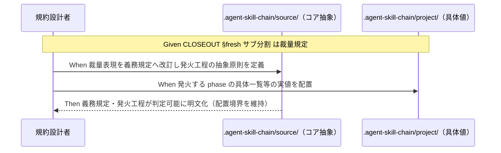

# 要件定義書: fresh サブ分割の義務化

**プロジェクト名**: fresh サブ分割の義務化
**作成日**: 2026 年 07 月 15 日
**最終更新**: 2026 年 07 月 15 日

> **重要**: **このドキュメントは常に更新**: 要件の変更や追加があった場合は、即座にこのドキュメントを更新してください。ドキュメントは「生きているドキュメント」として扱い、実装内容と常に同期させます。
>
> **用語**: [.agent-skill-chain/source/CONCEPTS.md §用語規約](../../../../../.agent-skill-chain/source/CONCEPTS.md#用語規約) を参照。

---

## 1. 概要

### 1.1 システム概要

本 issue は、AGENTS.md パッケージ（実行契約の集合）における **fresh サブ分割** の規範強度を「裁量」から「義務」へ格上げする**規約ドキュメント変更**である。

- **現状**: [.agent-skill-chain/source/CLOSEOUT.md §fresh サブ分割](../../../../../.agent-skill-chain/source/CLOSEOUT.md) は「工程は**必要に応じて** fresh なサブへ分割する」という裁量規定であり、具体機構（fresh サブ）は [.agent-skill-chain/source/CONTEXT_EFFICIENCY.md §適用のスケーリング](../../../../../.agent-skill-chain/source/CONTEXT_EFFICIENCY.md#適用のスケーリング) により **issue 起票局面（大規模一括起票時のみ）** に適用範囲が限定されている（evidence_source: existing_code — CLOSEOUT.md §fresh サブ分割 および CONTEXT_EFFICIENCY.md §適用のスケーリング の現行本文を確認）。
- **目的状態**: fresh サブ分割を規約中核における**義務規定**へ改訂し、feature 内の全工程（要求→要件→設計→実装計画→実装→レビューの反復を含む）でのコンテキスト肥大を機構的に抑止する。同時に、過剰適用（軽量作業への全機構強制）を免除条件で回避し、既存の継承機構（収束保証＋退行防止）を前提として維持する。

本 issue の成果物は**規約ドキュメントの改訂**であり、実行時コードの新規追加・外部サービスへの書き込みは伴わない。機械強制（audit チェックの新設）の設計・実装は本 issue のスコープ外（後続フェーズまたは別 issue）である。

### 1.2 用語集

| 用語 | 説明 |
| ---- | ---- |
| fresh サブ | 前工程の会話往復・文脈を引き継がず、新規に起動するサブエージェント。文脈をリセットしてトークン・コンテキストの肥大を防ぐ単位。 |
| fresh サブ分割 | ある工程を、それまでのサブとは別の fresh サブへ切り出して実行すること。CLOSEOUT.md §fresh サブ分割 が正本。 |
| 裁量規定 / 義務規定 | 「必要に応じて」等で実施を実行者の判断に委ねる規範が裁量規定、実施を必須とする規範が義務規定。 |
| 継承機構 | fresh 分割で文脈をリセットしても収束と退行防止を保つために、後続サブへ **収束保証（却下済み指摘＋理由）** と **退行防止（must-preserve リスト）** を引き継ぐ仕組み（CLOSEOUT.md §fresh サブ分割・REVIEW_DUAL_LENS.md §6）。 |
| 免除条件 | 過剰適用回避のため、fresh サブ分割義務を発火させない軽量運用の条件（quick モード・単一/少数 issue 等）。 |
| メイン文脈蓄積問題 | メイン（オーケストレータ）が feature 単位でしか /clear されず、1 feature 内の全フェーズ委譲を通じてメイン側の文脈が蓄積し続ける問題（CLOSEOUT.md §clear 境界）。 |
| 配置境界 | 抽象原則はコア `.agent-skill-chain/source/` に、具体値は `.agent-skill-chain/project/` に置くという分離規約。 |

---

## 2. 機能要件

### 2.1 ユーザーストーリー

#### ストーリー 1: fresh サブ分割を義務規定へ格上げする

- **As a** 実行契約の設計者（プロジェクトオーナー）
- **I want to** CLOSEOUT §fresh サブ分割 の裁量表現（「必要に応じて」）を義務規定へ改訂したい
- **So that** サブを毎回 fresh に建ててトークン爆発・コンテキスト肥大を防ぐという当初の設計意図が、規約上の義務として実効を持つ

**受け入れ基準**（対応: 00 成功基準 1）:

- CLOSEOUT §fresh サブ分割 の「必要に応じて」という裁量表現が、義務規定へ改訂されている（○/×で判定可能）。
- 改訂後も本文の正本は 1 か所（CLOSEOUT）に保たれ、他ファイルへは参照（リンク）で委譲される。

#### ストーリー 2: 義務が発火する工程を判定可能に明文化する

- **As a** 進行役（オーケストレータ）およびサブエージェント
- **I want to** fresh サブ分割義務がどの工程・局面で発火するのかを判定可能な形で知りたい
- **So that** どの phase 遷移・どの反復局面で新規 fresh サブが必須かを迷わず判断でき、適用有無を後から監査できる

**受け入れ基準**（対応: 00 成功基準 2）:

- fresh サブ分割義務が発火する工程・局面（例: フェーズ遷移時、レビュー↔修正の反復ループ時など、どの局面で新規サブが必須か）が判定可能な形で明文定義されている。
- 発火条件の抽象原則はコア `.agent-skill-chain/source/` に置き、発火する phase の具体一覧等の実値は `.agent-skill-chain/project/` に委ねる。

#### ストーリー 3: 過剰適用を免除条件で回避する

- **As a** 軽微作業・軽量運用を行う実行者
- **I want to** 軽量作業（quick モード・単一/少数 issue 等）には fresh サブ分割義務を強制しない免除条件を明記してほしい
- **So that** 軽微な修正にまでサブ起動コスト・往復増のオーバーヘッドが波及せず、既存の軽量運用が壊れない

**受け入れ基準**（対応: 00 成功基準 3）:

- 過剰適用回避の免除条件（quick モード・単一/少数 issue 等の軽量運用）が明記されている。
- 軽微作業に全機構が**新規に**強制されないことが確認できる（[.agent-skill-chain/source/CONTEXT_EFFICIENCY.md §適用のスケーリング](../../../../../.agent-skill-chain/source/CONTEXT_EFFICIENCY.md#適用のスケーリング) の軽量運用と矛盾しない）。

#### ストーリー 4: 継承機構を義務化の前提として維持する

- **As a** レビュー担当のサブエージェント
- **I want to** fresh 分割で文脈をリセットしても、収束保証（却下済み指摘＋理由）と退行防止（must-preserve リスト）の継承が保たれることを保証してほしい
- **So that** 義務化により fresh 分割が増えても、同じ指摘の蒸し返し（無限反復）や退行が発生しない

**受け入れ基準**（対応: 00 成功基準 4）:

- 継承機構（収束保証＋must-preserve 退行防止）が fresh 分割義務の前提として維持されることが明記されている。
- 継承が失われる分割は義務の対象としない旨が示されている（継承の前提が崩れる分割を強制しない）。
- 継承の原則本文は複製せず、[.agent-skill-chain/source/REVIEW_DUAL_LENS.md §6](../../../../../.agent-skill-chain/source/REVIEW_DUAL_LENS.md) へリンク委譲される。

#### ストーリー 5: メイン文脈蓄積問題のスコープを線引きする

- **As a** 本 issue の実装者・レビュアー
- **I want to** メイン（オーケストレータ）が feature 単位でしか /clear されないことに起因する文脈蓄積問題について、本 issue で扱う範囲と後続 issue へ委ねる範囲を明文で線引きしてほしい
- **So that** スコープが曖昧なまま /clear 粒度の再設計へ踏み込む過剰スコープを避け、本 issue の完了条件が判定可能になる

**受け入れ基準**（対応: 00 成功基準 5、00 §5 除外要件）:

- メイン文脈蓄積問題の扱いについて、本 issue のスコープ内/外の線引きが明文で示されている。
- メイン自身の feature 単位 /clear 粒度そのものの再設計は本 issue の除外要件であることが明記されている。

#### ストーリー 6: 配置境界と 1 ファイル 1 責務を維持する

- **As a** 規約全体の保守担当
- **I want to** 抽象原則をコアに、具体値を project に置く配置境界を守り、変更対象の各正本が 1 ファイル 1 責務・重複禁止を維持してほしい
- **So that** 具体値のコア混入・本文の複製による二重定義が発生せず、規約の保守性が保たれる

**受け入れ基準**（対応: 00 成功基準 6・7）:

- コア抽象／project 具体の配置境界が守られ、具体値が `.agent-skill-chain/source/` に混入していない。
- 変更対象の各正本（CLOSEOUT / CONTEXT_EFFICIENCY / OPERATING_PRINCIPLES 等）が 1 ファイル 1 責務・重複禁止を維持し、本文の複製を発生させていない。
- OPERATING_PRINCIPLES §(b) の「具体機構は起票局面特化」という記述が、具体機構の一般化に整合するよう併せて見直されている。

### 2.2 BDD ユースケース

> 本 issue の成果物は規約ドキュメントである。以下の受け入れ基準は、規約本文の**状態**（何が書かれているか）に対する判定として表現する。多くはドキュメント grep/構造チェックによりテストコード化が可能（機械強制の実装は本 issue のスコープ外だが、02/03 でのテスト観点・監査観点として利用する）。

#### ユースケース 1: fresh サブ分割義務規定の確立

規約中核（CLOSEOUT）における fresh サブ分割の規範強度が義務へ改訂され、発火工程が明文化されていることを確認する。

**シナリオ 1: 裁量表現の義務規定への改訂**

```gherkin
Feature: fresh サブ分割の義務化
  Scenario: CLOSEOUT の裁量表現が義務規定へ改訂されている
    Given 現行の CLOSEOUT §fresh サブ分割 は「必要に応じて fresh なサブへ分割する」という裁量表現である
    When fresh サブ分割義務化の規約改訂を適用する
    Then CLOSEOUT §fresh サブ分割 の規範表現が「必要に応じて」から義務規定へ変わっている
    And 義務規定の正本は 1 か所に保たれ、他ファイルからは参照で委譲されている
```

**シナリオ 2: 発火工程の判定可能な明文化**

```gherkin
Feature: fresh サブ分割の義務化
  Scenario: 義務が発火する工程・局面が判定可能に定義されている
    Given fresh サブ分割義務を規約に導入する
    When 義務が発火する工程（フェーズ遷移・レビュー↔修正の反復ループ等）を定義する
    Then どの phase 遷移・どの反復局面で新規 fresh サブが必須かが判定可能な形で明文化されている
    And 発火する phase の具体一覧等の実値は .agent-skill-chain/project/ に委ねられている
```

**処理フロー**:



#### ユースケース 2: 過剰適用回避（軽量運用の維持）

義務化が軽微作業へ波及しないよう、免除条件が明記され既存の軽量運用と矛盾しないことを確認する。

**シナリオ 1: 軽量作業は免除条件により義務対象外**

```gherkin
Feature: 過剰適用の回避
  Scenario: quick モード・単一/少数 issue は fresh サブ分割義務を免除される
    Given 実行対象が quick モードまたは単一/少数 issue の軽量運用である
    When fresh サブ分割義務化の規約を適用する
    Then 当該軽量運用には fresh サブ分割の全機構が新規に強制されない
    And 免除条件が規約本文に明記されている
    And CONTEXT_EFFICIENCY §適用のスケーリング の軽量運用（issue-persist 境界とフェーズ省略禁止原則のみ適用）と矛盾しない
```

**シナリオ 2: 標準/大規模工程では義務が発火する**

```gherkin
Feature: 過剰適用の回避
  Scenario: 免除条件に該当しない工程では義務が発火する
    Given 実行対象が免除条件（quick・単一/少数 issue 等）に該当しない standard/full の工程である
    When フェーズ遷移またはレビュー↔修正の反復局面に達する
    Then 当該局面で新規 fresh サブへの分割が必須となる
```

#### ユースケース 3: 継承機構の維持（収束保証＋退行防止）

fresh 分割義務化が継承機構を前提として維持し、継承が失われる分割を強制しないことを確認する。

**シナリオ 1: fresh 分割時の継承物の維持**

```gherkin
Feature: 継承機構の維持
  Scenario: fresh 分割で文脈をリセットしても継承物が保たれる
    Given fresh サブ分割義務により工程を新規 fresh サブへ分割する
    When 前工程で却下済みの指摘とその理由、および must-preserve リストが存在する
    Then それらが後続 fresh サブへ継承される（収束保証＋退行防止）
    And 継承の原則本文は REVIEW_DUAL_LENS §6 へリンク委譲され複製されていない
```

**シナリオ 2: 継承が失われる分割は義務の対象外**

```gherkin
Feature: 継承機構の維持
  Scenario: 継承が保てない分割は義務化の対象としない
    Given ある分割が収束保証または退行防止の継承を失わせる
    When fresh サブ分割義務の適用可否を判定する
    Then 当該分割は義務の対象とされない
    And 停止耐性チェックポイント（phase 完了ごとの書記記録＋再開プロンプト更新）が fresh 分割の前提として維持されている
```

#### ユースケース 4: スコープ線引きと配置境界の維持

メイン文脈蓄積問題のスコープ線引きと、配置境界・1 ファイル 1 責務が守られていることを確認する。

**シナリオ 1: メイン文脈蓄積問題のスコープ内/外の明示**

```gherkin
Feature: スコープ線引き
  Scenario: メイン文脈蓄積問題の扱いが線引きされている
    Given メインは feature 単位でしか /clear されず文脈が蓄積する
    When fresh サブ分割義務化の規約を定義する
    Then メイン文脈蓄積問題について本 issue のスコープ内/外が明文で線引きされている
    And メイン自身の /clear 粒度の再設計は除外要件として明記されている
```

**シナリオ 2: 配置境界と 1 ファイル 1 責務の維持**

```gherkin
Feature: 配置境界の維持
  Scenario: 抽象はコア・具体は project に配置され本文が複製されない
    Given 規約改訂で CLOSEOUT / CONTEXT_EFFICIENCY / OPERATING_PRINCIPLES 等を変更する
    When 義務規定・発火工程・免除条件を記述する
    Then 抽象原則はコア .agent-skill-chain/source/ に、具体値は .agent-skill-chain/project/ に置かれている
    And 具体値がコアに混入していない
    And 各正本が 1 ファイル 1 責務・重複禁止を維持し本文の複製を発生させていない
    And OPERATING_PRINCIPLES §(b) の「具体機構は起票局面特化」の記述が具体機構の一般化に整合するよう見直されている
```

### 2.3 ビジネスルール

- **BR-1**: 義務規定の正本は 1 か所（CLOSEOUT §fresh サブ分割 を中核とする）に置き、他ファイルへは参照（1 行リンク）で委譲する。本文を複製しない。
- **BR-2**: 抽象原則はコア `.agent-skill-chain/source/` に、具体値（発火する phase の一覧・免除条件の実値・enforcement のチェック実装等）は `.agent-skill-chain/project/` に置く。
- **BR-3**: 免除条件は既存の軽量運用（[.agent-skill-chain/source/CONTEXT_EFFICIENCY.md §適用のスケーリング](../../../../../.agent-skill-chain/source/CONTEXT_EFFICIENCY.md#適用のスケーリング)、quick モード）と矛盾してはならない。
- **BR-4**: fresh サブ分割義務は継承機構（収束保証＋退行防止）が成立していることを前提とし、継承が失われる分割を義務の対象としない。
- **BR-5**: 機械強制（audit チェックの新設・CI 配線）の設計・実装、およびメインの /clear 粒度そのものの再設計は本 issue のスコープ外とする。

---

## 3. 非機能要件

### 3.1 パフォーマンス要件

- 義務化はトークン・コンテキスト消費の削減を目的とし、規約適用そのものが実行時オーバーヘッドを増やさないこと（免除条件による過剰適用回避と両立させる）。

### 3.2 セキュリティ要件

- 本 issue は規約ドキュメント（実行契約）の変更であり、外部サービスへの書き込み・機密情報の取り扱い・高リスク操作を伴わない。

### 3.3 ユーザビリティ要件

- 発火する工程・免除条件が、進行役・サブエージェントが実行時に迷わず判定できる明確さで記述されていること。
- 変更後も各正本が 1 ファイル 1 責務を保ち、読み手が正本を 1 か所で辿れること。

### 3.4 可用性要件

- 消費者ランタイム・自己拡張ランタイムの双方で成立する抽象原則として記述し、`.agent-skill-chain/project/` の具体化が存在しない環境でもコアの抽象原則のみで成立すること（既存の汎用/固有境界パターンを踏襲）。

---

## 4. 外部インターフェース要件

### 4.1 API 要件

- 該当なし（外部 API・実行時インターフェースの新設・変更を伴わない規約ドキュメント変更である）。

### 4.2 データ形式要件

- 変更対象ドキュメントの frontmatter・見出し構造・相対リンク記法は既存の規約ドキュメント形式を踏襲する（document_id の維持、参照は 1 行リンク）。

---

## 5. 制約事項

- **技術的制約（配置境界）**: 抽象原則はコア `.agent-skill-chain/source/` に、具体値は `.agent-skill-chain/project/` に置く（00 §4.1）。
- **継承の前提**: fresh 分割で文脈をリセットしても収束保証と退行防止が保たれる継承機構が前提として成立していること（継承が失われる分割は義務の対象外）。
- **既存互換**: [.agent-skill-chain/source/CONTEXT_EFFICIENCY.md §適用のスケーリング](../../../../../.agent-skill-chain/source/CONTEXT_EFFICIENCY.md#適用のスケーリング) の軽量運用と矛盾しないこと。[.agent-skill-chain/project/OPERATING_PRINCIPLES.md §(b)](../../../../../.agent-skill-chain/project/OPERATING_PRINCIPLES.md) の記述を併せて見直すこと。
- **移行**: grandfather（発効日）による段階適用の要否は後続フェーズ（02 設計）で判断する。本 01 では即時の一括改訂を前提としない。
- **スコープ外**: 具体的な enforcement 実装、メインの /clear 粒度の再設計、モデルティア選定・委譲パケット様式の変更（00 §5 除外要件）。

---

## 6. 参考資料

### プロジェクトドキュメント

- [`00_要求定義.md`](./00_要求定義.md) - 要求定義

### その他の参考資料

- [.agent-skill-chain/source/CLOSEOUT.md](../../../../../.agent-skill-chain/source/CLOSEOUT.md) - §fresh サブ分割・§clear 境界・§停止耐性チェックポイント（改訂対象の中核）
- [.agent-skill-chain/source/CONTEXT_EFFICIENCY.md](../../../../../.agent-skill-chain/source/CONTEXT_EFFICIENCY.md) - §適用のスケーリング（軽量運用・免除条件の整合先）
- [.agent-skill-chain/project/OPERATING_PRINCIPLES.md](../../../../../.agent-skill-chain/project/OPERATING_PRINCIPLES.md) - §(b) リソース意識（具体機構の一般化に伴い見直す記述）
- [.agent-skill-chain/source/REVIEW_DUAL_LENS.md](../../../../../.agent-skill-chain/source/REVIEW_DUAL_LENS.md) - §6 反復ループへの must-preserve 継承（退行検知）
- [.agent-skill-chain/source/AGENT_CONDUCT.md](../../../../../.agent-skill-chain/source/AGENT_CONDUCT.md) - オーケストレータ・サブエージェントの行動規範
- [.agent-skill-chain/source/enforcement/README.md](../../../../../.agent-skill-chain/source/enforcement/README.md) - 失敗条件と差し戻し（機械強制は本 issue スコープ外）

---

## 7. 前のステップ

この要件定義書は、以下のドキュメントを基に作成されています：

- **前**: [`00_要求定義.md`](./00_要求定義.md) - 要求定義フェーズ

---

## 8. 次のステップ

この要件定義書の承認後、以下のドキュメントを作成します：

- **次**: [`02_設計.md`](./02_設計.md) - 設計フェーズ
