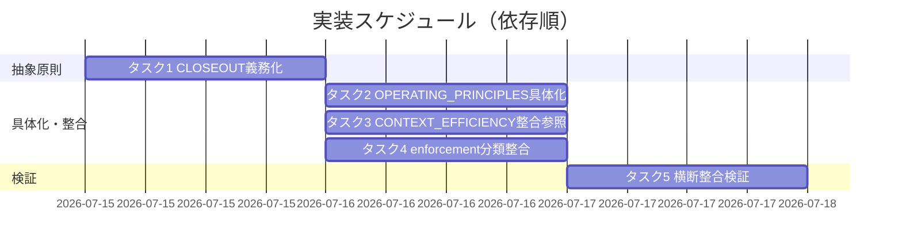

# 実装計画書: fresh サブ分割の義務化

**プロジェクト名**: fresh サブ分割の義務化
**作成日**: 2026 年 07 月 15 日
**最終更新**: 2026 年 07 月 15 日

> **重要**: **このドキュメントは常に更新**: 実装計画の変更、進捗状況の更新、バグの記録などがあった場合は、即座にこのドキュメントを更新してください。ドキュメントは「生きているドキュメント」として扱い、実装内容と常に同期させます。
> **必須項目**: 「必須」と明記した欄は空欄・抽象語のみで提出しないこと。テスト観点・BDD 仕様は具体ケースを 1 件以上記載すること。
>
> **用語**: [.agent-skill-chain/source/CONCEPTS.md §用語規約](../../../../../.agent-skill-chain/source/CONCEPTS.md#用語規約) を参照。

---

## 1. 実装概要

### 1.1 実装方針（必須）

02_設計 §5「改訂対象ファイルと改訂内容の契約」に従い、規約正本 4 ファイル（+参照先 1 ファイルは不変維持）へ規範強度の格上げ（裁量→義務）と配置境界を保った具体値委譲を適用する。実行時コード・データ・UI・API は新設せず、テストは各正本のドキュメント構造チェック（grep／目視構造監査）として実施する。**本実装は正本ファイルの改訂＝実装フェーズ（implement-feature）の作業であり、本 03 では計画のみを定める。**

### 1.2 実装順序（必須: 1 件以上）

抽象原則の正本（CLOSEOUT）を先に確定し、それに依存する project 具体化（OPERATING_PRINCIPLES §(b)）・整合参照（CONTEXT_EFFICIENCY）・分類整合（enforcement/README）を後続で行う。最後に横断整合検証（参照解決・重複禁止・配置境界）を実施する。



---

## 2. タスク分解

**必須**: 各タスクには **「テスト観点」（2.x.3）** と **「単体テスト仕様（BDD）」（2.x.4）** を必ず記載する。観点の定義は 02_設計 §6・RULES のテスト戦略・[TEST_BDD_FORMAT.md](../../../../../.agent-skill-chain/source/TEST_BDD_FORMAT.md) を参照し、ここでは**タスクごとの具体ケース**のみ記載する。本 issue のテストは「ドキュメント構造チェック（grep／目視監査）」であり、機械強制の新規実装は 02_設計 ADR-3 によりスコープ外。

### 2.1 タスク 1: CLOSEOUT §fresh サブ分割 の義務規定化

#### 2.1.1 概要（必須）

CLOSEOUT §fresh サブ分割 の裁量表現を義務規定へ改訂し、発火工程の抽象条件・免除の抽象条件・継承前提・スコープ線引きを 1 か所の正本として明記する（02_設計 §5 の対象 1・機能 1/2/3）。

#### 2.1.2 実装内容（必須: 1 件以上）

- 「工程は**必要に応じて** fresh なサブへ分割する」を義務規定（例: 「工程は原則として fresh なサブへ分割することを**必須**とする。ただし §免除条件に該当する軽量運用を除く」）へ改訂する（対応: UC1-S1）。
- 発火工程の**抽象条件**（phase 遷移時・レビュー↔修正の反復ループ時に新規 fresh サブが必須）を追記し、発火 phase の**具体一覧は project へ委譲**する旨を 1 行で示す（対応: UC1-S2）。
- 免除の**抽象条件**（quick・単一/少数 issue の軽量運用は義務対象外）を追記し、実値は project／背景は CONTEXT_EFFICIENCY §適用のスケーリングへ委譲する旨を 1 行リンクで示す（対応: UC2-S1/S2）。
- 継承前提の明記（既存の「収束保証＋must-preserve 継承」に、義務化後も前提として維持する旨・継承が失われる分割は義務対象外である旨を追加）。継承本文は複製せず REVIEW_DUAL_LENS §6 へのリンクを維持する（対応: UC3-S1/S2）。
- 継承・共有対象は **transport 非依存な語**（継承物＝却下指摘＋理由・must-preserve／共有対象＝確定済み成果物）で記述し、`worktree`・特定 VCS 機構名を抽象原則へ書き込まない。受け渡し機構の具体（worktree 必須化）は project 側 `自己拡張ワークフロー.md` §0 に留める（対応: 02_設計 ADR-5・01 §3.4 可用性）。
- 停止耐性チェックポイントが fresh 分割の前提である旨（既存 §停止耐性チェックポイントへの参照）を維持・明記する（対応: UC3-S2）。
- fresh サブ分割義務の**対象範囲の境界を現在形の恒久規範として** 1 節追記する（fresh サブ分割義務はサブ工程の分割を対象とし、メイン（オーケストレータ）の feature 単位 /clear 粒度には及ばない）。「本 issue では扱わない」等の issue 固有・経緯的な記述は CLOSEOUT（正本）に持ち込まない。メイン /clear 粒度そのものの再設計を除外とする本 issue のスコープ判断は 00 §5・01 ストーリー 5 に残し、CLOSEOUT へ複製しない（対応: UC4-S1。02_設計 §3.3.1 記述形態の規律）。

#### 2.1.3 テスト観点（必須）

**参照**: 観点の定義は [02\_設計 §6](./02_設計.md) および [RULES のテスト戦略](../../../../../.agent-skill-chain/source/RULES.md#テスト戦略必須要件) を参照。以下は本タスクの具体ケース。

##### 単体（構造チェック・必須 1 件以上）

- 正常系: CLOSEOUT §fresh サブ分割 本文に「必要に応じて」（当該分割文）が存在せず、義務表現（「必須」等）が存在する。
- 正常系: 発火工程の抽象条件（phase 遷移・反復ループ）が本文に存在し、具体 phase 一覧が本文に**含まれない**（project 委譲の 1 行のみ）。
- 正常系: 免除の抽象条件（quick・単一/少数）と、REVIEW_DUAL_LENS §6・CONTEXT_EFFICIENCY §適用のスケーリング・§停止耐性チェックポイントへのリンクが存在する。
- 境界値: fresh サブ分割義務の対象境界節に、対象（サブ工程の分割）と非対象（メインの /clear 粒度）が現在形で記述され、「本 issue では扱わない」等の issue 固有・経緯的記述を含まない（no-historical-narrative 規律）。
- 異常系（差し戻し条件）: 継承本文・免除背景本文が CLOSEOUT に複製されている場合は重複禁止違反として FAIL。
- 異常系（差し戻し条件）: CLOSEOUT §fresh サブ分割 の抽象原則本文に `worktree`・特定 VCS 機構名が混入している場合は transport 依存違反（02_設計 ADR-5）として FAIL。

##### 結合/API（該当時は必須 1 件以上）

- 該当なし（実行時経路・エンドポイントを持たない）。

##### E2E/受け入れ（未達時は理由記載）

- 該当なし（実行時 E2E 経路が無い。受け入れは review-docs／verify-and-close のドキュメント監査で代替）。

##### バリデーション（該当する場合の具体ケース）

- 規範表現が義務であること（裁量語「してよい／必要に応じて」が当該分割規範に残らないこと）。

#### 2.1.4 単体テスト仕様（BDD）（必須）

```gherkin
Feature: CLOSEOUT §fresh サブ分割 の義務規定化
  Scenario: 裁量表現が義務規定へ改訂されている
    Given 現行の CLOSEOUT §fresh サブ分割 は「必要に応じて fresh なサブへ分割する」という裁量表現である
    When 義務化の改訂を適用する
    Then §fresh サブ分割 本文に当該裁量表現が存在しない
    And 義務規定の規範表現（必須/しなければならない）が存在する
    And 義務規定の正本は CLOSEOUT の 1 か所に保たれ他ファイルへは参照で委譲されている
```

**テストコード例（インラインコメントで Given/When/Then を明記）**

```python
# ドキュメント構造チェック（grep 相当）。実行時 API を持たないためテキスト検査で代替する。
def test_closeout_fresh_sub_is_mandatory():
    # Given: 改訂後の CLOSEOUT §fresh サブ分割 の本文を読み込む
    section = read_section("CLOSEOUT.md", "fresh サブ分割")
    # When: 規範表現を検査する
    has_discretionary = "必要に応じて fresh" in section
    has_mandatory = ("必須" in section) or ("しなければならない" in section)
    # Then: 裁量表現が消え義務表現が存在する
    assert not has_discretionary
    assert has_mandatory
```

#### 2.1.5 依存関係

- なし（本タスクが抽象原則の正本であり、後続タスク 2/3/4 が依存する）。

#### 2.1.6 見積もり

- **工数**: 中（1 節の実質改訂＋スコープ線引き 1 節追加）
- **優先度**: 高

### 2.2 タスク 2: OPERATING_PRINCIPLES §(b) の具体化と整合改訂

#### 2.2.1 概要（必須）

project 側 §(b) に発火 phase の具体一覧・免除の実値を追加し、「具体機構は起票局面特化」旧記述を義務一般化へ整合させる（02_設計 §5 対象 2・ADR-2・機能 3）。

#### 2.2.2 実装内容（必須: 1 件以上）

- 発火 phase の具体一覧（本リポの 00→01→02→03→実装→レビューの各 phase 遷移、およびレビュー↔修正の反復ループ）を追記し、抽象原則は CLOSEOUT §fresh サブ分割 を参照する（対応: UC1-S2・UC4-S2）。
- 免除の実値（`mode: quick`＝RULES §実行モード、単一/少数 issue の軽量運用＝CONTEXT_EFFICIENCY §適用のスケーリング）を対応表として追記する（対応: UC2-S1）。
- 「具体機構（… fresh サブの構造化ハンドオフ）は引き続き issue 起票局面に特化」の旧記述を、「fresh サブ**分割**義務は全工程へ一般化された。issue 起票局面固有の機構（索引化・スライス渡し・構造化ハンドオフ）はなお起票局面特化である」旨へ整合改訂する（対応: UC4-S2）。

#### 2.2.3 テスト観点（必須）

##### 単体（構造チェック・必須 1 件以上）

- 正常系: §(b) に発火 phase の具体一覧が存在し、抽象原則は CLOSEOUT を参照している。
- 正常系: 免除の実値（quick／単一・少数）が存在し RULES／CONTEXT_EFFICIENCY を参照している。
- 正常系: 「起票局面特化」が fresh サブ分割義務の一般化と矛盾しない記述へ更新されている。
- 異常系（差し戻し）: 抽象原則本文が §(b) に複製されている場合は重複禁止違反として FAIL。

##### 結合/API

- 該当なし。

##### E2E/受け入れ

- 該当なし（review-docs 監査で代替）。

##### バリデーション

- 具体値が project 側にのみ存在し、source（CLOSEOUT/CONTEXT_EFFICIENCY）に混入していない。

#### 2.2.4 単体テスト仕様（BDD）（必須）

```gherkin
Feature: OPERATING_PRINCIPLES §(b) の具体化と整合
  Scenario: 発火 phase 具体一覧と免除実値が project に置かれ起票局面特化記述が整合している
    Given fresh サブ分割義務の抽象原則は CLOSEOUT に確立されている
    When OPERATING_PRINCIPLES §(b) に発火 phase 具体一覧・免除実値を追加し起票局面特化記述を見直す
    Then §(b) に発火 phase 具体一覧と免除実値が存在する
    And 抽象原則は CLOSEOUT を参照し本文を複製していない
    And 「具体機構は起票局面特化」が fresh サブ分割義務の一般化と矛盾しない記述になっている
```

**テストコード例（インラインコメントで Given/When/Then を明記）**

```python
def test_operating_principles_b_concrete_and_consistent():
    # Given: 改訂後の OPERATING_PRINCIPLES §(b) を読み込む
    section = read_section("OPERATING_PRINCIPLES.md", "(b) リソース")
    # When: 具体値・参照・整合を検査する
    has_phase_list = "phase 遷移" in section or "00→01" in section
    references_core = "CLOSEOUT" in section
    exemption_values = ("mode: quick" in section) or ("quick" in section)
    # Then: 具体値が存在し抽象原則はコアを参照している
    assert has_phase_list and exemption_values
    assert references_core
```

#### 2.2.5 依存関係

- タスク 1（CLOSEOUT の抽象原則確定）に依存。

#### 2.2.6 見積もり

- **工数**: 中
- **優先度**: 高

### 2.3 タスク 3: CONTEXT_EFFICIENCY §適用のスケーリング の整合参照追加

#### 2.3.1 概要（必須）

起票局面の軽量運用（免除の背景）を持つ CONTEXT_EFFICIENCY §適用のスケーリングに、CLOSEOUT の一般義務への整合参照（1 行リンク）を追加する。軽量運用の記述本体は不変（02_設計 §5 対象 3・機能 2）。

#### 2.3.2 実装内容（必須: 1 件以上）

- §適用のスケーリングに「fresh サブ**分割**義務の一般原則・免除条件は CLOSEOUT §fresh サブ分割 を参照。本節（起票局面の軽量運用）はその免除の背景と矛盾しない」旨の 1 行リンクを追加する（対応: UC2-S1）。
- 既存の軽量運用（単一/少数 issue は issue-persist 境界とフェーズ省略禁止のみ適用）の文言は変更しない。

#### 2.3.3 テスト観点（必須）

##### 単体（構造チェック・必須 1 件以上）

- 正常系: §適用のスケーリングに CLOSEOUT §fresh サブ分割 への整合参照リンクが存在する。
- 正常系: 既存の軽量運用の記述（issue-persist 境界・フェーズ省略禁止のみ）が保持されている（免除と矛盾しない）。
- 異常系（差し戻し）: 一般義務の本文が本節に複製されている場合は重複禁止違反として FAIL。

##### 結合/API

- 該当なし。

##### E2E/受け入れ

- 該当なし（review-docs 監査で代替）。

##### バリデーション

- 追加が 1 行の整合参照に留まり、本節の責務（起票局面のコンテキスト効率）を越えていない。

#### 2.3.4 単体テスト仕様（BDD）（必須）

```gherkin
Feature: CONTEXT_EFFICIENCY §適用のスケーリング の整合
  Scenario: 一般義務への整合参照が追加され軽量運用と矛盾しない
    Given CONTEXT_EFFICIENCY §適用のスケーリング は起票局面の軽量運用を定める
    When CLOSEOUT §fresh サブ分割 の一般義務への整合参照を追加する
    Then §適用のスケーリング に CLOSEOUT §fresh サブ分割 への参照リンクが存在する
    And 既存の軽量運用（issue-persist 境界・フェーズ省略禁止のみ適用）の記述が保持されている
```

**テストコード例（インラインコメントで Given/When/Then を明記）**

```python
def test_context_efficiency_scaling_alignment_reference():
    # Given: 改訂後の CONTEXT_EFFICIENCY §適用のスケーリング を読み込む
    section = read_section("CONTEXT_EFFICIENCY.md", "適用のスケーリング")
    # When: 整合参照と軽量運用の保持を検査する
    has_reference = "CLOSEOUT" in section and "fresh サブ分割" in section
    keeps_light = "issue-persist 境界" in section and "フェーズ省略禁止" in section
    # Then: 参照が追加され軽量運用が保持されている
    assert has_reference
    assert keeps_light
```

#### 2.3.5 依存関係

- タスク 1（CLOSEOUT の抽象原則確定）に依存。

#### 2.3.6 見積もり

- **工数**: 小
- **優先度**: 中

### 2.4 タスク 4: enforcement/README §CI 強制対象外 の分類整合

#### 2.4.1 概要（必須）

人手監査分類の記述に「fresh サブ分割義務」を含める最小の文言整合を行う。新規 CI チェック番号・hook は追加しない（02_設計 §5 対象 5・ADR-3）。

#### 2.4.2 実装内容（必須: 1 件以上）

- §CI 強制対象外（人手監査）の「fresh サブの収束保証は CI で機械強制せず PHASES 監査観点で担保する」を、「fresh サブ**分割義務**およびその収束保証・退行防止継承は現状 CI で機械強制せず、PHASES 監査観点（人手レビュー）で担保する（機械強制の要否・実装は別 issue へ申し送り）」旨へ整合させる（対応: 00 §1.2 機械強制不在の課題認識）。
- audit.sh・subagent-guard への新規チェック追加は行わない。

#### 2.4.3 テスト観点（必須）

##### 単体（構造チェック・必須 1 件以上）

- 正常系: §CI 強制対象外 に「fresh サブ分割義務」が人手監査分類として記述されている。
- 正常系: audit.sh／subagent-guard の失敗条件に fresh サブ分割義務の新規チェックが**追加されていない**（差分に新規チェック番号が無い）。
- 境界値: 機械強制の要否が別 issue 申し送りとして明記されている。

##### 結合/API

- 該当なし。

##### E2E/受け入れ

- 該当なし（review-docs 監査で代替）。

##### バリデーション

- スコープ規律（ADR-3）に従い、enforcement 実装（新規チェック・CI 配線）が本 issue の差分に含まれていない。

#### 2.4.4 単体テスト仕様（BDD）（必須）

```gherkin
Feature: enforcement/README の分類整合（機械強制は新設しない）
  Scenario: fresh サブ分割義務が人手監査分類に含まれ新規チェックが追加されていない
    Given enforcement/README §CI 強制対象外 は fresh サブの収束保証を人手監査に分類している
    When fresh サブ分割義務を同分類の対象に含める文言整合を行う
    Then §CI 強制対象外 に fresh サブ分割義務が人手監査として記述されている
    And audit.sh・subagent-guard に fresh サブ分割義務の新規チェックが追加されていない
```

**テストコード例（インラインコメントで Given/When/Then を明記）**

```python
def test_enforcement_readme_classification_only():
    # Given: 改訂後の enforcement/README §CI 強制対象外 と audit.sh の差分を読み込む
    section = read_section("enforcement/README.md", "CI 強制対象外")
    audit_diff = git_diff("enforcement/ci/audit.sh")
    # When: 分類記述と新規チェック不在を検査する
    classified = "fresh サブ分割義務" in section and "人手監査" in section
    no_new_check = "check_fresh_sub" not in audit_diff
    # Then: 人手監査分類のみ更新され新規チェックは無い
    assert classified
    assert no_new_check
```

#### 2.4.5 依存関係

- タスク 1（CLOSEOUT の義務化確定）に依存。

#### 2.4.6 見積もり

- **工数**: 小
- **優先度**: 中

### 2.5 タスク 5: 横断整合検証（参照解決・重複禁止・配置境界）

#### 2.5.1 概要（必須）

全改訂対象を横断し、参照リンクの解決・本文複製の不在・source への具体値非混入・01 の全成功基準充足を検証する（02_設計 §6.2）。review-docs の実施内容に相当する。

#### 2.5.2 実装内容（必須: 1 件以上）

- CLOSEOUT→REVIEW_DUAL_LENS §6／CONTEXT_EFFICIENCY §適用のスケーリング／§停止耐性チェックポイント、OPERATING_PRINCIPLES §(b)→CLOSEOUT の各相対リンクが解決することを確認する（対応: UC3-S1・UC4-S2）。
- source（CLOSEOUT/CONTEXT_EFFICIENCY/enforcement）に具体値（発火 phase の実一覧・免除の実値）が混入していないことを確認する（対応: UC4-S2・成功基準 6）。
- CLOSEOUT §fresh サブ分割 の抽象原則本文に `worktree`・特定 VCS 機構名が混入していないことを確認する（transport 非依存・02_設計 ADR-5）。受け渡し機構の具体は project 側にのみ存在すること。
- 継承本文・免除背景本文の複製が無いことを確認する（成功基準 7）。
- 01 の成功基準 1〜7 との対応表を作り、全基準が○になることを確認する。

#### 2.5.3 テスト観点（必須）

##### 単体（構造チェック・必須 1 件以上）

- 正常系: 全相対リンクが解決する（リンク切れ 0 件）。
- 正常系: source 配下の改訂対象に具体 phase 一覧・免除実値の文字列が存在しない。
- 正常系: 01 成功基準 1〜7 の対応表が全て○。
- 異常系（差し戻し）: いずれかのリンク切れ・具体値混入・本文複製を検出したら該当タスクへ差し戻す。

##### 結合/API

- 該当なし。

##### E2E/受け入れ

- 主要受け入れシナリオ（01 の UC1〜UC4）を横断で満たすことを、ドキュメント監査として確認する（実行時 E2E 経路は無いため監査で代替）。

##### バリデーション

- 配置境界（コア抽象／project 具体）・1 ファイル 1 責務・重複禁止の 3 点が全対象で成立。

#### 2.5.4 単体テスト仕様（BDD）（必須）

```gherkin
Feature: 横断整合検証
  Scenario: 参照解決・配置境界・重複禁止・成功基準充足を満たす
    Given fresh サブ分割義務化の全改訂（タスク1〜4）が適用されている
    When 参照解決・具体値のコア非混入・本文複製の不在・成功基準対応を検証する
    Then 全相対リンクが解決する
    And source 配下に発火 phase 実一覧・免除実値が混入していない
    And 継承本文・免除背景本文の複製が無い
    And 01 の成功基準 1〜7 が全て○である
```

**テストコード例（インラインコメントで Given/When/Then を明記）**

```python
def test_cross_cutting_consistency():
    # Given: 改訂後の全対象ファイルを読み込む
    files = load_revised_targets()
    # When: リンク解決・配置境界・重複を検査する
    broken_links = find_broken_relative_links(files)
    core_concrete_leak = find_concrete_values_in_core(files)  # 発火phase実一覧・免除実値
    duplicated_body = find_duplicated_bodies(files)  # 継承本文・免除背景本文
    # Then: いずれの逸脱も 0 件である
    assert broken_links == []
    assert core_concrete_leak == []
    assert duplicated_body == []
```

#### 2.5.5 依存関係

- タスク 1・2・3・4 すべてに依存（最終ゲート）。

#### 2.5.6 見積もり

- **工数**: 小〜中
- **優先度**: 高（実装着手前の review-docs 必須ゲートで反復する対象）

---

## テスト観点

本実装計画全体のテスト観点は「規約ドキュメントの構造チェック（grep／目視監査）」である。各タスク §2.x.3 に具体ケースを記載した。観点の柱は (1) 規範表現が義務であること、(2) 抽象／具体の配置境界（source 抽象・project 具体）、(3) リンク委譲による重複禁止、(4) 免除条件と既存軽量運用の無矛盾、(5) 継承機構の前提維持、(6) スコープ線引きの明文化、(7) 機械強制を新設しないスコープ規律。監査で本セクションの存在と 01 BDD との対応を検査する。

---

## 単体テスト

単体テストは各正本ファイルのセクション本文に対するテキスト構造検査（存在／不在／リンク解決）で構成する。実行時 API・DB・UI を持たないため結合/E2E は該当なしとし、受け入れは review-docs／verify-and-close の人手監査で担保する。各タスク §2.x.4 に BDD 仕様を記載した。

---

## BDD

BDD シナリオの一覧（01 ユースケースとの対応）:

- UC1-S1 → タスク 1（CLOSEOUT 義務化）
- UC1-S2 → タスク 1・タスク 2（発火工程の抽象/具体分離）
- UC2-S1/S2 → タスク 1・タスク 2・タスク 3（免除条件・軽量運用整合）
- UC3-S1/S2 → タスク 1（継承前提・停止耐性チェックポイント）
- UC4-S1 → タスク 1（メイン文脈蓄積のスコープ線引き）
- UC4-S2 → タスク 2・タスク 5（配置境界・OPERATING_PRINCIPLES 整合・横断検証）

Given/When/Then 形式は [TEST_BDD_FORMAT.md](../../../../../.agent-skill-chain/source/TEST_BDD_FORMAT.md) に従う。

---

## 3. 実装スケジュール

### 3.1 マイルストーン

| マイルストーン | 期日 | 成果物 |
| --- | --- | --- |
| 抽象原則確定 | タスク 1 完了時 | 改訂済み CLOSEOUT §fresh サブ分割 |
| 具体化・整合完了 | タスク 2・3・4 完了時 | OPERATING_PRINCIPLES §(b)・CONTEXT_EFFICIENCY・enforcement/README の整合改訂 |
| 横断整合確定 | タスク 5 完了時 | 成功基準 1〜7 対応表（全○） |

### 3.2 実装フェーズ

#### フェーズ 1: 抽象原則の確定

- **タスク**: タスク 1

#### フェーズ 2: 具体化・整合

- **タスク**: タスク 2・タスク 3・タスク 4

#### フェーズ 3: 横断検証

- **タスク**: タスク 5

---

## 4. テスト計画

テスト観点・BDD の定義は 02_設計 §6・RULES のテスト戦略・TEST_BDD_FORMAT を参照。本 issue では各タスク §2.x.3 にタスクごとの具体ケースを、§2.x.4 に BDD 仕様を記載した。テスト実施は review-docs（実装前ドキュメントレビュー・full/standard 必須ゲート）と verify-and-close（実装後レビュー）で行う。

### 4.1 テストの優先順位

- 規範強度（義務化）と配置境界（source 抽象／project 具体）を最優先で検査する。
- リンク切れ・本文複製・具体値のコア混入は回帰観点として横断検証（タスク 5）で必ず確認する。

---

## 5. リスク管理

### 5.1 実装リスク

- **リスク**: 具体値（発火 phase 一覧・免除実値）が CLOSEOUT（source）本文に混入し配置境界を破る。
  - **対策**: タスク 5 の横断検証で source への具体値混入を検出し差し戻す（02_設計 §3.1.4）。
- **リスク**: 継承本文・免除背景を CLOSEOUT に複製し重複禁止に反する。
  - **対策**: リンク委譲を必須とし、複製検出時は差し戻す（成功基準 7）。
- **リスク**: 義務化の記述が軽量作業（quick・単一/少数）へ波及し過剰適用となる。
  - **対策**: 免除条件を CONTEXT_EFFICIENCY §適用のスケーリング・RULES §実行モードと突合し無矛盾を確認する（UC2-S1）。
- **リスク**: スコープ逸脱（機械強制の新規実装・/clear 粒度再設計へ踏み込む）。
  - **対策**: ADR-3・除外要件をタスク 4・5 の観点で監査し、差分に enforcement 実装・粒度再設計が含まれないことを確認する。

---

## 6. 参考資料

### プロジェクトドキュメント

- [`02_設計.md`](./02_設計.md) - 設計
- [`01_要件定義.md`](./01_要件定義.md) - 要件定義
- [`00_要求定義.md`](./00_要求定義.md) - 要求定義

### その他の参考資料

- [.agent-skill-chain/source/CLOSEOUT.md](../../../../../.agent-skill-chain/source/CLOSEOUT.md) - §fresh サブ分割・§停止耐性チェックポイント・§clear 境界
- [.agent-skill-chain/source/CONTEXT_EFFICIENCY.md](../../../../../.agent-skill-chain/source/CONTEXT_EFFICIENCY.md) - §適用のスケーリング
- [.agent-skill-chain/project/OPERATING_PRINCIPLES.md](../../../../../.agent-skill-chain/project/OPERATING_PRINCIPLES.md) - §(b) リソース意識
- [.agent-skill-chain/source/REVIEW_DUAL_LENS.md](../../../../../.agent-skill-chain/source/REVIEW_DUAL_LENS.md) - §6 反復ループへの must-preserve 継承
- [.agent-skill-chain/source/enforcement/README.md](../../../../../.agent-skill-chain/source/enforcement/README.md) - §CI 強制対象外（人手監査）
- [.agent-skill-chain/source/TEST_BDD_FORMAT.md](../../../../../.agent-skill-chain/source/TEST_BDD_FORMAT.md) - BDD 形式の定義

---

## 7. 前のステップ

この実装計画書は、以下のドキュメントを基に作成されています：

- **前**: [`02_設計.md`](./02_設計.md) - 設計フェーズ

---

## 8. 次のステップ

この実装計画書の承認後、以下のいずれかのステップに進みます：

- **実装着手前の必須ゲート**: [review-docs](../../../../../.agent-skill-chain/source/commands/review-docs.md)（実装前ドキュメントレビュー・full/standard は必須）を経ること。
- 本 issue は 1 つの issue として扱い、サブ issue へは分割しない（90_issues.md は作成しない）。review-docs 通過後、実装フェーズ（implement-feature）で 02_設計 §5 の契約に従い正本ファイルを改訂する。

**用語**: [.agent-skill-chain/source/CONCEPTS.md §用語規約](../../../../../.agent-skill-chain/source/CONCEPTS.md#用語規約) を参照。
