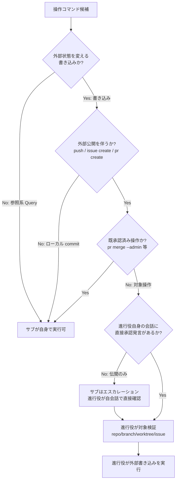
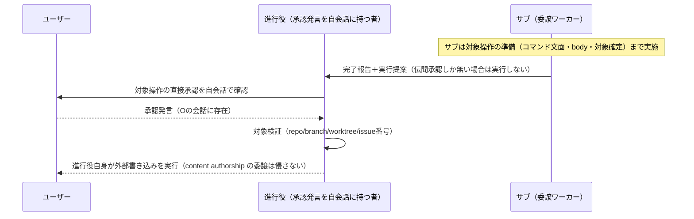
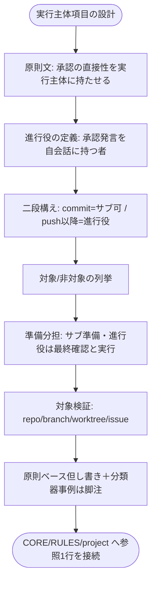

# 設計書: 外部サービス書き込み操作の実行主体明文化

**プロジェクト名**: 外部サービス書き込み操作の実行主体明文化
**作成日**: 2026 年 07 月 15 日
**最終更新**: 2026 年 07 月 15 日

> **重要**: **このドキュメントは常に更新**: 設計の変更や追加があった場合は、即座にこのドキュメントを更新してください。ドキュメントは「生きているドキュメント」として扱い、実装内容と常に同期させます。
>
> **用語**: [.agent-skill-chain/source/CONCEPTS.md §用語規約](../../../../../.agent-skill-chain/source/CONCEPTS.md#用語規約) を参照。

---

## 1. 設計概要

**必須**: 設計方針・原則は [.agent-skill-chain/source/spec/01\_設計原則.md](../../../../../.agent-skill-chain/source/spec/01_設計原則.md) を先に参照した上で、本プロジェクトに適用するものを選び記載する。

### 1.1 設計方針

正本ドキュメント（第一候補 `skills/agent/run_command.md`）に、外部書き込み操作の**実行主体ルール**を「承認の直接性を実行主体に持たせる」原則として1か所に追記し、既存の関連規定（CORE / RULES / project 自己拡張ワークフロー）とは**参照1行**で接続する（正本一元化）。新規 command / phase・新規 enforcement チェックは設けず、既存フローへの追記に留める（規模比例）。

### 1.2 設計原則（本プロジェクトで適用するもの）

- **単一責務**: 実行主体ルールの正本は run_command.md §Constraints の新規 1 項目に集約し、他ファイルは参照のみ。1 情報 1 か所（重複記載禁止）。
- **明確な境界**: 「content authorship の委譲（従来どおりサブ）」と「外部書き込みコマンドの Bash 実行（例外的に進行役）」の境界を明文で分離する。
- **AIフレンドリー設計**: 委譲を受けたサブ・進行役が正本1か所を読めば、対象/非対象操作を列挙で即座に自己判定できる形にする（[01\_設計原則 §AIフレンドリー設計](../../../../../.agent-skill-chain/source/spec/01_設計原則.md#aiフレンドリー設計)）。
- **CQRS 的分離（副作用/参照）**: 外部状態を変える書き込み（Command）と参照系（Query）を分類の第一軸に置く。§2.2.1 参照。

**設計判断の優先順位**（[spec/06](../../../../../.agent-skill-chain/source/spec/06_設計判断の優先順位.md)）に従い、可読性・単一責務・仕様整合を、再利用性・実装効率より優先した。

---

## 2. アーキテクチャ設計

### 2.1 責務・境界・参照関係

本 issue の成果物はコードではなく**正本ドキュメント群**である。したがって「コンポーネント」は編集対象の正本ファイル（およびその該当セクション）と読み替える。

#### 2.1.1 責務一覧

| コンポーネント（編集対象セクション） | 責務（1 文） |
| ---- | ---- |
| `skills/agent/run_command.md` §Constraints 新規項目「外部書き込み操作の実行主体（進行役限定）」 | 実行主体の原則・二段構え・対象/非対象境界・準備分担・対象検証を規定する**唯一の正本** |
| `boot/CORE.md` §メインエージェントがやってはいけないこと | 既存の「コマンド実行」禁止に対する外部書き込みの carve-out を**参照1行**で明示（正本は run_command） |
| `RULES.md` §高リスク操作 | 外部書き込みは高リスク操作であり事前確認を要し、実行主体は進行役である旨を**参照1行**で接続 |
| `.agent-skill-chain/project/自己拡張ワークフロー.md`（GitHub Issue 起票ゲート等の具体手順） | 既存 gh 具体手順に「実行主体＝進行役」の整合注記を1行追加（原則は source を参照） |
| enforcement（audit.sh / hooks） | **本 issue では変更しない**。機械強制の要否のみ §2.5 ADR-8 で整理し、将来判断へ申し送る |

#### 2.1.2 境界

- **入力**: 実行しようとする操作コマンド候補、実行主体エージェントの承認保持状態（直接 or 伝聞）、対象（repo / branch / worktree / issue 番号）。
- **出力**: 追記・更新された正本ドキュメント群（run_command.md を正本、CORE / RULES / project を参照接続）。
- **他責務との境界（本 issue の範囲外）**:
  - **範囲内**: 外部書き込みコマンドの**実行主体（誰が Bash 実行するか）**の原則明文化。
  - **範囲外**: (a) content authorship の委譲原則そのもの（既存規定を弱めない・変更しない）、(b) enforcement による機械強制の実装、(c) 分類器の内部仕様の解析・追従、(d) 消費者環境固有の権限設定（settings.json 等）。

#### 2.1.3 参照関係

- `CORE.md` §メインがやってはいけないこと → `run_command.md`（carve-out の正本参照）
- `RULES.md` §高リスク操作 → `run_command.md`（実行主体原則の正本参照）
- `自己拡張ワークフロー.md` 各ゲート具体手順 → `run_command.md`（実行主体原則） / 既存の source 各正本
- `run_command.md`（正本）は他への外向き依存を新設しない（既存の Forbidden §サブによる独断起票・§高リスク操作事前確認とは相互参照で接続するのみ）。
- **循環なし**: run_command が原則の終端正本、他ファイルは一方向にそれを参照する。

### 2.2 システムアーキテクチャ

- **採用パターン**: 正本一元化＋参照接続（single-source-of-truth with 1-line cross-reference）。既存の各ゲート（GitHub Issue 起票ゲート #34 等）と同じ「原則＝source / 具体手順＝project」の配置境界を踏襲する。
- **根拠**: [spec/01 §単一責務・§明確な境界](../../../../../.agent-skill-chain/source/spec/01_設計原則.md) と BR-6（正本一元化）。既存規定と同型の配置にすることで、読み手の学習コストと重複改訂リスクを最小化する（evidence_source: 既存 run_command.md §Constraints のゲート群の配置パターン）。

#### 2.2.1 CQRS（Command/Query 分離）

操作分類の第一軸を「外部状態を変える副作用（Command）」と「外部状態を変えない参照（Query）」に置く。

- **Command（外部書き込み・本ルールの対象）**: `gh issue create` / `gh pr create` / `git push`（公開リモート。`--force` 含む）/ リポジトリ可視性変更・リリース公開等の外部公開操作。実行主体は進行役（列挙は代表例、抽象定義が第一基準＝ADR-4）。
- **Query（参照系・対象外）**: `gh api`（GET） / `gh issue view` / `gh pr view` / `git fetch`。サブが自身で実行可。

> **注**: `git commit`（ローカル）は状態を変える操作だが**外部公開を伴わない**ため、Command のうち「外部公開の一歩手前」として二段構えで対象外に置く（§2.2.2・ADR-2）。

#### 2.2.2 アーキテクチャ図（判定の構造）

### 2.3 コンポーネント構成

正本（run_command.md）に新規 Constraints 項目を1つ追加し、そこに (1) 原則、(2) 二段構え、(3) 対象/非対象の列挙、(4) 準備分担（サブが準備・進行役が最終確認と実行）、(5) 対象検証、(6) 原則ベース記述の但し書き（分類器非依存）を収める。CORE / RULES / project は既存セクションに参照1行を挿入するのみで、新規セクション・新規ファイルは作らない（明確な境界・単一責務）。

### 2.4 データフロー

「起きた事実」に相当するのは、**進行役が直接承認を保持した状態で外部書き込みを実行した**という運用上の事象である（イベント名相当: `ExternalWriteExecutedByOrchestrator`）。本 issue はドキュメント追記でありイベント発行機構は持たないが、判定の流れを以下に示す。

### 2.5 横断設計判断（ADR）

#### ADR-1: 実行主体ルールの正本を run_command.md §Constraints に置く

- **コンテキスト**: 実行主体ルールをどのファイルに正本として置くか。候補は (a) run_command.md、(b) CORE.md、(c) RULES.md。
- **検討した選択肢**:
  - (a) run_command.md §Constraints に新規項目。既存の外部書き込みゲート群（GitHub Issue 起票ゲート #34・ブランチ紐づけ #35・PR 紐づけ #36）がすでにここに集約されている。
  - (b) CORE.md。「メインがやってはいけないこと（コマンド実行）」の正本であり、その例外を同居させる案。
  - (c) RULES.md §高リスク操作。外部書き込みは高リスク操作でもある。
- **決定**: (a) run_command.md §Constraints を正本とする。CORE・RULES・project からは参照1行で接続する。
- **根拠**: 00/01 が第一候補として run_command.md を指定（BR-6）。かつ外部書き込みに関する既存ゲート（#34/#35/#36）がすでに run_command §Constraints に集約されており、同一の副作用アクション群の実行規律を同じ場所に置くのが単一責務・凝集の観点で自然（evidence_source: 現行 run_command.md §Constraints の #34-#36 配置）。CORE は「絶対制約のみ・重複記載禁止」を掲げるため例外の本文を置く場所として不適（CORE §境界）。
- **帰結**: CORE §メインがやってはいけないこと「コマンド実行」には carve-out の参照1行のみを追加する。原則本文の改訂は run_command 1 か所に閉じる。

#### ADR-2: 二段構え（ローカル commit / 外部公開 push）を採用する

- **コンテキスト**: `git commit`（ローカル）を push 以降（外部公開）と同列に「進行役限定」とするか、分けるか。
- **検討した選択肢**:
  - (i) 一体扱い: commit も push も進行役が実行。
  - (ii) 二段構え: commit まではサブ可、push / PR / issue 作成（外部公開）から進行役。
- **決定**: (ii) 二段構えを採用する。
- **根拠**: 本ルールが緩和する具体リスクは「伝聞承認による無自覚な**外部公開**」であり、ローカル commit は外部状態を一切変えないためこのリスクを持たない（01 §1.2・実例＝分類器はサブの外部書き込みをブロックした）。(i) はサブの commit ごとに進行役へ実行依頼が発生し、進行役のコンテキスト肥大と「サブは自らの成果物を commit する」既存運用の破壊を招く（非効率）。メモリ [[feedback_autonomous-scope-means-through-pr]] も push / PR 作成を外部公開の境界としている（evidence_source: 同メモリ）。
- **帰結**: 対象＝`git push`（公開リモート）/ `gh pr create` / `gh issue create`。非対象＝ローカル `git commit`（push しない限り）。

#### ADR-3: 例外は副作用アクション（外部書き込みコマンドの Bash 実行）のみに限定する

- **コンテキスト**: 「外部書き込みは進行役が実行する」例外が、既存の「進行役は直接編集禁止・必ず委譲」（CORE §メインがやってはいけないこと・run_command §Execution Path Rule）を侵食し、「commit のついでに直接ファイルを編集する」滑り坂を生む懸念。
- **検討した選択肢**:
  - (i) 例外を「外部書き込みに関わる一連の作業（body 執筆・コマンド組み立て・実行）」まで広く認める。
  - (ii) 例外を「準備済みコマンドの Bash 実行」という副作用アクションのみに厳密限定し、準備（コマンド文面・PR/issue body・対象確定）はサブが担う。
- **決定**: (ii) を採用する。
- **根拠**: content authorship（PR 本文・issue 本文・commit メッセージ内容を含む成果物の作成）は既存規定どおりサブに委譲するのが単一責務・境界明確（spec/06）。(i) は滑り坂を正本上で否定できず、既存の委譲原則を弱める。例外を「実行というアクション」だけに縛れば、既存規定と矛盾ではなく**限定された例外関係**として一読で理解できる（01 ストーリー4 受け入れ基準）。
- **帰結**: 進行役は「サブが準備した外部書き込みコマンドの最終確認＋実行」のみを担い、body 等の内容執筆・ファイル編集は引き続きサブへ委譲する。CORE の「コマンド実行」禁止は、この列挙された外部書き込みコマンド実行に限って carve-out される（他コマンド実行・content authorship の禁止は不変）。ここで進行役の「最終確認」は、実行してよいか（対象・承認・副作用・対象検証）の**実行可否判断**であって、body 本文の推敲・編集という content authorship ではない（後者はサブの責務のまま）。分離を明確にするため、issue/PR body 等はサブがファイル化し進行役は `--body-file` 等で参照実行することを推奨し、進行役が body 文面を書き換える運用は採らない。

#### ADR-4: 対象・非対象操作を列挙で境界づける

- **コンテキスト**: 委譲を受けたサブが「自分で実行してよいか／エスカレーションすべきか」を迷わず判定できる必要がある。
- **検討した選択肢**: (i) 抽象定義のみ（「外部書き込み全般」）、(ii) 抽象定義＋具体列挙。
- **決定**: (ii) 抽象定義（外部状態を変え外部公開を伴う操作）＋具体列挙を併記する。
- **根拠**: 列挙が無いと境界解釈が揺れる（ユーザビリティ要件 3.3）。ただし列挙は網羅ではなく代表例とし、抽象定義を第一基準とする（新規コマンドへの外挿可能性）。
- **帰結**:
  - **対象（進行役が実行）**: `gh issue create` / `gh pr create` / `git push`（公開リモート。`--force` を含む＝履歴改変を伴うため RULES §高リスク操作にも該当）。**加えて、外部公開・外部状態変更の影響が大きい操作**（例: リポジトリ可視性変更 `gh repo edit --visibility`、リポジトリ作成 `gh repo create`、リリース公開 `gh release create`、`gh gist create`）**も抽象定義により対象**とする。とくにリポジトリ可視性の private→public 化は本 issue が防ごうとする「無自覚な外部公開」の最たる例であり、列挙に明示する。
  - **列挙は網羅ではなく代表例であり、抽象定義（外部状態を変え外部公開を伴う操作か）を第一基準とする**。列挙に無い新規コマンドも抽象定義に合致すれば対象。
  - **対象外・サブが実行可**: 読み取り専用（`gh api` 参照系 / `gh issue view` / `gh pr view` / `git fetch`）、ローカル `git commit`（push しない限り）。
  - **既承認済み操作の但し書き**: `gh pr merge --admin`（[[feedback_admin-merge-standing-approval]]）・マージ済み PR のリモートブランチ削除（`git push origin --delete`。[[feedback_remote-branch-cleanup-approved]]）は、リポジトリ単位のスタンディング承認により**都度の直接承認を要さない**ため原則サブ可とする。ただしこれらも外部書き込みであり、**スタンディング承認はメモリ上の事実であってランタイム分類器はそれを参照しない**。したがってサブが実行を試みた際に分類器がブロックする可能性があり（本 issue の発端事例と同型）、その場合はサブは緩和（分類器バイパス・権限緩和）を採らず進行役へエスカレーションし、進行役が実行する。すなわち「**既承認済み＝原則サブ可、分類器ブロック時は進行役実行**」とする。
  - いずれの場合も RULES §高リスク操作の事前確認は独立に適用される。

#### ADR-5: 実行専用の薄いフェーズを新設せず、既存フローへの追記とする

- **コンテキスト**: 進行役直実行を「例外」ではなく chain 上の正規 step（実行専用の薄いフェーズ）として定義する案の採否（01 ユースケース3）。
- **検討した選択肢**:
  - (i) 新規 command / phase「execute-external-write」を chain に追加し、DoD・テンプレートを持たせる。
  - (ii) 新規フェーズを設けず、実行主体原則を既存正本（run_command §Constraints）へ追記し、既存のゲート点（起票ゲート・PR 作成・close 移動 PR）に接続する。
- **決定**: (ii) を採用する。
- **根拠**: 外部書き込み実行は成果物を生む「フェーズ」ではなく、既存の特定ゲート点で発生する**punctual な副作用**である。新規フェーズは command ファイル・DoD・テンプレート・PHASE_COMMAND_MAP 追加を要し、punctual なアクションに対して過剰（UNIX 哲学・規模比例・spec/06 可読性優先）。既存の #34/#35/#36 ゲートと同じ場所に原則を追記すれば重複なく接続できる（BR-6）。
- **帰結**: 新規 command / phase / テンプレートは作らない。実行主体原則は run_command §Constraints の 1 項目として既存フローに組み込む。

#### ADR-6: 分類器仕様に依存しない原則ベース記述とする

- **コンテキスト**: ルールを Auto Mode Bypass 分類器の内部挙動（「実行主体の会話内のユーザー直接発言を見る」）への適合として書くと、非公開・変更されうる仕様に依存し陳腐化・緩和誘発のリスク（01 BR-5・3.2）。
- **検討した選択肢**: (i) 分類器挙動への適合として記述、(ii) 「承認の直接性を実行主体に持たせる」原則として記述し、分類器事例は Why / 脚注に留める。
- **決定**: (ii) を採用する。
- **根拠**: 分類器挙動は 1 事例からの推測であり内部仕様は非公開・変更されうる（00 §1.2 advisor 助言1）。原則ベースなら仕様変更に耐え、かつ「分類器バイパス・Bash 権限緩和」を誘発しない（セキュリティ要件 3.2）。
- **帰結**: 本文は原則で記述。2026-07-15 の分類器ブロック実例は根拠脚注（Why）に留め、緩和策（権限緩和）は一切採用しない。

#### ADR-7: 外部書き込み実行前の対象検証を必須手順とする

- **コンテキスト**: 進行役は複数 issue を並行統括するため worktree / branch 取り違えによる誤操作被害が相対的に高い（00 §7.1）。
- **検討した選択肢**: (i) 検証は任意、(ii) 実行前の対象検証（リポジトリ・ブランチ・worktree・issue 番号）を必須手順化。
- **決定**: (ii) を採用する。
- **根拠**: 実行主体を進行役に一点集中させると、取り違え時の被害も集中する。実行直前の対象確認を必須化することで一点集中のトレードオフを緩和する（00 §7.1 対策）。準備をサブが担い進行役は最終確認＋実行のみとする分担（ADR-3）と組み合わせ、進行役の負荷も抑える。
- **帰結**: 正本に「実行前に repo / branch / worktree / issue 番号を検証する」必須手順を明記する。worktree 分離下では、サブの成果物（commit）はサブの worktree・ブランチに存在するため、進行役は push 実行時に当該 worktree・ブランチを対象として検証・実行する（対象検証の worktree 項目が「別 issue のブランチを誤って push する」取り違え事故を防ぐ）。

#### ADR-8: enforcement による機械強制は本 issue のスコープ外とする

- **コンテキスト**: 「対象操作を伝聞承認のまま実行していないか」を audit.sh / PreToolUse hook で機械強制するか。
- **検討した選択肢**: (i) 本 issue で新規 audit チェック / hook を追加、(ii) 本 issue では原則明文化に留め、機械強制は要否整理のうえ将来判断へ申し送る。
- **決定**: (ii) を採用する。
- **根拠**: 「実行主体エージェントの会話内にユーザーの直接承認発言が存在するか」は、hook / audit.sh からは**会話状態を参照できず機械判定が困難**（分類器＝ランタイム側が担う層であり、リポジトリ静的監査の射程外）。無理に機械化すると誤判定・ロックアウトのリスク（過去に enforce on が orchestrator を全ロックアウトした事例 [[feedback_enforce-on-lockout-incident]]）。00 §5 も enforcement 実装を除外要件としている。**なお本ルールは「紙のルールのみ」ではない**: Auto Mode Bypass 分類器（ランタイム）が、伝聞承認のみのエージェントによる外部書き込みを実行時点でブロックする**既存の機械強制層**として既に機能しており、2026-07-15 のサブブロック実例がその証跡である。本 issue の明文化は、この既存ランタイム制御と運用・ドキュメントを整合させる位置づけであり、欠落した機械強制を紙で代替するものではない。したがって静的監査（audit.sh）の新設は不要かつ射程外である（形骸化の懸念は既存ランタイム層が担保する）。
- **帰結**: 本 issue は原則明文化＋人手監査で担保する。機械強制の要否は申し送りとし、将来別 issue で判断する。

---

## 3. 機能設計

### 3.1 機能 1: run_command.md §Constraints への実行主体項目の追記

#### 3.1.1 概要

正本（run_command.md §Constraints）に新規項目「**外部書き込み操作の実行主体（進行役限定）**」を追加する。

#### 3.1.2 処理フロー

#### 3.1.3 入力・出力

- **入力**: 01 の BR-1〜BR-6、ADR-1〜ADR-8。
- **出力**: run_command.md §Constraints への新規 1 項目。CORE / RULES / project への参照1行追記。

#### 3.1.4 エラーハンドリング（記述上の失敗モードと防止）

- 分類器仕様への依存記述の混入 → ADR-6 に反するため禁止。原則文＋脚注に限定。
- 既存の委譲原則を弱める記述 → ADR-3 に反する。例外は Bash 実行アクションのみに限定と明記。
- 重複記載（CORE / RULES に原則本文を再掲） → BR-6 違反。参照1行に限定。

### 3.2 機能 2: 判定契約（サブ・進行役が自己適用する意思決定手順）

#### 3.2.1 概要

委譲を受けたサブ・進行役が操作ごとに実行主体を自己判定する手順（§2.2.2 の flowchart を規約化したもの）。

#### 3.2.2 入力・出力

- **入力**: 操作コマンド候補、承認保持状態（直接 / 伝聞）、対象（repo/branch/worktree/issue）。
- **出力**: `サブが実行可` / `進行役へエスカレーション` / `対象外＝サブが実行可` のいずれか、＋対象検証要否。

---

## 4. データ設計

本 issue はドキュメント追記でありデータモデル・テーブルは新設しない（該当なし）。判定に用いる分類軸のみ以下に整理する。

| 分類軸 | 値 | 実行主体 |
| ------ | -- | -------- |
| 参照系（Query） | `gh api` 参照 / `gh issue view` / `git fetch` | サブ可 |
| ローカル書き込み | `git commit`（push しない） | サブ可 |
| 既承認済み | `gh pr merge --admin` / マージ済み PR のリモートブランチ削除（`git push origin --delete`） | 原則サブ可（分類器ブロック時は進行役実行・ADR-4 但し書き） |
| 外部書き込み（対象） | `git push`（公開・`--force` 含む）/ `gh pr create` / `gh issue create` / リポジトリ可視性変更・リリース公開等（列挙は代表例、抽象定義が第一基準） | 進行役 |

---

## 5. API 設計

「API」に相当するのは、正本が規定する**判定契約**（decision contract）である。

### 5.1 API 一覧

| 契約 | 種別 | 説明 |
| ---- | ---- | ---- |
| classify-operation | Query | 操作を参照系 / ローカル / 既承認 / 外部書き込みに分類する |
| resolve-executor | Query | 分類と承認保持状態から実行主体（サブ / 進行役）を決定する |
| verify-target | Command 前提検証 | 外部書き込み実行前に repo/branch/worktree/issue を検証する |

### 5.2 API 詳細

#### API1: resolve-executor

- **入力**: 操作分類（classify-operation の出力）、実行主体エージェントの承認保持状態（直接 / 伝聞）。
- **出力**: `サブが実行可` または `進行役が実行（要 verify-target）` または `伝聞のみ→エスカレーションし進行役が自会話で直接確認後に実行`。
- **契約違反時**: 対象操作を伝聞承認のみで実行しようとした場合は**実行しない**（エスカレーション）。対象検証未実施のまま実行しようとした場合も**実行しない**。
- **責務境界**: 本契約は「誰が Bash 実行するか」のみを決める。body・コマンド文面の**内容作成**は含まない（それはサブの content authorship・ADR-3）。

---

## 6. テスト戦略

本 issue の成果物は正本ドキュメントであり、「テスト」はドキュメント審査（review-docs / verify-and-close 時の確認観点）に相当する。観点の定義は [RULES.md §テスト戦略必須要件](../../../../../.agent-skill-chain/source/RULES.md#テスト戦略必須要件) を、BDD 形式は [TEST_BDD_FORMAT.md](../../../../../.agent-skill-chain/source/TEST_BDD_FORMAT.md) を参照する。ここでは対象ごとの確認割当のみ記載する。

### 6.1 対象ごとのテスト割り当て

| 対象 | 単体（記述検査） | 結合（相互参照検査） | E2E（一読理解） | クリティカル観点 | バリデーション観点 | 未達理由/補足 |
| ---- | ---- | ---- | ---- | ---- | ---- | ---- |
| run_command §実行主体項目 | ○ | ○ | ○ | 原則文・二段構え・対象/非対象列挙が存在 | 分類器依存記述が無いこと | - |
| CORE carve-out 参照 | ○ | ○ | × | 「コマンド実行」禁止への carve-out 参照1行が存在 | 原則本文の重複が無いこと | E2E は run_command 側で担保 |
| RULES 参照接続 | ○ | ○ | × | 高リスク操作＋実行主体の参照1行が存在 | 重複本文が無いこと | 同上 |
| project 整合注記 | ○ | ○ | × | 各ゲート具体手順と実行主体が矛盾しない | - | - |

### 6.2 監査・レビューでの確認（証跡）

01 の BDD シナリオ（UC1〜UC3）と 03 のタスク別確認観点が 1:1 対応していることを review-docs / verify-and-close で確認する。特に「伝聞承認のサブは実行しない」「二段構えの採否と理由」「実行専用フェーズ案の採否」が正本記述に反映されていることを検査する。

---

## 7. UI 設計

該当なし（ドキュメント追記のため画面は無い）。

---

## 8. セキュリティ設計

### 8.1 認証・認可

「承認の直接性を実行主体に持たせる」ことで、伝聞承認（agent-relayed consent）による無自覚な外部公開を防ぐ。承認の所在（進行役自身の会話）を実行の前提条件に組み込む。

### 8.2 データ保護

`gh` の認証はホスト環境の既存認証に従い、トークン実値を成果物・memo・workflow.db・記載例に残さない（既存 project §7 トークン取扱いと整合）。分類器バイパス・Bash 権限緩和は一切採用しない。

---

## 9. 非機能要件への対応

### 9.1 パフォーマンス

ドキュメント追記のため実行時性能への影響なし。進行役のコンテキスト肥大は、サブが実行直前まで準備し進行役は最終確認＋実行のみを担う分担（ADR-3）で抑制する。

### 9.2 可用性

GitHub 非採用・到達不能環境、並行セッション環境でも記述が破綻しないこと（既存ゲートのフォールバック方針と整合）。進行役の定義を会話ベースにすることで並行セッションでも一意に判定できる（ADR で担保）。

---

## 10. 参考資料

### プロジェクトドキュメント

- [`01_要件定義.md`](./01_要件定義.md) - 要件定義
- [`00_要求定義.md`](./00_要求定義.md) - 要求定義

### その他の参考資料

- [.agent-skill-chain/source/skills/agent/run_command.md](../../../../../.agent-skill-chain/source/skills/agent/run_command.md)（改定対象・正本）
- [.agent-skill-chain/source/boot/CORE.md](../../../../../.agent-skill-chain/source/boot/CORE.md)
- [.agent-skill-chain/source/RULES.md](../../../../../.agent-skill-chain/source/RULES.md)
- [.agent-skill-chain/project/自己拡張ワークフロー.md](../../../../../.agent-skill-chain/project/自己拡張ワークフロー.md)
- メモリ [[feedback_orchestrator-direct-external-writes]]・[[feedback_admin-merge-standing-approval]]・[[feedback_autonomous-scope-means-through-pr]]・[[feedback_remote-branch-cleanup-approved]]・[[feedback_enforce-on-lockout-incident]]

---

## 11. 前のステップ

この設計書は、以下のドキュメントを基に作成されています：

- **前**: [`01_要件定義.md`](./01_要件定義.md) - 要件定義フェーズ

---

## 12. 次のステップ

この設計書の承認後、以下のドキュメントを作成します：

- **次**: [`03_実装計画.md`](./03_実装計画.md) - 実装計画フェーズ
