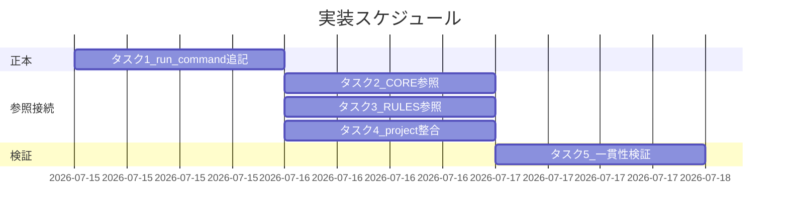

# 実装計画書: 外部サービス書き込み操作の実行主体明文化

**プロジェクト名**: 外部サービス書き込み操作の実行主体明文化
**作成日**: 2026 年 07 月 15 日
**最終更新**: 2026 年 07 月 15 日

> **重要**: **このドキュメントは常に更新**: 実装計画の変更、進捗状況の更新、バグの記録などがあった場合は、即座にこのドキュメントを更新してください。ドキュメントは「生きているドキュメント」として扱い、実装内容と常に同期させます。
> **必須項目**: 「必須」と明記した欄は空欄・抽象語のみで提出しないこと。テスト観点・BDD 仕様は具体ケースを 1 件以上記載すること。
>
> **用語**: [.agent-skill-chain/source/CONCEPTS.md §用語規約](../../../../../.agent-skill-chain/source/CONCEPTS.md#用語規約) を参照。

---

## 1. 実装概要

### 1.1 実装方針（必須）

正本（`skills/agent/run_command.md` §Constraints）に実行主体ルールを1項目として追記し、CORE / RULES / project 自己拡張ワークフローへは参照1行のみを追記する（正本一元化・02 の方針と整合）。新規 command / phase / enforcement チェックは作らない（ADR-5・ADR-8）。

### 1.2 実装順序（必須: 1 件以上）

1. タスク1: run_command.md §Constraints へ実行主体項目を追記（正本）
2. タスク2: CORE.md §メインがやってはいけないこと へ carve-out 参照1行を追記
3. タスク3: RULES.md §高リスク操作 へ実行主体の参照1行を追記
4. タスク4: 自己拡張ワークフロー.md の各ゲート具体手順へ「実行主体＝進行役」整合注記を1行追記
5. タスク5: 相互参照・重複無し・分類器非依存の一貫性検証



---

## 2. タスク分解

**必須**: 各タスクには「テスト観点」（2.x.3）と「単体テスト仕様（BDD）」（2.x.4）を必ず記載する。

### 2.1 タスク 1: run_command.md §Constraints へ実行主体項目を追記（正本）

#### 2.1.1 概要（必須）

外部書き込み操作の実行主体ルールの正本を run_command.md §Constraints の新規1項目として明文化する。

#### 2.1.2 実装内容（必須: 1 件以上）

- §Constraints に新規項目「**外部書き込み操作の実行主体（進行役限定）**」を追加し、以下を収める。
  - **原則**: 外部書き込み操作は、その操作を承認したユーザーの直接発言を自身の会話に持つエージェント（進行役）が実行する。伝聞承認のみのエージェントは実行しない（BR-1）。
  - **進行役の定義**: 役割名ではなく「その操作を承認したユーザー発言を自身の会話に持つエージェント」。並行セッションでは会話ごとに別個の進行役が成立する（ADR・論点1）。
  - **二段構え**: ローカル `git commit` はサブ可、`git push`（公開）/ `gh pr create` / `gh issue create` から進行役（ADR-2・論点2）。
  - **対象/非対象の列挙**: 対象＝`gh issue create` / `gh pr create` / `git push`（公開・`--force` 含む）、およびリポジトリ可視性変更・リリース公開等の外部公開操作（**列挙は代表例・抽象定義が第一基準**、ADR-4）。対象外＝読み取り専用（`gh api` 参照 / `gh issue view` / `git fetch`）・ローカル `git commit`。既承認済み（`gh pr merge --admin`・マージ済み PR のリモートブランチ削除）は**原則サブ可だが分類器ブロック時は進行役実行**（ADR-4 但し書き・論点3）。
  - **例外の限定と準備分担**: 例外は副作用アクション（外部書き込みコマンドの Bash 実行）のみ。body・コマンド文面・対象確定などの content authorship はサブが準備し、進行役は最終確認＋実行のみ（進行役の「最終確認」は実行可否判断であって body 推敲＝content authorship ではない・body はサブがファイル化し `--body-file` 参照実行を推奨）（ADR-3・論点4）。
  - **対象検証**: 実行前に repo / branch / worktree / issue 番号を検証（ADR-7・BR-4）。
  - **原則ベース但し書き**: 分類器の内部仕様に依存せず原則として記述し、2026-07-15 のブロック実例は Why / 脚注に留める。緩和（分類器バイパス・Bash 権限緩和）は採用しない（ADR-6・BR-5）。
  - **実行専用フェーズは新設しない**旨の明記（既存フローへの追記・ADR-5・論点5）。
- 既存 Execution Path Rule・§高リスク操作事前確認とは相互参照で接続（矛盾ではなく**例外・整合関係**）。§Forbidden「サブによる独断起票」（issue ドキュメントの新規作成をサブが自律決定しない）とは**補完・直交関係**（本ルールは gh コマンドの実行主体、独断起票は起票の意思決定であり別軸）であることを明記して混同を防ぐ。

#### 2.1.3 テスト観点（必須）

**参照**: 観点の定義は [02\_設計 §6](./02_設計.md) および [RULES のテスト戦略](../../../../../.agent-skill-chain/source/RULES.md#テスト戦略必須要件) を参照。

##### 単体（本タスクの具体ケース・必須 1 件以上）

- 正常系: §Constraints に「外部書き込み操作の実行主体」項目が存在し、原則文・二段構え・対象/非対象列挙・準備分担・対象検証・原則ベース但し書きの6要素をすべて含む。
- 異常系: 分類器の内部挙動への適合を規範文として書いた記述が本文に**存在しない**（脚注のみ許容）。

##### 結合/API（本タスクの具体ケース・該当時は必須 1 件以上）

- run_command §Execution Path Rule・§Forbidden サブによる独断起票との相互参照リンクが張られ、双方向に矛盾しない。

##### E2E/受け入れ（本タスクの具体ケース・未達時は理由記載）

- サブ・進行役が本項目1か所を読めば、`gh issue create` の実行主体を一意に判定できる（伝聞のみのサブ→エスカレーション、直接承認の進行役→実行）。

##### バリデーション（該当する場合の具体ケース）

- 対象/非対象の各コマンドが排他かつ網羅的に列挙され、`git commit` が対象外、`git push` が対象に分類されている。

#### 2.1.4 単体テスト仕様（BDD）（必須）

```gherkin
Feature: run_command 実行主体項目の記述
  Scenario: 伝聞承認のサブは外部書き込みを実行しない
    Given サブは進行役経由の伝聞承認のみを持つ
    And 操作は外部書き込み（gh issue create）である
    When 実行主体項目を参照する
    Then サブは実行せず進行役の自会話での直接承認を得るようエスカレーションする、と読める
```

**テストコード例（インラインコメントで Given/When/Then を明記）**

```bash
# Given: run_command.md の実行主体項目本文
SECTION=$(sed -n '/外部書き込み操作の実行主体/,/^- \*\*/p' .agent-skill-chain/source/skills/agent/run_command.md)
# When: 原則・二段構え・列挙の必須要素を検査する
# Then: 6要素すべてが含まれ、分類器適合を規範化した文が無い
echo "$SECTION" | grep -q "承認したユーザー" \
  && echo "$SECTION" | grep -q "git commit" \
  && echo "$SECTION" | grep -q "git push" \
  && ! echo "$SECTION" | grep -q "分類器に適合するため実行する"
```

#### 2.1.5 依存関係

- 後続タスク2〜4（参照接続）は本タスクが確定した正本を指すため、本タスクが先行する。

#### 2.1.6 見積もり

- **工数**: 1.5h
- **優先度**: 高

### 2.2 タスク 2: CORE.md §メインがやってはいけないこと へ carve-out 参照1行を追記

#### 2.2.1 概要（必須）

CORE の「メインはコマンド実行をしてはならない」に、外部書き込みコマンド実行の carve-out（正本は run_command）を参照1行で接続する。

#### 2.2.2 実装内容（必須: 1 件以上）

- §メインエージェントがやってはいけないこと の「コマンド実行」に、外部書き込みコマンド実行は run_command §外部書き込み操作の実行主体の限定例外である旨の参照1行を追加。原則本文は再掲しない（重複禁止）。

#### 2.2.3 テスト観点（必須）

##### 単体（本タスクの具体ケース・必須 1 件以上）

- 正常系: CORE に carve-out の参照1行が存在し、リンク先が run_command の当該項目を指す。
- 異常系: CORE に実行主体の原則本文（列挙・二段構え等）が**重複記載されていない**（参照のみ）。

##### 結合/API（本タスクの具体ケース・該当時は必須 1 件以上）

- 参照リンクが run_command §実行主体項目に解決する（リンク切れなし）。

##### E2E/受け入れ（本タスクの具体ケース・未達時は理由記載）

- CORE を読んだ進行役が「コマンド実行禁止」と「外部書き込みは自分で実行」を矛盾なく理解できる。

##### バリデーション（該当する場合の具体ケース）

- 該当なし。

#### 2.2.4 単体テスト仕様（BDD）（必須）

```gherkin
Feature: CORE carve-out 参照
  Scenario: コマンド実行禁止に外部書き込み例外の参照がある
    Given CORE §メインがやってはいけないこと の「コマンド実行」
    When carve-out 参照を確認する
    Then run_command の実行主体項目への参照1行が存在し、原則本文の重複が無い
```

```bash
# Given: CORE.md 本文
# When: carve-out 参照の有無と重複本文の不在を検査
# Then: 参照1行あり・原則本文の転記なし
grep -q "外部書き込み" .agent-skill-chain/source/boot/CORE.md \
  && ! grep -q "gh issue view" .agent-skill-chain/source/boot/CORE.md
```

#### 2.2.5 依存関係

- タスク1（正本確定）に依存。

#### 2.2.6 見積もり

- **工数**: 0.5h
- **優先度**: 中

### 2.3 タスク 3: RULES.md §高リスク操作 へ実行主体の参照1行を追記

#### 2.3.1 概要（必須）

RULES の高リスク操作に、外部書き込みは実行主体が進行役である旨の参照1行を接続する。

#### 2.3.2 実装内容（必須: 1 件以上）

- §高リスク操作に、外部書き込み（外部サービスへの書き込み）は高リスク操作であり事前確認を要し、実行主体は run_command §実行主体項目に従い進行役である旨の参照1行を追加。

#### 2.3.3 テスト観点（必須）

##### 単体（本タスクの具体ケース・必須 1 件以上）

- 正常系: RULES §高リスク操作に run_command 実行主体項目への参照1行が存在。
- 異常系: 原則本文の重複記載が無い。

##### 結合/API（本タスクの具体ケース・該当時は必須 1 件以上）

- 参照リンクが run_command 当該項目に解決する。

##### E2E/受け入れ（本タスクの具体ケース・未達時は理由記載）

- 高リスク操作の事前確認と実行主体（進行役）が両立して読める。

##### バリデーション（該当する場合の具体ケース）

- 該当なし。

#### 2.3.4 単体テスト仕様（BDD）（必須）

```gherkin
Feature: RULES 実行主体参照
  Scenario: 高リスク操作に外部書き込み実行主体の参照がある
    Given RULES §高リスク操作
    When 参照を確認する
    Then 外部書き込みの実行主体は進行役である旨の参照1行が存在する
```

```bash
# Given: RULES.md 高リスク操作セクション
# When: 実行主体参照の存在を検査
# Then: run_command 実行主体項目への参照がある
grep -q "実行主体" .agent-skill-chain/source/RULES.md
```

#### 2.3.5 依存関係

- タスク1に依存。

#### 2.3.6 見積もり

- **工数**: 0.5h
- **優先度**: 中

### 2.4 タスク 4: 自己拡張ワークフロー.md の各ゲート具体手順へ整合注記を1行追記

#### 2.4.1 概要（必須）

project 側の GitHub Issue 起票ゲート等の gh 具体手順に、実行主体が進行役である旨の整合注記を1行追加する（原則は source を参照）。

#### 2.4.2 実装内容（必須: 1 件以上）

- §GitHub Issue 起票ゲート（および PR 作成・close 移動 PR の具体手順）に、`gh issue create` / `gh pr create` / `git push` の実行主体は run_command §実行主体項目に従い進行役である旨の注記を1行追加。具体手順（title/body/frontmatter 等）は既存どおり維持。

#### 2.4.3 テスト観点（必須）

##### 単体（本タスクの具体ケース・必須 1 件以上）

- 正常系: project の各 gh 具体手順に実行主体＝進行役の整合注記が存在。
- 異常系: 具体手順と原則が矛盾しない（サブが起票する記述が残っていない）。

##### 結合/API（本タスクの具体ケース・該当時は必須 1 件以上）

- 既存の #34/#35/#36 ゲート手順と実行主体注記が両立し、二重定義になっていない（原則は source 参照）。

##### E2E/受け入れ（本タスクの具体ケース・未達時は理由記載）

- project を読んだ進行役が、起票は自分が実行し準備はサブが担うと理解できる。

##### バリデーション（該当する場合の具体ケース）

- 該当なし。

#### 2.4.4 単体テスト仕様（BDD）（必須）

```gherkin
Feature: project ゲート整合注記
  Scenario: 起票ゲート手順に実行主体注記がある
    Given 自己拡張ワークフロー.md §GitHub Issue 起票ゲート
    When 整合注記を確認する
    Then 実行主体は進行役である旨の注記1行が存在し、原則本文の二重定義が無い
```

```bash
# Given: 自己拡張ワークフロー.md
# When: 実行主体注記の存在を検査
# Then: 進行役が実行する旨の注記がある
grep -q "実行主体" .agent-skill-chain/project/自己拡張ワークフロー.md
```

#### 2.4.5 依存関係

- タスク1に依存。

#### 2.4.6 見積もり

- **工数**: 0.5h
- **優先度**: 中

### 2.5 タスク 5: 一貫性検証（相互参照・重複無し・分類器非依存）

#### 2.5.1 概要（必須）

正本1か所・参照接続・分類器非依存・二段構えの一貫性を横断検証する。

#### 2.5.2 実装内容（必須: 1 件以上）

- run_command / CORE / RULES / project 間の相互参照リンクが解決し（リンク切れなし）、原則本文が run_command 1 か所のみに存在することを確認。
- 01 の BDD シナリオ（UC1〜UC3）と本 03 のタスク別確認観点の 1:1 対応を確認。
- 緩和誘発記述（分類器バイパス・Bash 権限緩和）が一切含まれないことを確認。

#### 2.5.3 テスト観点（必須）

##### 単体（本タスクの具体ケース・必須 1 件以上）

- 正常系: 原則本文（対象/非対象列挙）を含むファイルが run_command のみ 1 件。
- 異常系: CORE / RULES / project に列挙本文の重複が 0 件。

##### 結合/API（本タスクの具体ケース・該当時は必須 1 件以上）

- 4 ファイル間の参照リンクがすべて解決する。

##### E2E/受け入れ（本タスクの具体ケース・未達時は理由記載）

- 00 の成功基準5項目（原則ベース記載・境界列挙・進行役定義・例外境界・二段構え/実行専用フェーズ案の採否）がすべて正本記述で充足される。

##### バリデーション（該当する場合の具体ケース）

- 「declined」「緩和」「バイパス」等の緩和誘発語が実行主体項目に混入していない。

#### 2.5.4 単体テスト仕様（BDD）（必須）

```gherkin
Feature: 実行主体ルールの一貫性
  Scenario: 原則本文は run_command に一元化されている
    Given 正本 run_command と参照側 CORE/RULES/project
    When 対象/非対象の列挙本文を横断検索する
    Then 列挙本文は run_command に1か所のみ存在し、参照側には重複しない
```

```bash
# Given: 4ファイル
# When: 列挙本文（gh issue view を含む対象外リスト）の出現ファイル数を数える
# Then: run_command のみ1件
COUNT=$(grep -rl "gh issue view" .agent-skill-chain/source/skills/agent/run_command.md \
  .agent-skill-chain/source/boot/CORE.md .agent-skill-chain/source/RULES.md \
  .agent-skill-chain/project/自己拡張ワークフロー.md | wc -l)
[ "$COUNT" -eq 1 ]
```

#### 2.5.5 依存関係

- タスク1〜4すべてに依存。

#### 2.5.6 見積もり

- **工数**: 1h
- **優先度**: 高

---

## テスト観点

本実装計画全体のテスト観点は「ドキュメント審査」に集約される。(1) 正本項目の6要素の存在、(2) 参照側の重複本文の不在、(3) 4ファイル間の相互参照リンク解決、(4) 分類器非依存・緩和誘発語の不在、(5) 01 の BDD（UC1〜UC3）との 1:1 対応。各タスク §2.x.3 に具体ケースを記載した。

---

## 単体テスト

ドキュメント成果物のため、単体テストは grep / リンク解決による記述検査（各タスク §2.x.4 の bash 例）で代替する。コード実装物が無いため実行時単体テストは該当なし。

---

## BDD

各タスク §2.x.4 に Given/When/Then を記載。01 の BDD シナリオとの対応:

- UC1-S1（伝聞承認のサブは実行しない）→ タスク1 BDD
- UC1-S2（直接承認の進行役が実行）→ タスク1 E2E / §2.5 E2E
- UC2-S1（読取専用・既承認は対象外）→ タスク1 バリデーション
- UC2-S2（commit/push 二段構え）→ タスク1 バリデーション・ADR-2
- UC3-S1（実行専用フェーズ案の採否）→ タスク1 実装内容（ADR-5 の明記）

---

## 3. 実装スケジュール

### 3.1 マイルストーン

| マイルストーン | 期日 | 成果物 |
| ---- | ---- | ---- |
| M1: 正本追記完了 | 実装 Day1 | run_command §実行主体項目 |
| M2: 参照接続完了 | 実装 Day1 | CORE / RULES / project の参照1行 |
| M3: 一貫性検証完了 | 実装 Day2 | 横断検証結果・review-docs 通過 |

### 3.2 実装フェーズ

#### フェーズ 1: 正本＋参照接続

- **期間**: Day1
- **タスク**: タスク1〜4

#### フェーズ 2: 検証

- **期間**: Day2
- **タスク**: タスク5

---

## 4. テスト計画

### 4.1 テストの優先順位

- 正本（run_command §実行主体項目）の記述完全性を最優先で審査（成功基準の中核）。
- 参照側の重複排除・リンク解決を回帰確認に必ず含める。

---

## 5. リスク管理

### 5.1 実装リスク

- **リスク**: 例外境界の記述が曖昧になり「ついで編集」滑り坂を正本上で否定できない。
  - **対策**: ADR-3 に従い例外を「Bash 実行アクションのみ」と厳密限定し、準備はサブ・進行役は最終確認＋実行のみと明記。
- **リスク**: CORE / RULES へ原則本文を重複転記し、正本一元化（BR-6）を破る。
  - **対策**: 参照1行に限定し、タスク5で列挙本文の出現ファイル数=1 を機械検査。
- **リスク**: 分類器仕様への適合として書き陳腐化・緩和誘発。
  - **対策**: ADR-6 に従い原則ベース記述、実例は脚注、緩和策は不採用。

---

## 6. 参考資料

### プロジェクトドキュメント

- [`02_設計.md`](./02_設計.md) - 設計
- [`01_要件定義.md`](./01_要件定義.md) - 要件定義

### その他の参考資料

- [.agent-skill-chain/source/skills/agent/run_command.md](../../../../../.agent-skill-chain/source/skills/agent/run_command.md)
- [.agent-skill-chain/source/boot/CORE.md](../../../../../.agent-skill-chain/source/boot/CORE.md)
- [.agent-skill-chain/source/RULES.md](../../../../../.agent-skill-chain/source/RULES.md)
- [.agent-skill-chain/project/自己拡張ワークフロー.md](../../../../../.agent-skill-chain/project/自己拡張ワークフロー.md)

---

## 7. 前のステップ

この実装計画書は、以下のドキュメントを基に作成されています：

- **前**: [`02_設計.md`](./02_設計.md) - 設計フェーズ

---

## 8. 次のステップ

この実装計画書の承認後、以下のいずれかのステップに進みます：

- **プロジェクトが 1 つの issue（またはタスク）である場合**: 実装フェーズ（execution）に直接進む（本 issue はサブ分割不要のため 90_issues.md は作成しない）。

**用語**: [.agent-skill-chain/source/CONCEPTS.md §用語規約](../../../../../.agent-skill-chain/source/CONCEPTS.md#用語規約) を参照。
