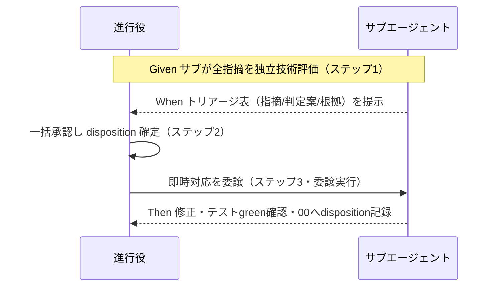

# 要件定義書: PR指摘対応フロー是正

**プロジェクト名**: PR指摘対応フロー是正
**作成日**: 2026年07月15日
**最終更新**: 2026年07月15日

> **重要**: **このドキュメントは常に更新**: 要件の変更や追加があった場合は、即座にこのドキュメントを更新してください。ドキュメントは「生きているドキュメント」として扱い、実装内容と常に同期させます。
>
> **用語**: [.agent-skill-chain/source/CONCEPTS.md §用語規約](../../../../../.agent-skill-chain/source/CONCEPTS.md#用語規約) を参照。

---

## 1. 概要

### 1.1 システム概要

`create-pr-review-issue` コマンドは、PR レビュー（CodeRabbit 等 AI レビューア）の指摘を受け取り、対応する仕組みである。現行は全指摘を一律サブ issue 化するが、本改定では**三値トリアージ（即時対応／起票／見送り）**と**起票条件チェックリスト**に基づき、軽微指摘はその場で（委譲実行により）直接対応し、起票を「起票条件に該当するもの」に限定する 3 ステップフローへ是正する。本要件定義はそのフローの要件（ユーザーストーリー・受け入れ基準・BDD）を定義する。

### 1.2 用語集

| 用語 | 説明 |
| -------- | ------ |
| 指摘（finding） | PR レビューコメントから抽出した 1 件の指摘（`ReviewFinding`。id/file/location/summary/raw）。 |
| disposition（処置） | 各指摘の最終処置。**即時対応 / 起票 / 見送り** の三値。 |
| 独立技術評価 | サブエージェントが指摘を確認・調査し、対応可否と処置案を判断するステップ 1。 |
| トリアージ表 | 全指摘を一括で「指摘／判定案／根拠」の表にまとめたもの（進行役の一括承認対象）。 |
| 起票条件チェックリスト | 起票要否を主観の「非可逆」ではなく操作可能な代理指標で判定するリスト。1 つでも該当したら起票。 |
| 即時対応 | 現 PR ブランチ内で委譲実行により直接修正する処置。テスト green を維持する軽微指摘に適用。 |
| 見送り | 対応しないと決めた処置。理由（AI 誤検知等）の記録が必須。 |
| 進行役（orchestrator） | phase 判定・command 選択・委譲・承認を行うメインエージェント。直接 Edit は禁止。 |

---

## 2. 機能要件

### 2.1 ユーザーストーリー

#### ストーリー 1: サブエージェントによる独立技術評価（ステップ 1）

- **As a** 進行役（orchestrator）
- **I want to** サブエージェントに全指摘を確認・調査させ、各指摘の対応可否と処置案を一括トリアージ表で提示させたい
- **So that** 軽微か否か・起票要否を、事実に基づく評価として一望し一括で判断できる

**受け入れ基準**:

- サブエージェントは全指摘（`ReviewFinding[]`）を確認・調査し、各指摘の処置案（即時対応／起票／見送り）と根拠を判断する。
- 出力は全指摘一括のトリアージ表（列: 指摘 / 判定案 / 根拠）である。指摘 1 件ごとに 3 ステップを個別往復させない。
- サブエージェントは処置案の提示に留め、起票・即時対応を独断で実行しない（`run_command.md` §Forbidden「サブによる独断起票」・CORE/PHASES を正本参照。本コマンドで再定義しない）。

#### ストーリー 2: 起票条件チェックリストによる起票要否判定

- **As a** サブエージェント（および承認する進行役）
- **I want to** 「非可逆」の主観判定ではなく操作可能な代理指標チェックリストで起票要否を判定したい
- **So that** 起票要否が再現的・説明可能になり、主観でブレない

**受け入れ基準**:

- 起票条件チェックリストは **C1〜C5 の名前付き項目を正本（closed set）**とし、いずれか 1 つでも該当したら起票側に倒す（保守側デフォルト）。定義の正本は `OUTPUT_FORMAT.md`（02_設計 §4.1）に一本化し、本書・00 は参照する:
  - C1: 仕様・受け入れ基準の変更を伴う
  - C2: 設計判断（02_設計 の修正）が必要
  - C3: PR スコープ外
  - C4: 複数指摘に共通する根本原因がある
  - **C5: 非可逆または破壊的な副作用を伴う、または起票要否の判定が不確実**（データ削除・スキーマ破壊的変更・データ上書き/マイグレーション・外部公開/送信・リリース済み成果物の変更等、取り消しコストが高い変更。判定に必要な情報が不足する場合も含む）。破壊的操作は原則として非可逆であり C5 の中核をなす（契約/後方互換を壊す「破壊的変更（breaking change）」は仕様変更寄りのため C1 で捕捉）。C5 は「非可逆」という当初の主観基準を**代理指標が取りこぼさないための fail-safe 項目**であり、疑わしきは起票へ倒す（REVIEW_DUAL_LENS §2.1「不確実なら要修正に倒す」と整合）。
- 直接対応（即時対応）の目安（**C1〜C5 のいずれにも非該当が前提**）: 現 PR ブランチ内の 1 コミットで完結し、既存テストが green のまま、diff が局所的（typo・lint・コメント・単一関数内）。
- 個々は軽微でも複数ファイル横断・共通根本原因なら合算で起票側へ倒す（C4）。
- 判定は「非可逆」という語を**直接の判定式に用いず**、該当したチェック項目名（C1〜C5）で説明される。C5 該当時も「非可逆」そのものではなく「非可逆な副作用」「判定不確実」という操作可能な該当理由で記述する。

#### ストーリー 3: 進行役による一括承認（ステップ 2）

- **As a** 進行役
- **I want to** サブのトリアージ表を受け、各指摘の disposition を一括で承認・決定したい
- **So that** 承認往復が指摘数に比例して膨らまず、最終方針を効率的に確定できる

**受け入れ基準**:

- 進行役はトリアージ表に対して disposition を一括承認（必要に応じて個別修正）する。
- 承認された disposition が各指摘の最終処置として確定する。起票・即時対応の Go 出しは進行役が行う。
- **一括承認の例外（個別確認対象）**: `security_flag=true` の指摘、および C5（非可逆な副作用・判定不確実）該当の指摘は、トリアージ表で**視覚的に分離して提示**し、一括承認の既定に**埋没させず個別に承認**する。効率化（一括承認）が、事故につながりやすい指摘の無自覚な素通し（rubber-stamp）を招かないようにする。

#### ストーリー 4: 対応の実施（ステップ 3・委譲実行）

- **As a** 進行役
- **I want to** 承認済み disposition に従い、即時対応はサブへ委譲して実施し、起票対象はサブ issue を起票したい
- **So that** 直接 Edit 禁止ルールに抵触せず、軽微指摘を効率的に処理できる

**受け入れ基準**:

- 「即時対応」の実施は**委譲実行**である（進行役が自らファイルを Edit しない。`run_command.md` Execution Path Rule に準拠）。
- 即時対応後にテストを実行し、既存テストが green を維持することを確認する。**テストが壊れる場合は軽微判定を取り消し**、起票側または再評価へ回す。
- **テストが実行できない場合の fail-safe**: 対象プロジェクトに実行可能なテストが存在しない／テストが実行不能・タイムアウト・flaky で green を確定できない場合は、即時対応の green を確認できたとみなさない。この場合は軽微判定を取り消し、起票側または再評価へ回す（不確実なら安全側へ倒す。REVIEW_DUAL_LENS §2.1）。
- 「起票」対象は既存フロー（`90_issues/{ディレクトリ名}/` のディレクトリ決定・00 生成・監査・書記記録）で起票する。

#### ストーリー 5: 全指摘の disposition 記録（記録の一本化）

- **As a** 進行役／監査者
- **I want to** 全指摘の disposition と根拠を既存の 00_要求定義（指摘一覧）に一本化して記録したい
- **So that** 対応状況が漏れなく追跡・監査でき、記録面が分裂しない

**受け入れ基準**:

- 全指摘に disposition（即時対応／起票／見送り）が漏れなく付与されている（DoD: 全指摘に disposition 付与済み）。
- 「見送り」は理由（AI 誤検知等）の記録が必須。AI レビューアの誤検知は正式な処置カテゴリ「見送り（理由付き）」で処理する。
- セキュリティ関連の指摘は軽微判定でも記録・監査を必須とする。
- **記録面の定義（記録先の所在）**: 記録先は、`create-pr-review-issue` が **PR レビューバッチにつき 1 つ生成するトリアージ記録用の 00_要求定義（指摘一覧）**とする。この 00 は全指摘の disposition・根拠・一括承認記録を保持する**単一の記録面**であり、新たな記録面を増やさない。
  - **起票（C1〜C5 該当）した指摘のみ**、追加で既存起票フローの成果物（`90_issues/{ディレクトリ名}/` の追跡用 sub issue）を持つ。即時対応・見送りの指摘は追加の起票成果物を持たず、当該トリアージ記録 00 への disposition 記録のみで処置が完結する。
  - **起票が 0 件（全指摘が即時対応／見送り）の場合でも、監査可能性のためトリアージ記録 00 は生成する**。これは「個々の軽微指摘を 1 件ずつ追跡 sub issue 化しない」ことによる軽量化であり、監査に必要な単一の記録面（disposition の網羅記録）は維持する、という設計上のトレードオフである。従来との差分は「ディレクトリ数」ではなく「各指摘が下流の追跡作業を持つか否か」にある。

### 2.2 BDD ユースケース

#### ユースケース 1: 軽微な指摘の即時対応

typo・lint 等の軽微な指摘を、起票せずその場で委譲実行により対応する。

**シナリオ 1: 軽微指摘は起票せず即時対応**

```gherkin
Feature: 軽微な PR 指摘の即時対応
  Scenario: typo 指摘が起票条件に非該当で即時対応される
    Given サブエージェントが全指摘を独立技術評価しトリアージ表を提示している
    And ある指摘が起票条件チェックリストのいずれにも該当しない（現 PR ブランチ内 1 コミット・diff 局所）
    When 進行役がトリアージ表を一括承認し disposition を「即時対応」に確定する
    Then その指摘はサブ issue 化されず、委譲実行により現 PR ブランチ内で修正される
    And 修正後にテストが実行され既存テストが green を維持する
    And 当該指摘の disposition「即時対応」が 00_要求定義（指摘一覧）に記録される
```

**処理フロー**:



#### ユースケース 2: 起票条件に該当する指摘の起票

仕様変更・設計判断・共通根本原因等、起票条件に該当する指摘はサブ issue を起票する。

**シナリオ 2: 起票条件該当は起票側に倒す**

```gherkin
Feature: 起票条件に基づくサブ issue 起票
  Scenario: 設計判断が必要な指摘が起票される
    Given サブエージェントが指摘を調査し「02_設計 の修正が必要」と判断している
    When 進行役がトリアージ表を承認し disposition を「起票」に確定する
    Then 当該指摘は既存フローでサブ issue（90_issues 配下）として起票される
    And 起票根拠として該当した起票条件（設計判断が必要）が記録される
```

**シナリオ 3: 個々は軽微でも共通根本原因なら合算で起票**

```gherkin
Feature: 共通根本原因の合算起票
  Scenario: 複数ファイル横断の同一根本原因を合算して起票側へ
    Given 複数の指摘が個別には軽微だが共通の根本原因を持つ
    When サブが「複数指摘に共通する根本原因がある」を起票条件該当として評価する
    Then それらの指摘は合算で起票側に倒され、disposition が「起票」となる
```

#### ユースケース 3: 見送り・テスト破壊時の軽微判定取消

AI 誤検知は見送り、即時対応がテストを壊す場合は軽微判定を取り消す。

**シナリオ 4: AI 誤検知は見送り（理由付き）**

```gherkin
Feature: 誤検知の見送り
  Scenario: AI レビューアの誤検知を見送りとして記録
    Given ある指摘が AI レビューアの誤検知と評価される
    When 進行役が disposition を「見送り」に確定する
    Then 当該指摘は対応されず、見送り理由（誤検知）が 00_要求定義（指摘一覧）に必須記録される
```

**シナリオ 5: テストが壊れる場合は軽微判定を取り消す**

```gherkin
Feature: テスト実行を軽微判定のゲートにする
  Scenario: 即時対応が既存テストを壊したため軽微判定を取り消す
    Given ある指摘が「即時対応」として委譲実行され修正された
    When 修正後のテスト実行で既存テストが green を維持できない
    Then その指摘の軽微判定（即時対応）は取り消され、起票側または再評価へ回される
```

**シナリオ 6: セキュリティ指摘は軽微でも記録・監査必須**

```gherkin
Feature: セキュリティ指摘の記録・監査
  Scenario: 軽微なセキュリティ指摘でも記録・監査を必須にする
    Given ある指摘がセキュリティ関連である
    When disposition が即時対応であっても
    Then 当該指摘は記録・監査の対象とし、無記録での処理を認めない
```

### 2.3 ビジネスルール

- **保守側デフォルト**: 起票条件チェックリスト（C1〜C5）に 1 つでも該当したら起票する。非可逆な副作用・判定不確実（C5）も該当とし、疑わしきは起票へ倒す。
- **三値トリアージ**: 各指摘の disposition は「即時対応 / 起票 / 見送り」の三値。二値（起票／直接）にしない。
- **サブは提案のみ・Go は進行役**: サブは独立評価とトリアージ案の提示に留め、起票・即時対応の実行 Go は進行役が出す（`run_command.md` §Forbidden・CORE/PHASES を正本参照。コマンド側で再定義しない）。
- **即時対応は委譲実行**: 進行役の直接 Edit は禁止。即時対応はサブへ委譲して実施する。
- **一括承認の例外分離**: `security_flag=true`・C5 該当は一括承認に埋没させず個別確認する。
- **テストゲート**: 軽微判定はテスト green 維持を条件とする。壊れたら、またはテストが実行不能で green を確定できない場合は軽微判定を取り消す。
- **記録一本化**: 全指摘の disposition・根拠は、PR レビューバッチにつき 1 つのトリアージ記録用 00_要求定義（指摘一覧）へ一本化して記録する。起票 0 件でも当該 00 は生成する。

---

## 3. 非機能要件

### 3.1 パフォーマンス要件

- ステップ 1 は全指摘一括トリアージ（表形式）とし、承認往復が指摘数に単純比例しないこと。

### 3.2 セキュリティ要件

- セキュリティ関連指摘は軽微判定でも記録・監査を必須とする。無記録での即時対応を禁止する。

### 3.3 ユーザビリティ要件

- トリアージ表は「指摘 / 判定案 / 根拠」の列で一望でき、進行役が一括承認しやすい形式であること。
- 起票要否が「非可逆」という主観語ではなく、該当したチェック項目名で説明されること。

### 3.4 可用性要件

- 既存の `create-pr-review-issue` の入力・出力フォーマット（`ReviewFinding[]`）との互換を保ち、既存の起票フロー（監査・書記記録）を破壊しないこと。

---

## 4. 外部インターフェース要件

### 4.1 API 要件

- 既存コマンド入力（pr_url・review_comments_raw・issue_dir_hint・parent_issue_id）を維持する。
- 既存の起票スクリプト（`create-pr-review-issue-dir.sh`）は起票対象の指摘に対してのみ従来どおり用いる。

### 4.2 データ形式要件

- `ReviewFinding`（id/file/location/summary/raw）の形式を維持する。
- 各 finding に disposition（即時対応／起票／見送り）と根拠を対応づけ、00_要求定義（指摘一覧）に記録する。

---

## 5. 制約事項

- コマンド側に既存ルールを再定義しない。フロー・disposition・起票条件は正本（CORE/PHASES/`run_command.md`）を参照でつなぐ。
- 「即時対応」の実施は委譲実行であり、進行役の直接 Edit 禁止ルール（Execution Path Rule）に抵触しない。
- 本要件のスコープは requirement-discovery（00・01）まで。02_設計以降は後続フェーズ。

---

## 6. 参考資料

### プロジェクトドキュメント

- [`00_要求定義.md`](./00_要求定義.md) - 要求定義

### その他の参考資料

- `.agent-skill-chain/source/commands/create-pr-review-issue.md`（改定対象）
- `.agent-skill-chain/source/workers/create-pr-review-issue/OUTPUT_FORMAT.md`（ReviewFinding／strategies の形式）
- `.agent-skill-chain/source/skills/agent/run_command.md`（Execution Path Rule／§Forbidden「サブによる独断起票」）
- `.agent-skill-chain/source/boot/CORE.md`・`.agent-skill-chain/source/workflow/PHASES.md`（起票・Go 判断の正本）

---

## 7. 前のステップ

この要件定義書は、以下のドキュメントを基に作成されています：

- **前**: [`00_要求定義.md`](./00_要求定義.md) - 要求定義フェーズ

---

## 8. 次のステップ

この要件定義書の承認後、以下のドキュメントを作成します：

- **次**: [`02_設計.md`](./02_設計.md) - 設計フェーズ
