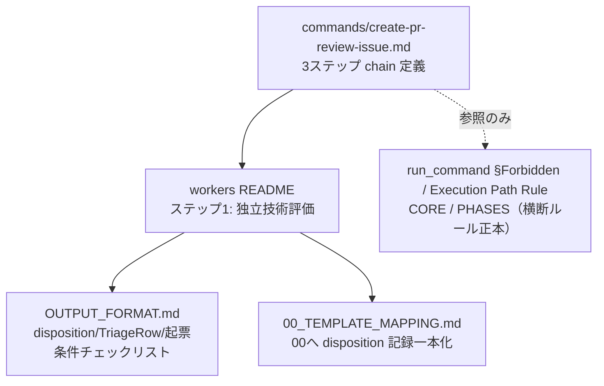
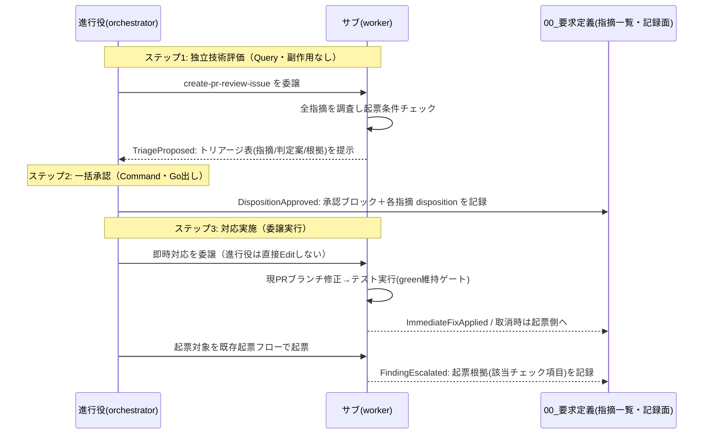
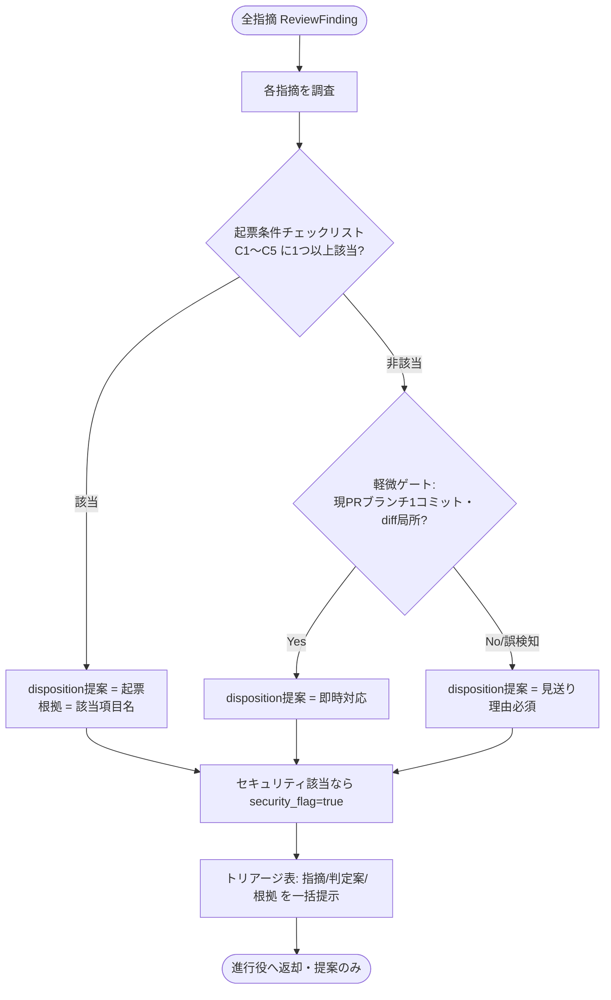
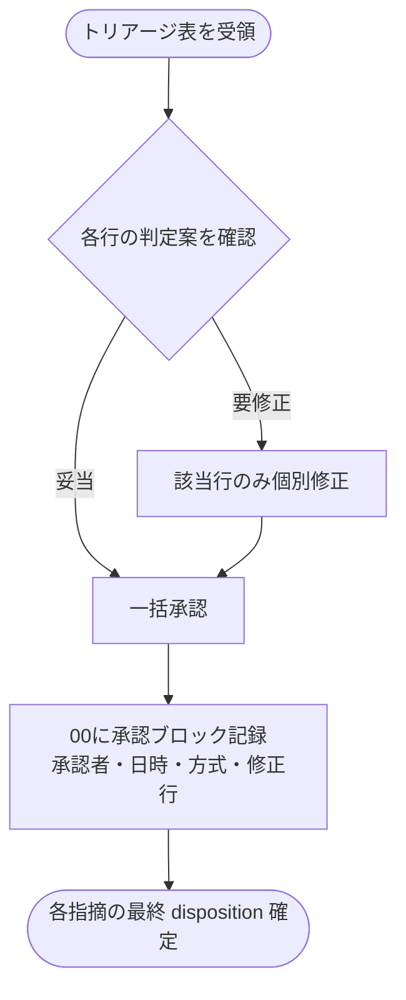
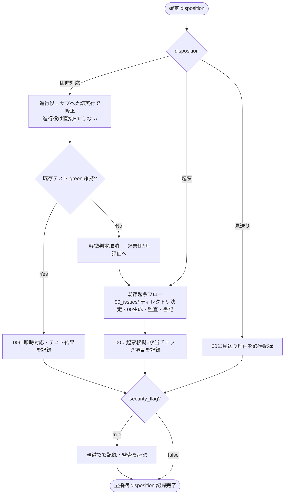
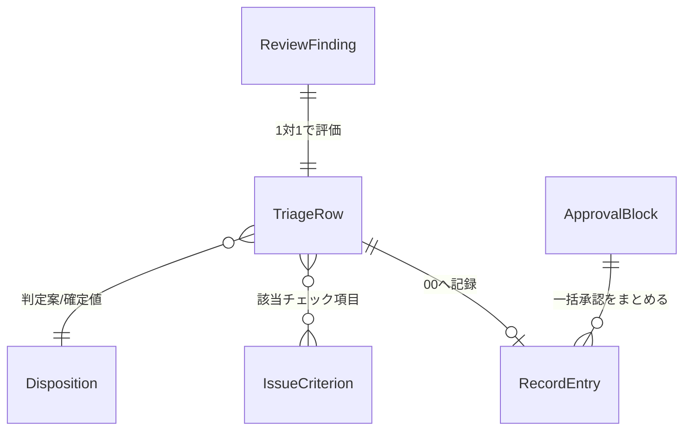

# 設計書: PR指摘対応フロー是正

**プロジェクト名**: PR指摘対応フロー是正
**作成日**: 2026年07月15日
**最終更新**: 2026年07月15日

> **重要**: **このドキュメントは常に更新**: 設計の変更や追加があった場合は、即座にこのドキュメントを更新してください。ドキュメントは「生きているドキュメント」として扱い、実装内容と常に同期させます。
>
> **用語**: [.agent-skill-chain/source/CONCEPTS.md §用語規約](../../../../../.agent-skill-chain/source/CONCEPTS.md#用語規約) を参照。

---

## 1. 設計概要

**必須**: 設計方針・原則は [.agent-skill-chain/source/spec/01\_設計原則.md](../../../../../.agent-skill-chain/source/spec/01_設計原則.md) を**先に参照**した上で、本プロジェクトに**適用するものを選び**記載する。

### 1.1 設計方針

`create-pr-review-issue` の一律サブ issue 化フローを、**三値 disposition（即時対応／起票／見送り）＋起票条件チェックリスト**に基づく 3 ステップフロー（サブの独立技術評価 → 進行役の一括承認 → 委譲実行での対応実施）へ是正する。フロー・disposition・起票条件は本コマンド／worker に**単一責務で 1 か所だけ**定義し、既存ルール（サブ独断起票禁止・Go は進行役・直接 Edit 禁止）は**正本を参照でつなぎ再定義しない**。本改定はドキュメント（command / worker / OUTPUT_FORMAT / 00_TEMPLATE_MAPPING）の是正であり、既存の入出力データ形式（`ReviewFinding[]`）と互換を保つ。

### 1.2 設計原則（本プロジェクトで適用するもの）

- **UNIX哲学**: 各ファイル（command・worker README・OUTPUT_FORMAT・TEMPLATE_MAPPING）は「1 つのこと」を記述する。フロー定義は command、データ形式・起票条件は OUTPUT_FORMAT、00 へのマッピングは TEMPLATE_MAPPING と役割を分ける。
- **単一責務**: 起票条件チェックリストと disposition の定義は **OUTPUT_FORMAT.md 1 か所**を正本とし、command / README / TEMPLATE_MAPPING は参照でつなぐ（重複定義を作らない＝01/00 の保守性要件）。
- **明確な境界**: フロー・disposition・起票条件（本コマンド固有ロジック）と、サブ独断起票禁止・Go は進行役・直接 Edit 禁止（横断ルール）の境界を明確にする。後者は `run_command.md` §Forbidden / Execution Path Rule・CORE / PHASES を**参照**し、command 側で再定義しない。
- **AIフレンドリー設計**: 三値 disposition と起票条件を「操作可能な代理指標」（該当チェック項目名）で表現し、主観語「非可逆」を排して再現的・説明可能にする（[01\_設計原則 §AIフレンドリー設計](../../../../../.agent-skill-chain/source/spec/01_設計原則.md#aiフレンドリー設計)）。

---

## 2. アーキテクチャ設計

### 2.1 責務・境界・参照関係

#### 2.1.1 責務一覧

| コンポーネント | 責務（1 文） |
| -------------------- | -------------------- |
| `commands/create-pr-review-issue.md` | 3 ステップフロー（独立技術評価 → 一括承認 → 委譲実行での対応実施）の skill/worker chain と OUTPUT / DONE を定義する。 |
| `workers/create-pr-review-issue/README.md` | ステップ 1（独立技術評価）の worker 手順＝全指摘のトリアージ表生成・起票条件チェック・即時対応の委譲実行とテストゲートを定義する。 |
| `workers/create-pr-review-issue/OUTPUT_FORMAT.md` | `disposition`・`TriageRow`・**起票条件チェックリスト**・見送り理由・セキュリティフラグのデータ形式を**単一の正本**として固定する。 |
| `workers/create-pr-review-issue/00_TEMPLATE_MAPPING.md` | 全指摘の disposition・根拠・一括承認記録を、既存 00_要求定義（指摘一覧）へ**一本化して記録**するマッピングを定義する。 |
| 進行役（orchestrator, 外部・不変） | ステップ 2 の一括承認（Go 出し）とステップ 3 の委譲実行を行う。振る舞いは既存正本に従い本 issue では変更しない。 |
| `run_command.md` §Forbidden / Execution Path Rule（外部・不変） | サブ独断起票禁止・Go は進行役・進行役の直接 Edit 禁止の**正本**。本 issue は参照のみ。 |

#### 2.1.2 境界

- **入力**: 既存コマンド入力（`pr_url`・`review_comments_raw`・`issue_dir_hint`・`parent_issue_id`）と `ReviewFinding[]`。本改定で入力形式は変更しない。
- **出力（記録面の所在を明示）**: `create-pr-review-issue` は **PR レビューバッチにつき 1 つのトリアージ記録用 00_要求定義（指摘一覧）**を生成し、これを全指摘の disposition・根拠・起票条件該当・一括承認記録を保持する**単一の記録面**とする（`created_issue_dir` 配下の 00＝この記録面）。これに加え、**disposition=起票 の指摘に対してのみ**追加の既存起票フロー成果物（追跡用 sub issue の `90_issues/{ディレクトリ名}/`）を持つ。
  - **起票 0 件でも記録 00 は生成する**: 全指摘が即時対応／見送りでも、監査可能性のためトリアージ記録 00 は必ず生成する。軽量化の対象は「各指摘を 1 件ずつ下流の追跡 sub issue にしないこと」であり、監査に必要な単一記録面は維持する（00 §記録一本化・§セキュリティ記録必須と整合）。
- **アクター境界（command が跨る委譲境界の明示）**: 本フローは進行役（orchestrator）とサブ（worker）に跨る。**ステップ 1（独立技術評価）はサブが実行しトリアージ表を進行役へ返却して一旦終了**する。**ステップ 2（一括承認）は進行役が行い**（サブは自己承認しない＝サブ独断禁止・Go は進行役の正本と整合）、**ステップ 3（即時対応の委譲実行・起票・見送り記録）は進行役が承認後に改めてサブへ委譲**する。すなわち command の skill/worker chain は「サブがステップ 1 を実行 → 進行役へ返却 → 進行役承認 → 進行役がステップ 3 を再委譲」という**委譲境界を跨いだ受け渡し**として実装し、サブがステップ 2 を自己完結して起票・修正まで走らせない。
- **他責務との境界**: 「サブ独断起票禁止／Go は進行役／進行役の直接 Edit 禁止」は横断ルールであり `run_command.md`・CORE・PHASES が正本。本 issue はコマンド／worker のフロー・データ形式のみを是正し、横断ルールを**再定義しない**。CodeRabbit 等からのコメント自動取得は対象外（手動貼り付け前提を維持）。

#### 2.1.3 参照関係

- `commands/create-pr-review-issue.md` → `workers/create-pr-review-issue/README.md`（ステップ 1 手順）
- `workers/create-pr-review-issue/README.md` → `OUTPUT_FORMAT.md`（disposition・TriageRow・起票条件の正本）
- `workers/create-pr-review-issue/README.md` → `00_TEMPLATE_MAPPING.md`（00 への記録マッピング）
- `commands/create-pr-review-issue.md` → `run_command.md` §Forbidden / Execution Path Rule・CORE・PHASES（横断ルールの正本・参照のみ）
- `00_TEMPLATE_MAPPING.md` → `runtime/templates/00_要求定義.md`（00 の必須セクション）
- 循環参照なし（フロー→データ形式→記録マッピングの一方向。横断ルールは末端参照）。

### 2.2 システムアーキテクチャ

**必須**: 設計判断は [.agent-skill-chain/source/spec/](../../../../../.agent-skill-chain/source/spec/)（[00_spec概要.md](../../../../../.agent-skill-chain/source/spec/00_spec概要.md)、[01\_設計原則.md](../../../../../.agent-skill-chain/source/spec/01_設計原則.md)、[06\_設計判断の優先順位.md](../../../../../.agent-skill-chain/source/spec/06_設計判断の優先順位.md)）を**先に**参照する。

- **採用パターン**: 宣言的パイプライン（command が定義する skill/worker chain を、run_command 経由でサブへ委譲して逐次実行するプロンプト・ドキュメント駆動アーキテクチャ）。
- **根拠**: 本システムは実行コードではなくエージェント向けドキュメント（command / worker / 形式仕様）である。[06\_設計判断の優先順位](../../../../../.agent-skill-chain/source/spec/06_設計判断の優先順位.md)（可読性 > 単一責務 > 仕様整合）に従い、フロー・データ形式・記録マッピングを別ファイルへ単一責務で分離し、横断ルールは参照でつなぐ。

#### 2.2.1 CQRS（Command/Query 分離）

- **Command（状態変更）**: 進行役の一括承認（disposition 確定）、委譲実行による即時対応の修正・起票、00 への disposition 記録。
- **Query（状態取得）**: サブの独立技術評価（指摘の調査・トリアージ表提示）は状態を変更しない読み取り・評価であり、承認前に副作用（起票・修正）を持たない（＝サブは提案のみ）。

#### 2.2.2 アーキテクチャ図（本プロジェクトの構成）

### 2.3 コンポーネント構成

- **フロー層（command）**: 3 ステップの chain・OUTPUT・DONE・ERROR/Forbidden を定義。起票条件・disposition の実体定義は持たず OUTPUT_FORMAT を参照する。
- **手順層（worker README）**: ステップ 1 の実手順（トリアージ表生成・起票条件チェック・即時対応の委譲実行・テストゲート）を定義。
- **データ形式層（OUTPUT_FORMAT）**: `disposition`・`TriageRow`・起票条件チェックリスト・見送り理由・セキュリティフラグを固定（単一責務の正本）。
- **記録マッピング層（00_TEMPLATE_MAPPING）**: 全指摘の disposition・根拠・一括承認記録を 00_要求定義（指摘一覧）へ一本化。

各ファイルは単一責務。横断ルール（サブ独断起票禁止・Go は進行役・直接 Edit 禁止）は `run_command.md`・CORE・PHASES を境界外の正本として参照する。

### 2.4 データフロー

**イベント（起きた事実）**の例: `TriageProposed`（サブがトリアージ表を提示した）、`DispositionApproved`（進行役が一括承認した）、`ImmediateFixApplied`（委譲実行で即時対応が完了した）、`FindingEscalated`（起票条件該当で起票された）。command 側では明示的なイベントバスは持たず、chain の逐次進行と 00 への記録で表現する。

### 2.5 横断設計判断（ADR）

本プロジェクトの重要判断を [EVIDENCE_POLICY.md](../../../../../.agent-skill-chain/source/EVIDENCE_POLICY.md) の ADR 形式で記録する。

#### ADR-1: 起票条件チェックリストと disposition の定義を OUTPUT_FORMAT.md へ単一責務で集約する

- **コンテキスト**: 「非可逆」の主観判定を操作可能な代理指標へ落とし、フロー・disposition・起票条件を単一責務で記述したい（01/00 §保守性）。
- **検討した選択肢**: (a) command に直書き、(b) worker README に散在、(c) OUTPUT_FORMAT.md（既存のデータ形式固定ファイル）へ集約し他は参照。
- **決定**: (c)。`disposition`・`TriageRow`・起票条件チェックリストを OUTPUT_FORMAT.md の正本として固定し、command / README / TEMPLATE_MAPPING は参照でつなぐ。
- **根拠**: OUTPUT_FORMAT.md は既に「データ形式をコード上で固定する」責務を持つ（evidence_source: internal-doc `workers/create-pr-review-issue/OUTPUT_FORMAT.md` §冒頭）。重複定義を避け保守性を保つ（06_設計判断の優先順位: 単一責務）。
- **帰結**: 起票条件・disposition の変更点が 1 ファイルに閉じる。command は薄いフロー定義に保たれる。

#### ADR-2: 三値 disposition の記録を既存 00_要求定義（指摘一覧）へ一本化する

- **コンテキスト**: 全指摘の disposition・根拠を漏れなく追跡したいが、新たな記録面を増やすと分裂する（01 ストーリー5・00 §記録一本化）。
- **検討した選択肢**: (a) 別ファイル（例: 指摘対応/02_対応方針.md）に記録、(b) memo に記録、(c) 既存 00_要求定義の指摘一覧テーブルへ disposition・根拠・起票条件該当・一括承認記録を追加。
- **決定**: (c)。00_TEMPLATE_MAPPING の指摘一覧セクションへ列を追加し、承認ブロックを 00 に持たせる。
- **根拠**: 00 は既に指摘一覧を持つ記録面である（evidence_source: internal-doc `00_TEMPLATE_MAPPING.md` §見出しとマッピング「## 2. 指摘一覧」）。記録面を増やさない要件（00 §4.2）に整合。
- **帰結**: disposition の追跡・監査が 00 一箇所で完結。DoD「全指摘に disposition 付与」を 00 で検査できる。

#### ADR-3: 即時対応の実施経路は委譲実行とし、サブ独断起票禁止・Go は進行役の横断ルールは正本参照で再定義しない

- **コンテキスト**: 即時対応の実施が進行役の直接 Edit 禁止（Execution Path Rule）に抵触しないよう明記し、かつ横断ルールをコマンド側に重複させたくない（00 §4.1・4.2、01 §5）。
- **検討した選択肢**: (a) command に「進行役が直接修正」と書く、(b) command に横断ルールを再掲、(c) 「即時対応＝委譲実行」であることのみ明記し、サブ独断起票禁止・Go は進行役は `run_command.md` §Forbidden / Execution Path Rule・CORE / PHASES を参照。
- **決定**: (c)。command / worker には「即時対応は委譲実行（進行役は自らファイルを Edit しない）」と明記し、根拠ルールは参照でつなぐ。
- **根拠**: 進行役の直接 Edit は絶対禁止（evidence_source: internal-doc `run_command.md` Execution Path Rule）。サブ独断起票も禁止（evidence_source: internal-doc `run_command.md` §Forbidden「サブによる独断起票」）。コマンド側の再定義禁止（00 §保守性）。
- **帰結**: 即時対応は「進行役が承認後にサブへ再委譲して修正」の経路に固定。ルールの二重管理を避ける。

---

## 3. 機能設計

### 3.1 機能 1: ステップ1 — サブの独立技術評価（全指摘一括トリアージ表の生成）

#### 3.1.1 概要

サブ（worker）が全指摘（`ReviewFinding[]`）を調査し、各指摘に対して起票条件チェックリストを適用して disposition 提案・根拠・セキュリティフラグを判断し、**全指摘一括のトリアージ表**として提示する。サブは提案に留め、起票・即時対応を独断で実行しない（正本参照）。

#### 3.1.2 処理フロー

#### 3.1.3 入力・出力

- **入力**: `ReviewFinding[]`（id/file/location/summary/raw）。
- **出力**: `TriageRow[]`（トリアージ表）。列＝指摘（finding.id・要約）／判定案（disposition 提案）／根拠（該当した起票条件項目名・または即時対応の目安充足・または見送り理由）。個々の指摘を 3 ステップ個別往復させない。

#### 3.1.4 エラーハンドリング

- 指摘一覧が空: 既存挙動を維持（00 に「指摘一覧が空です…」を明記、受け入れ基準に「指摘一覧が 1 件以上」を含める）。トリアージ表は 0 行。
- 起票条件の判定に必要な情報が不足: 判定を保守側（起票）へ倒す（保守側デフォルト）。

### 3.2 機能 2: ステップ2 — 進行役の一括承認（Go 出しと承認記録）

#### 3.2.1 概要

進行役がトリアージ表に対し disposition を**一括承認**（必要に応じ個別修正）し、各指摘の最終処置を確定する。承認は 00 に承認ブロックとして記録する。起票・即時対応の Go は進行役が出す（正本参照）。**一括承認の例外**: `security_flag=true` の指摘と C5（非可逆な副作用・判定不確実）該当の指摘は、トリアージ表で視覚的に分離提示し、一括承認に埋没させず**個別承認**とする（効率化が事故につながる指摘の無自覚な rubber-stamp を招かないための安全策）。

#### 3.2.2 処理フロー

#### 3.2.3 入力・出力

- **入力**: `TriageRow[]`。
- **出力**: 確定 disposition（各 finding へ即時対応／起票／見送りを確定）＋ 00 の承認ブロック（承認者＝進行役、承認日時、承認方式＝一括／個別修正の別、個別修正した finding.id 一覧）。

#### 3.2.4 エラーハンドリング

- 承認往復が指摘数に単純比例しないよう、表単位の一括承認を既定とする（個別修正は差分のみ）。

### 3.3 機能 3: ステップ3 — 対応の実施（委譲実行・テストゲート・起票・見送り記録）

#### 3.3.1 概要

確定 disposition に従い、即時対応は委譲実行で現 PR ブランチ内修正＋テスト実行（green 維持ゲート）、起票は既存起票フロー、見送りは理由記録。全指摘の disposition・根拠を 00 へ一本化して記録する。

#### 3.3.2 処理フロー

#### 3.3.3 入力・出力

- **入力**: 確定 disposition・`TriageRow[]`。
- **出力**: 即時対応の修正（現 PR ブランチ）＋テスト結果、起票成果物（`90_issues/{ディレクトリ名}/`）、00 への全指摘 disposition・根拠記録。

#### 3.3.4 エラーハンドリング

- **テストゲート**: 即時対応後にテストを実行し、既存テストが green を維持できない場合は**軽微判定（即時対応）を取り消し**、起票側または再評価へ回す（01 シナリオ5）。**テストが実行できない場合の fail-safe**: 対象プロジェクトに実行可能なテストが無い／実行不能・タイムアウト・flaky で green を確定できない場合も green を確認できたとみなさず、軽微判定を取り消して起票側または再評価へ回す（不確実なら安全側へ倒す。C5 とも整合）。
- **セキュリティ**: `security_flag=true` の指摘は disposition が即時対応でも記録・監査を必須とし、無記録での処理を認めない（01 シナリオ6）。
- **見送り（理由付き）**: AI レビューアの誤検知は正式な処置カテゴリ「見送り（理由付き）」で処理し、理由記録を必須とする（01 シナリオ4）。

---

## 4. データ設計

### 4.1 データモデル

本システムに RDB は無い。データモデルは worker が扱う値の**契約**として定義する（OUTPUT_FORMAT.md が正本）。

#### 概念関係図

**注意**: 上記は物理テーブルではなく、worker が生成・記録する値の関係を表す概念モデルである。

#### 値オブジェクト一覧

| 値オブジェクト | 説明 | 一意キー |
| ------------ | ------ | -------- |
| ReviewFinding | 既存。PR 指摘 1 件（id/file/location/summary/raw）。**本改定で変更しない**。 | id |
| TriageRow | 1 指摘のトリアージ結果（判定案・根拠・セキュリティフラグ・見送り理由）。 | finding_id |
| Disposition | 三値の処置（即時対応／起票／見送り）。 | 値 |
| IssueCriterion | 起票条件チェックリスト項目（C1〜C5）。C5 は非可逆な副作用・判定不確実の fail-safe。 | コード |
| ApprovalBlock | 進行役の一括承認記録（承認者・日時・方式・個別修正 finding 一覧）。 | 承認日時 |

#### TriageRow

| フィールド | 型 | NULL | 説明 |
| ---------- | -------- | ---- | -------- |
| finding_id | string | NO | 対応する ReviewFinding.id |
| disposition_proposal | Disposition | NO | サブの判定案（即時対応／起票／見送り） |
| matched_criteria | IssueCriterion[] | YES | 該当した起票条件（1 件以上で起票側デフォルト。空＝非該当） |
| rationale | string | NO | 根拠（該当項目名／即時対応の目安充足／見送り理由）。主観語「非可逆」を用いない |
| security_flag | bool | NO | セキュリティ関連か（true なら軽微でも記録・監査必須） |
| defer_reason | string | YES | disposition=見送り のとき必須（例: AI 誤検知） |

#### Disposition（列挙）

| 値 | 意味 | 実施経路 |
| ---- | -------- | -------- |
| 即時対応 | 現 PR ブランチ内で修正 | 委譲実行（進行役は直接 Edit しない）＋テスト green ゲート |
| 起票 | 非可逆的対応として追跡・起票 | 既存起票フロー（90_issues 配下） |
| 見送り | 対応しない | 理由（defer_reason）必須記録のみ |

#### IssueCriterion（起票条件チェックリスト・保守側デフォルト）

起票条件チェックリストは **C1〜C5 の名前付き項目を closed set（正本）**とする。OUTPUT_FORMAT.md をデータ形式の正本とし、command / README / 00 / 01 は本表を参照する。

| コード | チェック項目 | 該当時 |
| ---- | -------- | -------- |
| C1 | 仕様・受け入れ基準の変更を伴う | 1 つでも該当したら **disposition=起票** に倒す（保守側デフォルト）。 |
| C2 | 設計判断（02_設計 の修正）が必要 | 同上 |
| C3 | PR スコープ外 | 同上 |
| C4 | 複数指摘に共通する根本原因がある（個々は軽微でも合算で起票側へ） | 同上 |
| C5 | **非可逆または破壊的な副作用を伴う、または起票要否の判定が不確実**（データ削除・スキーマ破壊的変更・データ上書き/マイグレーション・外部公開/送信・リリース済み成果物の変更等、取り消しコストが高い変更。判定情報が不足する場合を含む） | 同上。C5 は当初基準「非可逆」を代理指標 C1〜C4 が取りこぼさないための **fail-safe 項目**。疑わしきは起票へ倒す（REVIEW_DUAL_LENS §2.1「不確実なら要修正に倒す」と整合） |

- **即時対応の許容ゲート（C1〜C5 いずれも非該当が前提）**: 現 PR ブランチ内 1 コミットで完結・既存テスト green のまま・diff が局所的（typo・lint・コメント・単一関数内）。テスト破壊時、またはテストが実行不能で green を確定できない場合は軽微判定を取り消す（fail-safe）。
- **列挙の性質**: C1〜C5 は closed set だが、C5 が「非可逆／破壊的な副作用・判定不確実」の catch-all を担うため、C1〜C4 に厳密一致しない非可逆・破壊的ケースや情報不足ケースも C5 で起票側へ回収される（原基準「非可逆」の取りこぼしを防ぐ）。
- **「非可逆」と「破壊的」の関係**: データ削除・上書き・マイグレーション等の**破壊的操作は原則として非可逆**（実行後に元へ戻せない）であり、C5 の中核をなす。一方、契約/後方互換を壊す「破壊的変更（breaking change）」は、データの非可逆性というより仕様・受け入れ基準の変更に近く **C1** で捕捉する。したがって C5 の見出しは両者を取りこぼさないよう「非可逆**または**破壊的」と明記し、破壊的操作（≒非可逆）は C5、破壊的（互換破壊）変更は C1 という振り分けを設計上明確にする。

### 4.2 データ構造

- `matched_criteria` が空集合でない ⇔ disposition=起票（保守側デフォルトの不変条件）。
- `disposition=見送り` ⇒ `defer_reason` 非空（不変条件）。
- `security_flag=true` ⇒ disposition に関わらず 00 へ記録・監査対象（不変条件）。

---

## 5. API 設計

本システムに HTTP API は無い。外部に公開する「契約」はコマンド入出力と worker の生成物である。

### 5.1 API 一覧

| インターフェース | 種別 | 説明 |
| ------------------ | ---------- | ------ |
| create-pr-review-issue（command 入力） | コマンド契約 | pr_url・review_comments_raw・issue_dir_hint・parent_issue_id。**本改定で不変**。 |
| ステップ1 出力（TriageRow[]） | worker 出力契約 | トリアージ表（指摘／判定案／根拠）。 |
| ステップ2 出力（承認ブロック） | 記録契約 | 00 へ承認者・日時・方式・個別修正一覧を記録。 |
| ステップ3 出力（disposition 記録） | 記録契約 | 全指摘の disposition・根拠を 00_要求定義（指摘一覧）へ一本化。 |

### 5.2 API 詳細

#### API1: ステップ1 独立技術評価

- **入力**: `ReviewFinding[]`
- **出力**: `TriageRow[]`（列: 指摘・判定案・根拠）
- **契約違反**: サブが承認前に起票・即時対応を実行した場合は違反（サブは提案のみ。正本 `run_command.md` §Forbidden）。判定情報不足時は保守側（起票）へ倒す。

#### API2: ステップ3 即時対応（委譲実行）

- **入力**: 確定 disposition=即時対応 の finding
- **出力**: 現 PR ブランチ修正＋テスト結果＋00 記録
- **エラー**: 既存テストが green を維持できない → 軽微判定取消（起票側／再評価へ）。進行役の直接 Edit は契約違反（Execution Path Rule）。

---

## 6. テスト戦略

テスト戦略の**観点の定義**は [RULES.md のテスト戦略必須要件](../../../../../.agent-skill-chain/source/RULES.md#テスト戦略必須要件) を、**BDD 形式の定義**は [TEST_BDD_FORMAT.md](../../../../../.agent-skill-chain/source/TEST_BDD_FORMAT.md) を参照する。本ドキュメントでは**対象ごとのテスト割当**のみ記載する。

> 本成果物はエージェント向けドキュメント（command / worker / 形式仕様）であり、実行コードのテストではなく**ドキュメント検査（構造・整合の目視／grep 検証）と `create-pr-review-issue-dir.sh` の既存 BDD 観点**が「テスト」に相当する。単体＝ドキュメント内の必須要素の存在検査、結合＝chain 全体の整合検査。

### 6.1 対象ごとのテスト割り当て

| 対象 | 単体 | 結合/API | E2E | クリティカル観点 | バリデーション観点 | 未達理由/補足 |
| --------------------------- | ----- | -------- | ----- | ---------------- | ------------------ | ------------- |
| command 3 ステップ chain 定義 | ○ | ○ | × | 3 ステップ（評価→承認→委譲実行）が順序付きで記載・OUTPUT/DONE に disposition 記録が含まれる | 横断ルールを再定義せず参照でつないでいる | E2E は実行系でないため対象外 |
| OUTPUT_FORMAT: disposition/TriageRow/起票条件 | ○ | ○ | × | 三値 disposition・C1〜C5（C5=非可逆/不確実の fail-safe）・保守側デフォルト・見送り理由必須・security_flag が定義される | 主観語「非可逆」を判定式に用いず該当項目名で説明 | — |
| 00_TEMPLATE_MAPPING: 記録一本化 | ○ | ○ | × | 指摘一覧に disposition/根拠/承認ブロックのマッピングがあり記録面を増やさない | 全指摘 disposition 付与が DoD 化 | — |
| worker README: 即時対応の委譲実行・テストゲート | ○ | ○ | × | 即時対応＝委譲実行・テスト green ゲート・破壊時取消が記載 | 進行役の直接 Edit 禁止に抵触しない記述 | — |
| create-pr-review-issue-dir.sh（既存） | ○ | × | × | 既存の起票ディレクトリ決定が起票 disposition 時のみ従来どおり機能 | hint/parent サニタイズ既存維持 | 本改定でスクリプトは変更しない（回帰確認のみ） |

### 6.2 監査・レビューでの確認（証跡）

証跡の確認観点は RULES §テスト戦略必須要件および workflow/PHASES.md の監査観点を参照。本設計書 §6.1 の割当表と 03\_実装計画のタスク別テスト観点・BDD が揃っていることを確認する。01 の BDD シナリオ 1〜6 と 03 の各タスク BDD が対応することを監査で確認する。

---

## 7. UI 設計

該当なし（エージェント向けドキュメント改定であり画面を持たない）。トリアージ表・承認ブロックの「表示形式」は §3・§4 の記録契約で規定する。

---

## 8. セキュリティ設計

### 8.1 認証・認可

該当なし（本システムに認証機構は無い）。承認権限は「Go は進行役」という横断ルール（`run_command.md` §Forbidden・CORE / PHASES）で担保し、本 issue では再定義しない。

### 8.2 データ保護

- **セキュリティ指摘の記録・監査必須**: `security_flag=true` の指摘は disposition が即時対応であっても 00 へ記録し監査対象とする。無記録での即時対応を禁止する（01 §3.2・シナリオ6）。
- **一括承認からの分離（無自覚な事故の防止）**: `security_flag=true`・C5 該当の指摘は §3.2.1 のとおり一括承認に埋没させず個別承認とする。効率化（一括承認）が、セキュリティ影響や非可逆な副作用を持つ指摘の誤トリアージ（軽微への誤分類）をそのまま PR ブランチへ commit してしまう事故シナリオを防ぐ。

---

## 9. 非機能要件への対応

### 9.1 パフォーマンス

- ステップ1 を全指摘一括トリアージ（表形式）とし、進行役は表単位で一括承認する。承認往復が指摘数に単純比例しない（01 §3.1）。

### 9.2 可用性

- 既存コマンド入力・`ReviewFinding[]` 形式・既存起票フロー（監査・書記記録）と互換を保ち、既存フローを破壊しない（01 §3.4）。既存 `create-pr-review-issue-dir.sh` は起票 disposition の指摘に対してのみ従来どおり用いる。

---

## 10. 参考資料

### プロジェクトドキュメント

- [`01_要件定義.md`](./01_要件定義.md) - 要件定義
- [`00_要求定義.md`](./00_要求定義.md) - 要求定義

### その他の参考資料

- `.agent-skill-chain/source/commands/create-pr-review-issue.md`（改定対象）
- `.agent-skill-chain/source/workers/create-pr-review-issue/README.md`・`OUTPUT_FORMAT.md`・`00_TEMPLATE_MAPPING.md`（改定対象）
- `.agent-skill-chain/source/skills/agent/run_command.md`（Execution Path Rule／§Forbidden「サブによる独断起票」・正本）
- `.agent-skill-chain/source/boot/CORE.md`・`.agent-skill-chain/source/workflow/PHASES.md`（起票・Go 判断の正本）

---

## 11. 前のステップ

この設計書は、以下のドキュメントを基に作成されています：

- **前**: [`01_要件定義.md`](./01_要件定義.md) - 要件定義フェーズ

---

## 12. 次のステップ

この設計書の承認後、以下のドキュメントを作成します：

- **次**: [`03_実装計画.md`](./03_実装計画.md) - 実装計画フェーズ
