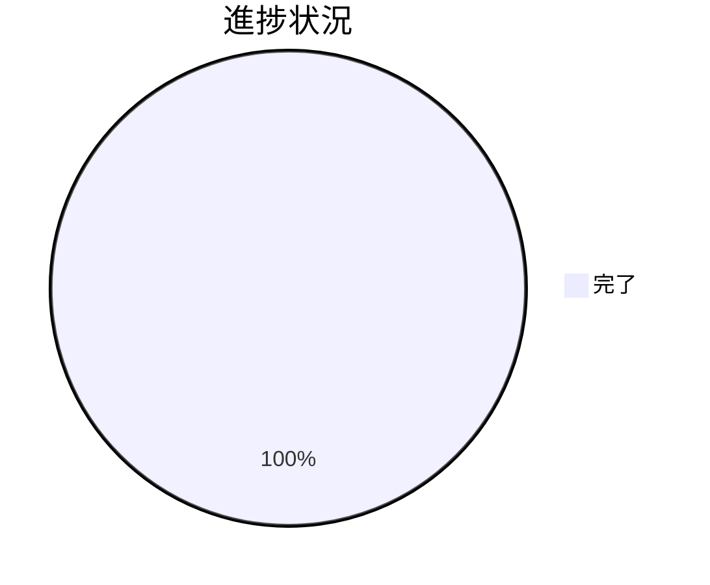

# Issue 一覧: issue 運用ポリシーの GitHub Issue 中心への全面移行（二重モード方式）

**プロジェクト名**: issue 運用ポリシーの GitHub Issue 中心への全面移行
**作成日**: 2026 年 07 月 15 日
**最終更新**: 2026 年 07 月 17 日（S-2 完了・PR #125・#126 マージ済み、全サブ issue 完了）

> **重要**: **このドキュメントは常に更新**。本ファイルは一覧・進捗・依存関係の index。各サブ issue の詳細 00〜03 は当該 issue ディレクトリの requirement-discovery/design-feature で個別に起こす（本 index 作成時点では未起票）。
>
> **用語**: [.agent-skill-chain/source/CONCEPTS.md §用語規約](../../../../../.agent-skill-chain/source/CONCEPTS.md#用語規約) を参照。
>
> **分割理由**: 実装が (a) 審査済み enforcement コード、(b) 本リポ固有の採用（.gitignore＋project override＋新設正本）、(c) 配布物 source 契約ドキュメント、という**別ドメインで独立にレビュー/テストできる 3 単位**に分かれるため（02_設計 §4・03 §2）。tmp 隔離テストを要する audit.sh を独立させ、PR を小さく保つ。

---

## Issue 一覧

| Issue 名 | 概要 | 優先度 | ステータス | 対応タスク(03) |
| -------- | ---- | ------ | ---------- | -------------- |
| S-1: audit.sh モード分岐 | `resolve_issue_tracking_mode` 新設＋#33 の github_native SKIP ガード。#34/#35/#36 は不変（回帰保証）。既定 local_tracked ゆえ単独マージ安全。 | 高 | **完了**・PR #116 マージ済み | T1 |
| S-2: 本リポ github_native 採用 | `.gitignore` 新規ドラフト非追跡＋`自己拡張ワークフロー.md` 両モード具体手順化（起票本文完全転記・全体像/フロー図の転記・close 移動を local_tracked 専用化）＋決定ログ `docs/maintainer/decisions/DECISIONS.md` 新設＋本リポ `.github/ISSUE_TEMPLATE/`（GitHub Issue Forms）実ファイル新設で手動起票の構造強制。**加えて非追跡化と直接衝突する audit.sh #28（`check_issue_doc_in_gitignored_path`）へ S-1 の #33 と同型の github_native SKIP ガードを追加**（C2 例外・#33 本体/その他チェックは不変）。スイッチ投入で完了。 | 高 | **完了**・PR #125（requirement-discovery 作り直し）・PR #126（design-feature→review-docs→implement-feature〔`ISSUE_TRACKING_MODE=github_native` スイッチ投入含む〕→verify-and-close）マージ済み・[`90_issues/20260716_174958_S-2本リポgithub_native採用/`](./90_issues/20260716_174958_S-2本リポgithub_native採用/00_要求定義.md) | T2, T3, T5, T7 |
| S-3: source 契約ドキュメント | `run_command.md`/CORE/PHASES/AGENT_CONDUCT へ `ISSUE_TRACKING_MODE`（既定 local_tracked・非GitHubフォールバック・close は local_tracked 専用・AI 自律設定禁止）の抽象原則を追記。具体は project へ委譲。加えて GitHub Issue Forms の汎用雛形（`source/enforcement/github/*.example.yml`・消費者がコピー）を新設（ADR-9）。 | 中 | **完了**・PR #121（verify-and-close合格） | T4, T6 |

**依存順（03 §1.2）**: S-1（安全な既定）→ S-3（契約）→ S-2（本リポ採用＝スイッチ投入）。

---

## 進捗状況

### 全体進捗

- **完了**: 3 / 3（S-1, S-2, S-3）
- **進行中**: 0 / 3
- **未着手**: 0 / 3

### 優先度別進捗

- **高優先度**: 2 / 2（S-1 完了, S-2 完了）
- **中優先度**: 1 / 1（S-3 完了）
- **低優先度**: 0 / 0

---

## 参考資料

**欠落に関する注記**: 本ドキュメントに対応する `00_要求定義.md`/`01_要件定義.md`/`02_設計.md`（ADR-1〜9 詳細を含む）/`03_実装計画.md` は、作成後に一度も commit されないまま作業用 worktree の削除により失われた（2026-07-15）。本 90_issues.md は会話ログからの復元。S-1・S-3 のサブ issue 側 00-04（`90_issues/` 配下）は個別に存在し影響を受けていない。S-2 は要件定義からの作り直しを実施し、`90_issues/20260716_174958_S-2本リポgithub_native採用/` 配下に 00〜03 を作成・PR #125（requirement-discovery）・PR #126（design-feature〜verify-and-close）で完了済み。

### プロジェクトドキュメント

- [`00_要求定義.md`](./00_要求定義.md) - 要求定義
- [`01_要件定義.md`](./01_要件定義.md) - 要件定義
- [`02_設計.md`](./02_設計.md) - 設計（ADR-1〜8・変更対象ファイル §4）
- [`03_実装計画.md`](./03_実装計画.md) - 実装計画（T1〜T7）

### その他の参考資料

- 本セッションのユーザー明示訂正「B 案にします」（案 B＝二重モード確定・human_decision）
