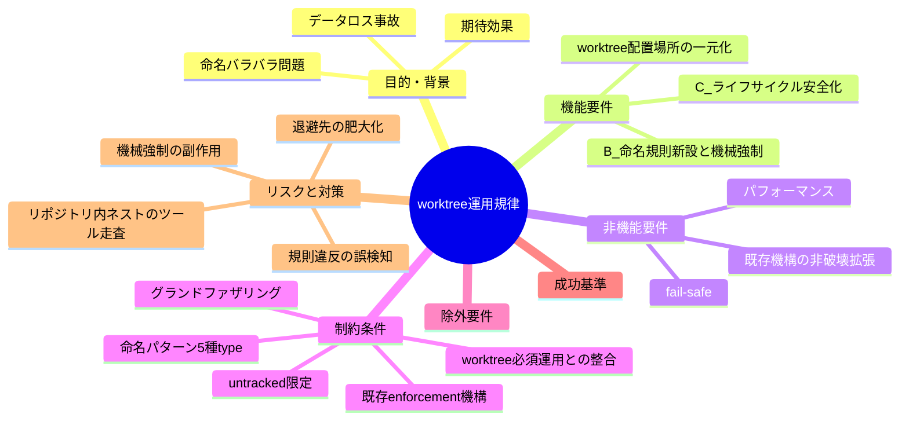
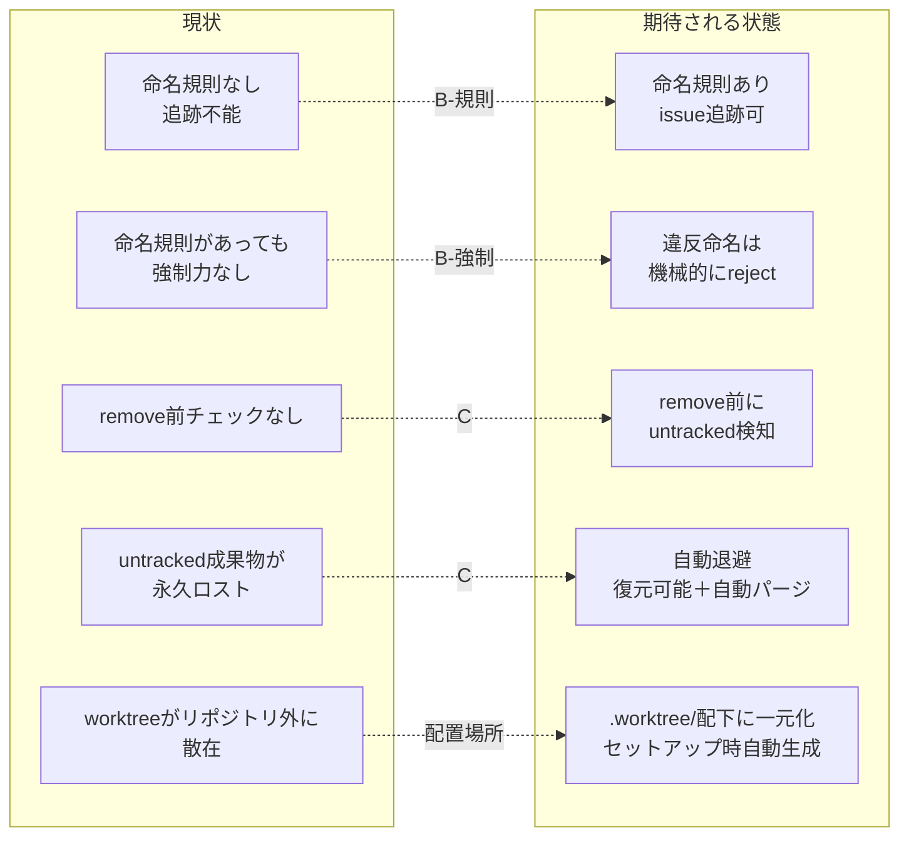

# 要求定義書: worktree 運用規律（命名規則とライフサイクル安全化）

**プロジェクト名**: worktree 運用規律（命名規則とライフサイクル安全化）
**作成日**: 2026 年 07 月 16 日
**最終更新**: 2026 年 07 月 16 日

> **重要**:
>
> - 要求定義書は、プロジェクトの全体像を把握するためのものです。詳細な技術仕様や実装方法は要件定義書以降で記載します。必要最低限の情報に収めることを心掛けてください。
> - **このドキュメントは常に更新**: 要求の変更や追加があった場合は、即座にこのドキュメントを更新してください。
> - **必須項目**: 「必須」と明記した項目は空欄・抽象語のみで提出しないこと。
>
> **用語**: [.agent-skill-chain/source/CONCEPTS.md §用語規約](../../../../../.agent-skill-chain/source/CONCEPTS.md#用語規約) を参照。

---

## 要求定義の全体像

**注意**:

- 本 issue は「B: worktree/ブランチ命名規則」と「C: worktree ライフサイクル管理」を、**一体の「worktree 運用規律（開発プロセスの安全運用）」**として扱う。両者は「worktree をどう作り、どう識別し、どう安全に消すか」という一貫した規律であり、別 issue に分割しない。
- 本 issue は issue 運用ポリシー移行（親 issue `docs/maintainer/workflow/20260715_160558_issue運用ポリシー全面移行/`）とは**別ドメイン**の新規独立トップレベル issue である。

---

## 1. 目的・背景

### 1.1 目的（必須）

worktree の命名規則と削除前退避を、いずれも機械強制で実効化する。

### 1.2 背景

- **現状の課題**:
  - **B（命名の無秩序）**: worktree ディレクトリ名・ブランチ名の命名規則が未定義で、`git branch -a` を見ても意味が読み取れない。実観測では `feature/...`・`docs/...`・`chore/...`・`fix/...`・`worktree-agent-<16桁hex>`・`worktree-agent-<英数字の場当たり名>`・日本語混在名（`feature/スリム化/20260306`）が混在している（evidence_source: observed_runtime＝本リポの `git branch -a` 実行結果, 2026-07-16 時点）。どのブランチ／worktree がどの issue に対応するか、命名から追跡できない。
  - **C（削除による永久ロスト事故）**: 2026-07-15、worktree 一覧整理のため作業用 worktree を `git worktree remove` した際、未commitのまま置かれていた親 issue「issue運用ポリシー全面移行」の `02_設計.md`（ADR-1〜9）と `03_実装計画.md` が永久に失われた。`git worktree remove --force` は untracked ファイルを一切保存せず即削除し、git 的復元手段（history／reflog／fsck）は一度も `git add` されていないため一切効かない。会話ログに全文が残っていた `90_issues.md` のみ復元できた（evidence_source: observed_runtime＝2026-07-15 の実事故。ユーザーメモリ `feedback_worktree-removal-data-loss-risk`・親 issue `90_issues.md` の経緯記録）。
- **必要性**:
  - 命名規則があれば worktree／ブランチと issue の対応が一目で追跡でき、誤った worktree の削除・取り違えのリスクが下がる（B は C の予防にも資する）。
  - 未commit成果物の消失は「唯一のコピー」を失う不可逆事故であり、人間の注意喚起（承認時の警告）だけでは再発を防げない。機械強制による退避が必要（evidence_source: observed_runtime＝上記事故で「存在は開示・承認取得」していたにもかかわらず消失した事実）。
  - **B（命名規則）も「規律（文書化されたルール）」だけでは形骸化しうる**。命名規則を正本に書くだけで終わらせず、規則に反する命名での作成を機械的に検知・是正する仕組みが無いと、C と同様に「守られない規約」として実効性を失う。本 issue は B・C 双方を**「worktree 運用規律の機械強制」という一貫したテーマ**として扱う（ユーザーからの明示フィードバック: 「規律だけにとどまらず、強制化も必要」）。
  - **命名パターンの具体案**（ユーザーの明示指定・evidence_source: human_decision）: `<type>/<YYYYMMDD_HHMMSS>/<固有名>`（**スラッシュ区切り・3階層**。2026-07-16 のユーザー再指定により、当初案のアンダースコア区切り `<type>/<YYYYMMDD_HHMMSS>_<固有名>` から変更）。続く `YYYYMMDD_HHMMSS` は本プロジェクトが既に issue フォルダ名・memo ファイル名で採用しているプレフィックス取得規約（`TZ=Asia/Tokyo date +%Y%m%d_%H%M%S` または `memo-prefix.sh`。推測・固定値禁止）と**同一の取得手段**を再利用でき、取得手段の一貫性という利点がある。最後に固有名（issue 名相当）を置く。例: `feature/20260716_143000/worktree運用規律`。
  - **`<type>` の許容集合（確定・evidence_source: external_spec）**: ユーザー指定の基準3種（`feature`/`bugfix`/`hotfix`）に加え、業界のデファクトスタンダード調査の結果、`release`/`chore` を加えた**5種**（`feature`・`bugfix`・`hotfix`・`release`・`chore`）を採用する。根拠は Conventional Branch 仕様が明示的に定義する type 集合（`feature`・`bugfix`・`hotfix`・`release`・`chore`。[conventional-branch.github.io](https://conventional-branch.github.io/)・[github.com/conventional-branch/conventional-branch](https://github.com/conventional-branch/conventional-branch)）に一致し、一般的なブランチ命名ガイド（[Pull Panda](https://pullpanda.io/blog/git-branch-naming-conventions-best-practices) 等）や git-flow モデル（[Atlassian Gitflow Workflow](https://www.atlassian.com/git/tutorials/comparing-workflows/gitflow-workflow)）でも feature/release/hotfix/chore が中核 type として共通して挙げられていることによる（詳細な調査結果・出典は 01 §2.1 ストーリー1・§2.3 BR-6 を参照）。
  - **worktree の配置場所（新規追加要件・確定）**: worktree はリポジトリルート直下の `.worktree/` 配下に作成する（現状のリポジトリ外の兄弟ディレクトリ配置から変更）。ディレクトリ階層はブランチ名パターンをそのままミラーする（例: `.worktree/feature/20260716_143000/worktree運用規律/`）。`.worktree/` の雛形は本プロジェクトのセットアップ・アップデートの仕組み（`setup.sh`／`init`／`upgrade` 相当）で自動生成する。`.worktree/` を git 追跡対象外にする方式は、ルート `.gitignore` の変更ではなく、`.worktree/.gitignore` 自身に `*` と `!.gitignore` の2行を置く**局所的な自己完結パターン**を採用する（evidence_source: human_decision＝ユーザー明示指定。詳細は 01 §2.1 新規ストーリー・§4.2 を参照）。

### 1.3 期待される効果（必須: 1 件以上）

- **効果 1（B-規則）**: 新規に作成する worktree ディレクトリ名・ブランチ名が命名規則（`<type>/<YYYYMMDD_HHMMSS>/<固有名>`、`type`=feature/bugfix/hotfix/release/chore の5種）に適合し、名前から対応 issue（または目的）を追跡できる（○/×判定: 規則を満たす名前かをレビュー／機械チェックで判定できる）。
- **効果 2（B-強制）**: 規則に反する命名での `git worktree add`（またはブランチ作成）が機械的に検知され、**既定挙動 reject**（拒否）で処理される。「規則を作っただけで守られない」状態にならない（○/×判定: 違反命名での作成操作を実際に行い、reject されるかを検証できる）。
- **効果 3（C）**: `git worktree remove` 系操作の実行前に untracked 成果物の有無が検知され、存在する場合は自動退避されてから削除される。退避により、削除後も成果物を復元できる（○/×判定: untracked ファイルがある worktree の削除で、当該ファイルが退避先に残るかを検証できる）。
- **効果 4（C）**: 退避先（トラッシュ）が無制限に肥大化せず、保持期限・容量方針に基づき自動パージされる（○/×判定: パージ方針が定義され、期限超過エントリが消えるかを検証できる）。
- **効果 5（配置場所・新規）**: worktree がリポジトリ外に散在せず、`.worktree/` 配下に一元化される。セットアップ時に `.worktree/` 雛形が自動生成され、`.worktree/.gitignore` によって個々の worktree 実体が自動的に git の追跡・`git status` の untracked 表示のいずれからも除外される（無視される）（○/×判定: セットアップ実行後に `.worktree/.gitignore` が存在し、`.worktree/` 配下に worktree を作成しても `git status` に一切現れないことを検証できる）。

**現状と期待される状態の比較**:

---

## 2. 機能要件

### 2.1 既存機能の維持（該当する場合）

- 既存の enforcement 機構（`.agent-skill-chain/source/enforcement/`：`claude/PreToolUse.sh`・`ci/audit.sh` 等）の現行チェック（失敗条件 #1〜#38 相当）を破壊しないこと。C の削除前チェックは**既存機構の拡張**として追加する（新設機構は原則作らない。要件定義段階で統合方式を検証する）。
- 既存の「実装・変更作業は必ず worktree で行う」運用（`.agent-skill-chain/project/自己拡張ワークフロー.md` §0）を維持し、本 issue はその運用を安全に回すための規律を足すものである。

### 2.2 新規機能要件

- **B: worktree／ブランチ命名規則の新設と機械強制**
  - **規則本体（確定要件）**: パターン `<type>/<YYYYMMDD_HHMMSS>/<固有名>` を採用する。`<type>` は `feature`・`bugfix`・`hotfix`・`release`・`chore` の**5種**とする（ユーザー指定の基準3種に、業界デファクトスタンダード調査に基づき release／chore を追加。evidence_source: human_decision＋external_spec。出典は §1.2・01 §2.1・§2.3 BR-6 参照）。`YYYYMMDD_HHMMSS` は本プロジェクト既存のプレフィックス取得規約（`TZ=Asia/Tokyo date +%Y%m%d_%H%M%S` 等）を再利用する。`<固有名>` は issue 名相当。例: `feature/20260716_143000/worktree運用規律`。
  - **worktree ディレクトリ名はブランチ名パターンをそのままミラーし、`.worktree/` 配下に作成する（確定）**: `.worktree/<type>/<YYYYMMDD_HHMMSS>/<固有名>/`（例: `.worktree/feature/20260716_143000/worktree運用規律/`）。ブランチ名の `/` は git ref namespace の階層区切りとして自然に機能し、worktree ディレクトリ名側も `.worktree/` を起点とした実ディレクトリ階層としてそのままミラーする方式に確定した（以前 02_設計 への残課題としていた「フラット化すべきか」は、`.worktree/` 配下に一元化する本要件により解消済み）。
  - 命名から「対応 issue（または目的）」が追跡可能であること。
  - **既存の無秩序な名前を遡及的に一括改名することは求めない（グランドファザリング・確定）**: 新命名規則は本 issue 完了時点以降に新規作成される worktree／ブランチにのみ適用する。それ以前に作成された既存のブランチ・worktree（`worktree-agent-*` 等）への遡及的リネーム・強制は要件としない。
  - **機械強制（新規追加要件・既定挙動確定）**: 規則に反する命名での `git worktree add`（またはブランチ作成）を検知した場合、**既定挙動は reject（拒否）**とする（確定・ユーザー指定）。対象外環境（非 git ツリー等）では fail-safe に倒す。**検知対象コマンドの範囲は Tier1（hook即時reject）／Tier2（audit事後検知）／Tier3（明示的allowlist除外）の三層構成に確定済み**（発見の経緯・fable相談＋ユーザー承認は下記参照。詳細は 01 §2.1 ストーリー9・BR-13〜BR-16）。実装の具体的なコマンドパターン・正規表現は 02_設計 に委ねる。
- **B': worktree の配置場所の一元化（新規追加要件・確定）**
  - worktree はリポジトリルート直下の `.worktree/` 配下に作成する（本 issue 自身を含む現状のリポジトリ外の兄弟ディレクトリ配置＝`../worktree-agent-*` から変更）。
  - `.worktree/` の雛形は、本プロジェクトのセットアップ・アップデートの仕組み（`.agent-skill-chain/source/scripts/setup.sh`／`init`／`upgrade` 相当）で**自動生成**する。ユーザーやエージェントが初回 worktree 作成時に都度 `mkdir` する運用ではない。
  - `.worktree/` を git 追跡対象外にする方式は、**ルート `.gitignore` の変更ではなく**、`.worktree/.gitignore`（`.worktree/` 直下）自身に **`*` と `!.gitignore` の2行構成**を置く方式とする（evidence_source: human_decision）。この方式により、「空ディレクトリは git 管理できない」という git の制約を `.gitignore` 自身の追跡で回避しつつ、`.worktree/` 配下の worktree 実体は自動的に追跡対象外になる。ルート `.gitignore` 側の変更は不要。
  - 本 issue 自身が現在使用している worktree（`/home/adachi/projects/worktree-agent-worktree-discipline`、ブランチ `feature/worktree-operation-discipline`）は上記グランドファザリングの対象（本 issue 完了前の既存作成物）であり、移動は不要。
  - **`.worktree/` 配下のツール走査除外（新規追加要件・確定方針）**: `.claude/settings.json` の deny 設定（例 `Read/Grep/Glob(docs/maintainer/workflow/close/**)`）に `.worktree/**` をミラー追加する（**必須**。ネスト経由アクセスによる deny バイパスを防ぐ）。加えて `enforcement/ci/audit.sh` に `.worktree` の find prune 規約を明記し、prune 漏れを検知する新規失敗条件（暫定 #39）を追加候補とする（**推奨**。実装詳細は 02_設計）。**発見の経緯**: ユーザー指定により fable（アドバイザー限定・意思決定や編集はさせていない）に相談し、実リポジトリファイル（`.claude/hooks/PreToolUse.sh`・`enforcement/ci/audit.sh`・`.claude/settings.json`）を確認した技術助言を得て、ユーザーが確認・承認した（evidence_source: existing_code＋human_decision。詳細は 01 §2.1 ストーリー8・BR-10〜BR-12）。
- **C: worktree ライフサイクル安全化**
  - `git worktree remove` 系の実行前に、対象 worktree の untracked ファイルの有無を検知する。
  - untracked ファイルが存在する場合、削除前に退避（例: `.claude/.worktree-trash/` 等）してから削除する機械強制を、既存の PreToolUse hook 機構の拡張として実現する。
  - 対象は **untracked 限定**（git 追跡済みファイルは worktree 削除で消えないため対象外）。
  - **検知対象に `git clean -x`/`-X`（または対象パスが `.worktree` を含む場合）も含める（新規追加・確定方針）**: `git clean -x` は gitignore 対象ファイルも削除するため、本 issue 起点の事故（untracked 永久ロスト）と同型の新リスクになりうる（fable相談＋ユーザー承認による発見。詳細は 01 §2.1 ストーリー8 P2・BR-12）。
  - 退避先の**自動パージ**（保持期限・容量等の方針）を定義する。

---

## 3. 非機能要件

### 3.1 パフォーマンス

- 削除前チェック（untracked 検知・退避）は worktree 削除操作に対して実用的な時間内に完了すること。大量ファイルを含む worktree でも操作を著しく遅延させない（具体閾値は設計フェーズで検討）。

### 3.2 セキュリティ

- 退避処理・命名チェックはコード注入ベクタを作らないこと（既存 PreToolUse hook の設計原則＝「拡張ファイルは source せずデータとして read」「fail-closed／fail-safe を保全」に整合させる。evidence_source: existing_code＝`.agent-skill-chain/source/enforcement/claude/PreToolUse.sh` の設計コメント）。

### 3.3 互換性

- 消費者ランタイム（本パッケージ利用者）と自己拡張（本リポ）双方で成立すること。コア抽象／project 具体の配置境界（既存の設計原則）に従い、汎用原則はコア、具体パス・具体値は project 側に置く。
- GitHub 非採用環境・非 git ツリー環境ではゲートが誤作動せず自然に無害化（SKIP）されること。

### 3.4 保守性

- 1 ファイル 1 責務・UNIX 哲学（`.agent-skill-chain/source/spec/01_設計原則.md`）に従い、既存機構への最小の追加として実装できる形にすること。

---

## 4. 制約条件

### 4.1 技術的制約

- C の機械強制は**既存の enforcement hook 機構の拡張**として検討する（新設ではなく既存拡張が自然か、要件定義段階で確認する）。既存機構には PreToolUse hook（`tool_input.command` を検査し `git ...` 等の Bash コマンドを判定可能。evidence_source: existing_code＝`PreToolUse.sh` は stdin JSON から `tool_input.command` を抽出する）と CI audit（`audit.sh`、失敗条件は現状 #38 まで存在。evidence_source: existing_code＝`enforcement/README.md` の失敗条件番号）がある。
- `git worktree remove --force` は untracked を無条件消去し reflog 等での復元は不可（evidence_source: observed_runtime＝2026-07-15 事故）。よって「削除後の復元」ではなく「削除前の退避」で対処する必要がある。
- **B の機械強制も同一の PreToolUse hook 機構の拡張として実現できる見込み**（evidence_source: existing_code）。PreToolUse hook は `tool_input.command` を検査できるため、`git worktree add -b <name>` や `git branch <name>` / `git checkout -b <name>` に相当するコマンドの引数からブランチ名／worktree ディレクトリ名を抽出し、命名パターン（5種の `<type>`）との正規表現照合が可能と見込まれる。既定挙動は reject に確定済み。**検知対象コマンドの範囲は Tier1（hook）／Tier2（audit）／Tier3（allowlist除外）の三層構成に確定済み**（fable相談＋ユーザー承認。01 §2.1 ストーリー9）。トークナイザ方式（`command`/`env`/パス付きgit・`-C`/`-c`/`--git-dir=`等のグローバルオプションをスキップしてからサブコマンド判定）を推奨する。具体的な正規表現・実装コードのみ 02_設計 に委ねる。
- **`.worktree/` のリポジトリ内ネストに伴うツール走査への影響（確定方針）**: `git worktree add` はパスを自由に指定できるため、リポジトリ内に別のリポジトリの作業ツリーをネストすること自体は技術的に可能である。`.worktree/.gitignore` による git 追跡除外だけでは、リンター・grep・エディタの全体検索・CI 設定等、`.gitignore` を参照しないツールを防げない。ユーザー指定により fable に相談し実ファイル確認に基づく助言を得た結果、**`.claude/settings.json` の deny 設定への `.worktree/**` ミラー追加が必須**（既存 deny のバイパス防止という新たに発見されたセキュリティ論点）、**`audit.sh` の find prune 規約明記・新規失敗条件（暫定#39）追加が推奨**、と確定した（evidence_source: existing_code＋human_decision。01 §2.1 ストーリー8）。VSCode 等の `watcherExclude`/`search.exclude` は性能問題であり必須要件にはしない。CI の `paths-ignore` は checkout に `.worktree/` が含まれないため構造的に不要と判断。

### 4.2 既存システムとの互換性

- 命名規則は既存の worktree 必須運用（親ワークフロー §0）と整合させる。命名規則の記載先は `.agent-skill-chain/project/` の上書き優先原則に従う。

### 4.3 移行期間・スケジュール

- **適用タイミング（確定・グランドファザリング）**: B の命名規則・機械強制・`.worktree/` 配置は、**本 issue（worktree 運用規律）完了時点以降に新規作成される worktree／ブランチにのみ適用**する。それ以前に作成された既存のブランチ・worktree（`worktree-agent-*` 等）への遡及的リネーム・強制・移動は要件としない。
- 本 issue 自身の作業ブランチ名は暫定的に既存 `feature/...` パターンを踏襲した `feature/worktree-operation-discipline` を用いる。本 issue の成果物（B＝命名規則）を自身のブランチ名へ遡及適用する必要はない（過度な自己言及は不要）。本 issue 自身の worktree（`../worktree-agent-worktree-discipline`）も上記グランドファザリングの対象であり、`.worktree/` 配下への移動は不要。

---

## 5. 除外要件

- 既存ブランチ／worktree の遡及的な一括改名。
- issue 運用ポリシー移行（親 issue）そのものの作業（別ドメイン・別 issue）。
- 本 issue は requirement-discovery（00/01 作成）のみで完了とし、design-feature（02_設計）以降には本フェーズでは進めない。
- worktree 以外の一般的な git データロス（誤 `git reset --hard`・誤 `rm -rf` 等）全般への対策（本 issue は `git worktree remove` 経路に限定する）。
- 本 issue 完了以前に作成された既存の worktree・ブランチの `.worktree/` 配下への移動・リネーム（グランドファザリング対象・§4.3）。
- ルート `.gitignore` の変更（`.worktree/` の追跡除外は `.worktree/.gitignore` 自身で完結させるため、ルート `.gitignore` への追加は不要・確定）。

---

## 6. 成功基準（必須: 1 件以上）

**「規律の文書化」のみを成功基準にせず、B・C いずれも「機械的な検証・強制」を成功基準に含める**（ユーザーフィードバック反映）。

- **SC-1（B-規則）**: worktree ディレクトリ名・ブランチ名の命名規則（パターン `<type>/<YYYYMMDD_HHMMSS>/<固有名>`、`type`=feature/bugfix/hotfix/release/chore の5種・evidence_source: human_decision＋external_spec）が正本に文書化され、命名から対応 issue（または目的）を追跡できる（レビューで○/×判定可能）。
- **SC-2（B-強制・確定）**: 規則に反する命名での worktree／ブランチ作成が**機械的に検知**され、**既定挙動 reject（拒否）**で処理される。対象外環境では fail-safe に倒れる（検証シナリオで○/×判定可能）。
- **SC-3（C・中核）**: untracked 成果物を含む worktree に対する `git worktree remove` 系操作の実行前に、当該 untracked ファイルが退避先へ保存され、削除後も復元可能である（検証シナリオで○/×判定可能）。
- **SC-4（C）**: git 追跡済みファイルのみの worktree 削除は退避対象とせず、従来どおり削除できる（untracked 限定であることの確認・○/×判定可能）。
- **SC-5（C）**: 退避先の自動パージ方針（保持期限・容量等）が定義され、期限超過エントリが除去される（○/×判定可能）。
- **SC-6（互換）**: 非 git ツリー環境・GitHub 非採用環境等でゲートが誤作動せず自然に SKIP される（○/×判定可能）。
- **SC-7（非破壊）**: 既存 enforcement チェック（#1〜#38 相当）を破壊しない（既存テスト・audit がグリーンのまま・○/×判定可能）。
- **SC-8（配置場所・新規）**: セットアップ・アップデート実行時に `.worktree/` 雛形（`.worktree/.gitignore` を含む）が自動生成され、以後 `.worktree/` 配下に作成された worktree 実体がルート `.gitignore` の変更なしに git 追跡・`git status` 表示の対象外になる（○/×判定可能）。
- **SC-9（配置場所・ツール走査除外・新規）**: `.claude/settings.json` の deny 設定に `.worktree/**` がミラー追加され、`.worktree/` 配下にネストされた worktree 内の同一ファイルへの別経路アクセスによる deny バイパスが防がれる（○/×判定可能。fable相談＋ユーザー承認による確定方針）。
- **SC-10（機械強制の検知範囲・新規）**: B の機械強制が Tier1（PreToolUse hookで即時reject）／Tier2（CI auditで事後検知）／Tier3（明示的allowlistで除外）の三層構成で網羅的に定義され、各層の対象コマンドが01に明記されている（○/×判定可能。fable相談＋ユーザー承認による確定方針）。

**B・C・配置場所の位置づけの一貫性**: SC-2（B-強制）と SC-3（C・untracked 退避の機械強制）は、いずれも「worktree の作成・削除という操作の入口で機械的にルールを効かせる」という同一テーマ（worktree 運用規律の機械強制）の表裏である。B は**作成時**の命名規律を、C は**削除時**の成果物保全規律を、同じ PreToolUse hook 拡張という実現手段で強制する（§4.1 参照）。SC-8・SC-9（配置場所）はこれらを補完し、命名パターンが正しく機能する前提となる**置き場所と、その置き場所を安全に扱うための走査除外**を確定する。SC-10 は SC-2 の検知範囲を Tier 構成として具体化したものである。

---

## 7. リスクと対策

### 7.1 技術的リスク

- **リスク**: C の削除前退避が過剰に働き、意図的に破棄したいゴミ untracked まで退避して退避先が肥大化する。
  - **対策**: 退避先の自動パージ（保持期限・容量）を SC-5 で必須化する。退避は「消えると困る成果物」を守るのが目的だが、機械的には untracked 全体を退避し、パージで肥大を抑える方針とする（詳細は設計フェーズ）。
- **リスク**: PreToolUse hook が `git worktree remove` を誤検知・過剰ブロックし、正常な削除まで妨げる。
  - **対策**: 既存 PreToolUse の fail-safe 原則（内部エラーは allow に倒す）に整合させ、判定不能時は保守的に倒す。誤 FAIL を避ける設計を要件に含める（設計フェーズで検証）。
- **リスク**: hook が退避を行う前に `--force` 等で削除が先行してしまう経路（hook を経由しない削除手段）。
  - **対策**: 検知経路（PreToolUse＝Bash コマンド前置検査）で捕捉可能な範囲を要件で明確化し、捕捉不能経路は残余リスクとして 01 に明記する（機械強制の限界を隠さない。evidence_source: existing_code＝PreToolUse は Bash `command` を検査するため hook 非経由の削除は捕捉外）。
- **リスク（B-強制・決定済み）**: 命名規則を既定 reject で機械強制すると、正当な理由がある例外的な命名（例: `feature`/`bugfix`/`hotfix`/`release`/`chore` の5種に収まらない type）まで誤って拒否し、作業がブロックされる可能性がある。
  - **対策（確定）**: `<type>` の許容集合を、業界デファクトスタンダード調査に基づき `feature`/`bugfix`/`hotfix`/`release`/`chore` の5種に確定した（evidence_source: external_spec。§1.2・§2.2 参照）。この5種以外は意図的な例外として reject 対象のままとし、追加が必要になった場合は本規則自体の改訂として扱う（自動的な type 追加は行わない）。判定不能・対象外環境では fail-safe（allow）に倒す原則（BR-4 相当）は維持し、過剰ブロックを避ける。
- **リスク（配置場所・決定済み）**: worktree ディレクトリ名とブランチ名を同一パターンにする場合、既存の `worktree-agent-*` 等の慣用命名と衝突し、移行期に混乱を招く可能性がある。
  - **対策（確定）**: 新規作成分（本 issue 完了時点以降）から適用するグランドファザリング（§4.3）を採用し、既存の遡及一括改名・移動は要件としない。新旧命名は移行期間中並存するが、新規作成分は必ず `.worktree/` 配下・新パターンに従う。
- **リスク（配置場所・決定済み・fable相談で発見）**: `.worktree/` 配下にリポジトリ内ネストの形で worktree 実体を置くと、`.worktree/.gitignore` による git 追跡除外だけでは、`.gitignore` を参照しない、または `.worktree/` 配下を横断的に走査しうる既存ツール（リンター・grep・エディタの全体検索・CI 設定・本リポジトリの `.claude/settings.json` のような deny/allowlist 設定等）が誤って大量ファイルを走査し、パフォーマンス低下や意図しない結果混入を招く可能性がある。特に `.claude/settings.json` の既存 deny 設定は、`.worktree/` 配下のネスト経由アクセスでバイパスされうるというセキュリティ上の論点であることが判明した。
  - **対策（確定）**: ユーザー指定により fable（アドバイザー限定・意思決定や編集はさせていない）に相談し、実リポジトリファイル（`.claude/hooks/PreToolUse.sh`・`enforcement/ci/audit.sh`・`.claude/settings.json`）を確認した技術助言を得て、ユーザーが確認・承認した（evidence_source: existing_code＋human_decision）。**`.claude/settings.json` の deny 設定への `.worktree/**` ミラー追加を必須**とし（SC-9）、**`audit.sh` の find prune 規約明記・新規失敗条件（暫定#39）追加を推奨**とする（実装詳細は 02_設計）。VSCode 等の走査除外設定は性能問題であり必須要件にはしない。CI の `paths-ignore` は構造的に不要と判断。
- **リスク（機械強制の検知範囲・決定済み・fable相談で発見）**: B の機械強制を単一コマンド（`git worktree add`）のみで検知しようとすると、`-b` オプション省略時の暗黙ブランチ名、`git branch -m` によるリネーム、`git fetch`/`git switch` の DWIM 等、複数の迂回経路が残り、規則が容易に空洞化しうる。
  - **対策（確定）**: 同じく fable相談＋実装確認により、Tier1（PreToolUse hookで即時reject）／Tier2（CI auditで事後検知・新規失敗条件暫定#40）／Tier3（明示的allowlistで除外）の三層構成に確定した（SC-10）。誤検知バランスは「作成形と確定できたらfail-closed、曖昧ならfail-open」を原則とし、reject時は期待パターン・修正例を含むメッセージを返す。実装の具体的な正規表現・コードは 02_設計 に委ねる。

### 7.2 スケジュールリスク

- **リスク**: B（命名規則）と C（hook 拡張）を 1 issue に束ねることで実装計画が肥大化する。
  - **対策**: 一体の規律として要件は統合しつつ、実装計画（03、後続フェーズ）でタスクを B／C に分解する。本 issue は 00/01 のみで完了とし、実装は別途進める。

---

## 8. 参考資料

### プロジェクトドキュメント

- 親 issue（事故の発生元コンテキスト）: `docs/maintainer/workflow/20260715_160558_issue運用ポリシー全面移行/90_issues.md`
- worktree 必須運用の正本: [.agent-skill-chain/project/自己拡張ワークフロー.md](../../../../../.agent-skill-chain/project/自己拡張ワークフロー.md) §0
- 既存 enforcement 機構: [.agent-skill-chain/source/enforcement/README.md](../../../../../.agent-skill-chain/source/enforcement/README.md)・`enforcement/claude/PreToolUse.sh`・`enforcement/ci/audit.sh`

### その他の参考資料

- ユーザーメモリ `feedback_worktree-removal-data-loss-risk`（2026-07-15 データロス事故の教訓）
- 本 issue の起票を委譲したオーケストレータからの委譲メッセージ（B・C を一体の設計課題＝worktree 運用規律として先行着手する決定）
- ユーザーからの追加フィードバック（2026-07-16・1回目、evidence_source: human_decision）: 「規律だけにとどまらず、強制化も必要」「命名規則は feature / bugfix / hotfix を基準とし、次に `YYYYMMDD_HHMMSS/` を置き、その後に固有名」。命名パターン（§2.2 B）と機械強制（§6 SC-2）の直接の根拠。
- ユーザーからの追加フィードバック（2026-07-16・2回目、evidence_source: human_decision）: 命名パターンの区切り文字をアンダースコア（`<type>/<YYYYMMDD_HHMMSS>_<固有名>`）からスラッシュ・3階層（`<type>/<YYYYMMDD_HHMMSS>/<固有名>`）へ変更する指定。§1.2・§2.2 B のパターン表記の直接の根拠。
- ユーザーからの追加フィードバック（2026-07-16・3回目、evidence_source: human_decision）: 残課題3点への回答（`<type>` はデファクトスタンダード調査に基づき確定／既定挙動は reject 確定／新規則は本 issue 完了後から適用しグランドファザリング）と、worktree 配置場所（`.worktree/` 配下）の新規要件指定。§2.2 B・B'・§4.3・§6 SC-2/SC-8・§7 の直接の根拠。
- ユーザーからの追加フィードバック（2026-07-16・4回目、evidence_source: human_decision）: `.worktree/` の実現方式の追加指定（セットアップ時自動生成・ルート `.gitignore` ではなく `.worktree/.gitignore` 自身に `*`/`!.gitignore` の2行を置く方式）。§2.2 B'・§6 SC-8 の直接の根拠。
- 外部一次情報（evidence_source: external_spec。`<type>` 許容集合5種の根拠）: [Conventional Branch specification](https://conventional-branch.github.io/)（[GitHub リポジトリ](https://github.com/conventional-branch/conventional-branch)）、[Atlassian Gitflow Workflow](https://www.atlassian.com/git/tutorials/comparing-workflows/gitflow-workflow)、[Pull Panda: Git Branch Naming Conventions and Examples](https://pullpanda.io/blog/git-branch-naming-conventions-best-practices)。
- ユーザーからの追加フィードバック（2026-07-16・5回目、evidence_source: human_decision）: 02_設計への残課題2件（`.worktree/`配下のツール走査除外設定・B機械強制の検知対象コマンド網羅性）について、fable相談を経た技術助言の承認。§2.2 B・B'・§6 SC-9/SC-10・§7 の直接の根拠。
- fable への相談（アドバイザー限定運用・evidence_source: existing_code＋human_decision）: ユーザー指定により、上記2件について fable に相談し、実リポジトリファイル（`.claude/hooks/PreToolUse.sh`・`enforcement/ci/audit.sh`・`.claude/settings.json`）を確認した技術助言を得た。fable は助言のみを行い、意思決定・ファイル編集は一切行っていない（意思決定はユーザー承認、編集は本サブエージェントが実施）。詳細は 01 §2.1 ストーリー8・9・§6 参考資料を参照。

---

## 9. 次のステップ

この要求定義書の承認後、以下のドキュメントを作成します：

- **次**: [`01_要件定義.md`](./01_要件定義.md) - 要件定義フェーズ
