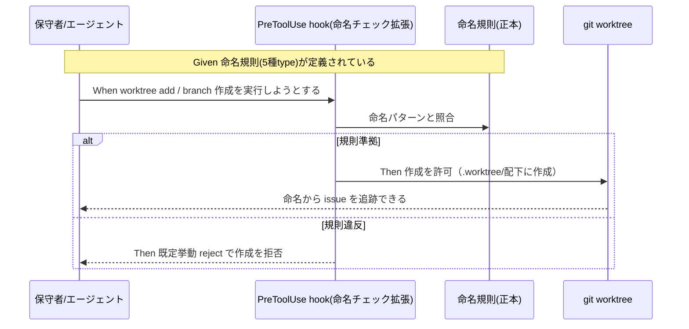
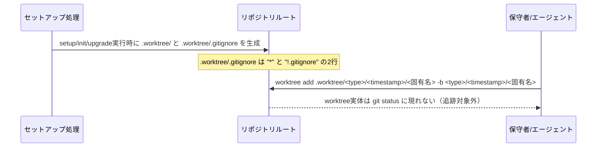
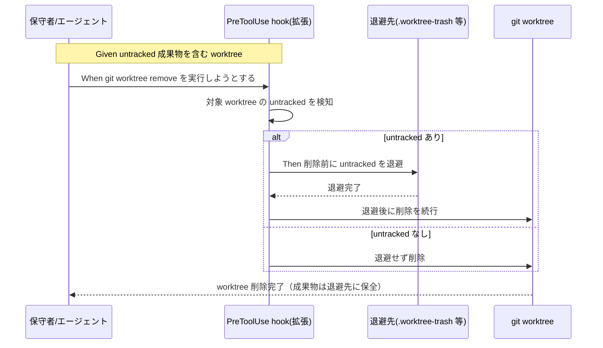

# 要件定義書: worktree 運用規律（命名規則とライフサイクル安全化）

**プロジェクト名**: worktree 運用規律（命名規則とライフサイクル安全化）
**作成日**: 2026 年 07 月 16 日
**最終更新**: 2026 年 07 月 16 日

> **重要**: **このドキュメントは常に更新**: 要件の変更や追加があった場合は、即座にこのドキュメントを更新してください。
>
> **用語**: [.agent-skill-chain/source/CONCEPTS.md §用語規約](../../../../../.agent-skill-chain/source/CONCEPTS.md#用語規約) を参照。

---

## 1. 概要

### 1.1 システム概要

本 issue は、git worktree の**運用規律**を、①命名（B）②削除ライフサイクルの安全化（C）③配置場所の一元化（B'）の三面から一体で定める。**B・C いずれも「文書化されたルール」だけでなく「機械強制」を確定要件とする**（ユーザーフィードバック反映）。B は worktree ディレクトリ名・ブランチ名の命名規則（パターン `<type>/<YYYYMMDD_HHMMSS>/<固有名>`、`type`=feature/bugfix/hotfix/release/chore の5種、evidence_source: human_decision＋external_spec）を新設し、issue との対応追跡性を確保するとともに、規則違反の作成操作を**既定挙動 reject（拒否）**で機械的に検知する。B' は worktree の配置場所をリポジトリルート直下の `.worktree/` 配下に一元化し、セットアップ時の自動生成と `.worktree/.gitignore` による追跡除外を確定要件とする。C は `git worktree remove` 実行前に untracked 成果物を検知・退避し、2026-07-15 に発生した「未commit成果物の永久ロスト事故」の再発を機械強制で防ぐ。B・C の機械強制はいずれも既存 enforcement 機構（PreToolUse hook・CI audit）の**拡張**として実現し、新設機構は原則作らない。新命名規則・`.worktree/` 配置は**本 issue 完了時点以降に新規作成されるものにのみ適用**し、既存のブランチ・worktree への遡及適用は要件としない（グランドファザリング・確定）。

本 issue は requirement-discovery（00/01）のみで完了とし、設計（02）以降は本フェーズで行わない。

### 1.2 用語集

| 用語 | 説明 |
| -------- | ------ |
| worktree | `git worktree` で main から切り出した独立作業ツリー。本リポではブランチを切って隔離作業する運用（親 §0）。 |
| untracked ファイル | 一度も `git add` されていないファイル。`git worktree remove --force` で無条件消去され、reflog 等で復元不能。 |
| 退避（トラッシュ） | 削除前に untracked 成果物を保全用ディレクトリ（例 `.claude/.worktree-trash/`）へ移す動作。 |
| 削除前チェック | `git worktree remove` 系操作の実行**前**に untracked を検知し退避判断する処理。 |
| PreToolUse hook | ツール実行前に stdin JSON の `tool_input.command` 等を検査し違反を block（exit 2）／許可（exit 0）する既存機構。 |
| 命名規則（B） | worktree ディレクトリ名・ブランチ名が満たすべき規則。パターン `<type>/<YYYYMMDD_HHMMSS>/<固有名>`（`type`=feature/bugfix/hotfix/release/chore）。命名から対応 issue（または目的）を追跡可能にする。 |
| type | 命名パターン先頭の分類語。`feature`（機能追加）／`bugfix`（不具合修正）／`hotfix`（緊急修正）／`release`（リリース準備）／`chore`（雑務・非機能変更）の **5 種**（evidence_source: human_decision＋external_spec。詳細は §2.1 ストーリー1・§2.3 BR-6）。 |
| 機械強制 | 規律を文書化するだけでなく、違反操作を機械的に検知し既定挙動で処理すること。B（命名規則違反の検知・既定 reject）・C（untracked 退避）の両方に適用する統一テーマ。 |
| `.worktree/` | リポジトリルート直下に置く worktree の一元的な配置先。ブランチ名パターンをそのままミラーする実ディレクトリ階層（例 `.worktree/feature/20260716_143000/worktree運用規律/`）を持つ。セットアップ時に雛形（`.worktree/.gitignore` 含む）を自動生成する。 |
| `.worktree/.gitignore` | `.worktree/` 直下に置く、`*` と `!.gitignore` の2行構成のファイル。`.worktree/` 配下の worktree 実体を git 追跡・`git status` 表示から除外しつつ、`.gitignore` 自身は追跡してディレクトリの存在を保つ。ルート `.gitignore` の変更は不要にする局所的な方式。 |
| Tier1／Tier2／Tier3 | B の機械強制が検知対象コマンドを分類する三層。Tier1＝PreToolUse hook で即時 reject、Tier2＝CI audit（`audit.sh`）で事後検知、Tier3＝明示的 allowlist で規則対象外とする（§2.1 ストーリー9）。 |
| prune（find の枝刈り） | `find` 走査時に特定パス（本 issue では `.worktree`）を探索対象から除外すること。`.worktree/` 配下の大量ファイルをリンター・grep・CI 等の走査対象から除く際の対策の一つ（§2.1 ストーリー8 P2）。 |
| fable | アドバイザー限定で技術助言のみを行うロール。意思決定・ファイル編集は行わない（本 issue では実リポジトリファイル確認に基づく助言を受け、ユーザーが承認した上で本サブエージェントが編集を実施）。 |

---

## 2. 機能要件

### 2.1 ユーザーストーリー

#### ストーリー 1: 命名から issue を追跡できる（B-規則）

- **As a** 複数 worktree を並行運用する保守者／エージェント
- **I want to** worktree ディレクトリ名・ブランチ名を命名規則に沿って付けたい
- **So that** どの worktree／ブランチがどの issue（または目的）に対応するか、名前から一目で追跡でき、取り違えを防げる

**受け入れ基準**:

- 命名規則が正本（`.agent-skill-chain/project/` 優先）に文書化されている（00 SC-1 に対応）。
- 規則は**パターン `<type>/<YYYYMMDD_HHMMSS>/<固有名>`** を採用する。`YYYYMMDD_HHMMSS` は既存のプレフィックス取得規約（`TZ=Asia/Tokyo date +%Y%m%d_%H%M%S` 等）を再利用する。例: `feature/20260716_143000/worktree運用規律`。
- **`<type>` の許容集合は `feature`・`bugfix`・`hotfix`・`release`・`chore` の5種に確定する（evidence_source: external_spec）**。ユーザー指定の基準3種（feature/bugfix/hotfix）に、業界のデファクトスタンダード調査に基づき release・chore を追加した。根拠出典:
  - [Conventional Branch specification](https://conventional-branch.github.io/)（[GitHub リポジトリ](https://github.com/conventional-branch/conventional-branch)）: Conventional Commits の思想をブランチ命名に拡張した専用仕様であり、`feature`(`feat`)・`bugfix`(`fix`)・`hotfix`・`release`・`chore` の5種を明示的に定義している（本要件の5種と完全一致）。
  - [Atlassian Gitflow Workflow](https://www.atlassian.com/git/tutorials/comparing-workflows/gitflow-workflow): 伝統的な git-flow モデルは `feature`／`release`／`hotfix`／`support` を定義（`release` を含む点で一致）。
  - [Pull Panda: Git Branch Naming Conventions and Examples](https://pullpanda.io/blog/git-branch-naming-conventions-best-practices) 等の一般的なブランチ命名ガイドの集約でも `feature`／`bugfix`／`hotfix`／`chore` は共通して挙げられる中核 type である。
  - 単一の「正解」は無く複数の慣習が並立するため、上記のうち最も広く参照される専用仕様（Conventional Branch）の集合を採用し、ユーザー指定の3種を包含しつつ拡張する形とした。
- **worktree ディレクトリ名はブランチ名パターンをそのままミラーし `.worktree/` 配下に作成する（確定）**: `.worktree/<type>/<YYYYMMDD_HHMMSS>/<固有名>/`（例: `.worktree/feature/20260716_143000/worktree運用規律/`）。ブランチ名（git ref namespace の階層区切り）とディレクトリ名（実ファイルシステム階層）で「/」の意味は異なるが、`.worktree/` 配下に一元化する方式を採用することで、フラット化するか階層化するかという以前の残課題は「`.worktree/` 配下に階層化して置く」で解消済み（詳細はストーリー 7・シナリオ 3.5 を参照）。
- 既存の無秩序な名前の遡及一括改名は要求しない（本 issue 完了時点以降に新規作成される worktree／ブランチにのみ適用。グランドファザリング・確定）。

#### ストーリー 2: 規則違反の命名が機械的に検知される（B-強制・新規）

- **As a** worktree／ブランチを作成する保守者／エージェント
- **I want to** 命名規則に反する `git worktree add`（またはブランチ作成）を行おうとしたときに機械的に検知してほしい
- **So that** 命名規則が「文書化されただけの申し合わせ」で終わらず、実際に守られる規律として機能する

**受け入れ基準**:

- 規則（`<type>/<YYYYMMDD_HHMMSS>/<固有名>`、`type`=feature/bugfix/hotfix/release/chore の5種）に反する命名での worktree／ブランチ作成が検知される（00 SC-2）。
- **検知時の既定挙動は reject（拒否）で確定する**（ユーザー指定）。命名規則違反の作成操作は既定でブロックされる。
- 対象外環境（非 git ツリー等）では fail-safe に倒れ、正常な作成操作を妨げない。
- この機械強制は既存 enforcement hook 機構（PreToolUse）の拡張として実現する（新設機構を原則作らない。00 §4.1 参照）。検知対象コマンドの網羅性の具体化のみ 02_設計 に委ねる。

#### ストーリー 3: 未commit成果物が削除で消えない（C・中核）

- **As a** worktree を整理・削除する保守者／エージェント
- **I want to** `git worktree remove` の前に untracked 成果物が自動退避されてほしい
- **So that** 「唯一のコピー」だった未commitの 00〜04 等が永久ロストせず、削除後も復元できる

**受け入れ基準**:

- `git worktree remove` 系操作の実行前に、対象 worktree の untracked ファイルの有無を検知する（00 SC-3）。
- untracked が存在する場合、削除前に退避先へ保存してから削除する（または退避が完了するまで削除を止める）。退避後は復元可能である。
- 退避対象は untracked 限定（追跡済みファイルは対象外・00 SC-4）。
- この機械強制は既存 enforcement hook 機構の拡張として実現する（新設機構を原則作らない）。

#### ストーリー 4: 追跡済みのみの worktree は従来どおり消せる（C）

- **As a** worktree を削除する保守者／エージェント
- **I want to** untracked が無い（＝失うものが無い）worktree は退避なしで従来どおり削除したい
- **So that** 過剰な退避で操作が煩雑化・退避先が汚染されない

**受け入れ基準**:

- untracked ファイルが無い worktree の削除は退避を行わず通常どおり完了する（00 SC-4）。

#### ストーリー 5: 退避先が肥大化しない（C）

- **As a** 本リポの保守者
- **I want to** 退避先（トラッシュ）を自動パージしたい
- **So that** 退避先が無制限に肥大化してディスク・リポジトリを圧迫しない

**受け入れ基準**:

- 退避先の自動パージ方針（保持期限・容量等）が定義されている（00 SC-5）。
- 期限・容量を超過した退避エントリが除去される。

#### ストーリー 6: 対象外環境で誤作動しない（互換・非破壊）

- **As a** 本パッケージの消費者／CI
- **I want to** 非 git ツリー環境・GitHub 非採用環境等でゲートが誤作動しないでほしい
- **So that** 既存フローがロックアウト・誤 FAIL しない

**受け入れ基準**:

- 非 git ツリー・対象外環境ではゲートが自然に SKIP される（00 SC-6）。
- 既存 enforcement チェック（#1〜#38 相当）を破壊しない（00 SC-7）。
- hook 内部エラー時は fail-safe（allow 側）に倒し、正常な削除・作成操作を妨げない（evidence_source: existing_code＝`PreToolUse.sh` の `set +e`・「内部エラーは allow に倒す」原則）。

#### ストーリー 7: worktree が `.worktree/` 配下に一元化される（配置場所・新規）

- **As a** 複数 worktree を並行運用する保守者／エージェント
- **I want to** worktree をリポジトリルート直下の `.worktree/` 配下にまとめて作成したい
- **So that** worktree がリポジトリ外に散在せず、一元的に把握・管理できる

**受け入れ基準**:

- worktree はリポジトリルート直下の `.worktree/` 配下に作成する（00 SC-8）。ディレクトリ階層はブランチ名パターンをそのままミラーする: `.worktree/<type>/<YYYYMMDD_HHMMSS>/<固有名>/`（例: `.worktree/feature/20260716_143000/worktree運用規律/`）。
- `.worktree/` の雛形は、本プロジェクトのセットアップ・アップデートの仕組み（`.agent-skill-chain/source/scripts/setup.sh`／`init`／`upgrade` 相当）で**自動生成**される。ユーザー・エージェントが初回 worktree 作成時に都度 `mkdir` する運用ではない。
- `.worktree/` を git 追跡対象外にする実現方式は、**ルート `.gitignore` の変更ではなく**、`.worktree/.gitignore`（`.worktree/` 直下）自身に次の2行を置く方式とする（evidence_source: human_decision）:

  ```gitignore
  *
  !.gitignore
  ```

  この方式により、`.worktree/.gitignore` 自身は追跡されてディレクトリの存在を保ちつつ（「空ディレクトリは git 管理できない」という git の制約を回避）、`.worktree/` 配下に作成される個々の worktree 実体は自動的に git 追跡・`git status` 表示の対象外になる。ルート `.gitignore` 側の変更は不要。
- 本 issue 完了以前に作成された既存の worktree・ブランチ（本 issue 自身が使用している `../worktree-agent-worktree-discipline` を含む）は、グランドファザリング対象として `.worktree/` 配下への移動を要件としない（00 §4.3）。

#### ストーリー 8: `.worktree/` 配下がツールに誤って走査されない（配置場所・確定方針）

- **As a** 本リポジトリの保守者
- **I want to** `.worktree/` 配下（リポジトリ内にネストされた別作業ツリー群）を、リンター・grep・エディタの全体検索・CI 設定・機械強制の内部走査等が誤って対象にしないようにしたい
- **So that** パフォーマンス低下・意図しない結果混入（誤検知・誤集計等）・**deny 設定のバイパスというセキュリティ上の穴**を防げる

**背景（発見の経緯）**: `git worktree add` はパスを自由に指定できるため、`.worktree/` 配下にリポジトリ内ネストの形で別の作業ツリーを置くこと自体は技術的に可能である。ユーザー指定により fable（アドバイザー限定・意思決定や編集はさせていない）に相談し、実リポジトリファイル（`.claude/hooks/PreToolUse.sh`・`enforcement/ci/audit.sh`・`.claude/settings.json`）を確認した技術助言を得た結果、当初想定していた「`.gitignore` 以外の除外設定漏れ」という一般論に加え、**`.claude/settings.json` の既存 deny 設定（例 `Read/Grep/Glob(docs/maintainer/workflow/close/**)`）が、`.worktree/` 配下にネストされた worktree 内の同一ファイルへの別経路アクセスでバイパスされうる**というセキュリティ上の論点が新たに発見された（evidence_source: existing_code＝実際に `.claude/settings.json` の内容を確認した上での発見）。ユーザーがこの助言を確認・承認し、以下 P1〜P3 を確定要件とした（evidence_source: human_decision）。

**受け入れ基準**:

- **P1（必須・確定要件）**:
  1. `.worktree/.gitignore`（`*` + `!.gitignore`。既存要件のまま維持。§4.2）。
  2. `.claude/settings.json` の deny 設定に **`.worktree/**` をミラー追加する**（既存の `Read/Grep/Glob(docs/maintainer/workflow/close/**)` deny と同様のパターンで、`.worktree/` 配下へのネスト経由アクセスによる deny バイパスを防ぐ）。
- **P2（推奨・確定要件、実装詳細は02設計）**:
  3. `enforcement/ci/audit.sh`（現状失敗条件は #38 まで存在）に、「ルート起点の `find` を新規に書く場合は `.worktree` を prune（除外）することを規約として明記する」こと、および「unbounded find に prune が無いことを検知する新規失敗条件（暫定 #39）」を追加候補とする。
  4. C側（削除ライフサイクル安全化）の hook で、`git clean` に `-x`/`-X` オプションが付く場合、または対象パスが `.worktree` を含む場合を検知対象に含める。`git clean -x` は `.gitignore` 対象ファイルも削除するため、本 issue の起点である C の事故（untracked 永久ロスト）と**同型の新リスク**になりうる。
- **P3（任意・参考記載のみ）**: VSCode 等エディタの `files.watcherExclude`/`search.exclude` は性能問題でありコミット必須の要件にはしない（参考情報として記載するのみ）。
- **対応不要（理由明記）**: CI（GitHub Actions）の `paths-ignore` 設定は、checkout に `.worktree/` が含まれないため構造的に不要。self-hosted runner での in-place 実行のみ残余リスクとして触れる程度に留める。

#### ストーリー 9: B の機械強制が検知すべきコマンドの範囲が網羅的に定まっている（機械強制・確定方針）

- **As a** worktree／ブランチを作成・操作する保守者／エージェント
- **I want to** 命名規則の機械強制が「hook で捕捉できるものは即時 reject、hook で捕捉しきれないものは CI audit で事後検知、規則を課すべきでないものは明示的に除外」という網羅的な設計になっていてほしい
- **So that** 機械強制の抜け穴（規則をすり抜けて非準拠な命名が残る経路）が最小化される

**背景（発見の経緯）**: ユーザー指定により fable に相談し、実際の `PreToolUse.sh`（stdin JSON から `tool_input.command` を jq で抽出し `case` 分岐で判定する既存実装）を確認した技術助言を得た。単一コマンド（`git worktree add`）のみを検知対象にすると、`-b` オプション省略時の暗黙ブランチ名、`git branch -m` によるリネーム、`git fetch`/`git switch` の DWIM 等、複数の迂回経路が残ることが分かった。ユーザーがこの助言を確認・承認し、以下の三層構成（Tier1/2/3）を確定要件とした（evidence_source: existing_code＝実装確認に基づく分析、human_decision＝ユーザー承認）。

**受け入れ基準**:

- **Tier 1（PreToolUse hook で即時 reject・確定要件）**: 以下のコマンド形を検知対象とする。
  - `git worktree add <path>`（**`-b` 無しでも path の basename から暗黙的にブランチが作成される点に注意**。path の `.worktree/` 配下強制チェックと、暗黙ブランチ名の命名規則チェックを両方行う）。
  - `git worktree add -b/-B <name> <path>`（オプション位置の揺れに対応）。
  - `git switch -c/-C <name>`。
  - `git checkout -b/-B <name>`。
  - `git branch <name>`（**作成形のみ対象**。無引数の一覧表示や `-d`/`-l`/`--list`/`-a`/`-r`/`-v` 等は対象外と明記する）。
- **Tier 2（CI audit 側で事後検知・確定要件、実装詳細は02設計）**: 以下は hook 単体では捕捉しきれないため、audit.sh 側で事後検知する。
  - `git branch -m`/`-M` によるリネーム（規則準拠名を非準拠名に変える、規則の空洞化）。
  - `git fetch`/`git pull` の refspec 形式によるローカルブランチ作成。
  - `git checkout --track`/`git switch --track`/`git switch <name>` の DWIM（Do What I Mean）。
  - `git stash branch <name>`。
  - 実装方針: 全ローカルブランチ名を列挙し（`git branch --format` 等）非準拠名を fail とする新規失敗条件（暫定 #40）を `audit.sh` に追加する。この二層構成（hook＝即時フィードバック、audit＝網羅保証）という役割分担を設計思想として明記する。
- **Tier 3（明示的 allowlist で除外・確定要件）**: 以下は命名規則の対象外とする。
  - `gh pr checkout`（外部由来の名前に規則を課すのは不合理なため明示的に除外）。
  - plumbing 系（`git update-ref` 等）・hook を経由しないシェル操作は、既存の残余リスク記載のまま維持する（完全網羅は目指さない）。
- **検知ロジックの設計方針**:
  - 単一の巨大正規表現ではなく**トークナイザ方式**を推奨する（`command`/`env`/パス付き `git` のプレフィックス、`-C <p>`/`-c <kv>`/`--git-dir=` 等のグローバルオプションをスキップしてからサブコマンドを判定する。既存 `PreToolUse.sh` の jq 抽出＋`case` 分岐と同型で拡張しやすい・evidence_source: existing_code）。
  - **誤検知バランス**: 「作成形と確定できたら fail-closed（block）、曖昧なら fail-open（通す）」を原則とする。listing 系コマンドの誤 block は調査作業全体を止めるためコストが非対称に大きい。
  - **reject 時のメッセージ品質を受け入れ基準に追加する**: reject する際は、期待パターンと修正例を必ず含める（例: `expected: <type>/<YYYYMMDD_HHMMSS>/<name>, got: foo`）。エージェントが自己修正して再試行できるようにするため。
  - 検証用の参考正規表現（02_設計で最終確定）: `^(feature|bugfix|hotfix|release|chore)/[0-9]{8}_[0-9]{6}/[A-Za-z0-9._-]+$`（固有名の許容文字クラスは02_設計で確定）。

### 2.2 BDD ユースケース

#### ユースケース 1: worktree／ブランチの命名と機械強制（B）

新規に worktree・ブランチを作成する際、命名規則（パターン `<type>/<YYYYMMDD_HHMMSS>/<固有名>`、`type`=feature/bugfix/hotfix/release/chore の5種）に沿った名前を付け、命名から対応 issue を追跡可能にする。規則に反する命名は機械的に検知され既定で reject される。

**シナリオ 1: 命名規則に沿った worktree を新規作成する**

```gherkin
Feature: worktree／ブランチ命名規則
  Scenario: 規則に沿った命名で worktree を作成する
    Given worktree／ブランチ命名規則（<type>/<YYYYMMDD_HHMMSS>/<固有名>、type=feature/bugfix/hotfix/release/chore）が正本に定義されている
    And ある issue に対する新しい作業ツリーを作ろうとしている
    When feature/bugfix/hotfix/release/chore のいずれかの type と、取得規約で得たタイムスタンプ、固有名を組み合わせて worktree ディレクトリ名とブランチ名を決める
    Then 命名から対応 issue（または目的）を追跡できる
    And その名前は命名規則の妥当性チェックを満たす
```

**シナリオ 2: 既存の無秩序な名前は遡及改名を強制されない**

```gherkin
Feature: worktree／ブランチ命名規則
  Scenario: 既存ブランチの遡及一括改名は求めない
    Given 命名規則の適用前から存在する無秩序な名前のブランチ群がある
    When 命名規則を導入する
    Then 既存ブランチの一括改名は要求されない
    And 規則は新規作成分から段階的に適用される
```

**シナリオ 3: worktree ディレクトリ名は `.worktree/` 配下にブランチ名と同一パターンをミラーする（確定）**

```gherkin
Feature: worktree／ブランチ命名規則
  Scenario: worktree ディレクトリ名をブランチ名と統一パターンで .worktree/ 配下に作る
    Given ブランチ命名パターン <type>/<YYYYMMDD_HHMMSS>/<固有名> が定まっている
    And worktree の配置場所は リポジトリルート直下の .worktree/ 配下に確定している
    When 新しい worktree ディレクトリを作成する
    Then .worktree/<type>/<YYYYMMDD_HHMMSS>/<固有名>/ という、ブランチ名と同一パターンをミラーした実ディレクトリ階層で worktree ディレクトリ名を用いる
```

**シナリオ 3.5: ブランチ名とディレクトリ名で「/」の意味が異なる点は `.worktree/` 配下への一元化で解消される（決定済み）**

```gherkin
Feature: worktree／ブランチ命名規則
  Scenario: 「/」がref階層とディレクトリ階層で異なる意味を持つことを .worktree/ 配下への一元化で解消する
    Given ブランチ命名パターン <type>/<YYYYMMDD_HHMMSS>/<固有名> が git ref namespace の階層区切りとして機能する
    And worktree ディレクトリ名に同一パターンをそのまま適用すると実ディレクトリ階層が3段になる
    When worktree の配置場所を リポジトリルート直下の .worktree/ 配下に一元化する（確定要件）
    Then worktree ディレクトリ名は .worktree/ を起点とした実ディレクトリ階層としてブランチ名パターンをそのままミラーする
    And 「フラット化すべきか階層化すべきか」という以前の残課題は .worktree/ 配下への一元化決定により解消される
```

**シナリオ 4: 規則違反の命名は機械的に検知され既定 reject で処理される（機械強制・確定）**

```gherkin
Feature: worktree／ブランチ命名規則の機械強制
  Scenario: 規則に反する命名での作成が検知され拒否される
    Given 命名規則（<type>/<YYYYMMDD_HHMMSS>/<固有名>、type=feature/bugfix/hotfix/release/chore）が定義されている
    When 規則に反する名前（例: type が5種のいずれでもない、またはタイムスタンプ部が欠落している）で git worktree add（またはブランチ作成）を実行しようとする
    Then 違反が機械的に検知される
    And 既定挙動 reject（拒否）により作成が阻止される
```

**シナリオ 5: 対象外環境では命名チェックが fail-safe に倒れる（機械強制・新規）**

```gherkin
Feature: worktree／ブランチ命名規則の機械強制
  Scenario: 対象外環境・内部エラー時は作成をブロックしない
    Given 命名チェックの実行環境が非 git ツリー、または検知ロジック内部で予期しないエラーが発生する
    When git worktree add（またはブランチ作成）を実行しようとする
    Then 命名チェックは fail-safe（allow 側）に倒れる
    And 正常な作成操作をブロックしない
```

**処理フロー**:



#### ユースケース 1.5: B の機械強制が検知するコマンド範囲（Tier1/2/3・確定方針）

命名規則違反の検知を Tier1（hook即時reject）／Tier2（audit事後検知）／Tier3（明示的allowlist除外）の三層構成で網羅する。

**シナリオ 1: Tier1（hook）が `git worktree add` の暗黙ブランチ名も検知する**

```gherkin
Feature: B機械強制の検知対象コマンド範囲
  Scenario: -b無しのgit worktree addでも暗黙ブランチ名を検知する
    Given 命名規則（<type>/<YYYYMMDD_HHMMSS>/<固有名>）が定義されている
    When -b オプション無しで git worktree add <path> を実行しようとする（path の basename から暗黙的にブランチが作成される）
    Then path の .worktree/ 配下強制チェックと、暗黙ブランチ名の命名規則チェックの両方が行われる
    And 規則に反する場合は既定 reject で拒否される
```

**シナリオ 2: Tier1 が listing 系コマンドを誤 block しない（fail-open 原則）**

```gherkin
Feature: B機械強制の検知対象コマンド範囲
  Scenario: git branch の一覧表示は対象外
    Given git branch <name>（作成形）のみが検知対象と定義されている
    When git branch（無引数の一覧表示）や git branch -d/-l/--list/-a/-r/-v 等を実行する
    Then これらは検知対象外であり block されない
    And 作成形と確定できない曖昧なケースは fail-open（通す）側に倒す
```

**シナリオ 3: Tier2（audit）が `git branch -m` によるリネームを事後検知する**

```gherkin
Feature: B機械強制の検知対象コマンド範囲
  Scenario: ブランチリネームによる規則の空洞化を事後検知する
    Given hook（Tier1）は git branch -m/-M によるリネームを確実には捕捉できない
    When CI audit（audit.sh）が実行される
    Then 全ローカルブランチ名を列挙し、命名規則に非準拠なブランチ名が存在すれば新規失敗条件（暫定#40）で検知される
```

**シナリオ 4: Tier3 で `gh pr checkout` 等は明示的に規則対象外とする**

```gherkin
Feature: B機械強制の検知対象コマンド範囲
  Scenario: 外部由来のブランチ名には規則を課さない
    Given gh pr checkout は外部（フォーク元等）から取得したブランチ名をそのまま使う
    When gh pr checkout を実行する
    Then このコマンドは命名規則の機械強制の対象外として明示的に allowlist される
```

**シナリオ 5: reject メッセージが期待パターンと修正例を含む**

```gherkin
Feature: B機械強制の検知対象コマンド範囲
  Scenario: reject時のメッセージ品質
    Given 規則に反する名前での作成操作が検知され reject される
    When reject メッセージが出力される
    Then メッセージには期待パターン（例: <type>/<YYYYMMDD_HHMMSS>/<name>）と実際の入力（got: <実際の値>）が含まれる
    And エージェント・保守者がメッセージを見て自己修正し再試行できる
```

#### ユースケース 1.6: worktree の `.worktree/` 配下への一元化（配置場所・新規）

worktree はリポジトリルート直下の `.worktree/` 配下に作成する。雛形はセットアップ時に自動生成され、`.worktree/.gitignore` により個々の worktree 実体は追跡対象外になる。

**シナリオ 1: セットアップ実行時に `.worktree/` 雛形が自動生成される**

```gherkin
Feature: worktree 配置場所の一元化
  Scenario: セットアップ実行時に .worktree/ の雛形が作られる
    Given 本プロジェクトのセットアップ・アップデートの仕組み（setup.sh / init / upgrade 相当）を実行する
    When セットアップ処理が完了する
    Then リポジトリルート直下に .worktree/ ディレクトリが存在する
    And .worktree/.gitignore（* と !.gitignore の2行構成）が存在する
```

**シナリオ 2: `.worktree/` 配下の worktree 実体は git 追跡対象外になる**

```gherkin
Feature: worktree 配置場所の一元化
  Scenario: .worktree/.gitignore により worktree 実体が自動的に除外される
    Given .worktree/.gitignore（* と !.gitignore の2行構成）が存在する
    When .worktree/<type>/<YYYYMMDD_HHMMSS>/<固有名>/ に新しい worktree を作成する
    Then その worktree 配下のファイルは git status に一切現れない（追跡対象外）
    And ルート .gitignore は変更されていない
```

**シナリオ 3: 既存 worktree・ブランチはグランドファザリング対象で移動不要**

```gherkin
Feature: worktree 配置場所の一元化
  Scenario: 本issue完了前に作成済みの worktree は移動対象外
    Given 本 issue（worktree 運用規律）完了以前に、リポジトリ外（例 ../worktree-agent-worktree-discipline）に作成された既存の worktree がある
    When 新命名規則・.worktree/ 配置の適用を開始する
    Then 既存の worktree は .worktree/ 配下への移動を要求されない
    And 新規に作成する worktree のみが .worktree/ 配下・新命名規則の対象になる
```

**シナリオ 4: `.claude/settings.json` の deny 設定に `.worktree/**` をミラー追加する（P1・確定）**

```gherkin
Feature: worktree 配置場所の一元化
  Scenario: settings.json の既存 deny パターンを .worktree/ 配下にもミラーする
    Given .claude/settings.json に Read/Grep/Glob(docs/maintainer/workflow/close/**) 等の deny 設定が存在する
    And .worktree/ 配下にネストされた worktree 内には、deny 対象と同一のファイルが別経路で存在しうる
    When settings.json の deny 設定を確認・更新する
    Then .worktree/** に対する Read/Grep/Glob deny がミラー追加され、ネスト経由でのアクセスによる deny バイパスが防がれる
```

**シナリオ 5: `enforcement/ci/audit.sh` の find に `.worktree` の prune 規約を適用する（P2・確定方針・実装詳細は02設計）**

```gherkin
Feature: worktree 配置場所の一元化
  Scenario: ルート起点の find が .worktree を prune する
    Given audit.sh がルート起点の find を用いる既存・新規チェックを持つ（現状の失敗条件は #38 まで）
    When 新規にルート起点の find を書く、または既存の find を見直す
    Then .worktree を prune（除外）することが規約として明記されている
    And unbounded find に prune が無いことを検知する新規失敗条件（暫定 #39）が追加候補として本 01 に記載されている
```

**シナリオ 6: `.worktree/` 配下を走査対象外とする以外の対応は不要と判断できる（対応不要の理由明記）**

```gherkin
Feature: worktree 配置場所の一元化
  Scenario: CI の paths-ignore 設定は不要と判断する
    Given GitHub Actions の checkout は .worktree/ 配下を含まない（.worktree/ はリポジトリの一時的ローカル作業物であり push されない）
    When CI 設定（paths-ignore 等）の要否を検討する
    Then 構造的に不要と判断できる
    And self-hosted runner での in-place 実行のみ残余リスクとして認識する
```

**処理フロー**:



#### ユースケース 2: untracked 成果物を含む worktree の削除（C・中核）

`git worktree remove` の実行前に untracked を検知し、存在すれば退避してから削除する。

**シナリオ 1: 未commit成果物を含む worktree の削除で退避される**

```gherkin
Feature: worktree 削除前の untracked 退避
  Scenario: untracked 成果物がある worktree を remove すると退避される
    Given ある worktree に未commitの成果物（例 02_設計.md・03_実装計画.md）が untracked で存在する
    When その worktree に対して git worktree remove（--force 含む）を実行しようとする
    Then 削除の前に当該 untracked ファイルが退避先へ保存される
    And 退避完了後に worktree が削除される
    And 退避先から成果物を復元できる
```

**シナリオ 2: --force でも退避が先行する**

```gherkin
Feature: worktree 削除前の untracked 退避
  Scenario: --force 付き削除でも untracked を失わない
    Given untracked 成果物がある worktree
    When git worktree remove --force を実行しようとする
    Then --force による無条件消去の前に untracked が退避される
    And 退避されずに untracked が永久ロストすることはない
```

**シナリオ 3: 追跡済みのみの worktree は退避せず削除**

```gherkin
Feature: worktree 削除前の untracked 退避
  Scenario: untracked が無ければ従来どおり削除する
    Given worktree に untracked ファイルが存在しない（追跡済みのみ、または空）
    When git worktree remove を実行する
    Then 退避は行われない
    And worktree は通常どおり削除される
```

**シナリオ 4: `git clean -x`/`-X` も C と同型の新リスクとして検知対象に含める（P2・確定方針）**

```gherkin
Feature: worktree 削除前の untracked 退避
  Scenario: git clean -x/-X 実行前にも退避が働く
    Given ある worktree（特に .worktree 配下や .gitignore 対象ファイルを含むもの）に untracked かつ gitignore 対象の成果物が存在する
    When git clean に -x または -X オプションを付けて実行しようとする、または対象パスが .worktree を含む
    Then この操作も C の削除前チェックの検知対象に含まれる
    And git clean -x は gitignore 対象ファイルも削除するため、通常の untracked 退避チェックだけでは防げない同型のロスト事故になりうることを認識する
```

**処理フロー**:



#### ユースケース 3: 退避先の自動パージ（C）

退避先が無制限に肥大化しないよう、保持期限・容量方針で自動パージする。

**シナリオ 1: 期限超過エントリがパージされる**

```gherkin
Feature: 退避先の自動パージ
  Scenario: 保持期限を超えた退避エントリが除去される
    Given 退避先に、保持期限を超過した過去の退避エントリが存在する
    When 自動パージ方針が適用される
    Then 期限超過エントリが退避先から除去される
    And 期限内のエントリは保持される
```

#### ユースケース 4: 対象外環境・既存機構との非干渉（互換・非破壊）

対象外環境でゲートが誤作動せず、既存 enforcement を壊さない。

**シナリオ 1: 非 git ツリー／対象外環境で SKIP する**

```gherkin
Feature: 対象外環境での無害化
  Scenario: 対象外環境ではゲートが SKIP する
    Given 非 git ツリー環境、または GitHub 非採用等の対象外環境である
    When worktree 関連の操作・監査が走る
    Then 本ゲートは誤作動せず自然に SKIP する
    And 既存フローはロックアウト・誤 FAIL しない
```

**シナリオ 2: hook 内部エラーは fail-safe に倒れる**

```gherkin
Feature: 対象外環境での無害化
  Scenario: hook 内部エラー時は削除を妨げない
    Given 削除前チェックの内部で予期しないエラーが発生する
    When git worktree remove を実行しようとする
    Then hook は fail-safe（allow 側）に倒れる
    And 正常な削除操作をブロックしない
```

**シナリオ 3: 既存 enforcement チェックを破壊しない**

```gherkin
Feature: 既存機構の非破壊拡張
  Scenario: 既存の失敗条件を壊さない
    Given 既存 enforcement の失敗条件（#1〜#38 相当）が存在する
    When C の削除前チェックを既存機構の拡張として追加する
    Then 既存チェック・既存テストはグリーンのまま維持される
    And 追加は最小の拡張として行われる
```

### 2.3 ビジネスルール

- **BR-1**: C の退避対象は untracked 限定。git 追跡済みファイルは worktree 削除で消えないため退避しない。
- **BR-2**: C の機械強制は既存 enforcement hook 機構の拡張として実現する（新設機構は原則作らない。統合方式は 02_設計 で確定）。
- **BR-3**: B の命名規則は新規作成分から適用。既存ブランチ／worktree の遡及一括改名は求めない。
- **BR-4**: ゲートは fail-safe / fail-closed の既存原則に整合させ、対象外環境では SKIP、内部エラー時は allow に倒す。
- **BR-5**: 汎用原則はコア（`.agent-skill-chain/source/`）、具体パス・具体値は project（`.agent-skill-chain/project/`）に置く（既存の配置境界に整合）。
- **BR-6（確定）**: B の命名規則は `<type>/<YYYYMMDD_HHMMSS>/<固有名>` を採用し、`type` は `feature`・`bugfix`・`hotfix`・`release`・`chore` の**5種**とする（evidence_source: human_decision＝基準3種のユーザー指定＋external_spec＝Conventional Branch 仕様等に基づく release/chore の追加。出典は §2.1 ストーリー1）。タイムスタンプ部は本プロジェクト既存のプレフィックス取得規約（`TZ=Asia/Tokyo date +%Y%m%d_%H%M%S` 等）と同一の取得手段を用いる。
- **BR-7（確定）**: B の機械強制も C と同様、既存 enforcement hook 機構（PreToolUse）の拡張として実現する（新設機構は原則作らない）。**既定挙動は reject（拒否）で確定**（evidence_source: human_decision）。「規律は文書化のみで済まさず機械検知する」こと自体は本 issue の確定要件（BR-2 と対をなす）。検知対象コマンドの網羅性は BR-13〜BR-16（Tier1/2/3構成）で確定済み。
- **BR-8（新規・確定）**: worktree はリポジトリルート直下の `.worktree/` 配下に一元化する。ディレクトリ階層はブランチ名パターンをそのままミラーする。`.worktree/` 雛形はセットアップ・アップデートの仕組みで自動生成し、`.worktree/.gitignore`（`*`・`!.gitignore` の2行）により追跡対象外にする（ルート `.gitignore` の変更は不要）（evidence_source: human_decision）。
- **BR-9（新規・確定）**: B・B' の適用はグランドファザリングとする。本 issue 完了時点以降に新規作成される worktree／ブランチにのみ新命名規則・`.worktree/` 配置を適用し、既存のブランチ・worktree（本 issue 自身が使用しているものを含む）への遡及適用・移動は要件としない（evidence_source: human_decision）。
- **BR-10（新規・確定・fable相談による発見）**: `.claude/settings.json` の deny 設定（例 `Read/Grep/Glob(docs/maintainer/workflow/close/**)`）に、`.worktree/**` をミラー追加する。`.worktree/` 配下にネストされた worktree 内の同一ファイルへの別経路アクセスによる deny バイパスを防ぐ（evidence_source: existing_code＝`.claude/settings.json` の実内容確認に基づく発見、human_decision＝ユーザー承認。ストーリー8 P1）。
- **BR-11（新規・確定方針・実装詳細は02設計）**: `enforcement/ci/audit.sh` のルート起点 `find` に `.worktree` の prune 規約を適用する。unbounded find に prune が無いことを検知する新規失敗条件（暫定 #39）を追加候補とする（evidence_source: existing_code、human_decision。ストーリー8 P2）。
- **BR-12（新規・確定方針）**: C側 hook の検知対象に、`git clean -x`/`-X` オプション付き実行、または対象パスに `.worktree` を含む場合を含める。`git clean -x` は gitignore 対象ファイルも削除するため、本 issue 起点の事故（untracked 永久ロスト）と同型の新リスクになりうる（evidence_source: human_decision。ストーリー8 P2）。
- **BR-13（新規・確定・fable相談による発見）**: B の機械強制の検知範囲は Tier1（PreToolUse hook で即時 reject: `git worktree add`〈暗黙ブランチ名含む〉／`git worktree add -b/-B`／`git switch -c/-C`／`git checkout -b/-B`／`git branch <name>`〈作成形のみ〉）とする（evidence_source: existing_code＝`PreToolUse.sh` 実装確認、human_decision。ストーリー9）。
- **BR-14（新規・確定方針・実装詳細は02設計）**: Tier2（CI audit 側で事後検知: `git branch -m/-M` リネーム／`git fetch`・`git pull` の refspec 形式／`git checkout --track`・`git switch --track`・`git switch <name>` の DWIM／`git stash branch <name>`）を、全ローカルブランチ名列挙による新規失敗条件（暫定 #40）で実現する（ストーリー9）。
- **BR-15（新規・確定）**: Tier3（明示的 allowlist で除外: `gh pr checkout` 等の外部由来ブランチ名、plumbing系・hook非経由のシェル操作は既存の残余リスク記載のまま）とする。完全網羅は目指さない（ストーリー9）。
- **BR-16（新規・確定）**: 検知ロジックはトークナイザ方式を推奨し、「作成形と確定できたら fail-closed、曖昧なら fail-open」を原則とする。reject メッセージには期待パターンと修正例を必ず含める（evidence_source: existing_code＝既存 jq 抽出＋case 分岐の実装形との整合性検討に基づく、human_decision。ストーリー9）。

---

## 3. 非機能要件

### 3.1 パフォーマンス要件

- 削除前チェック（untracked 検知・退避）は worktree 削除操作を実用時間内に完了させ、大量ファイル worktree でも著しく遅延させない（具体閾値は 02 で検討）。

### 3.2 セキュリティ要件

- 退避処理・命名チェックはコード注入ベクタを作らない（拡張ファイルは source せずデータとして read する既存原則に整合。evidence_source: existing_code＝`PreToolUse.sh` の allowlist 設計コメント）。
- 退避先にトークン等の秘匿情報がそのまま残らないよう配慮（退避は untracked ファイルの移動であり内容改変はしない前提。パージ方針で保持を短くする）。

### 3.3 ユーザビリティ要件

- 退避が発生した際は、どこへ退避したか（復元手段）が操作者に分かるメッセージを出す（詳細は 02）。

### 3.4 可用性要件

- ゲートは既存フローをロックアウトしない。対象外環境・内部エラー時は無害化（SKIP／allow）される。

---

## 4. 外部インターフェース要件

### 4.1 API 要件

- 新規外部 API は設けない。命名規則違反の検知（B）・untracked 退避（C）ともに、既存 PreToolUse hook（stdin JSON の `tool_input.command` 検査）と CI audit（`audit.sh`）の拡張として実現する（evidence_source: existing_code＝既存 enforcement 機構）。

### 4.2 データ形式要件

- 退避先ディレクトリの構造・命名（例 `.claude/.worktree-trash/<timestamp>_<worktree名>/`）・パージ方針の記録形式は 02_設計 で確定する（本 01 では枠組みのみ）。
- `.worktree/.gitignore` の内容は次の2行構成に確定する（本 01 で確定要件・02_設計での変更は不要）:

  ```gitignore
  *
  !.gitignore
  ```

  ルート `.gitignore` への `.worktree/` 追加は行わない（`.worktree/.gitignore` 自身で追跡除外が完結するため）。

---

## 5. 制約事項

- 本 issue は requirement-discovery（00/01）のみで完了とし、design-feature（02）以降には本フェーズでは進めない。
- 実装・変更作業は必ず main から新規ブランチを切った git worktree で行う（親 §0）。本 issue の作業ブランチは暫定 `feature/worktree-operation-discipline`。
- `git worktree remove --force` は untracked を無条件消去し reflog 等での復元は不可（evidence_source: observed_runtime＝2026-07-15 事故）。よって「削除前退避」で対処する。
- **残余リスク（機械強制の限界・C）**: PreToolUse hook は Bash の `command` を前置検査するため、hook を経由しない削除経路（別ツール・別プロセスからの `git worktree remove` 等）は捕捉できない場合がある。この限界は 02 設計で明示し隠さない（evidence_source: existing_code＝`PreToolUse.sh` は Bash `tool_input.command` を検査対象とする）。
- **解決済み論点（旧・02_設計へ送付リストから解消・1回目）**: 以下は改訂時点で 02_設計 への残課題としていたが、ユーザー回答・追加要件により本 01 で確定要件として反映済みである。
  1. `<type>` の許容集合 → `feature`/`bugfix`/`hotfix`/`release`/`chore` の5種に確定（evidence_source: external_spec。§2.1 ストーリー1・BR-6）。
  2. 命名規則違反の既定挙動 → reject（拒否）に確定（BR-7）。
  3. worktree 名の移行タイミング・既存 `worktree-agent-*` との共存 → 本 issue 完了時点以降に新規作成されるものにのみ適用するグランドファザリングに確定。既存への遡及適用・移動は要件としない（BR-9）。
  4. ブランチ名とディレクトリ名で「/」の意味が異なる問題（フラット化 vs 階層化） → `.worktree/` 配下への一元化（ブランチ名パターンをそのままミラーする階層化方式）で解消（BR-8・ストーリー7）。
- **解決済み論点（旧・02_設計へ送付リストから解消・2回目）**: 以下の2件は、ユーザー指定によりfable（アドバイザー限定・意思決定や編集はさせていない）に相談し、実リポジトリファイル（`.claude/hooks/PreToolUse.sh`・`enforcement/ci/audit.sh`・`.claude/settings.json`）を確認した技術助言をユーザーが承認したことで、本 01 で確定要件として反映済みである。
  5. `.worktree/` 配下のツール走査除外設定 → P1（必須）・P2（推奨）・P3（参考記載）の確定方針で解決（ストーリー8・BR-10〜BR-12）。
  6. B の機械強制が検知対象とする具体コマンドの網羅性 → Tier1（hook即時reject）／Tier2（audit事後検知）／Tier3（明示的allowlist除外）の三層構成で解決（ストーリー9・BR-13〜BR-16）。
- **02_設計での実装詳細確定事項（新規・方針は確定済み・書き方のみ02送り）**: 上記6件の**方針**は本 01 で確定したが、以下の**実装の具体的な書き方**は 02_設計 で詰める。
  - `.worktree/**` を `.claude/settings.json` の deny に追加する際の正確な glob パターン・既存 `docs/maintainer/workflow/close/**` deny との共存確認。
  - `enforcement/ci/audit.sh` の新規失敗条件番号の最終確定（本 01 の暫定候補は #39＝find prune 規約違反検知、#40＝非準拠ブランチ名の事後検知。既存最大は #38 であり、他の並行 issue との採番競合が無いかは実装直前に再確認する）。
  - find の prune 規約（`-path './.worktree' -prune -o ...` 等の具体形）・audit.sh への実コード追加。
  - `git clean -x`/`-X` および対象パスに `.worktree` を含む場合の具体的な検知ロジック（C 側 hook 拡張への組み込み方）。
  - Tier1 のトークナイザ実装（`command`/`env`/パス付き `git` プレフィックス、`-C <p>`/`-c <kv>`/`--git-dir=` 等のグローバルオプションのスキップ処理）。
  - 固有名部分の許容文字クラスの最終確定（本 01 の参考正規表現 `^(feature|bugfix|hotfix|release|chore)/[0-9]{8}_[0-9]{6}/[A-Za-z0-9._-]+$` は 02 で最終確定）。
  - reject メッセージの具体文言（期待パターン・修正例の正確な出し方）。

---

## 6. 参考資料

### プロジェクトドキュメント

- [`00_要求定義.md`](./00_要求定義.md) - 要求定義（本 01 の参照元）
- 親 issue（事故コンテキスト）: `docs/maintainer/workflow/20260715_160558_issue運用ポリシー全面移行/90_issues.md`
- worktree 必須運用の正本: [.agent-skill-chain/project/自己拡張ワークフロー.md](../../../../../.agent-skill-chain/project/自己拡張ワークフロー.md) §0
- 既存 enforcement 機構: [.agent-skill-chain/source/enforcement/README.md](../../../../../.agent-skill-chain/source/enforcement/README.md)・`enforcement/claude/PreToolUse.sh`・`enforcement/ci/audit.sh`

### その他の参考資料

- ユーザーメモリ `feedback_worktree-removal-data-loss-risk`（2026-07-15 データロス事故の教訓）
- 本 issue を委譲したオーケストレータの委譲メッセージ（B・C を一体の worktree 運用規律として先行着手する決定）
- ユーザーからの追加フィードバック（2026-07-16・1回目、evidence_source: human_decision）: 命名パターン（type=feature/bugfix/hotfix）の指定、および「規律だけでなく強制化も必要」という方針。ストーリー 1・2（B）、BR-6・BR-7 の直接の根拠。
- ユーザーからの追加フィードバック（2026-07-16・2回目、evidence_source: human_decision）: 命名パターンの区切り文字をアンダースコアからスラッシュ・3階層（`<type>/<YYYYMMDD_HHMMSS>/<固有名>`）へ変更する指定。ストーリー 1 の受け入れ基準・シナリオ 3.5 の直接の根拠。
- ユーザーからの追加フィードバック（2026-07-16・3回目、evidence_source: human_decision）: 02_設計への残課題3点（type許容集合はデファクトスタンダード調査で確定・既定挙動はreject確定・新規則は本issue完了後から適用しグランドファザリング）への回答、および worktree配置場所（`.worktree/`配下）の新規要件指定。ストーリー1・2・7、BR-6〜BR-9、§5解決済み論点の直接の根拠。
- ユーザーからの追加フィードバック（2026-07-16・4回目、evidence_source: human_decision）: `.worktree/`の実現方式の追加指定（セットアップ時自動生成、ルート`.gitignore`ではなく`.worktree/.gitignore`自身に`*`/`!.gitignore`の2行を置く方式）。ストーリー7・§4.2データ形式要件・BR-8の直接の根拠。
- 外部一次情報（evidence_source: external_spec。`<type>`許容集合5種の根拠）: [Conventional Branch specification](https://conventional-branch.github.io/)（[GitHubリポジトリ](https://github.com/conventional-branch/conventional-branch)）、[Atlassian Gitflow Workflow](https://www.atlassian.com/git/tutorials/comparing-workflows/gitflow-workflow)、[Pull Panda: Git Branch Naming Conventions and Examples](https://pullpanda.io/blog/git-branch-naming-conventions-best-practices)。
- ユーザーからの追加フィードバック（2026-07-16・5回目、evidence_source: human_decision）: 02_設計への残課題2件（`.worktree/`配下のツール走査除外設定・B機械強制の検知対象コマンド網羅性）への、fable相談を経た技術助言の承認。P1〜P3（ツール走査）およびTier1〜3（検知範囲）の確定方針の直接の根拠。ストーリー8・9、BR-10〜BR-16、§5解決済み論点（2回目）の直接の根拠。
- fable への相談（アドバイザー限定運用）: ユーザー指定により、上記2件について fable に相談し、実リポジトリファイル（`.claude/hooks/PreToolUse.sh`・`enforcement/ci/audit.sh`・`.claude/settings.json`）を確認した技術助言を得た。fable は助言のみを行い、意思決定・ファイル編集は一切行っていない（意思決定はユーザー承認、編集は本サブエージェントが実施）。技術的な発見・分析部分の evidence_source は `existing_code`（実ファイル確認に基づく）、採用決定の evidence_source は `human_decision`（ユーザー承認）とする。

---

## 7. 前のステップ

この要件定義書は、以下のドキュメントを基に作成されています：

- **前**: [`00_要求定義.md`](./00_要求定義.md) - 要求定義フェーズ

---

## 8. 次のステップ

この要件定義書の承認後、以下のドキュメントを作成します：

- **次**: [`02_設計.md`](./02_設計.md) - 設計フェーズ（本 issue では requirement-discovery のみで完了とし、02 以降には進めない）
