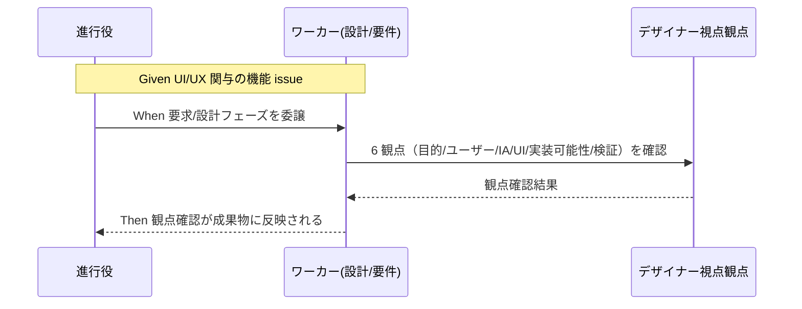

# 要件定義書: CORE へのデザイナー視点（UX/プロダクトデザイン）の組込

**プロジェクト名**: CORE へのデザイナー視点（UX/プロダクトデザイン）の組込
**作成日**: 2026 年 07 月 17 日
**最終更新**: 2026 年 07 月 17 日

> **重要**: **このドキュメントは常に更新**: 要件の変更や追加があった場合は、即座にこのドキュメントを更新してください。ドキュメントは「生きているドキュメント」として扱い、実装内容と常に同期させます。
>
> **用語**: [.agent-skill-chain/source/CONCEPTS.md §用語規約](../../../../../.agent-skill-chain/source/CONCEPTS.md#用語規約) を参照。

---

## 1. 概要

### 1.1 システム概要

本フレームワーク（AGENTS.md 実行契約フレームワーク）の CORE（`.agent-skill-chain/source/` = 配布パッケージ正本）に、デザイナー視点（UX/プロダクトデザインの思考プロセス）による観点確認を組み込む。現行の command chain（requirement-discovery → design-feature → implement-feature → verify-and-close）は要件定義・アーキテクチャ設計・実装計画に強い一方、ユーザー視点・情報設計（IA）・UX/UI 妥当性を専任で担保する視点が欠落している。本要件は、この欠落を CORE 側で補完し、UI/UX を伴う機能について「課題 → ユーザー → 情報設計 → 画面構成 → UI → 実装 → 検証・改善」の思考プロセスの観点確認が行われる状態を定義する。**実装方式（新規 skill domain / 既存 command への工程追加 / 新規 command）の決定は本要件のスコープ外**であり、design-feature で決定する。

### 1.2 用語集

| 用語 | 説明 |
| ---- | ---- |
| デザイナー視点 | ビジネス目的・KPI から出発し、ユーザー分析・課題発見・仮説検証・情報設計（IA）・ユーザーフロー・UX・画面構成・UI（アクセシビリティ・視線誘導）・実装可能性・検証改善までを一貫して考える思考プロセス |
| CORE | 配布パッケージ正本（`.agent-skill-chain/source/`）。全消費者へ配布される本体。プロジェクトローカル上書き（`.agent-skill-chain/project/`）とは区別する |
| IA（情報設計） | Information Architecture。情報の構造化・分類・ナビゲーション設計 |
| UI/UX 関与機能 | 画面・操作フロー・ユーザー体験を伴う機能。適用トリガーの判定対象 |
| 観点確認 | デザイナー視点の各要素（§2.3 の 6 要素）が検討・記録されているかの確認 |
| アドバイザー起用（fable） | fable を成果物本文の執筆担当（実行ティア）にせず、デザイン直感・創造的視点の壁打ち相手（助言的インプット）としてのみ用いる起用形態 |
| 実行ティア | 成果物本文（00〜04 等）を執筆する担当モデル。fable はこれにしない |

---

## 2. 機能要件

### 2.1 ユーザーストーリー

#### ストーリー 1: UI/UX 機能でのデザイナー視点観点確認

- **As a** このフレームワークを使う消費者（開発者・プロジェクトオーナー）
- **I want to** UI/UX を伴う機能の要求定義・設計時に、デザイナー視点（ビジネス目的・ユーザー/課題分析・IA/ユーザーフロー・UI/アクセシビリティ・実装可能性・検証改善）の観点確認を受けたい
- **So that** 体験・情報設計の妥当性が担保され、実装後の体験面の手戻りを防げる

**受け入れ基準**:

- UI/UX を伴う機能の要求定義フェーズまたは設計フェーズで、§2.3 の 6 観点の確認が行われることが CORE 上で定義されている。
- 観点確認の結果が成果物（00/01 または 02）で追跡できる。

#### ストーリー 2: 観点欠落の差し戻し（既存ゲートとの整合）

- **As a** 進行役（orchestrator）／レビュー担当
- **I want to** デザイナー視点の観点が欠落したまま設計完了とみなされないようにしたい
- **So that** 体験設計の欠陥が下流（実装）に流出しない

**受け入れ基準**:

- デザイナー視点の観点が欠落している場合、既存の review-docs 等の実装前ゲートで差し戻せる（観点欠落を「設計完了」とみなさない）ことが定義されている。
- 既存ゲート（review-docs・GitHub Issue 起票・branch/PR 紐づけ）の挙動を破壊しない形で整合している。

#### ストーリー 3: 過剰適用の回避（トリガー条件）

- **As a** バックエンドのみ・内部処理のみの issue を扱う担当
- **I want to** UI/UX が関与しない issue にデザイナー視点の観点確認が一律強制されないようにしたい
- **So that** 不要なプロセスでワークフローが重くならない

**受け入れ基準**:

- 適用トリガー条件（UI/UX が関与する機能のみ適用）が要件として明確化されている。
- UI/UX 非関与の issue では観点確認がスキップされ、CONTEXT_EFFICIENCY.md の規模比例・過剰適用回避の考え方と整合する。

#### ストーリー 4: fable のアドバイザー限定起用

- **As a** プロジェクトオーナー
- **I want to** fable を「デザイン直感・創造的視点の壁打ち相手」としてのみ起用し、成果物本文の執筆（実行ティア）には使わないようにしたい
- **So that** MODEL_TIER_TABLE.md の「fable は原則禁止・都度例外のみ」の方針を守りつつ、創造的視点の助言を得られる

**受け入れ基準**:

- fable の起用はアドバイザー（助言的インプット）に限定され、実行ティア（成果物本文の執筆担当）にしないことが制約として明記されている。
- fable の起用は「都度ユーザーが最重要指定した場合の例外」に位置づけられ、恒常的な実行ティア化をしないことが明記されている。

#### ストーリー 5: 変更が配布パッケージ本体（CORE）に届く

- **As a** フレームワークの全消費者
- **I want to** デザイナー視点の観点確認が `.agent-skill-chain/source/`（CORE）に組み込まれ、プロジェクトローカル限定でないようにしたい
- **So that** 全消費者が同じ観点確認の恩恵を受けられる

**受け入れ基準**:

- 変更対象が `.agent-skill-chain/source/` 配下（CORE）および `.agent-skill-chain/runtime/templates/` であり、`.agent-skill-chain/project/` 限定でない。
- 基盤の 1 ファイル 1 責務・肥大化防止（META_LAYER.md）を尊重した粒度で導入される（実装方式の決定自体は design-feature）。

### 2.2 BDD ユースケース

#### ユースケース 1: UI/UX 機能でのデザイナー視点観点確認

UI/UX を伴う機能の要求・設計時に、デザイナー視点の 6 観点の確認が行われる。

**シナリオ 1: UI/UX 関与機能で観点確認が実施される**

```gherkin
Feature: デザイナー視点の観点確認
  Scenario: UI/UX を伴う機能の要求定義・設計時に観点確認が行われる
    Given UI/UX を伴う機能の issue が要求定義または設計フェーズにある
    When 当該フェーズの成果物を作成する
    Then ビジネス目的・ユーザー/課題分析・IA/ユーザーフロー・UI/アクセシビリティ・実装可能性・検証改善の 6 観点の確認が行われ、その結果が成果物で追跡できる
```

**処理フロー**:



**シナリオ 2: 観点欠落が既存ゲートで差し戻される**

```gherkin
Feature: デザイナー視点の観点確認
  Scenario: デザイナー視点の観点が欠落したまま設計完了とみなされない
    Given UI/UX を伴う機能の設計成果物でデザイナー視点の観点が欠落している
    When 実装着手前の review-docs 等のゲートを通過しようとする
    Then 観点欠落が指摘され、設計完了とみなされず差し戻される
```

#### ユースケース 2: 過剰適用の回避

UI/UX が関与しない機能には観点確認を強制しない。

**シナリオ 1: UI/UX 非関与機能では観点確認をスキップ**

```gherkin
Feature: 過剰適用の回避
  Scenario: バックエンドのみの機能では観点確認が一律強制されない
    Given UI/UX が関与しないバックエンドのみの機能 issue
    When 要求定義・設計フェーズを実施する
    Then デザイナー視点の観点確認は適用トリガー非該当としてスキップされ、追加のプロセス負荷が発生しない
```

**シナリオ 2: トリガー判定が明確**

```gherkin
Feature: 過剰適用の回避
  Scenario: 適用トリガー条件が判定可能な形で定義されている
    Given ある issue が UI/UX を伴うか判定したい
    When 適用トリガー条件を参照する
    Then UI/UX 関与の有無が判定でき、適用/非適用が一意に決まる
```

#### ユースケース 3: fable アドバイザー起用の限定

fable は助言的インプットに限定し、実行ティア化しない。

**シナリオ 1: fable は成果物本文を執筆しない**

```gherkin
Feature: fable アドバイザー限定起用
  Scenario: fable が実行ティアとして恒常利用されない
    Given デザイナー視点の検討で fable をアドバイザーとして起用する
    When fable にデザイン直感・創造的視点の助言を求める
    Then fable の役割はアドバイザー（助言的インプット）に限定され、成果物本文（00〜04 等）の執筆担当（実行ティア）にはならない
```

**シナリオ 2: fable 起用は都度例外**

```gherkin
Feature: fable アドバイザー限定起用
  Scenario: fable 起用が恒常運用化しない
    Given fable を起用する
    When 起用の可否を判断する
    Then 起用はユーザーが個別 issue を「最重要」と明示指定した都度例外に限定され、日常運用化しない
```

### 2.3 ビジネスルール

- **デザイナー視点の 6 観点**（少なくともこれらを扱う）:
  1. ビジネス目的・成功基準（KPI）の明確化
  2. ユーザー・課題分析（誰の何の課題か・仮説と検証）
  3. 情報設計（IA）・ユーザーフロー・体験設計（UX）
  4. 画面構成・UI（アクセシビリティ・視線誘導・ビジュアル）
  5. 実装可能性とのすり合わせ（実装制約との整合）
  6. 検証・改善（計測・改善ループ）の観点
- **適用トリガー**: UI/UX が関与する機能にのみ適用。UI/UX 非関与（バックエンド・内部処理のみ等）には一律強制しない。
- **配置境界**: 変更対象は CORE（`.agent-skill-chain/source/`）および `.agent-skill-chain/runtime/templates/`。全消費者へ届く形にする。project 限定にしない。
- **基盤肥大化防止**: 既存基盤ファイルへの闇雲な追記を避け、1 ファイル 1 責務を尊重した粒度で導入する（実装方式は design-feature 決定）。
- **fable**: アドバイザー（助言的インプット）限定。実行ティア化しない。起用は都度ユーザー最重要指定時の例外。
- **既存工程・ゲートの非破壊**: 既存 chain・skill・ゲート・enforcement を置換せず補完・統合する。

---

## 3. 非機能要件

### 3.1 パフォーマンス要件

- UI/UX 非関与 issue ではオーバーヘッドが発生しない（トリガー非該当時は観点確認をスキップ）。

### 3.2 セキュリティ要件

- 本件は文書・ワークフロー定義の変更であり外部書き込みを伴わない。fable 起用時も助言に限定し、外部操作・成果物執筆を担わせない。

### 3.3 ユーザビリティ要件

- 観点確認の要素・トリガー条件が、ワーカー・進行役・レビュー担当が迷わず判定できる明確さで定義されている。

### 3.4 可用性要件

- 既存の消費者ランタイム・既存 issue と後方互換であること。

---

## 4. 外部インターフェース要件

### 4.1 API 要件

- 該当なし（本件は command/skill/ワークフロー定義の変更であり、プログラム API を新設しない）。実装方式に応じた command/skill の I/F は design-feature（IO_CONTRACT.md 準拠）で定義する。

### 4.2 データ形式要件

- 成果物（00/01/02 等）は既存テンプレート（`.agent-skill-chain/runtime/templates/`）の必須セクション・frontmatter・document_id 規約に従う。

---

## 5. 制約事項

- **変更対象は CORE（`.agent-skill-chain/source/`）および `.agent-skill-chain/runtime/templates/`**。project 限定でない。
- 実装方式（新規 skill domain / 既存 command への工程追加 / 新規 command）の決定は本要件のスコープ外（design-feature で決定）。00/01 では実装方式を先取り決め打ちしない。
- 基盤の 1 ファイル 1 責務・肥大化防止（META_LAYER.md）を尊重する。
- 過剰適用回避のため適用トリガー条件（UI/UX 関与時のみ）を必須とする（CONTEXT_EFFICIENCY.md と整合）。
- **fable はアドバイザー限定・実行ティア化しない**。起用は都度ユーザー最重要指定時の例外（MODEL_TIER_TABLE.md と整合）。本 issue はユーザーが明示的に fable をアドバイザー役に指定しており例外条件を満たす。なお 2026-07-17 の review-docs ラウンド3 に限り、ユーザーの明示指定（最重要・「fableに徹底的にレビューと指摘対応をさせて」）により fable がレビューと指摘修正の実行担当を務めた（同表の都度例外の発動・恒常運用ではない。記録は 00 §4.1・02 §13.3）。CORE に組み込む設計としての fable の役割（アドバイザー限定）は不変。
- 既存 chain・skill・ゲート・enforcement を破壊しない。
- 本 issue は当初 00/01 の作成までをスコープとし、その後同一 issue 内で 02/03 まで進行済み（実装・レビューは review-docs ゲート通過後の後続工程）。

---

## 6. 参考資料

### プロジェクトドキュメント

- [`00_要求定義.md`](./00_要求定義.md) - 要求定義

### その他の参考資料

- [.agent-skill-chain/source/boot/CORE.md](../../../../../.agent-skill-chain/source/boot/CORE.md) — 実行契約正本
- [.agent-skill-chain/source/workflow/PHASES.md](../../../../../.agent-skill-chain/source/workflow/PHASES.md) — フェーズ定義
- [.agent-skill-chain/source/META_LAYER.md](../../../../../.agent-skill-chain/source/META_LAYER.md) — 基盤肥大化防止
- [.agent-skill-chain/source/CONTEXT_EFFICIENCY.md](../../../../../.agent-skill-chain/source/CONTEXT_EFFICIENCY.md) — 規模比例・過剰適用回避
- [.agent-skill-chain/project/MODEL_TIER_TABLE.md](../../../../../.agent-skill-chain/project/MODEL_TIER_TABLE.md) — fable の扱い

---

## 7. 前のステップ

この要件定義書は、以下のドキュメントを基に作成されています：

- **前**: [`00_要求定義.md`](./00_要求定義.md) - 要求定義フェーズ
- **参照元**: 本 issue は**新規 issue（親なし）** であり、参照元となる親 00/03 は存在しない。要求の根拠はプロジェクトオーナーの指摘（「デザイナーがこのシステムにいないね」等のデザイン思考プロセスに関する発言）である。

---

## 8. 次のステップ

この要件定義書の承認後、以下のドキュメントを作成します：

- **次**: [`02_設計.md`](./02_設計.md) - 設計フェーズ（実装方式の決定を含む）
