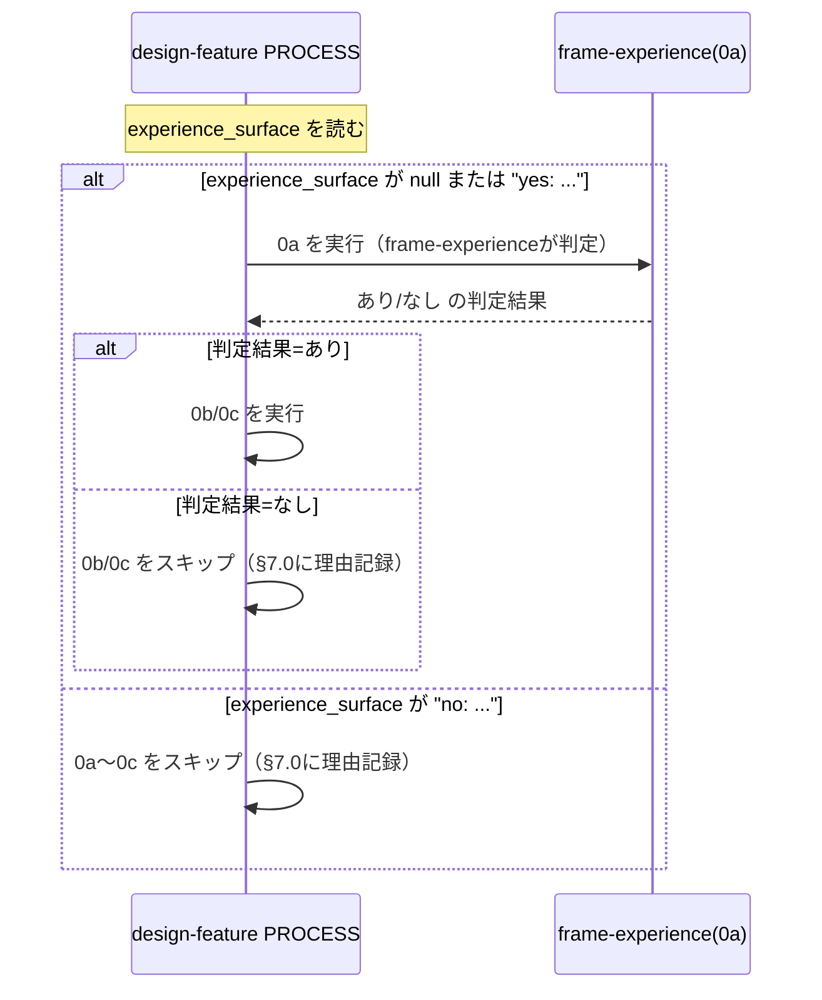

# 要件定義書: PR#128 指摘対応（是正実装）

**プロジェクト名**: PR#128 指摘対応（是正実装）
**作成日**: 2026 年 07 月 17 日
**最終更新**: 2026 年 07 月 17 日

> **重要**: **このドキュメントは常に更新**: 要件の変更や追加があった場合は、即座にこのドキュメントを更新してください。ドキュメントは「生きているドキュメント」として扱い、実装内容と常に同期させます。
>
> **用語**: [.agent-skill-chain/source/CONCEPTS.md §用語規約](../../../../../../../.agent-skill-chain/source/CONCEPTS.md#用語規約) を参照。

---

## 1. 概要

### 1.1 システム概要

本 issue は [00_要求定義.md](./00_要求定義.md) が確定した PR#128 レビュー指摘トリアージ（起票 9 件: finding-1, 2, 4, 5, 6, 7, 8, 10, 11 ＋再レビュー追加 2 件: finding-13, 14）を、根本原因ごとに整理した 5 グループ（A/B/C/D/E）＋独立 1 件（finding-8）として是正実装まで進めるための要件を定義する。対象は CORE 配布物（`.agent-skill-chain/source/`）のテンプレート・README・command 定義、および issue 自身のドキュメント（`docs/maintainer/workflow/20260717_071859_デザイナー視点組込/` 配下）である。是正はいずれも**ドキュメント・テンプレート・command 定義の記述修正**であり、新規機能・新規 command・新規 audit の追加は伴わない。

### 1.2 用語集

| 用語 | 説明 |
| ---- | ---- |
| `experience_surface` | 00_要求定義.md frontmatter のフィールド。UI/UX を人間が感覚器で直接体験する出力を持つかを示す（`null`＝未記入 / `"yes: ..."` / `"no: ..."`）。design-feature の 0a〜0c（体験設計 3 工程）の発動判定に使う。 |
| chain（体験設計 chain） | `commands/design-feature.md` の PROCESS 0a（frame-experience）→0b（map-experience）→0c（detail-experience）→1〜3（define-boundaries 等）の一連の skill 実行順序。 |
| OUT 契約 | 各 capability の README/SKILL.md「成果物の形式」節が定める、当該 capability が生成する成果物（02_設計.md の該当セクション等）の記録項目一覧。 |
| 02_設計.md §7 | 体験設計 3 フェーズ（§7.1 frame・§7.2 map・§7.3 detail）＋共通の幻覚ペルソナ注意（§7.4）を記録する節。 |
| review-docs ゲート | `commands/review-docs.md` が定める、実装着手前の 00/01/02/03 ドキュメントレビュー。体験観点の確認を含む。 |
| グループ A/B/C/D/E | 本 01 が扱う 5 つの根本原因グループ。詳細は 00 §2・本 01 §2.1 を参照。 |

---

## 2. 機能要件

### 2.1 ユーザーストーリー

#### ストーリー A（finding-1・finding-5）: detail-experience の OUT 契約に実装可能性・検証改善の記録欄を追加する

- **As a** フレームワーク保守者
- **I want to** `.agent-skill-chain/runtime/templates/02_設計.md` §7.3 と `.agent-skill-chain/source/skills/experience/detail-experience/README.md`「成果物の形式」節の OUT 契約の両方に、「実装可能性・検証改善観点の確認結果」を記録する項目を追加したい
- **So that** README「手順」6（実装可能性・検証改善観点の確認）の実行結果が成果物（02 §7.3）に反映され、手順と OUT 契約の不整合が解消される

**受け入れ基準**:

- `02_設計.md` テンプレート §7.3 に、既存の項目（UI/ビジュアル・アクセシビリティ、既存資産探索一覧、再利用結果／新規作成の正当化根拠、技術非依存の注記、却下案、責務・API 候補）を維持したまま、「実装可能性・検証改善観点の確認結果」を記録する項目が追加されている。
- `detail-experience/README.md`「成果物の形式」節の OUT（`## 成果物の形式` の `**OUT**:` 行）に、実装可能性・検証改善観点の確認結果が記録対象として明記されている。
- 追加する項目名・文言は、既存の「手順」6（`実装可能性・検証改善観点（体験を成立させる実装制約との矛盾の有無、どう計測・改善するか）を確認する`）の記述と一致し、新たな概念・新たな確認観点を持ち込まない（Process 側の記述はそのまま、OUT 契約側に記録欄を追加するのみ）。
- 既存の §7.3 の他項目・既存の README の他節（手順1〜5・7〜10、4 原則、制約・禁止、参照）は変更しない。

#### ストーリー B（finding-4・finding-6）: 新規 UI 作成条件の必須レベル表現を 3 ファイル間で統一する

- **As a** フレームワーク保守者
- **I want to** `detail-experience/README.md`・`skills/experience/README.md`・`02_設計.md` テンプレートの間で「新規 UI 作成が正当化される条件」の必須レベル表現を 1 つに統一したい
- **So that** 設計者が 3 ファイルのどれを読んでも同じ基準（満たすべき度合い）で新規 UI 作成の可否を判断できる

**受け入れ基準**:

- 是正前の現状（evidence_source=existing_code、grep で確認済み）:
  - `detail-experience/README.md`（現行 38 行目）は「次を**すべて満たすことが望ましく**」（望ましい＝努力目標）。
  - `skills/experience/README.md`（現行 42 行目）は「正当化条件…を**満たす場合に限る**」（必須）。
  - `02_設計.md` テンプレート §7.3（現行 305 行目）は「…を**満たすことを明記**」（記述を要求するのみで必須度が曖昧）。
- 是正後、3 ファイルの必須レベル表現が同一の強度（`skills/experience/README.md` が既に採用している「満たす場合に限る」＝必須、を基準として揃える）に統一されている。
- 是正時、finding-6 の注記（元指摘は「detail-experience/SKILL.md が『望ましい』としている」とするが、実際は `SKILL.md` に当該表記は無く `README.md` 側にある誤帰属）を踏まえ、修正対象を `detail-experience/README.md` と正しく特定する。`detail-experience/SKILL.md` が存在しない場合、または当該表記が無い場合は誤って新規追記しない。
- 「新規作成が正当化される条件」6 項目（複数箇所での再利用見込み・責務明確・既存の組み合わせで表現不可・バリアント明示・アクセシビリティ要件文書化・レスポンシブ挙動文書化）自体の内容は変更しない（必須レベルの表現統一のみが対象）。

#### ストーリー C（finding-2・finding-7・finding-14）: design-feature chain の INPUT/PROCESS 制御フロー矛盾を解消する

- **As a** フレームワーク保守者
- **I want to** `commands/design-feature.md` の PROCESS step 0a（frame-experience）実行条件を「`experience_surface` が `null`（未記入）または `"yes: ..."` の場合に実行」へ改め、`workflow/SKILL_MANDATORY.md`・`workflow/TEMPLATES.md` の該当箇所、および issue 自身の `02_設計.md` §3.2.2 の PROCESS 定義（code fence 内）も同じ条件表現へ揃えたい
- **So that** `experience_surface` が未記入の issue でも frame-experience（0a）自身が「あり/なし」を判定できるようになり、INPUT が約束する「未記入時は frame-experience が判定する」という前提と PROCESS の実行条件が矛盾しなくなる

**受け入れ基準（最優先グループ）**:

- 是正前の現状（evidence_source=existing_code、Read で確認済み）:
  - `design-feature.md` INPUT（現行 25 行目）: 「未記入の場合は frame-experience が判定する」。
  - `design-feature.md` PROCESS（現行 31・33・35 行目）: 0a/0b/0c いずれも「体験サーフェス=あり のときのみ」という条件文。文字どおり適用すると `experience_surface` が `null` の issue は 0a 自体が起動されず、frame-experience による判定が発生しない（INPUT との矛盾）。
  - `workflow/SKILL_MANDATORY.md`（現行 13 行目）: 「`experience_surface`=あり のときのみ必須」という同型の条件文。
  - 本サブ issue の親 `02_設計.md` §3.2.2（L317-324 付近の code fence）: `design-feature.md` の記述をそのまま踏襲した同型の条件文。
- 是正後、`design-feature.md` の PROCESS 0a の実行条件が「`experience_surface` が `null`（未記入）または `"yes: ..."` の場合に 0a（frame-experience）を実行し、0a の判定結果（あり/なし）に応じて 0b/0c の要否を決める」形に変更されている。
- `experience_surface` が明示的に `"no: <理由>"` の場合は、0a〜0c を実行しない（既存の「なし＝トリガー非該当の正常系」という扱いを変更しない）。
- `workflow/SKILL_MANDATORY.md` の Phase「設計」行の条件付き必須列が、同じ「`null`（未記入）または `yes:`」の条件表現へ揃っている。
- `workflow/TEMPLATES.md` に同種の条件表現がある場合は同様に揃える（無い場合は変更不要）。
- issue 自身の `docs/maintainer/workflow/20260717_071859_デザイナー視点組込/02_設計.md` §3.2.2 の PROCESS 定義（code fence 内）が、`design-feature.md` の実修正後の条件文と同じ表現に揃っている。
- **既存 chain を破壊しない制約**: 0a〜0c の委譲粒度（ADR-7・fresh サブへの個別委譲）、1〜3（define-boundaries → design-api-contract → review-dependencies）の順序・入出力の受け渡し、`experience_surface="no: ..."` 時のスキップ挙動、規模比例統合（体験サーフェスが小さい場合の 0a+0b+0c 統合）は変更しない。既存の DONE（DoD）の「体験サーフェス=あり の場合」「体験サーフェス=なし の場合」の 2 条件分岐の意味も変えない（条件文の対象を「あり」単独から「null（未記入）または yes」へ広げるのみで、判定ロジック自体・0b/0c の発動条件は 0a の判定結果に従うという既存設計を変更しない）。
- 本ストーリーは 02_設計再検討相当（起票条件 C2）の設計変更を伴うため、後続の design-feature フェーズで ADR 形式（EVIDENCE_POLICY.md §節2）による記録を行う。

#### ストーリー D（finding-10・finding-11）: 02_設計.md 契約1の記録先記述と 04_review 証跡を実装と整合させる

- **As a** フレームワーク保守者
- **I want to** issue 自身の `02_設計.md` 契約1（frame-experience）の Outputs/Process 記述を、実装・04_review が確定させた「幻覚ペルソナ注意は共通 §7.4 に記録」へ揃え、`04_review.md`「指摘1」の対応済み根拠の commit 範囲記載を補記したい
- **So that** 設計書・実装・レビュー証跡の間の記録先の不整合が解消され、04_review の対応済み根拠が verify-and-close のレビュー範囲との関係が読み手に明確になる

**受け入れ基準**:

- 是正前の現状（evidence_source=existing_code、grep で確認済み）:
  - `02_設計.md`（現行 380 行目）契約1「Outputs」: 「02_設計 §7.1（前提ナラティブ・ペルソナ・JTBD・却下案・**注意書き**）」— 幻覚ペルソナ注意を §7.1 側の記録物として書いている。
  - `04_review.md`「指摘1」（現行 115 行目付近）: 対応済み根拠が commit `2f81938` を指すが、`04_review.md` が明記するレビュー対象範囲（`bab69a2..0032ade`）の外にある。
- 是正後、`02_設計.md` 契約1の Outputs/Process/Done 記述が、「§7.1 は前提ナラティブ・ペルソナ・JTBD・却下案のみを記録し、幻覚ペルソナ注意は 3 フェーズ共通の §7.4 に記録する」という、実装（`frame-experience` の README.md・SKILL.md、commit `2f81938` で是正済み）・`04_review.md`「指摘1」の対応済み記述と同じ記録先に揃っている（Done〈L381〉も §7.1 に幻覚ペルソナ注意を局在させているため Outputs/Process と同時に是正する）。
- `04_review.md`「指摘1」の「対応済み」根拠の記述に、commit `2f81938` が verify-and-close のレビュー範囲（`bab69a2..0032ade`）の外にある旨の注記、またはレビュー範囲を跨いだ経緯の説明が補記されている。
- 契約2（map-experience）・契約3（detail-experience）の Outputs/Process 記述、および 02_設計.md 内の他の契約定義は変更しない（対象は契約1のみ）。

#### ストーリー E（finding-13）: review-docs ゲートの確認観点を「§7 記載の有無」から「各フェーズの必須項目充足」へ強化する

- **As a** フレームワーク保守者
- **I want to** `commands/review-docs.md` の体験観点の確認観点を、「02_設計.md §7 に体験設計観点が記載されているか」という§7 セクションの存在確認から、「§7.1（frame-experience）・§7.2（map-experience）・§7.3（detail-experience）それぞれの必須項目が個別に充足しているか」という各フェーズの Done 条件充足の確認へ強化し、issue 自身の `02_設計.md` §3.3（L344-349 付近）の記述も同じ強化後の観点へ揃えたい
- **So that** review-docs ゲートが「§7 に何か書いてあれば通過」する形骸化を防ぎ、frame/map/detail 各フェーズの Done 条件（前提ナラティブ・却下案・IA・資産探索結果・アクセシビリティ配慮・責務/API 候補等）の充足を実質的に検証できるようになる

**受け入れ基準**:

- 是正前の現状（evidence_source=existing_code、Read で確認済み）: `review-docs.md` Process 1.1（現行 27 行目）の体験観点の確認は「02_設計.md §7 に体験設計観点（ナラティブ・却下案・6 観点・探索一覧・幻覚ペルソナ注意）が記載されているかを DUAL_LENS で確認し、欠落時は差し戻す」という§7 の存在確認にとどまる。
- 是正後、`review-docs.md` の体験観点の確認観点が、§7.1（前提ナラティブ・ユーザー・課題・却下案 1 件以上）、§7.2（情報設計・ユーザーフロー・体験ジャーニー・却下案 1 件以上）、§7.3（UI/ビジュアル・既存資産探索一覧・再利用結果／新規作成の正当化根拠・アクセシビリティ・実装可能性・検証改善観点の確認結果・却下案 1 件以上・責務/API 候補）、§7.4（幻覚ペルソナ注意〈3 フェーズ共通〉）それぞれの必須項目が個別に充足しているかを確認する観点に強化されている（§7.3 の実装可能性・検証改善観点はストーリー A で §7.3 へ追加する項目、幻覚ペルソナ注意はストーリー D の §7.4 寄せと整合する記録先）。
- 強化後も、体験面=なし の issue を体験設計の欠落を理由に差し戻さない既存の扱い、および §7.0 の判定記録欠如・「なし」理由と体験サーフェス定義の明らかな矛盾を差し戻す既存の扱い（ADR-3）は変更しない。
- issue 自身の `docs/maintainer/workflow/20260717_071859_デザイナー視点組込/02_設計.md` §3.3（review-docs.md 改修内容の記述、L344-349 付近）が、強化後の確認観点と同じ内容に揃っている。
- `review-docs.md` の他の確認観点（DUAL_LENS の敵対的観点・must-preserve リスト、memo 記録、書記委譲）は変更しない。

#### ストーリー finding-8: 00 の制約条件記述を実際の変更範囲と一致させる

- **As a** フレームワーク保守者
- **I want to** `docs/maintainer/workflow/20260717_071859_デザイナー視点組込/00_要求定義.md` §4.1 の「変更対象は `.agent-skill-chain/source/`」という記述を、実際に変更した範囲（`.agent-skill-chain/source/` ＋ `.agent-skill-chain/runtime/templates/`）に一致させたい
- **So that** 制約条件の記述と実装対象範囲の不一致が解消され、後続フェーズの読み手が誤った制約（`runtime/templates/` は変更対象外）を前提にしない

**受け入れ基準**:

- 是正前の現状（evidence_source=existing_code、grep で確認済み）: `00_要求定義.md`（現行 161 行目）「変更対象は `.agent-skill-chain/source/`（配布パッケージ正本＝CORE）」。
- 是正後、当該記述が「変更対象は `.agent-skill-chain/source/`（配布パッケージ正本＝CORE）および `.agent-skill-chain/runtime/templates/`（テンプレート正本）」のように、実際の変更範囲を反映した表現に修正されている。
- 「プロジェクトローカルの `.agent-skill-chain/project/` 限定の対応ではなく、フレームワークを使う全消費者に届く形にする」という後段の意図は維持する（表現の一致修正のみで、制約の趣旨は変更しない）。
- 親 issue の `01_要件定義.md`・`03_実装計画.md` に同種の「変更対象は `.agent-skill-chain/source/`」限定の記述があれば、同様に是正対象として確認する（本 01 の完了時点では確認結果のみを記録し、実際の修正は本 90_issues の対応スコープ外である親ドキュメントに及ぶ場合、着手前に進行役へ確認する）。

### 2.2 BDD ユースケース

#### ユースケース 1: グループ A（detail-experience OUT 契約の記録欄追加）

**シナリオ 1: 02_設計.md テンプレート §7.3 に実装可能性・検証改善の記録欄がある**

```gherkin
Feature: detail-experience の OUT 契約整備
  Scenario: 02 テンプレート §7.3 に実装可能性・検証改善欄が追加されている
    Given detail-experience の README「手順」6 が実装可能性・検証改善観点の確認を要求している
    When 02_設計.md テンプレート §7.3 を確認する
    Then 「実装可能性・検証改善観点の確認結果」を記録する項目が §7.3 に存在する
    And 既存の他項目（UI/ビジュアル・探索一覧・正当化根拠・却下案・責務/API候補）は変更されていない
```

**シナリオ 2: detail-experience/README.md の OUT 契約に記録項目が明記されている**

```gherkin
Feature: detail-experience の OUT 契約整備
  Scenario: README の成果物の形式に実装可能性・検証改善の記録項目がある
    Given README「手順」6 が実装可能性・検証改善観点の確認を規定している
    When README「成果物の形式」節の OUT を確認する
    Then 実装可能性・検証改善観点の確認結果が記録対象として明記されている
```

#### ユースケース 2: グループ B（新規 UI 作成条件の必須レベル統一）

**シナリオ 1: 3 ファイルの必須レベル表現が統一されている**

```gherkin
Feature: 新規UI作成条件の必須レベル統一
  Scenario: detail-experience/README・experience/README・02テンプレの必須レベルが一致する
    Given detail-experience/README.md が「望ましい」、experience/README.md が「満たす場合に限る」、02テンプレが曖昧な表現を用いている
    When 3 ファイルを是正後に確認する
    Then 3 ファイルの必須レベル表現が同一の強度（必須）に統一されている
    And 「新規作成が正当化される条件」6 項目の内容自体は変更されていない
```

**シナリオ 2: finding-6 の誤帰属を踏まえた修正対象の特定**

```gherkin
Feature: 新規UI作成条件の必須レベル統一
  Scenario: 誤帰属を避けて正しいファイルを修正する
    Given 元指摘は detail-experience/SKILL.md に「望ましい」表記があるとしているが実際は README.md 側にある
    When 是正対象ファイルを特定する
    Then detail-experience/README.md が修正され、SKILL.md には誤って新規追記されていない
```

#### ユースケース 3: グループ C（design-feature chain 制御フロー矛盾の解消・最優先）

**シナリオ 1: experience_surface 未記入時に 0a が実行される**

```gherkin
Feature: design-feature chain の INPUT/PROCESS 整合
  Scenario: experience_surface が未記入の issue で frame-experience が起動する
    Given 00_要求定義.md frontmatter の experience_surface が null（未記入）である
    When design-feature の PROCESS を実行する
    Then step 0a（frame-experience）が実行される
    And 0a の判定結果（あり/なし）に応じて 0b/0c の要否が決まる
```

**シナリオ 2: experience_surface が明示的に no の場合は 0a〜0c をスキップする**

```gherkin
Feature: design-feature chain の INPUT/PROCESS 整合
  Scenario: 明示的な no は既存どおりスキップする
    Given 00_要求定義.md frontmatter の experience_surface が "no: <理由>" である
    When design-feature の PROCESS を実行する
    Then step 0a〜0c は実行されない
    And 既存の「トリガー非該当は正常系」という扱いは変更されない
```

**シナリオ 3: SKILL_MANDATORY.md・issue 自身の 02_設計.md も同じ条件表現に揃っている**

```gherkin
Feature: design-feature chain の INPUT/PROCESS 整合
  Scenario: 関連ファイルの条件表現が design-feature.md の修正後条件と一致する
    Given design-feature.md の PROCESS 0a 実行条件が「null（未記入）または yes」へ修正されている
    When workflow/SKILL_MANDATORY.md の「設計」Phase 行、および親issueの02_設計.md §3.2.2 の PROCESS 定義（code fence）を確認する
    Then いずれも design-feature.md と同じ条件表現に揃っている
```

**処理フロー**（design-feature の分岐修正）:



#### ユースケース 4: グループ D（記録先記述と実装・レビュー証跡の整合）

**シナリオ 1: 契約1の Outputs 記述が §7.4 寄せに揃っている**

```gherkin
Feature: 02_設計.md 契約1の記録先整合
  Scenario: 幻覚ペルソナ注意の記録先が §7.4 に統一される
    Given frame-experienceの実装（README/SKILL、commit 2f81938）は幻覚ペルソナ注意を §7.4 に記録すると確定している
    When issue自身の 02_設計.md 契約1の Outputs/Process 記述を確認する
    Then §7.1 は前提ナラティブ・ペルソナ・JTBD・却下案のみを記録すると記述されている
    And 幻覚ペルソナ注意は §7.4（共通）に記録すると記述されている
```

**シナリオ 2: 04_review の対応済み根拠に commit 範囲の注記がある**

```gherkin
Feature: 04_review 証跡の整合
  Scenario: レビュー範囲外 commit の扱いが明記される
    Given 04_review.md のレビュー対象範囲は bab69a2..0032ade である
    And 「指摘1」の対応済み根拠は範囲外の commit 2f81938 を指す
    When 04_review.md「指摘1」を確認する
    Then commit 2f81938 が範囲外である旨、または範囲を跨いだ経緯の注記が補記されている
```

#### ユースケース 5: グループ E（review-docs ゲートの確認観点強化）

**シナリオ 1: §7.1〜§7.3 の必須項目個別充足を確認する**

```gherkin
Feature: review-docsゲートの体験観点強化
  Scenario: 各フェーズのDone条件充足を確認する
    Given review-docs.mdの体験観点の確認は「§7に体験設計観点が記載されているか」の存在確認にとどまっている
    When review-docs.md を是正後に確認する
    Then §7.1（前提ナラティブ・却下案）・§7.2（IA・ユーザーフロー・却下案）・§7.3（探索一覧・正当化根拠・アクセシビリティ・実装可能性検証改善・却下案・責務API候補）・§7.4（幻覚ペルソナ注意〈共通〉）それぞれの必須項目の個別充足が確認観点として明記されている
```

**シナリオ 2: 体験面=なしの既存の扱いは変更しない**

```gherkin
Feature: review-docsゲートの体験観点強化
  Scenario: 体験面なしの issue を差し戻さない
    Given experience_surface が "no: <理由>" と判定されている issue である
    When review-docs の体験観点の確認を実行する
    Then 体験設計の欠落を理由に差し戻されない
    And §7.0 の判定記録欠如、または理由と体験サーフェス定義の矛盾がある場合のみ差し戻される
```

**シナリオ 3: issue 自身の 02_設計.md §3.3 が強化後の観点に揃っている**

```gherkin
Feature: review-docsゲートの体験観点強化
  Scenario: issue自身のドキュメントも同じ観点に揃う
    Given review-docs.md の体験観点の確認観点が強化されている
    When issue自身の02_設計.md §3.3（review-docs.md改修内容の記述）を確認する
    Then 強化後の確認観点と同じ内容が記述されている
```

#### ユースケース 6: finding-8（00 の制約条件記述の是正）

**シナリオ 1: 変更対象範囲の記述が実態と一致する**

```gherkin
Feature: 00の制約条件記述の是正
  Scenario: 変更対象記述にruntime/templates/が含まれる
    Given 実際の変更範囲は .agent-skill-chain/source/ と .agent-skill-chain/runtime/templates/ の両方である
    And 00_要求定義.md §4.1 は「変更対象は .agent-skill-chain/source/」とのみ記述している
    When 00_要求定義.md §4.1 を是正後に確認する
    Then 記述に .agent-skill-chain/runtime/templates/ が変更対象として含まれている
    And 「全消費者に届く形にする」という制約の趣旨は維持されている
```

### 2.3 ビジネスルール

- 是正はいずれもドキュメント・テンプレート・command 定義の記述修正であり、新規 command・新規 audit・新規 skill を追加しない（00 §3 の対応方針の枠内に留める）。
- 各グループの修正は 1 ファイル1 責務・最小 diff を守る。1 つの是正のために無関係な節・無関係なファイルへ手を広げない。
- 既存の template/command 構造（見出し番号、`## INPUT`/`## PROCESS`/`## OUTPUT`/`## DONE` の IO_CONTRACT 形式、`skills/{domain}/{capability}/README.md` の節構成）を壊さない。
- 既存の後方互換性を保つ。既存 issue（experience_surface が既に `"yes: ..."` または `"no: ..."` と明記されている issue）の挙動は変更後も変わらない。挙動が変わるのは `experience_surface: null`（未記入）の issue（グループ C の対象）のみ。
- グループ C は 02_設計再検討相当（起票条件 C2）の設計変更を伴うため、design-feature フェーズで ADR 形式（EVIDENCE_POLICY.md §節2: コンテキスト・検討した選択肢・決定・根拠・帰結）による記録を行う。

---

## 3. 非機能要件

### 3.1 パフォーマンス要件

- 該当なし（ドキュメント・command 定義の記述修正であり、実行時パフォーマンスに影響しない）。

### 3.2 セキュリティ要件

- 該当なし（00 §2 のトリアージ表のとおり、対象 9 件はすべて `security_flag=false`。C5 該当も無し）。

### 3.3 ユーザビリティ要件

- 是正後の文書は、既存の spec/01_設計原則.md（可読性・単一責務・明確な境界）と spec/06_設計判断の優先順位.md（可読性 > 単一責務 > 仕様整合 > 変更容易性 > 保守性 > 再利用性 > 実装効率）に従い、修正箇所が最小限で読みやすいこと。
- グループ C・E の条件表現・確認観点の変更は、既存の読者（design-feature/review-docs を実行するサブエージェント）が誤読しない一義的な文言にする。

### 3.4 可用性要件

- 該当なし（ランタイム上の可用性に影響する変更ではない）。

---

## 4. 外部インターフェース要件

### 4.1 API 要件

- 該当なし。

### 4.2 データ形式要件

- 該当なし（00/01/02/03 のテンプレート・frontmatter 形式は本 issue の是正範囲では変更しない。document_id・issue_id の扱いは既存ルールに従う）。

---

## 5. 制約事項

- **変更対象の限定**: 本 01 自体の変更対象は `docs/maintainer/workflow/20260717_071859_デザイナー視点組込/90_issues/20260717_121714_PR128指摘対応/` 配下の `00_要求定義.md`（branch 記録のみ）・`01_要件定義.md`（本ファイル）に限る。後続 design-feature フェーズで実際の是正対象ファイル（`.agent-skill-chain/source/` 配下、`.agent-skill-chain/runtime/templates/02_設計.md`、issue 自身の `02_設計.md`・`00_要求定義.md`・`04_review.md`）を編集する。
- **1 ファイル 1 責務・最小 diff**: 各グループの修正は該当ファイルの該当箇所のみを対象とし、無関係な既存記述に手を加えない。
- **既存 template/command 構造の維持**: IO_CONTRACT 形式（INPUT/PROCESS/OUTPUT/DONE）、既存の見出し番号・節構成を破壊しない。
- **新規 command/audit の追加禁止**: 本 issue のスコープでは新規 command・新規 audit・新規 skill を追加しない。
- **既存の後方互換性の保持**: `experience_surface` が既に明記されている既存 issue の挙動、および review-docs ゲートの既存の差し戻し条件（体験面=なしを理由に差し戻さない等）を変更しない。
- **モデルティア**: 本 01 の執筆は sonnet（要件定義・BDD 執筆、00 の分析を土台にした整理作業）。後続 design-feature フェーズのグループ C（chain 中核の制御フロー設計変更）は複雑箇所として opus 起用を検討する（`.agent-skill-chain/project/MODEL_TIER_TABLE.md` に従う）。
- **fable 起用禁止**: 本 issue の是正実装フェーズでは fable を実行ティアとして起用しない（00 §4.1 の例外は当該トリアージ記録作成時点に限定される）。

---

## 6. 参考資料

### プロジェクトドキュメント

- [`00_要求定義.md`](./00_要求定義.md) - 要求定義（本 01 の土台。§2 指摘一覧・§3 対応方針・§5 受け入れ基準・§7 次のステップ）
- 親 issue: [`../../00_要求定義.md`](../../00_要求定義.md)（CORE へのデザイナー視点組込）
- 親 issue 02_設計: [`../../02_設計.md`](../../02_設計.md)
- 親 issue 04_review: [`../../04_review.md`](../../04_review.md)

### その他の参考資料

- PR: https://github.com/techbeansjp-free/AGENTS.md/pull/128
- `.agent-skill-chain/source/commands/design-feature.md`（グループ C の是正対象）
- `.agent-skill-chain/source/workflow/SKILL_MANDATORY.md`（グループ C の是正対象）
- `.agent-skill-chain/source/commands/review-docs.md`（グループ E の是正対象）
- `.agent-skill-chain/source/skills/experience/detail-experience/README.md`・`.agent-skill-chain/source/skills/experience/README.md`（グループ A・B の是正対象）
- `.agent-skill-chain/runtime/templates/02_設計.md`（グループ A の是正対象）
- `.agent-skill-chain/source/EVIDENCE_POLICY.md`（グループ C の ADR 記録形式）

---

## 7. 前のステップ

この要件定義書は、以下のドキュメントを基に作成されています：

- **前**: [`00_要求定義.md`](./00_要求定義.md) - 要求定義フェーズ（PR#128 指摘トリアージ・§2〜§3 が本 01 の土台）

---

## 8. 次のステップ

この要件定義書の承認後、以下のドキュメントを作成します：

- **次**: `02_設計.md` - 設計フェーズ（design-feature。グループ C を最優先で扱う。グループ単位でまとめて設計するか finding 単位で分けるかは着手時の進行役判断）
