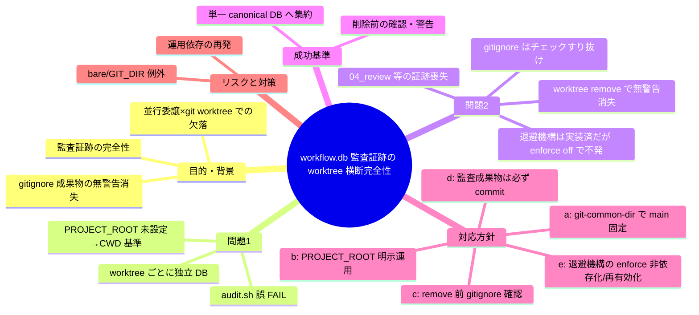
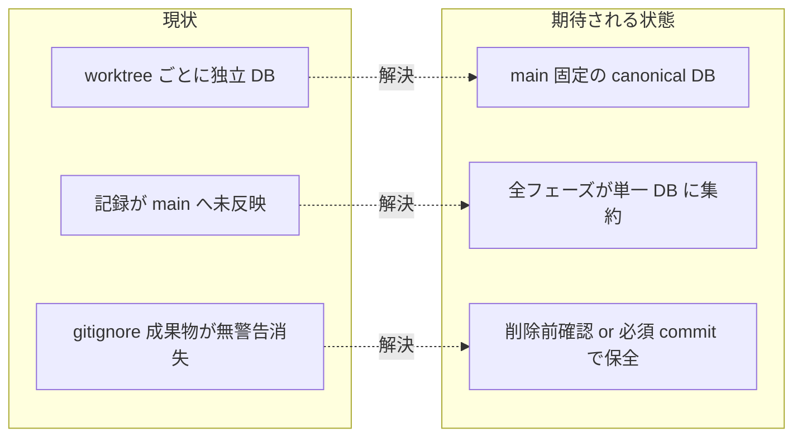

# 要求定義書: workflow.db 監査証跡の worktree 横断完全性

**プロジェクト名**: workflow.db 監査証跡の worktree 横断完全性（並行委譲パターンでの記録欠落・成果物消失の是正）
**作成日**: 2026 年 07 月 17 日
**最終更新**: 2026 年 07 月 17 日

> **重要**:
>
> - 本ドキュメントは `mode: quick` の起票検討ドラフトである。目的・成功基準・受け入れ基準相当と対応方針の選択肢を含むが、01〜04 のフルセットは作らない（RULES.md §実行モード quick 最小セット）。
> - 本ドキュメント自身が問題2の「生きた再現サンプル」である。配置先 `docs/maintainer/workflow/**/00_要求定義.md` は 2026-07-16 の S-2 変更（PR #126, `.gitignore` 7247214）により **git 非追跡**である（`git check-ignore` で確認済み。§背景 A-2 参照）。したがって本ファイルを追跡させるには `git add -f` が必要であり、追跡させずに worktree で作業して `git worktree remove` すると無警告で失われる。

---

## 要求定義の全体像



**注意**: マインドマップは全体像把握用。詳細は本文に記載する。

---

## 1. 目的・背景

### 1.1 目的（必須）

git worktree で並行委譲しても監査証跡（workflow.db）を単一 canonical DB に完全記録する。

### 1.2 背景

本日（2026-07-17）、design-feature→review-docs→implement-feature→verify-and-close の各フェーズを別々のサブエージェントに委譲し、各サブが個別の git worktree 内で作業した。各サブは「write-workflow-log.sh で canonical な workflow.db へ記録完了」と報告したが、実測すると多くのフェーズが worktree 固有のローカル DB に書き込んでおり、メインツリーの workflow.db に反映されていなかった。進行役は PR マージ後に `git worktree remove` で worktree を削除しており、その時点でローカル DB ごと失われた。

以下 2 つの独立した機構的問題が原因である。

#### A-1. 問題1: workflow.db が git worktree 間で共有されない（記録の分散）

- **該当**: `.agent-skill-chain/source/scripts/write-workflow-log.sh:17`
  ```bash
  PROJECT_ROOT="${PROJECT_ROOT:-.}"
  WORKFLOW_DIR="${WORKFLOW_DIR:-.agent-skill-chain/runtime}"
  WF_DB="${PROJECT_ROOT}/${WORKFLOW_DIR}/workflow.db"
  ```
- **機序**: `PROJECT_ROOT` 未指定時、DB パスはカレントディレクトリ（`.`）基準になる。サブエージェントが worktree 内を CWD として実行すると、DB は `<worktree>/.agent-skill-chain/runtime/workflow.db` を指す。`workflow.db` は `.gitignore` 対象（`.gitignore:17` `.agent-skill-chain/runtime/workflow.db*`）で git 非追跡のため、**通常の git worktree がコミット履歴を共有するのとは対照的に、gitignore 対象の未追跡ファイルは worktree 間で全く共有されない**（各 worktree で独立した実体になる）。
- **再現手順（実測）**:
  1. main ツリーで `PROJECT_ROOT="${PROJECT_ROOT:-.}"` を評価 → `.`（CWD 基準）。
  2. worktree 内を CWD にして書記を実行 → `<worktree>/.agent-skill-chain/runtime/workflow.db` に INSERT される。
  3. `git worktree remove <worktree>` → 当該ローカル DB ごと消滅。main ツリーの DB には未反映。
- **観測された被害（実測）**: 本日 2 件の issue（S-2「本リポ github_native 採用」／「worktree 記録 commit 漏れ検知 issue の finding-2/5 対応」）で計 7 フェーズ分の記録（review-docs / implement-feature / verify-and-close）が main ツリーの DB から欠落していることを `sqlite3` で直接確認した。結果、`audit.sh` が「実装前に 04_review.md が作成されています（implement/verify ログ 0 件）」という**誤った FAIL** を出す状態になった（該当ドキュメントは正しく実装・レビューされ git 履歴にも残っているにもかかわらず）。

#### A-2. 問題2: gitignore 対象ファイルは worktree remove の安全チェックをすり抜けて無警告で消える（成果物の消失）

- **機序**: `git worktree remove` は通常、未追跡・未コミットの変更があると削除を拒否する安全機構を持つが、**`.gitignore` に一致するファイルはこのチェック対象外**になる。よって gitignore 済みの成果物は警告なく完全に消える（git object にも残らず復元不能）。
- **本日の実例**: PR #126（S-2）で `.gitignore` にローカルドラフト 00〜04 非追跡化パターンを追加（`.gitignore:72-76`）。その直後、S-2 自身の verify-and-close 成果物 `04_review.md` が、担当エージェントの設計判断（「S-2 の設計はドラフトを非追跡とする」）で意図的に非追跡のまま残された。進行役が当該 worktree を `git worktree remove` した際、このファイルは警告なく完全に失われた。同種のレビュー memo（review-docs 成果物）も複数、同じ理由で失われている。
- **再現手順（実測）**:
  ```
  $ git check-ignore -v docs/maintainer/workflow/20260717_TEST/00_要求定義.md
  .gitignore:72:docs/maintainer/workflow/**/00_要求定義.md  docs/.../00_要求定義.md
  ```
  新規パスの 00〜04 は gitignore 対象＝未追跡なら worktree remove で無警告消失する。**本ドラフト自身がこの条件に該当する**（`git add -f` しない限り消える）。

#### A-3. 問題2 の真因: 退避機構は「無い」のではなく「enforce off で無効」だった（実測確認済み）

問題2 に対する**機構的対策は既に実装済み**であり、本日それが無効化されていたことが本質である。以下は本ドラフト作成時に実測確認した（evidence_source: existing_code）。

- **既存機構の実在**: `.agent-skill-chain/source/enforcement/claude/PreToolUse.sh` の `worktree_untracked_rescue`（本体 478 行目〜）は、`git worktree remove`（`--force` 含む）と `git clean -x/-X` の**実行前**に、対象 worktree の未追跡ファイル（`??`）に加え**ignored ファイル（`!!`）も**退避する。収集は `git status --porcelain=v1 -z --ignored=matching`（524〜530 行目）で行い、`.claude/.worktree-trash/<ts>_<base>/` へ `cp -a` で copy 保全する。ディスパッチは `worktree_destroy_rescue`（本体 584 行目〜）が担い、`PreToolUse.sh` 本体の **R8（968 行目）で配線**されている（`TOOL=Bash` かつ `CMD` 非空時に削除形の前に発火）。**つまり本 issue の問題2 が想定する「gitignore 成果物の無警告消失」を防ぐ退避機構は、設計上すでに存在する**。
- **しかし発火しなかった理由（真因）**: 現在 `.claude/settings.json` には `hooks` 配線が一切無く（`permissions` のみ。`enforce off` 状態）、PreToolUse hook そのものが実機で呼ばれない。したがって上記退避機構は本日の worktree 削除時に**一度も発火せず**、ignored な `04_review.md` 等が無警告で失われた（2026-07-15 の enforce ロックアウト事故以降 off のままと推測されるが、いつ・なぜ off になったかは要確認）。
- **結論（背景の核心）**: 問題2 の真の根本原因は「機構が無い」ではなく「**既存機構が enforce off で無効化されていた**」ことである。したがって問題2 への対応は、新規の退避機構実装ではなく、**退避機構を確実に発火させる（enforce 依存を断つ／再有効化する）**方向で検討すべきである（対応方針 (e) を参照）。

> **既存 issue とのスコープ線引き（二重実装の回避）**: `worktree_untracked_rescue` の untracked/ignored 退避機能そのものは、既存 issue `docs/maintainer/workflow/20260716_013937_worktree運用規律/` の **SC-3（削除前 untracked 退避の機械強制）**が扱う対象と**同一機能**である（同 issue で実装済み）。本 issue の問題2 は当該退避ロジックを**再設計・再実装しない**。本 issue のスコープは「既に存在する退避機構が enforce off で不発だった」という**発火条件（有効化・非依存化）**に限定し、退避ロジック本体の設計責務は既存 issue に委ねる（設計フェーズで両 issue の責務境界を明示すること）。

### 1.3 期待される効果（必須: 1 件以上）

- **効果1**: 並行 worktree で委譲した全フェーズの workflow.db 記録が、単一 canonical DB に集約される（`sqlite3` で当該 issue の全 command ログが 1 個の DB に揃うことを○/×判定できる）。
- **効果2**: `audit.sh` が「実装・レビュー済みなのに implement/verify ログ 0 件」の誤 FAIL を出さなくなる（○/×判定可能）。
- **効果3**: gitignore 対象であっても、重要な監査成果物（04_review 等）が worktree 削除で無警告消失しない（削除前確認 or 必須 commit のいずれかで担保、○/×判定可能）。



---

## 2. 機能要件

### 2.1 既存機能の維持

- `write-workflow-log.sh` の INSERT / `--print-head` / 因果チェーン記録・スキーマは維持する。
- `PROJECT_ROOT` / `WORKFLOW_DIR` の明示指定による上書きは引き続き可能とする（後方互換）。

### 2.2 新規機能要件

- worktree 内・main ツリーいずれから実行しても、書記が **main ツリーの canonical `workflow.db`** を指すようにする DB パス解決。
- gitignore 対象の重要成果物を worktree 削除で失わないための、削除前確認または commit 必須化のいずれかの機構・運用ルール。

---

## 3. 非機能要件

### 3.1 パフォーマンス

- DB パス解決は 1 回の `git rev-parse` 程度（数十 ms）に収める。git 管理外環境では従来どおり `.` にフォールバックし失敗させない。

### 3.2 セキュリティ

- 任意 SQL 実行面は追加しない（書記の 1 行 INSERT / 固定 read クエリの原則を崩さない）。

### 3.3 互換性

- git 非管理ディレクトリ・consumer 環境（`.agent-skill-chain/runtime` を持つ通常リポ）でも回帰しないこと。`git worktree` を使わない従来運用は挙動不変であること。

### 3.4 保守性

- 解決ロジックは write-workflow-log.sh 内に閉じるか、共有ヘルパ 1 箇所に集約し、audit.sh 等の DB 参照側と同一の解決規則を使えること。
- **共有ヘルパ化の論点（呼び出し規約の相違）**: DB 参照側 `audit.sh` は `PROJECT_ROOT="${1:-.}"`（**位置引数**）で PROJECT_ROOT を受け取るのに対し、書記側 `write-workflow-log.sh` は `PROJECT_ROOT="${PROJECT_ROOT:-.}"`（**環境変数**）で受け取る。呼び出し規約自体が異なるため、両者を単純に同一ヘルパへ差し替えると回帰しうる。共有ヘルパ化する場合は、この規約差（位置引数 vs 環境変数）を吸収するインターフェース設計を設計フェーズの論点として明示すること。

---

## 4. 制約条件

### 4.1 技術的制約

- 対応方針(a) の中核は次の 1 行で main ツリー root を得られること（**両ケースで実測確認済み**）:
  ```bash
  MAIN_ROOT="$(dirname "$(git rev-parse --path-format=absolute --git-common-dir)")"
  ```
  - main ツリーから: `common-dir=<root>/.git` → `dirname=<root>`（= `--show-toplevel` と一致）。
  - worktree から: `common-dir=<root>/.git` → `dirname=<root>`（worktree root ではなく **main root** を返す。これが狙い）。
- **caveat（bare/非標準 GIT_DIR）**: 上式は `.git` が `<root>/.git` にある標準構成を前提とする。bare リポジトリや `$GIT_DIR`/`core.worktree` を非標準に設定した環境では `dirname` が root と一致しない場合がある。git 非管理時は `git rev-parse` が失敗するため、その場合は従来の `.` フォールバックを維持する（fail-safe）。
- **caveat（consumer モノレポ回帰リスク・設計フェーズの論点）**: `.agent-skill-chain/` が git リポジトリの**サブディレクトリ**に置かれるモノレポ型 consumer 環境では、`git-common-dir` 基準の git root 固定が **CWD 基準と異なる場所**（`<git-root>/.agent-skill-chain/runtime/workflow.db`）を指し、そこに DB を**新規作成**してしまう可能性がある（従来 CWD 基準で `<consumer-cwd>/.agent-skill-chain/runtime/` に作っていた DB と別実体になる回帰）。SC-4（consumer 環境・従来運用で回帰しない／§3.3 互換性）との整合のため、無条件に git 解決を採らず、**「`<git-common-root>/.agent-skill-chain/` が実在する場合のみ git 解決を採用し、実在しなければ従来の `.`（CWD 基準）へフォールバックする」等の条件付け**を設計フェーズで確定する（本 issue はこの条件付けを設計論点として明記するに留め、実装は行わない）。
- **caveat（git バージョン依存・小）**: `--path-format` オプションは **git 2.31 以降**が必要。旧 git では `git rev-parse --path-format=absolute ...` が失敗するが、その場合は上記 fail-safe により従来の `.` フォールバックに落ちるため実害は無い（誤った別 DB 参照は起きない）。この前提とフォールバック挙動を設計に明記する。

### 4.2 既存システムとの互換性

- `WF_DB` を参照する全経路（INSERT / resolve_head_hash / --print-head）で新解決を一貫適用する。audit.sh 側の DB パス解決も同一規則に揃える必要があるか要確認（設計フェーズで確定）。

### 4.3 移行期間・スケジュール

- 起票検討段階。実装は本 issue のスコープ外（下記 §除外要件）。方針確定後に別途 design-feature 以降で実施。

---

## 5. 除外要件

- 本 issue（`mode: quick` ドラフト）では**コード修正を行わない**。issue ドラフト作成のみ。
- 対応方針の最終決定・実装・テストは本ドラフトのスコープ外（進行役の Go 後に別フェーズで実施）。
- workflow.db スキーマ変更・過去に失われた記録の遡及復元は対象外。

---

## 6. 成功基準（必須: 1 件以上）

- **SC-1**: 複数 worktree で並行委譲された command 実行が、すべて単一の canonical workflow.db（main ツリーの `.agent-skill-chain/runtime/workflow.db`）に記録される（当該 issue の全 command ログが 1 DB に揃うことを `sqlite3` で確認できる）。
- **SC-2**: 上記状態で `audit.sh` を実行し、「実装・レビュー済みなのに implement/verify ログ 0 件」型の誤 FAIL が出ない。
- **SC-3**: gitignore 対象であっても、重要な監査成果物（04_review 等）が worktree 削除前に何らかの確認・警告が行われる、**または**重要成果物は gitignore 対象にしない/必ず commit する設計になっている（いずれか一方が満たされていれば可）。
- **SC-4**: git 非管理環境・worktree 非使用の従来運用で挙動が回帰しない（フォールバックが機能する）。

---

## 7. リスクと対策

### 7.1 技術的リスク

- **リスク**: 対応方針(a) が bare/`$GIT_DIR` 非標準環境で main root を誤検出する。
  - **対策**: `git rev-parse` 失敗・非標準構成を検知したら従来の `.`（または明示 `PROJECT_ROOT`）へ fail-safe フォールバック。設計フェーズで検出条件を明文化。
- **リスク**: audit.sh 等 DB 参照側の解決規則が書記側とずれ、別 DB を読む。
  - **対策**: 解決ロジックを共有ヘルパに集約し read/write 双方で同一関数を使用。

### 7.2 スケジュール・運用リスク

- **リスク**: 運用対応（(b)(c)）のみに頼ると、サブエージェントの報告が「記録完了」と自己申告する限り再発する（本日まさにこれが起きた）。
  - **対策**: 機構的対策(a)/(d) を主とし、運用対応は補助に留める。

---

## A. 対応方針の選択肢（初期分析）

| 案 | 内容 | 種別 | 評価 |
| --- | --- | --- | --- |
| **(a)** | `write-workflow-log.sh` の PROJECT_ROOT 解決を、`dirname "$(git rev-parse --path-format=absolute --git-common-dir)"` で **main ツリー root に固定**する（未設定時のみ。明示指定は尊重） | 機構（問題1） | **最有力**。実測で両ケース成立。root 原因を直接除去し、サブの CWD に依存しない。git 非管理時は `.` フォールバック |
| **(b)** | 委譲時に進行役が `PROJECT_ROOT` を main ツリー絶対パスへ明示設定するよう指示を徹底 | 運用（問題1） | (a) 未実装時の即時緩和として有効だが、指示漏れ・サブの自己申告で再発しうる。恒久策は (a) |
| **(c)** | `git worktree remove` 前に進行役が gitignore 対象成果物の存在確認を行う運用ルール化（例 `git status --ignored` / `git clean -ndX` で列挙） | 運用（問題2） | 消失防止に有効だが人手依存。機構化（フック等）まで踏み込めると堅牢 |
| **(d)** | 04_review.md 等の重要な監査成果物は、S-2 のような設計判断があっても**常に commit を必須**とする設計変更（gitignore 除外 or 明示追跡の徹底） | 設計（問題2） | 証跡の永続性を git 履歴で担保でき最も堅牢。S-2 の「ドラフト非追跡」思想と衝突するため、追跡対象の線引き（起票前ドラフト vs 完了済み監査成果物）を設計フェーズで再定義する必要 |
| **(e)** | **既存退避機構（`worktree_untracked_rescue`）の enforce 非依存化、または enforce 再有効化**。§A-3 のとおり退避機構は実装済みだが `.claude/settings.json` の hooks 未配線（enforce off）で不発だった。①enforce を安全に再有効化して hook を発火させる、②または退避を enforce（PreToolUse hook）に依存させず独立発火させる（例: `git worktree remove` を包むラッパー／別レイヤ）のいずれか | 機構（問題2・真因直撃） | **問題2 の真因を直接除去する軸**。退避ロジック本体は既存 issue `20260716_013937_worktree運用規律` の SC-3 が保持するため本 issue では再実装しない（§A-3 のスコープ線引き）。enforce 再有効化は 2026-07-15 のロックアウト事故（`feedback_enforce-on-lockout-incident`）の再来リスクがあるため、有効化の是非・安全策は設計フェーズで検討する |

**推奨（初期見解）**: 問題1 は **(a) を主軸**（root 原因の機構的除去、実測で技術的実現性を確認）に (b) を移行期の補助とする。問題2 は、まず **(e)**（既存退避機構を確実に発火させる＝enforce 非依存化 or 再有効化）で真因を直撃し、**(d)**（監査成果物は git 履歴で永続化）を併用、(c) を運用ガードに留める構成が筋が良い。問題2 の真因は「機構が無い」ではなく「既存機構が enforce off で無効だった」（§A-3）ため、新規退避実装ではなく**発火保証**が主眼である点に注意。(a)+(e)+(d) の組み合わせが、サブの自己申告に依存せず SC-1〜SC-4 を満たしうる最も筋の良い構成と考える。最終決定は design-feature 以降で。

---

## A.1 設計フェーズでの最終決定（2026-07-17・design-feature）

初期見解を設計フェーズで実測検証し、以下に**確定**した。恒久記録は追跡ファイル `docs/maintainer/decisions/DECISIONS.md` の **ADR-132-1（問題1）・ADR-132-2（問題2）** が正本。設計判断メモ（根拠・却下理由の詳細）は本 issue の `memo/20260717_150330_設計判断_問題1問題2の対応方針決定.md`。

| 案 | 最終決定 | 補足 |
| --- | --- | --- |
| **(a)** | **採用（問題1 主軸）** | ただし**「解決先 root 直下に `.agent-skill-chain/` が実在する場合のみ git 解決を採用、非該当・git 失敗時は `.` へ fail-safe」sentinel ガードを必須付帯**。この sentinel が consumer モノレポ回帰（§4.1 caveat）と bare/非標準 GIT_DIR caveat の双方を同時に封じることを tmp 隔離 4 ケースで実測。DB パス解決は共有ヘルパへ集約し audit.sh（位置引数）と write-workflow-log.sh（env）の規約差を吸収（§3.4/§4.2 論点への決定）。 |
| **(b)** | **補助のみ（恒常運用要件にしない）** | サブの自己申告依存で再発するため。(a) deploy までの移行期緩和と `PROJECT_ROOT` 明示上書き経路（後方互換）に限定。 |
| **(c)** | **採用（問題2 即時運用ガード）** | enforce off の現状で今日から有効。削除前に `git status --ignored` / `git clean -ndX` で ignored 成果物を確認。 |
| **(d)** | **採用（問題2 主軸）** | 追跡対象を「作業中ドラフト 00〜04＝transient・非追跡（S-2 思想維持）」と「完了済み恒久判断＝`DECISIONS.md` へ転記完了」に線引き（§A(d) が求めた再定義）。worktree 削除前に恒久判断が DECISIONS.md に載っている完了要件で、transient な 04_review 喪失があっても恒久情報を失わない。機構（hook 発火）非依存で保証。 |
| **(e)** | **本 issue では実施せず（安全策を明文化し委譲）** | enforce 再有効化は 2026-07-15 ロックアウト事故の再来リスク。(d) が機構非依存で恒久記録を保証するため (e) は belt-and-suspenders でクリティカルパス外。退避ロジック本体は既存 issue `20260716_013937` の責務。将来 enforce 再有効化する際の安全策要件（①退避非 block 特性の活用・全ブロッキングルール一括有効化の禁止、②Agent 等委譲ツールの通過保証を先に確立、③`!` 付き enforce off の緊急解除・tmp 隔離先行検証、④削除形コマンドへの発火限定）を ADR-132-2 に明文化。 |

**相乗効果**: 問題1 修正で書記の書き込み先が main root canonical DB になり worktree 内に DB 実体が生成されなくなるため、`git worktree remove` での DB 記録喪失（問題2 の DB 部分）は問題1 修正で自動的に閉じる。問題2 の (d)/(c)/(e) が保護する対象はドキュメント成果物（04_review 等）に限定される。

**実装方針（次フェーズ implement-feature への申し送り・quick mode のため 03 は作らない）**:
- 問題1（必須コア）: `write-workflow-log.sh:17` の解決を上記規則へ変更＋ DB パス解決の共有ヘルパ新設（例 `.agent-skill-chain/source/scripts/resolve-wf-db.sh`）を `audit.sh` の `WF_DB` 導出でも source。走査用 `PROJECT_ROOT` は不変。テストは標準+worktree／モノレポ／非 git／明示 hint／旧 git・bare を BDD で網羅し SC-1〜SC-4 に対応。配布物のため consumer 非回帰を tmp 隔離検証。
- 問題2: (d)(c) を `.agent-skill-chain/project/自己拡張ワークフロー.md`（DECISIONS.md 記録手順／close 移動・worktree 削除前チェック節）へ運用規約として明文化。(e) 実施・退避本体・settings.json hooks 配線は本 issue スコープ外。

---

## 8. 参考資料

### プロジェクトドキュメント

- `.agent-skill-chain/source/scripts/write-workflow-log.sh`（該当: 17 行目 PROJECT_ROOT 解決）
- `.gitignore`（17 行目 workflow.db 非追跡 / 72-76 行目 ローカルドラフト 00〜04 非追跡＝S-2 変更）
- S-2 正本: `docs/maintainer/workflow/20260715_160558_issue運用ポリシー全面移行/90_issues/20260716_174958_S-2本リポgithub_native採用/02_設計.md`（ADR-S2-4: ドラフト非追跡の設計判断）
- `docs/maintainer/workflow/20260716_013937_worktree運用規律/`（worktree ライフサイクル安全化の既存 issue。SC-3＝削除前 untracked/ignored 退避の機械強制＝本 issue 問題2 の退避機構本体を保持。§A-3 のスコープ線引き参照）
- `.agent-skill-chain/source/enforcement/claude/PreToolUse.sh`（`worktree_untracked_rescue` 478 行目〜／`worktree_destroy_rescue` 584 行目〜／R8 配線 968 行目。問題2 の退避機構本体）
- `.claude/settings.json`（現状 `hooks` 未配線＝enforce off。上記退避機構が発火しない原因。§A-3）
- ユーザーメモリ `feedback_enforce-on-lockout-incident`（2026-07-15 の enforce on ロックアウト事故。方針 (e) の enforce 再有効化リスクの根拠）

### 技術検証ログ（本ドラフト作成時に実測）

- `git rev-parse --path-format=absolute --git-common-dir` は main ツリー・worktree いずれからも `<root>/.git` を返し、`dirname` で main root（`/home/adachi/projects/AGENTS.md`）を得られることを確認。
- `git check-ignore -v` で新規 `docs/maintainer/workflow/**/00_要求定義.md` が `.gitignore:72` により ignore されることを確認（問題2 の再現）。
- `PreToolUse.sh` の `worktree_untracked_rescue`（478 行目〜）が `git status --porcelain=v1 -z --ignored=matching`（524〜530 行目）で untracked（`??`）と ignored（`!!`）双方を収集し `.claude/.worktree-trash` へ退避すること、`worktree_destroy_rescue`（584 行目〜）が R8（968 行目）で配線されていることを確認（退避機構は実装済み）。
- `.claude/settings.json` に `hooks` キーが存在しないこと（`grep -c hooks` = 0）を確認。enforce off のため上記退避機構は実機で発火しない（問題2 の真因＝§A-3）。

---

## 9. 次のステップ

本要求定義（`mode: quick` ドラフト）の進行役承認後:

- 進行役が GitHub Issue を起票（本タスクのスコープ。サブは `gh issue create` を実行しない）。
- 方針確定のうえ design-feature 以降（02_設計・03_実装計画）で対応方針(a)/(d) を具体化・実装する。
- 本ドラフト自身が gitignore 対象のため、保全するには `git add -f` での追跡が必要（問題2 の当事者）。
