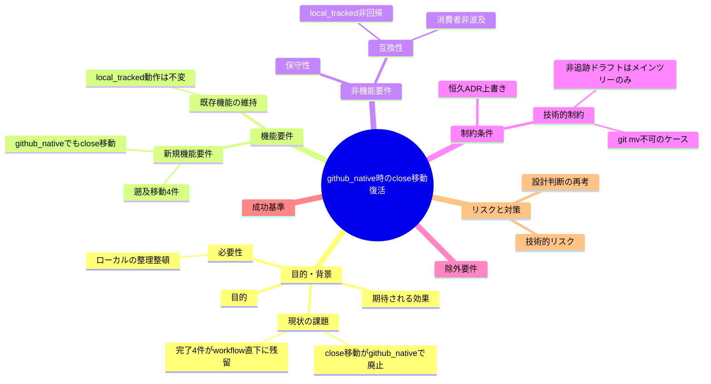
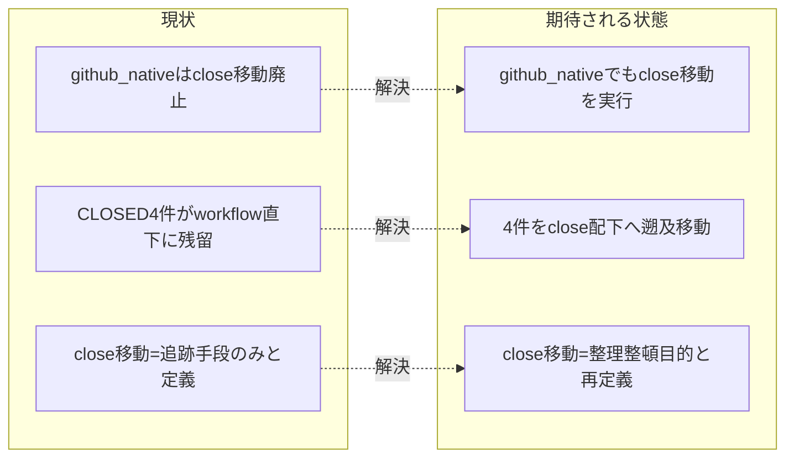

# 要求定義書: github_native モードでも完了 issue を close/ へ移動する

**プロジェクト名**: github_native モードでも完了 issue を close/ へ移動する
**作成日**: 2026 年 07 月 17 日
**最終更新**: 2026 年 07 月 17 日

> **重要**:
>
> - 要求定義書は、プロジェクトの全体像を把握するためのものです。詳細な技術仕様や実装方法は要件定義書以降で記載します。
> - **このドキュメントは常に更新**: 要求の変更や追加があった場合は、即座に更新してください。
>
> **用語**: [.agent-skill-chain/source/CONCEPTS.md §用語規約](../../../../../.agent-skill-chain/source/CONCEPTS.md#用語規約) を参照。

---

## 要求定義の全体像

**注意**:

- マインドマップは全体像を把握するためのものです。詳細は各節に記載します。

---

## 1. 目的・背景

### 1.1 目的（必須）

github_native でも完了 issue を close/ へ移動し、進行中と完了を分離整理する。

### 1.2 背景

- **現状の課題**:
  - **設計判断の矛盾**: 2026-07-17 の S-2（親 GitHub Issue #115・本リポの `ISSUE_TRACKING_MODE=github_native` 採用）で「github_native では `close/` への移動（`git mv`）を行わず、GitHub Issue 自体の close で完結する」と設計判断された（ADR-S2-5・ADR-S2-toggle）。この判断は `.agent-skill-chain/source/workflow/PHASES.md §完了 issue の close 移動`・`.agent-skill-chain/source/boot/CORE.md §完了 issue の close 分離`・`.agent-skill-chain/source/skills/agent/run_command.md §Constraints`・`.agent-skill-chain/project/自己拡張ワークフロー.md` の正本ドキュメントに明記されている。
  - **ユーザー指摘（本 issue の起点）**: プロジェクトオーナーから「それは間違っている。完了と同時に close に移動させるべきはず。ルールがそうなっていないならそれはバグだ」との指摘があった。すなわち close/ 移動は GitHub Issue の close 状態に関わらず、完了ドキュメントの**ローカル整理**として実行されるべきという要求。
  - **残留の実測**: 対応する GitHub Issue がすべて CLOSED であるにもかかわらず、以下 4 件の完了 issue ディレクトリが `docs/maintainer/workflow/` 直下に残ったまま（`close/` へ未移動）である。
    - `20260715_160558_issue運用ポリシー全面移行`（Issue #115・CLOSED）
    - `20260716_013937_worktree運用規律`（Issue #119・CLOSED）
    - `20260717_071859_デザイナー視点組込`（Issue #127・CLOSED）
    - `20260717_124638_workflow-db監査証跡のworktree横断完全性`（Issue #132・CLOSED）
  - **矛盾の根因（目的認識の相違）**: S-2 は close 移動を**純粋に「issue 追跡（tracking）の手段」**と捉えていた。「GitHub Issue が tracking の single source of truth になるなら、ローカルの close/ 移動という複製的作業は不要」という論理である（ADR-S2-5 の帰結・恒久判断は DECISIONS.md へ転記）。一方でユーザーは close/ 移動を**「ローカルリポジトリの整理整頓（完了ドキュメントと進行中ドキュメントを分離し、`workflow/` 直下を active issue のみに保つ）」という別の目的**の手段として捉えている。この目的の違いが矛盾の本質であり、単純な実装漏れ・見落としではなく、**恒久設計判断（ADR-S2-toggle / ADR-S2-5）の前提（close 移動 ＝ 追跡手段のみ）を再考する必要がある指摘**である。

- **必要性**:
  - `workflow/` 直下が完了 issue で埋まると、進行中 issue の把握が困難になる（active/completed の混在）。整理整頓は tracking モードに依らず必要。
  - 既に CLOSED である 4 件が未移動のまま放置されており、遡及的な是正が必要。
  - 恒久設計判断を覆すため、根拠を DECISIONS.md へ新規 ADR として記録し、正本ドキュメントの記述を整合させる必要がある。

### 1.3 期待される効果（必須: 1 件以上）

- **効果 1**: github_native 実効環境でも、完了と判断された issue ディレクトリが `docs/maintainer/workflow/close/<issue>/` へ移動され、`workflow/` 直下が active issue のみになる（○/×判定可能: 完了 issue が close/ 配下に存在するか）。
- **効果 2**: 既に CLOSED の 4 件が close/ へ移動され、残留 0 件になる（○/×判定可能: 上記 4 ディレクトリが workflow/ 直下に無いこと）。
- **効果 3**: 恒久判断の矛盾が DECISIONS.md の新規 ADR（ADR-S2-toggle / ADR-S2-5 を上書き）と正本ドキュメント（PHASES.md / CORE.md / run_command.md / project）で解消される（○/×判定可能: 新規 ADR が存在し正本の記述が整合しているか）。

**現状と期待される状態の比較**:

---

## 2. 機能要件

### 2.1 既存機能の維持（該当する場合）

- **local_tracked モードの close 移動フロー**（PHASES.md §完了 issue の close 移動、PR 経由での確定）は**現行動作を維持**する。close 移動を github_native へ拡張する変更が local_tracked の既存挙動を破壊してはならない（回帰安全）。
- **audit.sh #33（`check_close_move_pending`）の local_tracked 検知**は維持する。
- **配布物 source の既定値 `local_tracked`・消費者環境へのフォールバック**は不変。消費者（github_native を採用しない環境）へ本変更が波及してはならない。

### 2.2 新規機能要件

- **github_native モードでも close 移動を行う**: 完了検知（verify-and-close 完了 ＋ トップレベルとして残タスク無し）した issue ディレクトリを `close/` へ移動する仕組みを github_native でも有効化する。
- **遡及移動**: 既に CLOSED の 4 件を close/ へ一括是正移動する。
- **非追跡ドラフトの移動対応**: github_native では issue ドラフト（00〜04）が `.gitignore` 対象（非追跡）でありメインツリーにのみ実体が存在する。この制約下で正しく移動できる手順を定義する。
- **恒久 ADR の上書きと正本整合**: ADR-S2-toggle / ADR-S2-5 を上書きする新規 ADR を DECISIONS.md へ記録し、PHASES.md / CORE.md / run_command.md / project 自己拡張ワークフロー.md の該当記述を整合させる。
- **audit.sh #33 の再定義**: github_native 時に #33 が close 未移動を検知すべきか（現状は冒頭 SKIP）を再設計する。

---

## 3. 非機能要件

### 3.1 パフォーマンス

- 移動処理は少数のディレクトリ操作であり、パフォーマンス要件は特に無い。

### 3.2 セキュリティ

- 認証トークン等の機密を成果物・ログに残さない（既存規約に従う）。

### 3.3 互換性

- **local_tracked 非回帰**: 既存 local_tracked の close 移動フロー・audit.sh #33 検知が完全一致で維持されること（差分 0）。
- **消費者非波及**: 配布物 source の既定挙動（unset → local_tracked、非 github remote → local_tracked）が不変であること。
- **既存追跡ファイルの温存**: 4 件のうち追跡済みファイル（.gitignore 導入前作成分）を移動しても git 履歴が失われないこと。

### 3.4 保守性

- 恒久判断の矛盾を DECISIONS.md に自己完結的に記録し、正本 1 か所主義（1 ファイル 1 責務・重複禁止）を維持する。
- close 移動の抽象原則（コア）／具体手順（project）の配置境界を維持する。

---

## 4. 制約条件

### 4.1 技術的制約

- **非追跡ドラフトはメインツリーにのみ実体がある（最重要）**: github_native で新規作成される issue ドラフト（00〜04）は `.gitignore` の 5 パターン（`docs/maintainer/workflow/**/{00_要求定義,01_要件定義,02_設計,03_実装計画,04_review}.md`）で非追跡化される。git worktree は追跡ファイルのみを複製するため、非追跡ドラフトは**メインの作業ツリーにしか実体が存在しない**。worktree で `git mv`（または `mv`）を試みても対象ファイルが存在しない。したがって close 移動作業（遡及分・今後分とも）は、**必ずメインツリーで実行するか、メインツリーから対象ファイルを明示的に worktree へコピーしてから作業する**必要がある。これは直前の別 issue（#132・ADR-132-1）で発生した `workflow.db` の worktree 非共有問題と同型の注意点である。
- **移動対象のファイル追跡状態が混在する**: 4 件の残留のうち、最初の 3 件（#115・#119・#127）は `.gitignore` 導入（S-2）前に作成されたため 00〜04 が**追跡済み**（`git mv` が可能・移動しても履歴保持）。4 件目（#132）は S-2 後の作成で全ドラフトが**非追跡**（追跡ファイル 0 件・`git mv` 不可・`mv` で移動）。同一是正内でこの混在を正しく扱う必要がある。
- **`git mv` と gitignore の相互作用**: 非追跡かつ gitignore 一致のドラフトを close/ 配下へ移動しても、close/ も `docs/maintainer/workflow/` 配下のため同じ 5 パターンに一致し依然 gitignore 対象のまま（追跡化されない）。整理整頓（active listing から消える）目的は達成できるが、追跡状態は変わらない点を設計で明示すること。
- **恒久 ADR の上書き**: ADR-S2-toggle / ADR-S2-5（本リポの恒久設計判断）を覆す変更であり、DECISIONS.md へ「〜を上書きする」新規 ADR を追記し、旧エントリは履歴として残す（DECISIONS.md 記録手順）。
- **enforcement env の AI 自律設定禁止**: `ISSUE_TRACKING_MODE` 自体は変更しない（本 issue は github_native を維持したまま close 移動の要否を再設計する。env トグルの自律変更は AGENT_CONDUCT で禁止）。

### 4.2 既存システムとの互換性

- **変更対象は `.agent-skill-chain/source/`（配布パッケージ正本＝CORE）・`.agent-skill-chain/project/`（本リポ具体化）・`enforcement/ci/audit.sh`・`docs/maintainer/decisions/DECISIONS.md`**。local_tracked の既存挙動・消費者フォールバックを壊さない。
- 4 件の遡及移動時、`.claude/settings.json` の `close/**` 配下 Read/Grep/Glob deny 設定により**移動後の close/ 配下は読み取り不可**。相対リンク補正・検証は必ず移動前に完結させる（PHASES.md §完了 issue の close 移動「検証は必ず移動前に行う」）。

### 4.3 移行期間・スケジュール

- 本 issue は要求 → 要件 → 設計 → 実装計画 → 実装 → レビューの full プロセスで進める。遡及移動（4 件）を本 issue のスコープに含めるか別途対応とするかは設計フェーズで確定する（初期論点として本書 §5・要件へ申し送り）。

---

## 5. 除外要件

- **`ISSUE_TRACKING_MODE` の値変更・モード設計そのものの見直し**: 本 issue は github_native を維持したまま close 移動の要否のみを再設計する。二値モードの枠組み自体は変えない。
- **消費者ランタイム向けの close 移動仕様の変更**: local_tracked の既存フローは維持し、変更しない。
- **worktree 削除時の退避機構（R8）の enforce 再有効化**（ADR-132-2 の (e)）は本 issue のスコープ外（別 issue / 人間判断へ申し送り済み）。
- **audit step 全体のブロッキング化**（自己拡張ワークフロー §3.5 の申し送り）は対象外。

---

## 6. 成功基準（必須: 1 件以上）

- **SC1**: github_native 実効モードで、完了検知した issue ディレクトリを `docs/maintainer/workflow/close/<issue>/` へ移動する運用・仕組みが正本ドキュメント（PHASES.md / CORE.md / run_command.md / project）に定義され、記述が相互整合している（○/×: 新規 ADR と 4 正本の記述が矛盾しないこと）。
- **SC2**: 既に CLOSED の 4 件（#115・#119・#127・#132）が `close/` 配下へ移動され、`workflow/` 直下の残留が 0 件になる（○/×: 上記 4 ディレクトリが workflow/ 直下に存在しないこと）。
- **SC3**: 遡及移動・今後の移動とも、非追跡ドラフトがメインツリーにのみ存在する制約を満たす手順（メインツリー実行 or worktree へコピー）が受け入れ基準・手順に明記され、追跡/非追跡混在（3 件追跡・1 件非追跡）を正しく扱える（○/×: 混在ケースの手順が定義され、移動後に喪失・不整合が無いこと）。
- **SC4**: DECISIONS.md に ADR-S2-toggle / ADR-S2-5 を上書きする新規 ADR（5 要素・evidence_source 付き）が追記され、旧エントリは履歴として残る（○/×: 新規 ADR の存在）。
- **SC5**: local_tracked 非回帰（既存 close 移動フロー・audit.sh #33 検知が差分 0 で維持）・消費者非波及（配布物既定 local_tracked 不変）が独立検証で確認される（○/×: 回帰検証 PASS）。
- **SC6**: audit.sh #33（`check_close_move_pending`）の github_native 時の振る舞いが再設計され（現状の冒頭 SKIP を維持するか・検知に変えるかを決定）、その決定が実装・記述と一致する（○/×: #33 の設計判断と実装の一致）。

---

## 7. リスクと対策

### 7.1 技術的リスク

- **リスク**: worktree で close 移動を試み、非追跡ドラフトが存在せず移動が空振り・不完全になる（#132 の workflow.db 問題と同型の事故）。
  - **対策**: 「close 移動はメインツリーで実行する（または対象をメインツリーから worktree へコピーしてから作業する）」を受け入れ基準・手順に明記。設計フェーズで実行場所を確定する。
- **リスク**: 4 件の遡及移動時、追跡/非追跡混在を取り違え、追跡ファイルを `mv` して git 履歴上の move を失う／非追跡ファイルに `git mv` を試みて失敗する。
  - **対策**: 各ディレクトリの追跡状態を移動前に判定し、追跡＝`git mv`・非追跡＝`mv` を使い分ける手順を定義する。
- **リスク**: 移動後の close/ 配下が deny 設定で読めず、リンク補正の検証が不能になる。
  - **対策**: 相対リンク補正・検証を必ず移動前に完結させる（既存規約を厳守）。

### 7.2 スケジュールリスク

- **リスク**: 遡及移動をスコープに含めると設計・実装が肥大化する。
  - **対策**: 遡及移動を本 issue に含めるか別対応とするかを設計フェーズで判断（初期論点）。含める場合も追跡/非追跡の混在手順を先に確定する。

---

## 8. 参考資料

### プロジェクトドキュメント

- `docs/maintainer/decisions/DECISIONS.md`（ADR-S2-toggle・ADR-S2-4・ADR-S2-5・ADR-132-1・ADR-132-2）
- `.agent-skill-chain/source/workflow/PHASES.md` §完了 issue の close 移動
- `.agent-skill-chain/source/boot/CORE.md` §完了 issue の close 分離
- `.agent-skill-chain/source/skills/agent/run_command.md` §Constraints「Issue 追跡モード」
- `.agent-skill-chain/project/自己拡張ワークフロー.md` §完了 issue の close 移動（上書き）・§Issue 追跡モードの本リポ運用
- `enforcement/ci/audit.sh` の `check_close_move_pending`（#33）・`resolve_issue_tracking_mode`

### その他の参考資料

- 親 GitHub Issue #115（issue 運用ポリシーの GitHub Issue 中心への全面移行）
- S-2 サブ issue `.../90_issues/20260716_174958_S-2本リポgithub_native採用/`

---

## 9. 次のステップ

この要求定義書の承認後、以下のドキュメントを作成します：

- **次**: [`01_要件定義.md`](./01_要件定義.md) - 要件定義フェーズ
