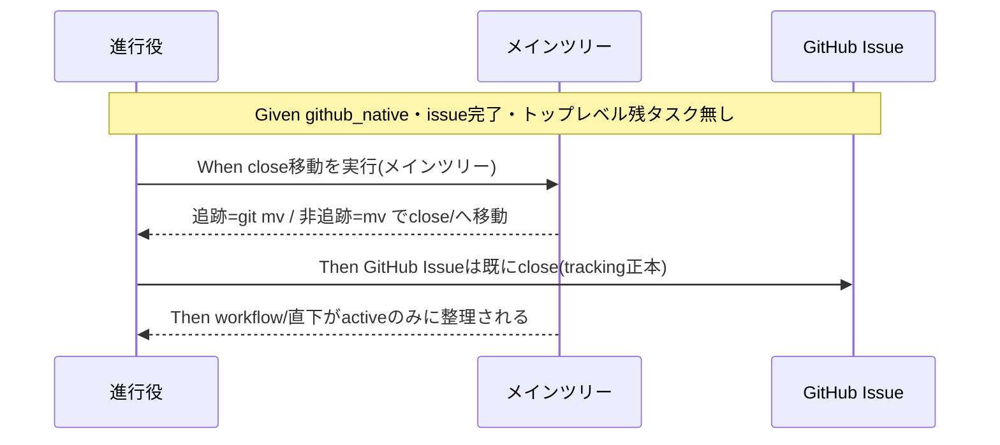

# 要件定義書: github_native モードでも完了 issue を close/ へ移動する

**プロジェクト名**: github_native モードでも完了 issue を close/ へ移動する
**作成日**: 2026 年 07 月 17 日
**最終更新**: 2026 年 07 月 17 日

> **重要**: このドキュメントは常に更新。要件の変更や追加があれば即座に更新すること。
>
> **用語**: [.agent-skill-chain/source/CONCEPTS.md §用語規約](../../../../../.agent-skill-chain/source/CONCEPTS.md#用語規約) を参照。

---

## 1. 概要

### 1.1 システム概要

本リポジトリ（`techbeansjp-free/AGENTS.md`）は worktree skill chain フレームワーク自体を開発するセルフホスト・プロジェクトである。2026-07-17 の S-2 で `ISSUE_TRACKING_MODE=github_native` を採用し、「github_native では完了 issue の `close/` 移動を行わず GitHub Issue の close で完結する」と設計判断した（ADR-S2-toggle / ADR-S2-5）。

本 issue は、この設計判断を**「close 移動 ＝ 追跡手段のみ」という前提の誤り**として捉え直し、close 移動を**「ローカルリポジトリの整理整頓（進行中と完了の分離）」という別目的の運用**として github_native でも復活させる。あわせて、既に CLOSED でありながら `workflow/` 直下に残留する 4 件を遡及是正する。

### 1.2 用語集

| 用語 | 説明 |
| ---- | ---- |
| close 移動 | 完了したトップレベル issue ディレクトリを `docs/maintainer/workflow/close/<issue>/` へ移す運用（本リポ配置先）。追跡ファイルは `git mv`、非追跡ファイルは `mv`。 |
| github_native | `ISSUE_TRACKING_MODE=github_native` かつ `git remote` に github.com を含む場合の実効モード。GitHub Issue を tracking の正本とする。 |
| local_tracked | 既定モード。ローカル issue ドキュメント（00〜04）を正本とし、完了時に close/ へ移動する。非 GitHub・未設定・不明値のフォールバック先。 |
| 非追跡ドラフト | github_native で `.gitignore` の 5 パターンにより非追跡化された issue ドラフト（00〜04）。git worktree に複製されず、メインの作業ツリーにのみ実体がある。 |
| 追跡状態の混在 | 4 件の残留のうち #115/#119/#127 は追跡済み（gitignore 導入前作成）、#132 は非追跡（導入後作成）である状態。 |
| audit #33 | `enforcement/ci/audit.sh` の `check_close_move_pending`。verify-and-close 完了だが close/ 未移動かつ猶予超過を検知。現状 github_native 時は冒頭 SKIP。 |
| 整理整頓目的 | close 移動を tracking ではなく「workflow/ 直下を active issue のみに保つ」ために行うという本 issue の目的認識。 |

---

## 2. 機能要件

### 2.1 ユーザーストーリー

#### ストーリー 1: github_native でも完了 issue が整理される

- **As a** 本リポの保守者（進行役エージェント含む）
- **I want to** github_native 実効環境でも、完了した issue ディレクトリを `close/` へ移動できるようにしたい
- **So that** `workflow/` 直下が active issue のみになり、進行中の把握が容易になる（整理整頓）

**受け入れ基準**:

- github_native 実効モードで、完了検知（verify-and-close 完了 ＋ トップレベル残タスク無し）した issue の close 移動運用が正本ドキュメント（PHASES.md / CORE.md / run_command.md / project 自己拡張ワークフロー.md）に定義される。
- close 移動が「tracking 手段」ではなく「ローカル整理整頓」を目的とすることが明記され、GitHub Issue の close 状態と独立に（またはそれをトリガーとして）実行されることが定義される。
- 実行確定手段（GitHub 連携時は PR 経由／人間関与点を経る）が github_native でも矛盾なく適用できる形で記述される。

#### ストーリー 2: 既に CLOSED の 4 件が是正される

- **As a** 本リポの保守者
- **I want to** 既に CLOSED でありながら workflow/ 直下に残る 4 件を close/ へ移動したい
- **So that** 現状の残留（バグ状態）が解消される

**受け入れ基準**:

- `20260715_160558_issue運用ポリシー全面移行`（#115）・`20260716_013937_worktree運用規律`（#119）・`20260717_071859_デザイナー視点組込`（#127）・`20260717_124638_workflow-db監査証跡のworktree横断完全性`（#132）が `docs/maintainer/workflow/close/` 配下へ移動される。
- 移動後、`workflow/` 直下（close/ を除く）に上記 4 ディレクトリが存在しない。
- 追跡済み 3 件は `git mv`（git 履歴の move として記録）、非追跡 1 件（#132）は `mv` で移動し、いずれも喪失・不整合が無い。
- 遡及移動を本 issue のスコープに含めるか別対応とするかの決定が設計フェーズで確定し、含める場合は本受け入れ基準を満たす。

#### ストーリー 3: 非追跡ドラフトを安全に移動できる

- **As a** close 移動を実行する進行役エージェント
- **I want to** 非追跡ドラフトがメインツリーにのみ存在する制約下でも正しく移動したい
- **So that** worktree での空振り・喪失事故（#132 の workflow.db 問題と同型）を防げる

**受け入れ基準**:

- close 移動作業（遡及分・今後分とも）は**メインツリーで実行する**か、**メインツリーから対象をコピーしてから worktree で作業する**ことが手順・受け入れ基準に明記される。
- worktree で `git mv`/`mv` を実行しても非追跡ドラフトが存在しないため空振りする、という失敗経路が手順で回避される。
- 追跡/非追跡の判定を移動前に行い、`git mv`（追跡）／`mv`（非追跡）を使い分ける手順が定義される。

#### ストーリー 4: 恒久判断の矛盾が解消される

- **As a** 本リポの保守者
- **I want to** ADR-S2-toggle / ADR-S2-5 の「close 移動は github_native で不要」という恒久判断を、新しい判断で上書きしたい
- **So that** 正本ドキュメントとユーザー要求の矛盾が解消され、以後のエージェントが正しく振る舞う

**受け入れ基準**:

- DECISIONS.md に ADR-S2-toggle / ADR-S2-5 を上書きする新規 ADR（5 要素・evidence_source 付き）が追記され、旧エントリは履歴として残る（改変しない）。
- PHASES.md §完了 issue の close 移動・CORE.md §完了 issue の close 分離・run_command.md §Constraints「Issue 追跡モード」・project 自己拡張ワークフロー.md の該当記述が新判断と整合するよう更新される。
- 1 ファイル 1 責務・重複禁止（正本 1 か所主義）が維持される。

#### ストーリー 5: local_tracked と消費者が壊れない

- **As a** 本リポの保守者・下流の消費者
- **I want to** close 移動の github_native 拡張が既存 local_tracked 挙動と消費者環境を壊さないことを保証したい
- **So that** 回帰・波及事故を防げる

**受け入れ基準**:

- local_tracked の close 移動フロー・audit.sh #33 検知が本変更後も差分 0 で維持される（独立検証で確認）。
- 配布物 source の既定挙動（env unset → local_tracked、非 github remote → local_tracked）が不変で、消費者へ本変更が波及しない。
- audit.sh #33 の github_native 時の振る舞い（現状 SKIP を維持するか／検知へ変えるか）が再設計され、決定が実装・記述と一致する。

### 2.2 BDD ユースケース

#### ユースケース 1: github_native で完了 issue を close 移動する

github_native 実効モードで、完了検知した issue を整理整頓目的で close/ へ移動する。

**シナリオ 1: 完了検知した issue を close へ移動する**

```gherkin
Feature: github_native での close 移動
  Scenario: 完了 issue の close 移動
    Given ISSUE_TRACKING_MODE=github_native かつ github.com remote の環境
    And あるトップレベル issue が verify-and-close 完了しトップレベル残タスクが無い
    When 進行役が close 移動を実行する
    Then その issue ディレクトリが docs/maintainer/workflow/close/<issue>/ へ移動される
    And workflow/ 直下（close/ を除く）に当該 issue が存在しない
```

**シナリオ 2: 移動はメインツリーで実行する**

```gherkin
Feature: 非追跡ドラフトの移動場所制約
  Scenario: 非追跡ドラフトをメインツリーで移動する
    Given github_native で issue ドラフト(00〜04)が .gitignore 対象(非追跡)
    And 非追跡ドラフトはメインの作業ツリーにのみ実体がある
    When close 移動を worktree で実行しようとする
    Then 対象ファイルが worktree に存在せず移動が空振りすることを手順が回避する
    And 移動はメインツリーで実行される(またはメインツリーからコピー後に作業する)
```

**処理フロー**:



#### ユースケース 2: 追跡/非追跡混在の 4 件を遡及移動する

既に CLOSED の 4 件を、追跡状態の混在を正しく扱って一括是正する。

**シナリオ 1: 追跡済みディレクトリは git mv で移動する**

```gherkin
Feature: 遡及移動(追跡済み)
  Scenario: gitignore導入前作成の追跡済み3件をgit mvで移動
    Given #115/#119/#127 は 00〜04 が追跡済み
    When 遡及移動を実行する
    Then git mv で close/ 配下へ移動され git 履歴に move が記録される
    And 移動前に相対リンク補正・検証が完結している
```

**シナリオ 2: 非追跡ディレクトリは mv で移動する**

```gherkin
Feature: 遡及移動(非追跡)
  Scenario: gitignore導入後作成の非追跡1件をmvで移動
    Given #132 は追跡ファイル0件(全ドラフト非追跡)でメインツリーのみに実体
    When 遡及移動をメインツリーで実行する
    Then mv で close/ 配下へ移動される(git mv は非追跡に対し不可)
    And 移動後 workflow/ 直下に #132 が存在しない
```

#### ユースケース 3: 恒久判断を上書きし正本を整合させる

**シナリオ 1: 新規 ADR で旧判断を上書きする**

```gherkin
Feature: 恒久ADRの上書き
  Scenario: ADR-S2-toggle/ADR-S2-5を新規ADRで上書き
    Given DECISIONS.md に ADR-S2-toggle・ADR-S2-5 が存在する
    When close移動をgithub_nativeでも行う決定を記録する
    Then 新規ADR(5要素・evidence_source付き)が「〜を上書きする」旨で追記される
    And 旧エントリは改変されず履歴として残る
    And PHASES.md/CORE.md/run_command.md/project の記述が新判断と整合する
```

#### ユースケース 4: 回帰安全・非波及を保証する

**シナリオ 1: local_tracked が差分 0 で維持される**

```gherkin
Feature: 回帰安全
  Scenario: local_tracked非回帰
    Given 同一 workflow.db・同一ディレクトリ
    When 変更前後の audit.sh を local_tracked env で実行する
    Then FAIL 集合が完全一致(差分0)する
    And local_tracked の close 移動フローが変わらない
```

**シナリオ 2: 消費者へ波及しない**

```gherkin
Feature: 消費者非波及
  Scenario: 配布物既定の不変
    Given env unset または 非 github remote の消費者環境
    When resolve_issue_tracking_mode を評価する
    Then local_tracked を返し既存挙動が維持される
    And 配布物 source の既定値・フォールバックが不変である
```

### 2.3 ビジネスルール

- **close 移動の目的は整理整頓であり tracking ではない**（本 issue の中核判断）。GitHub Issue の close は tracking の正本、close/ 移動はローカル整理整頓であり、両者は独立した別目的である。
- **close 移動はメインツリーで実行する**（非追跡ドラフトがメインツリーにのみ存在するため）。worktree で実行する場合はメインツリーから対象をコピーしてから行う。
- **追跡状態で移動コマンドを使い分ける**（追跡＝`git mv`・非追跡＝`mv`）。
- **相対リンク補正・検証は移動前に完結させる**（移動後の close/ 配下は deny 設定で読めない）。
- **恒久判断の上書きは新規 ADR で行い旧エントリは残す**（DECISIONS.md 記録手順）。
- **local_tracked と消費者を壊さない**（回帰安全・非波及）。
- **`ISSUE_TRACKING_MODE` env 自体は変更しない**（github_native を維持したまま close 移動の要否を再設計する）。

---

## 3. 非機能要件

### 3.1 パフォーマンス要件

- 少数ディレクトリのファイル操作であり特段の要件は無い。

### 3.2 セキュリティ要件

- 認証トークン実値・機密を成果物・memo・workflow.db・ログに残さない。

### 3.3 ユーザビリティ要件

- `workflow/` 直下が active issue のみになり、進行中/完了の区別が一目で付くこと。
- audit #33 の FAIL/SKIP メッセージが再設計後の挙動と一致し、保守者を誤誘導しないこと。

### 3.4 可用性要件

- 移動失敗・空振り時に成果物が喪失しないこと（メインツリー実行・移動前検証で担保）。

---

## 4. 外部インターフェース要件

### 4.1 API 要件

- 外部 API 新設は無い。既存の `gh`（Issue 状態確認）・`git mv`/`mv`・`git worktree`・`enforcement/ci/audit.sh`・`resolve_issue_tracking_mode` を利用する。

### 4.2 データ形式要件

- DECISIONS.md の ADR は 5 要素（コンテキスト・検討した選択肢・決定・根拠[evidence_source]・帰結）で記録する。
- frontmatter・成果物フォーマットは既存テンプレートに従う。

---

## 5. 制約事項

- **非追跡ドラフトはメインツリーにのみ実体がある**（最重要制約・00 §4.1）。close 移動はメインツリーで実行する。
- **4 件の追跡状態が混在する**（3 件追跡・1 件非追跡）。移動コマンドを使い分ける。
- **close/ も gitignore 5 パターンに一致する**ため、非追跡ドラフトを close/ へ移しても追跡化されない（整理整頓目的は達成、追跡状態は不変）。設計で明示する。
- **恒久 ADR（ADR-S2-toggle / ADR-S2-5）の上書き**であり DECISIONS.md へ新規 ADR を追記する。
- **`.claude/settings.json` の close/** deny** により移動後の検証不可。検証は移動前に完結。
- **変更対象**: `.agent-skill-chain/source/`（CORE）・`.agent-skill-chain/project/`（本リポ具体化）・`enforcement/ci/audit.sh`・`docs/maintainer/decisions/DECISIONS.md`。local_tracked・消費者フォールバックは不変。
- **設計フェーズで確定すべき初期論点**（要件段階では列挙のみ）:
  1. **トリガー**: GitHub Issue の close イベントを検知するのか、ローカルの完了検知（verify-and-close 完了）と紐づけるのか、GitHub 側 close 状態を都度確認するのか。
  2. **local_tracked フローの流用可否**: 既存の close 移動フロー（PR 経由確定）を github_native でも流用できるか、別設計が必要か（非追跡ドラフトは PR で追跡変更を確定できない点に注意）。
  3. **遡及移動のスコープ**: 4 件を本 issue に含めて一括是正するか、別対応とするか。
  4. **audit #33 の再設計**: github_native 時に SKIP を維持するか、検知へ変えるか。非追跡ドラフトを対象にできない（追跡ファイル起点の走査）点との整合。

---

## 6. 参考資料

### プロジェクトドキュメント

- [`00_要求定義.md`](./00_要求定義.md) - 要求定義
- `docs/maintainer/decisions/DECISIONS.md`（ADR-S2-toggle・ADR-S2-4・ADR-S2-5・ADR-132-1・ADR-132-2）
- `.agent-skill-chain/source/workflow/PHASES.md` §完了 issue の close 移動
- `.agent-skill-chain/source/boot/CORE.md` §完了 issue の close 分離
- `.agent-skill-chain/source/skills/agent/run_command.md` §Constraints「Issue 追跡モード」
- `.agent-skill-chain/project/自己拡張ワークフロー.md` §完了 issue の close 移動（上書き）・§Issue 追跡モードの本リポ運用
- `enforcement/ci/audit.sh` `check_close_move_pending`（#33）・`resolve_issue_tracking_mode`

### その他の参考資料

- 親 GitHub Issue #115（issue 運用ポリシー全面移行）
- ユーザー指摘（2026-07-17）: 「完了と同時に close へ移動させるべき。ルールがそうなっていないならバグ」「close 移動はメインのディレクトリで対応する必要がある（workflow.db をメインで更新するのと同じ理由）」

---

## 7. 前のステップ

- **前**: [`00_要求定義.md`](./00_要求定義.md) - 要求定義フェーズ

---

## 8. 次のステップ

- **次**: [`02_設計.md`](./02_設計.md) - 設計フェーズ
