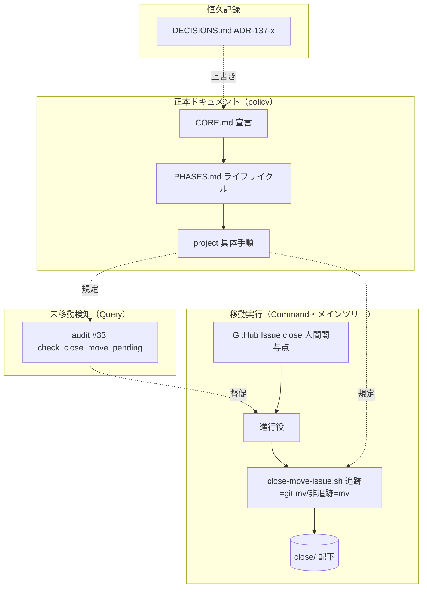
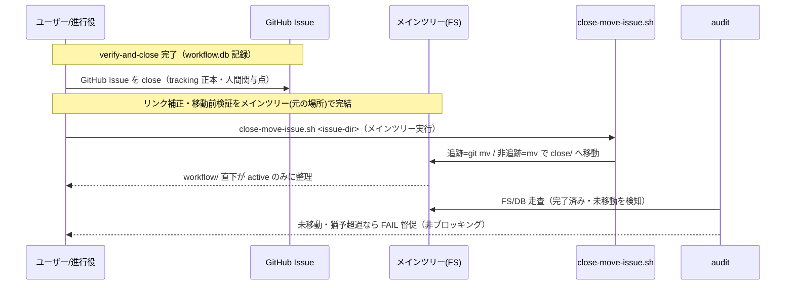
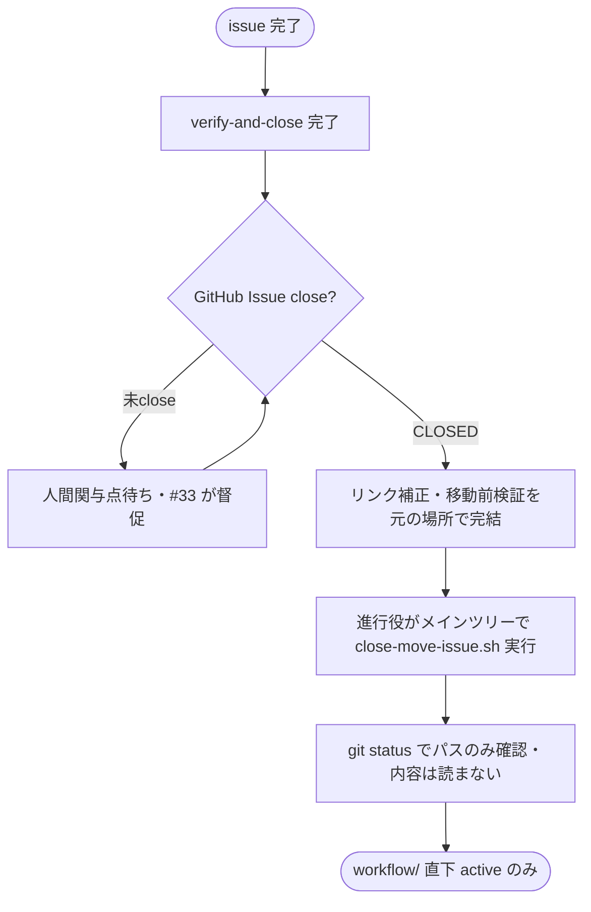

# 設計書: github_native モードでも完了 issue を close/ へ移動する

**プロジェクト名**: github_native モードでも完了 issue を close/ へ移動する
**作成日**: 2026 年 07 月 17 日
**最終更新**: 2026 年 07 月 17 日

> **重要**: **このドキュメントは常に更新**: 設計の変更や追加があった場合は、即座にこのドキュメントを更新してください。ドキュメントは「生きているドキュメント」として扱い、実装内容と常に同期させます。
>
> **用語**: [.agent-skill-chain/source/CONCEPTS.md §用語規約](../../../../../.agent-skill-chain/source/CONCEPTS.md#用語規約) を参照。

---

## 1. 設計概要

### 1.1 設計方針

本 issue は「close 移動 ＝ 追跡手段のみ」という S-2 の前提を「close 移動 ＝ ローカル整理整頓（進行中と完了の分離）」へ再定義し、github_native でも close 移動を復活させる。実装は**既存正本ドキュメントの記述整合（分岐追加）・既存 audit #33 の SKIP 撤廃・軽量ヘルパースクリプト 1 本の新設・恒久 ADR の上書き**に限定し、`ISSUE_TRACKING_MODE` の二値モード枠組み・local_tracked の既存挙動・消費者フォールバックには一切手を入れない（最小差分・回帰安全）。

### 1.2 設計原則（本プロジェクトで適用するもの）

- **UNIX哲学**: close 移動の機械部分（追跡=`git mv`／非追跡=`mv` の使い分け）を単一責務の小さなヘルパースクリプト 1 本に切り出し、既存フローと組み合わせ可能にする。
- **単一責務**: 「完了検知（Query）」「移動実行（Command）」「未移動検知（audit Query）」「恒久記録（DECISIONS.md）」を混在させず責務分離する。
- **明確な境界**: 抽象原則＝`source/`（CORE/PHASES/run_command）、本リポ具体手順＝`project/`、機械監査＝`audit.sh`、恒久判断＝`DECISIONS.md` の既存配置境界を維持する。
- **CQRS**: 移動実行（状態変更＝ヘルパースクリプト・進行役）と未移動検知（状態取得＝audit #33 は FS/DB を読むのみで書き込まない）を分離する。
- **AIフレンドリー設計**: 「github_native の close 移動はメインツリーで実行する」「追跡=git mv/非追跡=mv」を明示的な短い規則として正本へ書き、後続エージェントが迷わないようにする。

---

## 2. アーキテクチャ設計

### 2.1 責務・境界・参照関係

#### 2.1.1 責務一覧

| コンポーネント | 責務（1 文） |
| -------------- | ------------ |
| CORE.md §完了 issue の close 分離（宣言） | close 移動が両モードで必要（整理整頓目的）であることを宣言する。 |
| PHASES.md §完了 issue の close 移動（ライフサイクル） | いつ・どう移動するかを定め、github_native の人間関与点（GitHub Issue close）分岐を追加する。 |
| run_command.md §Constraints「Issue 追跡モード」 | close 移動が local_tracked 専用でない旨へ記述を改める（抽象原則）。 |
| project 自己拡張ワークフロー.md（本リポ具体手順） | 実行主体（進行役）・実行場所（メインツリー）・両モードの close 移動具体手順・#33 の運用意味を記述する。 |
| `close-move-issue.sh`（新設ヘルパー・Command） | 単一 issue ディレクトリを、追跡ファイル=`git mv`／非追跡ファイル=`mv` で `close/` へ機械的に移動する（メインツリー実行ガード付き）。 |
| audit.sh `check_close_move_pending`（#33・Query） | 完了済みだが未移動のトップレベル issue を FS/DB 走査で検知する。github_native の一括 SKIP を撤廃する。 |
| DECISIONS.md | 本 issue の恒久判断（ADR-137-x）を追跡ファイルへ記録し、ADR-S2-toggle/ADR-S2-5 の該当部を上書きする。 |
| 遡及移動運用（進行役の実行） | CLOSED 済み 4 件を close/ へ実移動する（一回限りの是正運用）。 |

#### 2.1.2 境界

- **入力**: (a) GitHub Issue の close 状態（tracking 正本・人間関与点）、(b) verify-and-close 完了証跡（workflow.db）、(c) issue ディレクトリの実体（メインツリーにのみ存在する非追跡ドラフトを含む）。
- **出力**: (a) `docs/maintainer/workflow/close/<issue>/` へ移動されたディレクトリ、(b) audit #33 の未移動検知（FAIL/SKIP）、(c) DECISIONS.md の恒久記録。
- **他責務との境界（本 issue の範囲外）**: `ISSUE_TRACKING_MODE` env 値の変更・二値モード枠組みの見直し（除外要件）。audit #28（gitignore 配下 issue ドキュメント検知）の挙動変更（active ドラフトの非追跡は github_native の意図どおりであり #28 の github_native SKIP は正当・不変）。local_tracked の既存 close 移動フロー・消費者フォールバック（不変・回帰安全）。R8 退避機構の再有効化（別 issue へ申し送り済み）。

#### 2.1.3 参照関係

- **正本の委譲チェーン（維持）**: CORE.md（宣言）→ PHASES.md（ライフサイクル）→ project 自己拡張ワークフロー.md（本リポ具体手順）。1 ファイル 1 責務・重複禁止を保つ。
- audit #33（`check_close_move_pending`）→ `resolve_issue_tracking_mode`（**参照のみ・不変**。github_native の一括 SKIP 分岐だけを撤廃し、関数本体は変えない）。
- `close-move-issue.sh` →（外部）`git mv`／`mv`／`git status`。DECISIONS.md・audit.sh を参照しない（単一責務）。
- 循環参照は持たない。

### 2.2 システムアーキテクチャ

- **採用パターン**: ドキュメント正本（policy）＋機械監査（enforcement）＋運用ヘルパー（script）の 3 層構成。CQRS を運用フローへ適用する。
- **根拠**: spec/06「docs と実装の不整合を放置してはならない」「query に副作用を書いてはならない」。既存の本リポ構造（source 抽象／project 具体／audit 監査／DECISIONS 記録）を踏襲し、新パターンを持ち込まない（可読性・構造の一貫性を最優先）。

#### 2.2.1 CQRS（Command/Query 分離）

- **Command（状態変更）**: `close-move-issue.sh`（issue を close/ へ移動）・進行役による遡及移動・DECISIONS.md への ADR 追記。
- **Query（状態取得）**: audit #33（未移動検知・FS/DB 読み取りのみ・書き込みなし）・`resolve_issue_tracking_mode`（純関数）・GitHub Issue close 状態の参照（`gh issue view` 読み取り）。

#### 2.2.2 アーキテクチャ図

### 2.3 コンポーネント構成

- **policy 層（`source/` 抽象・`project/` 具体）**: 「close 移動は整理整頓目的であり両モードで必要」「github_native の人間関与点＝GitHub Issue close」「実行場所＝メインツリー」「追跡=git mv/非追跡=mv」を記述。抽象と具体の境界を維持。
- **enforcement 層（`audit.sh`）**: #33 の github_native 一括 SKIP を撤廃し、FS/DB 走査による未移動検知を両モードで有効化。Query に徹する（副作用なし）。
- **script 層（`close-move-issue.sh`）**: 移動の機械部分のみを担う単一責務コマンド。リンク補正・完了判断・GitHub 操作は含まない（呼び出し側の責務）。

### 2.4 データフロー

close 移動という「起きた事実」は既存の GitHub Issue close イベント（tracking 正本）で表現され、本設計は新規イベントを発行しない（イベント駆動は無理に導入しない・spec/06）。処理フローは以下。

### 2.5 横断設計判断（ADR）

> 本節の ADR は本 issue の重要判断であり、verify-and-close（04_review）フェーズで DECISIONS.md へ 5 要素で転記する（DECISIONS.md 記録手順・convention）。転記時の連番は ADR-137-1〜ADR-137-4 とし、ADR-S2-toggle/ADR-S2-5 の該当部を「上書きする」旨を明記する（旧エントリは改変せず履歴として残す）。

#### ADR-137-1: close 移動を「整理整頓目的」と再定義し github_native でも復活させる（ADR-S2-toggle/ADR-S2-5 の該当部を上書き）

- **コンテキスト**: S-2（親 Issue #115）は close 移動を「tracking の手段」と捉え、github_native では GitHub Issue の close で完結するため close 移動不要と判断した（ADR-S2-toggle 帰結・ADR-S2-5 コンテキスト・正本 4 文書に明記）。しかしプロジェクトオーナーから「close 移動は tracking ではなくローカル整理整頓（active/completed の分離）であり tracking モードに依らず必要。そうなっていないならバグ」との指摘があった。実測でも CLOSED 済み 4 件が `workflow/` 直下に残留している。
- **検討した選択肢**: (A) close 移動の目的を「整理整頓」と再定義し両モードで実行する。(B) S-2 の判断を維持し github_native では close 移動しない（現状）。(C) github_native 専用に close/ とは別の「アーカイブ」概念を新設する。
- **決定**: (A)。close 移動の目的を「ローカル整理整頓（workflow/ 直下を active issue のみに保つ）」と正本で再定義し、github_native でも実行する。
- **根拠 [evidence_source: human_decision]**: プロジェクトオーナーの明示指摘（要件 §6 記載・「完了と同時に close へ移動させるべき。ルールがそうなっていないならバグ」）。(B) はオーナー要求と矛盾し残留を放置。(C) は close/ という既存の完了分離概念があるのに二重概念を持ち込み単一責務・可読性を損なう（spec/06）。
- **帰結**: CORE.md/PHASES.md/run_command.md/project の「close 移動は local_tracked 専用／github_native では不要」の記述を上書きし、両モードで close 移動を行う。ADR-S2-toggle・ADR-S2-5 の該当部（close 移動不要）は上書きされ、旧エントリは履歴として残る。トリガー・実行主体・実行場所は ADR-137-2〜137-4 で確定する。

#### ADR-137-2: トリガー＝GitHub Issue close（人間関与点）、実行主体＝進行役、実行場所＝メインツリー

- **コンテキスト**: PHASES.md は close 移動の最終確定を「人間関与点」で経ることを要求する（local_tracked では PR マージ）。github_native の非追跡ドラフトは git diff に乗らず PR 経由確定が字義どおり成立しない。加えて非追跡ドラフトはメインツリーにのみ実体があり worktree の `git mv`/`mv` は空振りする（#132 の workflow.db 問題と同型）。本日の実例（#115/#119/#127/#132）は verify-and-close 完了と GitHub Issue close のタイミングが必ずしも一致せず、#115 は PR 群マージ後にユーザーが手動で close 確認した。
- **検討した選択肢**: (a) verify-and-close 完了時点で即座に close 移動まで一括実行する。(b) GitHub Issue が close したローカルディレクトリを検知して移動する（人間関与点＝GitHub Issue close をトリガーにする）。(c) 進行役が手動判断で都度移動する（トリガー規定なし）。
- **決定**: (b) を採用し、**GitHub Issue の close を github_native における人間関与点（＝local_tracked の PR マージに相当）とし、これをトリガー兼確定点とする**。実行主体は**進行役**（承認の直接性を持ち、メインツリーを操作する立場）。実行場所は**メインツリー**（非追跡ドラフトが実在する唯一の場所）。進行役は完了検知後に着手（リンク補正等）してよいが、最終確定は GitHub Issue close を経る。
- **根拠 [evidence_source: human_decision + existing_code]**: human_decision＝実例（#115 は close タイミングが verify-and-close と乖離）とオーナー指摘「close 移動はメインのディレクトリで対応する必要がある（workflow.db をメインで更新するのと同じ理由）」。existing_code＝PHASES.md「最終確定は必ず人間関与点を経る」の既存原則を github_native に写像（PR マージ→GitHub Issue close）。(a) は close タイミング乖離の実例に反し、verify-and-close 時点で未 close の issue を早期移動してしまう。(c) は silent skip（放置）を招く。サブエージェントはメインツリー直接変更禁止（CLAUDE.md）かつ非追跡ドラフトを worktree から見られないため、実行主体は進行役に限定される。
- **帰結**: github_native の close 移動フローが「GitHub Issue close（人間関与点）→ 進行役がメインツリーで移動」と確定する。「PR 経由確定」は非追跡ドラフトには適用されない旨を正本へ明記する（PR 経由が字義成立しない点の解消）。project 自己拡張ワークフロー.md §実行確定の 2 分岐 に github_native 分岐（分岐 C）を追加する。

#### ADR-137-3: 追跡/非追跡混在をファイル単位で扱うヘルパースクリプト `close-move-issue.sh` を新設する

- **コンテキスト**: 遡及 4 件は追跡状態が混在する。`git ls-files` の実測で #119/#127 は全追跡、#132 は全非追跡、**#115 は同一ディレクトリ内で追跡と非追跡が混在する**。ただし #115 の実態は「トップレベル 00〜04 追跡・配下非追跡」ではなく、**#115 はトップレベル 00〜04 を持たない親ワークフローディレクトリ**であり、直下は `90_issues.md`（**追跡**）と `90_issues/`（3 サブ issue）のみである。17 ファイル中 16 が追跡で、**唯一の非追跡ファイルは `90_issues/20260716_174958_S-2本リポgithub_native採用/04_review.md` の 1 件**（S-2 が gitignore 5 パターンを導入した後に作成された 04_review.md のため）。すなわち #115 は「ほぼ全追跡＋非追跡 1 件」の混在である。追跡ファイルへ `mv` すると git 履歴上の move を失い、非追跡ファイルへ `git mv` すると失敗するため、ファイル単位の判定が要る。今後の github_native issue も 00〜04・04_review 非追跡＋tests 等追跡が混在しうる。
- **検討した選択肢**: (A) ファイル単位で追跡状態を判定し追跡=`git mv`／非追跡=`mv` を使い分ける軽量ヘルパースクリプトを新設する。(B) 手順書のみ（人手で使い分け）。(C) ディレクトリ一括 `git mv`（非追跡ファイルが取り残される／エラーになる）。
- **決定**: (A)。単一 issue ディレクトリを受け取り、配下ファイルを追跡状態でファイル単位に使い分けて `close/<issue>/` へ移動する `close-move-issue.sh` を新設する。メインツリー外実行・既存 close/ 衝突はガードで拒否する。リンク補正・完了判断・GitHub 操作は含まない（呼び出し側責務・単一責務）。
- **根拠 [evidence_source: observed_runtime]**: `git ls-files` によるファイル別の追跡状態を実測（#115=16/17 追跡・唯一の非追跡は S-2 サブ issue の 04_review.md、#119=13/13 追跡、#127=10/10 追跡、#132=0/4 追跡）。混在はディレクトリ内でも発生する（#115・および将来の 00-04 非追跡＋tests 追跡の issue）ため (B)(C) では取り違え・履歴喪失リスクが残る（要件 §7.1 リスク）。ファイル単位の機械判定でメインツリーに実在する非追跡ドラフトの取りこぼしと追跡ファイルの履歴喪失を同時に防ぐ。
- **帰結**: 混在ケースを含む close 移動が機械的に正しく実行される。スクリプトは追加物であり既定挙動を変えない（消費者は呼ばない＝非波及）。**スクリプトの守備範囲は「非追跡ドラフト（メインツリーにのみ実在）を含むディレクトリを、メインツリーで移動する」機械部分に限定する**。追跡ファイルの close 移動を PR で確定する経路（分岐 A・feature branch→PR→マージ・main への direct push 禁止）はスクリプトの責務外であり、呼び出し側（進行役）の worktree+PR フローが担う（§5・ADR-137-2 と整合）。配置先・引数契約は §5 で確定する。

#### ADR-137-4: audit #33 の github_native 一括 SKIP を撤廃し、FS/DB 走査による未移動検知を両モードで有効化する（gh 依存は採らない）

- **コンテキスト**: 現状 #33（`check_close_move_pending`）は冒頭で実効モード github_native なら丸ごと SKIP する（「close 移動運用は廃止済み」前提）。ADR-137-1 で close 移動を両モード必要と再定義したため、この SKIP は矛盾する。一方 github_native の完了ドラフト（04_review.md 含む）は非追跡であり、CI（`actions/checkout`）は追跡ファイルのみ展開するため CI では走査対象が不在になる。GitHub Issue の CLOSED 状態を厳密トリガーにするには `gh` CLI（ネットワーク・認証依存）が必要になる。
- **検討した選択肢**: (A) github_native 一括 SKIP を撤廃し、既存の「verify-and-close 証跡＋猶予超過」FS/DB 走査ロジックを両モードで用いる（`gh` 非依存・決定論的・ローカル主体）。(B) SKIP を維持（現状・ADR-137-1 と矛盾）。(C) #33 を `gh issue view` で GitHub Issue CLOSED 状態を判定する形へ作り替える。
- **決定**: (A)。#33 冒頭の `resolve_issue_tracking_mode == github_native` 早期 return SKIP ブロックを撤廃する。関数本体の走査・grandfather（既定 20260712）・猶予（`CLOSE_MOVE_GRACE_DAYS` 既定 3）・FAIL メッセージ・`*/close/*` 除外は不変とする。検知はファイルシステム走査で行われ、**非追跡ドラフトが実在するローカル環境でのみ発火し、CI では走査対象不在で自然に no-op になる**（ローカル限定検知・#36 PR 紐づけゲートが CI 限定であるのと対称）。
- **根拠 [evidence_source: existing_code + observed_runtime]**: existing_code＝audit.sh は「人間が事前レビューした固定ロジック・決定論的走査・内容を読んで判断しない」という設計（project §close/ deny 運用方針）であり、`gh` のネットワーク/認証/レート/オフライン依存を持ち込むと監査の純粋性・可搬性を破壊する。project §320 は既に猶予を「人間関与点が完了するまでの督促リマインダ」と再解釈済みで、verify-and-close〜GitHub Issue close 間の督促発火は設計意図どおり（非ブロッキング＝`continue-on-error: true`）。observed_runtime＝CI は追跡ファイルのみ展開＝非追跡 04_review.md 不在＝`find` が対象 0 件＝github_native の CI 検知は構造的に no-op（追加コードなしで安全側）。(C) は監査純粋性を壊し、かつ CI では走査対象不在で無意味。(B) は ADR-137-1 と矛盾。
- **帰結**: #33 は両モードで未移動を検知する Query になる。github_native では local 主体（pre-push・手動）で発火する。**「CI では構造的に no-op」は将来の github_native issue（00-04・04_review が非追跡＝CI checkout に不在）と、遡及 4 件を T5 で close/ へ移動した後の定常状態に限定される**。厳密には、遡及の追跡済み完了 issue（#119/#127 の追跡 04_review.md 等）は CI checkout に実在するため、T3 で github_native SKIP を撤廃してから T5 で移動するまでの期間は、github_native CI で #33 が当該 issue を FAIL 検知しうる（`continue-on-error: true` の**非ブロッキング督促**であり、T5 移動後は `*/close/*` 除外で解消。#115 配下 S1/S3 の追跡 04_review.md は `*/90_issues/*` 除外で不発火）。この transient は T5 の遡及移動で収束する（放置防止の督促として設計意図どおり）。local_tracked の #33 挙動は完全不変（SKIP は元々 github_native のみ・回帰安全）。#33 コメント・SKIP メッセージの「廃止済み」表現を是正する。

---

## 3. 機能設計

### 3.1 機能 1: github_native の close 移動フロー（正本記述の分岐追加）

#### 3.1.1 概要

正本ドキュメントに「close 移動＝整理整頓目的・両モード必要」「github_native の人間関与点＝GitHub Issue close」「実行場所＝メインツリー」「追跡=git mv/非追跡=mv」を記述する。既存 local_tracked 記述は不変のまま github_native 分岐を追加する。

#### 3.1.2 処理フロー

#### 3.1.3 入力・出力

- **入力**: 完了・CLOSED 済みのトップレベル issue ディレクトリ（メインツリー）。
- **出力**: `docs/maintainer/workflow/close/<issue>/` へ移動されたディレクトリ。正本 4 文書の整合記述。

#### 3.1.4 エラーハンドリング

- リンク補正・検証は**移動前**（deny 対象外の元の場所）で完結（既存 project §close 移動時の相対リンク補正 を厳守）。移動後は close/ 配下を Read/Grep/Glob しない（`git status`/`git log --stat` のパス確認のみ）。
- worktree で誤って実行した場合、非追跡ドラフトが不在で空振りするため、スクリプトはメインツリー外実行をガードで拒否する（§5）。

### 3.2 機能 2: audit #33 の再設計（SKIP 撤廃）

#### 3.2.1 概要

`check_close_move_pending` 冒頭の github_native 早期 return SKIP（audit.sh 現行 1093–1096 行）を撤廃する。関数本体は不変。

#### 3.2.2 入力・出力

- **入力**: `WORKFLOW_SCAN_DIRS`・`workflow.db`（verify-and-close 証跡）・FS 上の 04_review.md。
- **出力**: 完了済み・未移動・猶予超過のトップレベル issue の FAIL 行（両モード）。github_native の CI では対象不在で no-op。

#### 3.2.3 エラーハンドリング

- sqlite3/DB/workflow_log 不在・ts 解析不能・証跡なしは既存どおり fail-open（continue/return 0）。撤廃するのは github_native 早期 SKIP のみで、他 SKIP・fail-open は不変。

### 3.3 機能 3: 軽量ヘルパースクリプト `close-move-issue.sh`

#### 3.3.1 概要

単一 issue ディレクトリを、追跡=`git mv`／非追跡=`mv` でファイル単位に `close/<issue>/` へ移動する Command。§5 に契約。

### 3.4 機能 4: 遡及 4 件の是正移動

#### 3.4.1 概要

CLOSED 済み 4 件を close/ へ移動する（本 issue スコープに含める・ADR は §2.5/§9 参照）。全追跡=#119/#127（worktree+PR の `git mv`・スクリプト不使用）、全非追跡=#132（メインツリー `mv`＝スクリプト）、混在=#115（16 追跡〈`90_issues.md`・`90_issues/` 配下〉＝worktree+PR git mv／非追跡 1 件〈S-2 サブ issue の `04_review.md`〉＝メインツリー mv）。実行主体は進行役。

---

## 4. データ設計

本 issue は DB スキーマ・データモデルの新設・変更を伴わない（既存 `workflow.db` は参照のみ・#33 は Query）。該当なし。

### 4.1 データモデル

該当なし（新規テーブル・カラムなし）。

### 4.2 データ構造

- 移動対象の追跡状態は `git ls-files <path>` の出力有無で判定する（追跡＝出力あり／非追跡＝出力なし）。ファイル単位で判定する。

---

## 5. API 設計

新設ヘルパースクリプトのコマンドラインインターフェースを契約として定義する。外部 HTTP API はない。

### 5.1 API 一覧

| インターフェース | 種別 | 説明 |
| ---------------- | ---- | ---- |
| `close-move-issue.sh <issue-dir>` | CLI（新設・Command） | 単一 issue を close/ へ移動（追跡=git mv/非追跡=mv） |
| `resolve_issue_tracking_mode()` | shell 関数（既存・不変） | 実効モード解決（参照のみ・変更しない） |
| `check_close_move_pending()` | shell 関数（既存・改修） | 未移動検知（github_native 早期 SKIP を撤廃） |

### 5.2 API 詳細

#### API1: `close-move-issue.sh <issue-dir>`

- **配置先**: `.agent-skill-chain/source/scripts/close-move-issue.sh`（既存 `memo-prefix.sh` と同ディレクトリ。追加物・opt-in であり既定挙動を変えない＝消費者非波及。移動ロジック自体は両モード汎用で無害）。
- **引数**: `<issue-dir>` = 移動対象トップレベル issue ディレクトリの相対または絶対パス（例: `docs/maintainer/workflow/20260717_124638_...`）。
- **事前条件（呼び出し側責務）**: (1) リンク補正・移動前検証が完結していること、(2) 対象 GitHub Issue が CLOSED（人間関与点を経ている）こと、(3) メインツリーで実行すること。
- **処理**:
  1. **メインツリーガード**: `git rev-parse --git-common-dir` と `--git-dir` が一致（＝worktree でない主作業ツリー）か、または `PROJECT_ROOT` がメインツリーであることを検証。worktree 実行時はエラー終了（非追跡ドラフトが不在で空振りするため）。判定は ADR-132-1 の sentinel パターン（`.agent-skill-chain/` 実在確認）と一貫させ、非 git・解決失敗時は安全側にエラー終了。
  2. **衝突ガード**: 移動先 `close/<issue>/` が既存なら上書きせずエラー終了。
  3. **ファイル単位移動**: 配下の各ファイルについて `git ls-files --error-unmatch` 等で追跡判定し、追跡＝`git mv`（親ディレクトリを都度作成）／非追跡＝`mkdir -p` + `mv`。空になった元ディレクトリを削除。
  4. **移動確認**: `git status`（パス一覧のみ・内容非読）を出力。close/ 配下は Read/Grep/Glob しない。
- **出力**: 標準出力に移動したファイル一覧（パスのみ）。exit 0＝成功／非 0＝ガード発火・失敗。
- **エラー**: worktree 実行・移動先衝突・対象不存在・非 git ツリーはいずれも非 0 で終了し、部分移動を避ける（可能な限り事前チェックを先行）。
- **含まないもの（境界）**: リンク補正・完了判断・`gh issue` 操作・PR 作成・commit（追跡ファイルの commit/PR は呼び出し側の worktree フローが担う）。
- **未確定の設計判断（implement-feature へ申し送り）**: 追跡ファイルの close 移動は常に worktree+PR で確定する必要があるため、whole-dir スクリプトの `git mv` 分岐は「全非追跡 dir では発火せず、混在 dir では worktree+PR 経路と衝突する」。実装時に次を確定すること: **(選択肢 A) スクリプトを非追跡専用にし、追跡ファイルを検知したら移動せずエラー/警告で呼び出し側の worktree+PR へ誘導する**（役割が明確・混在誤用を機械的に防ぐ）／**(選択肢 B) 汎用 file-unit mover のまま残し、whole-dir 使用は全非追跡 dir に限定する運用規約で担保する**（本 03 の遡及手順はこの前提）。本レビューでは (B) 前提で遡及手順を整合させたが、(A) の方が単一責務・誤用防止に優れる可能性がある（実装時判断）。

> **スクリプトの守備範囲・追跡ファイルと PR の関係（重要・F2/F3 是正）**: 本スクリプトは**メインツリー専用**（worktree 実行はガードで拒否）であり、その本質的役割は「メインツリーにのみ実在する**非追跡ドラフトを `mv` で移動する**」ことである。同一 dir に追跡ファイルが混在する場合、スクリプトはそれらを `git mv` で index にステージするのみで **commit も PR も行わない**。
>
> したがって遡及の**全追跡 dir（#119/#127＝ドラフトが追跡＝worktree に実在）は、本スクリプトを使わず**、通常の worktree+PR フロー（feature branch で `git mv` → commit → PR → マージ・direct push 禁止・project §実行確定の 2 分岐 分岐 A）で移動する（ガード付きスクリプトを worktree で走らせることはできない）。
>
> **混在 dir（#115＝16 追跡＋非追跡 1 件）は 2 経路に分割**する: 追跡 16 ファイル（90_issues.md・90_issues/ 配下）は worktree+PR の `git mv`（分岐 A）、非追跡 1 件（90_issues/…/S-2…/04_review.md）はメインツリーの**素の `mv`（当該 1 ファイルのみ）**。**#115 では whole-dir の `close-move-issue.sh` を使わない**（whole-dir 実行は追跡 16 も `git mv` でステージし (i) の worktree+PR 経路と衝突するため）。**全非追跡 dir（#132）はメインツリーでスクリプト（追跡 0 件＝`mv` のみ発火）**で完結する（git 非関与・PR 対象外）。この経路分離（追跡＝worktree+PR／非追跡＝メインツリー mv）を project 具体手順に明記する。

---

## 6. テスト戦略

テスト観点の定義は [RULES.md のテスト戦略必須要件](../../../../../.agent-skill-chain/source/RULES.md#テスト戦略必須要件)、BDD 形式は [TEST_BDD_FORMAT.md](../../../../../.agent-skill-chain/source/TEST_BDD_FORMAT.md) を参照。本節では対象ごとの割当のみ記載する。

### 6.1 対象ごとのテスト割り当て

| 対象 | 単体 | 結合/API | E2E | クリティカル観点 | バリデーション観点 | 未達理由/補足 |
| ---- | ---- | -------- | --- | ---------------- | ------------------ | ------------- |
| audit #33 SKIP 撤廃 | ○ | ○ | × | local_tracked 非回帰（変更前後 FAIL 集合が差分 0）／github_native 時に未移動を検知（FS 走査）／close/ 配下除外・grandfather・grace 不変 | ISSUE_TRACKING_MODE=unset/未知値→local_tracked、非 github remote→local_tracked | E2E 該当なし（監査スクリプト） |
| `close-move-issue.sh` | ○ | ○ | × | 全追跡 dir→全 git mv／全非追跡 dir→全 mv／混在 dir→ファイル単位使い分け／メインツリー外実行でガード発火／既存 close/ 衝突でエラー | 引数不足・対象不存在・非 git ツリーでエラー | tmp 隔離で検証（本番自己リポを汚さない） |
| 正本 4 文書の整合 | × | ○ | × | 新 ADR と CORE/PHASES/run_command/project の記述が矛盾しない（grep 確認）／local_tracked 記述不変 | 「local_tracked 専用」等の旧表現の残存 0 | 静的整合確認 |
| 遡及 4 件移動 | × | ○ | ○ | 4 件が close/ 配下へ移動・workflow/ 直下残留 0／追跡=履歴 move 記録・非追跡=喪失なし／#115 混在の両処理 | 移動後の close/ 内容を読まずに git status で確認 | 進行役実行・一回限り |
| 消費者非波及 | ○ | × | × | 配布物 source 既定値 local_tracked 不変／新スクリプトを消費者は呼ばない | env unset・非 github remote で local_tracked | — |

### 6.2 監査・レビューでの確認（証跡）

- 変更前後の `audit.sh` を同一 workflow.db・同一ディレクトリ・同一 env（local_tracked）で実行し FAIL 集合完全一致（差分 0）を独立検証（ADR-S2-V と同型手法）。
- github_native env でヘルパースクリプト・#33 の挙動を tmp 隔離で確認（2026-07-11 誤 uninstall 事故防止・本番自己リポを汚さない）。
- §6.1 割当表と 03 のタスク別テスト観点・BDD が対応していることを確認。

---

## 7. UI/UX・体験設計

### 7.0 体験サーフェス判定

- **experience_surface**: `"no: 本 issue の出力は正本ドキュメント・audit のログ文言・ヘルパースクリプトの標準出力のみで、画面遷移・情報設計(IA)・ユーザージャーニー・ビジュアル/UI を伴わない policy/enforcement 変更である"`（00 frontmatter は `null`。design-feature step0a の判定として本節に「なし」を記録＝silent skip 防止）。
- **フェイルセーフ検証**: 体験サーフェス定義（人間が感覚器で直接体験する出力＝CLI 出力・エラー・生成 Markdown・エージェント指示文を含む）に照らすと、audit の SKIP/FAIL 文言・エージェント向け正本記述は「文言」ではあるが、体験設計 3 工程（前提ナラティブ・IA/フロー/ジャーニー・UI 具体化）を要する体験サーフェスではない。ユーザータスク・ペルソナ・導線・ビジュアルのいずれも存在せず、扱うのは運用ポリシーと機械監査の判定条件である。文言の平明化は通常のドキュメント編集で吸収する（本 issue のクリティカル観点＝正本整合・回帰安全であり、体験設計の対象ではない）。よって「なし」判定はフェイルセーフ（矛盾時は「あり」へ倒す）に照らしても妥当。
- **判断基準の優先順位（8 段）**は参照のみ（本 issue では発動しない）。§7.1〜§7.6 は体験サーフェス=なしのため記載不要（トリガー非該当の正常系）。

---

## 8. セキュリティ設計

### 8.1 認証・認可

`gh` を audit に持ち込まない決定（ADR-137-4）により、audit は引き続き認証不要・ネットワーク非依存。GitHub Issue close 状態の参照は進行役の運用手順（`gh issue view` 読み取り）に留め、機械監査には認証を要求しない。

### 8.2 データ保護

認証トークン実値・機密を成果物・memo・workflow.db・ログ・スクリプトへ残さない（既存規約）。close 後も証跡（04_review.md・workflow.db ログ）は改変せず保持する。

---

## 9. 非機能要件への対応

### 9.1 パフォーマンス

少数ディレクトリの FS 操作のみ。特段の要件なし。

### 9.2 可用性・互換性

- **local_tracked 非回帰**: #33 の github_native SKIP 撤廃は local_tracked 経路に一切影響しない（SKIP は元々 github_native のみ）。差分 0 を独立検証（SC5）。
- **消費者非波及**: 配布物 source の既定値 `local_tracked`・フォールバックは不変。新スクリプトは追加物・opt-in で消費者は呼ばない（SC5）。
- **遡及移動の要旨（SC2/SC3）**: 追跡=`git mv`（履歴保持）・非追跡=`mv`、混在（#115）はファイル単位。メインツリー実行・移動前検証で喪失/空振りを回避。

---

## 10. 参考資料

### プロジェクトドキュメント

- [`01_要件定義.md`](./01_要件定義.md) - 要件定義
- [`00_要求定義.md`](./00_要求定義.md) - 要求定義
- `docs/maintainer/decisions/DECISIONS.md`（ADR-S2-toggle・ADR-S2-4・ADR-S2-5・ADR-132-1・ADR-132-2）
- `.agent-skill-chain/source/workflow/PHASES.md` §完了 issue の close 移動
- `.agent-skill-chain/source/boot/CORE.md` §完了 issue の close 分離
- `.agent-skill-chain/source/skills/agent/run_command.md` §Constraints「Issue 追跡モード」
- `.agent-skill-chain/project/自己拡張ワークフロー.md` §完了 issue の close 移動（上書き）・§Issue 追跡モードの本リポ運用・§close 移動時の相対リンク補正
- `.agent-skill-chain/source/enforcement/ci/audit.sh` `check_close_move_pending`（#33・現行 1089–1131 行）・`resolve_issue_tracking_mode`（1069–1077 行）

### その他の参考資料

- 親 GitHub Issue #115 / GitHub Issue #137
- 実測（`git ls-files`）: #115=16/17 追跡（トップレベル 00-04 を持たない親 dir。90_issues.md 追跡＋90_issues/ の 3 サブ issue はほぼ追跡。**唯一の非追跡は 90_issues/20260716_174958_S-2本リポgithub_native採用/04_review.md の 1 件**）・#119=13/13 追跡・#127=10/10 追跡・#132=0/4 追跡（全非追跡）。#115/#119/#127/#132 いずれも GitHub Issue CLOSED。

---

## 11. 前のステップ

- **前**: [`01_要件定義.md`](./01_要件定義.md) - 要件定義フェーズ

---

## 12. 次のステップ

この設計書の承認後、以下のドキュメントを作成します：

- **次**: [`03_実装計画.md`](./03_実装計画.md) - 実装計画フェーズ
