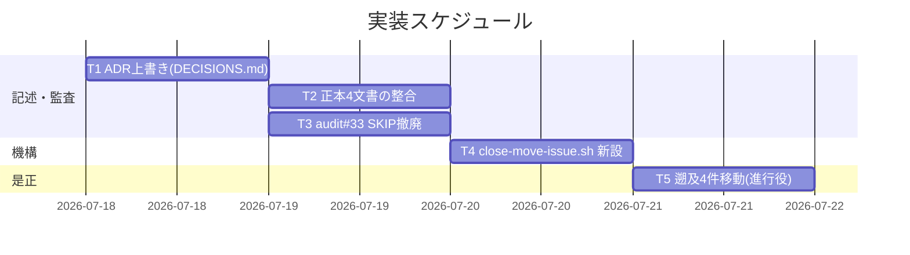

# 実装計画書: github_native モードでも完了 issue を close/ へ移動する

**プロジェクト名**: github_native モードでも完了 issue を close/ へ移動する
**作成日**: 2026 年 07 月 17 日
**最終更新**: 2026 年 07 月 17 日

> **重要**: **このドキュメントは常に更新**: 実装計画の変更、進捗状況の更新、バグの記録などがあった場合は、即座に更新してください。
> **必須項目**: 「必須」と明記した欄は空欄・抽象語のみで提出しないこと。
>
> **用語**: [.agent-skill-chain/source/CONCEPTS.md §用語規約](../../../../../.agent-skill-chain/source/CONCEPTS.md#用語規約) を参照。

---

## 1. 実装概要

### 1.1 実装方針（必須）

02_設計に従い、(1) 恒久 ADR 上書き、(2) 正本 4 文書の記述整合、(3) audit #33 の github_native SKIP 撤廃、(4) ヘルパースクリプト新設、(5) 遡及 4 件移動の 5 タスクを、最小差分・回帰安全（local_tracked/消費者不変）を守って実装する。コード変更（audit.sh・正本・スクリプト・DECISIONS.md）は worktree で行い commit する。遡及移動の非追跡 `mv` はメインツリーで進行役が実行する。

### 1.2 実装順序（必須: 1 件以上）



実装順序: T1（ADR）→ T2/T3（並行可・記述整合と監査）→ T4（スクリプト）→ T5（遡及移動）。T5 は T2〜T4 の記述・機構が揃ってから進行役が実行する。

---

## 2. タスク分解

**必須**: 各タスクに「テスト観点」（2.x.3）と「単体テスト仕様（BDD）」（2.x.4）を記載する。

### 2.1 タスク 1: 恒久 ADR の上書き（DECISIONS.md）

#### 2.1.1 概要（必須）

DECISIONS.md に ADR-137-1〜ADR-137-4 を 5 要素で追記し、ADR-S2-toggle/ADR-S2-5 の「github_native では close 移動不要」の該当部を「上書きする」旨で記録する（旧エントリは改変しない）。

#### 2.1.2 実装内容（必須: 1 件以上）

- DECISIONS.md 末尾「## ADR 記録」節へ ADR-137-1（再定義・上書き）・ADR-137-2（トリガー/実行主体/場所）・ADR-137-3（ヘルパースクリプト）・ADR-137-4（#33 再設計）を追記（02 §2.5 を転記・5 要素・evidence_source 付き）。
- DECISIONS.md 冒頭説明文（§7 相当「完了時も close/ 移動を行わず GitHub Issue の close で完結する」）を、「恒久判断は非追跡ドラフト破棄に備え本ファイルへ集約する」趣旨は残しつつ「close 移動を行わない」という事実記述を新方針へ是正。
- ADR-S2-toggle/ADR-S2-5 本文は改変せず、新 ADR 側から「上書きする」旨を参照。

#### 2.1.3 テスト観点（必須）

##### 単体（本タスクの具体ケース・必須 1 件以上）

- ADR-137-1〜4 が 5 見出し（コンテキスト/検討した選択肢/決定/根拠[evidence_source]/帰結）を満たす。
- ADR-S2-toggle/ADR-S2-5 の本文が改変されていない（git diff で旧エントリ本文の変更 0）。

##### 結合/API（該当時は必須 1 件以上）

- DECISIONS.md 冒頭説明と新 ADR・正本 4 文書の記述が矛盾しない（T2 と横断整合）。

##### E2E/受け入れ（未達時は理由記載）

- 該当なし（ドキュメント）。

##### バリデーション（該当する場合の具体ケース）

- 認証トークン実値・機密が含まれない。

#### 2.1.4 単体テスト仕様（BDD）（必須）

```gherkin
Feature: 恒久ADRの上書き
  Scenario: 新規ADRで旧判断を上書きする
    Given DECISIONS.md に ADR-S2-toggle・ADR-S2-5 が存在する
    When close移動をgithub_nativeでも行う決定を記録する
    Then ADR-137-1〜4 が5要素・evidence_source付きで追記される
    And 旧エントリ本文は改変されず履歴として残る
```

```bash
# Given: 変更前の ADR-S2-toggle/S2-5 本文を退避
# When: DECISIONS.md へ ADR-137-x を追記し冒頭説明を是正
# Then: 旧エントリ本文 diff 0・新ADRが5要素充足を grep/差分で確認
grep -c "evidence_source" <(sed -n '/ADR-137/,/^### ADR-138/p' docs/maintainer/decisions/DECISIONS.md)
```

#### 2.1.5 依存関係

- なし（先頭タスク）。T2/T3/T4 の記述整合・完了フェーズ転記の基点。

#### 2.1.6 見積もり

- **工数**: 1h／**優先度**: 高

### 2.2 タスク 2: 正本 4 文書の整合（github_native 分岐追加）

#### 2.2.1 概要（必須）

CORE.md・PHASES.md・run_command.md・project 自己拡張ワークフロー.md の「close 移動は local_tracked 専用／github_native では不要」記述を、「close 移動は整理整頓目的で両モード必要。github_native の人間関与点＝GitHub Issue close・実行場所＝メインツリー」へ整合させる。

#### 2.2.2 実装内容（必須: 1 件以上）

- **CORE.md §完了 issue の close 分離**（現行 143 行）: 「github_native では close 移動不要」を「両モードで close 移動する（整理整頓目的）。モード差は確定手段（人間関与点）にある」へ改める。宣言のみ・詳細は PHASES/project へ委譲（1 ファイル 1 責務）。
- **PHASES.md §完了 issue の close 移動**（現行 74 行の「local_tracked 専用」宣言）: 「本節は両モード共通。実行確定手段は GitHub Issue close（github_native）／PR マージ（local_tracked）で分岐」へ改める。「実行確定手段（分岐・原則）」（78 行）へ github_native 分岐（人間関与点＝GitHub Issue close、非追跡ドラフトは PR 差分に乗らず PR 経由確定が字義成立しない旨）を追記。
- **run_command.md §Constraints「Issue 追跡モード」**（現行 52 行「close 移動は local_tracked 専用」）: 「close 移動は整理整頓目的で両モード必要。確定手段のみモードで分岐」へ改める（抽象原則のみ・具体は project へ委譲）。
- **project 自己拡張ワークフロー.md**: (a) §Issue 追跡モードの本リポ運用（263/266 行「github_native では close 移動 PR 不要／close 移動は local_tracked 専用」）を是正、(b) §実行確定の 2 分岐 に**分岐 C（github_native）**を追加（GitHub Issue close をトリガー・進行役がメインツリーで `close-move-issue.sh` 実行・追跡=git mv は worktree+PR/非追跡=mv はメインツリー完結）、(c) 275 行「#33 は github_native で SKIP」を「#33 は両モードで有効（github_native は local 主体で発火・CI は非追跡ドラフト不在で no-op）」へ是正、(d) §close 移動時の相対リンク補正 に github_native の非追跡ドラフトも対象である旨を追記。
- 変更は既存 local_tracked 記述を**不変**のまま github_native 分岐を**追加**する形とし、二重定義を作らない。

#### 2.2.3 テスト観点（必須）

##### 単体（本タスクの具体ケース・必須 1 件以上）

- 4 文書に「github_native では close 移動しない／local_tracked 専用」と読める記述が残存しない（grep で 0 件）。
- local_tracked の close 移動フロー記述（PR マージ確定・direct push 禁止）が不変。

##### 結合/API（該当時は必須 1 件以上）

- CORE（宣言）→ PHASES（ライフサイクル）→ project（具体）の委譲チェーンで重複再定義が発生しない（各所は参照のみ）。

##### E2E/受け入れ（未達時は理由記載）

- 該当なし（ドキュメント）。

##### バリデーション（該当する場合の具体ケース）

- 相対リンクの深度が正しい（`../` 数）。

#### 2.2.4 単体テスト仕様（BDD）（必須）

```gherkin
Feature: 正本記述の整合
  Scenario: github_nativeでもclose移動する記述へ整合
    Given 4正本に「local_tracked専用/github_nativeでは不要」記述がある
    When close移動を両モード必要へ再定義する
    Then 4正本の該当記述が新方針へ更新される
    And local_tracked記述は不変で二重定義が生じない
```

```bash
# Given: 変更前の4正本
# When: github_native分岐を追記
# Then: 旧表現の残存0・local_tracked記述不変を grep/diff で確認
grep -rn "local_tracked 専用\|github_native.*close 移動.*行わない\|close 移動.*不要" \
  .agent-skill-chain/source/boot/CORE.md \
  .agent-skill-chain/source/workflow/PHASES.md \
  .agent-skill-chain/source/skills/agent/run_command.md \
  .agent-skill-chain/project/自己拡張ワークフロー.md
```

#### 2.2.5 依存関係

- T1（ADR）に整合。T3（#33）の記述（275 行）と一致させる。

#### 2.2.6 見積もり

- **工数**: 2h／**優先度**: 高

### 2.3 タスク 3: audit #33 の github_native SKIP 撤廃

#### 2.3.1 概要（必須）

`check_close_move_pending`（audit.sh 現行 1089–1131 行）冒頭の `resolve_issue_tracking_mode == github_native` 早期 return SKIP ブロック（1093–1096 行）と、その旨のコメント（1090–1092 行）・関数ヘッダーの「廃止済み」表現（1082–1083 行付近）を撤廃・是正する。関数本体（走査・grandfather・grace・FAIL メッセージ・`*/close/*` 除外）は不変。

#### 2.3.2 実装内容（必須: 1 件以上）

- 1093–1096 行の github_native 早期 return SKIP ブロックを削除。
- 関数コメント（0. モードガード・「close 移動運用は廃止済み」）を「両モードで検知する（github_native は local 主体で発火・CI は非追跡ドラフト不在で no-op）」趣旨へ是正。
- 冒頭ファイルヘッダー（35 行付近 #33 の説明）と 65 行の索引の文言を新挙動へ整合。
- `resolve_issue_tracking_mode`（1069–1077 行）は**変更しない**（#28 の SKIP 判定でも共用されるため）。
- **`.adapters` は手動同期しない（F4 是正）**: `.adapters/` は `.gitignore` 対象・git 非追跡であり `build-adapters.sh` が「出力は 100% 生成物・手で編集しない」と明記する生成物である。audit.sh の変更は正本 `.agent-skill-chain/source/enforcement/ci/audit.sh` のみ編集し、`.adapters/*/…/audit.sh` は手編集しない（再生成は `build-adapters.sh`／release フローが担う）。手動ミラー同期の記述は誤り。

#### 2.3.3 テスト観点（必須）

##### 単体（本タスクの具体ケース・必須 1 件以上）

- ISSUE_TRACKING_MODE=github_native + github.com remote 下で、完了済み・未移動・猶予超過のトップレベル issue（FS 上に 04_review.md が存在）を #33 が FAIL 検知する。
- close/ 配下へ移動済みの issue は `*/close/*` 除外で FAIL しない。

##### 結合/API（該当時は必須 1 件以上）

- **local_tracked 非回帰（最重要）**: 変更前後の audit.sh を同一 workflow.db・同一ディレクトリ・ISSUE_TRACKING_MODE=local_tracked（既定）で実行し FAIL 集合が完全一致（差分 0）。
- github_native CI 相当（追跡ファイルのみ・非追跡 04_review.md 不在）で #33 が対象 0 件＝no-op。

##### E2E/受け入れ（未達時は理由記載）

- tmp 隔離（`git archive`＋`git init`＋github.com remote＋非追跡ドラフト実作成）で AC を確認（ADR-S2-7 手法）。

##### バリデーション（該当する場合の具体ケース）

- env unset/未知値→local_tracked、非 github remote→local_tracked で従来検知が有効。

#### 2.3.4 単体テスト仕様（BDD）（必須）

```gherkin
Feature: audit #33 の github_native 検知
  Scenario: github_nativeで未移動の完了issueを検知する
    Given ISSUE_TRACKING_MODE=github_native かつ github.com remote
    And verify-and-close完了だが close/未移動・猶予超過の issue が FS に存在
    When audit.sh を実行する
    Then #33 が当該 issue を FAIL 検知する（SKIP しない）

  Scenario: local_tracked 非回帰
    Given 同一 workflow.db・同一ディレクトリ・ISSUE_TRACKING_MODE=local_tracked
    When 変更前後の audit.sh を実行する
    Then FAIL 集合が完全一致（差分0）する
```

```bash
# Given: tmp隔離リポ + github.com remote + 非追跡04_review + verify-and-close証跡
# When: ISSUE_TRACKING_MODE=github_native で audit 実行
# Then: #33 FAIL 行が出る
ISSUE_TRACKING_MODE=github_native bash audit.sh 2>&1 | grep "close 移動未実施"
# 回帰: local_tracked で変更前後 diff 0
diff <(ISSUE_TRACKING_MODE=local_tracked bash audit_old.sh 2>&1 | grep FAIL | sort) \
     <(ISSUE_TRACKING_MODE=local_tracked bash audit_new.sh 2>&1 | grep FAIL | sort)
```

#### 2.3.5 依存関係

- T2（project 275 行の記述）と一致させる。

#### 2.3.6 見積もり

- **工数**: 1.5h／**優先度**: 高

### 2.4 タスク 4: ヘルパースクリプト `close-move-issue.sh` 新設

#### 2.4.1 概要（必須）

`.agent-skill-chain/source/scripts/close-move-issue.sh` を新設。単一 issue を追跡=`git mv`／非追跡=`mv` でファイル単位に `close/<issue>/` へ移動する Command（メインツリー実行ガード・衝突ガード付き）。

#### 2.4.2 実装内容（必須: 1 件以上）

- 引数 `<issue-dir>` 検証（存在・workflow 直下）。
- メインツリーガード（worktree 実行拒否。ADR-132-1 の sentinel パターンと一貫・非 git/解決失敗は安全側エラー）。
- 衝突ガード（`close/<issue>/` 既存ならエラー）。
- ファイル単位移動（`git ls-files` で追跡判定 → 追跡=`git mv`／非追跡=`mkdir -p`+`mv`、空元ディレクトリ削除）。
- 移動確認出力（`git status` パスのみ・close/ 配下は読まない）。
- **`.adapters` は手動同期しない（F4 是正）**: 新設スクリプトの正本は `.agent-skill-chain/source/scripts/close-move-issue.sh` のみ。`.adapters/` は生成物（`build-adapters.sh` が再生成・手編集しない・git 非追跡）であり手動でミラーを作らない。
- BDD 検証スクリプト（tmp 隔離）を issue の `tests/` 相当に用意。

#### 2.4.3 テスト観点（必須）

##### 単体（本タスクの具体ケース・必須 1 件以上）

- 全追跡ディレクトリ → 全ファイルが `git mv`（index に rename 記録）。
- 全非追跡ディレクトリ → 全ファイルが `mv`（git 非関与）。
- 混在ディレクトリ（追跡+非追跡）→ ファイル単位で使い分け、移動後に元ディレクトリが空で削除される。
- worktree で実行 → ガード発火し非 0 終了・移動しない。
- 移動先 `close/<issue>/` 既存 → エラー・非 0。

##### 結合/API（該当時は必須 1 件以上）

- 引数なし・対象不存在・非 git ツリーで非 0 終了。

##### E2E/受け入れ（未達時は理由記載）

- tmp 隔離で混在ケース（追跡ファイル＋非追跡ファイルが同一 dir に混在。#115 相当＝ほぼ全追跡＋非追跡 04_review.md 1 件、および将来の 00-04 非追跡＋tests 追跡）を再現し、ファイル単位で追跡=git mv・非追跡=mv になることを git status で確認。

##### バリデーション（該当する場合の具体ケース）

- パスにスペース・日本語を含むディレクトリ名で正しく move。

#### 2.4.4 単体テスト仕様（BDD）（必須）

```gherkin
Feature: close-move-issue.sh のファイル単位移動
  Scenario: 混在ディレクトリをファイル単位で移動する
    Given issue-dir にトップレベル追跡ファイルと配下非追跡ドラフトが混在する
    And メインツリーで実行する
    When close-move-issue.sh <issue-dir> を実行する
    Then 追跡ファイルは git mv・非追跡ファイルは mv で close/ 配下へ移動される
    And 元ディレクトリは空になり削除される

  Scenario: worktree実行はガードで拒否
    Given カレントが worktree（非追跡ドラフトが不在）
    When close-move-issue.sh を実行する
    Then ガードが発火し非0終了・移動は行われない
```

```bash
# Given: tmp隔離リポに追跡+非追跡混在の issue-dir を用意
# When: メインツリーで close-move-issue.sh 実行
# Then: git status で追跡=renamed・非追跡=?? 消失（close/へ移動）を確認、元dir削除
bash close-move-issue.sh docs/maintainer/workflow/<issue>
git status --porcelain | grep -E "^R|close/"
test ! -d docs/maintainer/workflow/<issue>   # 元dir削除
```

#### 2.4.5 依存関係

- T3（#33）の `*/close/*` 除外と整合（移動後は検知対象外）。

#### 2.4.6 見積もり

- **工数**: 3h／**優先度**: 中

### 2.5 タスク 5: 遡及 4 件の是正移動（進行役実行）

#### 2.5.1 概要（必須）

CLOSED 済み 4 件を close/ へ移動する。**実行主体は進行役（メインツリー操作・外部確定を担う）**。全追跡（#119/#127）=worktree+PR の `git mv`（スクリプト不使用）、全非追跡（#132）=メインツリー `mv`（スクリプト）、混在（#115＝16 追跡＋非追跡 1 件）=追跡分 worktree+PR git mv／非追跡分メインツリー mv の 2 経路。

#### 2.5.2 実装内容（必須: 1 件以上）

- **移動前（元の場所・deny 対象外）**: 各 issue の相対リンク補正・close/ 外側からの既存参照補正（project §close/ の外側からの既存参照の補正）を完結。
- **#119・#127（全追跡・ドラフトが追跡＝worktree に実在）**: **本スクリプトは使わず**、通常の worktree+PR フローで `git mv` → commit → PR → マージ（direct push 禁止）。ガード付き `close-move-issue.sh` は worktree 実行を拒否するため全追跡 dir には用いない（そもそも非追跡ドラフトが無く不要）。
- **#132（全非追跡・メインツリーのみに実在）**: メインツリーで `close-move-issue.sh`（追跡ファイル 0 件のため `mv` のみ発火）→ git 非関与の FS 移動（PR 対象外）。
- **#115（混在＝16 追跡＋非追跡 1 件）**: #115 は**トップレベル 00〜04 を持たない親ワークフロー dir**（直下は `90_issues.md`＝**追跡**と `90_issues/`）。**唯一の非追跡ファイルは `90_issues/20260716_174958_S-2本リポgithub_native採用/04_review.md` の 1 件**。よって処理は 2 経路に分割する: (i) 追跡 16 ファイル（`90_issues.md`・`90_issues/` の 3 サブ issue のドラフト・tests）は worktree+PR の `git mv`（分岐 A・direct push 禁止）、(ii) 非追跡 1 件はメインツリーで**素の `mv`（当該 1 ファイルのみ）**。**`90_issues.md` は追跡なので `mv` ではなく `git mv`（履歴 move 保持）**である点に注意（旧記述の「90_issues.md はメインツリー mv」は誤り）。**#115 では whole-dir の `close-move-issue.sh` を使わない**（whole-dir 実行は追跡 16 も `git mv` でメインツリー index にステージしてしまい、追跡分を worktree+PR で確定する (i) の経路と衝突するため）。スクリプトを使うのは全非追跡の #132（追跡 0 件＝`mv` のみ発火で安全）に限る。2 経路の移動先はいずれも同一 `close/20260715_160558_.../` とし、追跡分の PR マージと非追跡分の FS mv が揃って初めて #115 全体の移動が完了する。
- **移動後**: `git status`／`git log --stat`（パスのみ）で確認。close/ 配下は Read/Grep/Glob しない。

#### 2.5.3 テスト観点（必須）

##### 単体（本タスクの具体ケース・必須 1 件以上）

- 4 ディレクトリが `workflow/` 直下（close/ を除く）に存在しない。
- 追跡分は `git log --follow` で move が追える（履歴保持）。

##### 結合/API（該当時は必須 1 件以上）

- 移動後に audit #33 が 4 件を FAIL しない（close/ 配下＝除外）。

##### E2E/受け入れ（未達時は理由記載）

- `ls docs/maintainer/workflow/` に 4 件が無く、`docs/maintainer/workflow/close/` に 4 件がある（内容は読まずパスのみ）。

##### バリデーション（該当する場合の具体ケース）

- #115 の非追跡サブドラフトが喪失していない（メインツリー FS に close/ 配下でパス確認）。

#### 2.5.4 単体テスト仕様（BDD）（必須）

```gherkin
Feature: 遡及4件の是正移動
  Scenario: 混在#115をファイル単位で移動する
    Given #115 は 16 追跡（90_issues.md・90_issues/配下）＋非追跡1件（S-2サブissueの04_review.md）の混在
    When 追跡分をworktree+PR git mv・非追跡分をメインツリーmvで移動する
    Then #115 が workflow/直下から消え close/配下に存在する
    And 追跡分は履歴move記録・非追跡分は喪失なし

  Scenario: 非追跡#132をメインツリーmvで移動する
    Given #132 は全非追跡でメインツリーのみに実体
    When メインツリーで移動する
    Then mv で close/配下へ移動し workflow/直下に#132が無い
```

```bash
# Then: 4件が workflow/直下に無く close/ 配下にある（パスのみ・内容非読）
for d in 20260715_160558_issue運用ポリシー全面移行 20260716_013937_worktree運用規律 \
         20260717_071859_デザイナー視点組込 20260717_124638_workflow-db監査証跡のworktree横断完全性; do
  test ! -e "docs/maintainer/workflow/$d"        # 直下に無い
  test -e  "docs/maintainer/workflow/close/$d"   # close配下にある
done
```

#### 2.5.5 依存関係

- T2（記述）・T3（#33）・T4（スクリプト）完了後。進行役が実行（外部書き込み操作の実行主体・非追跡はメインツリー）。

#### 2.5.6 見積もり

- **工数**: 2h／**優先度**: 中

---

## テスト観点

- **回帰安全（最重要）**: local_tracked で変更前後 audit の FAIL 集合差分 0（T3）。
- **正当検知**: github_native で未移動完了 issue を #33 が local 発火（CI は no-op）。
- **機構正確性**: ヘルパースクリプトが追跡/非追跡/混在をファイル単位で正しく move・worktree ガード発火。
- **正本整合**: 4 正本 + DECISIONS.md + #33 コメントが新方針で矛盾なし（旧表現残存 0）。
- **遡及**: 4 件が close/ 配下・workflow 直下残留 0・追跡履歴保持・非追跡喪失なし。
- **非波及**: 配布物既定 local_tracked 不変・新スクリプト opt-in。

## 単体テスト

- audit #33: tmp 隔離での github_native FAIL 検知／local_tracked diff 0。
- `close-move-issue.sh`: 全追跡・全非追跡・混在・worktree ガード・衝突ガードの各ケース（tmp 隔離）。
- DECISIONS.md/正本: 5 要素充足・旧エントリ diff 0・旧表現残存 0 の grep/diff 検証。

## BDD

- 各タスク §2.x.4 の gherkin を参照（01_要件定義 §2.2 のユースケース 1〜4 と対応）。

---

## 3. 実装スケジュール

### 3.1 マイルストーン

| マイルストーン | 期日 | 成果物 |
| -------------- | ---- | ------ |
| 記述・監査整合 | Day1 | DECISIONS.md ADR-137-x・正本 4 文書・audit #33 |
| 機構 | Day1–2 | close-move-issue.sh + BDD 検証 |
| 是正 | Day2 | 遡及 4 件 close/ 移動（進行役） |

### 3.2 実装フェーズ

#### フェーズ 1: 記述・監査

- **タスク**: T1（ADR）・T2（正本）・T3（#33）

#### フェーズ 2: 機構・是正

- **タスク**: T4（スクリプト）・T5（遡及移動・進行役）

---

## 4. テスト計画

### 4.1 テストの優先順位

- **最優先**: local_tracked 非回帰（差分 0・独立検証）。
- **高**: github_native #33 検知・スクリプト混在処理・正本整合。
- 影響範囲が広い audit.sh・正本は回帰確認を必ず含める。tmp 隔離で本番自己リポを汚さない（2026-07-11 誤 uninstall 事故防止）。

---

## 5. リスク管理

### 5.1 実装リスク

- **リスク**: worktree で遡及移動を試み、非追跡ドラフトが不在で空振り/不完全になる（#132 workflow.db 問題と同型）。
  - **対策**: ヘルパースクリプトのメインツリーガード＋「非追跡はメインツリー実行」を正本・03 に明記。
- **リスク**: #115 の混在を取り違え、追跡へ `mv`／非追跡へ `git mv` して履歴喪失・失敗。
  - **対策**: スクリプトがファイル単位で `git ls-files` 判定し自動使い分け。
- **リスク**: 移動後の close/ 配下が deny で読めずリンク補正検証が不能。
  - **対策**: 補正・検証を移動前に完結（既存 project 手順厳守）。移動後は git status のパス確認のみ。
- **リスク**: #33 SKIP 撤廃が local_tracked に波及。
  - **対策**: 撤廃は github_native 早期 return のみ（local_tracked 経路に元々無い）。変更前後 diff 0 を独立検証。

---

## 6. 参考資料

### プロジェクトドキュメント

- [`02_設計.md`](./02_設計.md) - 設計
- [`01_要件定義.md`](./01_要件定義.md) - 要件定義
- `docs/maintainer/decisions/DECISIONS.md`・`.agent-skill-chain/source/enforcement/ci/audit.sh`・正本 4 文書（02 §10 参照）

---

## 7. 前のステップ

- **前**: [`02_設計.md`](./02_設計.md) - 設計フェーズ

---

## 8. 次のステップ

この実装計画書の承認後、以下に進みます：

- **次工程（必須ゲート）**: review-docs（実装前ドキュメントレビュー・full モードのため免除されない）。その後 implement-feature（execution）へ進む。
- 本 issue はサブ issue 分割不要（単一 issue として実装）。90_issues.md は作成しない。

**用語**: [.agent-skill-chain/source/CONCEPTS.md §用語規約](../../../../../.agent-skill-chain/source/CONCEPTS.md#用語規約) を参照。
